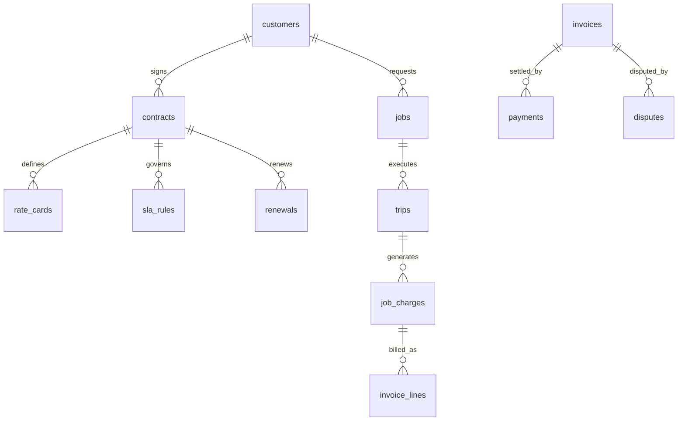
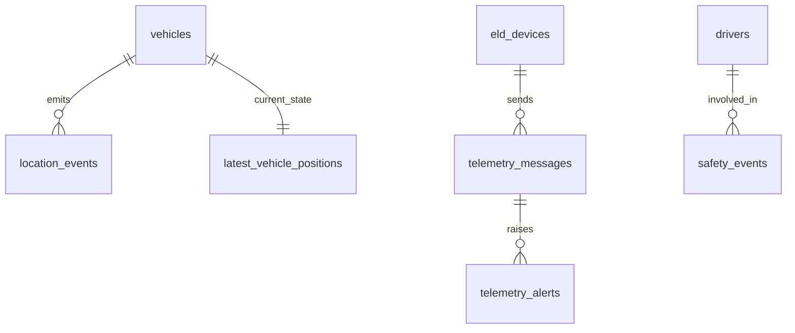
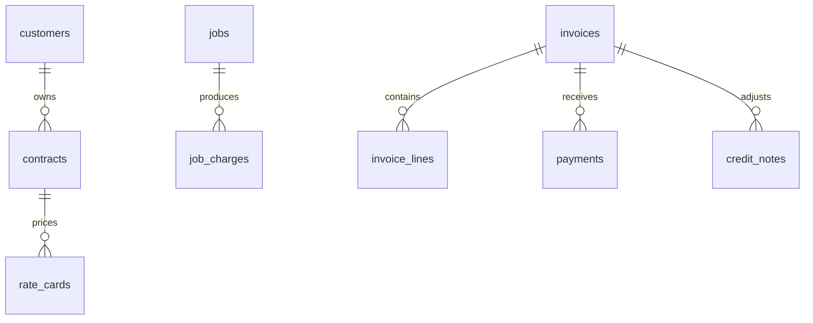
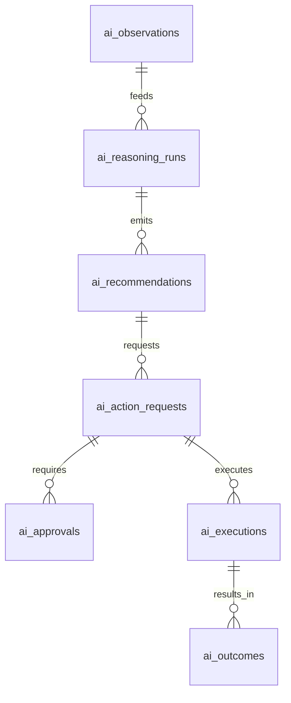
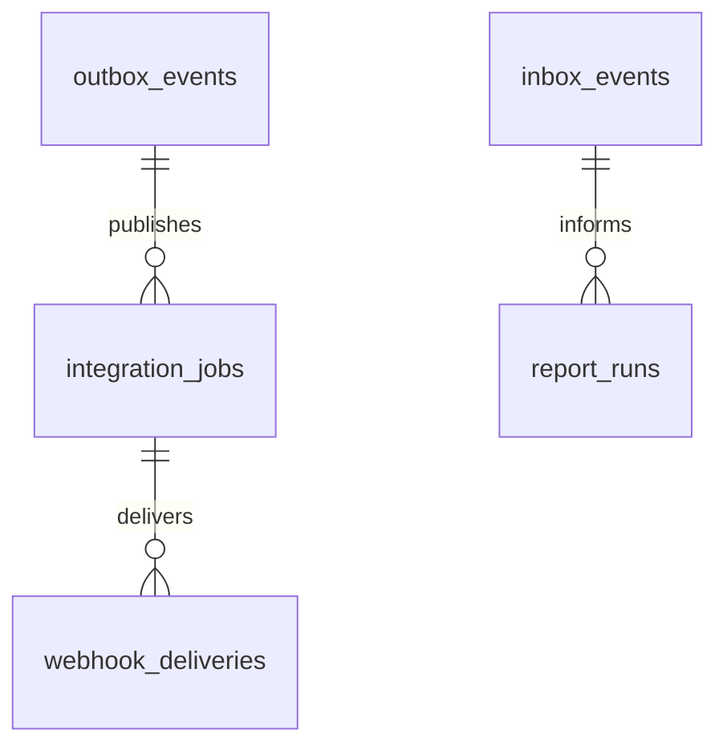

# OpsTrax Master ERD - PostgreSQL

## Layer 1 - Platform Admin / SaaS Control
Entities: `platform_roles`, `platform_role_permissions`, `platform_admins`, `platform_sessions`, `platform_audit_log`, `packages`, `tenant_subscriptions`, `tenant_entitlements`, `platform_invoices`, `platform_impersonation_sessions`

## Layer 2 - Tenant Organization / RBAC / Security
Entities: `companies`, `users`, `roles`, `permissions`, `user_sessions`, `audit_logs`, `feature_flags`

## Layer 3 - Customer / CRM / Sales / Contracts
Entities: `customers`, `contacts`, `leads`, `opportunities`, `quotes`, `quote_approvals`, `contracts`, `contract_versions`, `rate_cards`, `sla_rules`

## Layer 4 - Revenue / Finance / Billing / Profitability
Entities: `job_charges`, `invoice_headers`, `invoice_lines`, `payments`, `credit_notes`, `disputes`, `ar_aging_snapshots`, `revenue_events`, `job_costs`, `trip_costs`, `margin_snapshots`, `renewals`

## Layer 5 - Fleet Master Data
Entities: `vehicles`, `drivers`, `assets`, `yards`, `depots`, `customers` links, `vehicle_assignments`

## Layer 6 - IoT / Devices / Telematics / Live Map
Entities: `eld_devices`, `device_keys`, `telemetry_messages`, `location_events`, `latest_vehicle_positions`, `telemetry_alerts`, `telemetry_rules`

## Layer 7 - Dispatch / Jobs / Trips / POD
Entities: `jobs`, `trips`, `route_plans`, `stops`, `proof_of_delivery`, `dispatch_assignments`

## Layer 8 - Maintenance / Fleet Health
Entities: `work_orders`, `pm_plans`, `defects`, `fault_codes`, `maintenance_events`, `fleet_health_snapshots`

## Layer 9 - Alerts / Notifications
Entities: `alert_rules`, `alerts`, `alert_follow_up_tasks`, `notifications`, `notification_deliveries`

## Layer 10 - Safety / Dashcam / Incidents / Evidence
Entities: `safety_events`, `coaching_tasks`, `incidents`, `dashcam_clips`, `evidence_packages`

## Layer 11 - Compliance / Audit Readiness
Entities: `compliance_profiles`, `violations`, `inspection_records`, `document_requirements`, `audit_findings`, `retention_policies`

## Layer 12 - Autonomous AI / LLM Intelligence
Entities: `ai_observations`, `ai_reasoning_runs`, `ai_recommendations`, `ai_action_requests`, `ai_approvals`, `ai_executions`, `ai_outcomes`, `ai_memory`, `ai_prompt_templates`, `ai_usage_logs`

## Layer 13 - Files / Integrations / Event Bus / Reporting
Entities: `files`, `document_links`, `integration_connections`, `integration_jobs`, `webhook_deliveries`, `outbox_events`, `inbox_events`, `report_definitions`, `report_runs`

## Canonical Flow
Customer -> Contract -> Job -> Trip -> Charge -> Invoice -> Payment -> Margin -> Renewal

## Mermaid - Core Business ERD

## Mermaid - Fleet / IoT ERD

## Mermaid - Revenue / Finance ERD

## Mermaid - AI Autonomy ERD

## Mermaid - Event Bus ERD

