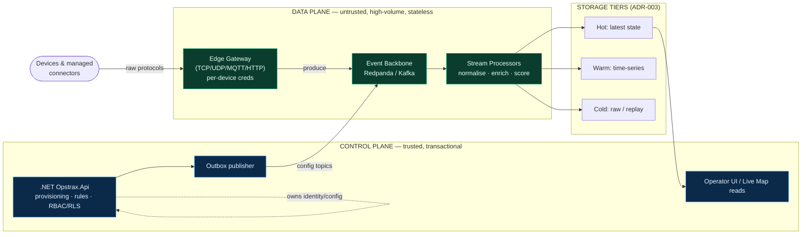

# ADR-001 — Split the Telematics Data Plane from the Control Plane

- **Status:** Proposed
- **Date:** 2026-07-12
- **Deciders:** Principal Telematics Architect, Distributed Systems Architect
- **Target posture:** Full cloud-native
- **Supersedes:** none
- **Related:** ADR-002 (event backbone), ADR-003 (storage tiers), ADR-004 (gateway hosting)

## Context — verified current state

OpsTrax telemetry today is a **single-tier monolith over a single HTTP web service and a single transactional database**. The verified facts (see `render.yaml`, `backend-dotnet/Controllers/EndpointMappings.cs::GpsTrackerIngest`, `database/migrations/2026_06_28_stage12a_telemetry_live_state.sql`):

| Concern | Verified current implementation |
|---|---|
| Ingress | `render.yaml` defines only `type: web` services (`opstrax-api`, `opstrax-events`). Render `web` terminates HTTP/HTTPS only — **there is no raw-TCP listener**. Devices that speak binary GPS-tracker protocols (Teltonika/Queclink/Concox over TCP) cannot connect at all; the only ingest path is an HTTP `POST` from a hypothetical HTTP-speaking gateway. |
| Auth | `GpsTrackerIngest` validates every ping against **one global** `Telemetry:GatewaySecret` via HMAC `X-Gateway-Signature` + a 300s timestamp window. **One shared secret for the entire fleet across all 4 tenants.** Compromise of any gateway or a leak of that env var forges traffic for every device of every tenant. |
| State store | The **transactional business DB (Neon Postgres) is the only store.** The live-state projection (`latest_vehicle_positions`, `telemetry_live_asset_states`), the breadcrumb log (`location_events`), and alerts (`telemetry_alerts`) all live in the same Postgres instance that serves dispatch, invoicing, and RLS-scoped business reads. |
| Provenance | `latest_vehicle_positions` carries ad-hoc `source_channel` / `source_event_id` columns but **no authoritative provenance/trust column**. The live map cannot distinguish a real device fix from a simulator-generated point (`TelemetrySimulatorBackgroundService`) or an interpolated/stale one. |
| Processing | Ingest handler does auth → parse → enrichment → RLS write → live-state upsert **synchronously, inline, in the request thread**, inside the business DB's connection pool. |

The consequence: the **write path of untrusted, high-cardinality, bursty device traffic is coupled to the read path of the revenue-critical business system.** A device storm, a bad firmware rollout, or a replay attack degrades dispatch and billing. There is no isolation boundary, no independent scaling axis, and no way to reason about the two workloads separately.

## Decision

**Split the telematics system into two independently-owned, independently-scaled planes with a hard contract between them.**

### Data plane (device-facing, high-volume, untrusted)
Owns everything from the wire to durable landed events. Optimised for throughput, back-pressure, and blast-radius containment. Stateless and horizontally scalable. Members:

- **Edge Gateway** — terminates raw device protocols (TCP/UDP/MQTT) and HTTP. Lives on a TCP-capable host, **not** Render web (see ADR-004). Per-device / per-tenant credentials replace the single global secret. Decodes to a canonical envelope, does cheap validation and de-duplication, and **produces to the event backbone** — it never writes the business DB.
- **Event backbone** — Redpanda/Kafka topics are the durable system of record for raw device traffic and the seam between the planes (see ADR-002).
- **Stream processors** — stateless consumers that normalise, geo-enrich, run rules/scoring, and fan out to the storage tiers (see ADR-003). They own the *only* writers into telemetry storage.

### Control plane (operator-facing, transactional, trusted)
The existing **.NET `Opstrax.Api`** stays the transactional authority for the business domain — dispatch, jobs, customers, finance, RBAC/RLS, device *provisioning* and *lifecycle*. It:

- Owns device identity, credential issuance/rotation, geofence and rule definitions, and tenant configuration.
- Publishes those definitions to the data plane via the **transactional outbox** (ADR-002) — its DB is never read directly by data-plane workers.
- Serves the operator UI and the live-map reads **from the hot store / a read model**, not from the ingest write path.

### The contract between planes
1. **The event backbone is the only coupling.** Neither plane reaches into the other's database.
2. **Traffic flows device → data plane → backbone → storage tiers → read model → control-plane reads.** Control-plane config flows the other way *only* via outbox → backbone.
3. **Every record crossing the seam carries provenance** (`origin`, `trust_tier`, `producer`, `schema_version`, `correlation_id`) — closing the provenance gap (ADR-003 defines the taxonomy, `architecture.md` the map legend).

## Rationale

- **Blast-radius isolation.** A device storm or forged-traffic flood now saturates the gateway and backbone (designed for it, with back-pressure), not the Postgres pool that dispatch and billing depend on.
- **Independent scaling.** Ingest scales with *device count and ping rate*; the control plane scales with *operator/API load*. Coupling them forces the expensive one to size for the sum.
- **Security surface.** Untrusted device I/O is quarantined in a hardened, minimal-privilege tier. Per-device credentials (ADR-004) make revocation surgical instead of fleet-wide.
- **Replaceability.** Protocol decoders, enrichment, and scoring evolve as independent deployables without redeploying the transactional API.
- **Correctness of the live map.** With provenance flowing across the seam, the UI can finally tell operators whether a dot is a fresh real fix, stale, interpolated, or simulated — instead of implying they are all equally trustworthy.

## Consequences

**Positive**
- Device traffic can no longer take down the business system.
- Each plane has one clear owner, one scaling axis, one security posture.
- The provenance and per-device-credential gaps are structurally closed, not patched.

**Negative / costs**
- Net-new infrastructure: the backbone (ADR-002), the gateway host (ADR-004), and the hot/warm/cold tiers (ADR-003). More moving parts and more to operate.
- Eventual consistency between ingest and the read model (sub-second target, but no longer a single synchronous transaction).
- Migration effort: the inline `GpsTrackerIngest` path must be strangled — dual-write to the backbone first, then cut the direct DB write.

**Neutral**
- The .NET control plane keeps most of its current responsibilities; it *sheds* the ingest write path and *gains* the outbox publisher.

## Alternatives considered

1. **Keep the monolith, just add a queue inside the .NET app.** Rejected: an in-process queue on Render web still can't accept raw TCP, still shares the Postgres pool, and still has one global secret. It hides the coupling instead of removing it.
2. **Vertically scale Postgres and the web service.** Rejected: buys headroom, not isolation. The read/write coupling and the single-secret / no-provenance defects remain.
3. **Managed telematics SaaS (Samsara/Motive) as the only path.** Rejected as the *architecture* (a connector already exists, `Services/Connectors/SamsaraSync.cs`); OpsTrax needs to own native-device ingest for tenants bringing their own hardware. The split lets managed connectors and native devices land on the *same* backbone as just two more producers.

## Target boundary (mermaid)

The dashed line marks the **only** legal coupling: config crosses the seam through the backbone (outbox), never by cross-database reads.
