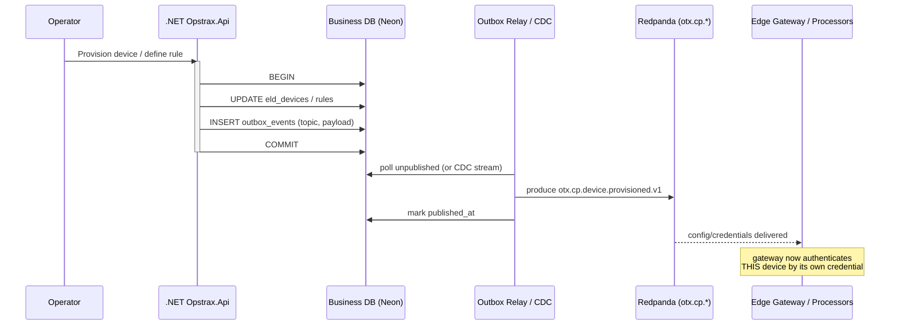

# ADR-002 — Redpanda / Kafka as the Telematics Event Backbone

- **Status:** Proposed
- **Date:** 2026-07-12
- **Deciders:** Distributed Systems Architect, Principal Telematics Architect
- **Target posture:** Full cloud-native
- **Related:** ADR-001 (plane split), ADR-003 (storage tiers), ADR-004 (gateway hosting)

## Context — verified current state

There is **no event backbone today.** The verified path (`backend-dotnet/Controllers/EndpointMappings.cs::GpsTrackerIngest`) is: HTTP `POST` → HMAC check against the one global `Telemetry:GatewaySecret` → synchronous `INSERT` into `location_events` and `UPSERT` into `latest_vehicle_positions` / `telemetry_live_asset_states`, **all inside the request thread against the transactional Neon Postgres.** The **business DB is the de-facto message bus**: fan-out to alerts, scoring, and the live map happens by additional reads/writes against the same tables.

This is the classic "database-as-a-queue" anti-pattern at the worst possible place — the revenue system's primary store. It gives us: no replay, no independent consumers, no back-pressure, coupling of ingest throughput to OLTP lock/vacuum behaviour, and a fan-out cost that grows with every new telemetry feature.

## Decision

**Adopt Redpanda (Kafka API-compatible) as the durable event backbone and the system of record for device traffic and cross-plane events. The business database is explicitly forbidden from being the bus.**

- **Redpanda** for the target: Kafka wire protocol (so every Kafka client, Connect, and the ecosystem work unchanged), no ZooKeeper/JVM, lower operational surface, single-binary tiered storage. Managed Redpanda Cloud or self-hosted on the same TCP-capable cluster as the gateway (ADR-004). **"Kafka" below means the Kafka protocol; the implementation is Redpanda.**
- **Partitioning key = `device_id`** (falling back to `vehicle_id`) so all events for one asset are ordered on one partition.
- **Tenant isolation** via a `company_id` header on every record + ACLs; large tenants may get dedicated topics via a topic-prefix convention. Consumers must still honour tenant scope (the control plane's RLS boundary does not extend into Kafka).
- **Schema Registry** (Avro/Protobuf) enforces the contracts below; `schema_version` travels on every record.

### Why the business DB must NOT be the bus

1. **Coupling of failure domains.** Today an ingest spike contends for the same Postgres connection pool, locks, and autovacuum cycles as dispatch and billing. A queue *inside* the OLTP store means device load and business load share one failure domain — exactly what ADR-001 splits apart. Kafka is built for high-write, high-fan-out, append-only traffic; Postgres OLTP is not.
2. **No replay / no rewind.** A row consumed and updated is gone. Kafka retains the ordered log, so a new consumer (a new scoring model, a backfill, a bug fix) replays history from an offset. The DB-as-bus cannot reprocess the past without a bespoke ETL.
3. **Fan-out cost.** Each new telemetry consumer against the DB is another query load on the OLTP primary. On Kafka, consumers are independent consumer groups reading the same log at zero incremental cost to producers or to each other.
4. **Back-pressure & buffering.** Kafka absorbs bursts durably; the DB-as-bus turns a burst into lock contention and 500s on the ingest path (which is why the current inline write is fragile).
5. **Ordering & idempotency guarantees** live in the log (per-partition order, keyed compaction, exactly-once semantics via transactions/idempotent producers) rather than being reinvented with DB advisory locks and `idempotency_key` columns.
6. **Ownership.** The bus is data-plane infrastructure; the business DB is control-plane state. Conflating them violates the ADR-001 seam.

The DB keeps doing what it is good at: transactional business state and the outbox. It is never the transport.

## The 16 topic contracts

Naming: `otx.<plane>.<domain>.<event>.v<major>`. Key = `device_id` unless noted. All carry the standard envelope header set: `event_id`, `tenant/company_id`, `correlation_id`, `causation_id`, `schema_version`, `producer`, `occurred_at`, `origin`, `trust_tier` (provenance — see ADR-003).

### Ingest / data-plane topics (produced by the Edge Gateway & processors)

| # | Topic | Produced by | Key | Retention | Purpose |
|---|---|---|---|---|---|
| 1 | `otx.dp.telemetry.raw.v1` | Edge Gateway | device_id | 7d + tiered→cold | Verbatim decoded device frame; the immutable raw landing zone (feeds cold replay, ADR-003). |
| 2 | `otx.dp.telemetry.position.v1` | Normalizer | device_id | 30d | Canonical position fix (lat/lng/speed/heading/ts + provenance). |
| 3 | `otx.dp.telemetry.status.v1` | Normalizer | device_id | 30d | Ignition, battery/`battery_voltage`, GSM/GPS health, odometer, engine state. |
| 4 | `otx.dp.telemetry.enriched.v1` | Enricher | device_id | 30d | Position + reverse-geocode/address-cache + geofence hits + map-match. |
| 5 | `otx.dp.telemetry.deadletter.v1` | any DP consumer | event_id | 30d | Undecodable/failed-validation frames with error metadata; nothing is dropped silently. |
| 6 | `otx.dp.telemetry.dedup.v1` (compacted) | Gateway | idempotency_key | compact | Idempotency ledger for exactly-once landing across gateway replicas. |

### Domain-event topics (produced by stream processors)

| # | Topic | Produced by | Key | Retention | Purpose |
|---|---|---|---|---|---|
| 7 | `otx.dp.geofence.transition.v1` | Geofence processor | vehicle_id | 90d | Enter/exit against tenant polygons (`stage31_polygon_geofences`). |
| 8 | `otx.dp.safety.event.v1` | Scoring processor | vehicle_id | 365d | Harsh brake/accel/speeding/idling; feeds `safety_events` + the AI `system_insight`. |
| 9 | `otx.dp.trip.lifecycle.v1` | Trip processor | vehicle_id | 365d | Trip start/stop/segment (replaces `TripBackgroundService` polling). |
| 10 | `otx.dp.eta.updated.v1` | ETA processor | assignment_id | 30d | Recomputed ETA per dispatch assignment. |
| 11 | `otx.dp.alert.raised.v1` | Rules processor | vehicle_id | 90d | Operational alerts → `telemetry_alerts`. |
| 12 | `otx.dp.livestate.changed.v1` (compacted) | Live-state projector | vehicle_id | compact | Latest-state changelog; source for the hot store & live-map read model. |

### Control-plane / outbox topics (produced by `Opstrax.Api` via the outbox)

| # | Topic | Produced by | Key | Retention | Purpose |
|---|---|---|---|---|---|
| 13 | `otx.cp.device.provisioned.v1` (compacted) | Control plane outbox | device_id | compact | Device identity, IMEI (`stage32_device_imei`), tenant binding, **per-device credential** material/rotation — gateway consumes this to auth devices (kills the single global secret). |
| 14 | `otx.cp.geofence.defined.v1` (compacted) | Control plane outbox | geofence_id | compact | Geofence polygon definitions pushed to the geofence processor. |
| 15 | `otx.cp.rule.defined.v1` (compacted) | Control plane outbox | rule_id | compact | Alert/scoring rule + threshold config pushed to processors. |
| 16 | `otx.cp.tenant.config.v1` (compacted) | Control plane outbox | company_id | compact | Tenant flags, retention policy, connector settings (e.g. Samsara) for the data plane. |

Compacted topics act as replayable, always-current **config snapshots** — a new processor bootstraps its world by replaying the compacted topic from offset 0, no cross-DB read.

## The transactional outbox (control plane → backbone)

The control plane must publish config/identity changes **atomically with its own DB writes**, without a distributed transaction against Kafka. Pattern:

1. Inside the same Postgres transaction that mutates `eld_devices` / geofences / rules, `Opstrax.Api` inserts a row into an `outbox_events` table (aggregate id, topic, payload, headers, `created_at`, `published_at NULL`).
2. A **relay** (background dispatcher or Debezium CDC on the `outbox_events` table) reads unpublished rows in order and produces to topics 13–16, marking `published_at`.
3. Idempotent producer + `event_id` dedupe make re-delivery safe (at-least-once relay → effectively-once consume).

**Why outbox, not dual-write:** a naive "write DB then produce to Kafka" loses events on a crash between the two steps, or emits phantom events if the DB rolls back after producing. The outbox makes the event durable *in the same commit* as the state change; the relay guarantees delivery. This is the only crash-safe way to bridge the transactional control plane into the log without the DB being the bus.

## Consequences

**Positive:** replay, independent consumers, back-pressure, ordering/idempotency by construction; the OLTP primary is freed from telemetry fan-out; provenance rides every record; managed connectors and native devices become uniform producers.

**Negative:** Redpanda/Kafka + Schema Registry + relay are new operational commitments; consumers must be idempotent and tenant-aware; eventual consistency replaces the single synchronous write; schema evolution now needs governance (registry compatibility rules).

**Neutral:** existing `correlation_id` / `causation_id` / `idempotency_key` columns (stage12a) map cleanly onto the envelope headers — the concepts already exist, they just move onto the log.

## Alternatives considered

- **AWS Kinesis / GCP Pub/Sub** — viable managed options, but weaker replay ergonomics and ecosystem lock-in; Kafka protocol keeps portability across Render/Fly/k8s (ADR-004).
- **RabbitMQ / SQS** — queue semantics, not a replayable log; loses the "new consumer replays history" property that is central to ADR-001/003.
- **Postgres logical replication as the bus** — still couples to the OLTP primary's WAL and failure domain; rejected for the same reasons the DB must not be the bus.
