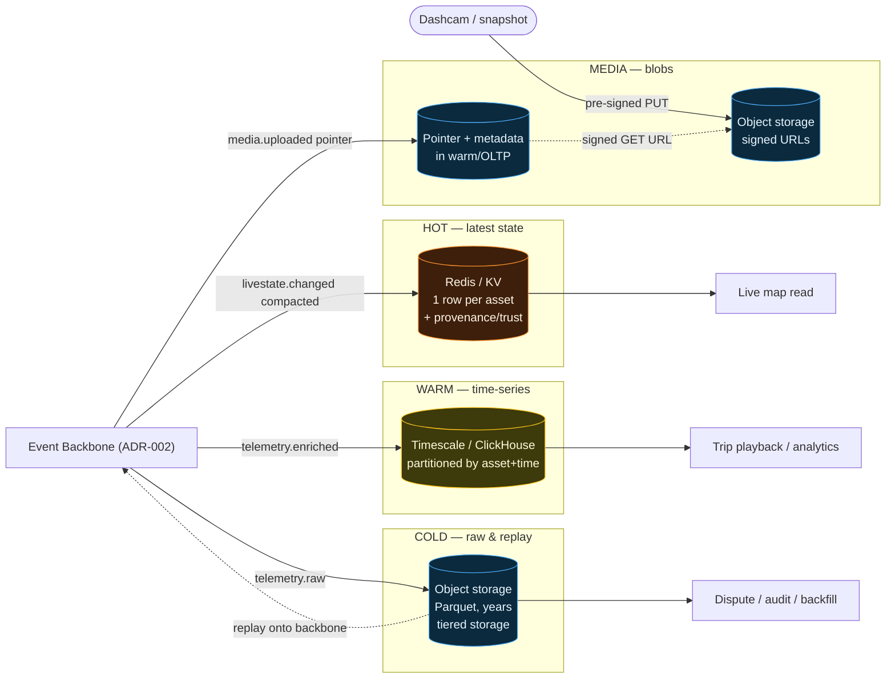

# ADR-003 — Telematics Storage Tiers (Hot / Warm / Cold / Media)

- **Status:** Proposed
- **Date:** 2026-07-12
- **Deciders:** Distributed Systems Architect, Principal Telematics Architect
- **Target posture:** Full cloud-native
- **Related:** ADR-001 (plane split), ADR-002 (backbone), ADR-004 (gateway hosting)

## Context — verified current state

**The transactional Neon Postgres is the only telemetry store.** Verified:

- **Latest state** — `latest_vehicle_positions` and `telemetry_live_asset_states` (`stage12a`) upserted inline on every ping.
- **Time-series / breadcrumbs** — `location_events`, an ordinary un-partitioned table growing unbounded in the OLTP primary; `battery_voltage` bolted on in `stage29`.
- **Raw frames** — **not retained at all.** The device frame is decoded and discarded; there is no replay source.
- **Media** — S3-compatible object storage (`STORAGE_*` in `render.yaml`) exists, but **only for PODs/signatures/documents**, and it falls back to a non-durable local dev store when unset. No telemetry media (dashcam/snapshots) path.
- **Provenance** — `latest_vehicle_positions` has `source_channel` / `source_event_id` but **no authoritative provenance/trust column.** A simulator point (`TelemetrySimulatorBackgroundService`), a real fix, and an interpolated/stale point are indistinguishable to the live map.

One store means every access pattern — sub-millisecond "where is truck 12 right now", "draw its last 24h trail", "replay last quarter for a dispute", "show the dashcam clip" — competes for the same OLTP resources, indexes, and vacuum budget. There is no lifecycle, no cheap cold retention, and no way to reprocess history.

## Decision

**Adopt purpose-fit storage tiers, each fed by the backbone (ADR-002), each with its own access pattern, cost profile, and retention. Introduce a first-class provenance model that travels from ingest into every tier and into the read model.**

### Tier 1 — HOT: latest-state (real-time reads)
- **Purpose:** "where is every asset right now" for the live map and dispatch — single-key, ultra-low-latency, high-read.
- **Shape:** one row per `(company_id, vehicle_id)`, last-write-wins.
- **Target store:** a low-latency KV/cache — **Redis / Upstash / DragonflyDB** — fed by the compacted `otx.dp.livestate.changed.v1` topic via the live-state projector. Postgres `latest_vehicle_positions` may remain as a durable mirror/read-model, but the *serving* path is the hot store, decoupled from ingest.
- **Retention:** current value only (the log is the history).

### Tier 2 — WARM: partitioned time-series (trails, trips, analytics)
- **Purpose:** breadcrumbs, trip playback, per-asset history over days–months; range scans by asset + time.
- **Shape:** append-only, **time-partitioned** (native Postgres declarative partitioning by day/week, or **TimescaleDB hypertable / ClickHouse** for higher volume) keyed by `(company_id, vehicle_id, ts)`.
- **Target store:** a **dedicated time-series database, separate from the OLTP primary** — so breadcrumb growth and range scans never touch the business DB. Fed by `otx.dp.telemetry.enriched.v1` via a Kafka-Connect sink.
- **Retention:** hot-in-DB 30–90d, older partitions detached/rolled to cold. Continuous aggregates for daily rollups.

### Tier 3 — COLD: object-storage raw & replay
- **Purpose:** the immutable, cheap, long-horizon system of record — audit, dispute replay, model backfill, compliance.
- **Shape:** raw frames (`otx.dp.telemetry.raw.v1`) and enriched events archived as **partitioned Parquet in object storage** (Cloudflare R2 / S3), `s3://otx-telemetry-cold/<company_id>/<yyyy>/<mm>/<dd>/`.
- **Target store:** S3-compatible object storage (reuse the existing `STORAGE_*` capability, dedicated bucket) with **Redpanda/Kafka tiered storage** plus a Connect sink. Queryable in place via DuckDB/Athena/Trino.
- **Retention:** years, per tenant `otx.cp.tenant.config.v1` retention policy; object-lifecycle rules to Glacier-class after N months.
- **Replay:** because cold holds raw frames, any historical window can be re-produced onto the backbone to rebuild warm/hot or feed a new model — the capability the current system entirely lacks.

### Tier 4 — MEDIA: object storage with signed URLs
- **Purpose:** telemetry media — dashcam clips, event snapshots, harsh-event video, plus existing PODs/signatures.
- **Shape:** binary blobs in object storage; **metadata + pointer** in Postgres/warm, **never the blob in the DB**.
- **Access:** clients get **short-lived pre-signed URLs**; blobs are never proxied through the API and never public. Uploads via pre-signed `PUT` direct from gateway/device-companion.
- **Target store:** S3-compatible (extends today's `STORAGE_*`), dedicated `otx-media` bucket, per-tenant prefix, lifecycle-managed.

### Cross-cutting — the provenance model (closes the gap)
Every telemetry record — across all tiers and on the backbone — carries a first-class provenance block, and the **hot store / live-map read model gains an explicit `provenance` / `trust_tier` column** (the column that does not exist today):

| Field | Values | Meaning |
|---|---|---|
| `origin` | `device_native`, `connector_samsara`, `connector_motive`, `manual`, `simulator`, `interpolated` | where the datum actually came from |
| `trust_tier` | `verified`, `unverified`, `synthetic`, `derived` | how much to trust it |
| `freshness` | `live`, `recent`, `stale`, `offline` | derived from `stale_seconds` at read time |
| `producer` | gateway/processor id + version | which code emitted it |
| `schema_version` | semver | contract version |

The live map (`architecture.md` legend) renders these honestly: a `simulator`/`synthetic` dot is visibly marked, a `stale`/`offline` asset is greyed, an `interpolated` position is dashed. No more implying a simulated or 15-minute-old point is a live verified fix.

## Tier map (mermaid)

## Consequences

**Positive:** each access pattern gets a store built for it; the OLTP primary is freed of breadcrumb bloat and vacuum pressure; raw retention unlocks replay/backfill that is impossible today; provenance/trust becomes queryable end-to-end; media never bloats the DB and is served securely via signed URLs.

**Negative:** four stores to operate and secure vs one; data lives in more places (governance/retention/GDPR-delete must fan out per tier — driven by `otx.cp.tenant.config.v1`); eventual consistency across tiers; cost of net-new time-series + KV infra (offset by cheap cold object storage displacing expensive OLTP rows).

**Neutral:** the existing `STORAGE_*` object-storage capability and `location_events`/`latest_vehicle_positions` tables are reused as the durable mirror and the media/cold substrate rather than thrown away.

## Alternatives considered

- **Keep everything in Postgres, add partitioning only.** Helps warm bloat but leaves hot reads on the OLTP path, still no raw/replay, still no media tier, still one failure domain. Rejected.
- **Single "lakehouse" for all tiers.** Great for cold/analytics, far too slow for the sub-100ms live-map hot read. Rejected as the *only* store; adopted *for* the cold tier.
- **Provenance as a JSON blob only (`summary_json`).** Rejected for the trust-critical fields — `origin`/`trust_tier`/`freshness` must be first-class, indexable columns so the read model and map can filter/style on them cheaply.
