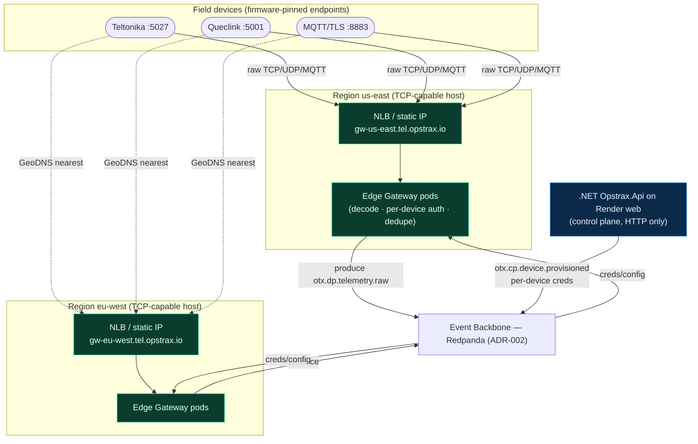

# ADR-004 — Edge Gateway Hosting (Render web cannot accept raw TCP)

- **Status:** Proposed
- **Date:** 2026-07-12
- **Deciders:** Distributed Systems Architect, Principal Telematics Architect
- **Target posture:** Full cloud-native
- **Related:** ADR-001 (plane split), ADR-002 (backbone), ADR-003 (storage tiers)

## Context — verified current state

The only telemetry ingress today is an **HTTP endpoint on a Render `type: web` service.** Verified from `render.yaml`: both `opstrax-api` and `opstrax-events` are `type: web`, each bound to a single HTTP port (`8080` / `8090`) behind Render's managed HTTPS router. **Render `web` services terminate HTTP/HTTPS only — they do not expose a raw TCP/UDP listener with a stable client-facing port.**

Real GPS/ELD hardware (Teltonika FMB/FMC, Queclink, Concox, Ruptela, plus ELD units) speaks **binary protocols over long-lived raw TCP sockets** (and some UDP/MQTT). These devices:
- open a persistent TCP connection and stream framed binary — there is no HTTP;
- are provisioned with a **fixed IP:port** (often burned into firmware or an APN profile) and cannot follow redirects or resolve dynamic hostnames;
- authenticate by IMEI in-band, expecting the server to bind that to a credential.

None of this is expressible on a Render web service. Additionally, auth today is the **single global `Telemetry:GatewaySecret`** (`GpsTrackerIngest`) — there is no per-device credential and no static regional endpoint for firmware to target.

**Conclusion: the Edge Gateway cannot live on Render web. It needs a TCP-capable host with static, regional, firmware-targetable endpoints.**

## Decision

**Deploy the Edge Gateway to a TCP-capable target that exposes static regional L4 endpoints, terminating raw device protocols and producing to the backbone (ADR-002). The .NET control plane stays on Render web; only the device-facing gateway moves.**

### Primary target — Kubernetes `Service type=LoadBalancer` fronted by a cloud NLB
- Gateway runs as a Deployment; a `Service type=LoadBalancer` provisions a cloud **Network Load Balancer (L4)** with a **static IP / Elastic IP per region**, forwarding raw **TCP/UDP** to the pods.
- **Static regional endpoints** — e.g. `gw-us-east.tel.opstrax.io:5027`, `gw-eu-west.tel.opstrax.io:5027` — stable targets firmware/APN profiles can be pinned to. Anycast/GeoDNS routes a device to its nearest region.
- Per-protocol ports (e.g. `5027` Teltonika, `5001` Queclink, `8883` MQTT/TLS) as `Service` ports.
- Horizontal Pod Autoscaler on connection count; NLB does connection-level LB (sticky per socket, correct for long-lived device sockets).

### Alternative target — Fly.io
- Fly supports **raw TCP/UDP** via `[[services]]` with `handlers`, anycast static IPs (dedicated IPv4 per app), and multi-region app deployment out of the box — a lighter-weight path to the same static-regional-TCP property without running k8s.
- Suitable if we want fewer moving parts than a managed k8s cluster; trade-off is less control over L4 tuning and autoscaling than an NLB.

Either target satisfies the hard requirement: **raw L4 ingress + static regional endpoints.** k8s/NLB is the primary for scale and control; Fly.io is the pragmatic alternative.

### Per-device credentials replace the single global secret
The gateway consumes `otx.cp.device.provisioned.v1` (ADR-002, topic 13) to build a **per-device credential + tenant-binding table** (IMEI → device_id → company_id → secret/mTLS cert). On connect:
1. Device presents IMEI (+ credential / client cert).
2. Gateway authenticates **that specific device** and stamps `company_id` + provenance (`origin=device_native`, `trust_tier=verified`).
3. Revocation/rotation is a control-plane action that flows over topic 13 — **surgical per device**, not a fleet-wide secret rotation.

The old global `Telemetry:GatewaySecret` is retained *only* for the legacy HTTP `GpsTrackerIngest` compatibility shim during migration, then retired.

### Topology (mermaid)

## Rationale

- **Physics, not preference:** firmware speaks raw TCP to a fixed endpoint; Render web offers neither raw TCP nor a stable L4 port. No amount of application code closes that gap — the host must change.
- **Static regional endpoints** are a firmware/APN constraint: devices in the field cannot be re-flashed to chase moving hostnames, so the ingress IP must be stable and regionally close (latency + sovereignty).
- **Blast-radius & security (ADR-001):** the untrusted L4 surface is isolated on a hardened, minimal gateway tier with per-device credentials, not on the box that also serves the business API.
- **Keep the control plane where it works:** the .NET API's HTTP workload is a fine fit for Render web; only the device-facing edge needs to move, minimising migration scope.

## Consequences

**Positive:** real hardware can finally connect; endpoints are stable and regional; per-device credentials make the single-global-secret risk go away; the edge scales on its own axis; provenance is stamped at the trust boundary.

**Negative:** operating a k8s cluster (or Fly.io apps) + NLBs + static IPs across regions is net-new ops surface and cost; TLS/mTLS cert lifecycle for devices; the gateway becomes a stateful-connection tier needing careful rollout (long-lived sockets must drain on deploy); DNS/anycast/GeoDNS to manage.

**Neutral:** Render remains the control-plane host; the HTTP `GpsTrackerIngest` shim can run in parallel during migration so no device is stranded at cut-over.

## Alternatives considered

- **Stay on Render web + HTTP-only gateway in front.** Rejected: it just relocates the problem — *something* still has to terminate raw device TCP, and it cannot be Render web. An HTTP-only gateway forces every device vendor to ship an HTTP bridge, which the hardware does not do.
- **AWS IoT Core / managed MQTT broker.** Strong for MQTT-native fleets and a reasonable *additional* producer, but most installed GPS/ELD hardware is raw-TCP binary, not MQTT — it doesn't cover the fleet. Kept as an optional MQTT front that also produces to the backbone.
- **Cloud NLB → serverless.** Serverless can't hold long-lived device sockets; L4 + persistent connections need a running process. Rejected.
