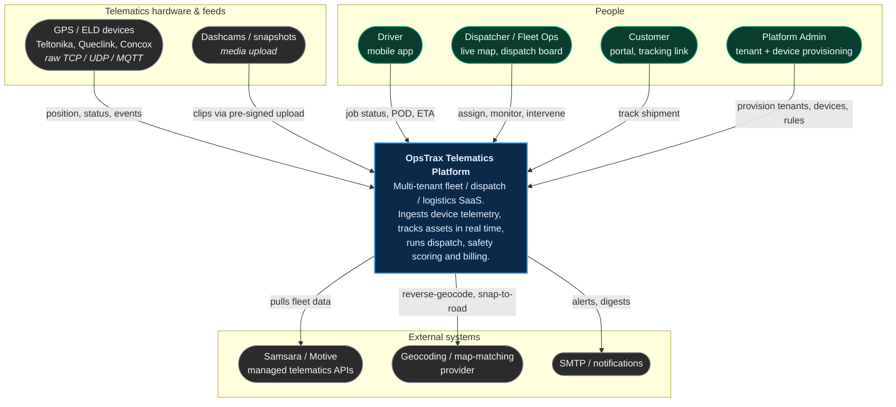
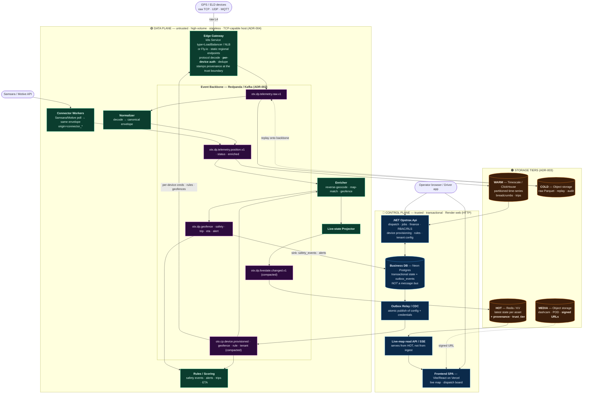
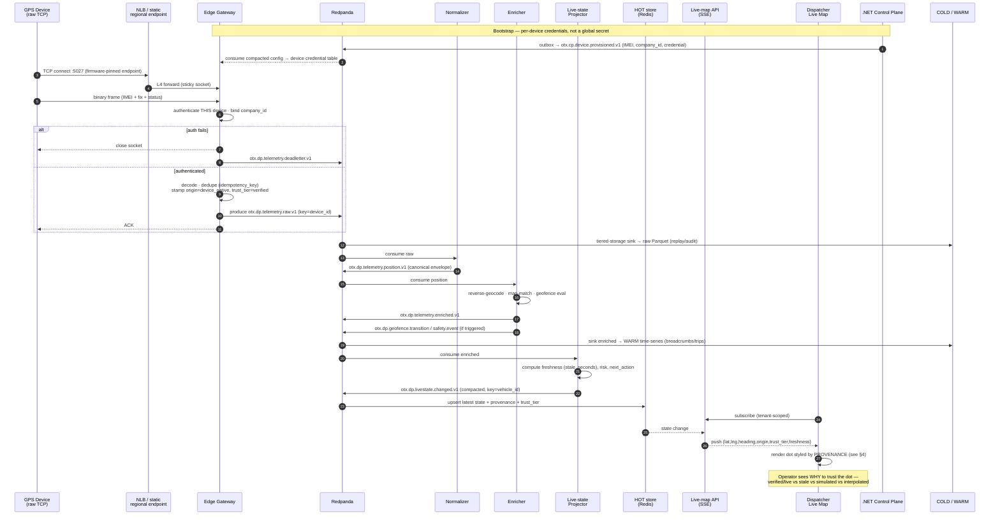

# OpsTrax Telematics — Target Architecture (Full Cloud-Native)

**Status:** Target topology (proposed) · **Date:** 2026-07-12
**ADRs:** [ADR-001 plane split](./adr/ADR-001-data-plane-control-plane-split.md) · [ADR-002 event backbone](./adr/ADR-002-event-backbone-redpanda-kafka.md) · [ADR-003 storage tiers](./adr/ADR-003-storage-tiers.md) · [ADR-004 gateway hosting](./adr/ADR-004-gateway-hosting.md)

---

## 0. Verified current state (what we are moving away from)

This document is grounded in the **verified** production reality, not an aspiration:

| # | Verified fact | Source | Target ADR |
|---|---|---|---|
| 1 | Production is a **single Render HTTP `web_service`** (plus a Node `web` side service). | `render.yaml` — all services are `type: web` | ADR-004 |
| 2 | **No raw TCP listener exists anywhere.** Real GPS/ELD hardware physically cannot connect. | `render.yaml`; ingest is an HTTP `POST` only | ADR-004 |
| 3 | **One global shared gateway secret** authenticates all devices of all tenants. | `EndpointMappings.cs::GpsTrackerIngest` → `config["Telemetry:GatewaySecret"]` | ADR-004, ADR-002 (topic 13) |
| 4 | The **transactional business DB is the only store** — live state, breadcrumbs, and alerts all sit in the OLTP Neon Postgres, written synchronously in the request thread. There is **no event bus and no raw retention/replay.** | `stage12a_telemetry_live_state.sql`, `location_events`, inline ingest write | ADR-002, ADR-003 |
| 5 | **`latest_vehicle_positions` has NO provenance column.** A simulator point, a real fix, and a stale/interpolated point are indistinguishable on the live map. | `stage12a` columns (`source_channel`, `source_event_id` only); `TelemetrySimulatorBackgroundService` | ADR-003 §provenance, §4 below |

**Target posture: full cloud-native** — device-facing data plane split from the transactional control plane, Redpanda as the backbone, purpose-fit hot/warm/cold/media tiers, TCP-capable regional gateways, and provenance carried end-to-end.

---

## 1. C4 Level 1 — System Context

---

## 2. C4 Level 2 — Container Diagram (Data Plane + Control Plane)

The **only** coupling between the planes is the event backbone. Neither plane reads the other's database.

### Container responsibilities

| Container | Plane | Responsibility | Never does |
|---|---|---|---|
| Edge Gateway | Data | Terminate raw TCP/UDP/MQTT on static regional endpoints; authenticate **per device**; decode; dedupe; stamp provenance; produce to backbone | Write the business DB |
| Connector Workers | Data | Poll Samsara/Motive, emit the same canonical envelope with `origin=connector_*` | Bypass the backbone |
| Normalizer / Enricher / Rules / Projector | Data | Stateless stream processing; sole writers into the storage tiers | Read the control-plane DB |
| Redpanda backbone | Seam | Durable, replayable, ordered log; the only cross-plane coupling | Be replaced by the business DB |
| Hot / Warm / Cold / Media | Storage | Purpose-fit serving, history, replay, blobs | Serve ingest writes directly |
| .NET `Opstrax.Api` | Control | Transactional business domain; device identity & credential issuance; rules/geofence/tenant config; publishes via outbox | Sit on the device ingest hot path |
| Outbox Relay | Control | Atomically publish config/credential changes to `otx.cp.*` | Dual-write |

---

## 3. Sequence — device ➜ map

End-to-end, from a raw socket frame to a dot rendering on the dispatcher's live map, with provenance carried the whole way.

**Latency budget (target):** device frame → gateway ACK < 50 ms · gateway → backbone < 20 ms · backbone → hot store < 300 ms · hot → browser (SSE) < 200 ms. **End-to-end p95 device → map: < 1 s.**

---

## 4. Honest live-map provenance-state legend

> **This is the gap being closed.** Today `latest_vehicle_positions` has **no provenance column** — the live map paints every dot identically, so a `TelemetrySimulatorBackgroundService` point, a real device fix, and a 20-minute-old stale position all look like equally-trustworthy live truth. That is a *lying UI*. The target carries `origin` + `trust_tier` + `freshness` (ADR-003) from the trust boundary all the way to the pixel, and the map **must** render them distinguishably.

### 4.1 Provenance dimensions

| Dimension | Values | Stamped by |
|---|---|---|
| `origin` | `device_native` · `connector_samsara` · `connector_motive` · `manual` · `simulator` · `interpolated` | Edge Gateway / Connector / Projector |
| `trust_tier` | `verified` · `unverified` · `derived` · `synthetic` | Edge Gateway (at the auth boundary) |
| `freshness` | `live` (< 60 s) · `recent` (< 5 min) · `stale` (< 30 min) · `offline` (≥ 30 min / no fix) | Live-state Projector (from `stale_seconds`) |

### 4.2 The legend the map must render

| State | Origin / trust | Freshness | Map rendering | What the operator is being told |
|---|---|---|---|---|
| 🟢 **Live — verified** | `device_native` / `verified` | `live` | Solid filled dot, full colour, heading arrow, subtle pulse | Real authenticated hardware, fix < 60 s old. **Trust this.** |
| 🔵 **Live — connector** | `connector_*` / `unverified` | `live` / `recent` | Solid dot, **square/diamond** marker + provider badge | Real, but sourced from a third-party API — freshness is bounded by *their* poll interval, not ours. |
| 🟡 **Recent** | any real origin | `recent` | Solid dot, 70% opacity | Last fix 1–5 min ago. Probably fine; not this second's truth. |
| 🟠 **Stale** | any real origin | `stale` | Hollow dot, dashed border, **age label ("14 min")** | We have **not heard from this asset recently.** Position is where it *was*. |
| ⚫ **Offline** | any real origin | `offline` | Grey hollow dot, "last seen HH:MM", drop shadow removed | No contact ≥ 30 min. **Do not dispatch on this position.** |
| 🟣 **Interpolated / derived** | `interpolated` / `derived` | n/a | **Dashed outline, no heading arrow**, "estimated" chip | Computed/dead-reckoned, **not** an observed fix. |
| 🔴 **Simulated** | `simulator` / `synthetic` | any | **Hatched/striped fill + persistent "SIMULATED" banner** on the map canvas | Synthetic data (demo/test). **This is not a real vehicle.** Never silently blended with real assets. |
| ⚠️ **Unverified / quarantined** | unknown device or failed auth | any | Red-outlined marker in a separate "quarantine" layer, **off by default** | Traffic we could not attribute to a provisioned device (`stage27_iot_credential_quarantine`). |

### 4.3 Non-negotiable UI rules

1. **No dot without provenance.** If `origin`/`trust_tier` is absent, the marker renders as ⚠️ *unverified* — never as verified-live. Absence of provenance is itself a state, and it is not a trustworthy one.
2. **Synthetic data is never silently mixed with real.** If any `simulator`-origin asset is on the canvas, a **persistent map-level banner** says so.
3. **Freshness is always visible for anything past `live`.** Stale/offline assets must carry a visible age; the map may not imply currency it does not have.
4. **`withFallback` seed data is not a provenance state — it is a bug.** Per `CLAUDE.md`, a page rendering seed content means the live API call failed. The live map must render an explicit **"telemetry unavailable"** error state rather than seed dots that look like real assets.
5. **The legend is always reachable** from the map chrome — the operator can look up what any marker style means without leaving the board.

---

## 5. Migration sketch (strangler, no device left stranded)

| Phase | Move | Cut-over safety |
|---|---|---|
| 0 | Add `origin` / `trust_tier` / `freshness` columns + backfill `origin='unverified'`; ship the map legend against existing data | UI stops lying immediately, before any infra change |
| 1 | Stand up Redpanda + Schema Registry; add the **outbox** to `Opstrax.Api` (topics 13–16) | No traffic change; control plane just starts publishing |
| 2 | Deploy the Edge Gateway to the TCP-capable target (ADR-004); it produces to `otx.dp.telemetry.raw.v1`. **Existing HTTP `GpsTrackerIngest` keeps working, dual-writing to the backbone** | Both paths live; compare outputs |
| 3 | Stand up processors + hot/warm/cold sinks; live map reads from HOT | Shadow-read and diff against the old DB read |
| 4 | Retire the inline DB write in `GpsTrackerIngest`; retire the **global `Telemetry:GatewaySecret`** once all devices carry per-device credentials | The single-secret risk is finally gone |

---

## 6. Open questions

- Managed **Redpanda Cloud** vs self-hosted on the gateway cluster — cost vs. ops surface at 4 tenants today, but which at 40?
- Warm tier: **TimescaleDB** (keeps SQL/Postgres skills, easy joins) vs **ClickHouse** (far better at fleet-scale scans). Decide against a real device-count/ping-rate projection.
- Regional footprint for ADR-004 static endpoints — which regions do the first hardware tenants actually sit in (incl. the Saudi readiness track)?
- Data-residency: does per-tenant residency force per-region backbones and storage tiers, not just per-region gateways?
