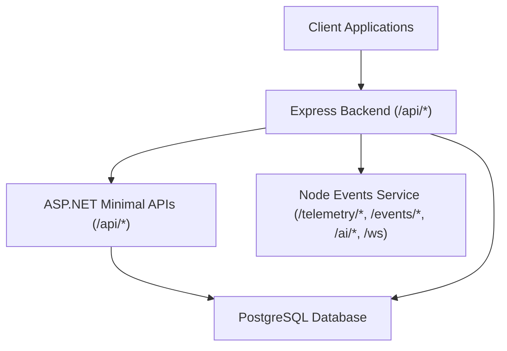
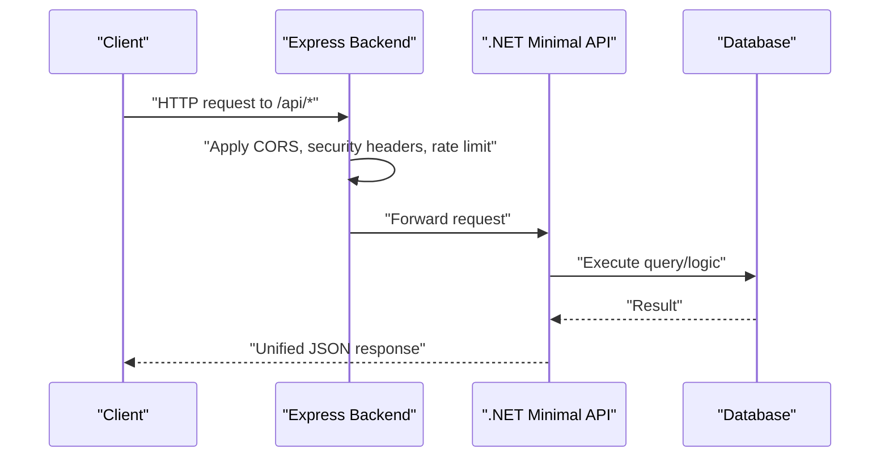
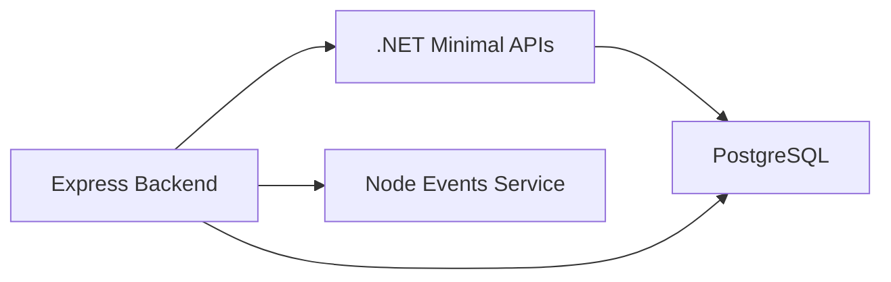

# API Reference

<cite>
**Referenced Files in This Document**
- [API_ENDPOINTS.md](file://docs/API_ENDPOINTS.md)
- [EndpointMappings.cs](file://backend-dotnet/Controllers/EndpointMappings.cs)
- [ApiResponse.cs](file://backend-dotnet/DTOs/ApiResponse.cs)
- [app.ts](file://backend/src/app.ts)
- [errorHandler.ts](file://backend/src/middleware/errorHandler.ts)
- [health.routes.ts](file://backend/src/modules/health/health.routes.ts)
- [tenantConfig.routes.ts](file://backend/src/modules/tenant-config/tenantConfig.routes.ts)
- [compliance.routes.ts](file://backend/src/modules/compliance/compliance.routes.ts)
- [device.routes.ts](file://backend/src/modules/devices/device.routes.ts)
- [industry.routes.ts](file://backend/src/modules/industry/industry.routes.ts)
- [telemetry.routes.ts](file://backend/src/modules/telemetry/telemetry.routes.ts)
- [server.ts](file://backend/src/server.ts)
</cite>

## Table of Contents
1. [Introduction](#introduction)
2. [Project Structure](#project-structure)
3. [Core Components](#core-components)
4. [Architecture Overview](#architecture-overview)
5. [Detailed Component Analysis](#detailed-component-analysis)
6. [Dependency Analysis](#dependency-analysis)
7. [Performance Considerations](#performance-considerations)
8. [Troubleshooting Guide](#troubleshooting-guide)
9. [Conclusion](#conclusion)
10. [Appendices](#appendices)

## Introduction
This document provides comprehensive API documentation for the OpsTrax REST endpoints. It catalogs the endpoints exposed by the .NET backend, describes unified response formatting, authentication and authorization requirements, rate limiting, and operational patterns. It also outlines categories of endpoints across modules such as vehicles, drivers, jobs, dispatch, safety, maintenance, compliance, analytics, and more. Practical examples, pagination/filtering/search guidance, and client implementation recommendations are included.

## Project Structure
The API surface is primarily defined in the .NET backend’s endpoint mapping file and complemented by a small Node-based telemetry ingestion service. The Express-based backend exposes a health readiness endpoint and applies global CORS, security headers, and rate limiting middleware.

**Diagram sources**
- [EndpointMappings.cs](file://backend-dotnet/Controllers/EndpointMappings.cs)
- [app.ts](file://backend/src/app.ts)

**Section sources**
- [server.ts](file://backend/src/server.ts)
- [app.ts](file://backend/src/app.ts)

## Core Components
- Unified response envelope: The .NET API uses a typed response envelope with fields for success, data, message, and errors. See [ApiResponse.cs](file://backend-dotnet/DTOs/ApiResponse.cs).
- Authentication and permissions: The .NET API enforces role-based permissions per endpoint. Authorization checks are performed centrally and return standardized error responses when missing privileges. See [EndpointMappings.cs](file://backend-dotnet/Controllers/EndpointMappings.cs).
- Rate limiting: The Express backend applies a sliding-window rate limiter for selected paths. See [app.ts](file://backend/src/app.ts).
- Health and readiness: Health endpoints are provided by both Express and ASP.NET backends. See [health.routes.ts](file://backend/src/modules/health/health.routes.ts) and [EndpointMappings.cs](file://backend-dotnet/Controllers/EndpointMappings.cs).
- Telemetry ingestion: The Node service accepts telemetry and safety events via HTTP and streams live updates via WebSocket/SSE. See [API_ENDPOINTS.md](file://docs/API_ENDPOINTS.md).

**Section sources**
- [ApiResponse.cs](file://backend-dotnet/DTOs/ApiResponse.cs)
- [EndpointMappings.cs](file://backend-dotnet/Controllers/EndpointMappings.cs)
- [app.ts](file://backend/src/app.ts)
- [health.routes.ts](file://backend/src/modules/health/health.routes.ts)
- [API_ENDPOINTS.md](file://docs/API_ENDPOINTS.md)

## Architecture Overview
The API architecture separates concerns across modules while maintaining a single, consistent response format. The .NET backend defines most endpoints and enforces tenant scoping and permissions. The Express backend provides lightweight orchestration and rate limiting. A separate Node service handles real-time telemetry and event ingestion.

**Diagram sources**
- [app.ts](file://backend/src/app.ts)
- [EndpointMappings.cs](file://backend-dotnet/Controllers/EndpointMappings.cs)

## Detailed Component Analysis

### Unified API Response Envelope
- Structure: success, data, message, errors
- Usage: All .NET endpoints return this envelope; Express endpoints return similar envelopes for health and readiness.
- Typical responses: 200 OK with data payload; 400/401/403/429/500 with error details.

**Section sources**
- [ApiResponse.cs](file://backend-dotnet/DTOs/ApiResponse.cs)
- [health.routes.ts](file://backend/src/modules/health/health.routes.ts)
- [app.ts](file://backend/src/app.ts)

### Authentication and Authorization
- Authentication: Session-based for internal endpoints; device-authenticated ingestion endpoints use HMAC signatures for telemetry.
- Permissions: Each endpoint requires specific permission keys; missing permissions yield 403 with a clear error message.
- Role defaults: Built-in roles map to sets of permissions; aliases normalize separators.

Key behaviors:
- Permission checks return 401 if auth context is missing and 403 if insufficient permissions.
- Tenant scoping is enforced server-side via company ID extracted from the authenticated context.

**Section sources**
- [EndpointMappings.cs](file://backend-dotnet/Controllers/EndpointMappings.cs)

### Rate Limiting
- Applies to /api/* paths (with exceptions for health/readiness and login).
- Sliding window policy with configurable window and max requests via environment variables.
- Returns 429 Too Many Requests with a structured error response.

**Section sources**
- [app.ts](file://backend/src/app.ts)

### Telemetry Ingestion and Streaming
- Ingestion: POST /api/telemetry/ingest for device-authenticated telemetry events.
- Stream ticket: POST /api/telemetry/stream-ticket to obtain a short-lived ticket.
- Live stream: GET /api/telemetry/stream with a ticket parameter.
- Positions and metrics: GET /api/telemetry/positions and GET /api/telemetry/metrics.
- Alerts: GET /api/telemetry/alerts and acknowledge/resolve actions.

**Section sources**
- [EndpointMappings.cs](file://backend-dotnet/Controllers/EndpointMappings.cs)

### Devices Lifecycle
- List device types: GET /api/devices/types
- Provision device: POST /api/devices/provision
- Lifecycle actions: activate, suspend, revoke, rotate secret, assign

**Section sources**
- [EndpointMappings.cs](file://backend-dotnet/Controllers/EndpointMappings.cs)

### Safety and Coaching
- Safety events: list, get, review, dismiss, resolve, coaching
- Driver safety scores: GET /api/safety/drivers/scores
- Dashboard KPIs: GET /api/safety/dashboard
- Coaching tasks: create, update, delete, assign, acknowledge, complete

**Section sources**
- [EndpointMappings.cs](file://backend-dotnet/Controllers/EndpointMappings.cs)

### Trips and Route Compliance
- Trips: list, get, breadcrumbs, compliance, start, complete, exception
- Route planning: create/update/delete routes and stops; optimize preview; assign routes

**Section sources**
- [EndpointMappings.cs](file://backend-dotnet/Controllers/EndpointMappings.cs)

### Drivers
- Summary and lists: GET /api/drivers/summary, GET /api/drivers
- CRUD: GET, POST, PUT, DELETE by ID; timeline and recommendations
- Status and assignments: change status, assign vehicle

**Section sources**
- [EndpointMappings.cs](file://backend-dotnet/Controllers/EndpointMappings.cs)

### Vehicles
- Summary and lists: GET /api/vehicles/summary, GET /api/vehicles
- CRUD: GET, POST, PUT, DELETE by ID; timeline and recommendations
- Status and driver assignment: change status, assign driver

**Section sources**
- [EndpointMappings.cs](file://backend-dotnet/Controllers/EndpointMappings.cs)

### Jobs, Dispatch, and ETA
- Jobs: summary, list, CRUD, timeline, recommendations, import preview, assign, status, send ETA, proof capture
- Dispatch: board, recommendations, availability, assign, status, auto-suggest, ETA updates, assignments lifecycle
- Customer ETA: summary, track by code/token, send updates, feedback, communications, AI recommendations

**Section sources**
- [EndpointMappings.cs](file://backend-dotnet/Controllers/EndpointMappings.cs)

### Maintenance, Work Orders, DVIR
- Maintenance dashboard and items
- Inspections: list, create, detail, review
- Defects: acknowledge, resolve
- Work orders: list, create, assign, complete, timeline, recommendations
- PM rules and fault codes ingestion
- DVIR templates and reports: create/update/delete, mechanic review, certify repair, driver sign, timeline

**Section sources**
- [EndpointMappings.cs](file://backend-dotnet/Controllers/EndpointMappings.cs)

### Compliance Center
- Profiles, rules, violations, acknowledgments/resolutions
- Documents, audit packages, cross-border watch, driver/vehicle status, AI recommendations

**Section sources**
- [EndpointMappings.cs](file://backend-dotnet/Controllers/EndpointMappings.cs)

### HOS/ELD
- Clocks, logs, certifications
- ELD devices lifecycle

**Section sources**
- [EndpointMappings.cs](file://backend-dotnet/Controllers/EndpointMappings.cs)

### Finance, Expenses, Contracts, Carriers
- Invoices, payments, profitability (summary and records)
- Expenses: CRUD, approvals, categories, recommendations, import preview
- Contracts: CRUD, rates CRUD, activation/expiry, recommendations
- Carriers: CRUD, performance, documents, status, recommendations

**Section sources**
- [EndpointMappings.cs](file://backend-dotnet/Controllers/EndpointMappings.cs)

### Fuel, Idling, and Anomalies
- Transactions, idling events, summaries, anomalies, recommendations
- Import preview and anomaly reviews

**Section sources**
- [EndpointMappings.cs](file://backend-dotnet/Controllers/EndpointMappings.cs)

### Predictive Analytics and Intelligence
- Predictions for maintenance, driver risk, SLA risk
- Cost margin predictions and recomputation

**Section sources**
- [EndpointMappings.cs](file://backend-dotnet/Controllers/EndpointMappings.cs)

### Workforce Management
- Drivers list, schedule, weekly assignment

**Section sources**
- [EndpointMappings.cs](file://backend-dotnet/Controllers/EndpointMappings.cs)

### Cost Leakage Intelligence
- Summary, items, recommendations, acknowledgments, action creation

**Section sources**
- [EndpointMappings.cs](file://backend-dotnet/Controllers/EndpointMappings.cs)

### Localization
- Countries, languages, tenant/user preferences

**Section sources**
- [EndpointMappings.cs](file://backend-dotnet/Controllers/EndpointMappings.cs)

### Reports and Analytics Engine (P8)
- Dataset registry, saved reports CRUD, run queries/saved reports, exports
- Scheduled reports, analytics KPIs

**Section sources**
- [EndpointMappings.cs](file://backend-dotnet/Controllers/EndpointMappings.cs)

### KPIs, SLAs, and Executive Snapshots
- KPI metrics and targets, SLA records and breaches, executive snapshots and recommendations

**Section sources**
- [EndpointMappings.cs](file://backend-dotnet/Controllers/EndpointMappings.cs)

### Notifications, Messaging, and Escalation
- Notifications: list, unread count, read/acknowledge, bulk acknowledge
- Messages: conversations CRUD, send/read
- Escalation rules: CRUD

**Section sources**
- [EndpointMappings.cs](file://backend-dotnet/Controllers/EndpointMappings.cs)

### Driver Self-Service
- Profile: GET /api/driver/me
- Assignments: list, current, accept, status, exception, proof
- DVIR templates and self-submission
- Coaching tasks and acknowledgments
- HOS data

**Section sources**
- [EndpointMappings.cs](file://backend-dotnet/Controllers/EndpointMappings.cs)

### Customer Visibility and ETA
- Shipments list/detail, sharing, revocation
- Tracking by token, events, proofs
- Insights

**Section sources**
- [EndpointMappings.cs](file://backend-dotnet/Controllers/EndpointMappings.cs)

### About and Platform
- Platform info and health summary

**Section sources**
- [EndpointMappings.cs](file://backend-dotnet/Controllers/EndpointMappings.cs)

### Node Events Service
- Health: GET /health
- Telemetry: POST /telemetry/location
- Safety events: POST /events/safety
- AI: POST /ai/generate-daily-brief
- Real-time: WS /ws

**Section sources**
- [API_ENDPOINTS.md](file://docs/API_ENDPOINTS.md)

## Dependency Analysis
The .NET backend centralizes endpoint definitions and enforces permissions and tenant scoping. The Express backend provides shared middleware and rate limiting. The Node service complements real-time ingestion and streaming.

**Diagram sources**
- [EndpointMappings.cs](file://backend-dotnet/Controllers/EndpointMappings.cs)
- [app.ts](file://backend/src/app.ts)

**Section sources**
- [EndpointMappings.cs](file://backend-dotnet/Controllers/EndpointMappings.cs)
- [app.ts](file://backend/src/app.ts)

## Performance Considerations
- Prefer paginated queries and limit result sizes where applicable.
- Use filters and date ranges to reduce payload sizes.
- Leverage recommendations endpoints for prioritized insights.
- For telemetry-heavy clients, use the stream ticket and SSE endpoints to minimize polling.

## Troubleshooting Guide
- 401 Unauthorized: Missing or invalid session/device credentials.
- 403 Forbidden: Insufficient permissions for the requested operation.
- 400 Bad Request: Validation failures (e.g., malformed JSON or missing fields).
- 429 Too Many Requests: Exceeded rate limit; back off and retry later.
- 500 Internal Server Error: Unexpected server error; inspect server logs.

Common checks:
- Verify tenant scoping and permissions for protected endpoints.
- Confirm rate-limiting windows and adjust client retry cadence.
- Validate request bodies against documented schemas.

**Section sources**
- [errorHandler.ts](file://backend/src/middleware/errorHandler.ts)
- [app.ts](file://backend/src/app.ts)
- [EndpointMappings.cs](file://backend-dotnet/Controllers/EndpointMappings.cs)

## Conclusion
OpsTrax exposes a comprehensive REST API organized by functional modules with a consistent response envelope and strict RBAC enforcement. The .NET backend defines the majority of endpoints, while Express provides foundational middleware and the Node service supports real-time telemetry. Clients should implement robust error handling, adhere to rate limits, and leverage the unified response format for reliable integrations.

## Appendices

### Endpoint Categories and Examples
Below are representative endpoints grouped by module. Replace placeholders with actual IDs and payloads as indicated.

- Vehicles
  - GET /api/vehicles
  - POST /api/vehicles
  - GET /api/vehicles/{id}
  - PUT /api/vehicles/{id}
  - DELETE /api/vehicles/{id}
  - GET /api/vehicles/{id}/timeline
  - GET /api/vehicles/{id}/recommendations
  - POST /api/vehicles/{id}/assign-driver
  - POST /api/vehicles/{id}/change-status

- Drivers
  - GET /api/drivers
  - POST /api/drivers
  - GET /api/drivers/{id}
  - PUT /api/drivers/{id}
  - DELETE /api/drivers/{id}
  - GET /api/drivers/{id}/timeline
  - GET /api/drivers/{id}/recommendations
  - POST /api/drivers/{id}/assign-vehicle
  - POST /api/drivers/{id}/change-status

- Jobs and Dispatch
  - GET /api/jobs
  - POST /api/jobs
  - GET /api/jobs/{id}
  - PUT /api/jobs/{id}
  - DELETE /api/jobs/{id}
  - GET /api/jobs/{id}/timeline
  - GET /api/jobs/{id}/recommendations
  - POST /api/jobs/import-preview
  - POST /api/jobs/{id}/assign
  - POST /api/jobs/{id}/status
  - POST /api/jobs/{id}/send-eta
  - POST /api/jobs/{id}/proof
  - GET /api/jobs/{id}/proof
  - GET /api/proof-of-delivery
  - GET /api/proof-of-delivery/summary

- Dispatch Board and Assignments
  - GET /api/dispatch/summary
  - GET /api/dispatch/board
  - GET /api/dispatch/recommendations
  - GET /api/dispatch/available-drivers
  - GET /api/dispatch/available-vehicles
  - POST /api/dispatch/assign
  - POST /api/dispatch/status
  - POST /api/dispatch/auto-suggest
  - POST /api/dispatch/send-eta-updates
  - GET /api/dispatch/assignments
  - GET /api/dispatch/assignments/{id}
  - POST /api/dispatch/assignments
  - POST /api/dispatch/assignments/{id}/accept
  - POST /api/dispatch/assignments/{id}/status
  - POST /api/dispatch/assignments/{id}/exception
  - POST /api/dispatch/assignments/{id}/cancel
  - POST /api/dispatch/assignments/{id}/proof
  - GET /api/dispatch/eligibility
  - GET /api/dispatch/exceptions

- Safety and Coaching
  - GET /api/safety/events
  - GET /api/safety/events/{id}
  - POST /api/safety/events/{id}/review
  - POST /api/safety/events/{id}/dismiss
  - POST /api/safety/events/{id}/resolve
  - POST /api/safety/events/{id}/coaching
  - GET /api/safety/drivers/scores
  - GET /api/safety/dashboard
  - POST /api/safety/coaching/{id}/complete
  - POST /api/safety/coaching/{id}/acknowledge
  - GET /api/safety/rules
  - PUT /api/safety/rules/{ruleType}

- Telemetry
  - POST /api/telemetry/ingest
  - POST /api/telemetry/stream-ticket
  - GET /api/telemetry/stream
  - GET /api/telemetry/positions
  - GET /api/telemetry/metrics
  - GET /api/telemetry/alerts
  - POST /api/telemetry/alerts/{id}/acknowledge
  - POST /api/telemetry/alerts/{id}/resolve
  - GET /api/telemetry/rules
  - PUT /api/telemetry/rules/{ruleType}

- Devices
  - GET /api/devices
  - GET /api/devices/{id}
  - POST /api/devices/provision
  - POST /api/devices/{id}/rotate-secret
  - POST /api/devices/{id}/revoke
  - POST /api/devices/{id}/suspend
  - POST /api/devices/{id}/activate
  - POST /api/devices/{id}/assign

- Maintenance
  - GET /api/maintenance/dashboard
  - GET /api/maintenance/inspections
  - POST /api/maintenance/inspections
  - GET /api/maintenance/inspections/{id}
  - POST /api/maintenance/inspections/{id}/review
  - GET /api/maintenance/defects
  - POST /api/maintenance/defects/{id}/acknowledge
  - POST /api/maintenance/defects/{id}/resolve
  - GET /api/maintenance/work-orders
  - POST /api/maintenance/work-orders
  - POST /api/maintenance/work-orders/{id}/assign
  - POST /api/maintenance/work-orders/{id}/complete
  - GET /api/maintenance/rules
  - PUT /api/maintenance/rules/{ruleType}
  - POST /api/maintenance/fault-codes/ingest
  - GET /api/maintenance/fault-codes
  - GET /api/maintenance/summary
  - GET /api/maintenance/due
  - GET /api/maintenance/overdue
  - GET /api/maintenance/recommendations
  - GET /api/maintenance
  - GET /api/maintenance/{id}
  - POST /api/maintenance
  - PUT /api/maintenance/{id}
  - DELETE /api/maintenance/{id}
  - POST /api/maintenance/{id}/schedule
  - POST /api/maintenance/{id}/defer
  - POST /api/maintenance/{id}/create-workorder

- Compliance
  - GET /api/compliance/summary
  - GET /api/compliance/profiles
  - GET /api/compliance/rules
  - GET /api/compliance/violations
  - GET /api/compliance/violations/{id}
  - POST /api/compliance/violations/{id}/acknowledge
  - POST /api/compliance/violations/{id}/resolve
  - GET /api/compliance/documents
  - GET /api/compliance/audit-packages
  - GET /api/compliance/audit-packages/{id}
  - POST /api/compliance/audit-packages
  - POST /api/compliance/audit-packages/{id}/finalize
  - GET /api/compliance/cross-border-watch
  - GET /api/compliance/driver-status
  - GET /api/compliance/vehicle-status
  - GET /api/compliance/ai/recommendations

- HOS/ELD
  - GET /api/hos/summary
  - GET /api/hos/drivers
  - GET /api/hos/clocks
  - GET /api/hos/logs
  - GET /api/hos/logs/{driverId}
  - POST /api/hos/logs/{id}/certify
  - GET /api/hos/ai/recommendations
  - GET /api/eld/devices
  - GET /api/eld/devices/{id}
  - POST /api/eld/devices/{id}/mark-malfunction
  - POST /api/eld/devices/{id}/resolve-malfunction

- Finance and Operations
  - GET /api/invoices
  - GET /api/payments
  - GET /api/profitability
  - GET /api/profitability/summary
  - GET /api/carbon-emissions
  - GET /api/fuel/summary
  - GET /api/fuel/transactions
  - GET /api/fuel/transactions/{id}
  - POST /api/fuel/transactions
  - PUT /api/fuel/transactions/{id}
  - DELETE /api/fuel/transactions/{id}
  - GET /api/fuel/idling-events
  - GET /api/fuel/idling-events/{id}
  - POST /api/fuel/idling-events
  - PUT /api/fuel/idling-events/{id}
  - GET /api/fuel/vehicle/{vehicleId}/summary
  - GET /api/fuel/driver/{driverId}/summary
  - GET /api/fuel/vehicle-summary
  - GET /api/fuel/driver-summary
  - GET /api/fuel/anomalies
  - GET /api/fuel/recommendations
  - POST /api/fuel/import-preview
  - POST /api/fuel/anomalies/{id}/review
  - GET /api/expenses/summary
  - GET /api/expenses
  - GET /api/expenses/{id}
  - POST /api/expenses
  - PUT /api/expenses/{id}
  - DELETE /api/expenses/{id}
  - POST /api/expenses/{id}/approve
  - POST /api/expenses/{id}/reject
  - GET /api/expenses/categories
  - GET /api/expenses/recommendations
  - POST /api/expenses/import-preview
  - GET /api/contracts/summary
  - GET /api/contracts
  - GET /api/contracts/{id}
  - POST /api/contracts
  - PUT /api/contracts/{id}
  - DELETE /api/contracts/{id}
  - GET /api/contracts/{id}/rates
  - POST /api/contracts/{id}/rates
  - PUT /api/contracts/{id}/rates/{rateId}
  - DELETE /api/contracts/{id}/rates/{rateId}
  - GET /api/contracts/recommendations
  - POST /api/contracts/{id}/activate
  - POST /api/contracts/{id}/expire
  - GET /api/carriers/summary
  - GET /api/carriers
  - GET /api/carriers/{id}
  - POST /api/carriers
  - PUT /api/carriers/{id}
  - DELETE /api/carriers/{id}
  - GET /api/carriers/{id}/performance
  - GET /api/carriers/{id}/documents
  - POST /api/carriers/{id}/status
  - GET /api/carriers/recommendations

- Predictive Analytics
  - GET /api/predictions/maintenance
  - GET /api/predictions/driver-risk
  - GET /api/predictions/sla-risk
  - GET /api/cost-margin/summary
  - GET /api/cost-margin/jobs
  - GET /api/cost-margin/routes
  - GET /api/cost-margin/vehicles
  - GET /api/cost-margin/customers
  - GET /api/cost-margin/predictions
  - GET /api/cost-margin/recommendations
  - POST /api/cost-margin/recalculate
  - POST /api/cost-margin/jobs/{jobId:long}/recalculate

- Workforce Management
  - GET /api/workforce/drivers
  - GET /api/workforce/schedule
  - POST /api/workforce/schedule/assign

- Cost Leakage Intelligence
  - GET /api/cost-leakage/summary
  - GET /api/cost-leakage/items
  - GET /api/cost-leakage/recommendations
  - POST /api/cost-leakage/items/{id}/acknowledge
  - POST /api/cost-leakage/items/{id}/create-action

- Localization
  - GET /api/localization/countries
  - GET /api/localization/languages
  - GET /api/localization/settings
  - PUT /api/localization/settings
  - GET /api/localization/user-preferences
  - PUT /api/localization/user-preferences

- Reports and Analytics Engine (P8)
  - GET /api/reports/catalog
  - GET /api/reports/summary
  - GET /api/reports/runs
  - POST /api/reports/{key}/run
  - GET /api/reports/scheduled
  - POST /api/reports/scheduled
  - POST /api/reports/scheduled/{id}/pause
  - POST /api/reports/scheduled/{id}/resume
  - GET /api/reports/exports
  - POST /api/reports/exports
  - GET /api/reports/ai/recommendations
  - GET /api/reports/datasets
  - GET /api/reports/saved
  - POST /api/reports/saved
  - GET /api/reports/saved/{id}
  - PUT /api/reports/saved/{id}
  - DELETE /api/reports/saved/{id}
  - POST /api/reports/run
  - POST /api/reports/saved/{id}/run
  - POST /api/reports/export
  - GET /api/reports/saved/{id}/export
  - POST /api/reports/scheduled/p8
  - GET /api/analytics/executive
  - GET /api/analytics/operations
  - GET /api/analytics/dispatch
  - GET /api/analytics/safety
  - GET /api/analytics/maintenance
  - GET /api/analytics/customer
  - GET /api/analytics/trends
  - GET /api/analytics/insights

- KPIs, SLAs, and Executive Snapshots
  - GET /api/kpi/metrics
  - GET /api/kpi/summary
  - GET /api/kpi/targets
  - GET /api/kpi/ai/recommendations
  - GET /api/sla/records
  - GET /api/sla/summary
  - GET /api/sla/breaches
  - POST /api/sla/breaches/{id}/acknowledge
  - POST /api/sla/breaches/{id}/resolve

- Notifications, Messaging, and Escalation
  - GET /api/notifications
  - GET /api/notifications/unread-count
  - POST /api/notifications/{id}/read
  - POST /api/notifications/{id}/acknowledge
  - POST /api/notifications/acknowledge-all
  - GET /api/messages/conversations
  - GET /api/messages/conversations/{id}
  - POST /api/messages/conversations
  - POST /api/messages/conversations/{id}/messages
  - POST /api/messages/conversations/{id}/read
  - GET /api/escalation-rules
  - POST /api/escalation-rules
  - PUT /api/escalation-rules/{id}
  - DELETE /api/escalation-rules/{id}

- Driver Self-Service
  - GET /api/driver/me
  - GET /api/driver/assignments
  - GET /api/driver/assignments/current
  - POST /api/driver/assignments/{id}/accept
  - POST /api/driver/assignments/{id}/status
  - POST /api/driver/assignments/{id}/exception
  - POST /api/driver/assignments/{id}/proof
  - GET /api/driver/dvir/templates
  - POST /api/driver/dvir
  - GET /api/driver/coaching
  - POST /api/driver/coaching/{id}/acknowledge
  - GET /api/driver/hos

- Customer Visibility and ETA
  - GET /api/customer-visibility/shipments
  - GET /api/customer-visibility/shipments/{id}
  - POST /api/customer-visibility/shipments/{id}/share
  - DELETE /api/customer-visibility/shipments/{id}/share
  - GET /api/customer-visibility/insights
  - GET /api/customer-visibility/tracking/{token}
  - GET /api/customer-visibility/tracking/{token}/events
  - GET /api/customer-visibility/tracking/{token}/proofs

- About and Platform
  - GET /api/about/platform
  - GET /api/about/health-summary

- Node Events Service
  - GET /health
  - POST /telemetry/location
  - POST /events/safety
  - POST /ai/generate-daily-brief
  - WS /ws

**Section sources**
- [EndpointMappings.cs](file://backend-dotnet/Controllers/EndpointMappings.cs)
- [API_ENDPOINTS.md](file://docs/API_ENDPOINTS.md)

### Request Parameter Validation and Response Formatting
- Validation: Body validation and parsing are enforced for endpoints that require structured input (e.g., device registration, tenant configuration).
- Response format: All .NET endpoints return the unified envelope; Express endpoints return similar envelopes for health/readiness.
- Error handling: Centralized error handler returns 500 with a structured error envelope.

**Section sources**
- [tenantConfig.routes.ts](file://backend/src/modules/tenant-config/tenantConfig.routes.ts)
- [device.routes.ts](file://backend/src/modules/devices/device.routes.ts)
- [ApiResponse.cs](file://backend-dotnet/DTOs/ApiResponse.cs)
- [errorHandler.ts](file://backend/src/middleware/errorHandler.ts)

### Pagination, Filtering, Sorting, and Search
- Pagination: Many list endpoints support server-side pagination; clients should honor returned counts and page sizes.
- Filtering: Use query parameters to filter by status, severity, dates, and IDs where supported.
- Sorting: Sort order is often server-defined; consult endpoint documentation for supported sort fields.
- Search: Some endpoints expose search or keyword filters; otherwise, combine filters and pagination.

[No sources needed since this section provides general guidance]

### Authentication Headers and Device Signing
- Session-based authentication: Use the established session for internal endpoints.
- Device telemetry ingestion: Requires device-specific headers and HMAC signature verification.
- Public token endpoints: Certain customer visibility endpoints accept public tokens without session auth.

**Section sources**
- [EndpointMappings.cs](file://backend-dotnet/Controllers/EndpointMappings.cs)

### Rate Limiting and API Versioning
- Rate limiting: Sliding window with configurable window and max requests; returns 429 with structured error.
- API versioning: Not explicitly versioned in URLs; use stable endpoint contracts and monitor changelog.

**Section sources**
- [app.ts](file://backend/src/app.ts)

### Client Implementation Guidelines and SDK Usage
- Use the unified response envelope to parse success/data/message/errors consistently.
- Implement retries with exponential backoff for 429 and transient errors.
- Cache responses where safe; invalidate on mutations.
- For real-time telemetry, use the stream ticket and SSE endpoints.
- For device ingestion, implement HMAC signing according to device-auth requirements.

[No sources needed since this section provides general guidance]