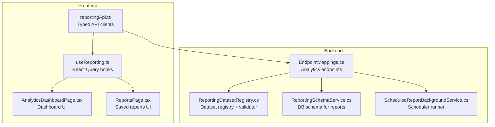
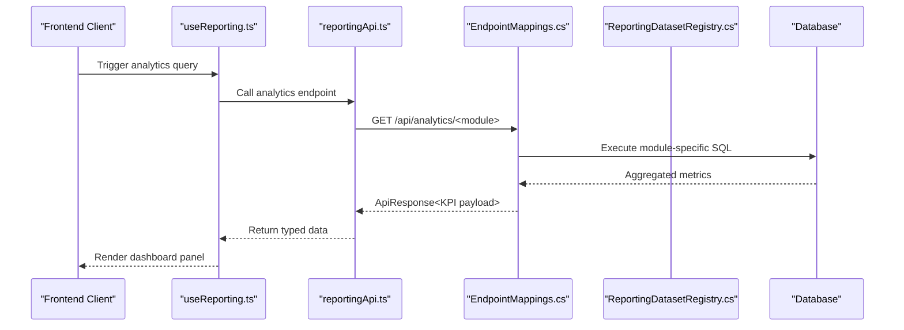
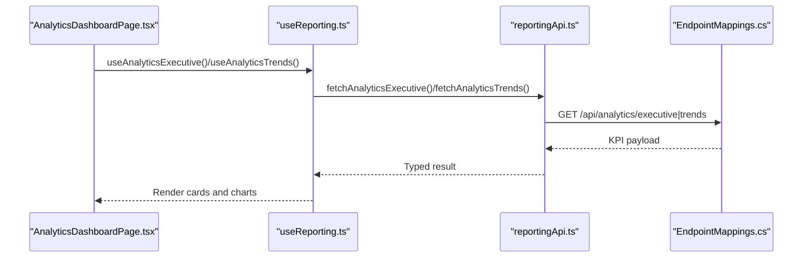
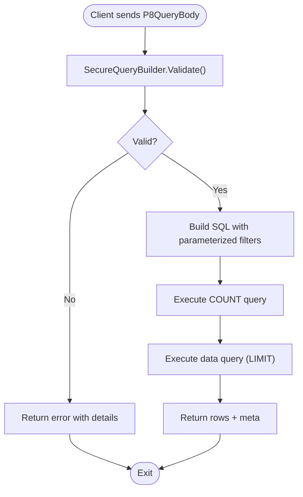
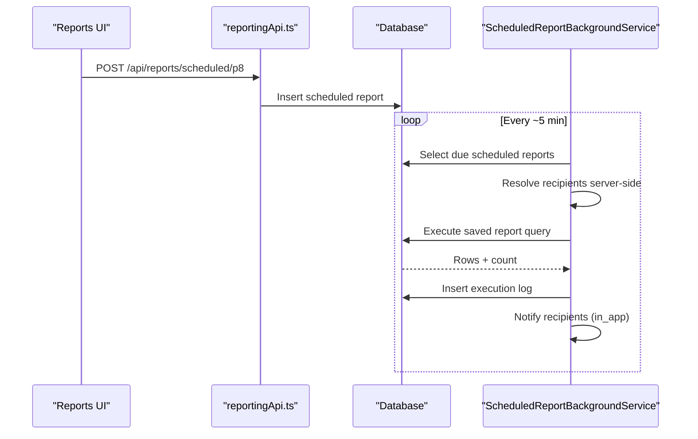
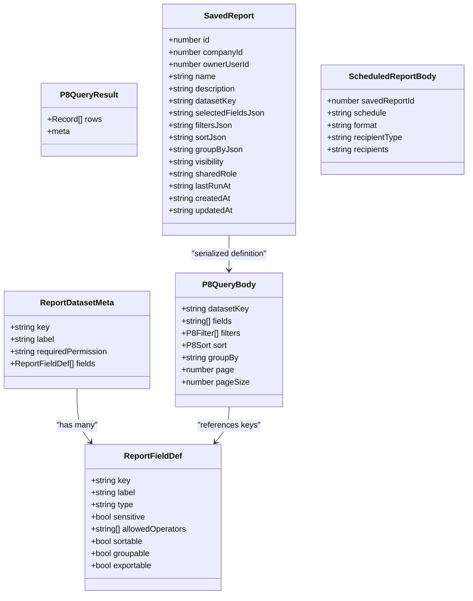
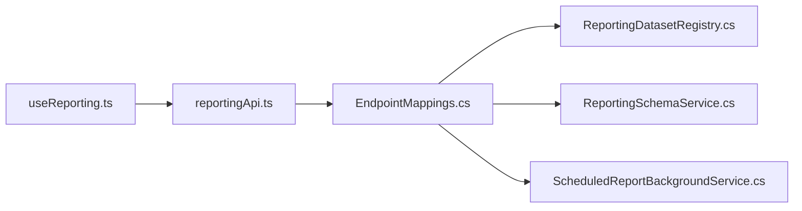

# Analytics & Reporting API

<cite>
**Referenced Files in This Document**
- [reportingApi.ts](file://frontend/src/services/reportingApi.ts)
- [useReporting.ts](file://frontend/src/hooks/useReporting.ts)
- [EndpointMappings.cs](file://backend-dotnet/Controllers/EndpointMappings.cs)
- [ReportingDatasetRegistry.cs](file://backend-dotnet/Services/ReportingDatasetRegistry.cs)
- [ReportingSchemaService.cs](file://backend-dotnet/Services/ReportingSchemaService.cs)
- [ScheduledReportBackgroundService.cs](file://backend-dotnet/Services/ScheduledReportBackgroundService.cs)
- [AnalyticsDashboardPage.tsx](file://frontend/src/pages/AnalyticsDashboardPage.tsx)
- [ReportsPage.tsx](file://frontend/src/pages/ReportsPage.tsx)
</cite>

## Table of Contents
1. [Introduction](#introduction)
2. [Project Structure](#project-structure)
3. [Core Components](#core-components)
4. [Architecture Overview](#architecture-overview)
5. [Detailed Component Analysis](#detailed-component-analysis)
6. [Dependency Analysis](#dependency-analysis)
7. [Performance Considerations](#performance-considerations)
8. [Troubleshooting Guide](#troubleshooting-guide)
9. [Conclusion](#conclusion)

## Introduction
This document describes the Analytics & Reporting API surface for real-time dashboards, historical reporting, KPI tracking, and executive summaries. It covers:
- Real-time analytics dashboards and KPI panels
- Historical reporting via custom report builder
- Data export formats and automated report scheduling
- Filtering capabilities for time ranges, fleet segments, and performance metrics
- Predictive analytics, trend analysis, and compliance reporting

## Project Structure
The Analytics & Reporting feature spans the frontend and backend:
- Frontend: React hooks and services define typed request/response contracts and orchestrate analytics queries and report builder actions.
- Backend: Strongly typed dataset registries, secure query builders, and background services implement permission-controlled analytics endpoints and scheduled deliveries.

**Diagram sources**
- [reportingApi.ts:1-217](file://frontend/src/services/reportingApi.ts#L1-L217)
- [useReporting.ts:1-157](file://frontend/src/hooks/useReporting.ts#L1-L157)
- [EndpointMappings.cs:11831-12014](file://backend-dotnet/Controllers/EndpointMappings.cs#L11831-L12014)
- [ReportingDatasetRegistry.cs:117-563](file://backend-dotnet/Services/ReportingDatasetRegistry.cs#L117-L563)
- [ReportingSchemaService.cs:10-115](file://backend-dotnet/Services/ReportingSchemaService.cs#L10-L115)
- [ScheduledReportBackgroundService.cs:26-363](file://backend-dotnet/Services/ScheduledReportBackgroundService.cs#L26-L363)

**Section sources**
- [reportingApi.ts:1-217](file://frontend/src/services/reportingApi.ts#L1-L217)
- [useReporting.ts:1-157](file://frontend/src/hooks/useReporting.ts#L1-L157)
- [EndpointMappings.cs:11831-12014](file://backend-dotnet/Controllers/EndpointMappings.cs#L11831-L12014)

## Core Components
- Analytics endpoints: Executive, Operations, Dispatch, Safety, Maintenance, Customer, Trends, and Insights.
- Reporting dataset registry: Defines datasets, fields, operators, and permissions.
- Secure query builder: Validates and constructs parameterized SQL from client requests.
- Saved reports and scheduling: Store report definitions and deliver results automatically.
- Frontend services and hooks: Typed contracts and React Query integration for dashboards and report builder.

**Section sources**
- [reportingApi.ts:178-216](file://frontend/src/services/reportingApi.ts#L178-L216)
- [EndpointMappings.cs:11831-12014](file://backend-dotnet/Controllers/EndpointMappings.cs#L11831-L12014)
- [ReportingDatasetRegistry.cs:117-563](file://backend-dotnet/Services/ReportingDatasetRegistry.cs#L117-L563)
- [ReportingSchemaService.cs:10-115](file://backend-dotnet/Services/ReportingSchemaService.cs#L10-L115)
- [ScheduledReportBackgroundService.cs:26-363](file://backend-dotnet/Services/ScheduledReportBackgroundService.cs#L26-L363)

## Architecture Overview
The Analytics & Reporting architecture enforces strong security and performance controls:
- Request contracts are validated server-side against a registry of allowed datasets and fields.
- All filters and sorts are parameterized to prevent SQL injection.
- Tenant isolation is enforced by injecting company_id into every query.
- Scheduled reports run periodically and deliver notifications to recipients resolved server-side.

**Diagram sources**
- [useReporting.ts:126-156](file://frontend/src/hooks/useReporting.ts#L126-L156)
- [reportingApi.ts:178-216](file://frontend/src/services/reportingApi.ts#L178-L216)
- [EndpointMappings.cs:11831-12014](file://backend-dotnet/Controllers/EndpointMappings.cs#L11831-L12014)

## Detailed Component Analysis

### Analytics Endpoints
Real-time dashboards expose module-specific KPIs and trends:
- Executive: Fleet utilization, on-time delivery, safety averages, open incidents, overdue maintenance, and recent proofs.
- Operations: Active trips, completed jobs, and related metrics.
- Dispatch: Daily activity trends (deliveries vs exceptions).
- Safety: Severity trends and incident counts.
- Maintenance: Work orders and defect metrics.
- Customer: SLA totals, breach rates, and risk indicators.
- Trends: Multi-day trend series for dispatch and safety.
- Insights: Curated system insights.

**Diagram sources**
- [AnalyticsDashboardPage.tsx:347-402](file://frontend/src/pages/AnalyticsDashboardPage.tsx#L347-L402)
- [useReporting.ts:126-156](file://frontend/src/hooks/useReporting.ts#L126-L156)
- [reportingApi.ts:178-216](file://frontend/src/services/reportingApi.ts#L178-L216)
- [EndpointMappings.cs:11831-12014](file://backend-dotnet/Controllers/EndpointMappings.cs#L11831-L12014)

**Section sources**
- [reportingApi.ts:178-216](file://frontend/src/services/reportingApi.ts#L178-L216)
- [EndpointMappings.cs:11831-12014](file://backend-dotnet/Controllers/EndpointMappings.cs#L11831-L12014)
- [AnalyticsDashboardPage.tsx:347-402](file://frontend/src/pages/AnalyticsDashboardPage.tsx#L347-L402)

### Reporting Dataset Registry and Secure Query Builder
The dataset registry defines:
- Allowed datasets with base SQL, tenant table alias, and required permissions.
- Field metadata: type, allowed operators, sort/group/export flags, and sensitivity.
- Sensitive fields require additional permissions.

The secure query builder validates and builds parameterized SQL:
- Enforces max fields, filters, and page size limits.
- Whitelists operators per field type.
- Injects tenant scope server-side.
- Supports equals/not_equals, contains, starts_with, in, date_range, number_range, greater_than, less_than, boolean, is_empty, is_not_empty.

**Diagram sources**
- [ReportingDatasetRegistry.cs:582-656](file://backend-dotnet/Services/ReportingDatasetRegistry.cs#L582-L656)
- [ReportingDatasetRegistry.cs:660-793](file://backend-dotnet/Services/ReportingDatasetRegistry.cs#L660-L793)

**Section sources**
- [ReportingDatasetRegistry.cs:117-563](file://backend-dotnet/Services/ReportingDatasetRegistry.cs#L117-L563)
- [ReportingDatasetRegistry.cs:582-793](file://backend-dotnet/Services/ReportingDatasetRegistry.cs#L582-L793)

### Saved Reports and Scheduling
Saved reports persist report definitions with visibility controls:
- private: owner only
- role_shared: users with a specific role
- tenant_shared: users with reports:view

Scheduled reports run on a cadence (daily/weekly/monthly), resolve recipients server-side, and deliver in-app notifications. Delivery to external channels requires provider configuration.

**Diagram sources**
- [reportingApi.ts:171-174](file://frontend/src/services/reportingApi.ts#L171-L174)
- [ReportingSchemaService.cs:46-115](file://backend-dotnet/Services/ReportingSchemaService.cs#L46-L115)
- [ScheduledReportBackgroundService.cs:63-120](file://backend-dotnet/Services/ScheduledReportBackgroundService.cs#L63-L120)
- [ScheduledReportBackgroundService.cs:122-256](file://backend-dotnet/Services/ScheduledReportBackgroundService.cs#L122-L256)

**Section sources**
- [reportingApi.ts:57-93](file://frontend/src/services/reportingApi.ts#L57-L93)
- [ReportingSchemaService.cs:10-115](file://backend-dotnet/Services/ReportingSchemaService.cs#L10-L115)
- [ScheduledReportBackgroundService.cs:26-363](file://backend-dotnet/Services/ScheduledReportBackgroundService.cs#L26-L363)

### Frontend Services and Hooks
Frontend services define:
- ReportFieldDef and ReportDatasetMeta for dataset discovery.
- P8QueryBody/P8QueryResult for ad-hoc queries.
- SavedReport and ScheduledReportBody for persisted definitions.
- Export helpers for CSV downloads.

React hooks wrap these with React Query for caching, invalidation, and optimistic updates.

**Diagram sources**
- [reportingApi.ts:5-93](file://frontend/src/services/reportingApi.ts#L5-L93)
- [reportingApi.ts:97-132](file://frontend/src/services/reportingApi.ts#L97-L132)

**Section sources**
- [reportingApi.ts:1-217](file://frontend/src/services/reportingApi.ts#L1-L217)
- [useReporting.ts:1-157](file://frontend/src/hooks/useReporting.ts#L1-L157)
- [ReportsPage.tsx:515-533](file://frontend/src/pages/ReportsPage.tsx#L515-L533)

## Dependency Analysis
- Frontend depends on typed contracts and React Query for analytics and reporting.
- Backend controllers depend on dataset registry and schema services.
- Scheduled reports depend on background service and notification service.

**Diagram sources**
- [reportingApi.ts:1-217](file://frontend/src/services/reportingApi.ts#L1-L217)
- [useReporting.ts:1-157](file://frontend/src/hooks/useReporting.ts#L1-L157)
- [EndpointMappings.cs:11831-12014](file://backend-dotnet/Controllers/EndpointMappings.cs#L11831-L12014)
- [ReportingDatasetRegistry.cs:117-563](file://backend-dotnet/Services/ReportingDatasetRegistry.cs#L117-L563)
- [ReportingSchemaService.cs:10-115](file://backend-dotnet/Services/ReportingSchemaService.cs#L10-L115)
- [ScheduledReportBackgroundService.cs:26-363](file://backend-dotnet/Services/ScheduledReportBackgroundService.cs#L26-L363)

**Section sources**
- [reportingApi.ts:1-217](file://frontend/src/services/reportingApi.ts#L1-L217)
- [EndpointMappings.cs:11831-12014](file://backend-dotnet/Controllers/EndpointMappings.cs#L11831-L12014)

## Performance Considerations
- Limit fields and filters per query to reduce cardinality and joins.
- Prefer indexed columns in filters and sorts.
- Use group-by judiciously; only groupable fields are supported.
- Respect page size limits enforced by the secure query builder.
- Scheduled reports are executed in fixed intervals; tune cadence and recipients to avoid spikes.

## Troubleshooting Guide
Common issues and resolutions:
- Unauthorized access: Ensure the caller has the required permission for the dataset/module.
- Unknown field or operator: Verify the field key and operator against the dataset registry.
- Sensitive field access: Additional permission is required to view sensitive fields.
- Tenant scope errors: Queries are scoped server-side; ensure the authenticated tenant matches the requested data.
- Scheduled report delivery: If external providers are not configured, delivery method falls back to in-app notifications.

**Section sources**
- [ReportingDatasetRegistry.cs:582-656](file://backend-dotnet/Services/ReportingDatasetRegistry.cs#L582-L656)
- [ScheduledReportBackgroundService.cs:122-256](file://backend-dotnet/Services/ScheduledReportBackgroundService.cs#L122-L256)

## Conclusion
The Analytics & Reporting API provides secure, permissioned, and scalable capabilities for dashboards, historical reporting, exports, and automation. Its dataset registry and secure query builder enforce safety and performance, while scheduled reports streamline recurring delivery. The frontend integrates these capabilities into intuitive dashboards and report builders.