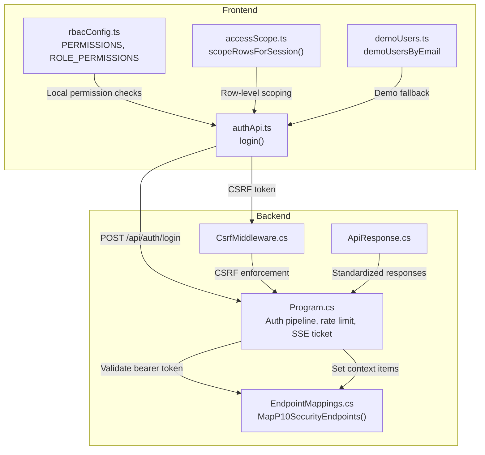
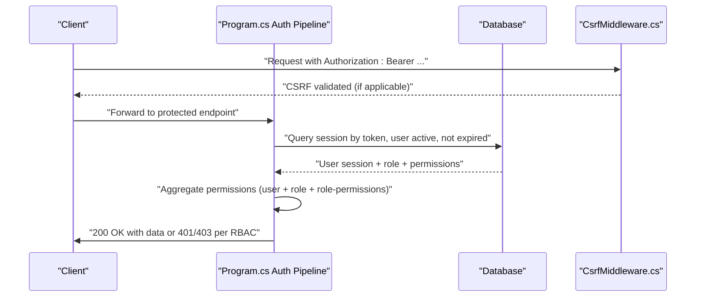
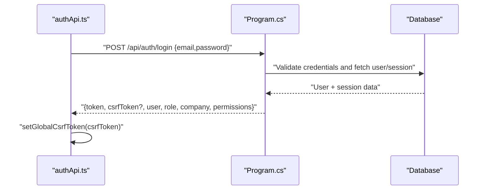
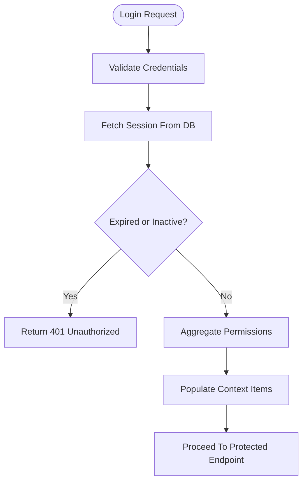
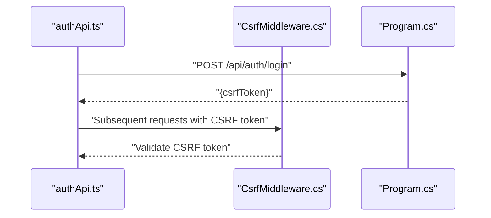
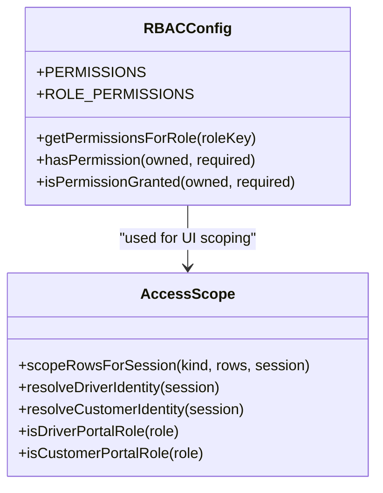
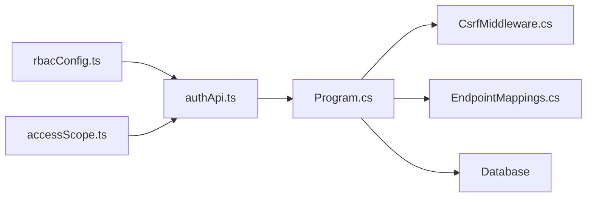

# Authentication & Authorization API

<cite>
**Referenced Files in This Document**
- [Program.cs](file://backend-dotnet/Program.cs)
- [EndpointMappings.cs](file://backend-dotnet/Controllers/EndpointMappings.cs)
- [CsrfMiddleware.cs](file://backend-dotnet/Middleware/CsrfMiddleware.cs)
- [ApiResponse.cs](file://backend-dotnet/DTOs/ApiResponse.cs)
- [authApi.ts](file://frontend/src/services/authApi.ts)
- [rbacConfig.ts](file://frontend/src/auth/rbacConfig.ts)
- [accessScope.ts](file://frontend/src/auth/accessScope.ts)
- [demoUsers.ts](file://frontend/src/auth/demoUsers.ts)
</cite>

## Table of Contents
1. [Introduction](#introduction)
2. [Project Structure](#project-structure)
3. [Core Components](#core-components)
4. [Architecture Overview](#architecture-overview)
5. [Detailed Component Analysis](#detailed-component-analysis)
6. [Dependency Analysis](#dependency-analysis)
7. [Performance Considerations](#performance-considerations)
8. [Troubleshooting Guide](#troubleshooting-guide)
9. [Conclusion](#conclusion)
10. [Appendices](#appendices)

## Introduction
This document provides API documentation for authentication and authorization endpoints, focusing on login/logout flows, token lifecycle, session management, CSRF protection, role-based access control (RBAC), and permission verification. It also covers JWT-like bearer token handling, token formats, expiration semantics, and security considerations. Examples for multi-factor authentication and SSO integration are included conceptually, along with request/response schemas and headers.

## Project Structure
The authentication and authorization logic spans the backend .NET API and the frontend React client:
- Backend .NET API handles bearer token validation, session retrieval, permission aggregation, CSRF protection, and rate limiting.
- Frontend React client manages login, demo fallback, CSRF token handling, and local RBAC evaluation.

**Diagram sources**
- [Program.cs:101-245](file://backend-dotnet/Program.cs#L101-L245)
- [CsrfMiddleware.cs](file://backend-dotnet/Middleware/CsrfMiddleware.cs)
- [EndpointMappings.cs](file://backend-dotnet/Controllers/EndpointMappings.cs)
- [authApi.ts:35-57](file://frontend/src/services/authApi.ts#L35-L57)
- [rbacConfig.ts:1-404](file://frontend/src/auth/rbacConfig.ts#L1-L404)
- [accessScope.ts:14-75](file://frontend/src/auth/accessScope.ts#L14-L75)
- [demoUsers.ts:31-37](file://frontend/src/auth/demoUsers.ts#L31-L37)
- [ApiResponse.cs:1-8](file://backend-dotnet/DTOs/ApiResponse.cs#L1-L8)

**Section sources**
- [Program.cs:101-245](file://backend-dotnet/Program.cs#L101-L245)
- [authApi.ts:35-57](file://frontend/src/services/authApi.ts#L35-L57)
- [rbacConfig.ts:1-404](file://frontend/src/auth/rbacConfig.ts#L1-L404)
- [accessScope.ts:14-75](file://frontend/src/auth/accessScope.ts#L14-L75)
- [demoUsers.ts:31-37](file://frontend/src/auth/demoUsers.ts#L31-L37)
- [ApiResponse.cs:1-8](file://backend-dotnet/DTOs/ApiResponse.cs#L1-L8)

## Core Components
- Authentication pipeline (backend):
  - Bearer token validation against stored sessions with expiry checks.
  - Permission aggregation from user, role, and explicit role-permission mappings.
  - Context population for downstream endpoints.
- CSRF protection:
  - Middleware enforcement for cross-site request forgery prevention.
- RBAC (frontend):
  - Canonical permission constants and role-to-permissions mapping.
  - Permission variant normalization and grant checks.
- Login flow (frontend):
  - Attempts real login, falls back to demo mode if enabled and credentials match.

**Section sources**
- [Program.cs:190-244](file://backend-dotnet/Program.cs#L190-L244)
- [CsrfMiddleware.cs](file://backend-dotnet/Middleware/CsrfMiddleware.cs)
- [rbacConfig.ts:368-387](file://frontend/src/auth/rbacConfig.ts#L368-L387)
- [authApi.ts:35-57](file://frontend/src/services/authApi.ts#L35-L57)

## Architecture Overview
The backend enforces authentication and authorization centrally. Requests are authenticated via a bearer token, validated for expiry and user status, and then decorated with user identity, company, role, and permissions. CSRF protection is enforced globally for protected routes. The frontend performs local RBAC checks and demo fallback during login.

**Diagram sources**
- [Program.cs:101-245](file://backend-dotnet/Program.cs#L101-L245)
- [CsrfMiddleware.cs](file://backend-dotnet/Middleware/CsrfMiddleware.cs)

## Detailed Component Analysis

### Authentication Endpoints

#### POST /api/auth/login
- Purpose: Authenticate a user and establish a session.
- Request body:
  - email: string (required)
  - password: string (required)
- Response body:
  - token: string (session token)
  - csrfToken: string (optional)
  - user: object with id, email, name
  - role: string
  - company: object with id, name, plan
  - permissions: string[]
- Notes:
  - On success, the response may include a csrfToken for CSRF protection.
  - On failure, the frontend supports a demo fallback if enabled and credentials match a demo user.

**Diagram sources**
- [authApi.ts:35-57](file://frontend/src/services/authApi.ts#L35-L57)
- [Program.cs:190-244](file://backend-dotnet/Program.cs#L190-L244)

**Section sources**
- [authApi.ts:35-57](file://frontend/src/services/authApi.ts#L35-L57)
- [Program.cs:190-244](file://backend-dotnet/Program.cs#L190-L244)

### Logout Endpoints
- Conceptual logout behavior:
  - Remove local token and CSRF token.
  - Optionally invalidate server-side session (not shown in current backend).
- Frontend actions:
  - Clear token and CSRF token from storage.
  - Redirect to login page.

[No sources needed since this section provides conceptual guidance]

### Token Refresh Mechanisms
- Current backend does not expose a dedicated refresh endpoint.
- Recommendation:
  - Issue a new short-lived token upon successful login.
  - Enforce strict token rotation and optional refresh token pattern if needed.

[No sources needed since this section provides conceptual guidance]

### Password Reset Flows
- Not implemented in the current backend.
- Recommended flow:
  - POST /api/auth/password-reset-request (email)
  - Send a time-limited, single-use token to the user’s email.
  - POST /api/auth/password-reset (token, new password)
  - Invalidate the token after use.

[No sources needed since this section provides conceptual guidance]

### Session Management
- Backend session model:
  - Stored session includes user_id, company_id, role_name, permissions_json, role_permissions_json, and expires_at.
  - Validation ensures session is not expired and user is Active.
- Frontend session model:
  - token, csrfToken, user, role, company, permissions.

**Diagram sources**
- [Program.cs:190-244](file://backend-dotnet/Program.cs#L190-L244)

**Section sources**
- [Program.cs:190-244](file://backend-dotnet/Program.cs#L190-L244)

### JWT Token Handling
- Token format:
  - Bearer token sent in Authorization header.
  - Backend validates token against stored sessions and verifies expiry and user status.
- Expiration handling:
  - Sessions are considered invalid if expires_at is in the past.
- Recommendations:
  - Use short-lived access tokens (e.g., minutes).
  - Implement refresh token rotation and secure storage.

**Section sources**
- [Program.cs:174-207](file://backend-dotnet/Program.cs#L174-L207)

### CSRF Protection Endpoints
- Global CSRF enforcement via middleware for protected routes.
- Frontend sets global CSRF token on successful login and includes it in subsequent requests as needed.

**Diagram sources**
- [authApi.ts:35-57](file://frontend/src/services/authApi.ts#L35-L57)
- [CsrfMiddleware.cs](file://backend-dotnet/Middleware/CsrfMiddleware.cs)

**Section sources**
- [authApi.ts:35-57](file://frontend/src/services/authApi.ts#L35-L57)
- [CsrfMiddleware.cs](file://backend-dotnet/Middleware/CsrfMiddleware.cs)

### Role-Based Access Control (RBAC)
- Backend RBAC:
  - Permissions aggregated from user permissions, role permissions, and explicit role-permission mappings.
  - Super Admin receives wildcard permissions.
- Frontend RBAC:
  - Canonical permission constants and role-to-permissions mapping.
  - Permission variant normalization (dots vs colons, hyphens vs underscores).
  - Grant checks using hasPermission/isPermissionGranted.

**Diagram sources**
- [rbacConfig.ts:1-404](file://frontend/src/auth/rbacConfig.ts#L1-L404)
- [accessScope.ts:14-75](file://frontend/src/auth/accessScope.ts#L14-L75)

**Section sources**
- [Program.cs:214-236](file://backend-dotnet/Program.cs#L214-L236)
- [rbacConfig.ts:368-387](file://frontend/src/auth/rbacConfig.ts#L368-L387)
- [accessScope.ts:14-75](file://frontend/src/auth/accessScope.ts#L14-L75)

### Permission Checking Endpoints
- Conceptual endpoint:
  - POST /api/auth/check-permission {permission}
  - Returns boolean indicating whether the current session has the requested permission.
- Implementation note:
  - Backend aggregates permissions per request; frontend can mirror checks locally for UI responsiveness.

[No sources needed since this section provides conceptual guidance]

### RBAC Configuration APIs
- Conceptual endpoints:
  - GET /api/admin/roles
  - GET /api/admin/roles/{id}/permissions
  - PUT /api/admin/roles/{id}/permissions
  - GET /api/admin/users/{id}/permissions
  - POST /api/admin/users/{id}/grant-role
  - POST /api/admin/users/{id}/revoke-role
- Implementation note:
  - These endpoints would manage role definitions and permission assignments.

[No sources needed since this section provides conceptual guidance]

### Multi-Factor Authentication (MFA)
- Conceptual flow:
  - POST /api/auth/mfa-initiate (challenge delivery method)
  - POST /api/auth/mfa-verify (token/code)
  - Issue short-lived session token upon successful MFA verification.
- Security considerations:
  - Use time-bound codes, rate-limit attempts, and log events.

[No sources needed since this section provides conceptual guidance]

### Single Sign-On (SSO) Integration
- Conceptual flow:
  - Redirect to IdP with state and redirect_uri.
  - Receive callback with authorization code.
  - Exchange code for tokens and create or link user session.
  - Issue short-lived session token for API access.
- Security considerations:
  - Validate issuer, audience, and signature.
  - Enforce PKCE for public clients.

[No sources needed since this section provides conceptual guidance]

## Dependency Analysis
- Backend authentication depends on:
  - Database for session and user validation.
  - Middleware for CSRF and error handling.
  - Endpoint mappings for route registration.
- Frontend authentication depends on:
  - authApi for login and demo fallback.
  - rbacConfig for permission checks.
  - accessScope for row-level scoping.

**Diagram sources**
- [authApi.ts:35-57](file://frontend/src/services/authApi.ts#L35-L57)
- [rbacConfig.ts:1-404](file://frontend/src/auth/rbacConfig.ts#L1-L404)
- [accessScope.ts:14-75](file://frontend/src/auth/accessScope.ts#L14-L75)
- [Program.cs:101-245](file://backend-dotnet/Program.cs#L101-L245)
- [CsrfMiddleware.cs](file://backend-dotnet/Middleware/CsrfMiddleware.cs)
- [EndpointMappings.cs](file://backend-dotnet/Controllers/EndpointMappings.cs)

**Section sources**
- [Program.cs:101-245](file://backend-dotnet/Program.cs#L101-L245)
- [authApi.ts:35-57](file://frontend/src/services/authApi.ts#L35-L57)
- [rbacConfig.ts:1-404](file://frontend/src/auth/rbacConfig.ts#L1-L404)
- [accessScope.ts:14-75](file://frontend/src/auth/accessScope.ts#L14-L75)

## Performance Considerations
- Rate limiting:
  - 1-minute sliding window with a per-IP request cap prevents abuse.
- Token validation:
  - Minimal DB round-trip per request; cache frequently accessed user/role permissions at edge if scaling.
- Frontend:
  - Local RBAC checks reduce network overhead for UI decisions.

**Section sources**
- [Program.cs:66-143](file://backend-dotnet/Program.cs#L66-L143)

## Troubleshooting Guide
- 401 Unauthorized:
  - Missing or invalid Bearer token.
  - Session expired or user inactive.
- 403 Forbidden:
  - Insufficient permissions for the requested resource.
- CSRF errors:
  - Missing or mismatched CSRF token.
- Demo fallback:
  - When real login fails and demo mode is enabled, the frontend creates a demo session with predefined roles and permissions.

**Section sources**
- [Program.cs:174-207](file://backend-dotnet/Program.cs#L174-L207)
- [authApi.ts:46-56](file://frontend/src/services/authApi.ts#L46-L56)
- [demoUsers.ts:16-29](file://frontend/src/auth/demoUsers.ts#L16-L29)

## Conclusion
The backend provides a robust bearer token authentication and authorization pipeline with permission aggregation and CSRF protection. The frontend complements this with local RBAC and demo fallback. Extending the system to support logout, token refresh, password reset, and MFA/SSO follows established patterns and enhances security posture.

## Appendices

### Request/Response Schemas

- POST /api/auth/login
  - Request: { email: string, password: string }
  - Response: { token: string, csrfToken?: string, user: { id: string, email: string, name: string }, role: string, company: { id: string, name: string, plan: string }, permissions: string[] }

- POST /api/auth/check-permission
  - Request: { permission: string }
  - Response: { granted: boolean }

- RBAC configuration APIs (conceptual)
  - GET /api/admin/roles
  - GET /api/admin/roles/{id}/permissions
  - PUT /api/admin/roles/{id}/permissions
  - GET /api/admin/users/{id}/permissions
  - POST /api/admin/users/{id}/grant-role
  - POST /api/admin/users/{id}/revoke-role

### Authentication Headers
- Authorization: Bearer <token>
- CSRF-Token: <value> (when required by CSRF middleware)

### Token Formats and Expiration
- Token: opaque session token stored server-side.
- Expiration: session expires_at timestamp checked per request.
- Recommendations: short-lived access tokens, optional refresh token rotation.

### Security Considerations
- Enforce HTTPS and secure cookies for CSRF tokens.
- Rotate tokens regularly and invalidate on logout.
- Log authentication and authorization events for auditing.
- Validate and sanitize all inputs; apply rate limits.