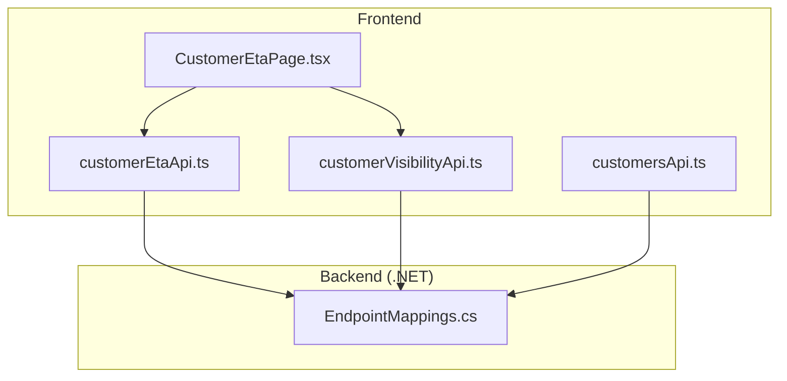
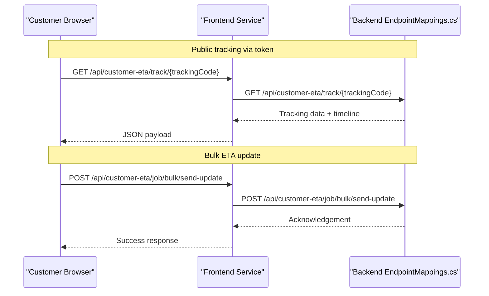
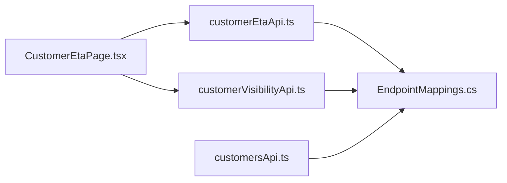

# Customer Experience API

<cite>
**Referenced Files in This Document**
- [API_ENDPOINTS.md](file://docs/API_ENDPOINTS.md)
- [EndpointMappings.cs](file://backend-dotnet/Controllers/EndpointMappings.cs)
- [customerEtaApi.ts](file://frontend/src/services/customerEtaApi.ts)
- [customerVisibilityApi.ts](file://frontend/src/services/customerVisibilityApi.ts)
- [customersApi.ts](file://frontend/src/services/customersApi.ts)
- [CustomerEtaPage.tsx](file://frontend/src/pages/CustomerEtaPage.tsx)
</cite>

## Table of Contents
1. [Introduction](#introduction)
2. [Project Structure](#project-structure)
3. [Core Components](#core-components)
4. [Architecture Overview](#architecture-overview)
5. [Detailed Component Analysis](#detailed-component-analysis)
6. [Dependency Analysis](#dependency-analysis)
7. [Performance Considerations](#performance-considerations)
8. [Troubleshooting Guide](#troubleshooting-guide)
9. [Conclusion](#conclusion)

## Introduction
This document describes the customer-facing APIs that power delivery tracking, customer portal access, and customer management. It covers:
- Public endpoints for customer self-service (public tracking links)
- Internal endpoints for customer portal integration (shipment visibility, sharing, insights)
- Customer account management endpoints
- Request schemas for customer registration, delivery status updates, customer preferences, and feedback collection
- Integration patterns for customer portal systems

The APIs are implemented in the .NET backend and consumed by the React frontend.

## Project Structure
The customer experience surface consists of:
- Backend .NET endpoint mappings that define all customer-facing routes
- Frontend service modules that encapsulate API calls for ETA tracking, customer visibility, and customer management
- A dedicated customer ETA page that orchestrates queries and mutations

**Diagram sources**
- [EndpointMappings.cs:1-200](file://backend-dotnet/Controllers/EndpointMappings.cs#L1-L200)
- [customerEtaApi.ts:1-13](file://frontend/src/services/customerEtaApi.ts#L1-L13)
- [customerVisibilityApi.ts:1-37](file://frontend/src/services/customerVisibilityApi.ts#L1-L37)
- [customersApi.ts:1-21](file://frontend/src/services/customersApi.ts#L1-L21)
- [CustomerEtaPage.tsx:1-419](file://frontend/src/pages/CustomerEtaPage.tsx#L1-L419)

**Section sources**
- [EndpointMappings.cs:1-200](file://backend-dotnet/Controllers/EndpointMappings.cs#L1-L200)
- [customerEtaApi.ts:1-13](file://frontend/src/services/customerEtaApi.ts#L1-L13)
- [customerVisibilityApi.ts:1-37](file://frontend/src/services/customerVisibilityApi.ts#L1-L37)
- [customersApi.ts:1-21](file://frontend/src/services/customersApi.ts#L1-L21)
- [CustomerEtaPage.tsx:1-419](file://frontend/src/pages/CustomerEtaPage.tsx#L1-L419)

## Core Components
- Customer ETA API: Provides summary, tracking lookup by code, job-specific details, bulk/batch ETA updates, feedback submission, and communication logs.
- Customer Visibility API: Provides internal shipment lists and details, token-based public tracking, event timelines, and proof-of-delivery previews.
- Customer Management API: Provides customer listing, summary metrics, detail retrieval, timeline, recommendations, and CRUD operations for customer records.

**Section sources**
- [customerEtaApi.ts:1-13](file://frontend/src/services/customerEtaApi.ts#L1-L13)
- [customerVisibilityApi.ts:1-37](file://frontend/src/services/customerVisibilityApi.ts#L1-L37)
- [customersApi.ts:1-21](file://frontend/src/services/customersApi.ts#L1-L21)

## Architecture Overview
The customer experience API follows a layered architecture:
- Frontend service modules encapsulate HTTP calls to backend endpoints
- Backend endpoint mappings register routes and delegate to internal handlers
- Handlers query the database and assemble response payloads
- Public endpoints operate without session authentication; internal endpoints enforce RBAC permissions

**Diagram sources**
- [customerEtaApi.ts:1-13](file://frontend/src/services/customerEtaApi.ts#L1-L13)
- [EndpointMappings.cs:1-200](file://backend-dotnet/Controllers/EndpointMappings.cs#L1-L200)

## Detailed Component Analysis

### Customer ETA API
Public and internal endpoints for ETA tracking and customer communications.

- Summary
  - Method: GET
  - Path: /api/customer-eta/summary
  - Description: Provides KPIs such as tracked jobs, ETA risk, pending updates, communications sent, and customer experience score.
  - Authentication: Session-based (internal use).

- Track by Tracking Code
  - Method: GET
  - Path: /api/customer-eta/track/{trackingCode}
  - Description: Returns tracking details and timeline for a given tracking code.
  - Authentication: Session-based (internal use).

- Job Details
  - Method: GET
  - Path: /api/customer-eta/job/{jobId}
  - Description: Retrieves ETA and related metadata for a specific job.
  - Authentication: Session-based (internal use).

- Send ETA Update (single or bulk)
  - Method: POST
  - Path: /api/customer-eta/job/{jobId}/send-update
  - Path: /api/customer-eta/job/bulk/send-update
  - Description: Sends ETA updates to customers for one job or all at-risk jobs.
  - Authentication: Session-based (internal use).

- Feedback Collection
  - Method: POST
  - Path: /api/customer-eta/job/{jobId}/feedback
  - Description: Submits customer feedback (rating, sentiment, comments) for a delivery.
  - Authentication: Session-based (internal use).

- Communications Log
  - Method: GET
  - Path: /api/customer-eta/communications
  - Description: Lists recent ETA-related communications (customer name, job number, channel, message type, status, sent time).
  - Authentication: Session-based (internal use).

- Recommendations
  - Method: GET
  - Path: /api/customer-eta/recommendations
  - Description: Returns AI-driven recommendations for improving customer experience.
  - Authentication: Session-based (internal use).

Request schemas
- Send ETA Update (job-level)
  - Body: Optional freeform payload for customization (e.g., brand-specific messaging).
  - Example reference: [customerEtaApi.ts:8](file://frontend/src/services/customerEtaApi.ts#L8)

- Feedback Submission
  - Body: trackingCode, rating (1–5), sentiment (derived), comments.
  - Example reference: [CustomerEtaPage.tsx:335-343](file://frontend/src/pages/CustomerEtaPage.tsx#L335-L343)

Response schemas
- Summary
  - Fields: totalTracked, etaRisk, updatesNeeded, communicationsSent, pendingCommunications, customerExperienceScore.
  - Reference: [customerEtaApi.ts:5](file://frontend/src/services/customerEtaApi.ts#L5)

- Track by Tracking Code
  - Fields: trackingCode, eta, etaConfidenceLevel, status, slaStatus, timeline[], customerMessage, proofStatus.
  - Reference: [CustomerEtaPage.tsx:366-380](file://frontend/src/pages/CustomerEtaPage.tsx#L366-L380)

- Communications Log
  - Fields: customerName, jobNumber, channel, messageType, message, status, sentAt.
  - Reference: [CustomerEtaPage.tsx:96-117](file://frontend/src/pages/CustomerEtaPage.tsx#L96-L117)

Integration notes
- Public tracking page consumes tracking data and allows feedback submission.
- Bulk send triggers coordinated ETA updates across at-risk jobs.

**Section sources**
- [customerEtaApi.ts:1-13](file://frontend/src/services/customerEtaApi.ts#L1-L13)
- [CustomerEtaPage.tsx:1-419](file://frontend/src/pages/CustomerEtaPage.tsx#L1-L419)
- [EndpointMappings.cs:1-200](file://backend-dotnet/Controllers/EndpointMappings.cs#L1-L200)

### Customer Visibility API
Internal and public endpoints for shipment visibility and token-based tracking.

- Internal: Shipments List
  - Method: GET
  - Path: /api/customer-visibility/shipments
  - Description: Lists customer visibility entries with shipment metadata, ETA risk, and sharing status.
  - Authentication: Session-based (requires customer_portal:view or customer_portal:manage).

- Internal: Shipment Detail
  - Method: GET
  - Path: /api/customer-visibility/shipments/{id}
  - Description: Detailed visibility record for a shipment.
  - Authentication: Session-based (requires customer_portal:view or customer_portal:manage).

- Internal: Share Shipment
  - Method: POST
  - Path: /api/customer-visibility/shipments/{id}/share
  - Description: Generates a public token for sharing tracking with customers; supports optional expiry days.
  - Authentication: Session-based (requires customer_portal:manage).

- Internal: Revoke Share
  - Method: DELETE
  - Path: /api/customer-visibility/shipments/{id}/share
  - Description: Revokes a previously issued public tracking token.
  - Authentication: Session-based (requires customer_portal:manage).

- Internal: Insights
  - Method: GET
  - Path: /api/customer-visibility/insights
  - Description: Operational insights (e.g., active shares, delivered vs overdue counts).
  - Authentication: Session-based (requires customer_portal:view).

- Public: Track by Token
  - Method: GET
  - Path: /api/customer-visibility/tracking/{token}
  - Description: Returns tracking details and timeline for a public token.
  - Authentication: No session required.

- Public: Track Events
  - Method: GET
  - Path: /api/customer-visibility/tracking/{token}/events
  - Description: Returns event timeline for the tracking token.
  - Authentication: No session required.

- Public: Track Proofs
  - Method: GET
  - Path: /api/customer-visibility/tracking/{token}/proofs
  - Description: Returns proof-of-delivery previews for the tracking token.
  - Authentication: No session required.

Request schemas
- Share Shipment
  - Body: expiryDays (optional, defaults to 30).
  - Example reference: [customerVisibilityApi.ts:16-19](file://frontend/src/services/customerVisibilityApi.ts#L16-L19)

Response schemas
- Shipments List
  - Fields: id, shipmentId, dispatchAssignmentId, tripId, publicTrackingToken, visibilityStatus, shareEnabled, expiresAt, shipmentNumber, customerName, assignmentStatus, plannedPickupAt, plannedDeliveryAt, actualDeliveryAt, exceptionCount.
  - Reference: [EndpointMappings.cs:9716-9735](file://backend-dotnet/Controllers/EndpointMappings.cs#L9716-L9735)

- Track by Token
  - Fields: timeline[] (with labels and completion flags).
  - Reference: [EndpointMappings.cs:9899-9907](file://backend-dotnet/Controllers/EndpointMappings.cs#L9899-L9907)

- Track Events
  - Fields: event records (per tracking token).
  - Reference: [EndpointMappings.cs:9909-9922](file://backend-dotnet/Controllers/EndpointMappings.cs#L9909-L9922)

- Track Proofs
  - Fields: proof records (per tracking token).
  - Reference: [EndpointMappings.cs:9909-9922](file://backend-dotnet/Controllers/EndpointMappings.cs#L9909-L9922)

Integration notes
- Public endpoints are designed for customer self-service without requiring authentication.
- Internal endpoints enforce RBAC permissions for viewing and managing visibility.

**Section sources**
- [customerVisibilityApi.ts:1-37](file://frontend/src/services/customerVisibilityApi.ts#L1-L37)
- [EndpointMappings.cs:279-297](file://backend-dotnet/Controllers/EndpointMappings.cs#L279-L297)
- [EndpointMappings.cs:9716-9735](file://backend-dotnet/Controllers/EndpointMappings.cs#L9716-L9735)
- [EndpointMappings.cs:9899-9907](file://backend-dotnet/Controllers/EndpointMappings.cs#L9899-L9907)
- [EndpointMappings.cs:9909-9922](file://backend-dotnet/Controllers/EndpointMappings.cs#L9909-L9922)

### Customer Management API
Endpoints for customer account management and analytics.

- Summary
  - Method: GET
  - Path: /api/customers/summary
  - Description: Aggregated metrics across customers (e.g., SLA health score, delivery experience score, at-risk count, platinum accounts).
  - Authentication: Session-based (internal use).

- List
  - Method: GET
  - Path: /api/customers
  - Description: Lists customers with basic attributes.
  - Authentication: Session-based (internal use).

- Detail
  - Method: GET
  - Path: /api/customers/{id}
  - Description: Retrieves customer detail, timeline, recommendations, contacts, addresses, and active jobs.
  - Authentication: Session-based (internal use).

- Create
  - Method: POST
  - Path: /api/customers
  - Description: Creates a new customer record.
  - Authentication: Session-based (internal use).

- Update
  - Method: PUT
  - Path: /api/customers/{id}
  - Description: Updates an existing customer record.
  - Authentication: Session-based (internal use).

- Delete
  - Method: DELETE
  - Path: /api/customers/{id}
  - Description: Soft-deletes a customer record.
  - Authentication: Session-based (internal use).

- Timeline
  - Method: GET
  - Path: /api/customers/{id}/timeline
  - Description: Returns customer-related timeline events.
  - Authentication: Session-based (internal use).

- Recommendations
  - Method: GET
  - Path: /api/customers/{id}/recommendations
  - Description: Returns AI-driven recommendations for the customer.
  - Authentication: Session-based (internal use).

Request schemas
- Create/Update Customer
  - Body: Freeform customer attributes (e.g., customerCode, name, contactName, email, status, slaTier).
  - Example reference: [customersApi.ts:17-19](file://frontend/src/services/customersApi.ts#L17-L19)

Response schemas
- Summary
  - Fields: slaHealthScore, deliveryExperienceScore, atRisk, platinumAccounts, total.
  - Reference: [customersApi.ts:7-13](file://frontend/src/services/customersApi.ts#L7-L13)

- Detail
  - Fields: customer record, timeline[], recommendations[], contacts[], addresses[], activeJobs[], communications[].
  - Reference: [EndpointMappings.cs:2131-2143](file://backend-dotnet/Controllers/EndpointMappings.cs#L2131-L2143)

Integration notes
- The frontend reuses fleet domain APIs for listing and detail while augmenting with customer-specific analytics and recommendations.

**Section sources**
- [customersApi.ts:1-21](file://frontend/src/services/customersApi.ts#L1-L21)
- [EndpointMappings.cs:122-130](file://backend-dotnet/Controllers/EndpointMappings.cs#L122-L130)
- [EndpointMappings.cs:2131-2143](file://backend-dotnet/Controllers/EndpointMappings.cs#L2131-L2143)

### Public Self-Service Endpoints
Public endpoints enable customer self-service without authentication.

- Public Tracking by Token
  - Method: GET
  - Path: /api/customer-visibility/tracking/{token}
  - Description: Returns tracking details and timeline for a public token.
  - Authentication: None.

- Public Tracking Events
  - Method: GET
  - Path: /api/customer-visibility/tracking/{token}/events
  - Description: Returns event timeline for the tracking token.
  - Authentication: None.

- Public Tracking Proofs
  - Method: GET
  - Path: /api/customer-visibility/tracking/{token}/proofs
  - Description: Returns proof-of-delivery previews for the tracking token.
  - Authentication: None.

Integration notes
- These endpoints are registered without session authentication in the backend and are intended for embedding in customer portals or emails.

**Section sources**
- [EndpointMappings.cs:286-289](file://backend-dotnet/Controllers/EndpointMappings.cs#L286-L289)

## Dependency Analysis
The frontend depends on service modules that wrap backend endpoints. The backend endpoint mappings centralize route definitions and permission enforcement.

**Diagram sources**
- [customerEtaApi.ts:1-13](file://frontend/src/services/customerEtaApi.ts#L1-L13)
- [customerVisibilityApi.ts:1-37](file://frontend/src/services/customerVisibilityApi.ts#L1-L37)
- [customersApi.ts:1-21](file://frontend/src/services/customersApi.ts#L1-L21)
- [EndpointMappings.cs:1-200](file://backend-dotnet/Controllers/EndpointMappings.cs#L1-L200)

**Section sources**
- [customerEtaApi.ts:1-13](file://frontend/src/services/customerEtaApi.ts#L1-L13)
- [customerVisibilityApi.ts:1-37](file://frontend/src/services/customerVisibilityApi.ts#L1-L37)
- [customersApi.ts:1-21](file://frontend/src/services/customersApi.ts#L1-L21)
- [EndpointMappings.cs:1-200](file://backend-dotnet/Controllers/EndpointMappings.cs#L1-L200)

## Performance Considerations
- Public endpoints should cache tracking data where appropriate to reduce database load.
- Bulk ETA update operations should be rate-limited and batched to avoid overwhelming downstream systems.
- Use pagination for large lists (e.g., communications log, shipment history).
- Minimize payload sizes by selecting only required fields in queries.

## Troubleshooting Guide
Common issues and resolutions:
- Invalid or expired tracking token
  - Symptom: 404 Not Found on public tracking endpoints.
  - Cause: Token missing, expired, or visibility disabled.
  - Resolution: Regenerate token via share endpoint and confirm visibility status.

- Permission denied on internal endpoints
  - Symptom: 403 Forbidden on customer-visibility or customer-portal routes.
  - Cause: Missing customer_portal:view or customer_portal:manage permissions.
  - Resolution: Verify user roles and permissions in the authentication layer.

- Missing ETA updates
  - Symptom: Pending updates in summary despite sending.
  - Cause: Job not at risk or update not triggered.
  - Resolution: Confirm job status and retry bulk send.

- Feedback submission errors
  - Symptom: Failure when submitting rating or comments.
  - Cause: Missing required fields or invalid tracking ID.
  - Resolution: Validate payload fields and ensure trackingCode matches the current job.

**Section sources**
- [EndpointMappings.cs:9899-9907](file://backend-dotnet/Controllers/EndpointMappings.cs#L9899-L9907)
- [EndpointMappings.cs:281-285](file://backend-dotnet/Controllers/EndpointMappings.cs#L281-L285)
- [CustomerEtaPage.tsx:335-343](file://frontend/src/pages/CustomerEtaPage.tsx#L335-L343)

## Conclusion
The Customer Experience API provides a cohesive set of endpoints for ETA tracking, customer portal integration, and customer management. Public endpoints support customer self-service, while internal endpoints enable portal integrations and operational oversight. The frontend service modules abstract backend interactions, enabling clean separation of concerns and maintainable integrations.