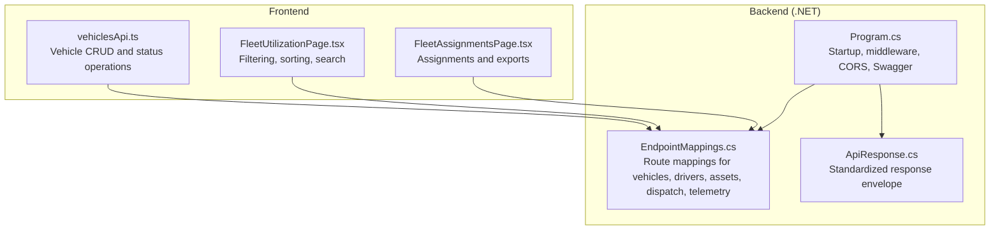
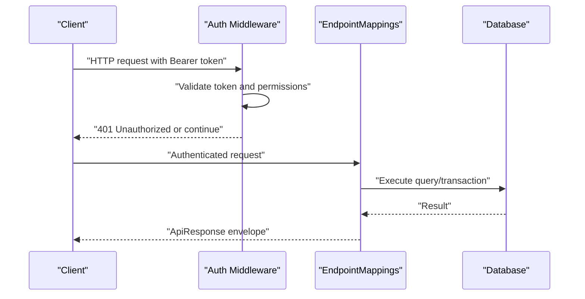
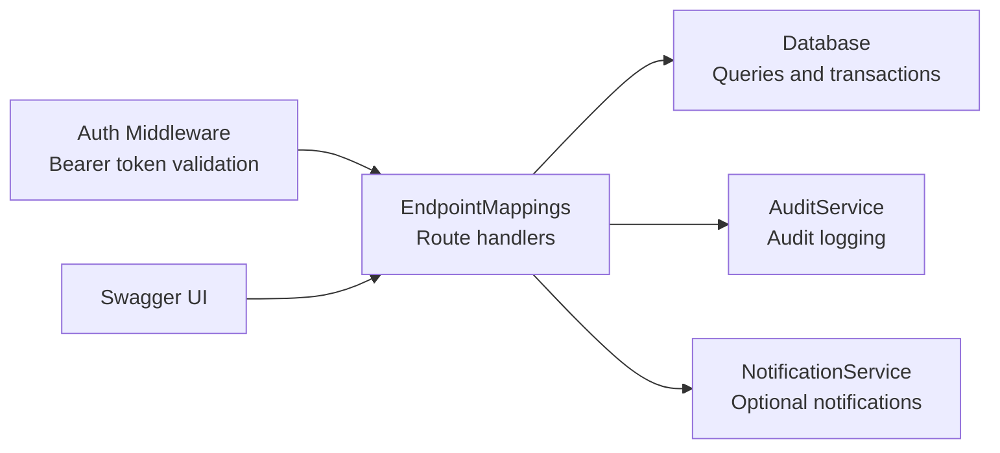

# Fleet Management API

<cite>
**Referenced Files in This Document**
- [EndpointMappings.cs](file://backend-dotnet/Controllers/EndpointMappings.cs)
- [Program.cs](file://backend-dotnet/Program.cs)
- [ApiResponse.cs](file://backend-dotnet/DTOs/ApiResponse.cs)
- [API_ENDPOINTS.md](file://docs/API_ENDPOINTS.md)
- [vehiclesApi.ts](file://frontend/src/services/vehiclesApi.ts)
- [FleetUtilizationPage.tsx](file://frontend/src/pages/FleetUtilizationPage.tsx)
- [FleetAssignmentsPage.tsx](file://frontend/src/pages/FleetAssignmentsPage.tsx)
- [002_seed.sql](file://db/init/002_seed.sql)
</cite>

## Table of Contents
1. [Introduction](#introduction)
2. [Project Structure](#project-structure)
3. [Core Components](#core-components)
4. [Architecture Overview](#architecture-overview)
5. [Detailed Component Analysis](#detailed-component-analysis)
6. [Dependency Analysis](#dependency-analysis)
7. [Performance Considerations](#performance-considerations)
8. [Troubleshooting Guide](#troubleshooting-guide)
9. [Conclusion](#conclusion)
10. [Appendices](#appendices)

## Introduction
This document provides comprehensive API documentation for fleet management endpoints covering vehicles, drivers, and assets. It details CRUD operations for vehicle registration, driver profiles, asset tracking, and fleet assignments. It also covers vehicle status updates, driver licensing verification, asset location tracking, and fleet utilization metrics. Request schemas for vehicle maintenance scheduling, driver availability checks, asset allocation, and fleet reporting are included. Filtering, searching, and bulk operations for fleet data management are documented.

## Project Structure
The fleet management API is implemented in the .NET backend under the backend-dotnet module. The primary endpoint mapping file defines all fleet-related routes, while the Program bootstraps authentication, rate limiting, CORS, and Swagger/OpenAPI support. Frontend services and pages demonstrate usage patterns for vehicle operations and fleet analytics.

**Diagram sources**
- [Program.cs:1-452](file://backend-dotnet/Program.cs#L1-L452)
- [EndpointMappings.cs:1-200](file://backend-dotnet/Controllers/EndpointMappings.cs#L1-L200)
- [ApiResponse.cs:1-8](file://backend-dotnet/DTOs/ApiResponse.cs#L1-L8)
- [vehiclesApi.ts:38-44](file://frontend/src/services/vehiclesApi.ts#L38-L44)
- [FleetUtilizationPage.tsx:79-131](file://frontend/src/pages/FleetUtilizationPage.tsx#L79-L131)
- [FleetAssignmentsPage.tsx:225-235](file://frontend/src/pages/FleetAssignmentsPage.tsx#L225-L235)

**Section sources**
- [Program.cs:1-452](file://backend-dotnet/Program.cs#L1-L452)
- [EndpointMappings.cs:1-200](file://backend-dotnet/Controllers/EndpointMappings.cs#L1-L200)
- [API_ENDPOINTS.md:1-27](file://docs/API_ENDPOINTS.md#L1-L27)

## Core Components
- Authentication and Authorization
  - Session-based authentication via Bearer token validated in middleware. Certain endpoints are public (health, telemetry ingest, customer visibility).
  - Role-based permissions enforced per endpoint (e.g., fleet:manage for create/update/delete).
- Rate Limiting
  - IP-windowed rate limiter applies a configurable limit per minute for /api routes.
- CORS and Security Headers
  - CORS configured via policy; security headers injected globally.
- OpenAPI/Swagger
  - Swagger UI and JSON spec served for discovery.

**Section sources**
- [Program.cs:92-244](file://backend-dotnet/Program.cs#L92-L244)
- [Program.cs:55-63](file://backend-dotnet/Program.cs#L55-L63)
- [Program.cs:246-247](file://backend-dotnet/Program.cs#L246-L247)

## Architecture Overview
The fleet management API follows a layered architecture:
- HTTP entrypoint handled by Program.cs
- Route mapping delegated to EndpointMappings.cs
- Standardized response envelopes via ApiResponse.cs
- Frontend services consume endpoints for vehicle CRUD, status updates, and analytics

**Diagram sources**
- [Program.cs:101-244](file://backend-dotnet/Program.cs#L101-L244)
- [EndpointMappings.cs:19-60](file://backend-dotnet/Controllers/EndpointMappings.cs#L19-L60)
- [ApiResponse.cs:3-7](file://backend-dotnet/DTOs/ApiResponse.cs#L3-L7)

## Detailed Component Analysis

### Vehicles API
- Base Path: /api/vehicles
- Summary and Insights
  - GET /api/vehicles/summary
  - GET /api/vehicles/planning-insights
- Listing and Creation
  - GET /api/vehicles
  - POST /api/vehicles
- Detail and Updates
  - GET /api/vehicles/{id}
  - PUT /api/vehicles/{id}
  - DELETE /api/vehicles/{id}
- Timeline and Recommendations
  - GET /api/vehicles/{id}/timeline
  - GET /api/vehicles/{id}/recommendations
- Assignment and Status
  - POST /api/vehicles/{id}/assign-driver
  - POST /api/vehicles/{id}/change-status

Request Schema (POST/PUT /api/vehicles):
- Required: company_id (from auth context), vehicle_code, type, make, model, year, vin, plate_number, status
- Optional: readiness_score, data_quality_score (defaults applied during creation)
- Example fields (non-exhaustive): vehicle_code, type, make, model, year, vin, plate_number, status

Response Envelope:
- Success: ApiResponse<T> with Data containing id
- Failure: ApiResponse<T> with Errors list

Notes:
- Requires permission: fleet:manage
- Assign driver and change status endpoints accept driverId and status respectively

**Section sources**
- [EndpointMappings.cs:40-51](file://backend-dotnet/Controllers/EndpointMappings.cs#L40-L51)
- [EndpointMappings.cs:2423-2451](file://backend-dotnet/Controllers/EndpointMappings.cs#L2423-L2451)
- [vehiclesApi.ts:38-44](file://frontend/src/services/vehiclesApi.ts#L38-L44)
- [ApiResponse.cs:3-7](file://backend-dotnet/DTOs/ApiResponse.cs#L3-L7)

### Drivers API
- Base Path: /api/drivers
- Summary
  - GET /api/drivers/summary
- Listing and Creation
  - GET /api/drivers
  - POST /api/drivers
- Detail and Updates
  - GET /api/drivers/{id}
  - PUT /api/drivers/{id}
  - DELETE /api/drivers/{id}
- Timeline and Recommendations
  - GET /api/drivers/{id}/timeline
  - GET /api/drivers/{id}/recommendations
- Assignment and Status
  - POST /api/drivers/{id}/assign-vehicle
  - POST /api/drivers/{id}/change-status

Request Schema (POST/PUT /api/drivers):
- Required: company_id (from auth context), driver_code, full_name, phone, email, license_number, status
- Optional: safety_score, readiness_score (defaults applied during creation)

Notes:
- Requires permission: fleet:manage
- License verification is part of driver profile creation/update; enforcement depends on business rules in the backend.

**Section sources**
- [EndpointMappings.cs:111-121](file://backend-dotnet/Controllers/EndpointMappings.cs#L111-L121)
- [EndpointMappings.cs:2453-2470](file://backend-dotnet/Controllers/EndpointMappings.cs#L2453-L2470)

### Assets API
- Base Path: /api/assets
- Summary
  - GET /api/assets/summary
- Listing and Creation
  - GET /api/assets
  - POST /api/assets
- Detail and Updates
  - GET /api/assets/{id}
  - PUT /api/assets/{id}
  - DELETE /api/assets/{id}
- Timeline and Recommendations
  - GET /api/assets/{id}/timeline
  - GET /api/assets/{id}/recommendations
- Allocation
  - POST /api/assets/{id}/assign

Request Schema (POST/PUT /api/assets):
- Required: company_id (from auth context), asset_code, asset_type, name, status
- Optional: current_location, assigned_vehicle_id, assigned_driver_id, customer_id

Request Schema (POST /api/assets/{id}/assign):
- vehicleId, driverId, customerId (any combination supported)

Notes:
- Requires permission: fleet:manage

**Section sources**
- [EndpointMappings.cs:131-152](file://backend-dotnet/Controllers/EndpointMappings.cs#L131-L152)
- [EndpointMappings.cs:2542-2559](file://backend-dotnet/Controllers/EndpointMappings.cs#L2542-L2559)

### Fleet Utilization Metrics
- Endpoint: GET /api/fleet/utilization
- Purpose: Provides utilization percentage, idle time, fuel efficiency, and active hour tracking across the fleet
- Filtering and Search (client-side demonstration):
  - Status filter: All, Active, Available, Maintenance
  - Search across vehicleCode, driverName, type
  - Sorting by utilizationPct, idleMinutesToday, fuelCostMonth, riskScore

**Section sources**
- [EndpointMappings.cs:569-570](file://backend-dotnet/Controllers/EndpointMappings.cs#L569-L570)
- [FleetUtilizationPage.tsx:79-131](file://frontend/src/pages/FleetUtilizationPage.tsx#L79-L131)

### Driver Availability Checks
- Endpoint: GET /api/dispatch/available-drivers
- Purpose: Lists drivers available for assignment based on current status and schedule

**Section sources**
- [EndpointMappings.cs:176-177](file://backend-dotnet/Controllers/EndpointMappings.cs#L176-L177)

### Vehicle Availability Checks
- Endpoint: GET /api/dispatch/available-vehicles
- Purpose: Lists vehicles available for assignment based on current status and schedule

**Section sources**
- [EndpointMappings.cs:177-178](file://backend-dotnet/Controllers/EndpointMappings.cs#L177-L178)

### Asset Allocation
- Endpoint: POST /api/assets/{id}/assign
- Body: vehicleId, driverId, customerId (optional fields; any subset may be provided)

**Section sources**
- [EndpointMappings.cs:147-151](file://backend-dotnet/Controllers/EndpointMappings.cs#L147-L151)
- [EndpointMappings.cs:2542-2559](file://backend-dotnet/Controllers/EndpointMappings.cs#L2542-L2559)

### Vehicle Status Updates
- Endpoint: POST /api/vehicles/{id}/change-status
- Body: status (string)

**Section sources**
- [EndpointMappings.cs:49-50](file://backend-dotnet/Controllers/EndpointMappings.cs#L49-L50)
- [vehiclesApi.ts:43-44](file://frontend/src/services/vehiclesApi.ts#L43-L44)

### Driver Licensing Verification
- During driver creation/update, license_number is required and stored with the profile.
- Enforcement of validity and expiry is governed by business rules in the backend; the API surfaces the field for compliance tracking.

**Section sources**
- [EndpointMappings.cs:2453-2470](file://backend-dotnet/Controllers/EndpointMappings.cs#L2453-L2470)

### Vehicle Maintenance Scheduling
- Endpoint: GET /api/preventive-maintenance
- Purpose: Lists maintenance items with due dates, status, risk level, and related vehicle
- Related endpoints:
  - GET /api/maintenance/work-orders (existing in docs)
  - Maintenance summary and items endpoints exist in backend

**Section sources**
- [EndpointMappings.cs:555-567](file://backend-dotnet/Controllers/EndpointMappings.cs#L555-L567)
- [API_ENDPOINTS.md:14-14](file://docs/API_ENDPOINTS.md#L14-L14)

### Fleet Reporting
- Endpoint: GET /api/fleet/utilization (metrics and KPIs)
- Additional KPI computation and summary endpoints exist in backend

**Section sources**
- [EndpointMappings.cs:569-6035](file://backend-dotnet/Controllers/EndpointMappings.cs#L569-L6035)

### Filtering, Searching, and Bulk Operations
- Filtering and Search:
  - Client-side filtering demonstrated in FleetUtilizationPage (status filter, search, sort)
- Bulk Operations:
  - No explicit bulk endpoints identified in the analyzed files; bulk operations would require dedicated endpoints and are not present in the current route mappings.

**Section sources**
- [FleetUtilizationPage.tsx:79-131](file://frontend/src/pages/FleetUtilizationPage.tsx#L79-L131)
- [EndpointMappings.cs:1-200](file://backend-dotnet/Controllers/EndpointMappings.cs#L1-L200)

## Dependency Analysis
- Authentication and Permissions
  - Auth middleware validates bearer tokens and injects user/company/role/permissions into context items.
  - Permission keys checked per endpoint (e.g., fleet:manage).
- CORS and Security
  - CORS policy configured; security headers added globally.
- OpenAPI
  - Swagger UI and spec served for endpoint discovery.

**Diagram sources**
- [Program.cs:101-244](file://backend-dotnet/Program.cs#L101-L244)
- [EndpointMappings.cs:1-60](file://backend-dotnet/Controllers/EndpointMappings.cs#L1-L60)

**Section sources**
- [Program.cs:101-244](file://backend-dotnet/Program.cs#L101-L244)
- [EndpointMappings.cs:1-60](file://backend-dotnet/Controllers/EndpointMappings.cs#L1-L60)

## Performance Considerations
- Rate Limiting
  - IP-windowed rate limiting protects endpoints; tune RATE_LIMIT_WINDOW_MS and RATE_LIMIT_MAX_REQUESTS as needed.
- Pagination and Filtering
  - Prefer server-side filtering and pagination for large datasets (e.g., vehicles, drivers, assets lists).
- Caching
  - Consider caching read-mostly summaries (e.g., /api/vehicles/summary, /api/drivers/summary) to reduce DB load.
- Asynchronous Operations
  - Backend uses async/await for DB operations; maintain this pattern for write-heavy endpoints.

[No sources needed since this section provides general guidance]

## Troubleshooting Guide
- Authentication Issues
  - Ensure Bearer token is present and valid; sessions expire and require re-authentication.
- Authorization Issues
  - Some endpoints require fleet:manage; verify user permissions.
- Rate Limiting
  - If receiving 429 Too Many Requests, reduce request frequency or increase limits.
- OpenAPI Discovery
  - Use /swagger or /swagger/index.html to inspect endpoints and schemas.

**Section sources**
- [Program.cs:101-244](file://backend-dotnet/Program.cs#L101-L244)
- [Program.cs:246-247](file://backend-dotnet/Program.cs#L246-L247)

## Conclusion
The fleet management API provides comprehensive CRUD and operational endpoints for vehicles, drivers, and assets, along with utilization metrics, availability checks, and asset allocation. Authentication and authorization are enforced centrally, and standardized response envelopes simplify client integration. While bulk operations are not currently exposed, filtering and search patterns are demonstrated in the frontend. Extending the API with bulk endpoints and additional fleet reporting capabilities can further enhance fleet data management.

[No sources needed since this section summarizes without analyzing specific files]

## Appendices

### Request/Response Envelope
All endpoints return a standardized envelope:
- Success: ApiResponse<T> with Success=true, Data, optional Message, Errors=[]
- Failure: ApiResponse<T> with Success=false, Data=null, Message, Errors=[...]

**Section sources**
- [ApiResponse.cs:3-7](file://backend-dotnet/DTOs/ApiResponse.cs#L3-L7)

### Example Seed Data References
- Vehicles, drivers, and assets are seeded in SQL for demonstration and testing.

**Section sources**
- [002_seed.sql:19-29](file://db/init/002_seed.sql#L19-L29)