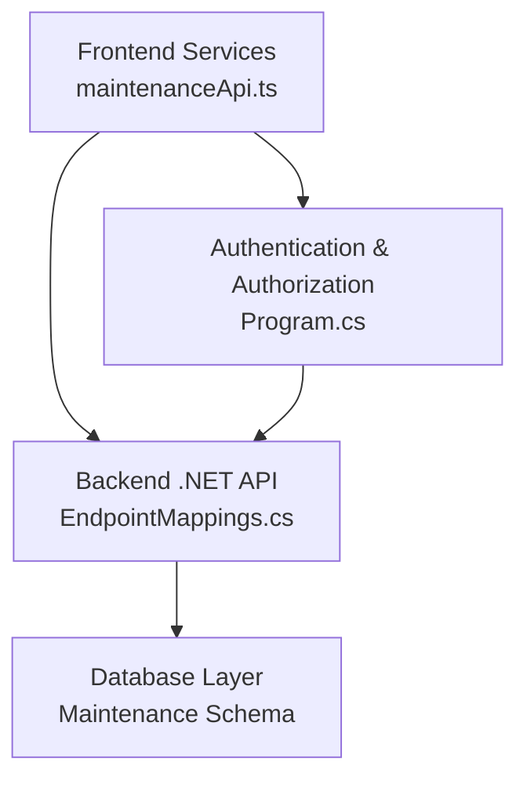
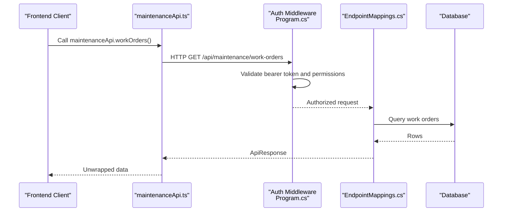
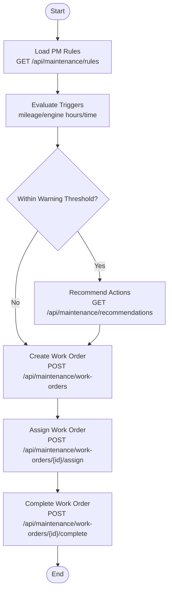
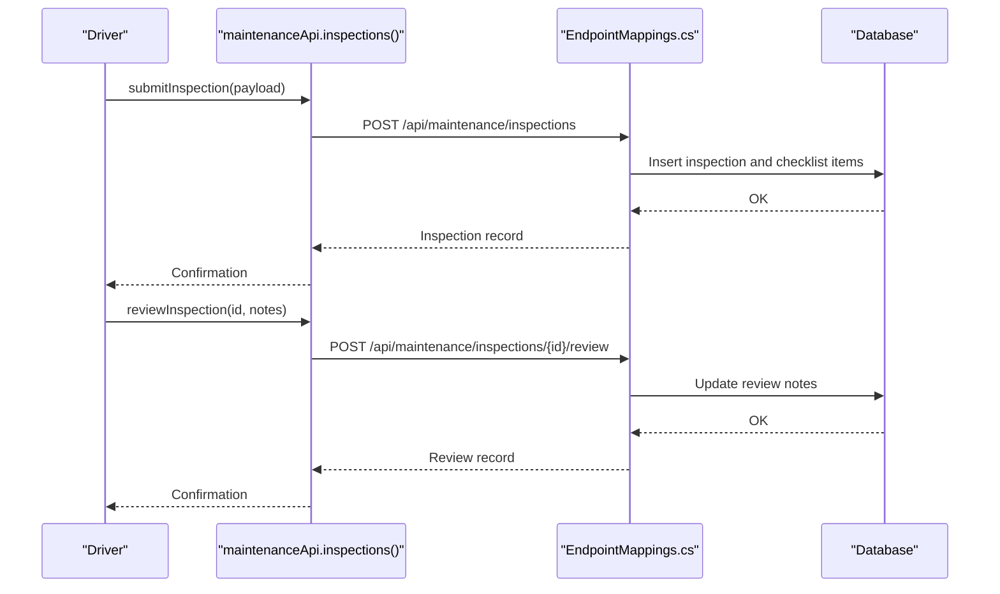
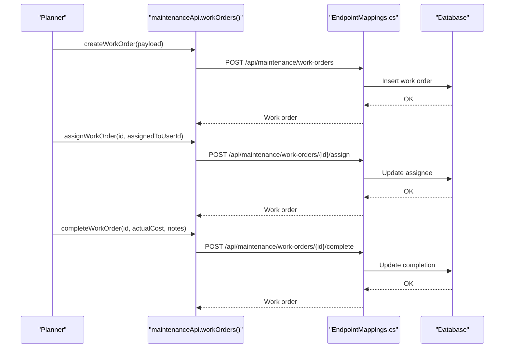
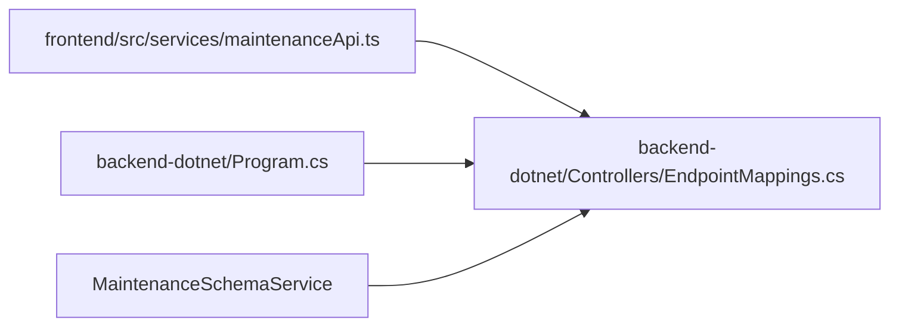

# Maintenance API

<cite>
**Referenced Files in This Document**
- [API_ENDPOINTS.md](file://docs/API_ENDPOINTS.md)
- [maintenanceApi.ts](file://frontend/src/services/maintenanceApi.ts)
- [EndpointMappings.cs](file://backend-dotnet/Controllers/EndpointMappings.cs)
- [Program.cs](file://backend-dotnet/Program.cs)
- [maintenanceApi.tsx](file://frontend/src/pages/MaintenancePlanningPage.tsx)
- [maintenanceApi.tsx](file://frontend/src/pages/MaintenanceCommandPage.tsx)
- [maintenanceApi.tsx](file://frontend/src/pages/DriverDvirPage.tsx)
- [maintenanceApi.tsx](file://frontend/src/pages/FleetHealthPage.tsx)
</cite>

## Table of Contents
1. [Introduction](#introduction)
2. [Project Structure](#project-structure)
3. [Core Components](#core-components)
4. [Architecture Overview](#architecture-overview)
5. [Detailed Component Analysis](#detailed-component-analysis)
6. [Dependency Analysis](#dependency-analysis)
7. [Performance Considerations](#performance-considerations)
8. [Troubleshooting Guide](#troubleshooting-guide)
9. [Conclusion](#conclusion)

## Introduction
This document provides comprehensive API documentation for the maintenance management system, focusing on preventive maintenance, work orders, and DVIR (Driver Vehicle Inspection Report) processes. It covers maintenance scheduling workflows, work order creation and tracking, vehicle inspection procedures, maintenance history management, and predictive maintenance integration. It also outlines maintenance cost tracking capabilities and the request schemas for maintenance planning, work order assignments, inspection checklists, and parts inventory management.

## Project Structure
The maintenance API spans both the frontend and backend components:
- Frontend service layer defines typed client methods for maintenance operations.
- Backend .NET endpoints expose maintenance CRUD, scheduling, work order management, DVIR, and predictive maintenance rule endpoints.
- Authentication and authorization middleware enforce permission scopes for maintenance operations.

**Diagram sources**
- [maintenanceApi.ts:1-102](file://frontend/src/services/maintenanceApi.ts#L1-L102)
- [EndpointMappings.cs:619-666](file://backend-dotnet/Controllers/EndpointMappings.cs#L619-L666)
- [Program.cs:101-245](file://backend-dotnet/Program.cs#L101-L245)

**Section sources**
- [API_ENDPOINTS.md:1-27](file://docs/API_ENDPOINTS.md#L1-L27)
- [maintenanceApi.ts:1-102](file://frontend/src/services/maintenanceApi.ts#L1-L102)
- [EndpointMappings.cs:619-666](file://backend-dotnet/Controllers/EndpointMappings.cs#L619-L666)
- [Program.cs:101-245](file://backend-dotnet/Program.cs#L101-L245)

## Core Components
- Maintenance Dashboard and Summary: Provides overview metrics and summaries for maintenance operations.
- DVIR Inspections: End-to-end inspection lifecycle including listing, viewing details, submitting results, and reviewing.
- Defect Management: Track, acknowledge, and resolve defects found during inspections or maintenance.
- Work Orders: Create, assign, and complete work orders linked to vehicles and defects.
- Preventive Maintenance Rules: Retrieve and upsert PM rules with triggers based on miles, engine hours, days, thresholds, priority, and cost.
- Fault Codes: Ingest and list fault codes for diagnostics.
- Legacy Maintenance Endpoints: Support for historical maintenance items, due/overdue lists, and recommendations.

**Section sources**
- [maintenanceApi.ts:6-101](file://frontend/src/services/maintenanceApi.ts#L6-L101)
- [EndpointMappings.cs:619-666](file://backend-dotnet/Controllers/EndpointMappings.cs#L619-L666)

## Architecture Overview
The maintenance API follows a layered architecture:
- Presentation: Frontend service methods encapsulate HTTP calls.
- Application: Backend endpoint mappings route requests to handlers.
- Persistence: Database queries manage maintenance items, work orders, inspections, and rules.
- Security: Centralized authentication middleware validates sessions and permissions.

**Diagram sources**
- [maintenanceApi.ts:48-63](file://frontend/src/services/maintenanceApi.ts#L48-L63)
- [EndpointMappings.cs:623-626](file://backend-dotnet/Controllers/EndpointMappings.cs#L623-L626)
- [Program.cs:101-245](file://backend-dotnet/Program.cs#L101-L245)

## Detailed Component Analysis

### Preventive Maintenance Rules
Preventive maintenance rules define automated triggers and actions based on operational metrics and thresholds.

- Retrieve PM Rules
  - Method: GET
  - Endpoint: /api/maintenance/rules
  - Description: Fetch all PM rules configured for the tenant.
  - Response: Array of rule definitions.

- Upsert PM Rule
  - Method: PUT
  - Endpoint: /api/maintenance/rules/{ruleType}
  - Path Parameters:
    - ruleType: string (identifier for the rule)
  - Request Body Fields:
    - ruleName: string (optional)
    - triggerType: string (e.g., "mileage", "engine_hours", "time_based")
    - intervalMiles: number (optional)
    - intervalEngineHours: number (optional)
    - intervalDays: number (optional)
    - warningThresholdPct: number (optional)
    - priority: string (e.g., "low", "medium", "high")
    - estimatedCost: number (optional)
    - enabled: boolean
  - Response: Updated rule definition.

- Predictive Recommendations
  - Method: GET
  - Endpoint: /api/maintenance/recommendations
  - Description: Retrieves AI-driven recommendations for maintenance actions.
  - Response: Array of recommendation entries.

**Section sources**
- [maintenanceApi.ts:66-80](file://frontend/src/services/maintenanceApi.ts#L66-L80)
- [EndpointMappings.cs:627-635](file://backend-dotnet/Controllers/EndpointMappings.cs#L627-L635)

### Work Orders
Work orders support creation, assignment, completion, and summary reporting.

- List Work Orders
  - Method: GET
  - Endpoint: /api/maintenance/work-orders
  - Query Parameters:
    - status: string (optional)
    - vehicleId: number (optional)
    - limit: number (optional)
  - Response: Array of work orders.

- Create Work Order
  - Method: POST
  - Endpoint: /api/maintenance/work-orders
  - Request Body Fields:
    - vehicleId: number
    - title: string (optional)
    - serviceType: string (optional)
    - description: string (optional)
    - priority: string (optional)
    - defectId: number (optional)
    - estimatedCost: number (optional)
    - scheduledAt: string (ISO date-time, optional)
  - Response: Created work order.

- Assign Work Order
  - Method: POST
  - Endpoint: /api/maintenance/work-orders/{id}/assign
  - Path Parameters:
    - id: number
  - Request Body Fields:
    - assignedToUserId: number
  - Response: Assigned work order.

- Complete Work Order
  - Method: POST
  - Endpoint: /api/maintenance/work-orders/{id}/complete
  - Path Parameters:
    - id: number
  - Request Body Fields:
    - actualCost: number (optional)
    - notes: string (optional)
  - Response: Completed work order.

- Work Orders Summary
  - Method: GET
  - Endpoint: /api/workorders/summary
  - Response: Summary metrics for work orders.

- Work Orders Full List
  - Method: GET
  - Endpoint: /api/workorders
  - Response: All work orders.

**Section sources**
- [maintenanceApi.ts:48-63](file://frontend/src/services/maintenanceApi.ts#L48-L63)
- [EndpointMappings.cs:623-626](file://backend-dotnet/Controllers/EndpointMappings.cs#L623-L626)
- [EndpointMappings.cs:665-666](file://backend-dotnet/Controllers/EndpointMappings.cs#L665-L666)

### DVIR Inspections
DVIR processes enable drivers to record inspection results and supervisors to review findings.

- List Inspections
  - Method: GET
  - Endpoint: /api/maintenance/inspections
  - Query Parameters:
    - status: string (optional)
    - vehicleId: number (optional)
    - limit: number (optional)
  - Response: Array of inspection records.

- Inspection Detail
  - Method: GET
  - Endpoint: /api/maintenance/inspections/{id}
  - Path Parameters:
    - id: number
  - Response: Single inspection record.

- Submit Inspection
  - Method: POST
  - Endpoint: /api/maintenance/inspections
  - Request Body Fields:
    - vehicleId: number
    - driverId: number
    - tripId: number (optional)
    - inspectionType: string (optional)
    - odometerMiles: number (optional)
    - engineHours: number (optional)
    - notes: string (optional)
    - checklistItems: array of:
      - category: string
      - itemName: string
      - result: "pass" | "fail" | "not_applicable"
      - severity: "minor" | "major" | "critical" (optional)
      - notes: string (optional)
  - Response: Submitted inspection record.

- Review Inspection
  - Method: POST
  - Endpoint: /api/maintenance/inspections/{id}/review
  - Path Parameters:
    - id: number
  - Request Body Fields:
    - notes: string (optional)
  - Response: Reviewed inspection record.

**Section sources**
- [maintenanceApi.ts:15-37](file://frontend/src/services/maintenanceApi.ts#L15-L37)
- [EndpointMappings.cs:619-620](file://backend-dotnet/Controllers/EndpointMappings.cs#L619-L620)

### Defect Management
Defects are tracked from discovery through resolution.

- List Defects
  - Method: GET
  - Endpoint: /api/maintenance/defects
  - Query Parameters:
    - status: string (optional)
    - vehicleId: number (optional)
  - Response: Array of defects.

- Acknowledge Defect
  - Method: POST
  - Endpoint: /api/maintenance/defects/{id}/acknowledge
  - Path Parameters:
    - id: number
  - Response: Acknowledged defect.

- Resolve Defect
  - Method: POST
  - Endpoint: /api/maintenance/defects/{id}/resolve
  - Path Parameters:
    - id: number
  - Request Body Fields:
    - notes: string (optional)
  - Response: Resolved defect.

**Section sources**
- [maintenanceApi.ts:39-45](file://frontend/src/services/maintenanceApi.ts#L39-L45)
- [EndpointMappings.cs:620-622](file://backend-dotnet/Controllers/EndpointMappings.cs#L620-L622)

### Fault Codes
Diagnostic fault codes ingestion and listing.

- Ingest Fault Codes
  - Method: POST
  - Endpoint: /api/maintenance/fault-codes/ingest
  - Request Body: Array of fault code entries
  - Response: Ingestion result.

- List Fault Codes
  - Method: GET
  - Endpoint: /api/maintenance/fault-codes
  - Query Parameters:
    - status: string (default: "active")
  - Response: Array of fault codes.

**Section sources**
- [maintenanceApi.ts:82-84](file://frontend/src/services/maintenanceApi.ts#L82-L84)
- [EndpointMappings.cs:629-630](file://backend-dotnet/Controllers/EndpointMappings.cs#L629-L630)

### Maintenance History and Scheduling
Historical maintenance items and scheduling/defer operations.

- Dashboard/Summary
  - Method: GET
  - Endpoint: /api/maintenance/dashboard
  - Response: Dashboard metrics.

- Legacy Maintenance Items
  - Methods: GET, GET by ID, POST, PUT, DELETE
  - Endpoints:
    - /api/maintenance
    - /api/maintenance/{id}
    - /api/maintenance/{id} (POST: schedule, defer, create-workorder)
  - Permissions: Requires "maintenance:manage".

- Schedule Maintenance
  - Method: POST
  - Endpoint: /api/maintenance/{id}/schedule
  - Request Body Fields:
    - scheduledDate: string (ISO date-time)
  - Response: Confirmation.

- Defer Maintenance
  - Method: POST
  - Endpoint: /api/maintenance/{id}/defer
  - Request Body Fields:
    - dueDate: string (ISO date-time) (optional)
  - Response: Confirmation.

- Create Work Order from Maintenance Item
  - Method: POST
  - Endpoint: /api/maintenance/{id}/create-workorder
  - Request Body: Work order payload (same as Create Work Order)
  - Response: Created work order.

- Due and Overdue Lists
  - Methods: GET
  - Endpoints:
    - /api/maintenance/due
    - /api/maintenance/overdue
  - Response: Arrays of maintenance items.

**Section sources**
- [maintenanceApi.ts:6-11](file://frontend/src/services/maintenanceApi.ts#L6-L11)
- [maintenanceApi.ts:86-100](file://frontend/src/services/maintenanceApi.ts#L86-L100)
- [EndpointMappings.cs:631-663](file://backend-dotnet/Controllers/EndpointMappings.cs#L631-L663)

### Request Schemas Summary
- Work Order Creation
  - Required: vehicleId
  - Optional: title, serviceType, description, priority, defectId, estimatedCost, scheduledAt

- Inspection Submission
  - Required: vehicleId, driverId
  - Optional: tripId, inspectionType, odometerMiles, engineHours, notes, checklistItems[]
    - checklistItems[].category, checklistItems[].itemName, checklistItems[].result, checklistItems[].severity, checklistItems[].notes

- Defect Resolution
  - Optional: notes

- PM Rule Upsert
  - Required: enabled
  - Optional: ruleName, triggerType, intervalMiles, intervalEngineHours, intervalDays, warningThresholdPct, priority, estimatedCost

- Maintenance Scheduling/Defer
  - Schedule: scheduledDate
  - Defer: dueDate (optional)

**Section sources**
- [maintenanceApi.ts:50-59](file://frontend/src/services/maintenanceApi.ts#L50-L59)
- [maintenanceApi.ts:20-35](file://frontend/src/services/maintenanceApi.ts#L20-L35)
- [maintenanceApi.ts:67-80](file://frontend/src/services/maintenanceApi.ts#L67-L80)
- [maintenanceApi.ts:96-99](file://frontend/src/services/maintenanceApi.ts#L96-L99)

### End-to-End Workflows

#### Preventive Maintenance Planning

**Diagram sources**
- [EndpointMappings.cs:627-635](file://backend-dotnet/Controllers/EndpointMappings.cs#L627-L635)
- [EndpointMappings.cs:623-626](file://backend-dotnet/Controllers/EndpointMappings.cs#L623-L626)

#### DVIR Inspection Workflow

**Diagram sources**
- [maintenanceApi.ts:20-37](file://frontend/src/services/maintenanceApi.ts#L20-L37)
- [EndpointMappings.cs:619-620](file://backend-dotnet/Controllers/EndpointMappings.cs#L619-L620)

#### Work Order Lifecycle

**Diagram sources**
- [maintenanceApi.ts:60-63](file://frontend/src/services/maintenanceApi.ts#L60-L63)
- [EndpointMappings.cs:625-626](file://backend-dotnet/Controllers/EndpointMappings.cs#L625-L626)

## Dependency Analysis
- Frontend depends on typed service methods to communicate with backend endpoints.
- Backend enforces authorization via middleware and delegates to database services.
- Maintenance endpoints rely on the maintenance schema service for database migrations and schema consistency.

**Diagram sources**
- [maintenanceApi.ts:1-102](file://frontend/src/services/maintenanceApi.ts#L1-L102)
- [EndpointMappings.cs:619-666](file://backend-dotnet/Controllers/EndpointMappings.cs#L619-L666)
- [Program.cs:26-52](file://backend-dotnet/Program.cs#L26-L52)

**Section sources**
- [maintenanceApi.ts:1-102](file://frontend/src/services/maintenanceApi.ts#L1-L102)
- [EndpointMappings.cs:619-666](file://backend-dotnet/Controllers/EndpointMappings.cs#L619-L666)
- [Program.cs:26-52](file://backend-dotnet/Program.cs#L26-L52)

## Performance Considerations
- Rate limiting is enforced for API endpoints to prevent abuse.
- Background services handle maintenance-related tasks asynchronously.
- Use pagination and filtering (limit/status/vehicleId) to reduce payload sizes.
- Prefer bulk ingestion for fault codes and leverage indexing on frequently queried fields.

[No sources needed since this section provides general guidance]

## Troubleshooting Guide
- Authentication Failures
  - Symptom: 401 Unauthorized on protected endpoints.
  - Cause: Missing or invalid bearer token.
  - Action: Ensure a valid session token is included in the Authorization header.

- Permission Denied
  - Symptom: 403 Forbidden for maintenance operations.
  - Cause: Missing "maintenance:manage" permission.
  - Action: Verify user role and permissions.

- Rate Limit Exceeded
  - Symptom: 429 Too Many Requests.
  - Cause: Exceeded request limit per minute.
  - Action: Retry after the rate window elapses or reduce request frequency.

- Validation Errors
  - Symptom: Malformed request bodies.
  - Action: Validate required fields and types according to request schemas.

**Section sources**
- [Program.cs:101-245](file://backend-dotnet/Program.cs#L101-L245)

## Conclusion
The Maintenance API provides a comprehensive set of endpoints for preventive maintenance, work order management, DVIR inspections, and predictive maintenance integration. By leveraging the documented schemas and workflows, teams can streamline maintenance operations, improve vehicle reliability, and maintain accurate maintenance histories. Adhering to the request schemas and authorization requirements ensures robust and secure integrations.