# Operations API

<cite>
**Referenced Files in This Document**
- [API_ENDPOINTS.md](file://docs/API_ENDPOINTS.md)
- [app.ts](file://backend/src/app.ts)
- [dispatchApi.ts](file://frontend/src/services/dispatchApi.ts)
- [jobsApi.ts](file://frontend/src/services/jobsApi.ts)
- [routesApi.ts](file://frontend/src/services/routesApi.ts)
- [opsApi.ts](file://frontend/src/services/opsApi.ts)
- [EndpointMappings.cs](file://backend-dotnet/Controllers/EndpointMappings.cs)
- [ApiResponse.cs](file://backend-dotnet/DTOs/ApiResponse.cs)
- [Database.cs](file://backend-dotnet/Data/Database.cs)
- [ErrorHandlingMiddleware.cs](file://backend-dotnet/Middleware/ErrorHandlingMiddleware.cs)
- [OpsMetricsService.cs](file://backend-dotnet/Services/OpsMetricsService.cs)
- [DispatchSchemaService.cs](file://backend-dotnet/Services/DispatchSchemaService.cs)
- [DriverSchemaService.cs](file://backend-dotnet/Services/DriverSchemaService.cs)
- [TripSchemaService.cs](file://backend-dotnet/Services/TripSchemaService.cs)
- [TelemetryBackgroundService.cs](file://backend-dotnet/Services/TelemetryBackgroundService.cs)
- [MaintenanceSchemaService.cs](file://backend-dotnet/Services/MaintenanceSchemaService.cs)
- [ReportingSchemaService.cs](file://backend-dotnet/Services/ReportingSchemaService.cs)
- [CustomerVisibilitySchemaService.cs](file://backend-dotnet/Services/CustomerVisibilitySchemaService.cs)
- [SecuritySchemaService.cs](file://backend-dotnet/Services/SecuritySchemaService.cs)
- [SafetySchemaService.cs](file://backend-dotnet/Services/SafetySchemaService.cs)
- [TelemetrySchemaService.cs](file://backend-dotnet/Services/TelemetrySchemaService.cs)
- [TelemetryKeyStore.cs](file://backend-dotnet/TelemetryKeyStore.cs)
- [TelemetryTicketHelper.cs](file://backend-dotnet/TelemetryTicketHelper.cs)
- [TelemetryHmacHelper.cs](file://backend-dotnet/TelemetryHmacHelper.cs)
</cite>

## Table of Contents
1. [Introduction](#introduction)
2. [Project Structure](#project-structure)
3. [Core Components](#core-components)
4. [Architecture Overview](#architecture-overview)
5. [Detailed Component Analysis](#detailed-component-analysis)
6. [Dependency Analysis](#dependency-analysis)
7. [Performance Considerations](#performance-considerations)
8. [Troubleshooting Guide](#troubleshooting-guide)
9. [Conclusion](#conclusion)
10. [Appendices](#appendices)

## Introduction
This document describes the Operations API surface for dispatch coordination, job management, and route planning across the platform. It consolidates endpoint definitions, request/response schemas, workflows, and integration touchpoints visible in the repository. The backend exposes REST endpoints consumed by the frontend services, while the .NET backend provides robust DTOs, middleware, and services supporting operations monitoring, dispatch orchestration, and route optimization.

## Project Structure
The Operations API spans:
- Frontend service clients that define operation endpoints and request payloads
- Backend Express application wiring and routing
- .NET backend controllers, DTOs, middleware, and domain services

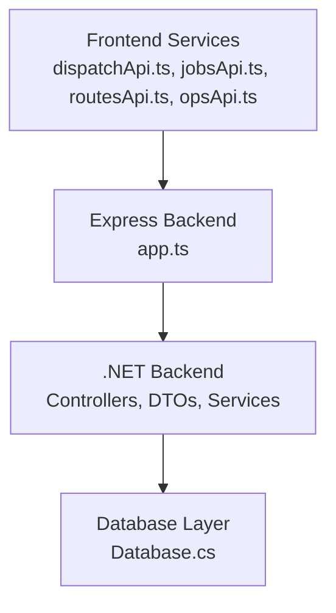

**Diagram sources**
- [dispatchApi.ts:1-118](file://frontend/src/services/dispatchApi.ts#L1-L118)
- [jobsApi.ts:1-34](file://frontend/src/services/jobsApi.ts#L1-L34)
- [routesApi.ts:1-30](file://frontend/src/services/routesApi.ts#L1-L30)
- [opsApi.ts:161-201](file://frontend/src/services/opsApi.ts#L161-L201)
- [app.ts:16-97](file://backend/src/app.ts#L16-L97)
- [EndpointMappings.cs:1-200](file://backend-dotnet/Controllers/EndpointMappings.cs#L1-L200)
- [Database.cs:1-200](file://backend-dotnet/Data/Database.cs#L1-L200)

**Section sources**
- [API_ENDPOINTS.md:1-27](file://docs/API_ENDPOINTS.md#L1-L27)
- [app.ts:16-97](file://backend/src/app.ts#L16-L97)

## Core Components
- Dispatch Management
  - Board and summaries, assignment lifecycle, eligibility checks, exception management, proof recording, and availability pools
- Job Management
  - Listing, detail retrieval, creation/update/delete, import preview, assignment, status change, ETA sending, and proof placeholders
- Route Planning
  - List/summary/detail, CRUD for stops, optimization preview, assignment, timeline, and recommendations
- Operations Monitoring
  - Metrics snapshot, service runs, incident tracking, configuration checks, and deep health

**Section sources**
- [dispatchApi.ts:6-118](file://frontend/src/services/dispatchApi.ts#L6-L118)
- [jobsApi.ts:6-34](file://frontend/src/services/jobsApi.ts#L6-L34)
- [routesApi.ts:6-30](file://frontend/src/services/routesApi.ts#L6-L30)
- [opsApi.ts:161-201](file://frontend/src/services/opsApi.ts#L161-L201)

## Architecture Overview
The frontend invokes REST endpoints under /api. The Express backend registers routes and applies middleware for CORS, security headers, rate limiting, and error handling. The .NET backend provides controllers, DTOs, and services backing operations, telemetry, dispatch, and reporting.

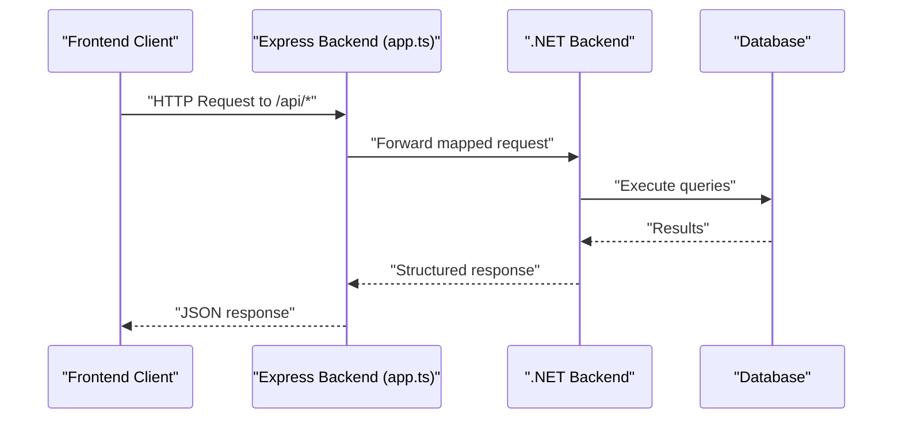

**Diagram sources**
- [app.ts:74-94](file://backend/src/app.ts#L74-L94)
- [EndpointMappings.cs:1-200](file://backend-dotnet/Controllers/EndpointMappings.cs#L1-L200)
- [Database.cs:1-200](file://backend-dotnet/Data/Database.cs#L1-L200)

## Detailed Component Analysis

### Dispatch Management API
Endpoints and payloads are defined in the frontend service client. Typical operations include:
- Retrieve board and summary
- List assignments with filters
- Get assignment detail
- Create assignment with driver/vehicle/route/job identifiers and scheduling fields
- Accept assignment
- Update status with notes
- Create exception with type/severity/title/notes
- Cancel assignment with notes
- Record proof with type/pickup/delivery and location metadata
- Check eligibility for pairing
- List exceptions with optional status filter
- Query available drivers and vehicles
- Recommendations endpoint
- Legacy endpoints for compatibility

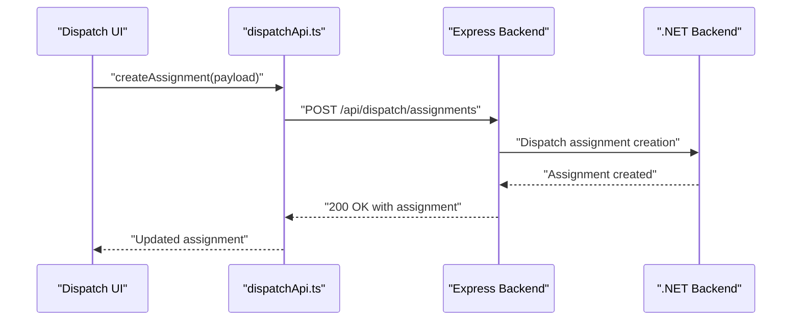

**Diagram sources**
- [dispatchApi.ts:28-39](file://frontend/src/services/dispatchApi.ts#L28-L39)
- [app.ts:74-94](file://backend/src/app.ts#L74-L94)
- [EndpointMappings.cs:1-200](file://backend-dotnet/Controllers/EndpointMappings.cs#L1-L200)

**Section sources**
- [dispatchApi.ts:6-118](file://frontend/src/services/dispatchApi.ts#L6-L118)

### Job Management API
Operations include listing, summary, detail retrieval, timeline, recommendations, creation, update, deletion, import preview, assignment, status change, ETA sending, and proof placeholders.

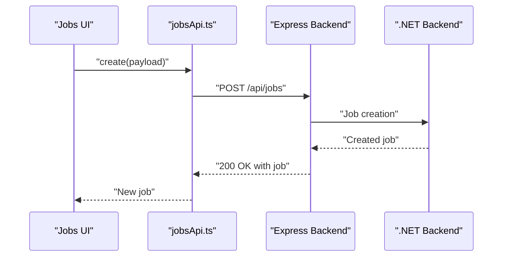

**Diagram sources**
- [jobsApi.ts:25-25](file://frontend/src/services/jobsApi.ts#L25-L25)
- [app.ts:74-94](file://backend/src/app.ts#L74-L94)
- [EndpointMappings.cs:1-200](file://backend-dotnet/Controllers/EndpointMappings.cs#L1-L200)

**Section sources**
- [jobsApi.ts:6-34](file://frontend/src/services/jobsApi.ts#L6-L34)

### Route Planning API
Routes support listing, summary, detail, CRUD on stops, optimization preview, assignment, timeline, and recommendations.

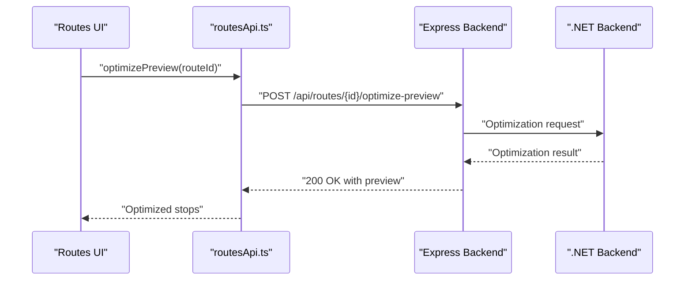

**Diagram sources**
- [routesApi.ts:25-25](file://frontend/src/services/routesApi.ts#L25-L25)
- [app.ts:74-94](file://backend/src/app.ts#L74-L94)
- [EndpointMappings.cs:1-200](file://backend-dotnet/Controllers/EndpointMappings.cs#L1-L200)

**Section sources**
- [routesApi.ts:6-30](file://frontend/src/services/routesApi.ts#L6-L30)

### Operations Monitoring API
Metrics and health endpoints include:
- Fetch metrics snapshot
- Service runs and history
- Incidents and status updates
- Configuration checks
- Deep health check

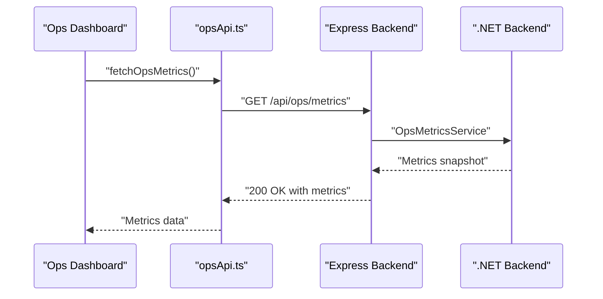

**Diagram sources**
- [opsApi.ts:161-164](file://frontend/src/services/opsApi.ts#L161-L164)
- [app.ts:74-94](file://backend/src/app.ts#L74-L94)
- [OpsMetricsService.cs:1-200](file://backend-dotnet/Services/OpsMetricsService.cs#L1-L200)

**Section sources**
- [opsApi.ts:161-201](file://frontend/src/services/opsApi.ts#L161-L201)

### Telemetry and Real-Time Events
The platform supports telemetry ingestion and real-time event streaming:
- Telemetry ingestion endpoints
- WebSocket endpoint for live events
- HMAC and ticket helpers for secure telemetry handling

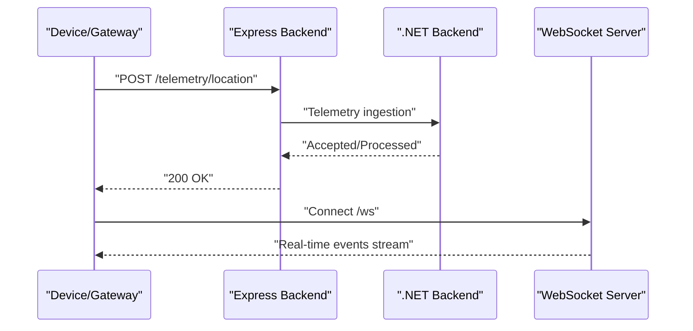

**Diagram sources**
- [API_ENDPOINTS.md:23-26](file://docs/API_ENDPOINTS.md#L23-L26)
- [TelemetryKeyStore.cs:1-200](file://backend-dotnet/TelemetryKeyStore.cs#L1-L200)
- [TelemetryTicketHelper.cs:1-200](file://backend-dotnet/TelemetryTicketHelper.cs#L1-L200)
- [TelemetryHmacHelper.cs:1-200](file://backend-dotnet/TelemetryHmacHelper.cs#L1-L200)

**Section sources**
- [API_ENDPOINTS.md:18-27](file://docs/API_ENDPOINTS.md#L18-L27)

## Dependency Analysis
- Frontend services depend on shared API client and fallback mechanisms for development data.
- Express backend wires routes and applies global middleware for security and rate limiting.
- .NET backend provides services for dispatch, telemetry, maintenance, reporting, and observability.

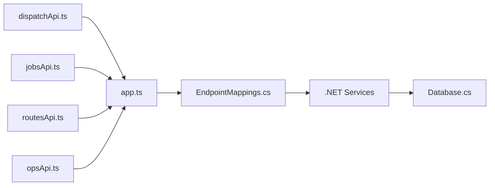

**Diagram sources**
- [dispatchApi.ts:1-118](file://frontend/src/services/dispatchApi.ts#L1-L118)
- [jobsApi.ts:1-34](file://frontend/src/services/jobsApi.ts#L1-L34)
- [routesApi.ts:1-30](file://frontend/src/services/routesApi.ts#L1-L30)
- [opsApi.ts:161-201](file://frontend/src/services/opsApi.ts#L161-L201)
- [app.ts:74-94](file://backend/src/app.ts#L74-L94)
- [EndpointMappings.cs:1-200](file://backend-dotnet/Controllers/EndpointMappings.cs#L1-L200)
- [Database.cs:1-200](file://backend-dotnet/Data/Database.cs#L1-L200)

**Section sources**
- [app.ts:16-97](file://backend/src/app.ts#L16-L97)

## Performance Considerations
- Global rate limiting is applied to /api endpoints with configurable window and max requests.
- JSON body size limit is set to 5 MB for incoming requests.
- Health and readiness endpoints bypass rate limits for operational checks.
- Consider caching for frequently accessed lists (jobs, routes, assignments) and optimizing database queries for large datasets.

**Section sources**
- [app.ts:17-72](file://backend/src/app.ts#L17-L72)

## Troubleshooting Guide
- Error handling middleware ensures structured error responses.
- Health endpoints (/api/health, /api/ready) provide quick diagnostics.
- Deep health check endpoint exposes comprehensive system status.
- Use incident status update endpoint to track and resolve operational issues.

**Section sources**
- [ErrorHandlingMiddleware.cs:1-200](file://backend-dotnet/Middleware/ErrorHandlingMiddleware.cs#L1-L200)
- [app.ts:74-89](file://backend/src/app.ts#L74-L89)
- [opsApi.ts:198-201](file://frontend/src/services/opsApi.ts#L198-L201)

## Conclusion
The Operations API integrates dispatch, job, and route capabilities with robust monitoring and telemetry. The frontend service clients define clear request schemas and workflows, while the backend enforces security, rate limits, and structured responses. The .NET backend services provide scalable implementations for dispatch orchestration, telemetry ingestion, and operational insights.

## Appendices

### Endpoint Catalog
- Dispatch
  - GET /api/dispatch/summary
  - GET /api/dispatch/board
  - GET /api/dispatch/assignments
  - GET /api/dispatch/assignments/{id}
  - POST /api/dispatch/assignments
  - POST /api/dispatch/assignments/{id}/accept
  - POST /api/dispatch/assignments/{id}/status
  - POST /api/dispatch/assignments/{id}/exception
  - POST /api/dispatch/assignments/{id}/cancel
  - POST /api/dispatch/assignments/{id}/proof
  - GET /api/dispatch/eligibility
  - GET /api/dispatch/exceptions
  - GET /api/dispatch/available-drivers
  - GET /api/dispatch/available-vehicles
  - GET /api/dispatch/recommendations
  - POST /api/dispatch/send-eta-updates
  - POST /api/dispatch/assign (legacy)
  - POST /api/dispatch/status (legacy)
  - POST /api/dispatch/auto-suggest (legacy)
- Jobs
  - GET /api/jobs
  - GET /api/jobs/summary
  - GET /api/jobs/{id}
  - POST /api/jobs
  - PUT /api/jobs/{id}
  - DELETE /api/jobs/{id}
  - POST /api/jobs/import-preview
  - POST /api/jobs/{id}/assign
  - POST /api/jobs/{id}/status
  - POST /api/jobs/{id}/send-eta
  - POST /api/jobs/{id}/proof-placeholder
- Routes
  - GET /api/routes
  - GET /api/routes/summary
  - GET /api/routes/{id}
  - POST /api/routes
  - PUT /api/routes/{id}
  - DELETE /api/routes/{id}
  - GET /api/routes/{id}/stops
  - POST /api/routes/{id}/stops
  - PUT /api/routes/{id}/stops/{stopId}
  - DELETE /api/routes/{id}/stops/{stopId}
  - POST /api/routes/{id}/optimize-preview
  - POST /api/routes/{id}/assign
  - GET /api/routes/{id}/timeline
  - GET /api/routes/{id}/recommendations
- Operations
  - GET /api/ops/metrics
  - GET /api/ops/services
  - GET /api/ops/services/{serviceName}
  - GET /api/ops/incidents
  - PATCH /api/ops/incidents/{id}/status
  - GET /api/ops/config/check
  - GET /health/deep
- Telemetry and Events
  - POST /telemetry/location
  - POST /events/safety
  - POST /ai/generate-daily-brief
  - GET /ws

**Section sources**
- [API_ENDPOINTS.md:3-27](file://docs/API_ENDPOINTS.md#L3-L27)
- [dispatchApi.ts:6-118](file://frontend/src/services/dispatchApi.ts#L6-L118)
- [jobsApi.ts:6-34](file://frontend/src/services/jobsApi.ts#L6-L34)
- [routesApi.ts:6-30](file://frontend/src/services/routesApi.ts#L6-L30)
- [opsApi.ts:161-201](file://frontend/src/services/opsApi.ts#L161-L201)

### Request/Response Schemas

- Dispatch Assignment Creation
  - POST /api/dispatch/assignments
  - Body fields: vehicleId, driverId, jobId, routeId, trailerId, plannedPickupAt, plannedDeliveryAt, notes, overrideReason, override
  - Response: Created assignment object

- Dispatch Status Update
  - POST /api/dispatch/assignments/{id}/status
  - Body fields: status, notes
  - Response: Updated assignment

- Job Creation
  - POST /api/jobs
  - Body: Job definition fields
  - Response: Created job

- Job Status Change
  - POST /api/jobs/{id}/status
  - Body fields: status, notes
  - Response: Updated job

- Route Stop CRUD
  - POST /api/routes/{id}/stops
  - PUT /api/routes/{id}/stops/{stopId}
  - DELETE /api/routes/{id}/stops/{stopId}
  - Response: Stop object(s)

- Route Optimization Preview
  - POST /api/routes/{id}/optimize-preview
  - Response: Optimization preview data

- Operations Metrics Snapshot
  - GET /api/ops/metrics
  - Response: OpsMetricsSnapshot

- Telemetry Location Ingestion
  - POST /telemetry/location
  - Response: Accepted/Processed

**Section sources**
- [dispatchApi.ts:28-45](file://frontend/src/services/dispatchApi.ts#L28-L45)
- [jobsApi.ts:25-30](file://frontend/src/services/jobsApi.ts#L25-L30)
- [routesApi.ts:18-26](file://frontend/src/services/routesApi.ts#L18-L26)
- [opsApi.ts:161-164](file://frontend/src/services/opsApi.ts#L161-L164)
- [API_ENDPOINTS.md:23-23](file://docs/API_ENDPOINTS.md#L23-L23)

### Workflow Diagrams

#### Dispatch Assignment Lifecycle
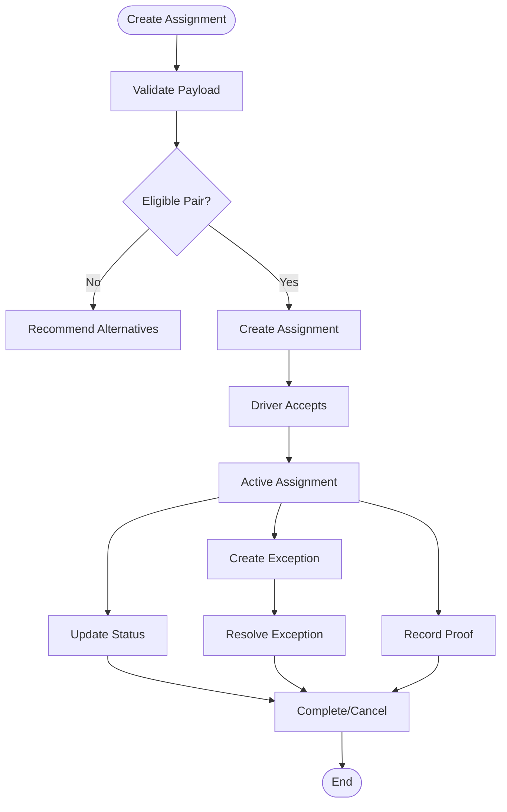

**Diagram sources**
- [dispatchApi.ts:28-77](file://frontend/src/services/dispatchApi.ts#L28-L77)

#### Job Status Tracking
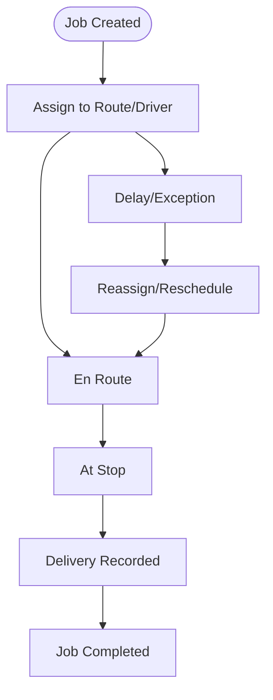

**Diagram sources**
- [jobsApi.ts:25-30](file://frontend/src/services/jobsApi.ts#L25-L30)

#### Route Optimization Preview
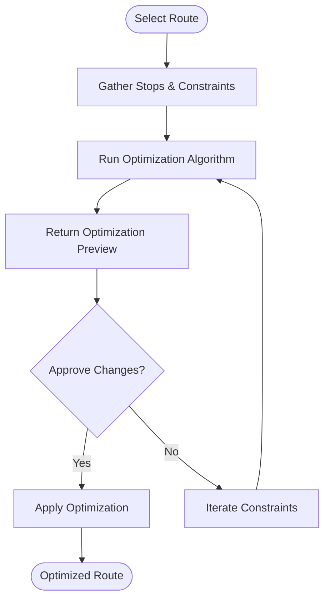

**Diagram sources**
- [routesApi.ts:25-25](file://frontend/src/services/routesApi.ts#L25-L25)

### Integration Endpoints
- Telemetry ingestion: POST /telemetry/location
- Safety events: POST /events/safety
- AI daily brief: POST /ai/generate-daily-brief
- Real-time events: WS /ws

**Section sources**
- [API_ENDPOINTS.md:18-26](file://docs/API_ENDPOINTS.md#L18-L26)