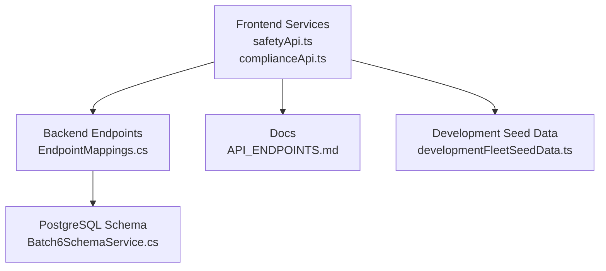
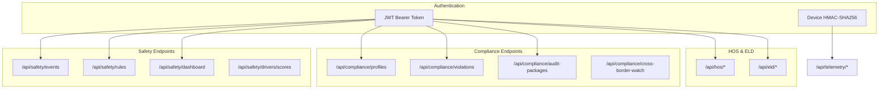
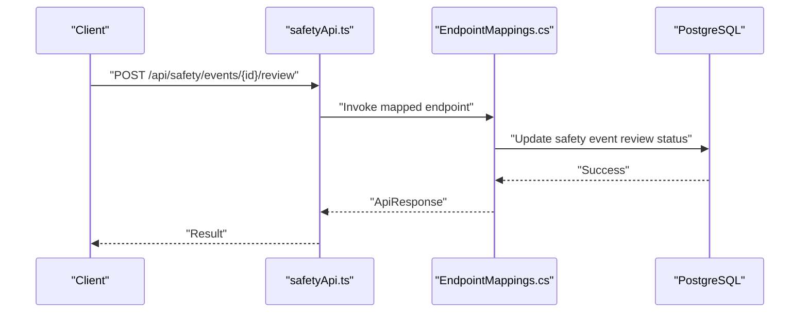
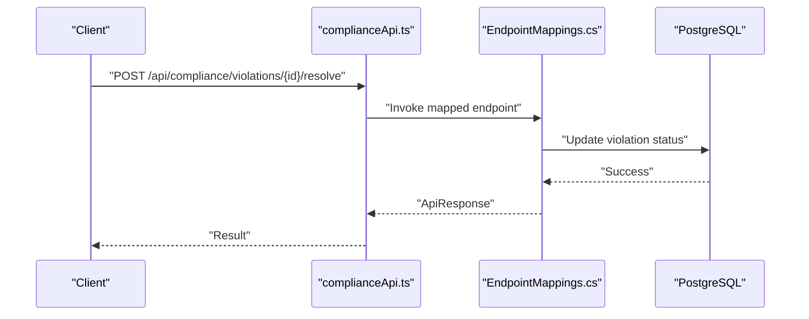
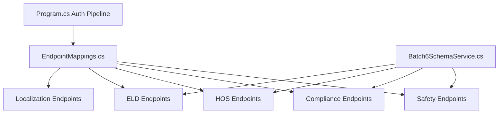

# Safety & Compliance API

<cite>
**Referenced Files in This Document**
- [EndpointMappings.cs](file://backend-dotnet/Controllers/EndpointMappings.cs)
- [Program.cs](file://backend-dotnet/Program.cs)
- [safetyApi.ts](file://frontend/src/services/safetyApi.ts)
- [complianceApi.ts](file://frontend/src/services/complianceApi.ts)
- [API_ENDPOINTS.md](file://docs/API_ENDPOINTS.md)
- [compliance.routes.ts](file://backend/src/modules/compliance/compliance.routes.ts)
- [compliance.types.ts](file://backend/src/modules/compliance/compliance.types.ts)
- [developmentFleetSeedData.ts](file://frontend/src/data/developmentFleetSeedData.ts)
- [Batch6SchemaService.cs](file://backend-dotnet/Services/Batch6SchemaService.cs)
</cite>

## Table of Contents
1. [Introduction](#introduction)
2. [Project Structure](#project-structure)
3. [Core Components](#core-components)
4. [Architecture Overview](#architecture-overview)
5. [Detailed Component Analysis](#detailed-component-analysis)
6. [Dependency Analysis](#dependency-analysis)
7. [Performance Considerations](#performance-considerations)
8. [Troubleshooting Guide](#troubleshooting-guide)
9. [Conclusion](#conclusion)
10. [Appendices](#appendices)

## Introduction
This document provides comprehensive API documentation for safety and compliance management endpoints. It covers safety event reporting, compliance monitoring, incident investigation workflows, regulatory reporting, driver behavior tracking, safety score calculations, compliance verification processes, and violation management. It also includes request schemas for safety audits, compliance checklists, incident documentation, and safety training records.

## Project Structure
The safety and compliance APIs are implemented in two layers:
- Backend (.NET): Provides robust endpoint routing, RBAC enforcement, audit logging, and data persistence for safety and compliance workflows.
- Frontend (TypeScript): Defines client-side service wrappers that call backend endpoints and provide fallback mechanisms for development.

**Diagram sources**
- [EndpointMappings.cs:1-200](file://backend-dotnet/Controllers/EndpointMappings.cs#L1-L200)
- [safetyApi.ts:1-69](file://frontend/src/services/safetyApi.ts#L1-L69)
- [complianceApi.ts:1-108](file://frontend/src/services/complianceApi.ts#L1-L108)
- [Batch6SchemaService.cs:257-459](file://backend-dotnet/Services/Batch6SchemaService.cs#L257-L459)
- [API_ENDPOINTS.md:1-27](file://docs/API_ENDPOINTS.md#L1-L27)
- [developmentFleetSeedData.ts:799-806](file://frontend/src/data/developmentFleetSeedData.ts#L799-L806)

**Section sources**
- [EndpointMappings.cs:1-200](file://backend-dotnet/Controllers/EndpointMappings.cs#L1-L200)
- [Program.cs:1-452](file://backend-dotnet/Program.cs#L1-L452)
- [API_ENDPOINTS.md:1-27](file://docs/API_ENDPOINTS.md#L1-L27)

## Core Components
- Safety API: Manages safety events, reviews, dismissals, resolutions, coaching tasks, driver safety scores, and safety rules.
- Compliance API: Manages compliance profiles, violations, audit packages, cross-border watch, driver/vehicle status, and HOS-related endpoints.
- HOS API: Tracks Hours of Service (HOS) compliance, driver clocks, and log certifications.
- ELD API: Manages Electronic Logging Device (ELD) device status and malfunctions.
- Localization API: Handles country/language/timezone settings and user preferences.

**Section sources**
- [safetyApi.ts:9-69](file://frontend/src/services/safetyApi.ts#L9-L69)
- [complianceApi.ts:33-108](file://frontend/src/services/complianceApi.ts#L33-L108)

## Architecture Overview
The backend uses a modular endpoint mapping approach with centralized routing and per-endpoint RBAC enforcement. Authentication is JWT-based, while telemetry endpoints use device authentication. Safety and compliance data are persisted in PostgreSQL tables managed by schema services.

**Diagram sources**
- [EndpointMappings.cs:80-120](file://backend-dotnet/Controllers/EndpointMappings.cs#L80-L120)
- [EndpointMappings.cs:1120-1123](file://backend-dotnet/Controllers/EndpointMappings.cs#L1120-L1123)
- [Program.cs:101-245](file://backend-dotnet/Program.cs#L101-L245)

## Detailed Component Analysis

### Safety API Endpoints
The Safety API supports:
- Listing and retrieving safety events with filtering
- Event detail retrieval including dashcam events, coaching tasks, incidents, and audit trails
- Workflow state transitions (review, dismiss, resolve)
- Creating coaching tasks and managing their lifecycle
- Driver safety scores and dashboard metrics
- Safety rules management

**Diagram sources**
- [safetyApi.ts:20-24](file://frontend/src/services/safetyApi.ts#L20-L24)
- [EndpointMappings.cs:3682-3684](file://backend-dotnet/Controllers/EndpointMappings.cs#L3682-L3684)

Key endpoints:
- GET /api/safety/events
- GET /api/safety/events/{id}
- POST /api/safety/events/{id}/review
- POST /api/safety/events/{id}/dismiss
- POST /api/safety/events/{id}/resolve
- POST /api/safety/events/{id}/coaching
- GET /api/safety/drivers/scores
- GET /api/safety/dashboard
- POST /api/safety/coaching/{id}/complete
- POST /api/safety/coaching/{id}/acknowledge
- GET /api/safety/rules
- PUT /api/safety/rules/{ruleType}

RBAC and audit:
- Endpoints enforce permissions such as safety:view and safety:manage.
- Audit logs are generated for each workflow action.

**Section sources**
- [EndpointMappings.cs:80-120](file://backend-dotnet/Controllers/EndpointMappings.cs#L80-L120)
- [EndpointMappings.cs:7470-7519](file://backend-dotnet/Controllers/EndpointMappings.cs#L7470-L7519)
- [EndpointMappings.cs:3682-3704](file://backend-dotnet/Controllers/EndpointMappings.cs#L3682-L3704)
- [safetyApi.ts:9-69](file://frontend/src/services/safetyApi.ts#L9-L69)

### Compliance API Endpoints
The Compliance API manages:
- Compliance profiles and summaries
- Violations with acknowledgment and resolution
- Audit packages (create, finalize)
- Cross-border watch and driver/vehicle status
- AI recommendations and HOS analytics

**Diagram sources**
- [complianceApi.ts:42-43](file://frontend/src/services/complianceApi.ts#L42-L43)
- [EndpointMappings.cs:1120-1123](file://backend-dotnet/Controllers/EndpointMappings.cs#L1120-L1123)

Key endpoints:
- GET /api/compliance/summary
- GET /api/compliance/profiles
- GET /api/compliance/violations
- GET /api/compliance/violations/{id}
- POST /api/compliance/violations/{id}/acknowledge
- POST /api/compliance/violations/{id}/resolve
- GET /api/compliance/documents
- GET /api/compliance/audit-packages
- GET /api/compliance/audit-packages/{id}
- POST /api/compliance/audit-packages
- POST /api/compliance/audit-packages/{id}/finalize
- GET /api/compliance/cross-border-watch
- GET /api/compliance/driver-status
- GET /api/compliance/vehicle-status
- GET /api/compliance/ai/recommendations

**Section sources**
- [EndpointMappings.cs:1120-1123](file://backend-dotnet/Controllers/EndpointMappings.cs#L1120-L1123)
- [complianceApi.ts:33-108](file://frontend/src/services/complianceApi.ts#L33-L108)

### HOS API Endpoints
Tracks HOS compliance, driver clocks, and log certifications.

Key endpoints:
- GET /api/hos/summary
- GET /api/hos/drivers
- GET /api/hos/clocks
- GET /api/hos/logs
- GET /api/hos/logs/{driverId}
- POST /api/hos/logs/{id}/certify
- GET /api/hos/ai/recommendations

**Section sources**
- [complianceApi.ts:61-84](file://frontend/src/services/complianceApi.ts#L61-L84)

### ELD API Endpoints
Manages ELD device status and malfunctions.

Key endpoints:
- GET /api/eld/devices
- GET /api/eld/devices/{id}
- POST /api/eld/devices/{id}/mark-malfunction
- POST /api/eld/devices/{id}/resolve-malfunction

**Section sources**
- [complianceApi.ts:86-98](file://frontend/src/services/complianceApi.ts#L86-L98)

### Localization API Endpoints
Handles country/language/timezone settings and user preferences.

Key endpoints:
- GET /api/localization/countries
- GET /api/localization/languages
- GET /api/localization/settings
- PUT /api/localization/settings
- GET /api/localization/user-preferences
- PUT /api/localization/user-preferences

**Section sources**
- [complianceApi.ts:100-108](file://frontend/src/services/complianceApi.ts#L100-L108)

### Backend Routes (Legacy/Alternative)
The legacy backend routes define compliance packs retrieval by country.

Key endpoints:
- GET /api/compliance/packs
- GET /api/compliance/packs/{countryCode}

**Section sources**
- [compliance.routes.ts:1-24](file://backend/src/modules/compliance/compliance.routes.ts#L1-L24)
- [compliance.types.ts:1-13](file://backend/src/modules/compliance/compliance.types.ts#L1-L13)

## Dependency Analysis
Safety and compliance endpoints depend on:
- Centralized endpoint mapping with RBAC enforcement
- Database schema services for table definitions and seed data
- Audit logging for all state transitions
- JWT authentication for most endpoints; device authentication for telemetry

**Diagram sources**
- [EndpointMappings.cs:1-200](file://backend-dotnet/Controllers/EndpointMappings.cs#L1-L200)
- [Batch6SchemaService.cs:257-459](file://backend-dotnet/Services/Batch6SchemaService.cs#L257-L459)
- [Program.cs:101-245](file://backend-dotnet/Program.cs#L101-L245)

**Section sources**
- [Program.cs:101-245](file://backend-dotnet/Program.cs#L101-L245)
- [EndpointMappings.cs:1-200](file://backend-dotnet/Controllers/EndpointMappings.cs#L1-L200)

## Performance Considerations
- Request rate limiting is enforced per IP address to prevent abuse.
- Telemetry streaming uses short-lived tickets to avoid exposing long-lived tokens.
- Endpoint queries are designed to be filterable and paginated where applicable.
- Background services handle periodic computations for safety scores and compliance analytics.

[No sources needed since this section provides general guidance]

## Troubleshooting Guide
Common issues and resolutions:
- Unauthorized access: Ensure a valid JWT bearer token is provided for protected endpoints.
- Rate limit exceeded: Requests are throttled; reduce frequency or implement exponential backoff.
- Session expired: Re-authenticate to obtain a new session token.
- Endpoint not found: Verify the correct base URL and endpoint path; consult the API endpoints list.

**Section sources**
- [Program.cs:138-143](file://backend-dotnet/Program.cs#L138-L143)
- [Program.cs:174-207](file://backend-dotnet/Program.cs#L174-L207)

## Conclusion
The Safety & Compliance API provides a comprehensive set of endpoints for managing safety events, compliance monitoring, incident investigations, and regulatory reporting. With RBAC enforcement, audit logging, and tenant-scoped data access, it supports scalable fleet safety and compliance operations across multiple jurisdictions.

[No sources needed since this section summarizes without analyzing specific files]

## Appendices

### Request Schemas

#### Safety Event
- Required fields: eventType, severity
- Optional fields: driverId, vehicleId, occurredAt, notes, metaJson

**Section sources**
- [EndpointMappings.cs:3664-3666](file://backend-dotnet/Controllers/EndpointMappings.cs#L3664-L3666)

#### Safety Coaching Task
- Fields: assignedTo, dueDate, notes, coachingType

**Section sources**
- [safetyApi.ts:28-31](file://frontend/src/services/safetyApi.ts#L28-L31)

#### Safety Rule
- Fields: thresholdValue, severity, enabled, notes

**Section sources**
- [safetyApi.ts:50-53](file://frontend/src/services/safetyApi.ts#L50-L53)

#### Compliance Violation Acknowledgment/Resolution
- Empty body for acknowledgment
- Empty body for resolution

**Section sources**
- [complianceApi.ts:42-43](file://frontend/src/services/complianceApi.ts#L42-L43)

#### Compliance Audit Package
- Fields: package_code, country_code, profile_id, created_by, status, notes

**Section sources**
- [Batch6SchemaService.cs:266-283](file://backend-dotnet/Services/Batch6SchemaService.cs#L266-L283)

#### HOS Log Certification
- Empty body

**Section sources**
- [complianceApi.ts:82-83](file://frontend/src/services/complianceApi.ts#L82-L83)

#### ELD Malfunction
- Fields: notes, reportedAt

**Section sources**
- [complianceApi.ts:96-97](file://frontend/src/services/complianceApi.ts#L96-L97)

### Example Data References
- Safety events and dashboard summary are available in development seed data for local testing.

**Section sources**
- [developmentFleetSeedData.ts:799-806](file://frontend/src/data/developmentFleetSeedData.ts#L799-L806)
- [safetyApi.ts:10-11](file://frontend/src/services/safetyApi.ts#L10-L11)