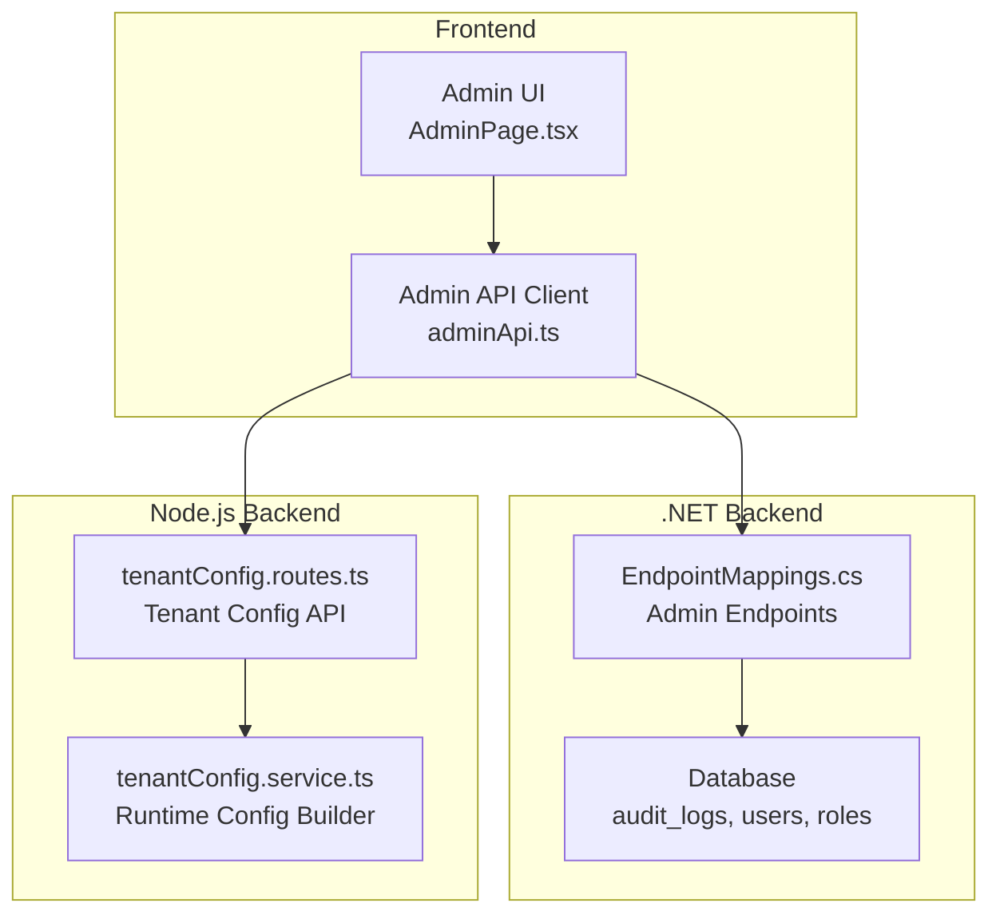
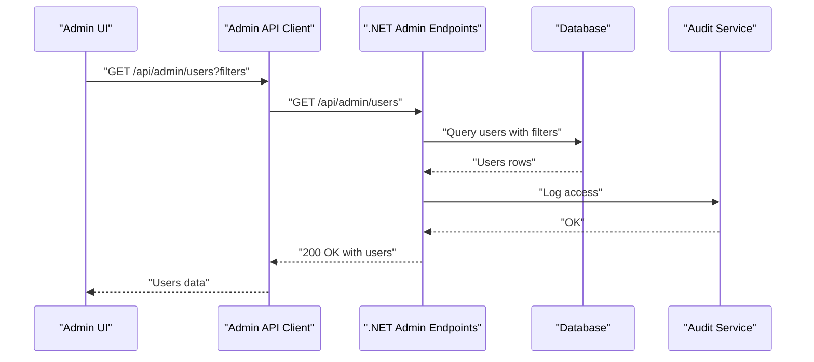
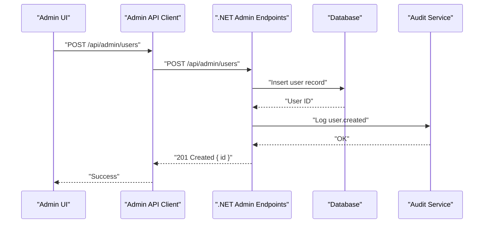
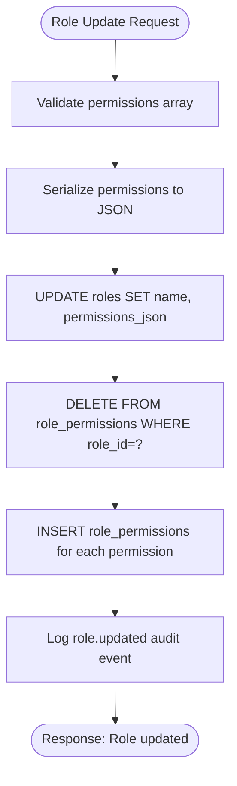
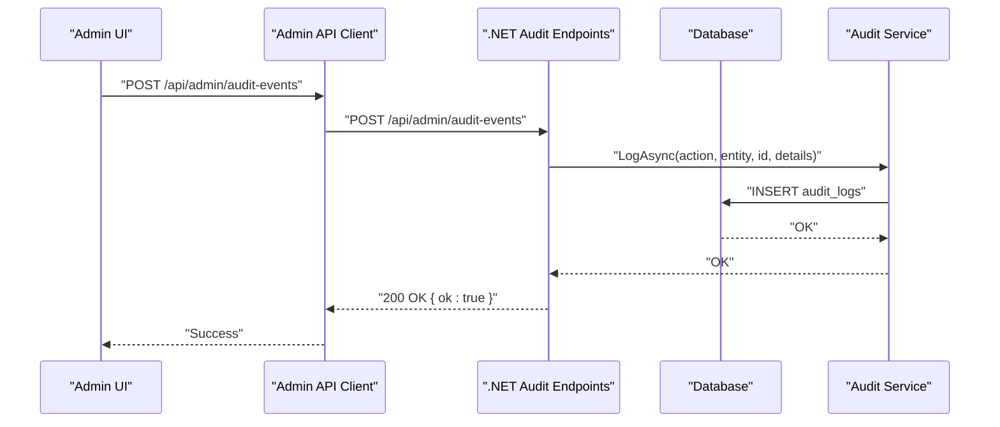
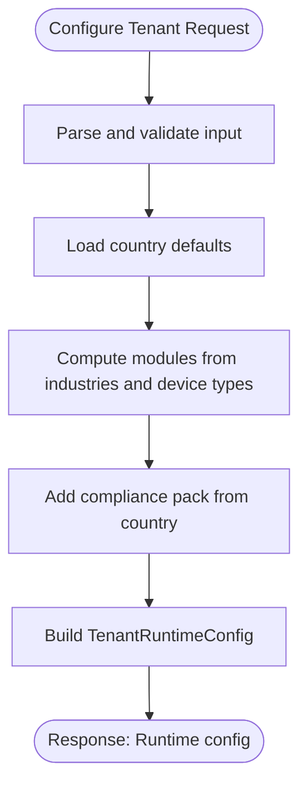
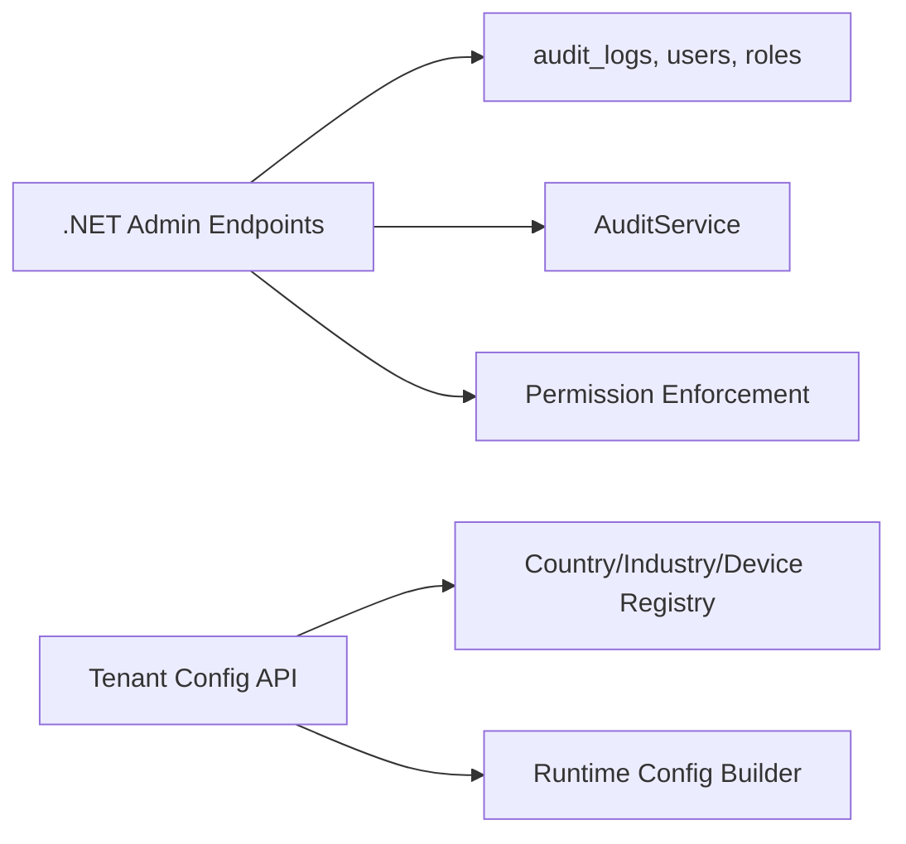

# System Administration API

<cite>
**Referenced Files in This Document**
- [EndpointMappings.cs](file://backend-dotnet/Controllers/EndpointMappings.cs)
- [adminApi.ts](file://frontend/src/services/adminApi.ts)
- [tenantConfig.routes.ts](file://backend/src/modules/tenant-config/tenantConfig.routes.ts)
- [tenantConfig.service.ts](file://backend/src/modules/tenant-config/tenantConfig.service.ts)
- [001_schema.sql](file://db/init/001_schema.sql)
- [app.ts](file://backend/src/app.ts)
- [AdminPage.tsx](file://frontend/src/pages/AdminPage.tsx)
</cite>

## Table of Contents
1. [Introduction](#introduction)
2. [Project Structure](#project-structure)
3. [Core Components](#core-components)
4. [Architecture Overview](#architecture-overview)
5. [Detailed Component Analysis](#detailed-component-analysis)
6. [Dependency Analysis](#dependency-analysis)
7. [Performance Considerations](#performance-considerations)
8. [Troubleshooting Guide](#troubleshooting-guide)
9. [Conclusion](#conclusion)

## Introduction
This document provides comprehensive API documentation for system administration endpoints focused on user management, role and permission administration, audit logging, and tenant configuration. It covers administrative workflows for user provisioning, role assignments, system configuration, and audit trail management. The documentation includes request schemas for user account management, tenant onboarding, and audit log queries, along with operational guidance for bulk operations and administrative reporting.

## Project Structure
The administration APIs are implemented across two backend systems:
- A .NET backend exposing REST endpoints for user management, roles, audit logging, and administrative reporting.
- A Node.js backend module for tenant configuration with runtime config generation.

**Diagram sources**
- [EndpointMappings.cs:1313-1321](file://backend-dotnet/Controllers/EndpointMappings.cs#L1313-L1321)
- [adminApi.ts:103-181](file://frontend/src/services/adminApi.ts#L103-L181)
- [tenantConfig.routes.ts:1-57](file://backend/src/modules/tenant-config/tenantConfig.routes.ts#L1-L57)
- [tenantConfig.service.ts:25-50](file://backend/src/modules/tenant-config/tenantConfig.service.ts#L25-L50)
- [001_schema.sql:251-262](file://db/init/001_schema.sql#L251-L262)

**Section sources**
- [EndpointMappings.cs:1313-1321](file://backend-dotnet/Controllers/EndpointMappings.cs#L1313-L1321)
- [adminApi.ts:103-181](file://frontend/src/services/adminApi.ts#L103-L181)
- [tenantConfig.routes.ts:1-57](file://backend/src/modules/tenant-config/tenantConfig.routes.ts#L1-L57)
- [tenantConfig.service.ts:25-50](file://backend/src/modules/tenant-config/tenantConfig.service.ts#L25-L50)
- [001_schema.sql:251-262](file://db/init/001_schema.sql#L251-L262)

## Core Components
- Admin user management endpoints for listing, retrieving, creating, updating, and deactivating users.
- Role and permission administration endpoints for viewing and updating roles.
- Audit logging endpoints for creating audit events and exporting audit reports.
- Tenant configuration endpoints for generating runtime configurations based on tenant inputs.

**Section sources**
- [EndpointMappings.cs:6115-6366](file://backend-dotnet/Controllers/EndpointMappings.cs#L6115-L6366)
- [adminApi.ts:103-181](file://frontend/src/services/adminApi.ts#L103-L181)
- [tenantConfig.routes.ts:38-55](file://backend/src/modules/tenant-config/tenantConfig.routes.ts#L38-L55)

## Architecture Overview
The admin API architecture follows a layered pattern:
- Frontend admin client invokes backend endpoints.
- .NET backend validates permissions, applies scoping rules, executes database operations, and logs audit events.
- Node.js tenant configuration module computes runtime configurations based on country defaults, industries, and device types.

**Diagram sources**
- [EndpointMappings.cs:6156-6191](file://backend-dotnet/Controllers/EndpointMappings.cs#L6156-L6191)
- [adminApi.ts:111-115](file://frontend/src/services/adminApi.ts#L111-L115)

**Section sources**
- [EndpointMappings.cs:6156-6191](file://backend-dotnet/Controllers/EndpointMappings.cs#L6156-L6191)
- [adminApi.ts:111-115](file://frontend/src/services/adminApi.ts#L111-L115)

## Detailed Component Analysis

### User Management Endpoints
Administrative user management supports listing, filtering, creating, updating, and deactivating users with role-aware scoping and audit logging.

- GET /api/admin/overview
  - Description: Returns administrative overview metrics (total users, active users, tenant admins, roles, recent audit events, permission coverage).
  - Authentication: Requires "users:view".
  - Response: Admin overview object with counts.

- GET /api/admin/users
  - Description: Lists users with optional filters (search, role, status).
  - Query Parameters:
    - search: Text filter across name, email, company, role.
    - role: Role name filter.
    - status: Status filter.
  - Authentication: Requires "users:view".
  - Response: Array of user records with company, role, and metadata.

- GET /api/admin/users/{id}
  - Description: Retrieves a specific user by ID with role-aware scoping.
  - Authentication: Requires "users:view".
  - Response: Single user record.

- POST /api/admin/users
  - Description: Creates a new user with provided attributes and assigns role/permissions.
  - Authentication: Requires "users:create".
  - Request Body Schema:
    - fullName: string
    - email: string
    - companyId: integer (optional for super admin)
    - roleId: integer (optional)
    - roleName: string (fallback if roleId missing)
    - status: string (default Active)
    - permissionsJson: string (JSON array)
  - Response: Created user ID.

- PUT /api/admin/users/{id}
  - Description: Updates user profile, role, company, and status with audit logging for role changes.
  - Authentication: Requires "users:update".
  - Request Body Schema: Same as create, with selective updates supported.
  - Response: Updated user ID.

- DELETE /api/admin/users/{id}
  - Description: Deactivates a user account.
  - Authentication: Requires "users:delete".
  - Response: Deactivated user ID.

**Diagram sources**
- [EndpointMappings.cs:6204-6239](file://backend-dotnet/Controllers/EndpointMappings.cs#L6204-L6239)
- [adminApi.ts:121-142](file://frontend/src/services/adminApi.ts#L121-L142)

**Section sources**
- [EndpointMappings.cs:6115-6304](file://backend-dotnet/Controllers/EndpointMappings.cs#L6115-L6304)
- [adminApi.ts:104-165](file://frontend/src/services/adminApi.ts#L104-L165)

### Role and Permission Administration
Role administration enables viewing roles and updating role permissions.

- GET /api/admin/roles
  - Description: Lists roles with associated user counts.
  - Authentication: Requires "roles:view".
  - Response: Array of roles with name, permissions JSON, and userCount.

- PUT /api/admin/roles/{id}
  - Description: Updates role name and permissions; recalculates role_permissions entries.
  - Authentication: Requires "roles:update".
  - Request Body Schema:
    - name: string
    - permissions: string[] or permissionsJson: string
  - Response: Updated role ID.

**Diagram sources**
- [EndpointMappings.cs:6320-6353](file://backend-dotnet/Controllers/EndpointMappings.cs#L6320-L6353)

**Section sources**
- [EndpointMappings.cs:6306-6353](file://backend-dotnet/Controllers/EndpointMappings.cs#L6306-L6353)

### Audit Logging Endpoints
Audit logging supports creating ad-hoc audit events and exporting audit reports.

- POST /api/admin/audit-events
  - Description: Logs an audit event with action, entity, and details.
  - Authentication: Requires "audit:view".
  - Request Body Schema:
    - actionName: string
    - entityName: string
    - entityId: integer (optional)
    - detailsJson: string (JSON)
  - Response: Success indicator.

- POST /api/audit/export-requests
  - Description: Requests an audit export with date range and filters.
  - Authentication: Requires "audit:view".
  - Request Body Schema:
    - requestedByName: string
    - dateRangeStart: date-time
    - dateRangeEnd: date-time
    - filters: object (JSON)
  - Response: Export request ID.

**Diagram sources**
- [EndpointMappings.cs:6355-6366](file://backend-dotnet/Controllers/EndpointMappings.cs#L6355-L6366)
- [001_schema.sql:251-262](file://db/init/001_schema.sql#L251-L262)

**Section sources**
- [EndpointMappings.cs:6100-6113](file://backend-dotnet/Controllers/EndpointMappings.cs#L6100-L6113)
- [EndpointMappings.cs:6355-6366](file://backend-dotnet/Controllers/EndpointMappings.cs#L6355-L6366)
- [001_schema.sql:251-262](file://db/init/001_schema.sql#L251-L262)

### Tenant Configuration Endpoints
Tenant configuration generates runtime configurations based on country defaults, industries, and device types.

- POST /api/tenant/configure
  - Description: Validates and builds tenant runtime configuration.
  - Request Body Schema:
    - tenantId: string
    - primaryCountry: enum["US","CA","SA","AE","CUSTOM"]
    - operatingCountries: array of enums (optional)
    - industries: array of enums
      - logistics, cold_chain, school_transport, construction, oil_gas, rental_fleet, delivery_fleet
    - enabledDeviceTypes: array of enums
      - obd_ii, j1939_can, gps_tracker, dashcam, temperature_sensor, fuel_sensor, ble_rfid_driver_id, tire_pressure_sensor
  - Response: TenantRuntimeConfig object with modules and compliance packs.

**Diagram sources**
- [tenantConfig.routes.ts:7-36](file://backend/src/modules/tenant-config/tenantConfig.routes.ts#L7-L36)
- [tenantConfig.service.ts:25-50](file://backend/src/modules/tenant-config/tenantConfig.service.ts#L25-L50)

**Section sources**
- [tenantConfig.routes.ts:38-55](file://backend/src/modules/tenant-config/tenantConfig.routes.ts#L38-L55)
- [tenantConfig.service.ts:25-50](file://backend/src/modules/tenant-config/tenantConfig.service.ts#L25-L50)

### Administrative Reporting Endpoints
Administrative reporting endpoints provide overview metrics and filtered user listings.

- GET /api/admin/overview
  - Description: Returns aggregated admin metrics scoped by company or platform-wide for super admins.
  - Response: AdminOverview object with totalUsers, activeUsers, tenantAdmins, roles, recentAuditEvents, permissionCoverage.

- GET /api/admin/users (with filters)
  - Description: Paginated listing with search, role, and status filters.
  - Response: Array of user records with company and role metadata.

**Section sources**
- [EndpointMappings.cs:6115-6191](file://backend-dotnet/Controllers/EndpointMappings.cs#L6115-L6191)
- [adminApi.ts:104-115](file://frontend/src/services/adminApi.ts#L104-L115)

## Dependency Analysis
The admin API depends on:
- Database schema supporting users, roles, and audit logs.
- Audit service for logging administrative actions.
- Permission enforcement and role scoping logic.
- Tenant configuration registry mapping countries, industries, and device types to modules.

**Diagram sources**
- [EndpointMappings.cs:6368-6400](file://backend-dotnet/Controllers/EndpointMappings.cs#L6368-L6400)
- [001_schema.sql:251-262](file://db/init/001_schema.sql#L251-L262)
- [tenantConfig.routes.ts:1-57](file://backend/src/modules/tenant-config/tenantConfig.routes.ts#L1-L57)
- [tenantConfig.service.ts:1-50](file://backend/src/modules/tenant-config/tenantConfig.service.ts#L1-L50)

**Section sources**
- [EndpointMappings.cs:6368-6400](file://backend-dotnet/Controllers/EndpointMappings.cs#L6368-L6400)
- [001_schema.sql:251-262](file://db/init/001_schema.sql#L251-L262)
- [tenantConfig.routes.ts:1-57](file://backend/src/modules/tenant-config/tenantConfig.routes.ts#L1-L57)
- [tenantConfig.service.ts:1-50](file://backend/src/modules/tenant-config/tenantConfig.service.ts#L1-L50)

## Performance Considerations
- Rate limiting: A global rate limiter is applied to API endpoints under /api, excluding health, readiness, login, and specific GET endpoints. Configure environment variables for window size and max requests.
- Query pagination: User listing limits results to prevent large payloads; use filters to narrow results.
- Audit logging overhead: Audit events are written synchronously; batch operations should consider impact on throughput.
- Role permission normalization: Updating roles clears and re-inserts permission mappings; avoid frequent updates during bulk operations.

[No sources needed since this section provides general guidance]

## Troubleshooting Guide
Common issues and resolutions:
- Permission Denied: Administrative actions log "permission.denied" with requested permission and details. Verify user permissions and role scopes.
- User Not Found: Update/Delete operations return 404 if user does not exist or is outside scope.
- Rate Limit Exceeded: Excessive requests to /api endpoints receive 429 responses; reduce request frequency or adjust rate limit configuration.
- Audit Export Pending: Export requests enter "Pending" state and require background processing; check export request status later.

**Section sources**
- [EndpointMappings.cs:6368-6376](file://backend-dotnet/Controllers/EndpointMappings.cs#L6368-L6376)
- [EndpointMappings.cs:6198-6201](file://backend-dotnet/Controllers/EndpointMappings.cs#L6198-L6201)
- [app.ts:42-72](file://backend/src/app.ts#L42-L72)
- [EndpointMappings.cs:6100-6113](file://backend-dotnet/Controllers/EndpointMappings.cs#L6100-L6113)

## Conclusion
The System Administration API provides a comprehensive set of endpoints for managing users, roles, audit trails, and tenant configurations. Administrators can provision users, assign roles, enforce permissions, monitor activities through audit logs, and configure tenant-specific runtime settings. The API enforces strict permission checks, role-aware scoping, and maintains audit trails for all administrative actions.