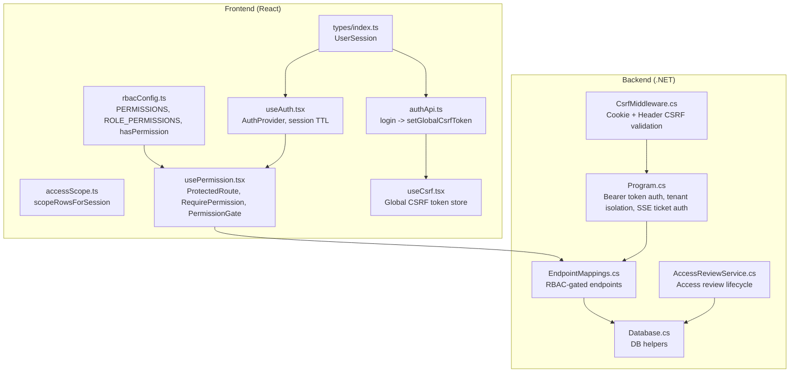
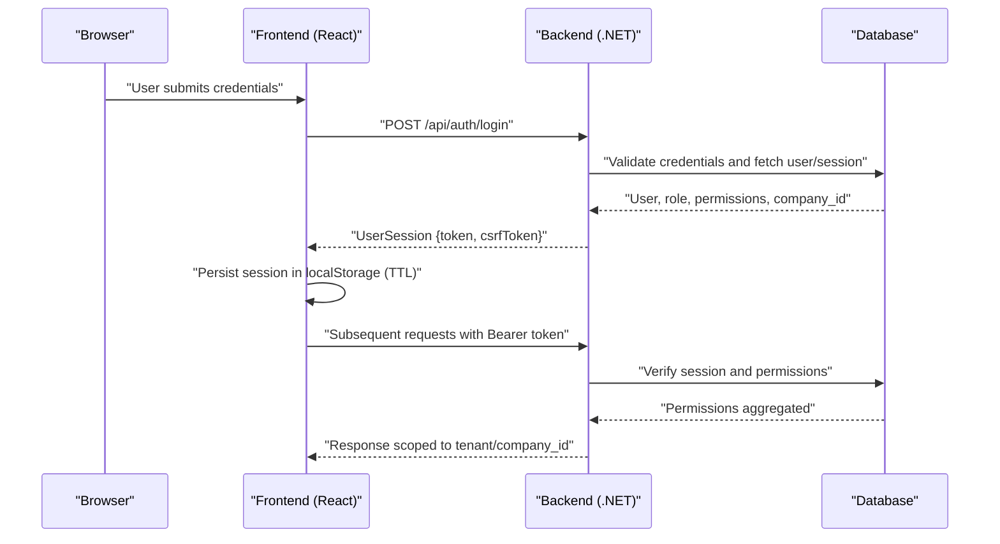
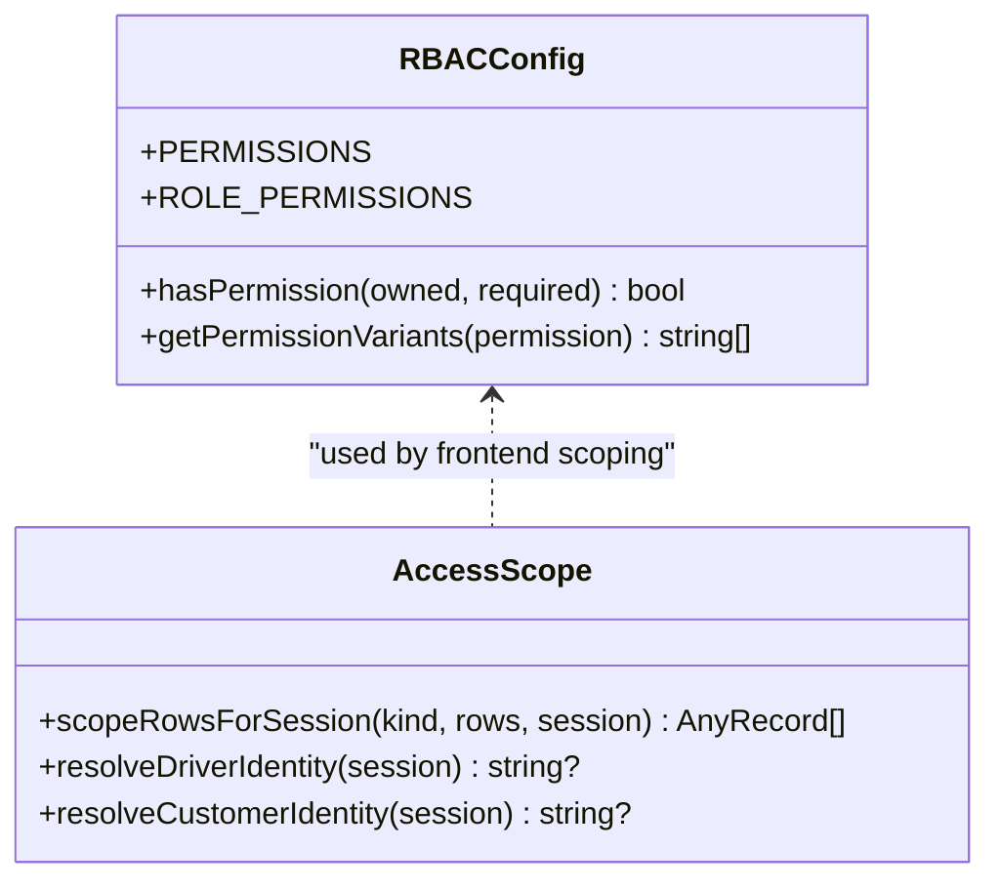
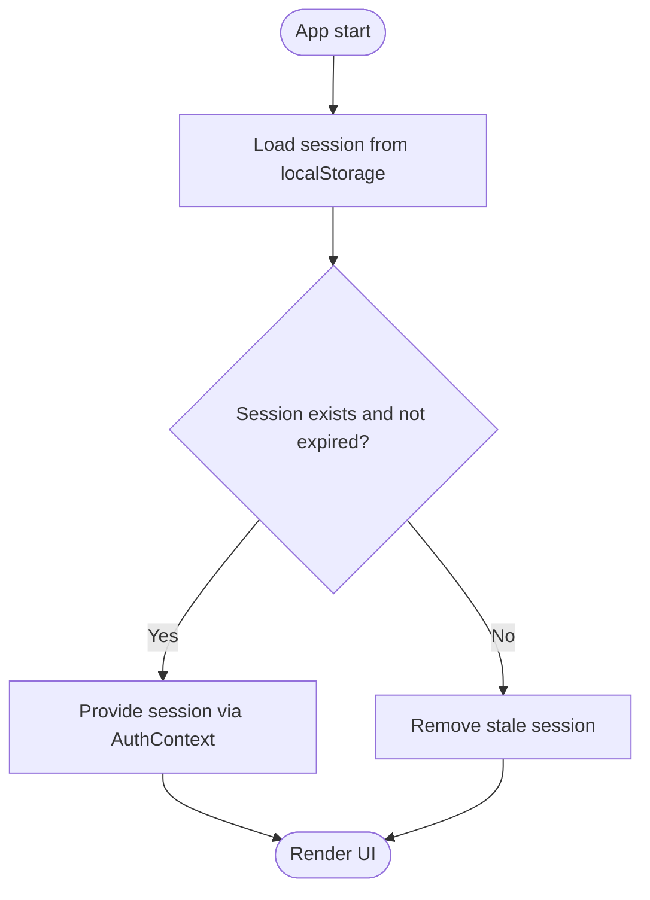
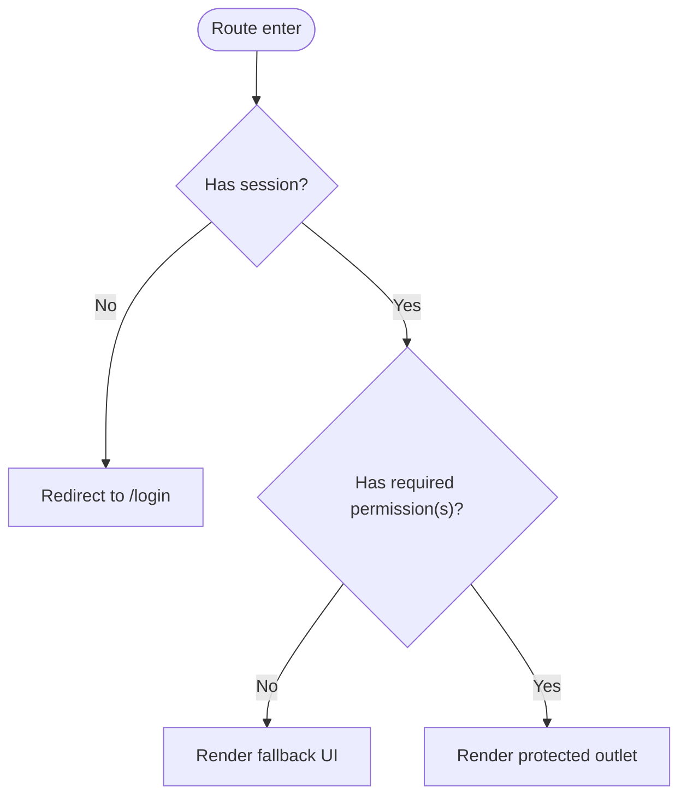
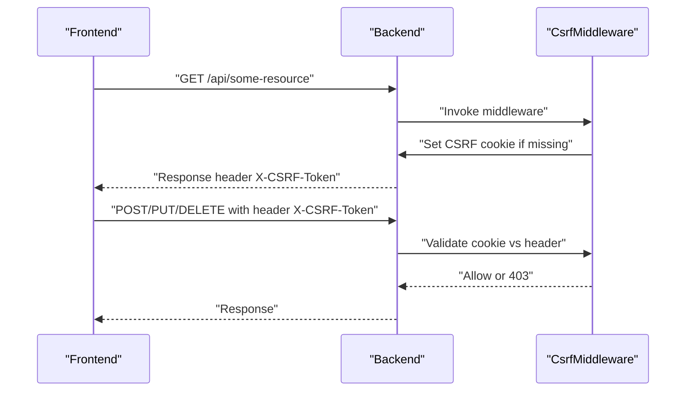
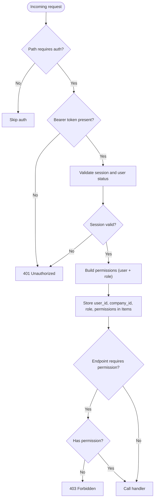
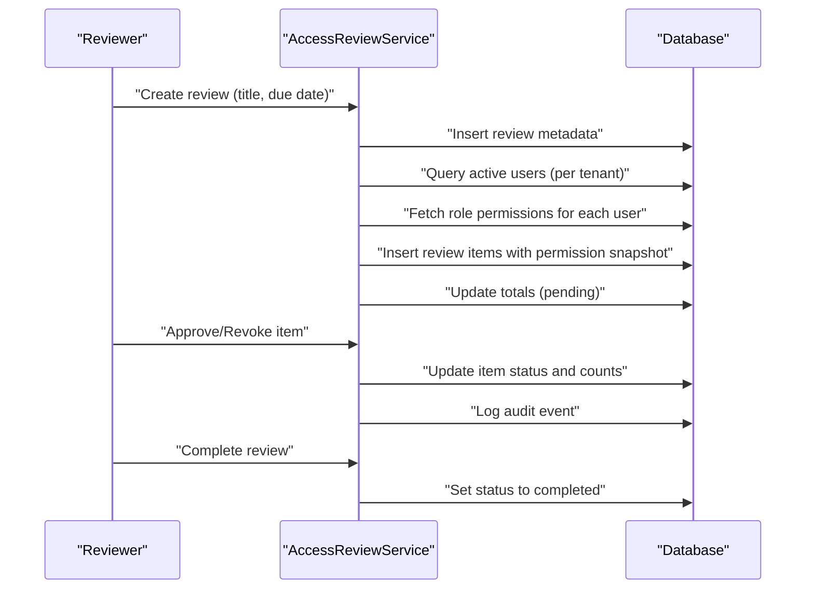
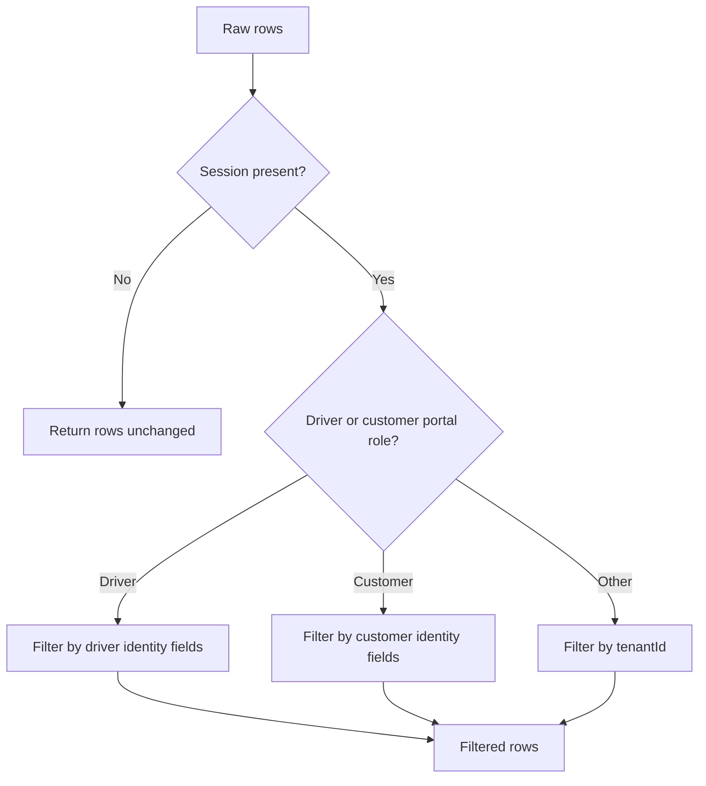
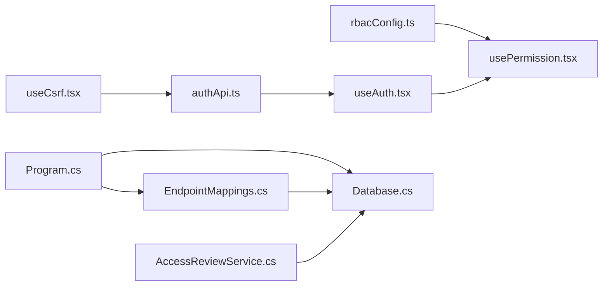

# Authentication & Authorization

<cite>
**Referenced Files in This Document**
- [rbacConfig.ts](file://frontend/src/auth/rbacConfig.ts)
- [accessScope.ts](file://frontend/src/auth/accessScope.ts)
- [useAuth.tsx](file://frontend/src/hooks/useAuth.tsx)
- [usePermission.tsx](file://frontend/src/hooks/usePermission.tsx)
- [authApi.ts](file://frontend/src/services/authApi.ts)
- [useCsrf.tsx](file://frontend/src/hooks/useCsrf.tsx)
- [index.ts](file://frontend/src/types/index.ts)
- [CsrfMiddleware.cs](file://backend-dotnet/Middleware/CsrfMiddleware.cs)
- [Program.cs](file://backend-dotnet/Program.cs)
- [EndpointMappings.cs](file://backend-dotnet/Controllers/EndpointMappings.cs)
- [AccessReviewService.cs](file://backend-dotnet/Services/AccessReviewService.cs)
- [Database.cs](file://backend-dotnet/Data/Database.cs)
- [demoUsers.ts](file://frontend/src/auth/demoUsers.ts)
- [telematicsService.ts](file://frontend/src/services/telematicsService.ts)
</cite>

## Table of Contents
1. [Introduction](#introduction)
2. [Project Structure](#project-structure)
3. [Core Components](#core-components)
4. [Architecture Overview](#architecture-overview)
5. [Detailed Component Analysis](#detailed-component-analysis)
6. [Dependency Analysis](#dependency-analysis)
7. [Performance Considerations](#performance-considerations)
8. [Troubleshooting Guide](#troubleshooting-guide)
9. [Conclusion](#conclusion)
10. [Appendices](#appendices)

## Introduction
This document explains the OpsTrax authentication and authorization model across the frontend React application and the backend .NET API. It covers:
- JWT-like session token flow and storage
- Multi-tenant user context and tenant isolation
- Role-based access control (RBAC) with granular permissions
- CSRF protection and security middleware
- Frontend state management, protected routes, and permission gates
- Access review patterns and security best practices

## Project Structure
The authentication and authorization system spans three layers:
- Frontend (React):
  - RBAC configuration and permission evaluation
  - Session state management and local storage persistence
  - Protected routing and permission gates
  - CSRF token handling and API client integration
- Backend (.NET):
  - Middleware for CSRF protection and bearer token validation
  - Tenant-scoped endpoint gating and permission aggregation
  - Access review service for periodic entitlement audits
- Shared types:
  - UserSession contract used across frontend and backend

**Diagram sources**
- [rbacConfig.ts:1-404](file://frontend/src/auth/rbacConfig.ts#L1-L404)
- [accessScope.ts:1-75](file://frontend/src/auth/accessScope.ts#L1-L75)
- [useAuth.tsx:1-60](file://frontend/src/hooks/useAuth.tsx#L1-L60)
- [usePermission.tsx:1-106](file://frontend/src/hooks/usePermission.tsx#L1-L106)
- [useCsrf.tsx:1-41](file://frontend/src/hooks/useCsrf.tsx#L1-L41)
- [authApi.ts:1-58](file://frontend/src/services/authApi.ts#L1-L58)
- [index.ts:43-50](file://frontend/src/types/index.ts#L43-L50)
- [CsrfMiddleware.cs:1-62](file://backend-dotnet/Middleware/CsrfMiddleware.cs#L1-L62)
- [Program.cs:101-245](file://backend-dotnet/Program.cs#L101-L245)
- [EndpointMappings.cs:1-13566](file://backend-dotnet/Controllers/EndpointMappings.cs#L1-L13566)
- [AccessReviewService.cs:1-229](file://backend-dotnet/Services/AccessReviewService.cs#L1-L229)
- [Database.cs:1-86](file://backend-dotnet/Data/Database.cs#L1-L86)

**Section sources**
- [rbacConfig.ts:1-404](file://frontend/src/auth/rbacConfig.ts#L1-L404)
- [useAuth.tsx:1-60](file://frontend/src/hooks/useAuth.tsx#L1-L60)
- [usePermission.tsx:1-106](file://frontend/src/hooks/usePermission.tsx#L1-L106)
- [authApi.ts:1-58](file://frontend/src/services/authApi.ts#L1-L58)
- [useCsrf.tsx:1-41](file://frontend/src/hooks/useCsrf.tsx#L1-L41)
- [index.ts:43-50](file://frontend/src/types/index.ts#L43-L50)
- [CsrfMiddleware.cs:1-62](file://backend-dotnet/Middleware/CsrfMiddleware.cs#L1-L62)
- [Program.cs:101-245](file://backend-dotnet/Program.cs#L101-L245)
- [EndpointMappings.cs:1-13566](file://backend-dotnet/Controllers/EndpointMappings.cs#L1-L13566)
- [AccessReviewService.cs:1-229](file://backend-dotnet/Services/AccessReviewService.cs#L1-L229)
- [Database.cs:1-86](file://backend-dotnet/Data/Database.cs#L1-L86)

## Core Components
- RBAC model and permission evaluation:
  - Canonical permission keys and aliases
  - Role-to-permissions mapping including legacy aliases
  - Permission lookup and variant normalization
- Session state and CSRF:
  - Local storage-backed session with TTL
  - Global CSRF token propagation to API client
- Protected routing and UI gates:
  - ProtectedRoute for route guards
  - RequirePermission and PermissionGate for component-level checks
- Backend authentication and tenant isolation:
  - Bearer token validation and permission aggregation
  - Tenant-scoped enforcement via company_id
  - CSRF protection via cookie/header tokens
  - Access review service for periodic entitlement audits

**Section sources**
- [rbacConfig.ts:1-404](file://frontend/src/auth/rbacConfig.ts#L1-L404)
- [useAuth.tsx:1-60](file://frontend/src/hooks/useAuth.tsx#L1-L60)
- [usePermission.tsx:1-106](file://frontend/src/hooks/usePermission.tsx#L1-L106)
- [authApi.ts:1-58](file://frontend/src/services/authApi.ts#L1-L58)
- [useCsrf.tsx:1-41](file://frontend/src/hooks/useCsrf.tsx#L1-L41)
- [Program.cs:101-245](file://backend-dotnet/Program.cs#L101-L245)
- [CsrfMiddleware.cs:1-62](file://backend-dotnet/Middleware/CsrfMiddleware.cs#L1-L62)
- [AccessReviewService.cs:1-229](file://backend-dotnet/Services/AccessReviewService.cs#L1-L229)

## Architecture Overview
The authentication flow integrates frontend and backend components to enforce secure, tenant-aware access.

**Diagram sources**
- [authApi.ts:35-57](file://frontend/src/services/authApi.ts#L35-L57)
- [Program.cs:190-242](file://backend-dotnet/Program.cs#L190-L242)
- [Database.cs:36-37](file://backend-dotnet/Data/Database.cs#L36-L37)

## Detailed Component Analysis

### RBAC Model and Permission Evaluation
- Permission taxonomy:
  - Hierarchical keys (e.g., vehicles:create) grouped into functional domains
  - Canonical permission keys mapped to alias sets supporting punctuation and separator variants
- Role-to-permissions mapping:
  - Includes super_admin, tenant_admin, fleet_manager, dispatcher, safety_manager, maintenance_manager, driver, customer, read_only_auditor
  - Legacy aliases maintained for compatibility
- Permission evaluation:
  - hasPermission supports wildcard (“*”) and normalized variants
  - getPermissionVariants normalizes “.” vs “:” and “-” vs “_”

**Diagram sources**
- [rbacConfig.ts:1-404](file://frontend/src/auth/rbacConfig.ts#L1-L404)
- [accessScope.ts:1-75](file://frontend/src/auth/accessScope.ts#L1-L75)

**Section sources**
- [rbacConfig.ts:1-404](file://frontend/src/auth/rbacConfig.ts#L1-L404)
- [accessScope.ts:1-75](file://frontend/src/auth/accessScope.ts#L1-L75)

### Session State Management (React)
- Storage:
  - Session persisted in localStorage with a fixed TTL (8 hours)
  - On expiration or parse failure, session is cleared
- Context:
  - AuthProvider exposes session, setSession, and logout
  - Consumers use useAuth to access current session

**Diagram sources**
- [useAuth.tsx:9-23](file://frontend/src/hooks/useAuth.tsx#L9-L23)

**Section sources**
- [useAuth.tsx:1-60](file://frontend/src/hooks/useAuth.tsx#L1-L60)
- [index.ts:43-50](file://frontend/src/types/index.ts#L43-L50)

### Protected Routes and Permission Gates (React)
- ProtectedRoute:
  - Redirects unauthenticated users to login
- RequirePermission:
  - Enforces single or multiple permission checks
  - Renders fallback UI if denied
- PermissionGate:
  - Conditionally renders children based on permission

**Diagram sources**
- [usePermission.tsx:36-66](file://frontend/src/hooks/usePermission.tsx#L36-L66)

**Section sources**
- [usePermission.tsx:1-106](file://frontend/src/hooks/usePermission.tsx#L1-L106)

### CSRF Protection (Frontend + Backend)
- Frontend:
  - Global CSRF token store synchronized with session
  - useCsrfToken provides getter/setter for CSRF state
- Backend:
  - CsrfMiddleware generates CSRF cookie for GET requests
  - Validates CSRF header on state-changing requests (except /api/auth/login)
  - Exposes CSRF token in response header

**Diagram sources**
- [useCsrf.tsx:10-18](file://frontend/src/hooks/useCsrf.tsx#L10-L18)
- [CsrfMiddleware.cs:19-54](file://backend-dotnet/Middleware/CsrfMiddleware.cs#L19-L54)

**Section sources**
- [useCsrf.tsx:1-41](file://frontend/src/hooks/useCsrf.tsx#L1-L41)
- [CsrfMiddleware.cs:1-62](file://backend-dotnet/Middleware/CsrfMiddleware.cs#L1-L62)

### Backend Authentication and Tenant Isolation
- Bearer token validation:
  - Extracts Authorization Bearer token
  - Queries active session with user, role, and permissions
  - Aggregates user and role permissions, including dynamic role permissions
  - Stores user_id, company_id, role, and permissions in HttpContext.Items
- Tenant isolation:
  - company_id enforced across all RBAC-gated endpoints
  - Special handling for SSE stream via short-lived tickets (SST) instead of bearer tokens
- CSRF:
  - CSRF cookie and header validated for state-changing requests
- Endpoint gating:
  - Many endpoints require specific permission keys (e.g., fleet:manage, dispatch:manage)
  - Some endpoints are public or token-scoped (e.g., customer visibility tracking)

**Diagram sources**
- [Program.cs:174-242](file://backend-dotnet/Program.cs#L174-L242)
- [EndpointMappings.cs:134-151](file://backend-dotnet/Controllers/EndpointMappings.cs#L134-L151)

**Section sources**
- [Program.cs:101-245](file://backend-dotnet/Program.cs#L101-L245)
- [EndpointMappings.cs:1-13566](file://backend-dotnet/Controllers/EndpointMappings.cs#L1-L13566)
- [Database.cs:1-86](file://backend-dotnet/Data/Database.cs#L1-L86)

### Access Review Patterns
- Lifecycle:
  - Create review snapshotting active users and their role permissions
  - Reviewers approve or revoke items
  - Completing a review updates counts and logs
- Tenant-scoped:
  - All operations constrained by company_id
  - Audit logging tracks actions

**Diagram sources**
- [AccessReviewService.cs:23-112](file://backend-dotnet/Services/AccessReviewService.cs#L23-L112)
- [AccessReviewService.cs:151-194](file://backend-dotnet/Services/AccessReviewService.cs#L151-L194)

**Section sources**
- [AccessReviewService.cs:1-229](file://backend-dotnet/Services/AccessReviewService.cs#L1-L229)

### Frontend Tenant Scoping and Row-Level Filtering
- Driver and customer portal scoping:
  - scopeRowsForSession filters rows based on resolved identities
  - Driver identity derived from email or name; customer identity from email or company
- Device scoping:
  - Telematics service filters devices by tenantId and role-specific attributes

**Diagram sources**
- [accessScope.ts:14-30](file://frontend/src/auth/accessScope.ts#L14-L30)
- [telematicsService.ts:140-164](file://frontend/src/services/telematicsService.ts#L140-L164)

**Section sources**
- [accessScope.ts:1-75](file://frontend/src/auth/accessScope.ts#L1-L75)
- [telematicsService.ts:107-173](file://frontend/src/services/telematicsService.ts#L107-L173)

## Dependency Analysis
- Frontend dependencies:
  - RBAC depends on role definitions and permission variants
  - Protected routes depend on RBAC and session context
  - CSRF hook depends on auth context and global token store
  - authApi depends on RBAC and CSRF hook to initialize session
- Backend dependencies:
  - Program.cs depends on Database for session validation
  - EndpointMappings.cs depends on Program.cs items for tenant-scoped enforcement
  - AccessReviewService depends on Database and AuditService

**Diagram sources**
- [rbacConfig.ts:1-404](file://frontend/src/auth/rbacConfig.ts#L1-L404)
- [usePermission.tsx:1-106](file://frontend/src/hooks/usePermission.tsx#L1-L106)
- [useAuth.tsx:1-60](file://frontend/src/hooks/useAuth.tsx#L1-L60)
- [useCsrf.tsx:1-41](file://frontend/src/hooks/useCsrf.tsx#L1-L41)
- [authApi.ts:1-58](file://frontend/src/services/authApi.ts#L1-L58)
- [Program.cs:101-245](file://backend-dotnet/Program.cs#L101-L245)
- [EndpointMappings.cs:1-13566](file://backend-dotnet/Controllers/EndpointMappings.cs#L1-L13566)
- [Database.cs:1-86](file://backend-dotnet/Data/Database.cs#L1-L86)
- [AccessReviewService.cs:1-229](file://backend-dotnet/Services/AccessReviewService.cs#L1-L229)

**Section sources**
- [Program.cs:101-245](file://backend-dotnet/Program.cs#L101-L245)
- [EndpointMappings.cs:1-13566](file://backend-dotnet/Controllers/EndpointMappings.cs#L1-L13566)
- [Database.cs:1-86](file://backend-dotnet/Data/Database.cs#L1-L86)
- [AccessReviewService.cs:1-229](file://backend-dotnet/Services/AccessReviewService.cs#L1-L229)

## Performance Considerations
- Session TTL:
  - 8-hour localStorage TTL reduces re-auth frequency while limiting exposure
- Permission evaluation:
  - Normalized variants and Set-based ownership checks minimize overhead
- Endpoint gating:
  - Early exits on missing/invalid bearer tokens reduce unnecessary DB queries
- CSRF:
  - One-time cookie generation per session avoids repeated cryptographic work

[No sources needed since this section provides general guidance]

## Troubleshooting Guide
- Unauthorized (401) after login:
  - Verify Authorization header includes a valid Bearer token
  - Confirm session is not expired and user status is Active
- Forbidden (403) on state-changing requests:
  - Ensure CSRF cookie and header match
  - Confirm endpoint requires a specific permission key
- Permission denied UI:
  - Check that the current role’s permissions include the required key
  - Verify permission variants normalize “.” vs “:” and “-” vs “_”
- Tenant data mismatch:
  - Confirm company_id is propagated in HttpContext.Items
  - Ensure RBAC-gated endpoints filter by company_id

**Section sources**
- [Program.cs:174-242](file://backend-dotnet/Program.cs#L174-L242)
- [CsrfMiddleware.cs:36-49](file://backend-dotnet/Middleware/CsrfMiddleware.cs#L36-L49)
- [rbacConfig.ts:372-383](file://frontend/src/auth/rbacConfig.ts#L372-L383)
- [usePermission.tsx:84-103](file://frontend/src/hooks/usePermission.tsx#L84-L103)

## Conclusion
OpsTrax implements a robust, tenant-aware authentication and authorization system:
- Frontend RBAC with flexible permission evaluation and UI-level protections
- Backend bearer token validation with tenant isolation and CSRF safeguards
- Access review service enabling periodic entitlement audits
- Practical scoping for driver/customer portals and device visibility

[No sources needed since this section summarizes without analyzing specific files]

## Appendices

### Authentication State Management in React
- Persisted session with TTL
- Global CSRF token synchronization
- Protected routes and permission gates

**Section sources**
- [useAuth.tsx:1-60](file://frontend/src/hooks/useAuth.tsx#L1-L60)
- [useCsrf.tsx:1-41](file://frontend/src/hooks/useCsrf.tsx#L1-L41)
- [usePermission.tsx:36-82](file://frontend/src/hooks/usePermission.tsx#L36-L82)

### Logout Procedures
- Remove persisted session from localStorage
- Clear global CSRF token
- Redirect to login route

**Section sources**
- [useAuth.tsx:46-50](file://frontend/src/hooks/useAuth.tsx#L46-L50)
- [useCsrf.tsx:12-14](file://frontend/src/hooks/useCsrf.tsx#L12-L14)

### Token Refresh Strategies
- Current implementation relies on session TTL and re-login
- Recommended improvements:
  - Add refresh endpoint returning new session and CSRF token
  - Rotate tokens server-side and invalidate previous ones
  - Enforce sliding TTL with bounded maximum lifetime

[No sources needed since this section provides general guidance]

### Security Best Practices
- Enforce CSRF for all state-changing requests
- Use HTTPS and secure cookies for CSRF tokens
- Limit bearer token lifetimes and rotate keys
- Sanitize and validate all inputs; avoid exposing secrets in logs
- Regularly audit permissions and roles via access reviews

[No sources needed since this section provides general guidance]