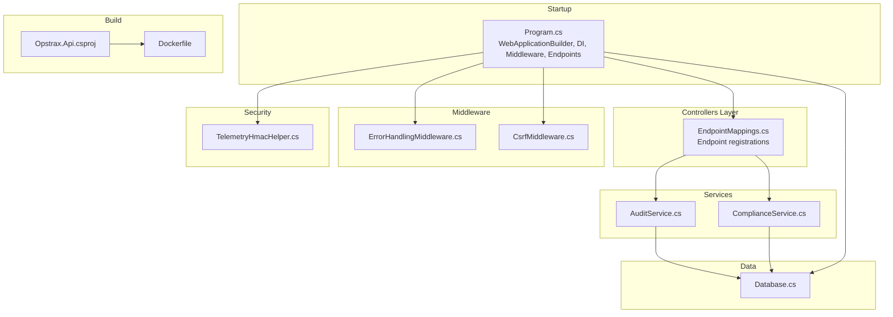
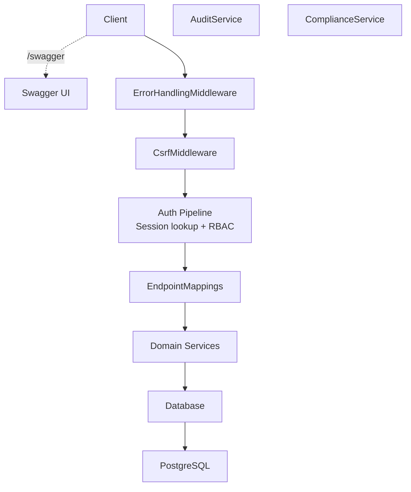
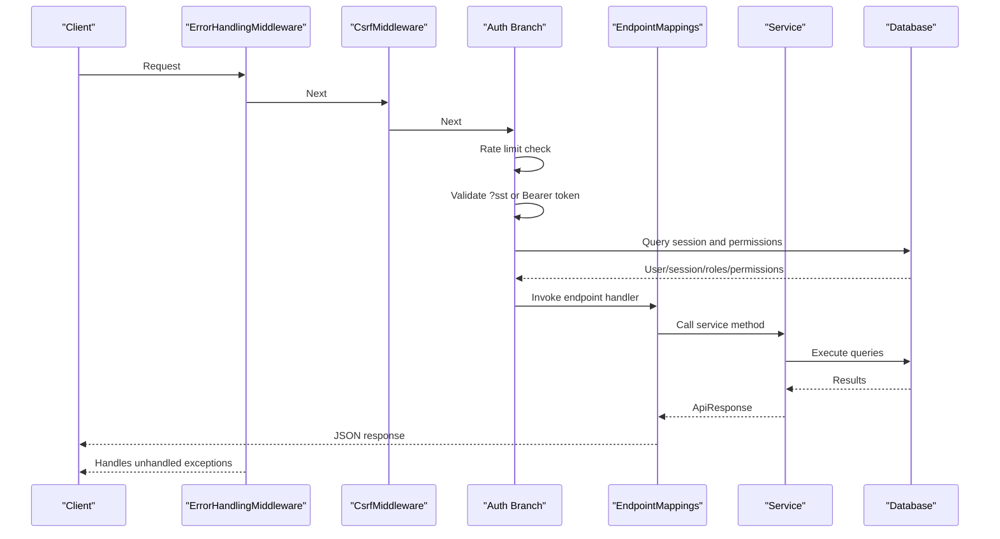
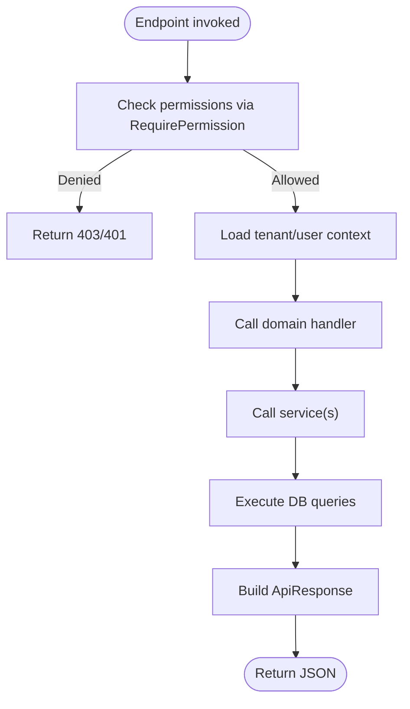
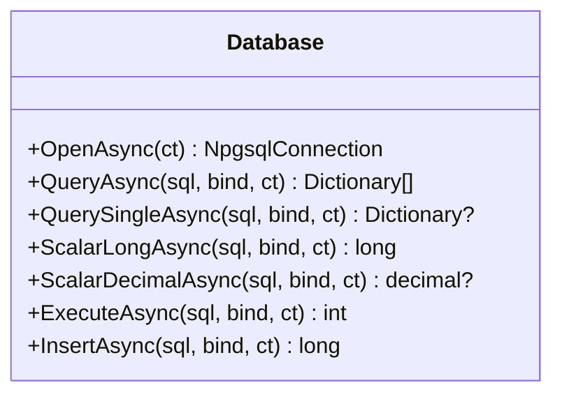
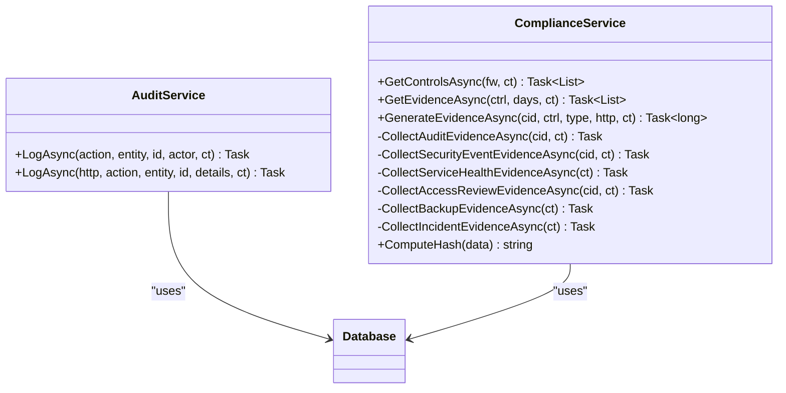
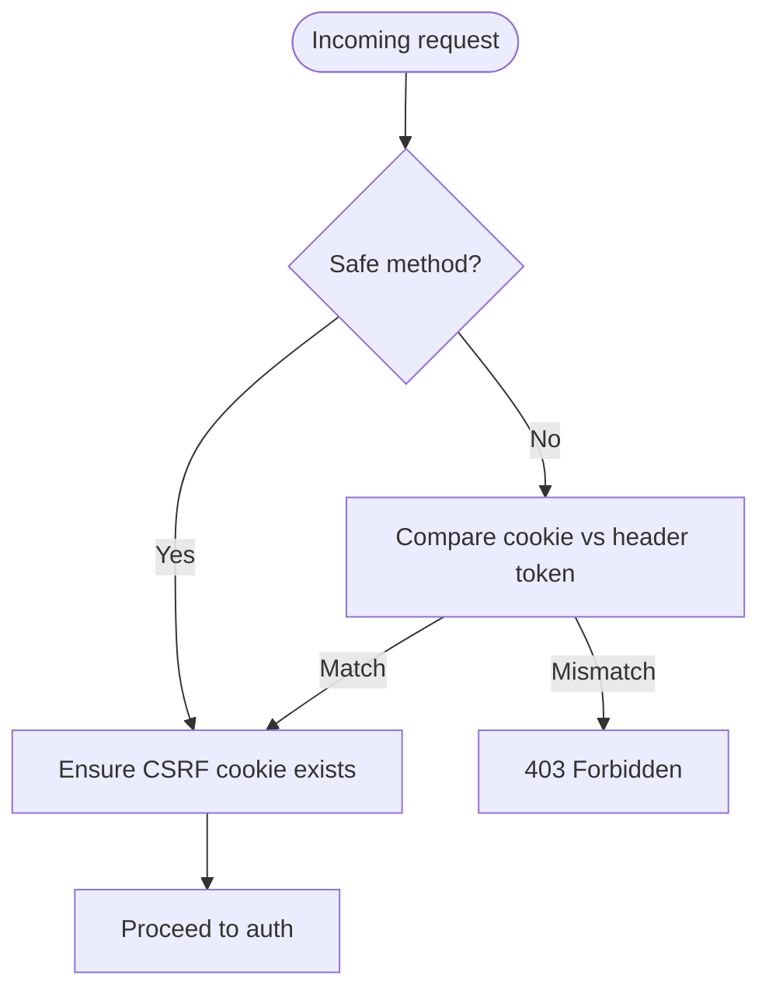
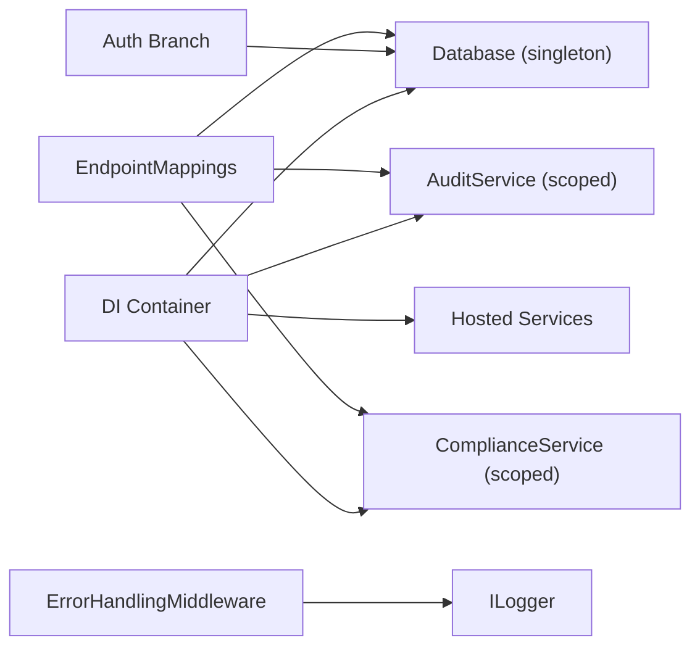

# .NET Core Backend

<cite>
**Referenced Files in This Document**
- [Program.cs](file://backend-dotnet/Program.cs)
- [EndpointMappings.cs](file://backend-dotnet/Controllers/EndpointMappings.cs)
- [ErrorHandlingMiddleware.cs](file://backend-dotnet/Middleware/ErrorHandlingMiddleware.cs)
- [CsrfMiddleware.cs](file://backend-dotnet/Middleware/CsrfMiddleware.cs)
- [Database.cs](file://backend-dotnet/Data/Database.cs)
- [AuditService.cs](file://backend-dotnet/Services/AuditService.cs)
- [ComplianceService.cs](file://backend-dotnet/Services/ComplianceService.cs)
- [TelemetryHmacHelper.cs](file://backend-dotnet/TelemetryHmacHelper.cs)
- [ApiResponse.cs](file://backend-dotnet/DTOs/ApiResponse.cs)
- [Opstrax.Api.csproj](file://backend-dotnet/Opstrax.Api.csproj)
- [Dockerfile](file://backend-dotnet/Dockerfile)
</cite>

## Table of Contents
1. [Introduction](#introduction)
2. [Project Structure](#project-structure)
3. [Core Components](#core-components)
4. [Architecture Overview](#architecture-overview)
5. [Detailed Component Analysis](#detailed-component-analysis)
6. [Dependency Analysis](#dependency-analysis)
7. [Performance Considerations](#performance-considerations)
8. [Troubleshooting Guide](#troubleshooting-guide)
9. [Conclusion](#conclusion)
10. [Appendices](#appendices)

## Introduction
This document describes the .NET 8 backend implementation built with ASP.NET Core minimal APIs. It covers the application startup process, dependency injection container configuration, middleware pipeline, controller endpoint organization, service layer design, authentication and authorization flows, security measures, build and deployment configuration, and operational considerations such as performance, logging, and monitoring.

## Project Structure
The backend is organized around a minimal API approach with explicit endpoint mapping, centralized middleware, and a layered service architecture:
- Application bootstrapping and DI registration occur in Program.cs
- Endpoint mappings are defined centrally in EndpointMappings.cs
- Cross-cutting concerns are implemented as middleware
- Data access is encapsulated in a lightweight Database wrapper
- Business logic is implemented in scoped and hosted services
- Security utilities support telemetry signing and CSRF protection
- Build and packaging are defined in the project file and Dockerfile

**Diagram sources**
- [Program.cs:10-384](file://backend-dotnet/Program.cs#L10-L384)
- [EndpointMappings.cs:19-800](file://backend-dotnet/Controllers/EndpointMappings.cs#L19-L800)
- [ErrorHandlingMiddleware.cs:6-21](file://backend-dotnet/Middleware/ErrorHandlingMiddleware.cs#L6-L21)
- [CsrfMiddleware.cs:6-61](file://backend-dotnet/Middleware/CsrfMiddleware.cs#L6-L61)
- [Database.cs:5-85](file://backend-dotnet/Data/Database.cs#L5-L85)
- [AuditService.cs:7-47](file://backend-dotnet/Services/AuditService.cs#L7-L47)
- [ComplianceService.cs:26-240](file://backend-dotnet/Services/ComplianceService.cs#L26-L240)
- [TelemetryHmacHelper.cs:5-32](file://backend-dotnet/TelemetryHmacHelper.cs#L5-L32)
- [Opstrax.Api.csproj:1-17](file://backend-dotnet/Opstrax.Api.csproj#L1-L17)
- [Dockerfile:1-13](file://backend-dotnet/Dockerfile#L1-L13)

**Section sources**
- [Program.cs:10-384](file://backend-dotnet/Program.cs#L10-L384)
- [EndpointMappings.cs:19-800](file://backend-dotnet/Controllers/EndpointMappings.cs#L19-L800)
- [Opstrax.Api.csproj:1-17](file://backend-dotnet/Opstrax.Api.csproj#L1-L17)
- [Dockerfile:1-13](file://backend-dotnet/Dockerfile#L1-L13)

## Core Components
- Application Startup and DI Container
  - Builder initialization, Swagger/OpenAPI, CORS policy, and service registrations
  - Schema bootstrap steps executed during startup
  - Global middleware pipeline and endpoint mappings
- Middleware
  - Error handling middleware for unhandled exceptions
  - CSRF middleware for state-changing requests
- Endpoint Mappings
  - Centralized registration of API endpoints grouped by domain modules
  - Authentication and authorization gating per endpoint
- Data Access
  - Lightweight PostgreSQL wrapper with async query, scalar, insert, and execute helpers
- Services
  - Audit logging service
  - Compliance evidence generation service
  - Numerous domain services registered as scoped or hosted services
- Security Utilities
  - HMAC-SHA256 helpers for telemetry signing and constant-time comparisons
- DTOs
  - ApiResponse<T> standardized response envelope

**Section sources**
- [Program.cs:10-384](file://backend-dotnet/Program.cs#L10-L384)
- [ErrorHandlingMiddleware.cs:6-21](file://backend-dotnet/Middleware/ErrorHandlingMiddleware.cs#L6-L21)
- [CsrfMiddleware.cs:6-61](file://backend-dotnet/Middleware/CsrfMiddleware.cs#L6-L61)
- [EndpointMappings.cs:19-800](file://backend-dotnet/Controllers/EndpointMappings.cs#L19-L800)
- [Database.cs:5-85](file://backend-dotnet/Data/Database.cs#L5-L85)
- [AuditService.cs:7-47](file://backend-dotnet/Services/AuditService.cs#L7-L47)
- [ComplianceService.cs:26-240](file://backend-dotnet/Services/ComplianceService.cs#L26-L240)
- [TelemetryHmacHelper.cs:5-32](file://backend-dotnet/TelemetryHmacHelper.cs#L5-L32)
- [ApiResponse.cs:3-7](file://backend-dotnet/DTOs/ApiResponse.cs#L3-L7)

## Architecture Overview
The backend follows a layered architecture:
- Presentation: Minimal API endpoints mapped in EndpointMappings
- Cross-cutting: Middleware for error handling, CSRF, CORS, and authentication/authorization
- Domain Services: Scoped and hosted services encapsulate business logic
- Data Access: Database wrapper abstracts PostgreSQL operations
- Security: HMAC signing for telemetry ingestion and CSRF protection

**Diagram sources**
- [Program.cs:92-244](file://backend-dotnet/Program.cs#L92-L244)
- [EndpointMappings.cs:19-800](file://backend-dotnet/Controllers/EndpointMappings.cs#L19-L800)
- [ErrorHandlingMiddleware.cs:6-21](file://backend-dotnet/Middleware/ErrorHandlingMiddleware.cs#L6-L21)
- [CsrfMiddleware.cs:6-61](file://backend-dotnet/Middleware/CsrfMiddleware.cs#L6-L61)
- [Database.cs:5-85](file://backend-dotnet/Data/Database.cs#L5-L85)

## Detailed Component Analysis

### Application Startup and Middleware Pipeline
- Builder and DI
  - Adds Swagger generator and explorer
  - Registers Database singleton and numerous domain services as scoped/singletons
  - Adds hosted services for background tasks
  - Configures CORS policy with origins from configuration
- Schema Bootstrap
  - Executes schema steps for multiple domains during startup with graceful failure logging
- Global Headers and Security Headers
  - Adds security-related response headers
- Middleware Order
  - Error handling middleware
  - CSRF middleware
  - CORS
  - Swagger
  - Conditional authentication branch for API paths
- Authentication and Authorization
  - Rate limiting per IP per minute window
  - Stream ticket (SST) validation for server-sent events
  - Session-based Bearer token validation with role and permission extraction
  - Permission composition from user and role scopes
  - Super Admin override for wildcard permissions
- Health Probes
  - /health, /health/live, /health/ready, /health/deep with deep DB and service checks
- Endpoint Registration
  - Maps core endpoints and module-specific endpoints
  - Includes specialized endpoints for telemetry, customer visibility, and driver workflows

**Diagram sources**
- [Program.cs:92-244](file://backend-dotnet/Program.cs#L92-L244)
- [EndpointMappings.cs:19-800](file://backend-dotnet/Controllers/EndpointMappings.cs#L19-L800)
- [Database.cs:17-77](file://backend-dotnet/Data/Database.cs#L17-L77)
- [ErrorHandlingMiddleware.cs:6-21](file://backend-dotnet/Middleware/ErrorHandlingMiddleware.cs#L6-L21)
- [CsrfMiddleware.cs:6-61](file://backend-dotnet/Middleware/CsrfMiddleware.cs#L6-L61)

**Section sources**
- [Program.cs:10-384](file://backend-dotnet/Program.cs#L10-L384)

### Endpoint Mappings and Controller Architecture
- EndpointMappings centralizes route registration and handler invocation
- Handlers are grouped by functional modules (vehicles, drivers, dispatch, telemetry, safety, compliance, etc.)
- Many endpoints enforce RBAC using RequirePermission and tenant scoping via GetCompanyId
- Standardized response envelope via ApiResponse<T>
- Examples include:
  - Authentication login
  - Telemetry ingestion, stream tickets, SSE stream, positions, metrics, alerts
  - Fleet health summaries and risk lists
  - Driver self-service endpoints
  - Maintenance, DVIR, work orders, documents, and compliance workflows

**Diagram sources**
- [EndpointMappings.cs:19-800](file://backend-dotnet/Controllers/EndpointMappings.cs#L19-L800)
- [ApiResponse.cs:3-7](file://backend-dotnet/DTOs/ApiResponse.cs#L3-L7)

**Section sources**
- [EndpointMappings.cs:19-800](file://backend-dotnet/Controllers/EndpointMappings.cs#L19-L800)
- [ApiResponse.cs:3-7](file://backend-dotnet/DTOs/ApiResponse.cs#L3-L7)

### Data Access Layer
- Database wrapper encapsulates:
  - Async connection open
  - QueryAsync returning typed rows with camelCase keys
  - QuerySingleAsync convenience
  - ScalarLongAsync, ScalarDecimalAsync
  - ExecuteAsync and InsertAsync (auto-returning id)
  - Column name conversion to camelCase
- Uses Npgsql for PostgreSQL connectivity

**Diagram sources**
- [Database.cs:5-85](file://backend-dotnet/Data/Database.cs#L5-L85)

**Section sources**
- [Database.cs:5-85](file://backend-dotnet/Data/Database.cs#L5-L85)

### Service Layer Implementation
- AuditService
  - Logs audit events with actor identification from HTTP context and endpoint mappings
  - Supports system actor and explicit HTTP context logging
- ComplianceService
  - Provides controls and evidence retrieval
  - Generates compliance evidence by collecting from real system tables and computing SHA-256 hashes
  - Supports multiple evidence types (audit logs, security events, service health, access reviews, backups, incidents)
- Additional Services
  - Numerous domain services are registered in Program.cs for telemetry, safety, trips, maintenance, dispatch, notifications, reporting, observability, security, and background services

**Diagram sources**
- [AuditService.cs:7-47](file://backend-dotnet/Services/AuditService.cs#L7-L47)
- [ComplianceService.cs:26-240](file://backend-dotnet/Services/ComplianceService.cs#L26-L240)
- [Database.cs:5-85](file://backend-dotnet/Data/Database.cs#L5-L85)

**Section sources**
- [AuditService.cs:7-47](file://backend-dotnet/Services/AuditService.cs#L7-L47)
- [ComplianceService.cs:26-240](file://backend-dotnet/Services/ComplianceService.cs#L26-L240)
- [Program.cs:14-54](file://backend-dotnet/Program.cs#L14-L54)

### Authentication, Authorization, and Security
- Authentication
  - Session-based JWT-like flow validated against user_sessions and users
  - Role and permissions merged from user and role tables
  - Super Admin receives wildcard permissions
  - Stream tickets (SST) for server-sent events without exposing long-lived session tokens
- Authorization
  - RBAC gates via RequirePermission in EndpointMappings
  - Tenant scoping enforced via GetCompanyId
- CSRF Protection
  - Generates CSRF cookie for clients and validates header token on state-changing requests
  - Exposes CSRF token in response header
- Telemetry Security
  - HMAC-SHA256 signing for device ingestion with canonical string construction
  - Constant-time signature comparison
- Cross-cutting Security Headers
  - X-Content-Type-Options, X-Frame-Options, Referrer-Policy, Permissions-Policy

**Diagram sources**
- [CsrfMiddleware.cs:6-61](file://backend-dotnet/Middleware/CsrfMiddleware.cs#L6-L61)
- [Program.cs:174-243](file://backend-dotnet/Program.cs#L174-L243)

**Section sources**
- [Program.cs:92-244](file://backend-dotnet/Program.cs#L92-L244)
- [CsrfMiddleware.cs:6-61](file://backend-dotnet/Middleware/CsrfMiddleware.cs#L6-L61)
- [TelemetryHmacHelper.cs:5-32](file://backend-dotnet/TelemetryHmacHelper.cs#L5-L32)

### Build Configuration and Deployment
- Target Framework: net8.0
- Packages:
  - Npgsql for PostgreSQL
  - Swashbuckle.AspNetCore for API documentation
- Dockerfile
  - Multi-stage build: SDK stage to restore and publish, runtime stage to run the published app
  - Exposes port 8080
  - Entrypoint executes the published DLL

**Section sources**
- [Opstrax.Api.csproj:1-17](file://backend-dotnet/Opstrax.Api.csproj#L1-L17)
- [Dockerfile:1-13](file://backend-dotnet/Dockerfile#L1-L13)

## Dependency Analysis
- DI Registrations
  - Singleton: Database, schema services, telemetry and safety schemas, reporting/observability schemas, service run tracker, config validator
  - Scoped: AuditService, NotificationService, various domain services
  - Hosted: Telemetry, safety, trip, maintenance, escalation, scheduled report background services
- Middleware Dependencies
  - ErrorHandlingMiddleware depends on ILogger
  - CsrfMiddleware is self-contained
  - Auth branch depends on Database for session validation
- Endpoint Dependencies
  - EndpointMappings depend on Database, AuditService, and domain services
- Data Dependencies
  - Services depend on Database for all persistence operations

**Diagram sources**
- [Program.cs:14-54](file://backend-dotnet/Program.cs#L14-L54)
- [ErrorHandlingMiddleware.cs:6-21](file://backend-dotnet/Middleware/ErrorHandlingMiddleware.cs#L6-L21)
- [EndpointMappings.cs:19-800](file://backend-dotnet/Controllers/EndpointMappings.cs#L19-L800)
- [Database.cs:5-85](file://backend-dotnet/Data/Database.cs#L5-L85)

**Section sources**
- [Program.cs:14-54](file://backend-dotnet/Program.cs#L14-L54)

## Performance Considerations
- Connection Model
  - Database wrapper opens connections per operation; consider pooling and minimizing round-trips
- Query Patterns
  - Prefer scalar and single-row helpers for reduced allocations
  - Use parameterized queries consistently
- Middleware Overhead
  - Rate limiting uses an in-memory dictionary; consider distributed cache for scale-out
- Background Services
  - Ensure efficient polling intervals and proper cancellation token usage
- Serialization
  - ApiResponse<T> minimizes overhead; avoid unnecessary JSON conversions outside handlers

## Troubleshooting Guide
- Unhandled Exceptions
  - ErrorHandlingMiddleware logs and returns standardized 500 response
- Authentication Failures
  - Missing or invalid Bearer token
  - Expired or invalid session
  - Missing stream ticket for SSE
- Authorization Denials
  - Insufficient permissions or missing RBAC claims
  - Tenant mismatch
- CSRF Validation
  - Missing or mismatched CSRF token header
- Database Connectivity
  - Verify connection string and network access
  - Use /health/ready and /health/deep for diagnostics

**Section sources**
- [ErrorHandlingMiddleware.cs:6-21](file://backend-dotnet/Middleware/ErrorHandlingMiddleware.cs#L6-L21)
- [Program.cs:174-243](file://backend-dotnet/Program.cs#L174-L243)
- [CsrfMiddleware.cs:36-49](file://backend-dotnet/Middleware/CsrfMiddleware.cs#L36-L49)

## Conclusion
The backend employs a clean, modular design leveraging ASP.NET Core minimal APIs, centralized endpoint mapping, robust middleware, and a service-oriented architecture. Strong emphasis on RBAC, tenant scoping, telemetry security, and standardized responses supports a secure and maintainable platform. The build and deployment configuration enables straightforward containerized operations.

## Appendices

### API Response Envelope
- ApiResponse<T> provides a consistent shape for all responses
- Use Ok(...) for successful results and Fail(...) for error cases

**Section sources**
- [ApiResponse.cs:3-7](file://backend-dotnet/DTOs/ApiResponse.cs#L3-L7)