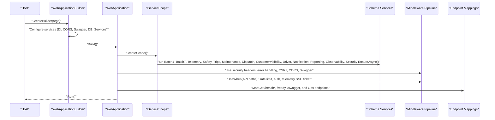
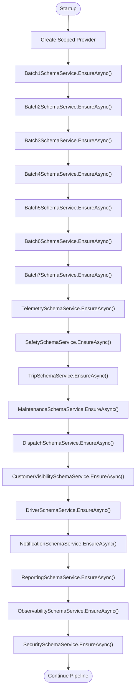
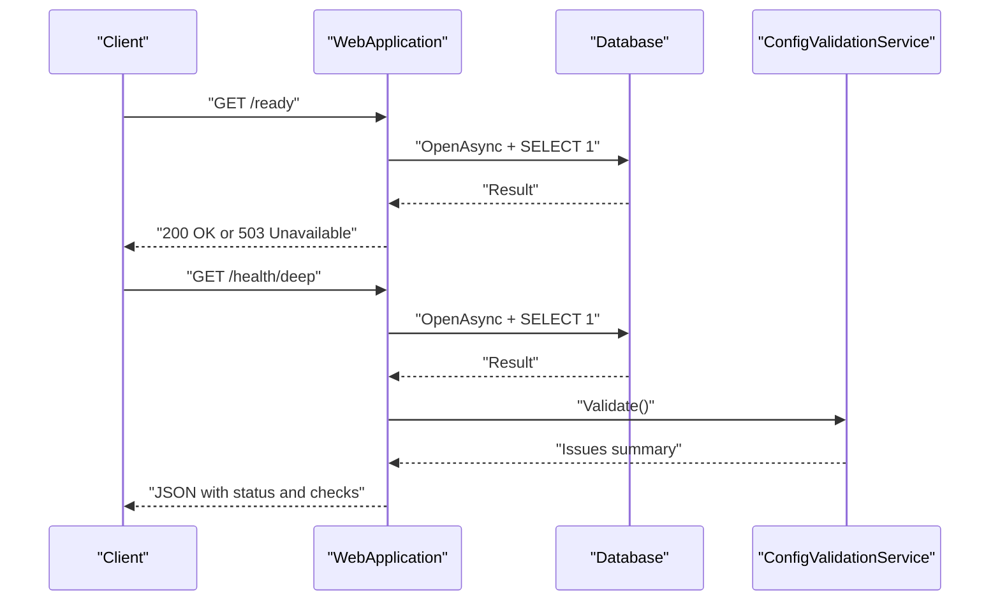
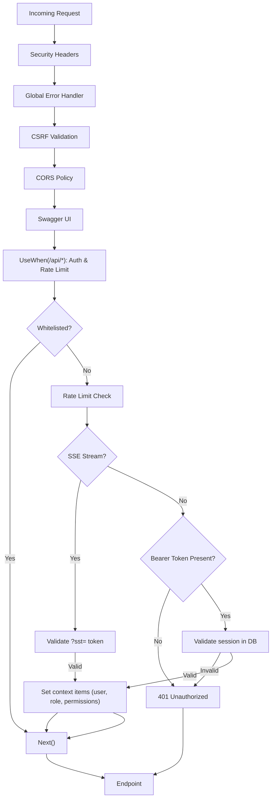
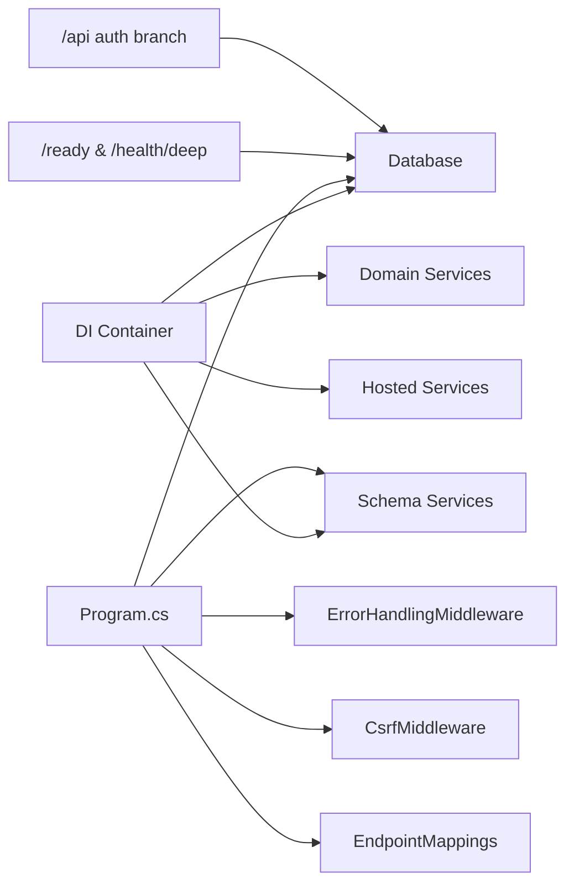

# Application Startup & Configuration

<cite>
**Referenced Files in This Document**
- [Program.cs](file://backend-dotnet/Program.cs)
- [EndpointMappings.cs](file://backend-dotnet/Controllers/EndpointMappings.cs)
- [Database.cs](file://backend-dotnet/Data/Database.cs)
- [ErrorHandlingMiddleware.cs](file://backend-dotnet/Middleware/ErrorHandlingMiddleware.cs)
- [CsrfMiddleware.cs](file://backend-dotnet/Middleware/CsrfMiddleware.cs)
- [Batch1SchemaService.cs](file://backend-dotnet/Services/Batch1SchemaService.cs)
- [Batch2SchemaService.cs](file://backend-dotnet/Services/Batch2SchemaService.cs)
- [Batch3SchemaService.cs](file://backend-dotnet/Services/Batch3SchemaService.cs)
- [Batch4SchemaService.cs](file://backend-dotnet/Services/Batch4SchemaService.cs)
- [Batch5SchemaService.cs](file://backend-dotnet/Services/Batch5SchemaService.cs)
- [Batch6SchemaService.cs](file://backend-dotnet/Services/Batch6SchemaService.cs)
- [Batch7SchemaService.cs](file://backend-dotnet/Services/Batch7SchemaService.cs)
- [TelemetrySchemaService.cs](file://backend-dotnet/Services/TelemetrySchemaService.cs)
- [SafetySchemaService.cs](file://backend-dotnet/Services/SafetySchemaService.cs)
- [TripSchemaService.cs](file://backend-dotnet/Services/TripSchemaService.cs)
- [MaintenanceSchemaService.cs](file://backend-dotnet/Services/MaintenanceSchemaService.cs)
- [DispatchSchemaService.cs](file://backend-dotnet/Services/DispatchSchemaService.cs)
- [CustomerVisibilitySchemaService.cs](file://backend-dotnet/Services/CustomerVisibilitySchemaService.cs)
- [DriverSchemaService.cs](file://backend-dotnet/Services/DriverSchemaService.cs)
- [NotificationSchemaService.cs](file://backend-dotnet/Services/NotificationSchemaService.cs)
- [ReportingSchemaService.cs](file://backend-dotnet/Services/ReportingSchemaService.cs)
- [ObservabilitySchemaService.cs](file://backend-dotnet/Services/ObservabilitySchemaService.cs)
- [SecuritySchemaService.cs](file://backend-dotnet/Services/SecuritySchemaService.cs)
- [Opstrax.Api.csproj](file://backend-dotnet/Opstrax.Api.csproj)
</cite>

## Table of Contents
1. [Introduction](#introduction)
2. [Project Structure](#project-structure)
3. [Core Components](#core-components)
4. [Architecture Overview](#architecture-overview)
5. [Detailed Component Analysis](#detailed-component-analysis)
6. [Dependency Analysis](#dependency-analysis)
7. [Performance Considerations](#performance-considerations)
8. [Troubleshooting Guide](#troubleshooting-guide)
9. [Conclusion](#conclusion)
10. [Appendices](#appendices)

## Introduction
This document explains the .NET Core application startup and configuration process for the backend-dotnet service. It covers WebApplicationBuilder initialization, service collection patterns, dependency injection container setup, schema bootstrap across Batch1 through Batch7 plus specialized services, CORS policy configuration, Swagger/OpenAPI setup, health check endpoints, rate limiting, security headers, application-wide middleware pipeline, environment variable usage, database connection setup, service registration patterns, startup error handling, graceful degradation during schema failures, and logging configuration.

## Project Structure
The backend-dotnet project is a .NET 8 web application that registers services, configures middleware, runs schema bootstrapping, and exposes API endpoints. Key areas:
- Program.cs: Entry point, DI container setup, middleware pipeline, health endpoints, schema bootstrap, and endpoint mapping.
- Controllers/EndpointMappings.cs: Centralized endpoint mapping for all API routes.
- Data/Database.cs: PostgreSQL connection and query helpers using Npgsql.
- Middleware: Global error handling and CSRF protection.
- Services: Schema services for batches and domain services; hosted services for background tasks.
- Opstrax.Api.csproj: SDK type, target framework, and NuGet packages.

```mermaid
graph TB
subgraph "Startup"
P["Program.cs"]
DB["Data/Database.cs"]
EH["Middleware/ErrorHandlingMiddleware.cs"]
CSRF["Middleware/CsrfMiddleware.cs"]
end
subgraph "Services"
B1["Services/Batch1SchemaService.cs"]
B2["Services/Batch2SchemaService.cs"]
B3["Services/Batch3SchemaService.cs"]
B4["Services/Batch4SchemaService.cs"]
B5["Services/Batch5SchemaService.cs"]
B6["Services/Batch6SchemaService.cs"]
B7["Services/Batch7SchemaService.cs"]
TEL["Services/TelemetrySchemaService.cs"]
SAF["Services/SafetySchemaService.cs"]
TRP["Services/TripSchemaService.cs"]
MNT["Services/MaintenanceSchemaService.cs"]
DSP["Services/DispatchSchemaService.cs"]
CV["Services/CustomerVisibilitySchemaService.cs"]
DRV["Services/DriverSchemaService.cs"]
NOTI["Services/NotificationSchemaService.cs"]
REP["Services/ReportingSchemaService.cs"]
OBS["Services/ObservabilitySchemaService.cs"]
SEC["Services/SecuritySchemaService.cs"]
end
subgraph "Endpoints"
EM["Controllers/EndpointMappings.cs"]
end
P --> DB
P --> EH
P --> CSRF
P --> B1
P --> B2
P --> B3
P --> B4
P --> B5
P --> B6
P --> B7
P --> TEL
P --> SAF
P --> TRP
P --> MNT
P --> DSP
P --> CV
P --> DRV
P --> NOTI
P --> REP
P --> OBS
P --> SEC
P --> EM
```

**Diagram sources**
- [Program.cs](file://backend-dotnet/Program.cs)
- [Database.cs](file://backend-dotnet/Data/Database.cs)
- [ErrorHandlingMiddleware.cs](file://backend-dotnet/Middleware/ErrorHandlingMiddleware.cs)
- [CsrfMiddleware.cs](file://backend-dotnet/Middleware/CsrfMiddleware.cs)
- [Batch1SchemaService.cs](file://backend-dotnet/Services/Batch1SchemaService.cs)
- [Batch2SchemaService.cs](file://backend-dotnet/Services/Batch2SchemaService.cs)
- [Batch3SchemaService.cs](file://backend-dotnet/Services/Batch3SchemaService.cs)
- [Batch4SchemaService.cs](file://backend-dotnet/Services/Batch4SchemaService.cs)
- [Batch5SchemaService.cs](file://backend-dotnet/Services/Batch5SchemaService.cs)
- [Batch6SchemaService.cs](file://backend-dotnet/Services/Batch6SchemaService.cs)
- [Batch7SchemaService.cs](file://backend-dotnet/Services/Batch7SchemaService.cs)
- [TelemetrySchemaService.cs](file://backend-dotnet/Services/TelemetrySchemaService.cs)
- [SafetySchemaService.cs](file://backend-dotnet/Services/SafetySchemaService.cs)
- [TripSchemaService.cs](file://backend-dotnet/Services/TripSchemaService.cs)
- [MaintenanceSchemaService.cs](file://backend-dotnet/Services/MaintenanceSchemaService.cs)
- [DispatchSchemaService.cs](file://backend-dotnet/Services/DispatchSchemaService.cs)
- [CustomerVisibilitySchemaService.cs](file://backend-dotnet/Services/CustomerVisibilitySchemaService.cs)
- [DriverSchemaService.cs](file://backend-dotnet/Services/DriverSchemaService.cs)
- [NotificationSchemaService.cs](file://backend-dotnet/Services/NotificationSchemaService.cs)
- [ReportingSchemaService.cs](file://backend-dotnet/Services/ReportingSchemaService.cs)
- [ObservabilitySchemaService.cs](file://backend-dotnet/Services/ObservabilitySchemaService.cs)
- [SecuritySchemaService.cs](file://backend-dotnet/Services/SecuritySchemaService.cs)
- [EndpointMappings.cs](file://backend-dotnet/Controllers/EndpointMappings.cs)

**Section sources**
- [Program.cs](file://backend-dotnet/Program.cs)
- [EndpointMappings.cs](file://backend-dotnet/Controllers/EndpointMappings.cs)
- [Database.cs](file://backend-dotnet/Data/Database.cs)
- [ErrorHandlingMiddleware.cs](file://backend-dotnet/Middleware/ErrorHandlingMiddleware.cs)
- [CsrfMiddleware.cs](file://backend-dotnet/Middleware/CsrfMiddleware.cs)
- [Batch1SchemaService.cs](file://backend-dotnet/Services/Batch1SchemaService.cs)
- [Batch2SchemaService.cs](file://backend-dotnet/Services/Batch2SchemaService.cs)
- [Batch3SchemaService.cs](file://backend-dotnet/Services/Batch3SchemaService.cs)
- [Batch4SchemaService.cs](file://backend-dotnet/Services/Batch4SchemaService.cs)
- [Batch5SchemaService.cs](file://backend-dotnet/Services/Batch5SchemaService.cs)
- [Batch6SchemaService.cs](file://backend-dotnet/Services/Batch6SchemaService.cs)
- [Batch7SchemaService.cs](file://backend-dotnet/Services/Batch7SchemaService.cs)
- [TelemetrySchemaService.cs](file://backend-dotnet/Services/TelemetrySchemaService.cs)
- [SafetySchemaService.cs](file://backend-dotnet/Services/SafetySchemaService.cs)
- [TripSchemaService.cs](file://backend-dotnet/Services/TripSchemaService.cs)
- [MaintenanceSchemaService.cs](file://backend-dotnet/Services/MaintenanceSchemaService.cs)
- [DispatchSchemaService.cs](file://backend-dotnet/Services/DispatchSchemaService.cs)
- [CustomerVisibilitySchemaService.cs](file://backend-dotnet/Services/CustomerVisibilitySchemaService.cs)
- [DriverSchemaService.cs](file://backend-dotnet/Services/DriverSchemaService.cs)
- [NotificationSchemaService.cs](file://backend-dotnet/Services/NotificationSchemaService.cs)
- [ReportingSchemaService.cs](file://backend-dotnet/Services/ReportingSchemaService.cs)
- [ObservabilitySchemaService.cs](file://backend-dotnet/Services/ObservabilitySchemaService.cs)
- [SecuritySchemaService.cs](file://backend-dotnet/Services/SecuritySchemaService.cs)
- [Opstrax.Api.csproj](file://backend-dotnet/Opstrax.Api.csproj)

## Core Components
- WebApplicationBuilder and Build: Initializes configuration, logging, routing, and DI container.
- Service Registration: Adds endpoints API explorer, Swagger, Database singleton, schema services singletons, domain services scoped, and hosted services.
- CORS Policy: Defines a named policy using configuration-driven allowed origins.
- Middleware Pipeline: Security headers, global error handling, CSRF, CORS, Swagger, and a conditional authentication branch for API paths.
- Schema Bootstrap: Executes Batch1–Batch7, Telemetry, Safety, Trips, Maintenance, Dispatch, CustomerVisibility, Driver, Notification, Reporting, Observability, and Security schema services in sequence within a scoped provider.
- Health Checks: /health, /health/live, /ready, and /health/deep with deep probe including DB connectivity, background service heartbeats, and configuration validation.
- Rate Limiting: Per-IP sliding window rate limiter for API requests.
- Authentication and Authorization: Session-based Bearer token validation with permission extraction; special handling for telemetry SSE via short-lived stream tickets.
- Logging: Structured logging via ILogger; unhandled exceptions logged and returned as standardized JSON responses.

**Section sources**
- [Program.cs](file://backend-dotnet/Program.cs)
- [Database.cs](file://backend-dotnet/Data/Database.cs)
- [ErrorHandlingMiddleware.cs](file://backend-dotnet/Middleware/ErrorHandlingMiddleware.cs)
- [CsrfMiddleware.cs](file://backend-dotnet/Middleware/CsrfMiddleware.cs)
- [Batch1SchemaService.cs](file://backend-dotnet/Services/Batch1SchemaService.cs)
- [Batch2SchemaService.cs](file://backend-dotnet/Services/Batch2SchemaService.cs)
- [Batch3SchemaService.cs](file://backend-dotnet/Services/Batch3SchemaService.cs)
- [Batch4SchemaService.cs](file://backend-dotnet/Services/Batch4SchemaService.cs)
- [Batch5SchemaService.cs](file://backend-dotnet/Services/Batch5SchemaService.cs)
- [Batch6SchemaService.cs](file://backend-dotnet/Services/Batch6SchemaService.cs)
- [Batch7SchemaService.cs](file://backend-dotnet/Services/Batch7SchemaService.cs)
- [TelemetrySchemaService.cs](file://backend-dotnet/Services/TelemetrySchemaService.cs)
- [SafetySchemaService.cs](file://backend-dotnet/Services/SafetySchemaService.cs)
- [TripSchemaService.cs](file://backend-dotnet/Services/TripSchemaService.cs)
- [MaintenanceSchemaService.cs](file://backend-dotnet/Services/MaintenanceSchemaService.cs)
- [DispatchSchemaService.cs](file://backend-dotnet/Services/DispatchSchemaService.cs)
- [CustomerVisibilitySchemaService.cs](file://backend-dotnet/Services/CustomerVisibilitySchemaService.cs)
- [DriverSchemaService.cs](file://backend-dotnet/Services/DriverSchemaService.cs)
- [NotificationSchemaService.cs](file://backend-dotnet/Services/NotificationSchemaService.cs)
- [ReportingSchemaService.cs](file://backend-dotnet/Services/ReportingSchemaService.cs)
- [ObservabilitySchemaService.cs](file://backend-dotnet/Services/ObservabilitySchemaService.cs)
- [SecuritySchemaService.cs](file://backend-dotnet/Services/SecuritySchemaService.cs)

## Architecture Overview
The startup flow initializes the host, builds the application, performs schema bootstrap, sets up middleware, and maps endpoints. The DI container holds Database, schema services, domain services, and hosted services. Health endpoints provide Kubernetes-style probes. CORS and security headers protect the API. A custom middleware branch handles authentication and rate limiting for API paths.

**Diagram sources**
- [Program.cs](file://backend-dotnet/Program.cs)
- [EndpointMappings.cs](file://backend-dotnet/Controllers/EndpointMappings.cs)
- [Database.cs](file://backend-dotnet/Data/Database.cs)
- [ErrorHandlingMiddleware.cs](file://backend-dotnet/Middleware/ErrorHandlingMiddleware.cs)
- [CsrfMiddleware.cs](file://backend-dotnet/Middleware/CsrfMiddleware.cs)
- [Batch1SchemaService.cs](file://backend-dotnet/Services/Batch1SchemaService.cs)
- [Batch2SchemaService.cs](file://backend-dotnet/Services/Batch2SchemaService.cs)
- [Batch3SchemaService.cs](file://backend-dotnet/Services/Batch3SchemaService.cs)
- [Batch4SchemaService.cs](file://backend-dotnet/Services/Batch4SchemaService.cs)
- [Batch5SchemaService.cs](file://backend-dotnet/Services/Batch5SchemaService.cs)
- [Batch6SchemaService.cs](file://backend-dotnet/Services/Batch6SchemaService.cs)
- [Batch7SchemaService.cs](file://backend-dotnet/Services/Batch7SchemaService.cs)
- [TelemetrySchemaService.cs](file://backend-dotnet/Services/TelemetrySchemaService.cs)
- [SafetySchemaService.cs](file://backend-dotnet/Services/SafetySchemaService.cs)
- [TripSchemaService.cs](file://backend-dotnet/Services/TripSchemaService.cs)
- [MaintenanceSchemaService.cs](file://backend-dotnet/Services/MaintenanceSchemaService.cs)
- [DispatchSchemaService.cs](file://backend-dotnet/Services/DispatchSchemaService.cs)
- [CustomerVisibilitySchemaService.cs](file://backend-dotnet/Services/CustomerVisibilitySchemaService.cs)
- [DriverSchemaService.cs](file://backend-dotnet/Services/DriverSchemaService.cs)
- [NotificationSchemaService.cs](file://backend-dotnet/Services/NotificationSchemaService.cs)
- [ReportingSchemaService.cs](file://backend-dotnet/Services/ReportingSchemaService.cs)
- [ObservabilitySchemaService.cs](file://backend-dotnet/Services/ObservabilitySchemaService.cs)
- [SecuritySchemaService.cs](file://backend-dotnet/Services/SecuritySchemaService.cs)

## Detailed Component Analysis

### WebApplicationBuilder Initialization and DI Container Setup
- Builder creation and Build produce a configured WebApplication instance.
- DI registrations include:
  - Endpoints API Explorer and Swagger generator.
  - Singleton Database for PostgreSQL connections.
  - Singletons for all schema services (Batch1–Batch7, Telemetry, Safety, Trips, Maintenance, Dispatch, CustomerVisibility, Driver, Notification, Reporting, Observability, Security).
  - Scoped services for domain services (e.g., AuditService, NotificationService, ComplianceService).
  - Hosted services for background tasks (e.g., TelemetryBackgroundService, SafetyBackgroundService).
- CORS policy “OpsTraxCors” reads allowed origins from configuration and allows credentials.

**Section sources**
- [Program.cs](file://backend-dotnet/Program.cs)
- [Opstrax.Api.csproj](file://backend-dotnet/Opstrax.Api.csproj)

### Schema Bootstrap Process (Batch1–Batch7 and Specialized Services)
- Schema bootstrap executes in order within a scoped provider, ensuring each service can resolve dependencies from the container.
- Execution order:
  - Batch1SchemaService
  - Batch2SchemaService
  - Batch3SchemaService
  - Batch4SchemaService
  - Batch5SchemaService
  - Batch6SchemaService
  - Batch7SchemaService
  - TelemetrySchemaService
  - SafetySchemaService
  - TripSchemaService
  - MaintenanceSchemaService
  - DispatchSchemaService
  - CustomerVisibilitySchemaService
  - DriverSchemaService
  - NotificationSchemaService
  - ReportingSchemaService
  - ObservabilitySchemaService
  - SecuritySchemaService
- Each EnsureAsync method performs idempotent schema and seed operations against PostgreSQL.

**Diagram sources**
- [Program.cs](file://backend-dotnet/Program.cs)
- [Batch1SchemaService.cs](file://backend-dotnet/Services/Batch1SchemaService.cs)
- [Batch2SchemaService.cs](file://backend-dotnet/Services/Batch2SchemaService.cs)
- [Batch3SchemaService.cs](file://backend-dotnet/Services/Batch3SchemaService.cs)
- [Batch4SchemaService.cs](file://backend-dotnet/Services/Batch4SchemaService.cs)
- [Batch5SchemaService.cs](file://backend-dotnet/Services/Batch5SchemaService.cs)
- [Batch6SchemaService.cs](file://backend-dotnet/Services/Batch6SchemaService.cs)
- [Batch7SchemaService.cs](file://backend-dotnet/Services/Batch7SchemaService.cs)
- [TelemetrySchemaService.cs](file://backend-dotnet/Services/TelemetrySchemaService.cs)
- [SafetySchemaService.cs](file://backend-dotnet/Services/SafetySchemaService.cs)
- [TripSchemaService.cs](file://backend-dotnet/Services/TripSchemaService.cs)
- [MaintenanceSchemaService.cs](file://backend-dotnet/Services/MaintenanceSchemaService.cs)
- [DispatchSchemaService.cs](file://backend-dotnet/Services/DispatchSchemaService.cs)
- [CustomerVisibilitySchemaService.cs](file://backend-dotnet/Services/CustomerVisibilitySchemaService.cs)
- [DriverSchemaService.cs](file://backend-dotnet/Services/DriverSchemaService.cs)
- [NotificationSchemaService.cs](file://backend-dotnet/Services/NotificationSchemaService.cs)
- [ReportingSchemaService.cs](file://backend-dotnet/Services/ReportingSchemaService.cs)
- [ObservabilitySchemaService.cs](file://backend-dotnet/Services/ObservabilitySchemaService.cs)
- [SecuritySchemaService.cs](file://backend-dotnet/Services/SecuritySchemaService.cs)

**Section sources**
- [Program.cs](file://backend-dotnet/Program.cs)
- [Batch1SchemaService.cs](file://backend-dotnet/Services/Batch1SchemaService.cs)
- [Batch2SchemaService.cs](file://backend-dotnet/Services/Batch2SchemaService.cs)
- [Batch3SchemaService.cs](file://backend-dotnet/Services/Batch3SchemaService.cs)
- [Batch4SchemaService.cs](file://backend-dotnet/Services/Batch4SchemaService.cs)
- [Batch5SchemaService.cs](file://backend-dotnet/Services/Batch5SchemaService.cs)
- [Batch6SchemaService.cs](file://backend-dotnet/Services/Batch6SchemaService.cs)
- [Batch7SchemaService.cs](file://backend-dotnet/Services/Batch7SchemaService.cs)
- [TelemetrySchemaService.cs](file://backend-dotnet/Services/TelemetrySchemaService.cs)
- [SafetySchemaService.cs](file://backend-dotnet/Services/SafetySchemaService.cs)
- [TripSchemaService.cs](file://backend-dotnet/Services/TripSchemaService.cs)
- [MaintenanceSchemaService.cs](file://backend-dotnet/Services/MaintenanceSchemaService.cs)
- [DispatchSchemaService.cs](file://backend-dotnet/Services/DispatchSchemaService.cs)
- [CustomerVisibilitySchemaService.cs](file://backend-dotnet/Services/CustomerVisibilitySchemaService.cs)
- [DriverSchemaService.cs](file://backend-dotnet/Services/DriverSchemaService.cs)
- [NotificationSchemaService.cs](file://backend-dotnet/Services/NotificationSchemaService.cs)
- [ReportingSchemaService.cs](file://backend-dotnet/Services/ReportingSchemaService.cs)
- [ObservabilitySchemaService.cs](file://backend-dotnet/Services/ObservabilitySchemaService.cs)
- [SecuritySchemaService.cs](file://backend-dotnet/Services/SecuritySchemaService.cs)

### CORS Policy Configuration
- A named policy “OpsTraxCors” is registered with allowed origins parsed from configuration.
- The policy allows any header/method and credentials.

**Section sources**
- [Program.cs](file://backend-dotnet/Program.cs)

### Swagger/OpenAPI Setup
- Swagger generator is added to services.
- HTML landing page mapping for Swagger UI is provided.

**Section sources**
- [Program.cs](file://backend-dotnet/Program.cs)

### Health Check Endpoints
- /health and /health/live: Always alive indicator.
- /ready and /health/ready: Database connectivity check; returns 503 if unavailable.
- /health/deep: Comprehensive health including DB connectivity, background service heartbeats, and configuration validation; determines overall status as healthy, degraded, or unhealthy.

**Diagram sources**
- [Program.cs](file://backend-dotnet/Program.cs)
- [Database.cs](file://backend-dotnet/Data/Database.cs)

**Section sources**
- [Program.cs](file://backend-dotnet/Program.cs)
- [Database.cs](file://backend-dotnet/Data/Database.cs)

### Rate Limiting Implementation
- A per-IP sliding window counter tracks request counts within a fixed window.
- Requests exceeding the limit receive a 429 response with a standardized failure payload.
- Telemetry SSE requires a short-lived stream ticket; otherwise rejects with 401.

**Section sources**
- [Program.cs](file://backend-dotnet/Program.cs)

### Security Headers Configuration
- Applies X-Content-Type-Options, X-Frame-Options, Referrer-Policy, and Permissions-Policy to all responses.

**Section sources**
- [Program.cs](file://backend-dotnet/Program.cs)

### Application-Wide Middleware Pipeline
- Security headers applied globally.
- Global error handling middleware logs unhandled exceptions and returns standardized JSON.
- CSRF middleware generates and validates CSRF tokens for state-changing requests.
- CORS policy applied.
- Swagger enabled.
- Conditional branch for API paths:
  - Whitelisted paths bypass authentication (e.g., health, telemetry ingest, public tracking).
  - Telemetry SSE requires ?sst= token validated via TelemetryTicketHelper.
  - Other API paths require a valid Bearer token and resolve user/session permissions from the database.

**Diagram sources**
- [Program.cs](file://backend-dotnet/Program.cs)
- [ErrorHandlingMiddleware.cs](file://backend-dotnet/Middleware/ErrorHandlingMiddleware.cs)
- [CsrfMiddleware.cs](file://backend-dotnet/Middleware/CsrfMiddleware.cs)
- [Database.cs](file://backend-dotnet/Data/Database.cs)

**Section sources**
- [Program.cs](file://backend-dotnet/Program.cs)
- [ErrorHandlingMiddleware.cs](file://backend-dotnet/Middleware/ErrorHandlingMiddleware.cs)
- [CsrfMiddleware.cs](file://backend-dotnet/Middleware/CsrfMiddleware.cs)
- [Database.cs](file://backend-dotnet/Data/Database.cs)

### Environment Variable Configuration
- CORS allowed origins are read from configuration keys.
- Telemetry SSE ticket key is read from an environment variable.
- AI-related endpoints read OLLAMA base URL, model, and optional API key from environment variables.

**Section sources**
- [Program.cs](file://backend-dotnet/Program.cs)
- [EndpointMappings.cs](file://backend-dotnet/Controllers/EndpointMappings.cs)
- [TelemetryKeyStore.cs](file://backend-dotnet/TelemetryKeyStore.cs)

### Database Connection Setup and Service Registration Patterns
- Database service resolves connection string from IConfiguration and opens Npgsql connections.
- Service registration pattern:
  - AddSingleton for stateless or shared resources (Database, schema services).
  - AddScoped for request-scoped services (domain services).
  - AddHostedService for background tasks.

**Section sources**
- [Database.cs](file://backend-dotnet/Data/Database.cs)
- [Program.cs](file://backend-dotnet/Program.cs)
- [Opstrax.Api.csproj](file://backend-dotnet/Opstrax.Api.csproj)

### Startup Error Handling and Graceful Degradation During Schema Failures
- Each schema step is executed inside a try/catch block.
- On failure, a warning log is emitted and startup continues to maintain availability.

**Section sources**
- [Program.cs](file://backend-dotnet/Program.cs)

### Logging Configuration
- Global error middleware logs unhandled exceptions with structured logging.
- Permission parsing supports robust deserialization from multiple JSON formats.

**Section sources**
- [ErrorHandlingMiddleware.cs](file://backend-dotnet/Middleware/ErrorHandlingMiddleware.cs)
- [Program.cs](file://backend-dotnet/Program.cs)

## Dependency Analysis
The startup depends on DI-registered services and middleware. The schema bootstrap depends on Database and each schema service’s EnsureAsync implementation. Health endpoints depend on Database and configuration validation. Authentication depends on Database for session validation and permission aggregation.

**Diagram sources**
- [Program.cs](file://backend-dotnet/Program.cs)
- [Database.cs](file://backend-dotnet/Data/Database.cs)
- [ErrorHandlingMiddleware.cs](file://backend-dotnet/Middleware/ErrorHandlingMiddleware.cs)
- [CsrfMiddleware.cs](file://backend-dotnet/Middleware/CsrfMiddleware.cs)
- [EndpointMappings.cs](file://backend-dotnet/Controllers/EndpointMappings.cs)

**Section sources**
- [Program.cs](file://backend-dotnet/Program.cs)
- [Database.cs](file://backend-dotnet/Data/Database.cs)
- [ErrorHandlingMiddleware.cs](file://backend-dotnet/Middleware/ErrorHandlingMiddleware.cs)
- [CsrfMiddleware.cs](file://backend-dotnet/Middleware/CsrfMiddleware.cs)
- [EndpointMappings.cs](file://backend-dotnet/Controllers/EndpointMappings.cs)

## Performance Considerations
- Sliding window rate limiting uses an in-memory concurrent dictionary; consider distributed cache for multi-instance deployments.
- Database queries in health and auth endpoints are lightweight; ensure proper indexing for production datasets.
- Background services rely on database heartbeats; ensure timely updates to avoid false degraded status.

## Troubleshooting Guide
- 429 Too Many Requests: Reduce client request rate or increase window size/count thresholds.
- 401 Unauthorized: Verify Bearer token presence and validity; confirm session not expired and user active.
- 403 Forbidden (CSRF): Ensure CSRF cookie and header match for state-changing requests.
- 503 Not Ready: Confirm database connectivity and that SELECT 1 succeeds.
- Schema bootstrap failures: Review warning logs for failing steps; schema services are designed to continue after individual failures.

**Section sources**
- [Program.cs](file://backend-dotnet/Program.cs)
- [ErrorHandlingMiddleware.cs](file://backend-dotnet/Middleware/ErrorHandlingMiddleware.cs)
- [CsrfMiddleware.cs](file://backend-dotnet/Middleware/CsrfMiddleware.cs)
- [Database.cs](file://backend-dotnet/Data/Database.cs)

## Conclusion
The backend-dotnet application initializes a robust DI container, applies security headers and middleware, performs ordered schema bootstrap, and exposes health and API endpoints. The design balances reliability with security, providing clear diagnostics and graceful fallbacks during schema failures.

## Appendices
- Package references include Npgsql and Swashbuckle.AspNetCore.
- Target framework is net8.0.

**Section sources**
- [Opstrax.Api.csproj](file://backend-dotnet/Opstrax.Api.csproj)