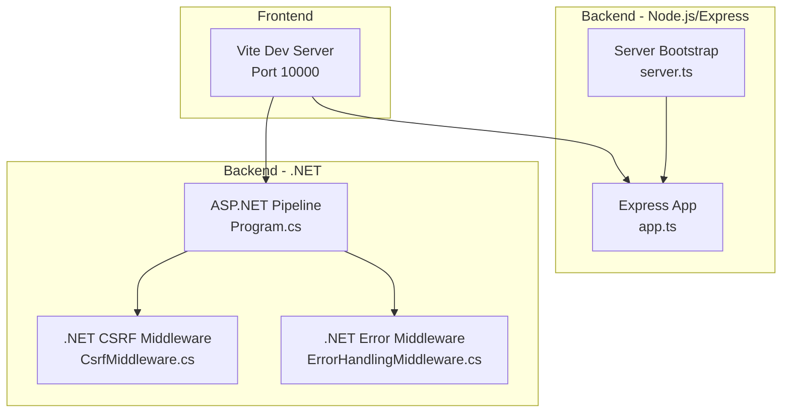
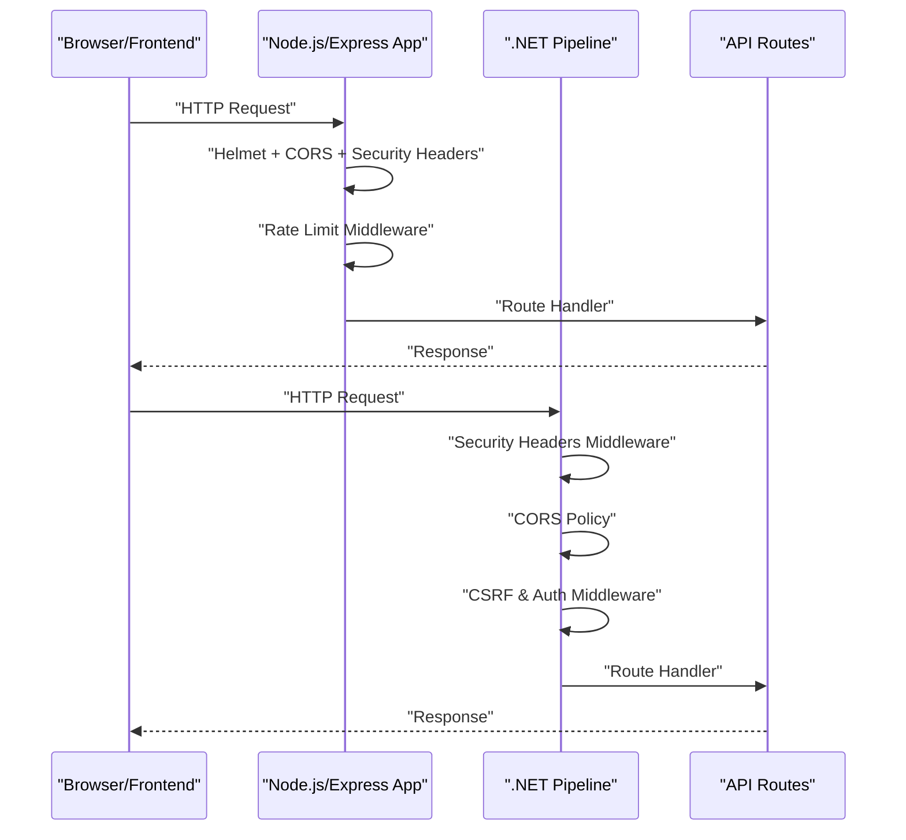
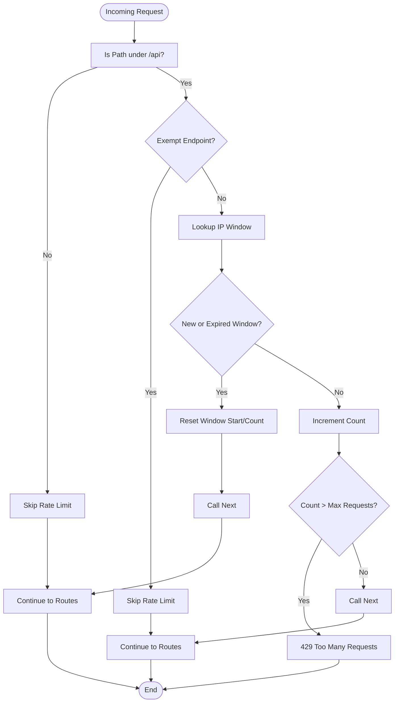
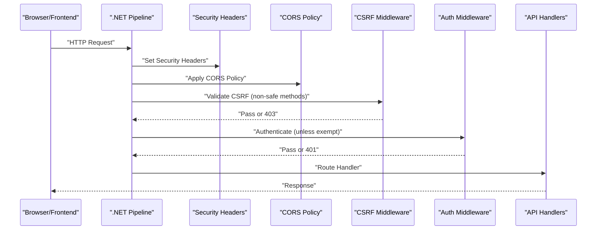
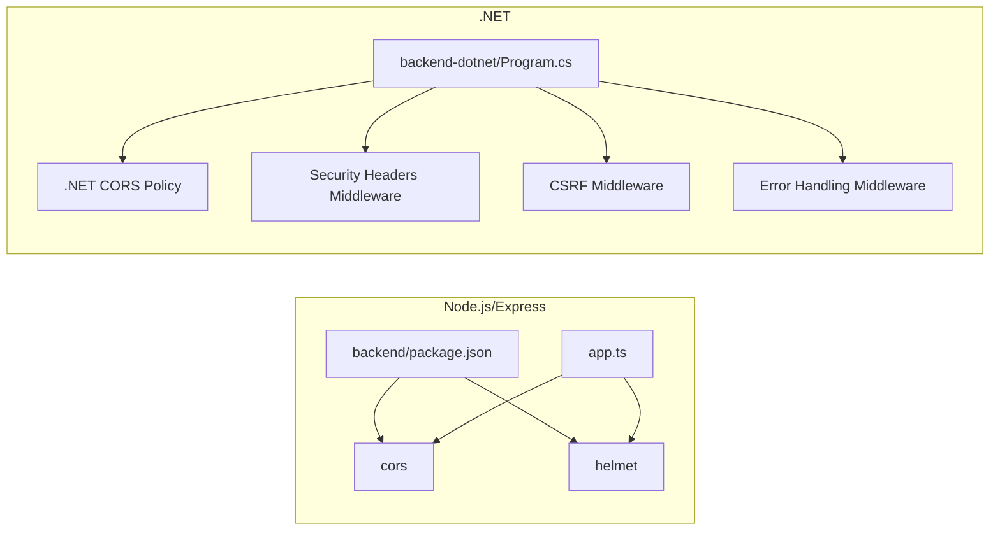

# CORS Policy and Security Headers

<cite>
**Referenced Files in This Document**
- [app.ts](file://backend/src/app.ts)
- [server.ts](file://backend/src/server.ts)
- [package.json](file://backend/package.json)
- [Program.cs](file://backend-dotnet/Program.cs)
- [CsrfMiddleware.cs](file://backend-dotnet/Middleware/CsrfMiddleware.cs)
- [ErrorHandlingMiddleware.cs](file://backend-dotnet/Middleware/ErrorHandlingMiddleware.cs)
- [vite.config.ts](file://frontend/vite.config.ts)
- [frontend package.json](file://frontend/package.json)
</cite>

## Table of Contents
1. [Introduction](#introduction)
2. [Project Structure](#project-structure)
3. [Core Components](#core-components)
4. [Architecture Overview](#architecture-overview)
5. [Detailed Component Analysis](#detailed-component-analysis)
6. [Dependency Analysis](#dependency-analysis)
7. [Performance Considerations](#performance-considerations)
8. [Troubleshooting Guide](#troubleshooting-guide)
9. [Conclusion](#conclusion)
10. [Appendices](#appendices)

## Introduction
This document explains how Cross-Origin Resource Sharing (CORS) and application-wide security headers are configured and applied across the backend services. It covers:
- Dynamic CORS origin configuration from environment variables with credential support
- Application-wide security headers: X-Content-Type-Options, X-Frame-Options, Referrer-Policy, and Permissions-Policy
- Security implications and browser compatibility
- Deployment configuration examples and troubleshooting guidance for CORS-related issues

## Project Structure
The repository includes two backend implementations and a frontend:
- Node.js/Express backend under backend/src
- .NET backend under backend-dotnet
- Frontend under frontend

CORS and security headers are implemented in both backend stacks, along with environment-driven configuration and rate limiting middleware.

**Diagram sources**
- [app.ts:1-97](file://backend/src/app.ts#L1-L97)
- [server.ts:1-11](file://backend/src/server.ts#L1-L11)
- [Program.cs:1-452](file://backend-dotnet/Program.cs#L1-L452)
- [CsrfMiddleware.cs:1-62](file://backend-dotnet/Middleware/CsrfMiddleware.cs#L1-L62)
- [ErrorHandlingMiddleware.cs:1-22](file://backend-dotnet/Middleware/ErrorHandlingMiddleware.cs#L1-L22)

**Section sources**
- [app.ts:1-97](file://backend/src/app.ts#L1-L97)
- [server.ts:1-11](file://backend/src/server.ts#L1-L11)
- [Program.cs:1-452](file://backend-dotnet/Program.cs#L1-L452)

## Core Components
- Node.js/Express CORS and security headers:
  - Dynamic origin list from FRONTEND_URL environment variable
  - Credentials allowed
  - Helmet security defaults plus explicit headers set per-response
- .NET CORS and security headers:
  - CORS policy with origins from configuration, credentials allowed, any header/method
  - Application-wide security headers set via middleware
  - Additional CSRF protection and error handling middleware

**Section sources**
- [app.ts:20-40](file://backend/src/app.ts#L20-L40)
- [Program.cs:55-63](file://backend-dotnet/Program.cs#L55-L63)
- [Program.cs:92-99](file://backend-dotnet/Program.cs#L92-L99)

## Architecture Overview
The request lifecycle applies CORS and security headers before routing to API endpoints. Both stacks also apply rate limiting and authentication checks for protected routes.

**Diagram sources**
- [app.ts:25-40](file://backend/src/app.ts#L25-L40)
- [app.ts:42-72](file://backend/src/app.ts#L42-L72)
- [Program.cs:92-99](file://backend-dotnet/Program.cs#L92-L99)
- [Program.cs:103](file://backend-dotnet/Program.cs#L103)
- [Program.cs:105-245](file://backend-dotnet/Program.cs#L105-L245)

## Detailed Component Analysis

### Node.js/Express CORS and Security Headers
- CORS configuration:
  - Origin list built from FRONTEND_URL environment variable, split by comma and trimmed
  - Credentials enabled
  - Uses the cors middleware with origin array and credentials flag
- Security headers:
  - X-Content-Type-Options: nosniff
  - X-Frame-Options: DENY
  - Referrer-Policy: strict-origin-when-cross-origin
  - Permissions-Policy: camera=(), microphone=(), geolocation=()
- Rate limiting:
  - Per-IP sliding window with configurable window size and max requests via environment variables
  - Exemptions for health/readiness, login, and selected GET endpoints

**Diagram sources**
- [app.ts:42-72](file://backend/src/app.ts#L42-L72)

**Section sources**
- [app.ts:20-31](file://backend/src/app.ts#L20-L31)
- [app.ts:34-40](file://backend/src/app.ts#L34-L40)
- [app.ts:42-72](file://backend/src/app.ts#L42-L72)
- [server.ts:4](file://backend/src/server.ts#L4)
- [package.json:22-28](file://backend/package.json#L22-L28)

### .NET CORS and Security Headers
- CORS policy:
  - Policy name: OpsTraxCors
  - Origins loaded from configuration (comma-separated), default fallback to localhost dev port
  - AllowAnyHeader, AllowAnyMethod, AllowCredentials
- Security headers:
  - Applied globally via middleware before routing
  - X-Content-Type-Options, X-Frame-Options, Referrer-Policy, Permissions-Policy
- Authentication and CSRF:
  - CSRF middleware generates and validates CSRF tokens for state-changing requests
  - Error handling middleware wraps unhandled exceptions
- Rate limiting and exemptions:
  - Sliding window per client IP with configurable limits and windows
  - Exemptions for health, telemetry ingest, and selected GET endpoints

**Diagram sources**
- [Program.cs:92-99](file://backend-dotnet/Program.cs#L92-L99)
- [Program.cs:103](file://backend-dotnet/Program.cs#L103)
- [CsrfMiddleware.cs:19-55](file://backend-dotnet/Middleware/CsrfMiddleware.cs#L19-L55)
- [ErrorHandlingMiddleware.cs:8-20](file://backend-dotnet/Middleware/ErrorHandlingMiddleware.cs#L8-L20)

**Section sources**
- [Program.cs:55-63](file://backend-dotnet/Program.cs#L55-L63)
- [Program.cs:92-99](file://backend-dotnet/Program.cs#L92-L99)
- [Program.cs:105-245](file://backend-dotnet/Program.cs#L105-L245)
- [CsrfMiddleware.cs:1-62](file://backend-dotnet/Middleware/CsrfMiddleware.cs#L1-L62)
- [ErrorHandlingMiddleware.cs:1-22](file://backend-dotnet/Middleware/ErrorHandlingMiddleware.cs#L1-L22)

### Security Headers Explained
- X-Content-Type-Options: nosniff
  - Prevents MIME-type sniffing; ensures the browser respects Content-Type headers
  - Mitigates certain content injection attacks
- X-Frame-Options: DENY
  - Blocks embedding in frames/iframes; prevents clickjacking
- Referrer-Policy: strict-origin-when-cross-origin
  - Limits referrer information sent across origins while preserving origin-level privacy
- Permissions-Policy:
  - Explicitly disables camera, microphone, and geolocation APIs for the browser context
  - Reduces fingerprinting surface and enforces least-privilege for device sensors

Compatibility and implications:
- These headers are broadly supported in modern browsers
- They complement CSP and other hardening measures
- Misconfiguration can break legitimate cross-origin functionality; ensure origins and credentials align with deployment needs

**Section sources**
- [app.ts:34-38](file://backend/src/app.ts#L34-L38)
- [Program.cs:94-97](file://backend-dotnet/Program.cs#L94-L97)

## Dependency Analysis
- Node.js/Express:
  - Dependencies include cors, helmet, morgan, dotenv
  - CORS and security headers are applied via middleware stack
- .NET:
  - CORS configured via AddCors and used via UseCors
  - Security headers, CSRF, and error handling implemented as middleware
  - Authentication middleware validates bearer tokens for protected routes

**Diagram sources**
- [package.json:22-28](file://backend/package.json#L22-L28)
- [app.ts:1-25](file://backend/src/app.ts#L1-L25)
- [Program.cs:55-63](file://backend-dotnet/Program.cs#L55-L63)
- [Program.cs:92-99](file://backend-dotnet/Program.cs#L92-L99)
- [CsrfMiddleware.cs:1-62](file://backend-dotnet/Middleware/CsrfMiddleware.cs#L1-L62)
- [ErrorHandlingMiddleware.cs:1-22](file://backend-dotnet/Middleware/ErrorHandlingMiddleware.cs#L1-L22)

**Section sources**
- [package.json:22-28](file://backend/package.json#L22-L28)
- [Program.cs:55-63](file://backend-dotnet/Program.cs#L55-L63)

## Performance Considerations
- CORS origin parsing occurs once during initialization; keep the origin list concise
- Rate limiting uses in-memory maps/dictionaries; consider external caching or distributed stores for clustered deployments
- Security headers are set per-response; overhead is minimal and recommended for all responses
- Helmet sets additional headers; ensure they align with your CDN/proxy configuration to avoid duplication

[No sources needed since this section provides general guidance]

## Troubleshooting Guide
Common CORS issues and resolutions:
- Wrong or missing origin
  - Verify FRONTEND_URL contains the exact origin(s) used by the frontend (including protocol and port)
  - Confirm credentials are enabled when the frontend sends cookies or Authorization headers
- Preflight (OPTIONS) failures
  - Ensure allowed methods and headers match actual requests; the Node implementation allows any method/headers implicitly via middleware
  - Confirm preflight requests are not blocked by rate limiting or authentication
- Credentials not working
  - Ensure credentials: true is set and the origin list does not include wildcard "*"
  - Check SameSite and Secure cookie policies if using CSRF tokens
- Security headers blocking legitimate requests
  - Temporarily remove or relax headers to isolate the cause
  - Validate proxy/CDN behavior; some intermediaries override headers

Environment configuration tips:
- Node.js/Express
  - Set FRONTEND_URL to a comma-separated list of allowed origins
  - Configure RATE_LIMIT_WINDOW_MS and RATE_LIMIT_MAX_REQUESTS for rate limiting
- .NET
  - Configure Cors:AllowedOrigins in your hosting configuration
  - Ensure CORS policy is registered and applied before authentication middleware

**Section sources**
- [app.ts:20-31](file://backend/src/app.ts#L20-L31)
- [app.ts:18-19](file://backend/src/app.ts#L18-L19)
- [Program.cs:59-61](file://backend-dotnet/Program.cs#L59-L61)

## Conclusion
Both backend stacks implement robust CORS and security headers to mitigate common web vulnerabilities. The Node.js/Express implementation uses environment-driven origins with credentials and explicit headers, while the .NET implementation adds CSRF protection and comprehensive middleware for authentication and error handling. Proper environment configuration and understanding of rate-limiting exemptions are essential for smooth operation across development, staging, and production environments.

[No sources needed since this section summarizes without analyzing specific files]

## Appendices

### Environment Variables and Configuration Examples
- Node.js/Express
  - FRONTEND_URL: comma-separated origins (e.g., http://localhost:10000,https://app.example.com)
  - RATE_LIMIT_WINDOW_MS: sliding window duration in milliseconds
  - RATE_LIMIT_MAX_REQUESTS: maximum requests per window per IP
  - PORT: server port (default 11000)
- .NET
  - Cors:AllowedOrigins: comma-separated origins (fallback to http://localhost:10000 if unset)
  - Ensure CORS policy registration precedes authentication middleware

**Section sources**
- [app.ts:18-23](file://backend/src/app.ts#L18-L23)
- [server.ts:6-10](file://backend/src/server.ts#L6-L10)
- [Program.cs:59-61](file://backend-dotnet/Program.cs#L59-L61)