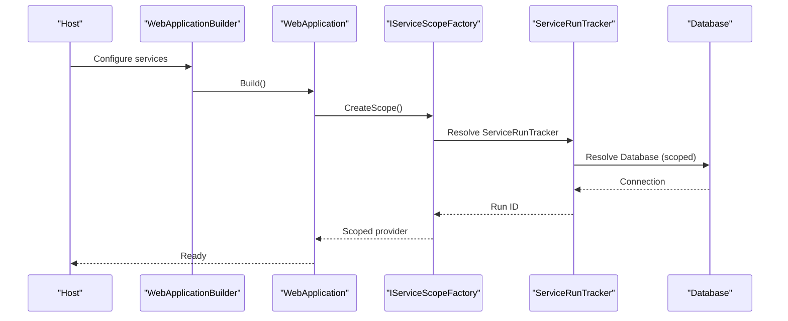
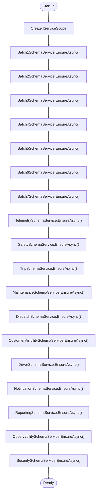
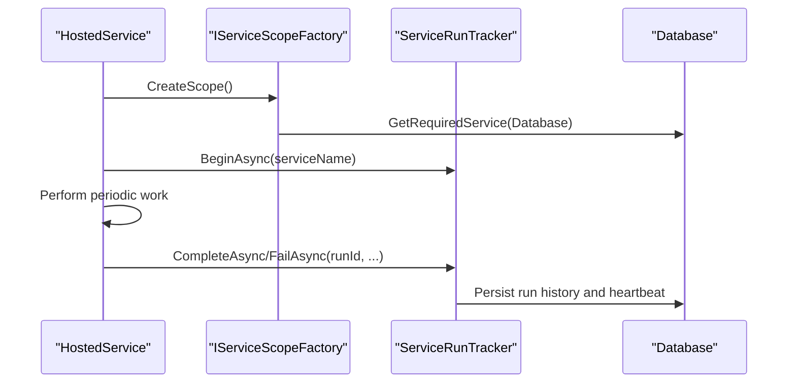
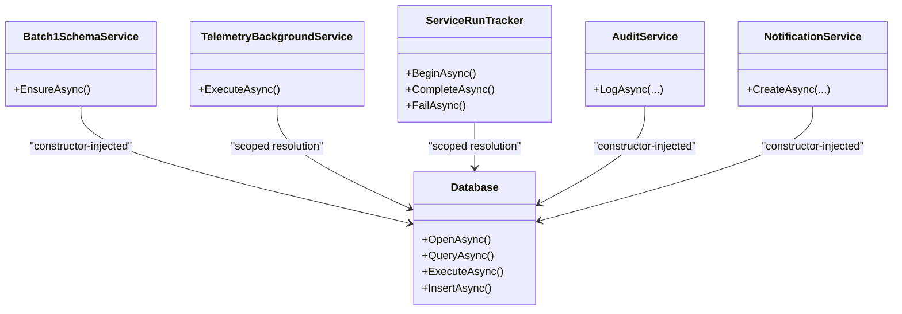
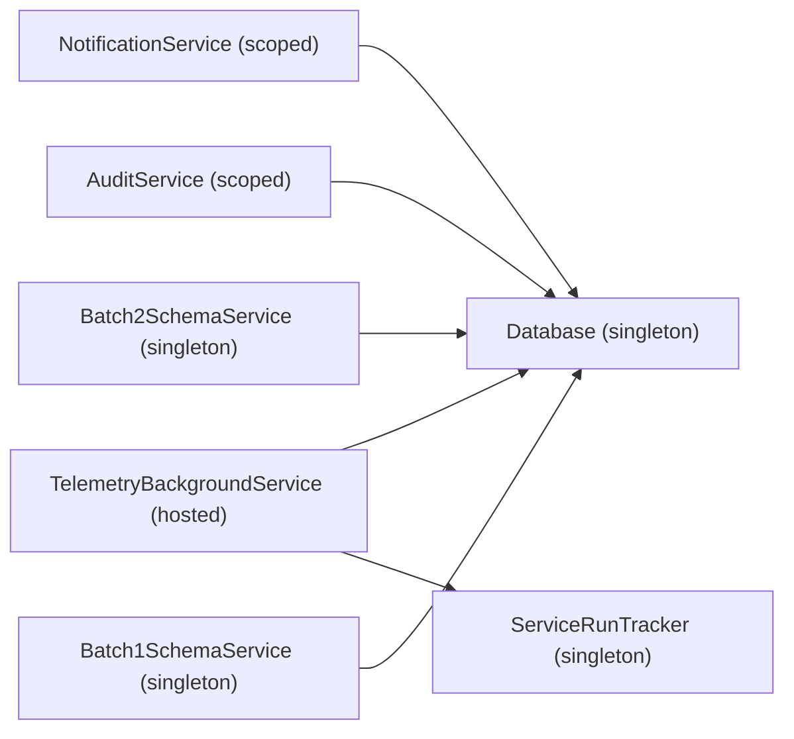

# Dependency Injection Container Setup

<cite>
**Referenced Files in This Document**
- [Program.cs](file://backend-dotnet/Program.cs)
- [Database.cs](file://backend-dotnet/Data/Database.cs)
- [Batch1SchemaService.cs](file://backend-dotnet/Services/Batch1SchemaService.cs)
- [TelemetryBackgroundService.cs](file://backend-dotnet/Services/TelemetryBackgroundService.cs)
- [ServiceRunTracker.cs](file://backend-dotnet/Services/ServiceRunTracker.cs)
- [ConfigValidationService.cs](file://backend-dotnet/Services/ConfigValidationService.cs)
- [AuditService.cs](file://backend-dotnet/Services/AuditService.cs)
- [NotificationService.cs](file://backend-dotnet/Services/NotificationService.cs)
- [EndpointMappings.cs](file://backend-dotnet/Controllers/EndpointMappings.cs)
- [Opstrax.Api.csproj](file://backend-dotnet/Opstrax.Api.csproj)
</cite>

## Table of Contents
1. [Introduction](#introduction)
2. [Project Structure](#project-structure)
3. [Core Components](#core-components)
4. [Architecture Overview](#architecture-overview)
5. [Detailed Component Analysis](#detailed-component-analysis)
6. [Dependency Analysis](#dependency-analysis)
7. [Performance Considerations](#performance-considerations)
8. [Troubleshooting Guide](#troubleshooting-guide)
9. [Conclusion](#conclusion)

## Introduction
This document explains the .NET Core dependency injection (DI) container setup in the OpsTrax application. It focuses on the WebApplicationBuilder service collection patterns, service lifetimes (singleton vs scoped), and the registration of schema services across batches 1–7, plus specialized services for Telemetry, Safety, Trip, Maintenance, Dispatch, CustomerVisibility, Driver, Notification, Reporting, Observability, and Security. It also covers hosted services for background tasks, the service resolution process, constructor injection patterns, and how services interact. Guidance is included on proper registration order and dependency relationships.

## Project Structure
The DI configuration is primarily defined in the application’s entry point and extended by service registrations for schema bootstrapping and background tasks. Supporting services and data access are encapsulated in dedicated classes under the Services and Data folders.

```mermaid
graph TB
subgraph "App Startup"
P["Program.cs<br/>WebApplicationBuilder"]
end
subgraph "Data Layer"
DB["Database.cs<br/>Scoped"]
end
subgraph "Schema Services"
B1["Batch1SchemaService.cs<br/>Singleton"]
B2["Batch2SchemaService.cs<br/>Singleton"]
B3["Batch3SchemaService.cs<br/>Singleton"]
B4["Batch4SchemaService.cs<br/>Singleton"]
B5["Batch5SchemaService.cs<br/>Singleton"]
B6["Batch6SchemaService.cs<br/>Singleton"]
B7["Batch7SchemaService.cs<br/>Singleton"]
T["TelemetrySchemaService.cs<br/>Singleton"]
S["SafetySchemaService.cs<br/>Singleton"]
TR["TripSchemaService.cs<br/>Singleton"]
M["MaintenanceSchemaService.cs<br/>Singleton"]
D["DispatchSchemaService.cs<br/>Singleton"]
CV["CustomerVisibilitySchemaService.cs<br/>Singleton"]
DRV["DriverSchemaService.cs<br/>Singleton"]
N["NotificationSchemaService.cs<br/>Singleton"]
R["ReportingSchemaService.cs<br/>Singleton"]
O["ObservabilitySchemaService.cs<br/>Singleton"]
SEC["SecuritySchemaService.cs<br/>Singleton"]
end
subgraph "Runtime Services"
AUD["AuditService.cs<br/>Scoped"]
NS["NotificationService.cs<br/>Scoped"]
OPS["OpsMetricsService.cs<br/>Scoped"]
INC["IncidentService.cs<br/>Scoped"]
PASS["PasswordPolicyService.cs<br/>Scoped"]
CFG["ConfigValidationService.cs<br/>Singleton"]
STR["ServiceRunTracker.cs<br/>Singleton"]
end
subgraph "Background Services"
TBS["TelemetryBackgroundService.cs<br/>Hosted"]
SBS["SafetyBackgroundService.cs<br/>Hosted"]
TRBS["TripBackgroundService.cs<br/>Hosted"]
MBS["MaintenanceBackgroundService.cs<br/>Hosted"]
EBS["EscalationBackgroundService.cs<br/>Hosted"]
SRBS["ScheduledReportBackgroundService.cs<br/>Hosted"]
end
P --> DB
P --> B1
P --> B2
P --> B3
P --> B4
P --> B5
P --> B6
P --> B7
P --> T
P --> S
P --> TR
P --> M
P --> D
P --> CV
P --> DRV
P --> N
P --> R
P --> O
P --> SEC
P --> AUD
P --> NS
P --> OPS
P --> INC
P --> PASS
P --> CFG
P --> STR
P --> TBS
P --> SBS
P --> TRBS
P --> MBS
P --> EBS
P --> SRBS
```

**Diagram sources**
- [Program.cs:10-90](file://backend-dotnet/Program.cs#L10-L90)
- [Database.cs:5-15](file://backend-dotnet/Data/Database.cs#L5-L15)
- [Batch1SchemaService.cs:5-23](file://backend-dotnet/Services/Batch1SchemaService.cs#L5-L23)
- [TelemetryBackgroundService.cs:9-12](file://backend-dotnet/Services/TelemetryBackgroundService.cs#L9-L12)
- [ServiceRunTracker.cs:22-24](file://backend-dotnet/Services/ServiceRunTracker.cs#L22-L24)
- [ConfigValidationService.cs:13-13](file://backend-dotnet/Services/ConfigValidationService.cs#L13-L13)

**Section sources**
- [Program.cs:10-90](file://backend-dotnet/Program.cs#L10-L90)
- [Opstrax.Api.csproj:1-17](file://backend-dotnet/Opstrax.Api.csproj#L1-L17)

## Core Components
- WebApplicationBuilder service collection registrations define the DI container composition at startup.
- Schema services are registered as singletons to ensure shared state during schema bootstrap and subsequent operations.
- Runtime services are registered as scoped to align with HTTP request lifetimes.
- Hosted services are registered to run background tasks independently of request scope.
- Database is registered as a singleton wrapper but creates scoped connections internally.

Key DI registrations observed:
- Singletons: Database, schema services (Batch1–Batch7, Telemetry, Safety, Trip, Maintenance, Dispatch, CustomerVisibility, Driver, Notification, Reporting, Observability, Security), ServiceRunTracker, ConfigValidationService.
- Scoped: AuditService, NotificationService, OpsMetricsService, IncidentService, PasswordPolicyService, and others.
- Hosted services: TelemetryBackgroundService, SafetyBackgroundService, TripBackgroundService, MaintenanceBackgroundService, EscalationBackgroundService, ScheduledReportBackgroundService.

**Section sources**
- [Program.cs:14-49](file://backend-dotnet/Program.cs#L14-L49)

## Architecture Overview
The DI container orchestrates initialization of schema services and runtime services. Background services rely on ServiceRunTracker for heartbeat and run history logging, and they resolve Database via a scope factory to perform periodic tasks safely.

**Diagram sources**
- [Program.cs:49-54](file://backend-dotnet/Program.cs#L49-L54)
- [ServiceRunTracker.cs:33-50](file://backend-dotnet/Services/ServiceRunTracker.cs#L33-L50)
- [Database.cs:10-15](file://backend-dotnet/Data/Database.cs#L10-L15)

## Detailed Component Analysis

### Service Lifetime Patterns
- Singleton registrations:
  - Schema services: Ensures schema state and migration steps are consistent across the application lifetime.
  - ServiceRunTracker: Centralized logging and heartbeat tracking for background services.
  - ConfigValidationService: Configuration checks performed at startup and on-demand.
  - Database: Provides connection management with scoped connections per operation.
- Scoped registrations:
  - AuditService, NotificationService, OpsMetricsService, IncidentService, PasswordPolicyService: Aligned with HTTP request lifetimes; avoid cross-request contamination.
- Hosted services:
  - Background services run independently and use IServiceScopeFactory to create scopes for database operations.

**Section sources**
- [Program.cs:14-49](file://backend-dotnet/Program.cs#L14-L49)
- [ServiceRunTracker.cs:22-24](file://backend-dotnet/Services/ServiceRunTracker.cs#L22-L24)
- [Database.cs:5-15](file://backend-dotnet/Data/Database.cs#L5-L15)

### Schema Services Registration Order and Dependencies
Schema services are registered as singletons and executed in a deterministic order during startup. The order follows the established sequence: Batch1 through Batch7, followed by Telemetry, Safety, Trip, Maintenance, Dispatch, CustomerVisibility, Driver, Notification, Reporting, Observability, and Security.

**Diagram sources**
- [Program.cs:70-90](file://backend-dotnet/Program.cs#L70-L90)
- [Batch1SchemaService.cs:7-23](file://backend-dotnet/Services/Batch1SchemaService.cs#L7-L23)

**Section sources**
- [Program.cs:70-90](file://backend-dotnet/Program.cs#L70-L90)

### Background Services and Hosted Services
Background services are registered as hosted services and use ServiceRunTracker to log run history and heartbeats. They resolve Database via a scope to perform periodic tasks safely.

**Diagram sources**
- [Program.cs:49-54](file://backend-dotnet/Program.cs#L49-L54)
- [TelemetryBackgroundService.cs:17-44](file://backend-dotnet/Services/TelemetryBackgroundService.cs#L17-L44)
- [ServiceRunTracker.cs:33-109](file://backend-dotnet/Services/ServiceRunTracker.cs#L33-L109)
- [Database.cs:10-15](file://backend-dotnet/Data/Database.cs#L10-L15)

**Section sources**
- [Program.cs:49-54](file://backend-dotnet/Program.cs#L49-L54)
- [TelemetryBackgroundService.cs:9-44](file://backend-dotnet/Services/TelemetryBackgroundService.cs#L9-L44)
- [ServiceRunTracker.cs:22-109](file://backend-dotnet/Services/ServiceRunTracker.cs#L22-L109)

### Constructor Injection Patterns and Service Resolution
- Database is injected into schema services and runtime services to perform queries and mutations.
- Background services inject IServiceScopeFactory to resolve Database per tick.
- ServiceRunTracker injects IServiceScopeFactory and Database to persist run metadata.
- EndpointMappings demonstrates constructor-style resolution of services in endpoint delegates.

**Diagram sources**
- [Batch1SchemaService.cs:5-23](file://backend-dotnet/Services/Batch1SchemaService.cs#L5-L23)
- [TelemetryBackgroundService.cs:9-12](file://backend-dotnet/Services/TelemetryBackgroundService.cs#L9-L12)
- [ServiceRunTracker.cs:22-24](file://backend-dotnet/Services/ServiceRunTracker.cs#L22-L24)
- [AuditService.cs:7-21](file://backend-dotnet/Services/AuditService.cs#L7-L21)
- [NotificationService.cs:5-26](file://backend-dotnet/Services/NotificationService.cs#L5-L26)
- [Database.cs:5-15](file://backend-dotnet/Data/Database.cs#L5-L15)

**Section sources**
- [Batch1SchemaService.cs:5-23](file://backend-dotnet/Services/Batch1SchemaService.cs#L5-L23)
- [TelemetryBackgroundService.cs:9-12](file://backend-dotnet/Services/TelemetryBackgroundService.cs#L9-L12)
- [ServiceRunTracker.cs:22-24](file://backend-dotnet/Services/ServiceRunTracker.cs#L22-L24)
- [AuditService.cs:7-21](file://backend-dotnet/Services/AuditService.cs#L7-L21)
- [NotificationService.cs:5-26](file://backend-dotnet/Services/NotificationService.cs#L5-L26)
- [EndpointMappings.cs:21-22](file://backend-dotnet/Controllers/EndpointMappings.cs#L21-L22)

### Service Interaction Examples
- EndpointMappings delegates resolve services from the request scope and delegate to domain-specific handlers. This pattern ensures each request gets a fresh scoped instance of services like AuditService and NotificationService.
- Background services coordinate with ServiceRunTracker to maintain health metrics and incident thresholds, using Database for persistence.

**Section sources**
- [EndpointMappings.cs:21-22](file://backend-dotnet/Controllers/EndpointMappings.cs#L21-L22)
- [ServiceRunTracker.cs:111-179](file://backend-dotnet/Services/ServiceRunTracker.cs#L111-L179)

## Dependency Analysis
The DI graph reveals clear separation of concerns:
- Data access: Database is a singleton wrapper; operations use scoped connections.
- Schema bootstrap: Singletons ensure idempotent schema creation across the app lifecycle.
- Background tasks: Hosted services depend on ServiceRunTracker and Database via scopes.
- Request-time services: Scoped services like AuditService and NotificationService operate within request boundaries.

**Diagram sources**
- [Program.cs:14-49](file://backend-dotnet/Program.cs#L14-L49)
- [Database.cs:5-15](file://backend-dotnet/Data/Database.cs#L5-L15)
- [ServiceRunTracker.cs:22-24](file://backend-dotnet/Services/ServiceRunTracker.cs#L22-L24)
- [TelemetryBackgroundService.cs:9-12](file://backend-dotnet/Services/TelemetryBackgroundService.cs#L9-L12)
- [AuditService.cs:7-21](file://backend-dotnet/Services/AuditService.cs#L7-L21)
- [NotificationService.cs:5-26](file://backend-dotnet/Services/NotificationService.cs#L5-L26)

**Section sources**
- [Program.cs:14-49](file://backend-dotnet/Program.cs#L14-L49)
- [Database.cs:5-15](file://backend-dotnet/Data/Database.cs#L5-L15)

## Performance Considerations
- Prefer scoped services for request-bound work to minimize memory retention and thread contention.
- Use singleton wrappers for lightweight, immutable resources (e.g., Database) to reduce overhead.
- Background services should use ServiceRunTracker to avoid frequent writes and to batch heartbeat updates.
- Keep background tasks efficient and bounded; use cancellation tokens to prevent long-running operations.

## Troubleshooting Guide
- Schema bootstrap failures: The startup routine logs warnings when individual schema steps fail but continues, ensuring partial success scenarios remain recoverable.
- Background service health: ServiceRunTracker persists run history and heartbeats; inspect the service_run_history and service_heartbeats tables to diagnose repeated failures and incident creation.
- Configuration validation: Use ConfigValidationService to detect missing or weak configuration values without exposing sensitive data.

**Section sources**
- [Program.cs:433-443](file://backend-dotnet/Program.cs#L433-L443)
- [ServiceRunTracker.cs:111-179](file://backend-dotnet/Services/ServiceRunTracker.cs#L111-L179)
- [ConfigValidationService.cs:15-96](file://backend-dotnet/Services/ConfigValidationService.cs#L15-L96)

## Conclusion
The OpsTrax DI setup cleanly separates schema bootstrap (singletons), request-time services (scoped), and background tasks (hosted). ServiceRunTracker centralizes observability for background services, while Database provides a consistent data access abstraction. Proper registration order and lifetime choices ensure predictable behavior, maintainability, and resilience across the application.