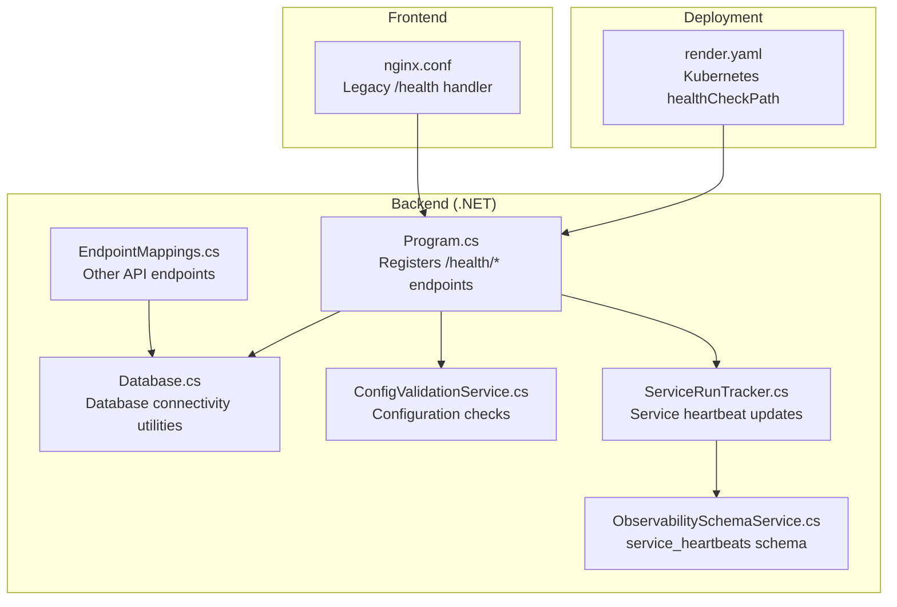
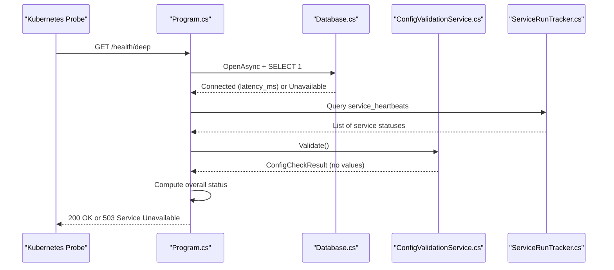
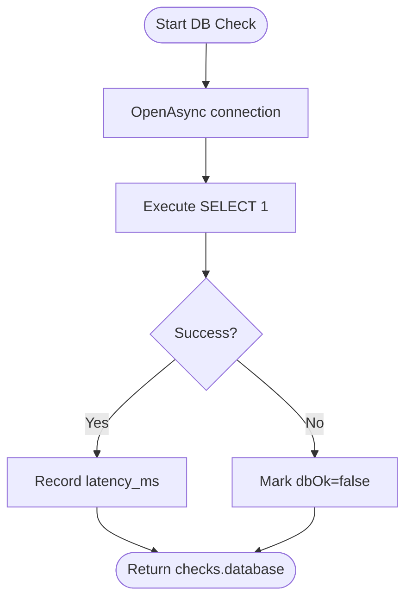
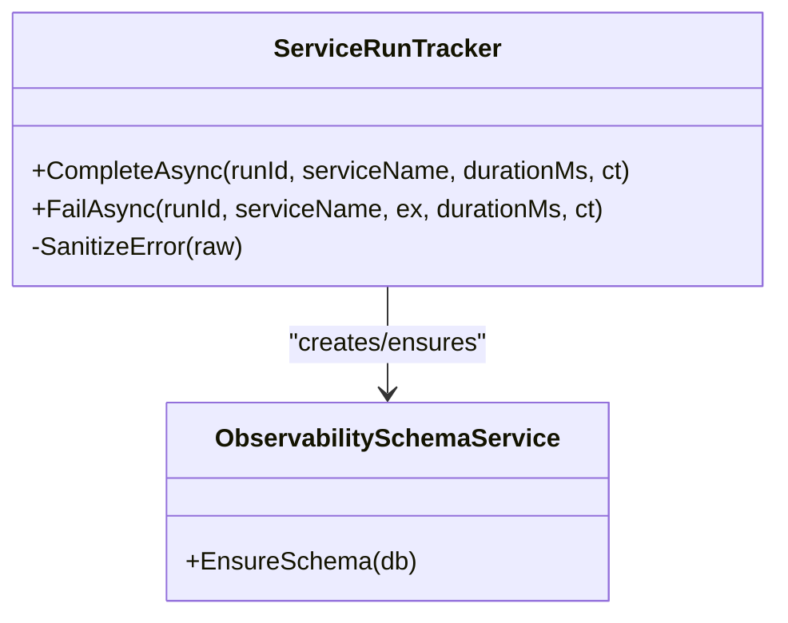
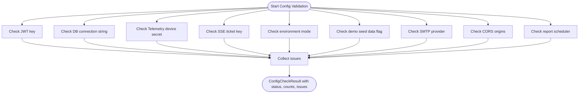
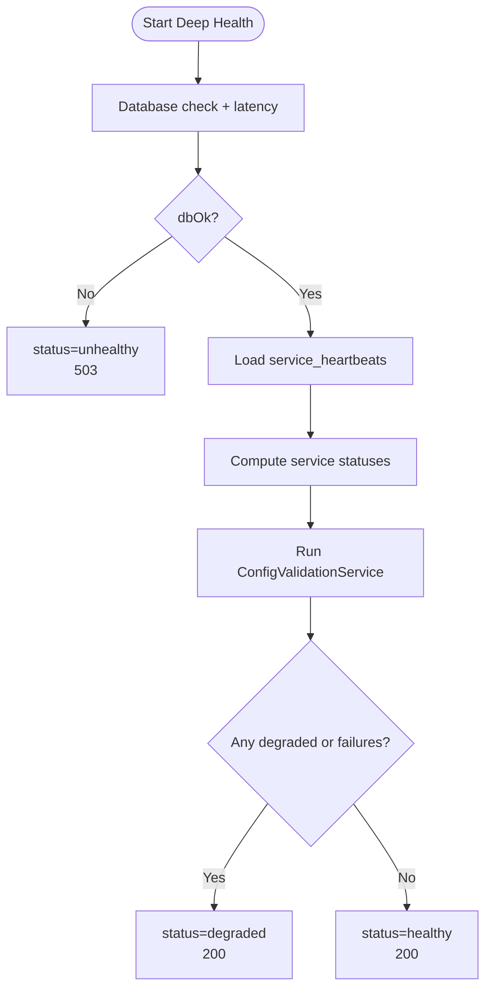
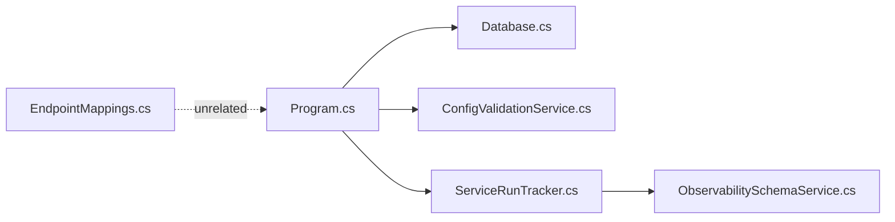

# Health Probes and Readiness Endpoints

<cite>
**Referenced Files in This Document**
- [Program.cs](file://backend-dotnet/Program.cs)
- [Database.cs](file://backend-dotnet/Data/Database.cs)
- [ConfigValidationService.cs](file://backend-dotnet/Services/ConfigValidationService.cs)
- [ServiceRunTracker.cs](file://backend-dotnet/Services/ServiceRunTracker.cs)
- [ObservabilitySchemaService.cs](file://backend-dotnet/Services/ObservabilitySchemaService.cs)
- [EndpointMappings.cs](file://backend-dotnet/Controllers/EndpointMappings.cs)
- [render.yaml](file://render.yaml)
- [nginx.conf](file://frontend/nginx.conf)
- [P9ObservabilityTests.cs](file://backend-dotnet.Tests/P9ObservabilityTests.cs)
</cite>

## Table of Contents
1. [Introduction](#introduction)
2. [Project Structure](#project-structure)
3. [Core Components](#core-components)
4. [Architecture Overview](#architecture-overview)
5. [Detailed Component Analysis](#detailed-component-analysis)
6. [Dependency Analysis](#dependency-analysis)
7. [Performance Considerations](#performance-considerations)
8. [Troubleshooting Guide](#troubleshooting-guide)
9. [Conclusion](#conclusion)
10. [Appendices](#appendices)

## Introduction
This document describes the health monitoring endpoints and readiness checks in the OpsTrax application. It covers the three health endpoint variants:
- /health/live (liveness probe)
- /health/ready (readiness probe)
- /health/deep (comprehensive health check)

It also documents the legacy endpoint aliases (/health, /ready) maintained for backward compatibility, the database connectivity check, service heartbeat monitoring from the service_heartbeats table, and configuration validation through ConfigValidationService. The health check response format, status determination logic (healthy, degraded, unhealthy), and the deep health check’s inclusion of database latency measurement and background service status are explained. Finally, Kubernetes deployment considerations and monitoring best practices are included.

## Project Structure
The health endpoints are implemented in the .NET backend service. The relevant components include:
- Endpoint registration and logic in Program.cs
- Database connectivity utilities in Data/Database.cs
- Configuration validation in Services/ConfigValidationService.cs
- Background service heartbeat tracking in Services/ServiceRunTracker.cs and schema definition in Services/ObservabilitySchemaService.cs
- Legacy frontend health endpoint in frontend/nginx.conf
- Kubernetes health check configuration in render.yaml
- Tests validating health response safety and status logic in backend-dotnet.Tests/P9ObservabilityTests.cs

**Diagram sources**
- [Program.cs:250-380](file://backend-dotnet/Program.cs#L250-L380)
- [Database.cs:1-86](file://backend-dotnet/Data/Database.cs#L1-L86)
- [ConfigValidationService.cs:1-107](file://backend-dotnet/Services/ConfigValidationService.cs#L1-L107)
- [ServiceRunTracker.cs:90-205](file://backend-dotnet/Services/ServiceRunTracker.cs#L90-L205)
- [ObservabilitySchemaService.cs:47-92](file://backend-dotnet/Services/ObservabilitySchemaService.cs#L47-L92)
- [EndpointMappings.cs:1-800](file://backend-dotnet/Controllers/EndpointMappings.cs#L1-L800)
- [nginx.conf:25-29](file://frontend/nginx.conf#L25-L29)
- [render.yaml:8-8](file://render.yaml#L8-L8)

**Section sources**
- [Program.cs:250-380](file://backend-dotnet/Program.cs#L250-L380)
- [Database.cs:1-86](file://backend-dotnet/Data/Database.cs#L1-L86)
- [ConfigValidationService.cs:1-107](file://backend-dotnet/Services/ConfigValidationService.cs#L1-L107)
- [ServiceRunTracker.cs:90-205](file://backend-dotnet/Services/ServiceRunTracker.cs#L90-L205)
- [ObservabilitySchemaService.cs:47-92](file://backend-dotnet/Services/ObservabilitySchemaService.cs#L47-L92)
- [EndpointMappings.cs:1-800](file://backend-dotnet/Controllers/EndpointMappings.cs#L1-L800)
- [nginx.conf:25-29](file://frontend/nginx.conf#L25-L29)
- [render.yaml:8-8](file://render.yaml#L8-L8)

## Core Components
- Liveness probe: /health and /health/live return a minimal JSON payload indicating the process is alive.
- Readiness probe: /ready and /health/ready validates database connectivity and returns ready/not_ready accordingly.
- Deep health: /health/deep performs a comprehensive check including database connectivity and latency, background service heartbeat statuses, and configuration validation without exposing sensitive values.
- Legacy aliases: /health and /ready remain mapped to their modern equivalents for backward compatibility.
- Database connectivity: Uses a simple SELECT 1 against PostgreSQL to verify connectivity and measure latency.
- Service heartbeat monitoring: Reads from the service_heartbeats table to compute service status (healthy, warning, degraded).
- Configuration validation: Runs a suite of checks against runtime configuration and returns aggregated results without exposing values.

**Section sources**
- [Program.cs:250-380](file://backend-dotnet/Program.cs#L250-L380)
- [Database.cs:1-86](file://backend-dotnet/Data/Database.cs#L1-L86)
- [ConfigValidationService.cs:1-107](file://backend-dotnet/Services/ConfigValidationService.cs#L1-L107)
- [ServiceRunTracker.cs:90-205](file://backend-dotnet/Services/ServiceRunTracker.cs#L90-L205)
- [ObservabilitySchemaService.cs:47-92](file://backend-dotnet/Services/ObservabilitySchemaService.cs#L47-L92)
- [P9ObservabilityTests.cs:425-522](file://backend-dotnet.Tests/P9ObservabilityTests.cs#L425-L522)

## Architecture Overview
The health endpoints are registered at application startup and executed synchronously during requests. The deep health check orchestrates:
- Database connectivity and latency measurement
- Service heartbeat retrieval and status computation
- Configuration validation
- Overall status determination and HTTP status code selection

**Diagram sources**
- [Program.cs:296-378](file://backend-dotnet/Program.cs#L296-L378)
- [Database.cs:10-15](file://backend-dotnet/Data/Database.cs#L10-L15)
- [ConfigValidationService.cs:15-96](file://backend-dotnet/Services/ConfigValidationService.cs#L15-L96)
- [ServiceRunTracker.cs:90-205](file://backend-dotnet/Services/ServiceRunTracker.cs#L90-L205)

## Detailed Component Analysis

### Health Endpoint Variants and Legacy Aliases
- /health and /health/live: Lightweight liveness probes returning process status and UTC timestamp.
- /ready and /health/ready: Readiness probes verifying database connectivity and returning ready/not_ready.
- /health/deep: Comprehensive health check including database latency, service heartbeat statuses, and configuration validation.

These endpoints are registered at application startup with explicit status codes for readiness and deep checks.

**Section sources**
- [Program.cs:250-294](file://backend-dotnet/Program.cs#L250-L294)

### Database Connectivity Check
- Opens a connection to PostgreSQL and executes a simple SELECT 1 to confirm connectivity.
- Measures elapsed time to capture database latency for deep health.
- On failure, returns 503 for readiness endpoints.

**Diagram sources**
- [Program.cs:296-318](file://backend-dotnet/Program.cs#L296-L318)
- [Database.cs:10-15](file://backend-dotnet/Data/Database.cs#L10-L15)

**Section sources**
- [Program.cs:296-318](file://backend-dotnet/Program.cs#L296-L318)
- [Database.cs:10-15](file://backend-dotnet/Data/Database.cs#L10-L15)

### Service Heartbeat Monitoring (service_heartbeats)
- Deep health reads service_heartbeats to compute per-service status:
  - healthy: no consecutive failures
  - warning: 1–2 consecutive failures
  - degraded: ≥3 consecutive failures
- Heartbeat records are updated by ServiceRunTracker on success or failure, including sanitized error messages and timestamps.
- The schema defines the service_heartbeats table with appropriate indexes.

**Diagram sources**
- [ServiceRunTracker.cs:90-205](file://backend-dotnet/Services/ServiceRunTracker.cs#L90-L205)
- [ObservabilitySchemaService.cs:47-92](file://backend-dotnet/Services/ObservabilitySchemaService.cs#L47-L92)

**Section sources**
- [Program.cs:320-348](file://backend-dotnet/Program.cs#L320-L348)
- [ServiceRunTracker.cs:90-205](file://backend-dotnet/Services/ServiceRunTracker.cs#L90-L205)
- [ObservabilitySchemaService.cs:47-92](file://backend-dotnet/Services/ObservabilitySchemaService.cs#L47-L92)

### Configuration Validation (ConfigValidationService)
- Validates runtime configuration without exposing values:
  - JWT signing key presence and length
  - Database connection string presence
  - Telemetry device HMAC secret and SSE ticket key
  - Environment mode and demo seed data flags
  - Email provider configuration
  - CORS origins
  - Report scheduler toggle
- Aggregates issues into pass/warn/fail categories and returns counts and issue metadata.

**Diagram sources**
- [ConfigValidationService.cs:15-96](file://backend-dotnet/Services/ConfigValidationService.cs#L15-L96)

**Section sources**
- [ConfigValidationService.cs:15-96](file://backend-dotnet/Services/ConfigValidationService.cs#L15-L96)

### Deep Health Check Response Format and Status Determination
- Response shape includes top-level status (healthy, degraded, unhealthy), service identifier, UTC timestamp, and a checks object containing:
  - database: status and latency_ms
  - services: array of service entries with name, status, last_heartbeat_utc, and consecutive_failures
  - config: status, warnings, failures, and issues (without values)
- Overall status logic:
  - unhealthy if database is unavailable
  - degraded if any service is degraded or configuration has failures
  - otherwise healthy
- HTTP status code:
  - 503 for unhealthy
  - 200 for healthy/degraded

**Diagram sources**
- [Program.cs:296-378](file://backend-dotnet/Program.cs#L296-L378)
- [P9ObservabilityTests.cs:473-498](file://backend-dotnet.Tests/P9ObservabilityTests.cs#L473-L498)

**Section sources**
- [Program.cs:296-378](file://backend-dotnet/Program.cs#L296-L378)
- [P9ObservabilityTests.cs:425-522](file://backend-dotnet.Tests/P9ObservabilityTests.cs#L425-L522)

### Legacy Endpoint Aliases and Backward Compatibility
- /health → /health/live
- /ready → /health/ready
These aliases ensure existing clients continue to function without modification.

**Section sources**
- [Program.cs:253-255](file://backend-dotnet/Program.cs#L253-L255)

### Frontend Health Endpoint (Legacy)
- The frontend Nginx configuration includes a /health endpoint returning a simple plaintext “ok” response. This is intended for basic container health checks and does not replace the backend health endpoints.

**Section sources**
- [nginx.conf:25-29](file://frontend/nginx.conf#L25-L29)

## Dependency Analysis
The health endpoints depend on:
- Database connectivity (Npgsql) for readiness and deep checks
- Configuration validation service for deep health
- Service heartbeat tracking for service status computation
- EndpointMappings for broader API routing (unrelated to health)

**Diagram sources**
- [Program.cs:296-378](file://backend-dotnet/Program.cs#L296-L378)
- [Database.cs:1-86](file://backend-dotnet/Data/Database.cs#L1-L86)
- [ConfigValidationService.cs:1-107](file://backend-dotnet/Services/ConfigValidationService.cs#L1-L107)
- [ServiceRunTracker.cs:90-205](file://backend-dotnet/Services/ServiceRunTracker.cs#L90-L205)
- [ObservabilitySchemaService.cs:47-92](file://backend-dotnet/Services/ObservabilitySchemaService.cs#L47-L92)
- [EndpointMappings.cs:1-800](file://backend-dotnet/Controllers/EndpointMappings.cs#L1-L800)

**Section sources**
- [Program.cs:296-378](file://backend-dotnet/Program.cs#L296-L378)
- [Database.cs:1-86](file://backend-dotnet/Data/Database.cs#L1-L86)
- [ConfigValidationService.cs:1-107](file://backend-dotnet/Services/ConfigValidationService.cs#L1-L107)
- [ServiceRunTracker.cs:90-205](file://backend-dotnet/Services/ServiceRunTracker.cs#L90-L205)
- [ObservabilitySchemaService.cs:47-92](file://backend-dotnet/Services/ObservabilitySchemaService.cs#L47-L92)
- [EndpointMappings.cs:1-800](file://backend-dotnet/Controllers/EndpointMappings.cs#L1-L800)

## Performance Considerations
- The deep health check executes multiple database queries (connectivity, service_heartbeats, config validation). Keep the frequency of deep probes reasonable to avoid unnecessary load.
- Database latency is measured and returned, enabling operators to detect slow databases early.
- Service heartbeat statuses are computed from the service_heartbeats table; ensure the table is indexed appropriately (schema includes indexes).

[No sources needed since this section provides general guidance]

## Troubleshooting Guide
Common issues and diagnostics:
- Database connectivity failures:
  - Readiness probes return 503; deep health reports database unavailable and latency -1.
  - Verify connection string and network access to PostgreSQL.
- Service degradation:
  - Deep health shows services with degraded status and consecutive_failures ≥ 3.
  - Inspect service_heartbeats entries and recent failures recorded by ServiceRunTracker.
- Configuration warnings or invalid:
  - Deep health config section lists issues without exposing values.
  - Review environment mode, CORS origins, and sensitive keys.
- Legacy endpoint differences:
  - /health and /ready alias to modern endpoints; ensure clients migrate to /health/live and /health/ready for clarity.

**Section sources**
- [Program.cs:296-378](file://backend-dotnet/Program.cs#L296-L378)
- [ServiceRunTracker.cs:111-179](file://backend-dotnet/Services/ServiceRunTracker.cs#L111-L179)
- [ConfigValidationService.cs:15-96](file://backend-dotnet/Services/ConfigValidationService.cs#L15-L96)
- [P9ObservabilityTests.cs:425-522](file://backend-dotnet.Tests/P9ObservabilityTests.cs#L425-L522)

## Conclusion
The OpsTrax health monitoring system provides lightweight liveness probes, robust readiness checks, and a comprehensive deep health endpoint. It ensures database connectivity, monitors background service health via service_heartbeats, validates configuration safely, and determines overall status with clear semantics. Legacy aliases maintain backward compatibility, while Kubernetes configuration points to the primary health endpoint for seamless container orchestration.

[No sources needed since this section summarizes without analyzing specific files]

## Appendices

### Kubernetes Deployment Considerations
- Health check path: render.yaml sets healthCheckPath to /health for the web service.
- Liveness and readiness:
  - Use /health/live for liveness probes to quickly restart unresponsive processes.
  - Use /health/ready for readiness probes to prevent traffic until the database is reachable.
  - Optionally use /health/deep for comprehensive checks in environments requiring strict health guarantees.

**Section sources**
- [render.yaml:8-8](file://render.yaml#L8-L8)

### Monitoring Best Practices
- Separate probes:
  - Liveness: fast and simple (process alive)
  - Readiness: database connectivity
  - Deep: full health including services and config
- Alert thresholds:
  - Treat degraded as warning and unhealthy as critical.
  - Track increasing consecutive_failures in service_heartbeats.
- Security:
  - Health responses exclude sensitive values; tests validate this behavior.
- Frontend health:
  - The frontend Nginx /health endpoint is informational and not a replacement for backend health checks.

**Section sources**
- [P9ObservabilityTests.cs:425-522](file://backend-dotnet.Tests/P9ObservabilityTests.cs#L425-L522)
- [nginx.conf:25-29](file://frontend/nginx.conf#L25-L29)