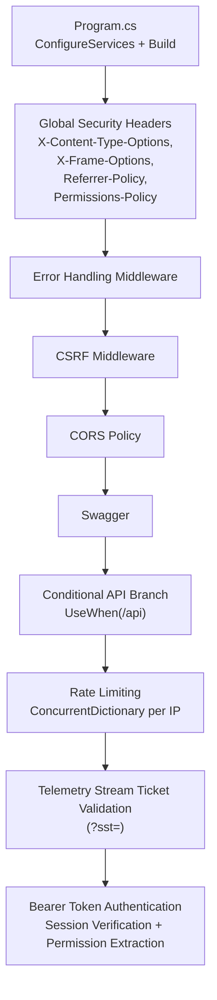
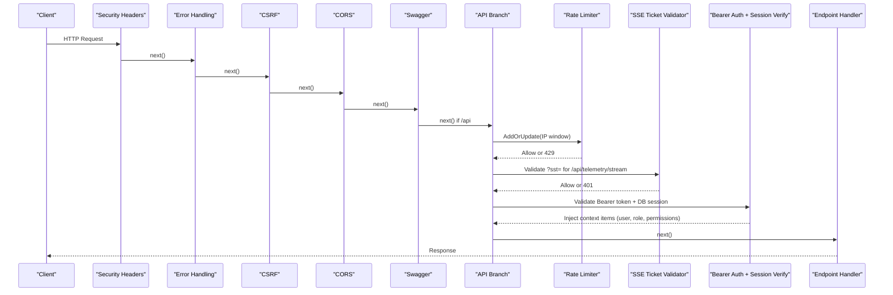
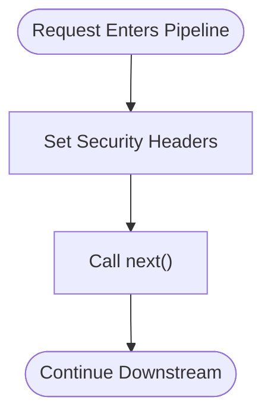
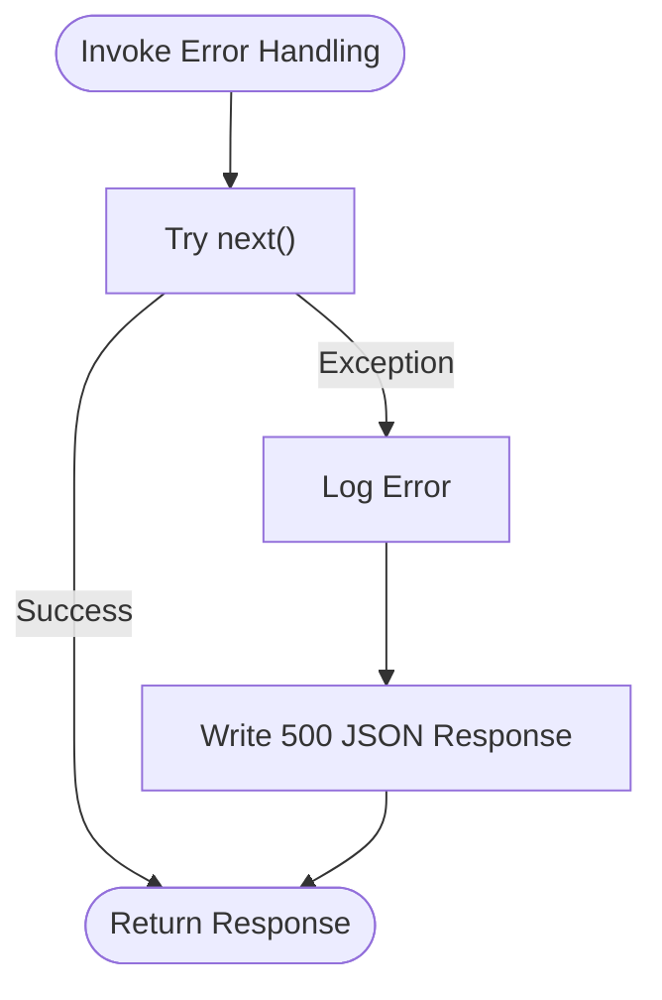
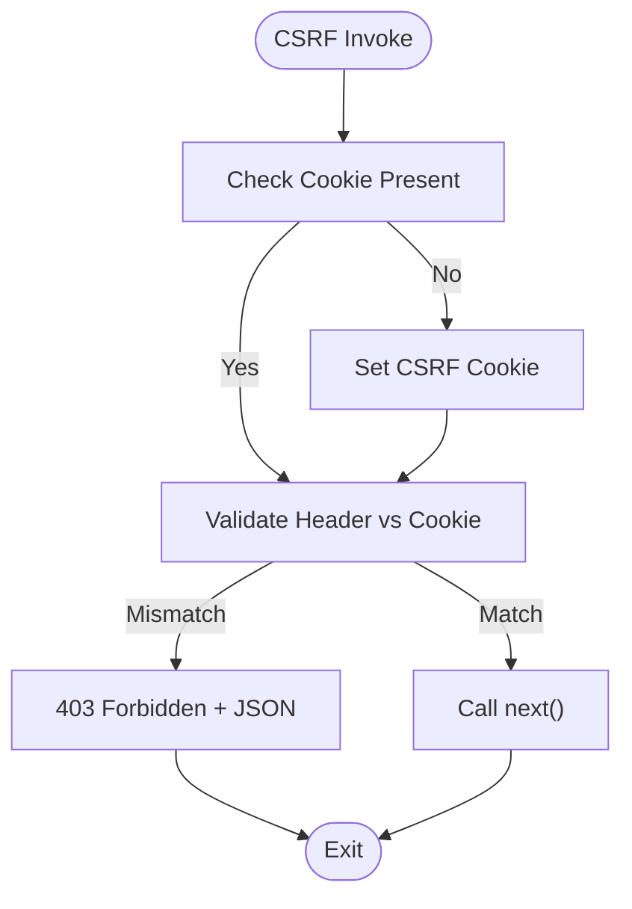
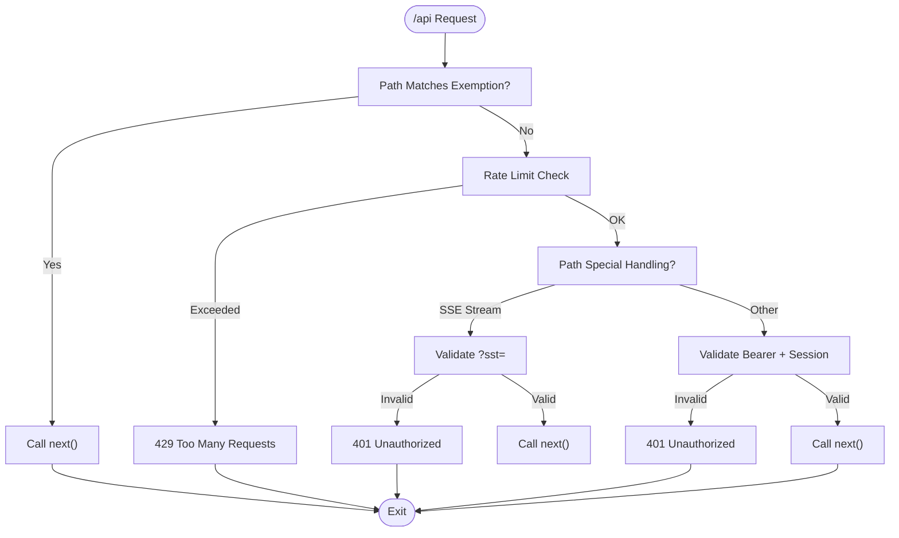
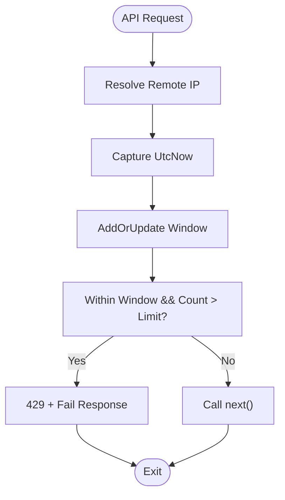
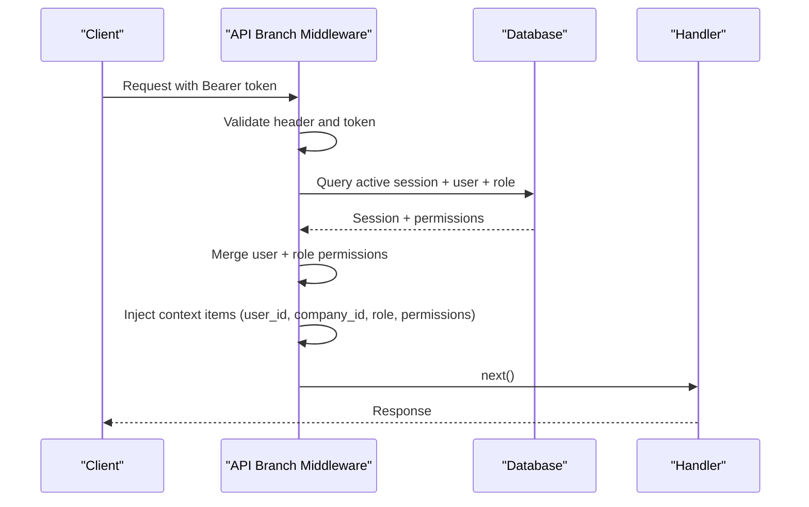
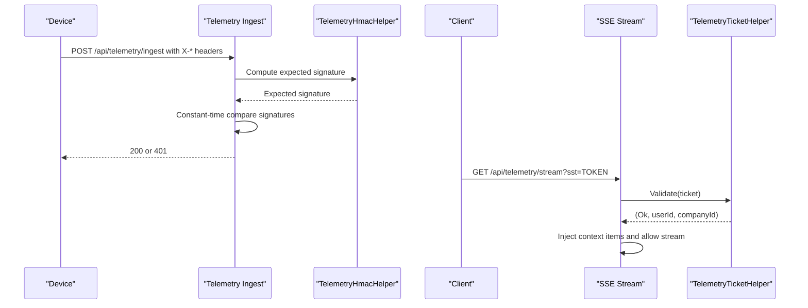
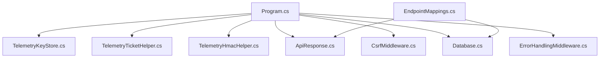

# Middleware Pipeline Configuration

<cite>
**Referenced Files in This Document**
- [Program.cs](file://backend-dotnet/Program.cs)
- [ErrorHandlingMiddleware.cs](file://backend-dotnet/Middleware/ErrorHandlingMiddleware.cs)
- [CsrfMiddleware.cs](file://backend-dotnet/Middleware/CsrfMiddleware.cs)
- [EndpointMappings.cs](file://backend-dotnet/Controllers/EndpointMappings.cs)
- [ApiResponse.cs](file://backend-dotnet/DTOs/ApiResponse.cs)
- [Database.cs](file://backend-dotnet/Data/Database.cs)
- [TelemetryHmacHelper.cs](file://backend-dotnet/TelemetryHmacHelper.cs)
- [TelemetryKeyStore.cs](file://backend-dotnet/TelemetryKeyStore.cs)
- [TelemetryTicketHelper.cs](file://backend-dotnet/TelemetryTicketHelper.cs)
</cite>

## Table of Contents
1. [Introduction](#introduction)
2. [Project Structure](#project-structure)
3. [Core Components](#core-components)
4. [Architecture Overview](#architecture-overview)
5. [Detailed Component Analysis](#detailed-component-analysis)
6. [Dependency Analysis](#dependency-analysis)
7. [Performance Considerations](#performance-considerations)
8. [Troubleshooting Guide](#troubleshooting-guide)
9. [Conclusion](#conclusion)

## Introduction
This document explains the middleware pipeline configuration and execution order for the backend-dotnet service. It focuses on:
- Security headers middleware (X-Content-Type-Options, X-Frame-Options, Referrer-Policy, Permissions-Policy)
- Error handling middleware
- CSRF protection middleware
- Authentication middleware validating Bearer tokens, verifying sessions, and extracting permissions
- Rate limiting using a concurrent dictionary keyed by IP address
- Conditional middleware execution for different API endpoints, including health probes, telemetry ingestion, and public customer tracking endpoints
- How each middleware contributes to application security and reliability

## Project Structure
The middleware pipeline is configured in the backend-dotnet Program.cs entry point. It sets up global security headers, registers error handling and CSRF middleware, applies CORS, enables Swagger, and defines a conditional branch for API endpoints with specialized authentication, rate limiting, and telemetry-specific logic.

**Diagram sources**
- [Program.cs:92-105](file://backend-dotnet/Program.cs#L92-L105)
- [Program.cs:101-102](file://backend-dotnet/Program.cs#L101-L102)
- [Program.cs](file://backend-dotnet/Program.cs#L103)
- [Program.cs](file://backend-dotnet/Program.cs#L104)
- [Program.cs:105-127](file://backend-dotnet/Program.cs#L105-L127)

**Section sources**
- [Program.cs:92-105](file://backend-dotnet/Program.cs#L92-L105)
- [Program.cs:101-102](file://backend-dotnet/Program.cs#L101-L102)
- [Program.cs](file://backend-dotnet/Program.cs#L103)
- [Program.cs](file://backend-dotnet/Program.cs#L104)
- [Program.cs:105-127](file://backend-dotnet/Program.cs#L105-L127)

## Core Components
- Global security headers middleware: Adds defense-in-depth headers for content-type sniffing prevention, frame busting, referrer control, and permissions policy.
- Error handling middleware: Centralized exception handling with structured JSON responses.
- CSRF middleware: Generates and validates CSRF tokens for state-changing requests, with exemptions for selected endpoints.
- Conditional API branch: Applies rate limiting, telemetry-specific logic, and Bearer token authentication for protected endpoints.
- Rate limiter: Tracks per-IP counts in a concurrent dictionary with fixed time windows.
- Authentication: Validates Bearer tokens against active sessions, joins user and role permissions, and injects identity into context items.
- Telemetry helpers: HMAC signature verification for device ingestion and short-lived stream tickets for SSE.

**Section sources**
- [Program.cs:92-99](file://backend-dotnet/Program.cs#L92-L99)
- [ErrorHandlingMiddleware.cs:6-21](file://backend-dotnet/Middleware/ErrorHandlingMiddleware.cs#L6-L21)
- [CsrfMiddleware.cs:6-61](file://backend-dotnet/Middleware/CsrfMiddleware.cs#L6-L61)
- [Program.cs:105-245](file://backend-dotnet/Program.cs#L105-L245)
- [Program.cs:129-143](file://backend-dotnet/Program.cs#L129-L143)
- [Program.cs:174-243](file://backend-dotnet/Program.cs#L174-L243)
- [TelemetryHmacHelper.cs:5-32](file://backend-dotnet/TelemetryHmacHelper.cs#L5-L32)
- [TelemetryTicketHelper.cs:3-50](file://backend-dotnet/TelemetryTicketHelper.cs#L3-L50)

## Architecture Overview
The middleware pipeline is ordered to apply broad protections first, then narrow specialized logic for API traffic. The conditional branch ensures that sensitive endpoints enforce authentication and rate limits, while allowing specific public and telemetry endpoints to bypass session requirements.

**Diagram sources**
- [Program.cs:92-105](file://backend-dotnet/Program.cs#L92-L105)
- [Program.cs:101-102](file://backend-dotnet/Program.cs#L101-L102)
- [Program.cs](file://backend-dotnet/Program.cs#L103)
- [Program.cs](file://backend-dotnet/Program.cs#L104)
- [Program.cs:105-245](file://backend-dotnet/Program.cs#L105-L245)

## Detailed Component Analysis

### Security Headers Middleware
- Purpose: Apply hardening headers globally to mitigate common browser-based attacks.
- Headers applied:
  - X-Content-Type-Options: nosniff
  - X-Frame-Options: DENY
  - Referrer-Policy: strict-origin-when-cross-origin
  - Permissions-Policy: camera=(), microphone=(), geolocation=()

**Diagram sources**
- [Program.cs:92-99](file://backend-dotnet/Program.cs#L92-L99)

**Section sources**
- [Program.cs:92-99](file://backend-dotnet/Program.cs#L92-L99)

### Error Handling Middleware
- Purpose: Wrap downstream pipeline in try/catch to prevent unhandled exceptions from leaking stack traces.
- Behavior: Logs exception, responds with 500 and a structured failure payload.

**Diagram sources**
- [ErrorHandlingMiddleware.cs:8-20](file://backend-dotnet/Middleware/ErrorHandlingMiddleware.cs#L8-L20)

**Section sources**
- [ErrorHandlingMiddleware.cs:6-21](file://backend-dotnet/Middleware/ErrorHandlingMiddleware.cs#L6-L21)
- [ApiResponse.cs:3-7](file://backend-dotnet/DTOs/ApiResponse.cs#L3-L7)

### CSRF Protection Middleware
- Purpose: Protect state-changing requests from CSRF by generating a CSRF cookie and validating a matching header token.
- Behavior:
  - Generates a CSRF cookie if missing.
  - Validates header token against cookie for non-safe methods.
  - Exempts login and certain endpoints.
  - Exposes CSRF token via response header.

**Diagram sources**
- [CsrfMiddleware.cs:19-54](file://backend-dotnet/Middleware/CsrfMiddleware.cs#L19-L54)

**Section sources**
- [CsrfMiddleware.cs:6-61](file://backend-dotnet/Middleware/CsrfMiddleware.cs#L6-L61)

### Conditional Middleware Execution for API Endpoints
- Scope: Applies only to paths under /api.
- Exemptions:
  - Authentication endpoints: /api/auth/login
  - Health endpoints: /api/health, /api/ready, and /health*
  - Telemetry ingestion: /api/telemetry/ingest (device-authenticated)
  - Public customer ETA tracking: GET /api/customer-eta/track/*
  - Public customer visibility tracking: GET /api/customer-visibility/tracking/*

**Diagram sources**
- [Program.cs:105-127](file://backend-dotnet/Program.cs#L105-L127)
- [Program.cs:129-143](file://backend-dotnet/Program.cs#L129-L143)
- [Program.cs:148-172](file://backend-dotnet/Program.cs#L148-L172)
- [Program.cs:174-243](file://backend-dotnet/Program.cs#L174-L243)

**Section sources**
- [Program.cs:105-127](file://backend-dotnet/Program.cs#L105-L127)
- [Program.cs:129-143](file://backend-dotnet/Program.cs#L129-L143)
- [Program.cs:148-172](file://backend-dotnet/Program.cs#L148-L172)
- [Program.cs:174-243](file://backend-dotnet/Program.cs#L174-L243)

### Rate Limiting Implementation
- Mechanism: ConcurrentDictionary keyed by IP address storing a sliding window tuple (WindowStart, Count).
- Window: Fixed-size minute-long window.
- Threshold: Maximum 240 requests per window per IP.
- Response: 429 with structured failure payload when exceeded.

**Diagram sources**
- [Program.cs:66-68](file://backend-dotnet/Program.cs#L66-L68)
- [Program.cs:129-143](file://backend-dotnet/Program.cs#L129-L143)

**Section sources**
- [Program.cs:66-68](file://backend-dotnet/Program.cs#L66-L68)
- [Program.cs:129-143](file://backend-dotnet/Program.cs#L129-L143)
- [ApiResponse.cs:3-7](file://backend-dotnet/DTOs/ApiResponse.cs#L3-L7)

### Authentication Middleware: Bearer Token, Session Verification, Permission Extraction
- Validation steps:
  - Ensure Authorization header exists and starts with "Bearer ".
  - Extract token and reject empty tokens.
  - Query active session with user and role details.
  - Merge user and role permissions into a set.
  - Super Admin role conditionally grants wildcard permissions.
  - Inject identity into HttpContext.Items for downstream handlers.

**Diagram sources**
- [Program.cs:174-243](file://backend-dotnet/Program.cs#L174-L243)
- [Database.cs:36-37](file://backend-dotnet/Data/Database.cs#L36-L37)
- [EndpointMappings.cs:14-17](file://backend-dotnet/Controllers/EndpointMappings.cs#L14-L17)

**Section sources**
- [Program.cs:174-243](file://backend-dotnet/Program.cs#L174-L243)
- [Database.cs:36-37](file://backend-dotnet/Data/Database.cs#L36-L37)
- [EndpointMappings.cs:14-17](file://backend-dotnet/Controllers/EndpointMappings.cs#L14-L17)

### Telemetry Ingestion and SSE Stream Ticket Handling
- Device ingestion:
  - Uses HMAC-SHA256 signature verification with a canonical string built from method, path, timestamp, nonce, and body hash.
  - Performs constant-time signature comparison.
- SSE stream:
  - Enforces exclusive use of a short-lived stream ticket (?sst=) instead of bearer tokens in query strings.
  - Validates ticket signature, decodes payload, and injects identity into context items.

**Diagram sources**
- [Program.cs:148-172](file://backend-dotnet/Program.cs#L148-L172)
- [TelemetryHmacHelper.cs:8-16](file://backend-dotnet/TelemetryHmacHelper.cs#L8-L16)
- [TelemetryTicketHelper.cs:15-36](file://backend-dotnet/TelemetryTicketHelper.cs#L15-L36)
- [TelemetryKeyStore.cs:5-11](file://backend-dotnet/TelemetryKeyStore.cs#L5-L11)

**Section sources**
- [Program.cs:148-172](file://backend-dotnet/Program.cs#L148-L172)
- [TelemetryHmacHelper.cs:5-32](file://backend-dotnet/TelemetryHmacHelper.cs#L5-L32)
- [TelemetryTicketHelper.cs:3-50](file://backend-dotnet/TelemetryTicketHelper.cs#L3-L50)
- [TelemetryKeyStore.cs:1-12](file://backend-dotnet/TelemetryKeyStore.cs#L1-L12)

### Health Probes and Public Endpoints
- Health endpoints (/health, /health/live, /health/ready, /health/deep) and legacy aliases are mapped separately and intentionally excluded from session requirements.
- Public customer tracking endpoints are GET-only and token-scoped, avoiding session requirements.

**Section sources**
- [Program.cs:249-294](file://backend-dotnet/Program.cs#L249-L294)
- [Program.cs:112-123](file://backend-dotnet/Program.cs#L112-L123)

## Dependency Analysis
- Program.cs orchestrates middleware registration and conditional branching.
- Authentication depends on Database for session validation and permission aggregation.
- Telemetry helpers are referenced by both Program.cs and endpoint mappings for ingestion and streaming.
- Error handling and CSRF middleware are standalone and depend only on ASP.NET Core abstractions.

**Diagram sources**
- [Program.cs:5-8](file://backend-dotnet/Program.cs#L5-L8)
- [ErrorHandlingMiddleware.cs:1-2](file://backend-dotnet/Middleware/ErrorHandlingMiddleware.cs#L1-L2)
- [CsrfMiddleware.cs:1-2](file://backend-dotnet/Middleware/CsrfMiddleware.cs#L1-L2)
- [Database.cs:1-5](file://backend-dotnet/Data/Database.cs#L1-L5)
- [ApiResponse.cs:1-7](file://backend-dotnet/DTOs/ApiResponse.cs#L1-L7)
- [TelemetryHmacHelper.cs:1-32](file://backend-dotnet/TelemetryHmacHelper.cs#L1-L32)
- [TelemetryTicketHelper.cs:1-50](file://backend-dotnet/TelemetryTicketHelper.cs#L1-L50)
- [TelemetryKeyStore.cs:1-11](file://backend-dotnet/TelemetryKeyStore.cs#L1-L11)
- [EndpointMappings.cs:1-10](file://backend-dotnet/Controllers/EndpointMappings.cs#L1-L10)

**Section sources**
- [Program.cs:5-8](file://backend-dotnet/Program.cs#L5-L8)
- [EndpointMappings.cs:1-10](file://backend-dotnet/Controllers/EndpointMappings.cs#L1-L10)

## Performance Considerations
- Rate limiting uses a concurrent dictionary with O(1) AddOrUpdate and minimal lock contention; however, it scales with number of distinct IPs. Consider external caching (e.g., Redis) for distributed deployments.
- Authentication queries join user and role tables; ensure appropriate indexing on session_token, expires_at, and user status.
- Telemetry ingestion performs HMAC comparisons and SHA-256 hashing; keep body sizes reasonable and avoid unnecessary logging of raw bodies.

## Troubleshooting Guide
- 401 Unauthorized during authentication:
  - Verify Authorization header format ("Bearer <token>") and token validity.
  - Confirm session is active and user status is Active.
- 403 Forbidden from CSRF:
  - Ensure CSRF cookie is present and matches the X-CSRF-Token header for state-changing requests.
  - Confirm endpoint is not incorrectly exempted.
- 429 Too Many Requests:
  - Check rate window boundaries and thresholds; consider increasing limits or implementing tiered quotas.
- 401 Unauthorized for SSE:
  - Ensure a valid short-lived stream ticket is provided; verify ticket signature and expiration.
- 500 Internal Server Error:
  - Inspect logs from the error handling middleware; confirm structured failure payload for diagnostics.

**Section sources**
- [Program.cs:174-207](file://backend-dotnet/Program.cs#L174-L207)
- [Program.cs:148-172](file://backend-dotnet/Program.cs#L148-L172)
- [Program.cs:138-143](file://backend-dotnet/Program.cs#L138-L143)
- [ErrorHandlingMiddleware.cs:14-19](file://backend-dotnet/Middleware/ErrorHandlingMiddleware.cs#L14-L19)
- [CsrfMiddleware.cs:43-48](file://backend-dotnet/Middleware/CsrfMiddleware.cs#L43-L48)

## Conclusion
The middleware pipeline establishes strong baseline security with global headers, centralized error handling, and CSRF protection. The conditional API branch enforces robust authentication and rate limiting, while special-casing health probes, telemetry ingestion, and public tracking endpoints. Proper ordering ensures that security and reliability controls are applied consistently across all request paths.