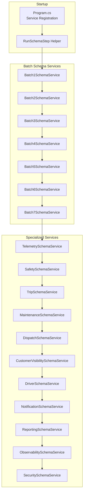
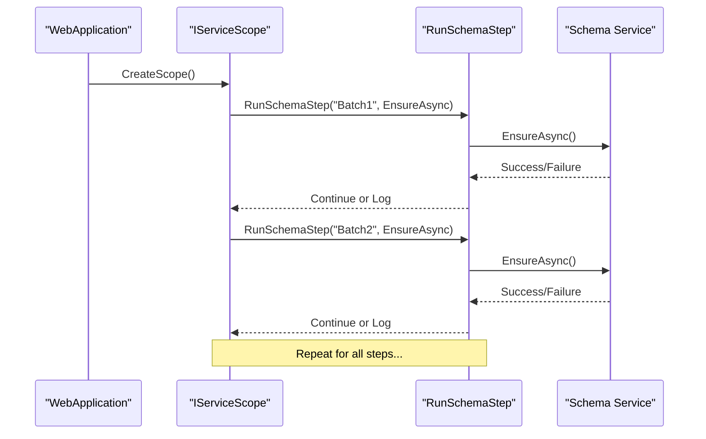
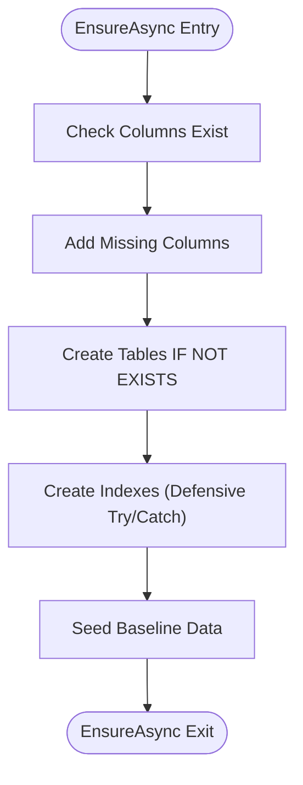
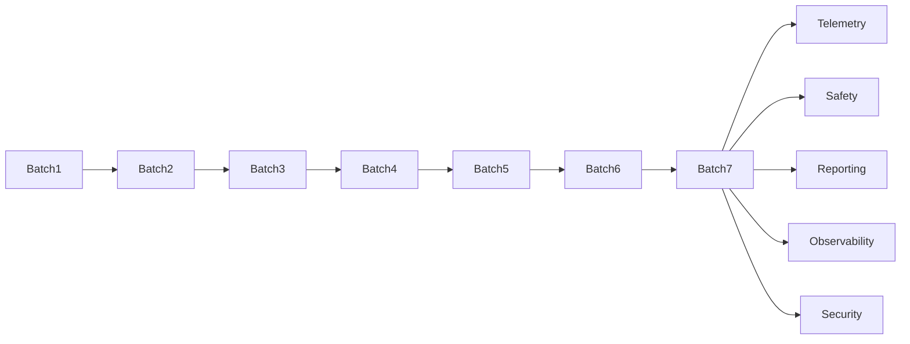

# Schema Bootstrap Process

<cite>
**Referenced Files in This Document**
- [Program.cs](file://backend-dotnet/Program.cs)
- [Batch1SchemaService.cs](file://backend-dotnet/Services/Batch1SchemaService.cs)
- [Batch2SchemaService.cs](file://backend-dotnet/Services/Batch2SchemaService.cs)
- [Batch3SchemaService.cs](file://backend-dotnet/Services/Batch3SchemaService.cs)
- [Batch4SchemaService.cs](file://backend-dotnet/Services/Batch4SchemaService.cs)
- [Batch5SchemaService.cs](file://backend-dotnet/Services/Batch5SchemaService.cs)
- [Batch6SchemaService.cs](file://backend-dotnet/Services/Batch6SchemaService.cs)
- [Batch7SchemaService.cs](file://backend-dotnet/Services/Batch7SchemaService.cs)
- [TelemetrySchemaService.cs](file://backend-dotnet/Services/TelemetrySchemaService.cs)
- [SafetySchemaService.cs](file://backend-dotnet/Services/SafetySchemaService.cs)
</cite>

## Table of Contents
1. [Introduction](#introduction)
2. [Project Structure](#project-structure)
3. [Core Components](#core-components)
4. [Architecture Overview](#architecture-overview)
5. [Detailed Component Analysis](#detailed-component-analysis)
6. [Dependency Analysis](#dependency-analysis)
7. [Performance Considerations](#performance-considerations)
8. [Troubleshooting Guide](#troubleshooting-guide)
9. [Conclusion](#conclusion)

## Introduction
This document explains the schema bootstrap process that ensures database schema consistency during application startup. It covers the sequential execution of seven batch schema services (Batch1 through Batch7), followed by specialized services for Telemetry, Safety, Trips, Maintenance, Dispatch, Customer Visibility, Driver, Notification, Reporting, Observability, and Security. It also details the RunSchemaStep helper method, error handling, graceful degradation, schema evolution strategy, migration ordering dependencies, and integration with the overall application startup sequence.

## Project Structure
The schema bootstrap is orchestrated in the backend-dotnet application entry point and executed through dedicated services grouped by functional domains. The Program.cs file registers services and executes schema steps in a strict order, ensuring dependencies are satisfied before later steps run.

**Diagram sources**
- [Program.cs:70-90](file://backend-dotnet/Program.cs#L70-L90)
- [Batch1SchemaService.cs:7](file://backend-dotnet/Services/Batch1SchemaService.cs#L7)
- [Batch2SchemaService.cs:7](file://backend-dotnet/Services/Batch2SchemaService.cs#L7)
- [Batch3SchemaService.cs:7](file://backend-dotnet/Services/Batch3SchemaService.cs#L7)
- [Batch4SchemaService.cs:7](file://backend-dotnet/Services/Batch4SchemaService.cs#L7)
- [Batch5SchemaService.cs:7](file://backend-dotnet/Services/Batch5SchemaService.cs#L7)
- [Batch6SchemaService.cs:7](file://backend-dotnet/Services/Batch6SchemaService.cs#L7)
- [Batch7SchemaService.cs:7](file://backend-dotnet/Services/Batch7SchemaService.cs#L7)
- [TelemetrySchemaService.cs:7](file://backend-dotnet/Services/TelemetrySchemaService.cs#L7)
- [SafetySchemaService.cs:7](file://backend-dotnet/Services/SafetySchemaService.cs#L7)

**Section sources**
- [Program.cs:10-45](file://backend-dotnet/Program.cs#L10-L45)
- [Program.cs:70-90](file://backend-dotnet/Program.cs#L70-L90)

## Core Components
- Program.cs orchestrates schema bootstrap by registering services and invoking RunSchemaStep for each step in sequence.
- Each schema service encapsulates EnsureAsync to create/alter tables, add columns, create indexes, and seed data.
- RunSchemaStep wraps each step with try/catch to log failures and continue startup.

Key responsibilities:
- Batch services: Add columns, create tables, add indexes, seed historical data.
- Specialized services: Extend schema for domain-specific features (e.g., telemetry ingestion, safety scoring, reporting).
- Error handling: Failures are logged and startup continues to maximize availability.

**Section sources**
- [Program.cs:70-90](file://backend-dotnet/Program.cs#L70-L90)
- [Program.cs:433-443](file://backend-dotnet/Program.cs#L433-L443)
- [Batch1SchemaService.cs:7](file://backend-dotnet/Services/Batch1SchemaService.cs#L7)
- [Batch2SchemaService.cs:7](file://backend-dotnet/Services/Batch2SchemaService.cs#L7)
- [Batch3SchemaService.cs:7](file://backend-dotnet/Services/Batch3SchemaService.cs#L7)
- [Batch4SchemaService.cs:7](file://backend-dotnet/Services/Batch4SchemaService.cs#L7)
- [Batch5SchemaService.cs:7](file://backend-dotnet/Services/Batch5SchemaService.cs#L7)
- [Batch6SchemaService.cs:7](file://backend-dotnet/Services/Batch6SchemaService.cs#L7)
- [Batch7SchemaService.cs:7](file://backend-dotnet/Services/Batch7SchemaService.cs#L7)
- [TelemetrySchemaService.cs:7](file://backend-dotnet/Services/TelemetrySchemaService.cs#L7)
- [SafetySchemaService.cs:7](file://backend-dotnet/Services/SafetySchemaService.cs#L7)

## Architecture Overview
The bootstrap process follows a deterministic pipeline:
1. Register all schema services as singletons.
2. Execute RunSchemaStep for each step in order.
3. Each step runs EnsureAsync which performs:
   - Column existence checks and additions
   - Table creation with IF NOT EXISTS
   - Index creation with defensive try/catch
   - Seeding with ON CONFLICT DO NOTHING

**Diagram sources**
- [Program.cs:70-90](file://backend-dotnet/Program.cs#L70-L90)
- [Program.cs:433-443](file://backend-dotnet/Program.cs#L433-L443)

## Detailed Component Analysis

### Batch1 Schema Service
Purpose: Establish foundational entities and initial columns for vehicles, drivers, customers, assets, and location events. Creates supporting tables and seeds baseline data.

Processing logic:
- Ensure columns exist; add if missing.
- Create tables with IF NOT EXISTS.
- Create indexes.
- Seed data with ON CONFLICT DO NOTHING.

**Diagram sources**
- [Batch1SchemaService.cs:7-23](file://backend-dotnet/Services/Batch1SchemaService.cs#L7-L23)

**Section sources**
- [Batch1SchemaService.cs:7-272](file://backend-dotnet/Services/Batch1SchemaService.cs#L7-L272)

### Batch2 Schema Service
Purpose: Adds job, route, and dispatch-related columns and tables, along with customer ETA and feedback mechanisms.

Processing logic mirrors Batch1 with additional focus on dispatch and ETA workflows.

**Section sources**
- [Batch2SchemaService.cs:7-277](file://backend-dotnet/Services/Batch2SchemaService.cs#L7-L277)

### Batch3 Schema Service
Purpose: Introduces maintenance, work orders, DVIR, and document management schemas with supporting indexes.

Processing logic:
- Add maintenance-related columns.
- Create maintenance, work order, DVIR, and document tables.
- Create indexes with defensive try/catch.
- Seed maintenance and compliance data.

**Section sources**
- [Batch3SchemaService.cs:7-390](file://backend-dotnet/Services/Batch3SchemaService.cs#L7-L390)

### Batch4 Schema Service
Purpose: Safety and dashcam event schemas, including coaching tasks, incidents, and evidence packages.

Processing logic:
- Add safety and dashcam columns.
- Create safety, dashcam, coaching, incident, and evidence tables.
- Create indexes with defensive try/catch.
- Seed safety events, dashcam events, and related artifacts.

**Section sources**
- [Batch4SchemaService.cs:7-312](file://backend-dotnet/Services/Batch4SchemaService.cs#L7-L312)

### Batch5 Schema Service
Purpose: Fuel transactions, idling events, expense categories, contracts, carriers, and cost margin schemas.

Processing logic:
- Add fuel and expense columns.
- Create fuel, idling, expense, contract, carrier, and cost margin tables.
- Create indexes with defensive try/catch.
- Seed financial and compliance data.

**Section sources**
- [Batch5SchemaService.cs:7-598](file://backend-dotnet/Services/Batch5SchemaService.cs#L7-L598)

### Batch6 Schema Service
Purpose: Internationalization, locale settings, compliance profiles, HOS logs, ELD devices, and compliance violations.

Processing logic:
- Add compliance and localization columns.
- Create countries, languages, locale settings, compliance profiles, HOS logs, ELD devices, and compliance tables.
- Create indexes with defensive try/catch.
- Seed country rules, locale defaults, compliance profiles, and HOS data.

**Section sources**
- [Batch6SchemaService.cs:7-468](file://backend-dotnet/Services/Batch6SchemaService.cs#L7-L468)

### Batch7 Schema Service
Purpose: Reporting catalog, scheduled reports, KPI metrics, SLA records, executive snapshots, and audit exports.

Processing logic:
- Add audit_log and SLA columns.
- Create report catalog, report runs, scheduled reports, report exports, KPI metrics, SLA records, executive snapshots, and audit export tables.
- Create indexes with defensive try/catch.
- Seed comprehensive reporting and analytics data.

**Section sources**
- [Batch7SchemaService.cs:7-588](file://backend-dotnet/Services/Batch7SchemaService.cs#L7-L588)

### Telemetry Schema Service
Purpose: Telemetry ingestion, alerting, nonce replay protection, and device provisioning.

Processing logic:
- Add telemetry columns to existing tables.
- Create latest_vehicle_positions, telemetry_alerts, telemetry_nonces, and telemetry_rules.
- Create indexes with defensive try/catch.
- Seed device keys, HMAC secrets, and default telemetry rules.

**Section sources**
- [TelemetrySchemaService.cs:7-145](file://backend-dotnet/Services/TelemetrySchemaService.cs#L7-L145)

### Safety Schema Service
Purpose: Safety event lifecycle, coaching tasks, and driver safety scores.

Processing logic:
- Create safety_events, safety_coaching_tasks, and driver_safety_scores.
- Create indexes with defensive try/catch.
- Seed safety scoring rules into telemetry_rules.

**Section sources**
- [SafetySchemaService.cs:7-131](file://backend-dotnet/Services/SafetySchemaService.cs#L7-L131)

## Dependency Analysis
- Sequential ordering: Batch1 → Batch2 → Batch3 → Batch4 → Batch5 → Batch6 → Batch7 → Specialized services.
- Cross-service dependencies:
  - Batch3 depends on Batch1/2 for entity relationships (maintenance_items referencing vehicles/assets).
  - Batch4 depends on Batch1/2/3 for safety and location context.
  - Batch5 depends on Batch1/2/3 for financial and compliance entities.
  - Batch6 depends on Batch1/2/3/4/5 for internationalization and compliance.
  - Batch7 depends on all prior batches for reporting and analytics.
  - Telemetry and Safety services depend on Batch1/2/3/4/5/6 for enriched data.
- Defensive indexing: Index creation wrapped in try/catch to handle partial failures gracefully.

**Diagram sources**
- [Program.cs:72-89](file://backend-dotnet/Program.cs#L72-L89)

**Section sources**
- [Program.cs:72-89](file://backend-dotnet/Program.cs#L72-L89)
- [Batch3SchemaService.cs:19-22](file://backend-dotnet/Services/Batch3SchemaService.cs#L19-L22)
- [Batch4SchemaService.cs:11-12](file://backend-dotnet/Services/Batch4SchemaService.cs#L11-L12)
- [Batch5SchemaService.cs:11-12](file://backend-dotnet/Services/Batch5SchemaService.cs#L11-L12)
- [Batch6SchemaService.cs:11-12](file://backend-dotnet/Services/Batch6SchemaService.cs#L11-L12)
- [Batch7SchemaService.cs:11-12](file://backend-dotnet/Services/Batch7SchemaService.cs#L11-L12)

## Performance Considerations
- Index creation is wrapped in try/catch to avoid blocking startup on partial failures.
- Seeding uses ON CONFLICT DO NOTHING to prevent duplicate writes on restarts.
- Batch services minimize repeated DDL operations using IF NOT EXISTS and existence checks.
- Telemetry nonces table supports replay prevention with pruning by background service.

## Troubleshooting Guide
Common issues and resolutions:
- Migration failures:
  - Symptoms: Startup continues but specific step logs a warning.
  - Resolution: Inspect the logged exception context for the failing step. Fix schema inconsistencies or permissions and rerun.
- Partial index creation:
  - Symptoms: Some indexes missing after startup.
  - Resolution: Re-run the affected step; the try/catch allows other steps to succeed.
- Duplicate seeding:
  - Symptoms: No-op inserts due to existing records.
  - Resolution: Expected behavior; ON CONFLICT DO NOTHING prevents errors.
- Graceful degradation:
  - Behavior: If a step fails, subsequent steps continue to ensure service availability.
- Rollback procedures:
  - Recommended approach: Use database version control (e.g., migrations) to track applied changes. For manual rollbacks, revert DDL statements in reverse order of application, then re-run successful steps to reseed data.

Operational references:
- RunSchemaStep helper method and logging behavior.
- Index creation try/catch blocks in specialized services.

**Section sources**
- [Program.cs:433-443](file://backend-dotnet/Program.cs#L433-L443)
- [Batch3SchemaService.cs:21](file://backend-dotnet/Services/Batch3SchemaService.cs#L21)
- [Batch4SchemaService.cs:11](file://backend-dotnet/Services/Batch4SchemaService.cs#L11)
- [Batch5SchemaService.cs:11-12](file://backend-dotnet/Services/Batch5SchemaService.cs#L11-L12)
- [Batch6SchemaService.cs:11-12](file://backend-dotnet/Services/Batch6SchemaService.cs#L11-L12)
- [Batch7SchemaService.cs:11-12](file://backend-dotnet/Services/Batch7SchemaService.cs#L11-L12)

## Conclusion
The schema bootstrap process ensures robust, ordered schema evolution across functional domains while maintaining application availability through defensive error handling. By following the documented sequence and leveraging the RunSchemaStep helper, teams can reliably evolve the database schema alongside application features, with clear troubleshooting pathways and graceful degradation when individual steps encounter issues.