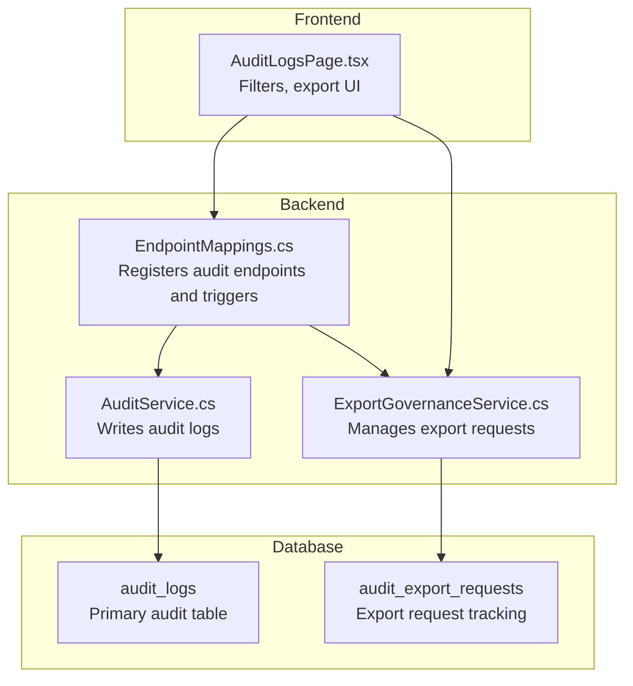
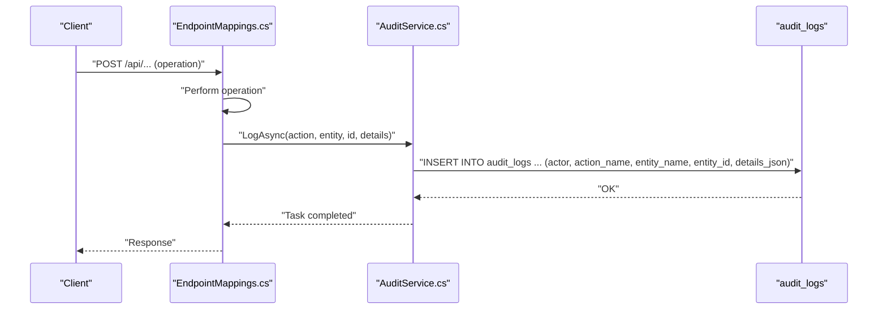
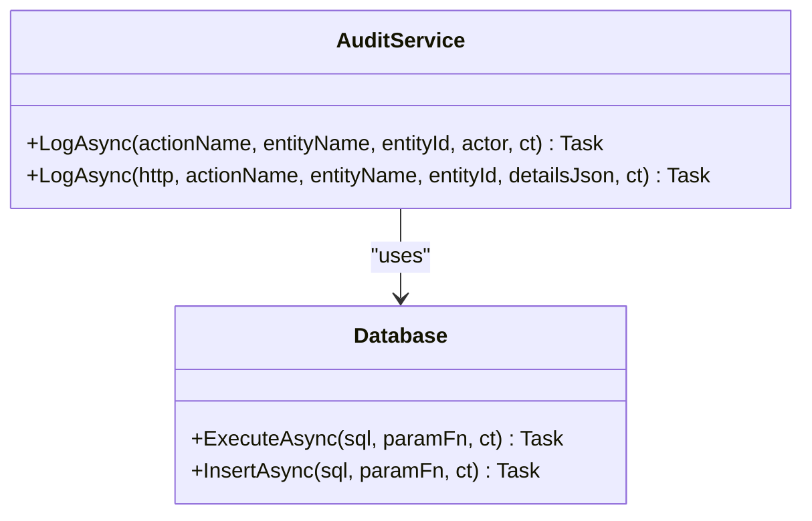
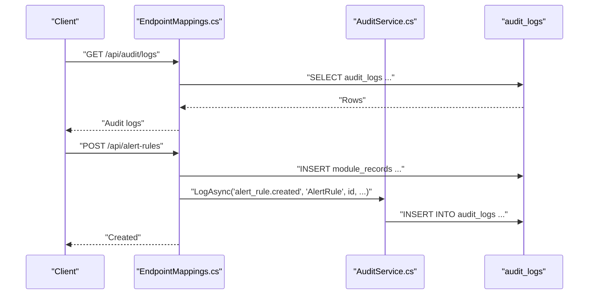
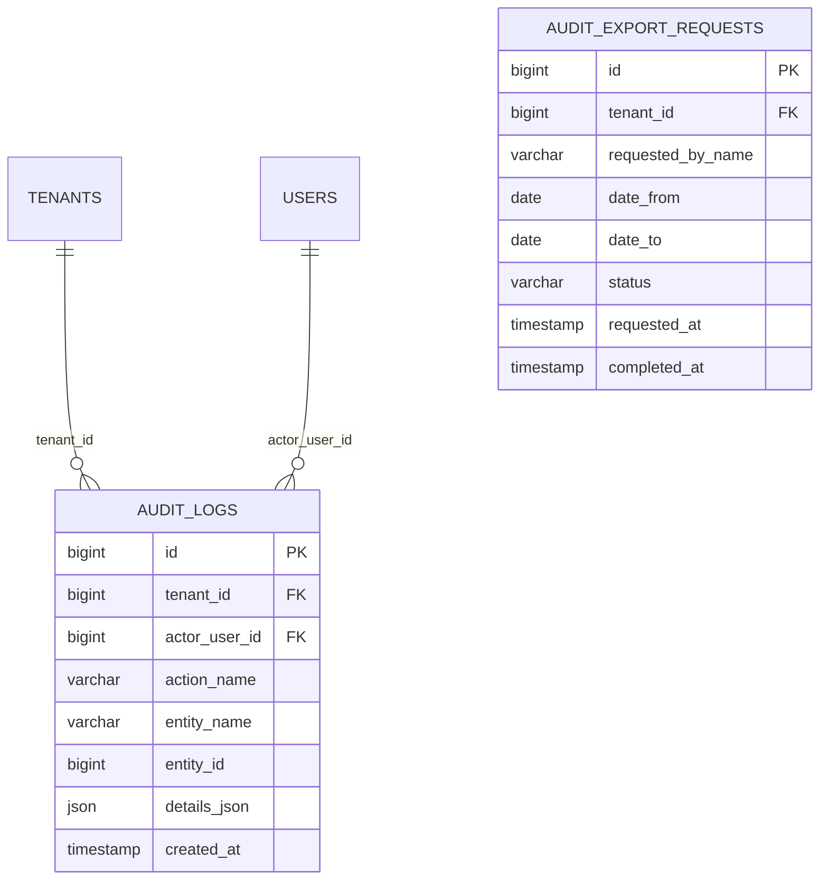
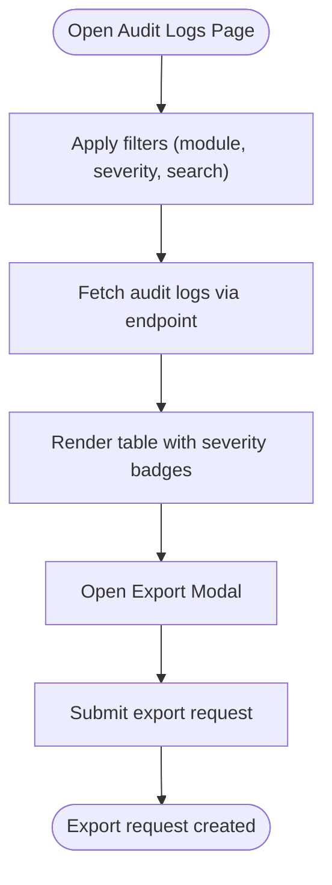
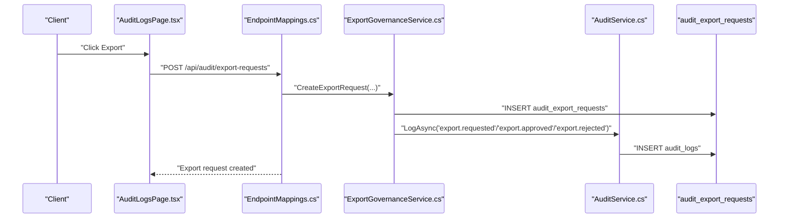
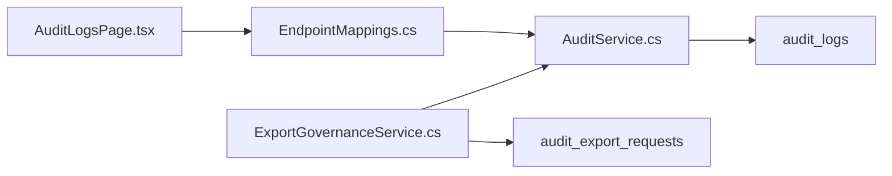

# Audit Services

<cite>
**Referenced Files in This Document**
- [AuditService.cs](file://backend-dotnet/Services/AuditService.cs)
- [EndpointMappings.cs](file://backend-dotnet/Controllers/EndpointMappings.cs)
- [001_schema.sql](file://db/init/001_schema.sql)
- [AuditLogsPage.tsx](file://frontend/src/pages/AuditLogsPage.tsx)
- [Batch7SchemaService.cs](file://backend-dotnet/Services/Batch7SchemaService.cs)
- [ExportGovernanceService.cs](file://backend-dotnet/Services/ExportGovernanceService.cs)
</cite>

## Table of Contents
1. [Introduction](#introduction)
2. [Project Structure](#project-structure)
3. [Core Components](#core-components)
4. [Architecture Overview](#architecture-overview)
5. [Detailed Component Analysis](#detailed-component-analysis)
6. [Dependency Analysis](#dependency-analysis)
7. [Performance Considerations](#performance-considerations)
8. [Troubleshooting Guide](#troubleshooting-guide)
9. [Conclusion](#conclusion)

## Introduction
This document describes the audit service implementation responsible for capturing and exposing audit trails across the platform. It explains how audit events are created, what data is captured, how logs are stored, and how they can be queried and exported. It also covers filtering capabilities, compliance-related integration points, and performance considerations for high-volume logging.

## Project Structure
The audit service spans backend C# services, database schema, and frontend UI:
- Backend service: centralized logging via a dedicated service that writes to a relational audit log table.
- Controllers: expose audit endpoints and trigger audit logs for key operations.
- Database: schema defines the audit log table and related export request table.
- Frontend: provides a UI for viewing audit logs, applying filters, and requesting exports.

**Diagram sources**
- [EndpointMappings.cs:1282-1311](file://backend-dotnet/Controllers/EndpointMappings.cs#L1282-L1311)
- [AuditService.cs:7-47](file://backend-dotnet/Services/AuditService.cs#L7-L47)
- [001_schema.sql:251-262](file://db/init/001_schema.sql#L251-L262)
- [AuditLogsPage.tsx:46-63](file://frontend/src/pages/AuditLogsPage.tsx#L46-L63)
- [ExportGovernanceService.cs:24-63](file://backend-dotnet/Services/ExportGovernanceService.cs#L24-L63)

**Section sources**
- [EndpointMappings.cs:1282-1311](file://backend-dotnet/Controllers/EndpointMappings.cs#L1282-L1311)
- [AuditService.cs:7-47](file://backend-dotnet/Services/AuditService.cs#L7-L47)
- [001_schema.sql:251-262](file://db/init/001_schema.sql#L251-L262)
- [AuditLogsPage.tsx:46-63](file://frontend/src/pages/AuditLogsPage.tsx#L46-L63)
- [ExportGovernanceService.cs:24-63](file://backend-dotnet/Services/ExportGovernanceService.cs#L24-L63)

## Core Components
- AuditService: Provides two overloads to log audit events:
  - Lightweight logging with a fixed actor and optional details JSON.
  - HTTP-aware logging that derives company and actor from the HTTP context, building a structured actor identifier and inserting a JSON details payload.
- EndpointMappings: Registers audit endpoints and triggers audit logs for operations such as creating, updating, toggling, and deleting records across modules.
- Database schema: Defines the audit_logs table and related export tracking table.
- Frontend AuditLogsPage: Exposes filters and export UI for audit logs.

Key responsibilities:
- Event creation: Centralized logging method invoked by controllers after successful operations.
- Data capture: Captures actor, action, entity, and optional details JSON.
- Storage: Writes to audit_logs with JSON details and timestamps.
- Retrieval and export: Exposes endpoints to query logs and request exports.

**Section sources**
- [AuditService.cs:7-47](file://backend-dotnet/Services/AuditService.cs#L7-L47)
- [EndpointMappings.cs:1282-1311](file://backend-dotnet/Controllers/EndpointMappings.cs#L1282-L1311)
- [001_schema.sql:251-262](file://db/init/001_schema.sql#L251-L262)
- [AuditLogsPage.tsx:46-63](file://frontend/src/pages/AuditLogsPage.tsx#L46-L63)

## Architecture Overview
The audit pipeline integrates controller actions, the audit service, and the database:

**Diagram sources**
- [EndpointMappings.cs:1340-1369](file://backend-dotnet/Controllers/EndpointMappings.cs#L1340-L1369)
- [AuditService.cs:9-21](file://backend-dotnet/Services/AuditService.cs#L9-L21)
- [001_schema.sql:251-259](file://db/init/001_schema.sql#L251-L259)

## Detailed Component Analysis

### AuditService
Responsibilities:
- Insert audit events into the audit_logs table.
- Support two logging modes:
  - Fixed actor and optional details JSON.
  - HTTP-aware mode deriving company and actor from the request context.

Data capture pattern:
- Actor identification: role:user_id or system fallback.
- Details JSON: defaults to a source marker; can be overridden with structured details.

**Diagram sources**
- [AuditService.cs:7-47](file://backend-dotnet/Services/AuditService.cs#L7-L47)

**Section sources**
- [AuditService.cs:7-47](file://backend-dotnet/Services/AuditService.cs#L7-L47)

### EndpointMappings (Audit Endpoints and Logging Triggers)
- Registers audit endpoints for listing logs, retrieving a single log, managing export requests, and AI recommendations.
- Triggers audit logs for operations such as creating, updating, toggling, and deleting records across modules (e.g., alert rules, driver messages, feature flags).
- Uses HTTP context to derive company and actor for accurate tenant scoping and attribution.

**Diagram sources**
- [EndpointMappings.cs:1282-1311](file://backend-dotnet/Controllers/EndpointMappings.cs#L1282-L1311)
- [EndpointMappings.cs:1340-1369](file://backend-dotnet/Controllers/EndpointMappings.cs#L1340-L1369)
- [AuditService.cs:23-46](file://backend-dotnet/Services/AuditService.cs#L23-L46)

**Section sources**
- [EndpointMappings.cs:1282-1311](file://backend-dotnet/Controllers/EndpointMappings.cs#L1282-L1311)
- [EndpointMappings.cs:1340-1369](file://backend-dotnet/Controllers/EndpointMappings.cs#L1340-L1369)
- [AuditService.cs:23-46](file://backend-dotnet/Services/AuditService.cs#L23-L46)

### Database Schema: audit_logs and audit_export_requests
- audit_logs: Stores immutable audit records with JSON details, timestamps, and foreign keys to tenant and user.
- audit_export_requests: Tracks export requests for audit logs, enabling compliance workflows.

**Diagram sources**
- [001_schema.sql:251-262](file://db/init/001_schema.sql#L251-L262)
- [Batch7SchemaService.cs:556-566](file://backend-dotnet/Services/Batch7SchemaService.cs#L556-L566)

**Section sources**
- [001_schema.sql:251-262](file://db/init/001_schema.sql#L251-L262)
- [Batch7SchemaService.cs:556-566](file://backend-dotnet/Services/Batch7SchemaService.cs#L556-L566)

### Frontend: AuditLogsPage
- Provides tabs for Audit Trail, Export Requests, and Operations Advisor.
- Supports filters: module, severity, and free-text search.
- Allows initiating export requests with date range and format selection.

**Diagram sources**
- [AuditLogsPage.tsx:46-63](file://frontend/src/pages/AuditLogsPage.tsx#L46-L63)
- [AuditLogsPage.tsx:114-186](file://frontend/src/pages/AuditLogsPage.tsx#L114-L186)
- [AuditLogsPage.tsx:260-300](file://frontend/src/pages/AuditLogsPage.tsx#L260-L300)

**Section sources**
- [AuditLogsPage.tsx:46-63](file://frontend/src/pages/AuditLogsPage.tsx#L46-L63)
- [AuditLogsPage.tsx:114-186](file://frontend/src/pages/AuditLogsPage.tsx#L114-L186)
- [AuditLogsPage.tsx:260-300](file://frontend/src/pages/AuditLogsPage.tsx#L260-L300)

### Audit Export Workflow
- ExportGovernanceService manages export requests and emits audit events for approval and outcomes.
- Frontend initiates export requests; backend persists and audits the request lifecycle.

**Diagram sources**
- [AuditLogsPage.tsx:260-300](file://frontend/src/pages/AuditLogsPage.tsx#L260-L300)
- [EndpointMappings.cs:1310-1311](file://backend-dotnet/Controllers/EndpointMappings.cs#L1310-L1311)
- [ExportGovernanceService.cs:24-63](file://backend-dotnet/Services/ExportGovernanceService.cs#L24-L63)
- [AuditService.cs:23-46](file://backend-dotnet/Services/AuditService.cs#L23-L46)

**Section sources**
- [ExportGovernanceService.cs:24-63](file://backend-dotnet/Services/ExportGovernanceService.cs#L24-L63)
- [EndpointMappings.cs:1310-1311](file://backend-dotnet/Controllers/EndpointMappings.cs#L1310-L1311)
- [AuditLogsPage.tsx:260-300](file://frontend/src/pages/AuditLogsPage.tsx#L260-L300)

## Dependency Analysis
- AuditService depends on Database for SQL execution and on EndpointMappings for HTTP context parsing.
- EndpointMappings orchestrates audit logging for numerous module operations.
- Frontend depends on backend endpoints for audit retrieval and export request creation.
- Database schema supports audit_logs and audit_export_requests with appropriate foreign keys and indexes.

**Diagram sources**
- [EndpointMappings.cs:1282-1311](file://backend-dotnet/Controllers/EndpointMappings.cs#L1282-L1311)
- [AuditService.cs:7-47](file://backend-dotnet/Services/AuditService.cs#L7-L47)
- [001_schema.sql:251-262](file://db/init/001_schema.sql#L251-L262)
- [AuditLogsPage.tsx:46-63](file://frontend/src/pages/AuditLogsPage.tsx#L46-L63)
- [ExportGovernanceService.cs:24-63](file://backend-dotnet/Services/ExportGovernanceService.cs#L24-L63)

**Section sources**
- [EndpointMappings.cs:1282-1311](file://backend-dotnet/Controllers/EndpointMappings.cs#L1282-L1311)
- [AuditService.cs:7-47](file://backend-dotnet/Services/AuditService.cs#L7-L47)
- [001_schema.sql:251-262](file://db/init/001_schema.sql#L251-L262)
- [AuditLogsPage.tsx:46-63](file://frontend/src/pages/AuditLogsPage.tsx#L46-L63)
- [ExportGovernanceService.cs:24-63](file://backend-dotnet/Services/ExportGovernanceService.cs#L24-L63)

## Performance Considerations
- Logging overhead: Each write inserts a row into audit_logs. For high-volume systems, consider batching or asynchronous writes to reduce latency.
- Indexing: The audit_logs table includes a timestamp column. Add targeted indexes on frequently filtered columns (e.g., action_name, entity_name, actor_user_id, tenant_id) to optimize queries.
- JSON details: Storing arbitrary JSON increases storage and complicates indexing. Keep details minimal and structured to improve query performance.
- Pagination and limits: Enforce pagination and row limits on audit queries to prevent large result sets.
- Export sizing: Limit export request counts and date ranges to manage downstream processing costs.

[No sources needed since this section provides general guidance]

## Troubleshooting Guide
Common issues and resolutions:
- Missing permissions: Audit endpoints require specific permissions (e.g., audit:view). Ensure roles include the necessary permissions.
- Incorrect actor attribution: Verify HTTP context items for user ID and role are populated before logging.
- Empty or missing filters: Confirm frontend filters are passed correctly to the backend and that default values are handled.
- Export request failures: Validate that export requests are created with valid date ranges and formats.

**Section sources**
- [EndpointMappings.cs:1282-1311](file://backend-dotnet/Controllers/EndpointMappings.cs#L1282-L1311)
- [AuditService.cs:23-46](file://backend-dotnet/Services/AuditService.cs#L23-L46)
- [AuditLogsPage.tsx:46-63](file://frontend/src/pages/AuditLogsPage.tsx#L46-L63)

## Conclusion
The audit service provides a robust, extensible mechanism for capturing and exposing audit trails. It centralizes logging via AuditService, integrates tightly with controllers for comprehensive coverage, and exposes UI and export capabilities for compliance workflows. Proper indexing, filtering, and performance tuning will ensure reliable operation under high volume.