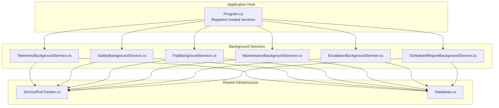
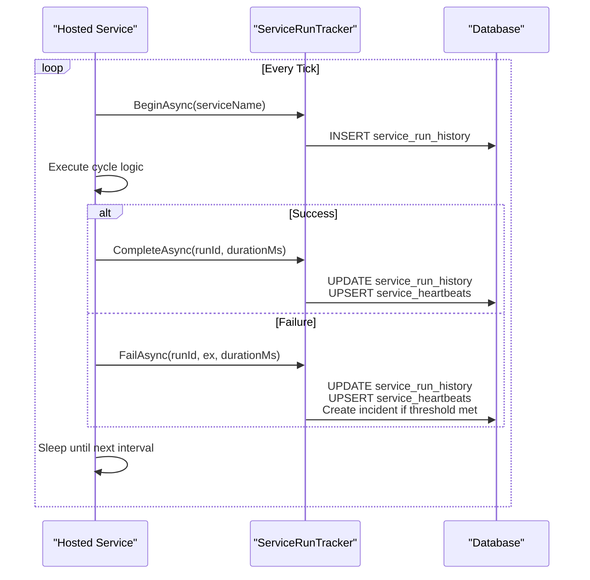
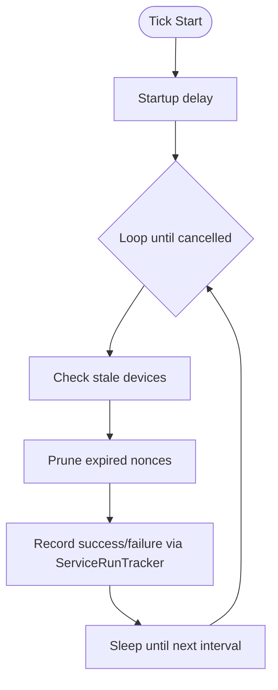
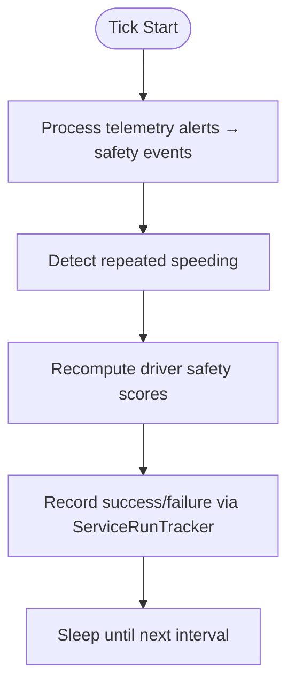
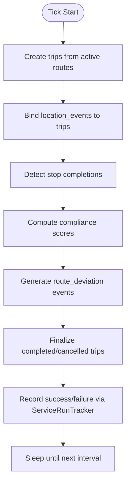
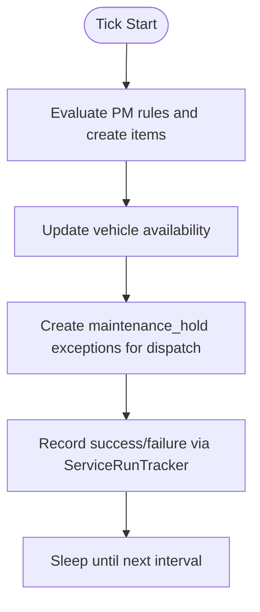
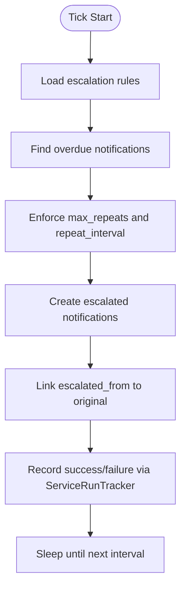
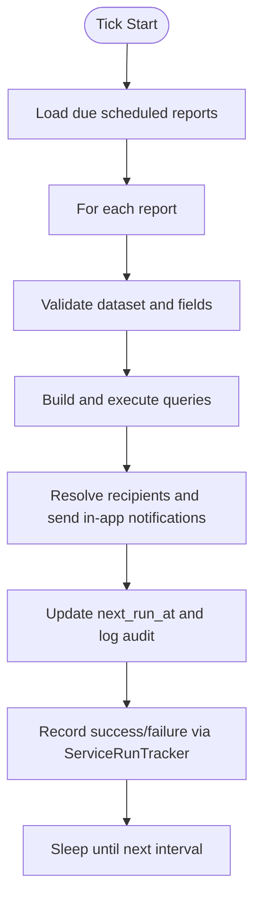
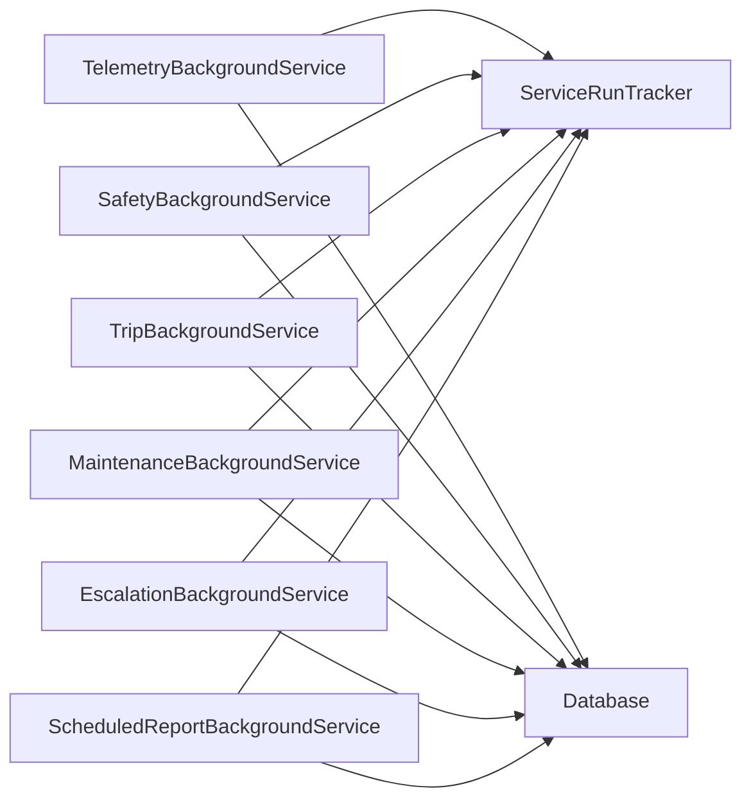

# Background Services

<cite>
**Referenced Files in This Document**
- [Program.cs](file://backend-dotnet/Program.cs)
- [TelemetryBackgroundService.cs](file://backend-dotnet/Services/TelemetryBackgroundService.cs)
- [SafetyBackgroundService.cs](file://backend-dotnet/Services/SafetyBackgroundService.cs)
- [TripBackgroundService.cs](file://backend-dotnet/Services/TripBackgroundService.cs)
- [MaintenanceBackgroundService.cs](file://backend-dotnet/Services/MaintenanceBackgroundService.cs)
- [EscalationBackgroundService.cs](file://backend-dotnet/Services/EscalationBackgroundService.cs)
- [ScheduledReportBackgroundService.cs](file://backend-dotnet/Services/ScheduledReportBackgroundService.cs)
- [ServiceRunTracker.cs](file://backend-dotnet/Services/ServiceRunTracker.cs)
- [Database.cs](file://backend-dotnet/Data/Database.cs)
- [001_schema.sql](file://db/init/001_schema.sql)
- [002_seed.sql](file://db/init/002_seed.sql)
</cite>

## Table of Contents
1. [Introduction](#introduction)
2. [Project Structure](#project-structure)
3. [Core Components](#core-components)
4. [Architecture Overview](#architecture-overview)
5. [Detailed Component Analysis](#detailed-component-analysis)
6. [Dependency Analysis](#dependency-analysis)
7. [Performance Considerations](#performance-considerations)
8. [Troubleshooting Guide](#troubleshooting-guide)
9. [Conclusion](#conclusion)

## Introduction
This document explains the background services architecture used to power long-running, timer-based tasks in the backend. It covers hosted service patterns, lifecycle management, error handling, graceful shutdown, and operational observability. The services handle real-time telemetry processing, scheduled report generation, escalation workflows, maintenance automation, and safety monitoring. The documentation also provides guidance on concurrency handling, fault tolerance, and performance optimization for background processing.

## Project Structure
The background services are implemented as .NET hosted services and registered in the application’s dependency injection container. Each service encapsulates a distinct domain workflow and runs on a fixed schedule. A shared run tracker records execution metadata and health signals for monitoring and alerting.

**Diagram sources**
- [Program.cs:49-54](file://backend-dotnet/Program.cs#L49-L54)
- [TelemetryBackgroundService.cs:9-12](file://backend-dotnet/Services/TelemetryBackgroundService.cs#L9-L12)
- [SafetyBackgroundService.cs:13-16](file://backend-dotnet/Services/SafetyBackgroundService.cs#L13-L16)
- [TripBackgroundService.cs:17-19](file://backend-dotnet/Services/TripBackgroundService.cs#L17-L19)
- [MaintenanceBackgroundService.cs:11-12](file://backend-dotnet/Services/MaintenanceBackgroundService.cs#L11-L12)
- [EscalationBackgroundService.cs:8-11](file://backend-dotnet/Services/EscalationBackgroundService.cs#L8-L11)
- [ScheduledReportBackgroundService.cs:26-29](file://backend-dotnet/Services/ScheduledReportBackgroundService.cs#L26-L29)
- [ServiceRunTracker.cs:22-24](file://backend-dotnet/Services/ServiceRunTracker.cs#L22-L24)
- [Database.cs:5](file://backend-dotnet/Data/Database.cs#L5)

**Section sources**
- [Program.cs:49-54](file://backend-dotnet/Program.cs#L49-L54)

## Core Components
- Hosted Services: Timer-driven background workers that execute periodic tasks.
- ServiceRunTracker: Centralized run lifecycle manager that logs executions, heartbeats, and errors.
- Database Abstraction: Consistent async data access for all services.

Key responsibilities:
- TelemetryBackgroundService: Detects stale devices and prunes expired nonces.
- SafetyBackgroundService: Translates telemetry alerts into safety events, detects repeated speeding, recomputes driver safety scores.
- TripBackgroundService: Creates trips from active routes, binds location events, computes compliance, generates deviations, finalizes trips.
- MaintenanceBackgroundService: Evaluates preventive maintenance rules, updates vehicle availability, handles maintenance holds on dispatch assignments.
- EscalationBackgroundService: Escalates overdue notifications according to escalation rules.
- ScheduledReportBackgroundService: Executes scheduled reports, resolves recipients, and records execution outcomes.

**Section sources**
- [TelemetryBackgroundService.cs:17-44](file://backend-dotnet/Services/TelemetryBackgroundService.cs#L17-L44)
- [SafetyBackgroundService.cs:31-59](file://backend-dotnet/Services/SafetyBackgroundService.cs#L31-L59)
- [TripBackgroundService.cs:39-61](file://backend-dotnet/Services/TripBackgroundService.cs#L39-L61)
- [MaintenanceBackgroundService.cs:18-39](file://backend-dotnet/Services/MaintenanceBackgroundService.cs#L18-L39)
- [EscalationBackgroundService.cs:16-43](file://backend-dotnet/Services/EscalationBackgroundService.cs#L16-L43)
- [ScheduledReportBackgroundService.cs:34-61](file://backend-dotnet/Services/ScheduledReportBackgroundService.cs#L34-L61)
- [ServiceRunTracker.cs:33-114](file://backend-dotnet/Services/ServiceRunTracker.cs#L33-L114)
- [Database.cs:17-77](file://backend-dotnet/Data/Database.cs#L17-L77)

## Architecture Overview
The hosted services follow a consistent pattern:
- On startup, each service waits briefly to allow schema initialization to complete.
- Each iteration performs a full cycle, logging start/end and measuring duration.
- Errors are caught, sanitized, and recorded; heartbeats track continuous operation.
- After each cycle, the service sleeps until the next interval.

**Diagram sources**
- [TelemetryBackgroundService.cs:17-44](file://backend-dotnet/Services/TelemetryBackgroundService.cs#L17-L44)
- [SafetyBackgroundService.cs:31-59](file://backend-dotnet/Services/SafetyBackgroundService.cs#L31-L59)
- [TripBackgroundService.cs:39-61](file://backend-dotnet/Services/TripBackgroundService.cs#L39-L61)
- [MaintenanceBackgroundService.cs:18-39](file://backend-dotnet/Services/MaintenanceBackgroundService.cs#L18-L39)
- [EscalationBackgroundService.cs:16-43](file://backend-dotnet/Services/EscalationBackgroundService.cs#L16-L43)
- [ScheduledReportBackgroundService.cs:34-61](file://backend-dotnet/Services/ScheduledReportBackgroundService.cs#L34-L61)
- [ServiceRunTracker.cs:33-114](file://backend-dotnet/Services/ServiceRunTracker.cs#L33-L114)

## Detailed Component Analysis

### TelemetryBackgroundService
Purpose:
- Periodically checks for stale devices and creates alerts.
- Prunes expired telemetry nonces.

Lifecycle:
- Starts after a brief delay to let migrations finish.
- Runs every five minutes.
- Uses a scoped database context per tick.

Concurrency and error handling:
- Uses a dedicated scope factory to resolve Database per tick.
- Catches and logs exceptions; marks run as failed with sanitized error.

Operational notes:
- Queries per-tenant stale thresholds from telemetry rules.
- Inserts idempotent alerts only if none are open.
- Deletes nonces older than 24 hours.

**Diagram sources**
- [TelemetryBackgroundService.cs:17-101](file://backend-dotnet/Services/TelemetryBackgroundService.cs#L17-L101)

**Section sources**
- [TelemetryBackgroundService.cs:17-101](file://backend-dotnet/Services/TelemetryBackgroundService.cs#L17-L101)

### SafetyBackgroundService
Purpose:
- Converts telemetry alerts into safety events.
- Detects repeated speeding patterns.
- Recomputes driver safety scores.

Lifecycle:
- Starts after a short delay.
- Runs every five minutes.

Safety event pipeline:
- Reads unprocessed telemetry alerts and inserts safety events with a unique constraint to prevent duplicates.
- Computes severity-based score impacts using tenant-specific weights.
- Detects repeated speeding occurrences and creates a separate event type.
- Recomputes rolling 7/30/90-day driver safety scores and persists breakdowns.

**Diagram sources**
- [SafetyBackgroundService.cs:63-253](file://backend-dotnet/Services/SafetyBackgroundService.cs#L63-L253)

**Section sources**
- [SafetyBackgroundService.cs:31-59](file://backend-dotnet/Services/SafetyBackgroundService.cs#L31-L59)
- [SafetyBackgroundService.cs:63-253](file://backend-dotnet/Services/SafetyBackgroundService.cs#L63-L253)

### TripBackgroundService
Purpose:
- Auto-create trips from active routes with assigned vehicles.
- Bind location events to trips and compute compliance.
- Generate route deviation safety events for overdue stops.
- Finalize trips when parent routes complete or cancel.

Lifecycle:
- Runs every five minutes with a short startup delay.

Core steps:
- Upsert trips and seed trip stops from route stops.
- Bind unassigned location events to active trips and activate trips.
- Detect stop completions by proximity and update counts.
- Compute compliance score considering start delay, missed/late stops, telemetry gaps, and speeding events.
- Generate route deviation events and mark stops flagged.
- Close finalized trips and compute actual distance.

**Diagram sources**
- [TripBackgroundService.cs:63-82](file://backend-dotnet/Services/TripBackgroundService.cs#L63-L82)
- [TripBackgroundService.cs:85-173](file://backend-dotnet/Services/TripBackgroundService.cs#L85-L173)
- [TripBackgroundService.cs:176-214](file://backend-dotnet/Services/TripBackgroundService.cs#L176-L214)
- [TripBackgroundService.cs:217-272](file://backend-dotnet/Services/TripBackgroundService.cs#L217-L272)
- [TripBackgroundService.cs:279-402](file://backend-dotnet/Services/TripBackgroundService.cs#L279-L402)
- [TripBackgroundService.cs:405-502](file://backend-dotnet/Services/TripBackgroundService.cs#L405-L502)
- [TripBackgroundService.cs:505-540](file://backend-dotnet/Services/TripBackgroundService.cs#L505-L540)

**Section sources**
- [TripBackgroundService.cs:39-61](file://backend-dotnet/Services/TripBackgroundService.cs#L39-L61)
- [TripBackgroundService.cs:63-82](file://backend-dotnet/Services/TripBackgroundService.cs#L63-L82)
- [TripBackgroundService.cs:279-402](file://backend-dotnet/Services/TripBackgroundService.cs#L279-L402)

### MaintenanceBackgroundService
Purpose:
- Evaluate preventive maintenance rules against odometer/engine hours/last service date.
- Generate maintenance items when thresholds are reached.
- Update vehicle availability based on critical defects and work order status.

Lifecycle:
- Runs every 15 minutes with a short startup delay.

Key logic:
- For each enabled PM rule, scan eligible vehicles and determine due/overdue status based on trigger type.
- Skip if an open maintenance item already exists for the same rule/vehicle.
- Update vehicle availability to out_of_service/in_maintenance/available based on critical defects and open work orders.
- Create maintenance_hold exceptions for dispatch assignments on out-of-service vehicles.

**Diagram sources**
- [MaintenanceBackgroundService.cs:41-45](file://backend-dotnet/Services/MaintenanceBackgroundService.cs#L41-L45)
- [MaintenanceBackgroundService.cs:51-177](file://backend-dotnet/Services/MaintenanceBackgroundService.cs#L51-L177)
- [MaintenanceBackgroundService.cs:185-301](file://backend-dotnet/Services/MaintenanceBackgroundService.cs#L185-L301)

**Section sources**
- [MaintenanceBackgroundService.cs:18-39](file://backend-dotnet/Services/MaintenanceBackgroundService.cs#L18-L39)
- [MaintenanceBackgroundService.cs:51-177](file://backend-dotnet/Services/MaintenanceBackgroundService.cs#L51-L177)
- [MaintenanceBackgroundService.cs:185-301](file://backend-dotnet/Services/MaintenanceBackgroundService.cs#L185-L301)

### EscalationBackgroundService
Purpose:
- Escalate overdue notifications based on escalation rules.

Lifecycle:
- Runs every five minutes.

Logic:
- Load enabled escalation rules per company and event/severity.
- Find notifications that match criteria and exceed time-to-escalate thresholds.
- Enforce max repeats and repeat intervals.
- Create escalated notifications and link them back to originals.

**Diagram sources**
- [EscalationBackgroundService.cs:45-164](file://backend-dotnet/Services/EscalationBackgroundService.cs#L45-L164)

**Section sources**
- [EscalationBackgroundService.cs:16-43](file://backend-dotnet/Services/EscalationBackgroundService.cs#L16-L43)
- [EscalationBackgroundService.cs:45-164](file://backend-dotnet/Services/EscalationBackgroundService.cs#L45-L164)

### ScheduledReportBackgroundService
Purpose:
- Execute scheduled reports on a fixed cadence and deliver in-app notifications.

Lifecycle:
- Runs every five minutes.

Security model:
- Recipients resolved server-side from roles/usernames stored in DB.
- Delivery always in-app; external providers require configuration.
- Tenant isolation enforced via joins and company_id checks.

Execution flow:
- Load due scheduled reports (next_run_at ≤ now).
- For each, rebuild dataset query using secure builders and validate fields.
- Execute count and data queries (bounded by max page size).
- Record execution log and send in-app notifications to resolved recipients.
- Update next_run_at based on frequency and log audit trail.

**Diagram sources**
- [ScheduledReportBackgroundService.cs:63-120](file://backend-dotnet/Services/ScheduledReportBackgroundService.cs#L63-L120)
- [ScheduledReportBackgroundService.cs:122-256](file://backend-dotnet/Services/ScheduledReportBackgroundService.cs#L122-L256)
- [ScheduledReportBackgroundService.cs:260-290](file://backend-dotnet/Services/ScheduledReportBackgroundService.cs#L260-L290)

**Section sources**
- [ScheduledReportBackgroundService.cs:34-61](file://backend-dotnet/Services/ScheduledReportBackgroundService.cs#L34-L61)
- [ScheduledReportBackgroundService.cs:63-120](file://backend-dotnet/Services/ScheduledReportBackgroundService.cs#L63-L120)
- [ScheduledReportBackgroundService.cs:122-256](file://backend-dotnet/Services/ScheduledReportBackgroundService.cs#L122-L256)
- [ScheduledReportBackgroundService.cs:260-290](file://backend-dotnet/Services/ScheduledReportBackgroundService.cs#L260-L290)

### ServiceRunTracker
Purpose:
- Track every hosted service run with start/end timestamps, duration, and outcome.
- Maintain service heartbeats and escalate to incidents after repeated failures.

Key APIs:
- BeginAsync: Start a run and return a run ID.
- HeartbeatAsync: Update heartbeat periodically for long runs.
- CompleteAsync: Mark a run succeeded.
- FailAsync: Mark a run failed, increment consecutive failures, and create incidents when thresholds are met.

Security:
- Sanitize error messages to remove sensitive data before persisting.

**Section sources**
- [ServiceRunTracker.cs:33-114](file://backend-dotnet/Services/ServiceRunTracker.cs#L33-L114)
- [ServiceRunTracker.cs:184-203](file://backend-dotnet/Services/ServiceRunTracker.cs#L184-L203)

### Database Abstraction
- Provides async helpers for queries, scalar reads, executes, and insert-returning-id.
- Ensures proper disposal of connections and commands.
- Used by all services through scoped resolution.

**Section sources**
- [Database.cs:17-77](file://backend-dotnet/Data/Database.cs#L17-L77)

## Dependency Analysis
The hosted services depend on:
- IServiceScopeFactory for scoped DI resolution.
- ServiceRunTracker for lifecycle and health tracking.
- Database for all persistence operations.
- NotificationService/AuditService for cross-cutting concerns in some services.

**Diagram sources**
- [TelemetryBackgroundService.cs:9-12](file://backend-dotnet/Services/TelemetryBackgroundService.cs#L9-L12)
- [SafetyBackgroundService.cs:13-16](file://backend-dotnet/Services/SafetyBackgroundService.cs#L13-L16)
- [TripBackgroundService.cs:17-19](file://backend-dotnet/Services/TripBackgroundService.cs#L17-L19)
- [MaintenanceBackgroundService.cs:11-12](file://backend-dotnet/Services/MaintenanceBackgroundService.cs#L11-L12)
- [EscalationBackgroundService.cs:8-11](file://backend-dotnet/Services/EscalationBackgroundService.cs#L8-L11)
- [ScheduledReportBackgroundService.cs:26-29](file://backend-dotnet/Services/ScheduledReportBackgroundService.cs#L26-L29)
- [ServiceRunTracker.cs:22-24](file://backend-dotnet/Services/ServiceRunTracker.cs#L22-L24)
- [Database.cs:5](file://backend-dotnet/Data/Database.cs#L5)

**Section sources**
- [Program.cs:49-54](file://backend-dotnet/Program.cs#L49-L54)

## Performance Considerations
- Concurrency handling:
  - Each service runs as a single hosted service; no intra-service parallelism is used. This simplifies error handling and reduces contention.
  - Scopes are created per tick to isolate DB contexts and avoid cross-run interference.
- Resource management:
  - Async database operations prevent thread blocking.
  - Proper disposal of connections and commands via using statements.
- Monitoring and observability:
  - ServiceRunTracker records run durations and heartbeats for health checks.
  - Sanitized error messages protect sensitive data while enabling diagnosis.
- Optimization tips:
  - Batch operations where feasible (e.g., pruning nonces in bulk).
  - Use indexed lookups for stale device detection and escalation queries.
  - Limit result sets for long-running scans (e.g., compliance computations).
  - Consider partitioning or materialized views for frequently accessed aggregates.

[No sources needed since this section provides general guidance]

## Troubleshooting Guide
Common scenarios and remedies:
- Frequent failures:
  - Inspect service_heartbeats and service_run_history for consecutive failure counts and sanitized error messages.
  - Investigate database connectivity and query timeouts.
- Stalled or slow runs:
  - Use heartbeat logs to detect long-running cycles and add periodic HeartbeatAsync calls for very long tasks.
- Data inconsistencies:
  - Verify unique constraints (e.g., safety_events from telemetry_alerts) to prevent duplicate processing.
  - Confirm tenant isolation joins and company_id scoping in scheduled reports and escalation rules.
- Graceful shutdown:
  - Services honor cancellation tokens; ensure no long uninterruptible operations block shutdown.

Operational endpoints:
- Health probes (/health, /ready, /health/ready, /health/deep) surface database connectivity and service statuses derived from heartbeats.

**Section sources**
- [ServiceRunTracker.cs:112-179](file://backend-dotnet/Services/ServiceRunTracker.cs#L112-L179)
- [Program.cs:257-378](file://backend-dotnet/Program.cs#L257-L378)

## Conclusion
The background services architecture leverages .NET hosted services with a consistent lifecycle and robust observability. Each service encapsulates a focused responsibility, shares a common run tracker for reliability, and uses a clean database abstraction. Together, they enable real-time telemetry processing, safety monitoring, route and maintenance automation, escalation workflows, and scheduled reporting—all with strong error handling, tenant isolation, and operational visibility.