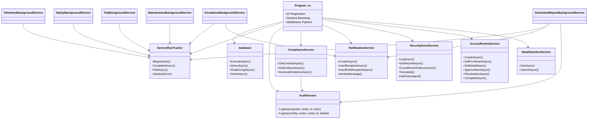
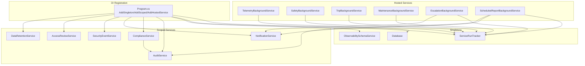

# Business Logic Services

<cite>
**Referenced Files in This Document**
- [Program.cs](file://backend-dotnet/Program.cs)
- [AuditService.cs](file://backend-dotnet/Services/AuditService.cs)
- [ComplianceService.cs](file://backend-dotnet/Services/ComplianceService.cs)
- [NotificationService.cs](file://backend-dotnet/Services/NotificationService.cs)
- [TelemetryBackgroundService.cs](file://backend-dotnet/Services/TelemetryBackgroundService.cs)
- [SafetyBackgroundService.cs](file://backend-dotnet/Services/SafetyBackgroundService.cs)
- [TripBackgroundService.cs](file://backend-dotnet/Services/TripBackgroundService.cs)
- [MaintenanceBackgroundService.cs](file://backend-dotnet/Services/MaintenanceBackgroundService.cs)
- [EscalationBackgroundService.cs](file://backend-dotnet/Services/EscalationBackgroundService.cs)
- [ScheduledReportBackgroundService.cs](file://backend-dotnet/Services/ScheduledReportBackgroundService.cs)
- [ServiceRunTracker.cs](file://backend-dotnet/Services/ServiceRunTracker.cs)
- [DataRetentionService.cs](file://backend-dotnet/Services/DataRetentionService.cs)
- [SecurityEventService.cs](file://backend-dotnet/Services/SecurityEventService.cs)
- [AccessReviewService.cs](file://backend-dotnet/Services/AccessReviewService.cs)
- [ObservabilitySchemaService.cs](file://backend-dotnet/Services/ObservabilitySchemaService.cs)
</cite>

## Table of Contents
1. [Introduction](#introduction)
2. [Project Structure](#project-structure)
3. [Core Components](#core-components)
4. [Architecture Overview](#architecture-overview)
5. [Detailed Component Analysis](#detailed-component-analysis)
6. [Dependency Analysis](#dependency-analysis)
7. [Performance Considerations](#performance-considerations)
8. [Troubleshooting Guide](#troubleshooting-guide)
9. [Conclusion](#conclusion)

## Introduction
This document describes the business logic service layer of the enterprise transport management solution. It covers the service architecture pattern with dependency injection, scoped lifetime services, and hosted services for background processing. It also documents the audit service for tracking user actions and system changes, compliance services for regulatory requirements and policy enforcement, notification services for messaging and alerts, and telemetry background services for real-time data processing and event streaming. The document includes service registration patterns, dependency relationships, lifecycle management, error handling strategies, logging integration, and performance considerations for each service category.

## Project Structure
The backend service layer is implemented in C# (.NET) under the backend-dotnet directory. Services are organized by domain capability and grouped under the Services folder. Application startup and DI registration occur in Program.cs, which registers:
- Singleton services for schema bootstrapping and shared infrastructure
- Scoped services for business capabilities requiring tenant/session context
- Hosted services implementing recurring background tasks

```mermaid
graph TB
subgraph "Startup and DI"
P["Program.cs<br/>Service Registration"]
end
subgraph "Singleton Services"
DB["Database (singleton)"]
OBS["ObservabilitySchemaService (singleton)"]
RUN["ServiceRunTracker (singleton)"]
end
subgraph "Scoped Services"
AUD["AuditService (scoped)"]
COM["ComplianceService (scoped)"]
NOTIF["NotificationService (scoped)"]
SEC["SecurityEventService (scoped)"]
ACC["AccessReviewService (scoped)"]
RET["DataRetentionService (scoped)"]
end
subgraph "Hosted Services"
TEL["TelemetryBackgroundService"]
SAF["SafetyBackgroundService"]
TRIP["TripBackgroundService"]
MAINT["MaintenanceBackgroundService"]
ESC["EscalationBackgroundService"]
SCH["ScheduledReportBackgroundService"]
end
P --> DB
P --> OBS
P --> RUN
P --> AUD
P --> COM
P --> NOTIF
P --> SEC
P --> ACC
P --> RET
P --> TEL
P --> SAF
P --> TRIP
P --> MAINT
P --> ESC
P --> SCH
```

**Diagram sources**
- [Program.cs:14-54](file://backend-dotnet/Program.cs#L14-L54)

**Section sources**
- [Program.cs:14-90](file://backend-dotnet/Program.cs#L14-L90)

## Core Components
This section outlines the primary service categories and their responsibilities.

- Audit service: Logs auditable actions with tenant scoping and optional actor identification.
- Compliance service: Generates compliance evidence from system data and supports SOC2 readiness reporting.
- Notification service: Creates notifications, resolves recipients, deduplicates, and sanitizes messages.
- Security event service: Records tenant-scoped, sanitized security events with IP truncation and user agent hashing.
- Access review service: Manages periodic access reviews with role/permission snapshots and lifecycle tracking.
- Data retention service: Manages tenant-level retention policies and legal hold constraints.
- Background services: Telemetry, Safety, Trip, Maintenance, Escalation, and Scheduled Report runners.

**Section sources**
- [AuditService.cs:7-47](file://backend-dotnet/Services/AuditService.cs#L7-L47)
- [ComplianceService.cs:26-131](file://backend-dotnet/Services/ComplianceService.cs#L26-L131)
- [NotificationService.cs:5-121](file://backend-dotnet/Services/NotificationService.cs#L5-L121)
- [SecurityEventService.cs:31-101](file://backend-dotnet/Services/SecurityEventService.cs#L31-L101)
- [AccessReviewService.cs:21-112](file://backend-dotnet/Services/AccessReviewService.cs#L21-L112)
- [DataRetentionService.cs:16-112](file://backend-dotnet/Services/DataRetentionService.cs#L16-L112)
- [TelemetryBackgroundService.cs:9-44](file://backend-dotnet/Services/TelemetryBackgroundService.cs#L9-L44)
- [SafetyBackgroundService.cs:13-59](file://backend-dotnet/Services/SafetyBackgroundService.cs#L13-L59)
- [TripBackgroundService.cs:17-61](file://backend-dotnet/Services/TripBackgroundService.cs#L17-L61)
- [MaintenanceBackgroundService.cs:11-39](file://backend-dotnet/Services/MaintenanceBackgroundService.cs#L11-L39)
- [EscalationBackgroundService.cs:8-43](file://backend-dotnet/Services/EscalationBackgroundService.cs#L8-L43)
- [ScheduledReportBackgroundService.cs:26-61](file://backend-dotnet/Services/ScheduledReportBackgroundService.cs#L26-L61)

## Architecture Overview
The service architecture follows a layered pattern:
- DI container manages lifetimes: singleton for shared infrastructure, scoped for tenant/session-aware services, hosted for background tasks.
- Background services use a shared tracker to record run history and heartbeats, enabling observability and incident automation.
- Audit and security services enforce tenant scoping and sanitize sensitive data.
- Notification service centralizes message delivery and recipient resolution.

**Diagram sources**
- [Program.cs:14-54](file://backend-dotnet/Program.cs#L14-L54)
- [ServiceRunTracker.cs:22-179](file://backend-dotnet/Services/ServiceRunTracker.cs#L22-L179)
- [AuditService.cs:7-47](file://backend-dotnet/Services/AuditService.cs#L7-L47)
- [ComplianceService.cs:26-131](file://backend-dotnet/Services/ComplianceService.cs#L26-L131)
- [NotificationService.cs:5-121](file://backend-dotnet/Services/NotificationService.cs#L5-L121)
- [SecurityEventService.cs:31-101](file://backend-dotnet/Services/SecurityEventService.cs#L31-L101)
- [AccessReviewService.cs:21-112](file://backend-dotnet/Services/AccessReviewService.cs#L21-L112)
- [DataRetentionService.cs:16-112](file://backend-dotnet/Services/DataRetentionService.cs#L16-L112)
- [TelemetryBackgroundService.cs:9-44](file://backend-dotnet/Services/TelemetryBackgroundService.cs#L9-L44)
- [SafetyBackgroundService.cs:13-59](file://backend-dotnet/Services/SafetyBackgroundService.cs#L13-L59)
- [TripBackgroundService.cs:17-61](file://backend-dotnet/Services/TripBackgroundService.cs#L17-L61)
- [MaintenanceBackgroundService.cs:11-39](file://backend-dotnet/Services/MaintenanceBackgroundService.cs#L11-L39)
- [EscalationBackgroundService.cs:8-43](file://backend-dotnet/Services/EscalationBackgroundService.cs#L8-L43)
- [ScheduledReportBackgroundService.cs:26-61](file://backend-dotnet/Services/ScheduledReportBackgroundService.cs#L26-L61)

## Detailed Component Analysis

### Audit Service
Purpose:
- Record tenant-scoped audit logs with actor identification derived from HTTP context or system defaults.
- Support both system-initiated and user-driven audit entries.

Key behaviors:
- Accepts optional details JSON payload and actor identity.
- Uses company ID and optional actor user ID from HTTP context items populated by middleware.
- Inserts into audit_logs with JSON metadata.

Operational notes:
- Designed for high-throughput auditing with minimal overhead.
- Ensures tenant isolation by binding to company_id.

**Section sources**
- [AuditService.cs:7-47](file://backend-dotnet/Services/AuditService.cs#L7-L47)

### Compliance Service
Purpose:
- Generate compliance evidence for SOC2 readiness from real system data.
- Provide controls catalog and evidence retrieval.

Key behaviors:
- Evidence generation aggregates counts and summaries from audit_logs, security_events, service_run_history, access_reviews, backup_verifications, and platform_incidents.
- Computes SHA-256 hashes of evidence metadata for tamper resistance.
- Logs evidence generation via AuditService.

Operational notes:
- Evidence types mapped to specific source systems and time windows.
- Retention enforced by configurable periods.

**Section sources**
- [ComplianceService.cs:26-131](file://backend-dotnet/Services/ComplianceService.cs#L26-L131)
- [ComplianceService.cs:135-232](file://backend-dotnet/Services/ComplianceService.cs#L135-L232)
- [ComplianceService.cs:234-240](file://backend-dotnet/Services/ComplianceService.cs#L234-L240)

### Notification Service
Purpose:
- Centralized notification creation with deduplication, recipient resolution, and sanitization.

Key behaviors:
- Deduplication via dedupe_key and suppression window.
- Recipient resolution supports targeted users, driver-to-user mapping, and role-based broadcasts.
- Sanitizes messages to prevent leakage of internal operational data to customer/driver audiences.
- External channels marked as “not configured” to avoid false delivery claims.

Operational notes:
- In-app delivery marks recipients as delivered immediately; external channels remain pending until configured.

**Section sources**
- [NotificationService.cs:5-121](file://backend-dotnet/Services/NotificationService.cs#L5-L121)
- [NotificationService.cs:123-156](file://backend-dotnet/Services/NotificationService.cs#L123-L156)
- [NotificationService.cs:172-182](file://backend-dotnet/Services/NotificationService.cs#L172-L182)

### Security Event Service
Purpose:
- Record tenant-scoped security events with privacy-preserving data.

Key behaviors:
- Truncates IPs to first 3 octets (IPv4) or first 48 bits (IPv6).
- Hashes user agents to first 8 hex chars of SHA-256.
- Enforces tenant isolation and limits message length.

Operational notes:
- Supports aggregated failure counting for anomaly detection.
- Event types cover authentication, MFA, password changes, role/permission events, exports, and device credentials.

**Section sources**
- [SecurityEventService.cs:31-101](file://backend-dotnet/Services/SecurityEventService.cs#L31-L101)
- [SecurityEventService.cs:125-150](file://backend-dotnet/Services/SecurityEventService.cs#L125-L150)

### Access Review Service
Purpose:
- Manage periodic access reviews with role/permission snapshots and lifecycle tracking.

Key behaviors:
- Creates reviews and snapshots active users’ roles and permissions at creation time.
- Supports approval/revoke actions and completion with audit logging.
- Maintains counts of approved, revoked, and pending items.

Operational notes:
- Snapshots are static; actual role changes are manual.
- Enforces tenant scoping and limits on number of items.

**Section sources**
- [AccessReviewService.cs:21-112](file://backend-dotnet/Services/AccessReviewService.cs#L21-L112)
- [AccessReviewService.cs:151-194](file://backend-dotnet/Services/AccessReviewService.cs#L151-L194)

### Data Retention Service
Purpose:
- Manage tenant-level data retention policies and legal hold constraints.

Key behaviors:
- Provides defaults and persists retention policy updates with audit trail.
- Prevents deletion during active legal holds.
- Enforces minimum retention windows for various data categories.

Operational notes:
- Soft-delete-only mode is default; explicit deletion worker must validate policy and legal hold.

**Section sources**
- [DataRetentionService.cs:16-112](file://backend-dotnet/Services/DataRetentionService.cs#L16-L112)

### Telemetry Background Service
Purpose:
- Periodic telemetry housekeeping: stale device detection and nonce pruning.

Key behaviors:
- Checks for stale devices based on per-tenant thresholds and creates stale_device alerts if none exist.
- Prunes telemetry nonces older than 24 hours.
- Uses ServiceRunTracker for run lifecycle and logging.

Operational notes:
- Idempotent: avoids duplicate stale alerts.
- Lightweight cleanup to reduce replay attack surface.

**Section sources**
- [TelemetryBackgroundService.cs:9-44](file://backend-dotnet/Services/TelemetryBackgroundService.cs#L9-L44)
- [TelemetryBackgroundService.cs:46-101](file://backend-dotnet/Services/TelemetryBackgroundService.cs#L46-L101)

### Safety Background Service
Purpose:
- Convert telemetry alerts into safety events, detect repeated speeding, and recompute driver safety scores.

Key behaviors:
- Converts unprocessed telemetry_alerts into safety_events with deduplication via unique keys.
- Detects repeated speeding events and raises severity accordingly.
- Recomputes driver_safety_scores for recent events with configurable weights.

Operational notes:
- Uses tenant-specific scoring weights from telemetry_rules.
- Emits driver safety insights and maintains breakdown JSON.

**Section sources**
- [SafetyBackgroundService.cs:13-59](file://backend-dotnet/Services/SafetyBackgroundService.cs#L13-L59)
- [SafetyBackgroundService.cs:63-145](file://backend-dotnet/Services/SafetyBackgroundService.cs#L63-L145)
- [SafetyBackgroundService.cs:149-203](file://backend-dotnet/Services/SafetyBackgroundService.cs#L149-L203)
- [SafetyBackgroundService.cs:206-294](file://backend-dotnet/Services/SafetyBackgroundService.cs#L206-L294)

### Trip Background Service
Purpose:
- Orchestrate trip lifecycle: creation, location binding, stop completion, compliance scoring, deviation detection, and finalization.

Key behaviors:
- Creates trips from active routes with assigned vehicles and seeds trip_stops.
- Binds location_events to trips and activates trips upon first bound event.
- Detects stop completions via proximity and computes compliance metrics.
- Generates route_deviation safety events for overdue stops outside bounding boxes.
- Finalizes trips when parent routes complete or cancel.

Operational notes:
- Proximity thresholds approximate 300 meters at mid-latitudes.
- Compliance scoring considers start delays, missed stops, late arrivals, telemetry gaps, and speeding events.

**Section sources**
- [TripBackgroundService.cs:17-61](file://backend-dotnet/Services/TripBackgroundService.cs#L17-L61)
- [TripBackgroundService.cs:85-173](file://backend-dotnet/Services/TripBackgroundService.cs#L85-L173)
- [TripBackgroundService.cs:176-214](file://backend-dotnet/Services/TripBackgroundService.cs#L176-L214)
- [TripBackgroundService.cs:217-272](file://backend-dotnet/Services/TripBackgroundService.cs#L217-L272)
- [TripBackgroundService.cs:275-376](file://backend-dotnet/Services/TripBackgroundService.cs#L275-L376)
- [TripBackgroundService.cs:405-502](file://backend-dotnet/Services/TripBackgroundService.cs#L405-L502)
- [TripBackgroundService.cs:505-540](file://backend-dotnet/Services/TripBackgroundService.cs#L505-L540)

### Maintenance Background Service
Purpose:
- Evaluate preventive maintenance (PM) rules against vehicle telemetry and update availability.

Key behaviors:
- Evaluates PM rules by mileage, engine hours, or days since last service with warning thresholds.
- Generates maintenance_items for due/overdue services, avoiding duplicates.
- Updates vehicle availability based on critical defects and open work orders.
- Triggers maintenance_hold exceptions for active dispatch assignments on out-of-service vehicles.

Operational notes:
- Availability states: available, in_maintenance, out_of_service.
- Idempotent: prevents duplicate maintenance_hold exceptions.

**Section sources**
- [MaintenanceBackgroundService.cs:11-39](file://backend-dotnet/Services/MaintenanceBackgroundService.cs#L11-L39)
- [MaintenanceBackgroundService.cs:51-177](file://backend-dotnet/Services/MaintenanceBackgroundService.cs#L51-L177)
- [MaintenanceBackgroundService.cs:185-301](file://backend-dotnet/Services/MaintenanceBackgroundService.cs#L185-L301)

### Escalation Background Service
Purpose:
- Automatically escalate overdue notifications to higher audiences based on escalation rules.

Key behaviors:
- Loads enabled escalation rules and finds overdue notifications meeting criteria.
- Enforces max_repeats and repeat_interval constraints.
- Creates escalated notifications and links them back to originals.

Operational notes:
- Uses NotificationService to create escalated notifications with highest priority.
- Idempotent: prevents duplicate escalations for the same source.

**Section sources**
- [EscalationBackgroundService.cs:8-43](file://backend-dotnet/Services/EscalationBackgroundService.cs#L8-L43)
- [EscalationBackgroundService.cs:45-164](file://backend-dotnet/Services/EscalationBackgroundService.cs#L45-L164)

### Scheduled Report Background Service
Purpose:
- Execute scheduled reports server-side and deliver results via in-app notifications.

Key behaviors:
- Resolves datasets and rebuilds queries with tenant isolation.
- Validates selected fields against current registry.
- Executes count and data queries, logs execution, and delivers notifications to recipients.
- Records run outcomes and advances next_run_at based on frequency.

Operational notes:
- External delivery requires configured providers; otherwise marks as not configured.
- Recipients resolved server-side from role names or usernames; no client-supplied emails.

**Section sources**
- [ScheduledReportBackgroundService.cs:26-61](file://backend-dotnet/Services/ScheduledReportBackgroundService.cs#L26-L61)
- [ScheduledReportBackgroundService.cs:63-120](file://backend-dotnet/Services/ScheduledReportBackgroundService.cs#L63-L120)
- [ScheduledReportBackgroundService.cs:122-256](file://backend-dotnet/Services/ScheduledReportBackgroundService.cs#L122-L256)
- [ScheduledReportBackgroundService.cs:295-348](file://backend-dotnet/Services/ScheduledReportBackgroundService.cs#L295-L348)

### Observability Schema Service
Purpose:
- Create and maintain observability tables for service run history, heartbeats, and platform incidents.

Key behaviors:
- Creates service_run_history with indexes for diagnostics.
- Creates service_heartbeats for health monitoring and incident triggering.
- Creates platform_incidents for automated incident management.

Operational notes:
- Indexes optimized for status, service name, and timestamps.
- Used during application startup to ensure schema readiness.

**Section sources**
- [ObservabilitySchemaService.cs:16-91](file://backend-dotnet/Services/ObservabilitySchemaService.cs#L16-L91)

### Service Run Tracker
Purpose:
- Standardize background service lifecycle tracking and incident automation.

Key behaviors:
- BeginAsync starts a run and returns a run ID.
- CompleteAsync records success with sanitized error handling.
- FailAsync records failure, increments consecutive failures, and triggers platform incidents after threshold.
- SanitizeError removes secrets and credentials before persistence.

Operational notes:
- Heartbeat updates mid-run to support long-running cycles.
- Incident threshold configurable internally.

**Section sources**
- [ServiceRunTracker.cs:22-109](file://backend-dotnet/Services/ServiceRunTracker.cs#L22-L109)
- [ServiceRunTracker.cs:112-179](file://backend-dotnet/Services/ServiceRunTracker.cs#L112-L179)
- [ServiceRunTracker.cs:184-203](file://backend-dotnet/Services/ServiceRunTracker.cs#L184-L203)

## Dependency Analysis
This section maps service dependencies and relationships across the system.

**Diagram sources**
- [Program.cs:14-54](file://backend-dotnet/Program.cs#L14-L54)
- [ServiceRunTracker.cs:22-109](file://backend-dotnet/Services/ServiceRunTracker.cs#L22-L109)
- [ComplianceService.cs:26-131](file://backend-dotnet/Services/ComplianceService.cs#L26-L131)
- [ScheduledReportBackgroundService.cs:63-120](file://backend-dotnet/Services/ScheduledReportBackgroundService.cs#L63-L120)
- [EscalationBackgroundService.cs:47-49](file://backend-dotnet/Services/EscalationBackgroundService.cs#L47-L49)

**Section sources**
- [Program.cs:14-54](file://backend-dotnet/Program.cs#L14-L54)

## Performance Considerations
- Background services run at fixed intervals to balance responsiveness and resource usage. Tune intervals based on workload and data volume.
- Use ServiceRunTracker heartbeats for long-running cycles to avoid timeouts and enable monitoring.
- Prefer tenant-scoped queries and indexes to minimize cross-tenant scans.
- Deduplicate notifications and compliance evidence generation to reduce write amplification.
- Sanitize and truncate sensitive fields early to reduce storage and exposure risks.
- Use batch operations and server-side recipient resolution to minimize round trips.

## Troubleshooting Guide
Common issues and resolutions:
- Background service failures:
  - Verify ServiceRunTracker heartbeats and service_heartbeats for consecutive failure counts.
  - Inspect sanitized error messages and error codes in service_run_history.
  - Confirm incident creation for repeated failures exceeding threshold.
- Notification delivery:
  - Check deduplication keys and suppression windows to avoid silent suppression.
  - Validate recipient resolution for roles/users and channel configuration.
- Compliance evidence:
  - Ensure source tables (audit_logs, security_events, service_run_history, etc.) exist and are populated.
  - Confirm evidence type mapping and retention windows.
- Security events:
  - Validate IP truncation and user agent hashing logic.
  - Monitor aggregated failure spikes for anomaly detection.
- Access reviews:
  - Confirm snapshot completeness and item statuses.
  - Ensure tenant scoping and limits are respected.
- Data retention:
  - Respect legal hold constraints and soft-delete-only mode.
  - Validate minimum retention windows for each category.

**Section sources**
- [ServiceRunTracker.cs:112-179](file://backend-dotnet/Services/ServiceRunTracker.cs#L112-L179)
- [NotificationService.cs:28-44](file://backend-dotnet/Services/NotificationService.cs#L28-L44)
- [ComplianceService.cs:135-232](file://backend-dotnet/Services/ComplianceService.cs#L135-L232)
- [SecurityEventService.cs:104-118](file://backend-dotnet/Services/SecurityEventService.cs#L104-L118)
- [AccessReviewService.cs:151-194](file://backend-dotnet/Services/AccessReviewService.cs#L151-L194)
- [DataRetentionService.cs:56-112](file://backend-dotnet/Services/DataRetentionService.cs#L56-L112)

## Conclusion
The business logic service layer employs a robust DI pattern with clear lifetimes, comprehensive audit and compliance capabilities, centralized notification orchestration, privacy-preserving security event logging, and resilient background processing. Observability is embedded via standardized run tracking and incident automation. Together, these services provide a secure, auditable, and operationally reliable foundation for enterprise-grade transport management.