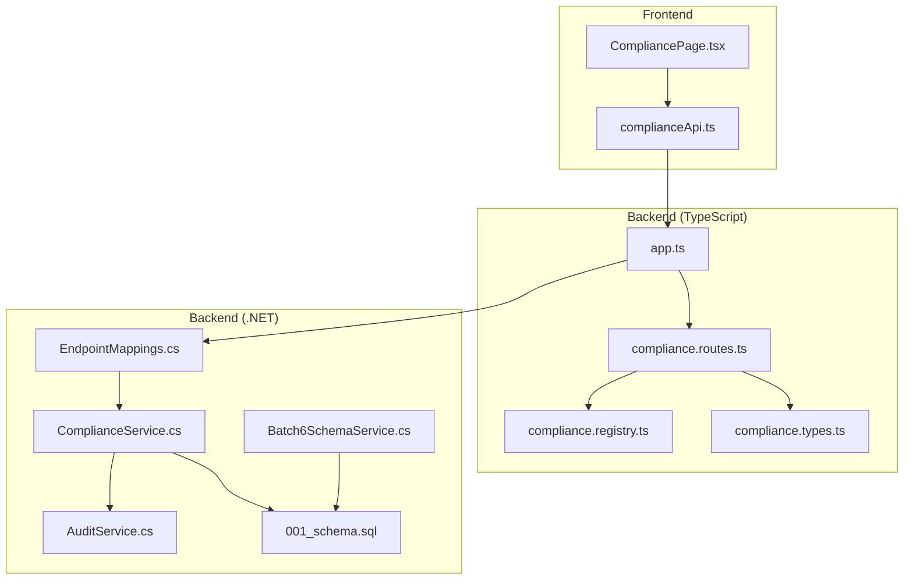
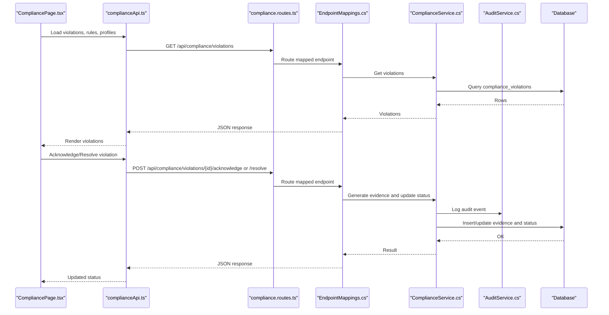
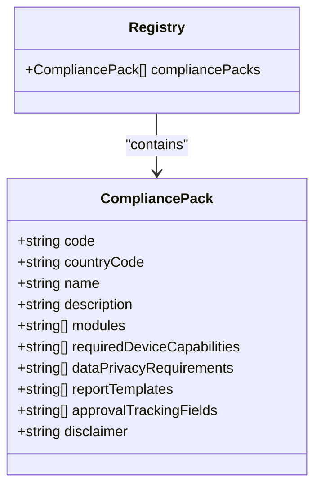
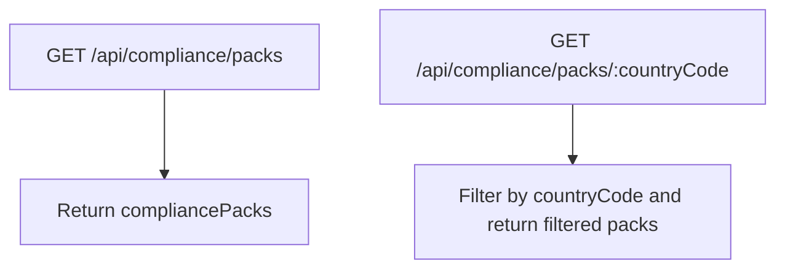
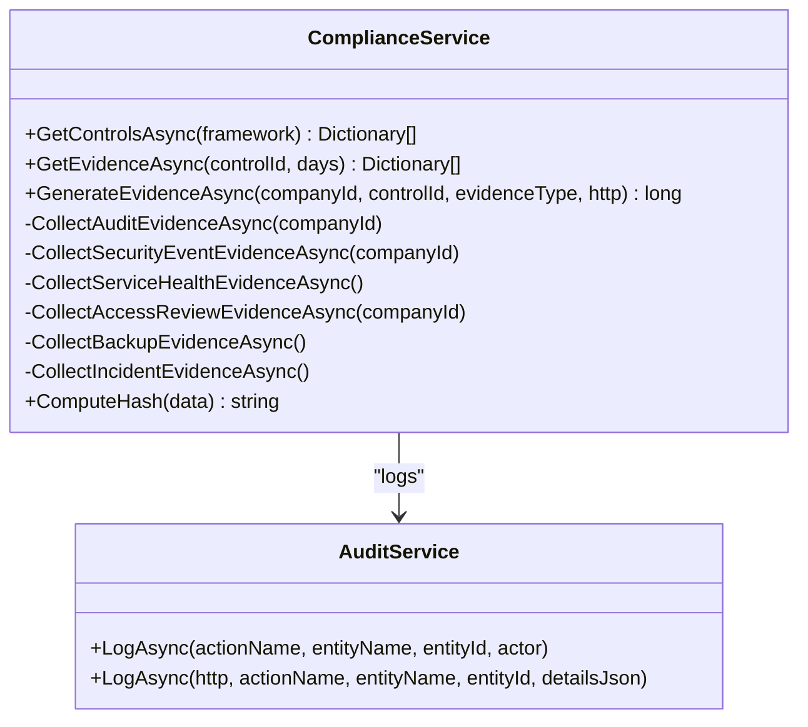
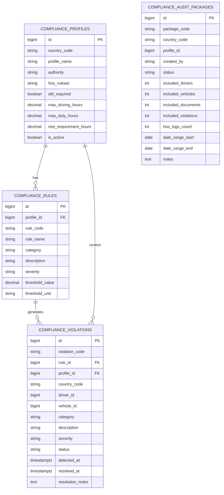
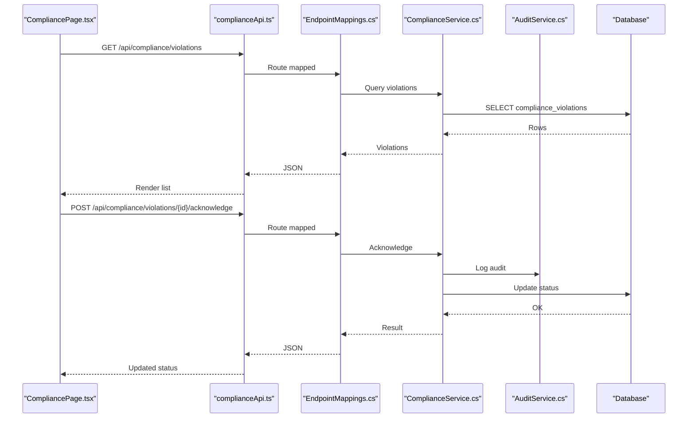
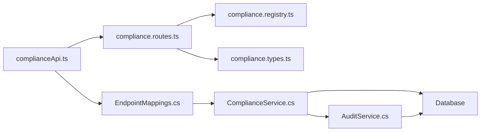

# Compliance Services

<cite>
**Referenced Files in This Document**
- [compliance.registry.ts](file://backend/src/modules/compliance/compliance.registry.ts)
- [compliance.routes.ts](file://backend/src/modules/compliance/compliance.routes.ts)
- [compliance.types.ts](file://backend/src/modules/compliance/compliance.types.ts)
- [complianceApi.ts](file://frontend/src/services/complianceApi.ts)
- [ComplianceService.cs](file://backend-dotnet/Services/ComplianceService.cs)
- [AuditService.cs](file://backend-dotnet/Services/AuditService.cs)
- [Batch6SchemaService.cs](file://backend-dotnet/Services/Batch6SchemaService.cs)
- [EndpointMappings.cs](file://backend-dotnet/Controllers/EndpointMappings.cs)
- [001_schema.sql](file://db/init/001_schema.sql)
- [app.ts](file://backend/src/app.ts)
- [CompliancePage.tsx](file://frontend/src/pages/CompliancePage.tsx)
</cite>

## Table of Contents
1. [Introduction](#introduction)
2. [Project Structure](#project-structure)
3. [Core Components](#core-components)
4. [Architecture Overview](#architecture-overview)
5. [Detailed Component Analysis](#detailed-component-analysis)
6. [Dependency Analysis](#dependency-analysis)
7. [Performance Considerations](#performance-considerations)
8. [Troubleshooting Guide](#troubleshooting-guide)
9. [Conclusion](#conclusion)
10. [Appendices](#appendices)

## Introduction
This document describes the compliance service functionality across the platform, focusing on regulatory compliance enforcement, policy validation, automated compliance checking, and integrated reporting. It explains the compliance rule engine, policy configuration, violation detection, and audit trail generation. It also covers integration points with external compliance frameworks, monitoring, alerting, and remediation processes.

## Project Structure
The compliance domain spans both the backend TypeScript Express API and the backend C# API:
- Frontend service client for compliance endpoints
- Backend Express routes exposing compliance packs and related endpoints
- Backend C# services implementing compliance controls, evidence generation, and audit logging
- Database schema supporting compliance profiles, rules, violations, and audit packages
- UI page for viewing and managing violations

**Diagram sources**
- [app.ts:1-97](file://backend/src/app.ts#L1-L97)
- [compliance.routes.ts:1-24](file://backend/src/modules/compliance/compliance.routes.ts#L1-L24)
- [compliance.registry.ts:1-142](file://backend/src/modules/compliance/compliance.registry.ts#L1-L142)
- [compliance.types.ts:1-13](file://backend/src/modules/compliance/compliance.types.ts#L1-L13)
- [complianceApi.ts:1-108](file://frontend/src/services/complianceApi.ts#L1-L108)
- [ComplianceService.cs:1-241](file://backend-dotnet/Services/ComplianceService.cs#L1-L241)
- [AuditService.cs:1-48](file://backend-dotnet/Services/AuditService.cs#L1-L48)
- [Batch6SchemaService.cs:112-442](file://backend-dotnet/Services/Batch6SchemaService.cs#L112-L442)
- [001_schema.sql:222-263](file://db/init/001_schema.sql#L222-L263)
- [EndpointMappings.cs:1110-1114](file://backend-dotnet/Controllers/EndpointMappings.cs#L1110-L1114)

**Section sources**
- [app.ts:1-97](file://backend/src/app.ts#L1-L97)
- [compliance.routes.ts:1-24](file://backend/src/modules/compliance/compliance.routes.ts#L1-L24)
- [compliance.registry.ts:1-142](file://backend/src/modules/compliance/compliance.registry.ts#L1-L142)
- [compliance.types.ts:1-13](file://backend/src/modules/compliance/compliance.types.ts#L1-L13)
- [complianceApi.ts:1-108](file://frontend/src/services/complianceApi.ts#L1-L108)
- [ComplianceService.cs:1-241](file://backend-dotnet/Services/ComplianceService.cs#L1-L241)
- [AuditService.cs:1-48](file://backend-dotnet/Services/AuditService.cs#L1-L48)
- [Batch6SchemaService.cs:112-442](file://backend-dotnet/Services/Batch6SchemaService.cs#L112-L442)
- [001_schema.sql:222-263](file://db/init/001_schema.sql#L222-L263)
- [EndpointMappings.cs:1110-1114](file://backend-dotnet/Controllers/EndpointMappings.cs#L1110-L1114)

## Core Components
- Compliance Packs registry: Defines country-specific compliance packs with modules, device capabilities, privacy requirements, report templates, and approval tracking fields.
- Compliance routes: Exposes endpoints to fetch compliance packs by country and all packs.
- Compliance API client: Provides typed methods for summaries, rules, violations, acknowledgment/resolution, audit packages, and related endpoints.
- Compliance service (.NET): Implements controls retrieval, evidence collection from real system data, hashing, and audit logging.
- Audit service (.NET): Centralized audit logging for compliance actions.
- Database schema: Stores compliance profiles, rules, violations, audit packages, and audit logs.

**Section sources**
- [compliance.registry.ts:1-142](file://backend/src/modules/compliance/compliance.registry.ts#L1-L142)
- [compliance.routes.ts:1-24](file://backend/src/modules/compliance/compliance.routes.ts#L1-L24)
- [complianceApi.ts:1-108](file://frontend/src/services/complianceApi.ts#L1-L108)
- [ComplianceService.cs:26-131](file://backend-dotnet/Services/ComplianceService.cs#L26-L131)
- [AuditService.cs:7-47](file://backend-dotnet/Services/AuditService.cs#L7-L47)
- [Batch6SchemaService.cs:122-283](file://backend-dotnet/Services/Batch6SchemaService.cs#L122-L283)
- [001_schema.sql:251-262](file://db/init/001_schema.sql#L251-L262)

## Architecture Overview
The compliance system integrates frontend UI, backend Express routes, and backend .NET services:
- Frontend calls compliance endpoints via a typed API client.
- Backend Express routes serve compliance packs and related endpoints.
- Backend .NET handles compliance controls, evidence generation, and audit trails.
- Database stores compliance data and audit logs.

**Diagram sources**
- [complianceApi.ts:33-58](file://frontend/src/services/complianceApi.ts#L33-L58)
- [compliance.routes.ts:6-21](file://backend/src/modules/compliance/compliance.routes.ts#L6-L21)
- [EndpointMappings.cs:1110-1114](file://backend-dotnet/Controllers/EndpointMappings.cs#L1110-L1114)
- [ComplianceService.cs:48-131](file://backend-dotnet/Services/ComplianceService.cs#L48-L131)
- [AuditService.cs:9-46](file://backend-dotnet/Services/AuditService.cs#L9-L46)

## Detailed Component Analysis

### Compliance Packs Registry
Defines country-specific compliance packs with metadata such as modules, device capabilities, privacy requirements, report templates, and approval tracking fields. This enables policy configuration per jurisdiction and drives downstream UI and reporting.

**Diagram sources**
- [compliance.types.ts:1-13](file://backend/src/modules/compliance/compliance.types.ts#L1-L13)
- [compliance.registry.ts:3-141](file://backend/src/modules/compliance/compliance.registry.ts#L3-L141)

**Section sources**
- [compliance.registry.ts:1-142](file://backend/src/modules/compliance/compliance.registry.ts#L1-L142)
- [compliance.types.ts:1-13](file://backend/src/modules/compliance/compliance.types.ts#L1-L13)

### Compliance Routes
Exposes endpoints to list all compliance packs and filter by country code. These routes integrate with the frontend API client.

**Diagram sources**
- [compliance.routes.ts:6-21](file://backend/src/modules/compliance/compliance.routes.ts#L6-L21)

**Section sources**
- [compliance.routes.ts:1-24](file://backend/src/modules/compliance/compliance.routes.ts#L1-L24)

### Compliance API Client
Provides typed methods for:
- Compliance summaries, profiles, rules
- Violations and single violation details
- Acknowledgment and resolution of violations
- Audit packages lifecycle (create, finalize)
- Cross-border watch, driver/vehicle status
- AI recommendations

Fallbacks ensure UI stability when backend endpoints are unavailable.

**Section sources**
- [complianceApi.ts:1-108](file://frontend/src/services/complianceApi.ts#L1-L108)

### Compliance Controls and Evidence Engine (.NET)
The ComplianceService retrieves controls and evidence, generates evidence from real system data, computes SHA-256 hashes, and logs audit events. Evidence sources include audit logs, security events, service run history, access reviews, backup verifications, and incident resolution.

**Diagram sources**
- [ComplianceService.cs:26-131](file://backend-dotnet/Services/ComplianceService.cs#L26-L131)
- [AuditService.cs:7-47](file://backend-dotnet/Services/AuditService.cs#L7-L47)

**Section sources**
- [ComplianceService.cs:26-241](file://backend-dotnet/Services/ComplianceService.cs#L26-L241)
- [AuditService.cs:1-48](file://backend-dotnet/Services/AuditService.cs#L1-L48)

### Database Schema for Compliance
The schema defines tables for compliance profiles, rules, violations, and audit packages, enabling policy configuration, automated checks, and audit trail generation.

**Diagram sources**
- [Batch6SchemaService.cs:122-283](file://backend-dotnet/Services/Batch6SchemaService.cs#L122-L283)
- [001_schema.sql:251-262](file://db/init/001_schema.sql#L251-L262)

**Section sources**
- [Batch6SchemaService.cs:122-442](file://backend-dotnet/Services/Batch6SchemaService.cs#L122-L442)
- [001_schema.sql:251-262](file://db/init/001_schema.sql#L251-L262)

### Violation Detection and Management
The backend exposes endpoints to list and retrieve violations, while the frontend renders them and supports acknowledgment and resolution actions. The backend service generates evidence and updates statuses, ensuring auditability.

**Diagram sources**
- [EndpointMappings.cs:1110-1114](file://backend-dotnet/Controllers/EndpointMappings.cs#L1110-L1114)
- [CompliancePage.tsx:223-458](file://frontend/src/pages/CompliancePage.tsx#L223-L458)
- [complianceApi.ts:40-44](file://frontend/src/services/complianceApi.ts#L40-L44)
- [ComplianceService.cs:80-131](file://backend-dotnet/Services/ComplianceService.cs#L80-L131)
- [AuditService.cs:9-46](file://backend-dotnet/Services/AuditService.cs#L9-L46)

**Section sources**
- [EndpointMappings.cs:1110-1114](file://backend-dotnet/Controllers/EndpointMappings.cs#L1110-L1114)
- [CompliancePage.tsx:223-458](file://frontend/src/pages/CompliancePage.tsx#L223-L458)
- [complianceApi.ts:33-58](file://frontend/src/services/complianceApi.ts#L33-L58)
- [ComplianceService.cs:48-131](file://backend-dotnet/Services/ComplianceService.cs#L48-L131)

### Compliance Monitoring and Reporting
- Controls and evidence: Retrieve controls and recent evidence for compliance monitoring.
- Audit packages: Create and finalize audit packages for external audits.
- Cross-border watch: Track regulatory changes by region.
- AI recommendations: Provide actionable insights derived from compliance data.

**Section sources**
- [complianceApi.ts:51-58](file://frontend/src/services/complianceApi.ts#L51-L58)
- [complianceApi.ts:45-50](file://frontend/src/services/complianceApi.ts#L45-L50)
- [EndpointMappings.cs:12745-12764](file://backend-dotnet/Controllers/EndpointMappings.cs#L12745-L12764)

## Dependency Analysis
- Frontend depends on backend Express routes and .NET endpoints for compliance data.
- Backend Express routes depend on registry and types for compliance packs.
- Backend .NET services depend on database schema and audit service for evidence and logging.
- Audit logs are persisted in the database and used for evidence generation.

**Diagram sources**
- [complianceApi.ts:1-108](file://frontend/src/services/complianceApi.ts#L1-L108)
- [compliance.routes.ts:1-24](file://backend/src/modules/compliance/compliance.routes.ts#L1-L24)
- [compliance.registry.ts:1-142](file://backend/src/modules/compliance/compliance.registry.ts#L1-L142)
- [compliance.types.ts:1-13](file://backend/src/modules/compliance/compliance.types.ts#L1-L13)
- [EndpointMappings.cs:1110-1114](file://backend-dotnet/Controllers/EndpointMappings.cs#L1110-L1114)
- [ComplianceService.cs:26-131](file://backend-dotnet/Services/ComplianceService.cs#L26-L131)
- [AuditService.cs:7-47](file://backend-dotnet/Services/AuditService.cs#L7-L47)

**Section sources**
- [app.ts:91-94](file://backend/src/app.ts#L91-L94)
- [compliance.routes.ts:1-24](file://backend/src/modules/compliance/compliance.routes.ts#L1-L24)
- [compliance.registry.ts:1-142](file://backend/src/modules/compliance/compliance.registry.ts#L1-L142)
- [compliance.types.ts:1-13](file://backend/src/modules/compliance/compliance.types.ts#L1-L13)
- [complianceApi.ts:1-108](file://frontend/src/services/complianceApi.ts#L1-L108)
- [EndpointMappings.cs:1110-1114](file://backend-dotnet/Controllers/EndpointMappings.cs#L1110-L1114)
- [ComplianceService.cs:26-131](file://backend-dotnet/Services/ComplianceService.cs#L26-L131)
- [AuditService.cs:7-47](file://backend-dotnet/Services/AuditService.cs#L7-L47)

## Performance Considerations
- Evidence queries limit result sets and apply date filters to maintain responsiveness.
- Hash computation is deterministic and lightweight for audit trail integrity.
- Rate limiting middleware protects backend endpoints under load.
- Recommendations:
  - Add pagination for large lists of violations and evidence.
  - Index frequently queried columns (e.g., compliance_violations(detected_at), compliance_evidence(generated_at)).
  - Cache compliance packs and profiles where appropriate.

[No sources needed since this section provides general guidance]

## Troubleshooting Guide
- Evidence generation fails: Verify evidence type is supported and system data exists for the selected period.
- Audit logs missing: Confirm audit logging is enabled and the audit service is invoked on compliance actions.
- Violations not updating: Check permissions and endpoint mappings for acknowledgment/resolve operations.
- Rate limits: Inspect rate-limiting configuration and adjust windows/limits if necessary.

**Section sources**
- [ComplianceService.cs:80-131](file://backend-dotnet/Services/ComplianceService.cs#L80-L131)
- [AuditService.cs:9-46](file://backend-dotnet/Services/AuditService.cs#L9-L46)
- [app.ts:42-72](file://backend/src/app.ts#L42-L72)

## Conclusion
The compliance service integrates policy configuration, automated checks, violation detection, and audit trail generation across frontend and backend systems. It supports multiple jurisdictions via compliance packs, ensures evidence integrity through hashing, and provides robust monitoring and remediation workflows.

[No sources needed since this section summarizes without analyzing specific files]

## Appendices

### Compliance Workflows
- Policy configuration: Select a compliance pack by country; configure required device capabilities and privacy controls.
- Automated checks: Rules are enforced against driver/vehicle data; violations are generated and tracked.
- Evidence generation: Real system data is collected, hashed, and stored with retention policies.
- Reporting: Use audit packages and report templates aligned with the selected compliance pack.
- Remediation: Acknowledge and resolve violations; track status and resolution notes.

[No sources needed since this section provides general guidance]