# Data Processing Services

<cite>
**Referenced Files in This Document**
- [DataRetentionService.cs](file://backend-dotnet/Services/DataRetentionService.cs)
- [ExportGovernanceService.cs](file://backend-dotnet/Services/ExportGovernanceService.cs)
- [OpsMetricsService.cs](file://backend-dotnet/Services/OpsMetricsService.cs)
- [ReportingDatasetRegistry.cs](file://backend-dotnet/Services/ReportingDatasetRegistry.cs)
- [ComplianceService.cs](file://backend-dotnet/Services/ComplianceService.cs)
- [TelemetryBackgroundService.cs](file://backend-dotnet/Services/TelemetryBackgroundService.cs)
- [TripBackgroundService.cs](file://backend-dotnet/Services/TripBackgroundService.cs)
- [ScheduledReportBackgroundService.cs](file://backend-dotnet/Services/ScheduledReportBackgroundService.cs)
- [MaintenanceBackgroundService.cs](file://backend-dotnet/Services/MaintenanceBackgroundService.cs)
- [SafetyBackgroundService.cs](file://backend-dotnet/Services/SafetyBackgroundService.cs)
- [ServiceRunTracker.cs](file://backend-dotnet/Services/ServiceRunTracker.cs)
- [AuditService.cs](file://backend-dotnet/Services/AuditService.cs)
- [SecurityEventService.cs](file://backend-dotnet/Services/SecurityEventService.cs)
- [NotificationService.cs](file://backend-dotnet/Services/NotificationService.cs)
- [001_schema.sql](file://db/init/001_schema.sql)
</cite>

## Table of Contents
1. [Introduction](#introduction)
2. [Project Structure](#project-structure)
3. [Core Components](#core-components)
4. [Architecture Overview](#architecture-overview)
5. [Detailed Component Analysis](#detailed-component-analysis)
6. [Dependency Analysis](#dependency-analysis)
7. [Performance Considerations](#performance-considerations)
8. [Troubleshooting Guide](#troubleshooting-guide)
9. [Conclusion](#conclusion)

## Introduction
This document describes the data processing services that power operational insights, compliance, reporting, and lifecycle management across the platform. It covers:
- Data retention policies and legal holds
- Automated cleanup and background processing
- Export governance and approvals
- Reporting dataset registry and secure query building
- Operational metrics collection and monitoring
- Real-time and batch data transformations
- Examples of retention rule configuration, export workflows, and metrics aggregation
- Data quality validation, performance optimization, and monitoring

## Project Structure
The data processing domain spans backend services and background workers that operate on PostgreSQL tables. Key areas:
- Tenant-aware data retention and compliance
- Secure, audited reporting datasets
- Operational metrics aggregation
- Background services for telemetry, trips, safety, maintenance, and scheduled reports
- Audit and security event logging for governance

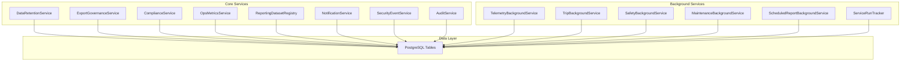

**Diagram sources**
- [DataRetentionService.cs:16-113](file://backend-dotnet/Services/DataRetentionService.cs#L16-L113)
- [ExportGovernanceService.cs:19-155](file://backend-dotnet/Services/ExportGovernanceService.cs#L19-L155)
- [ComplianceService.cs:26-241](file://backend-dotnet/Services/ComplianceService.cs#L26-L241)
- [OpsMetricsService.cs:13-264](file://backend-dotnet/Services/OpsMetricsService.cs#L13-L264)
- [ReportingDatasetRegistry.cs:117-563](file://backend-dotnet/Services/ReportingDatasetRegistry.cs#L117-L563)
- [NotificationService.cs:5-184](file://backend-dotnet/Services/NotificationService.cs#L5-L184)
- [SecurityEventService.cs:31-152](file://backend-dotnet/Services/SecurityEventService.cs#L31-L152)
- [AuditService.cs:7-48](file://backend-dotnet/Services/AuditService.cs#L7-L48)
- [TelemetryBackgroundService.cs:9-103](file://backend-dotnet/Services/TelemetryBackgroundService.cs#L9-L103)
- [TripBackgroundService.cs:17-542](file://backend-dotnet/Services/TripBackgroundService.cs#L17-L542)
- [SafetyBackgroundService.cs:13-295](file://backend-dotnet/Services/SafetyBackgroundService.cs#L13-L295)
- [MaintenanceBackgroundService.cs:11-306](file://backend-dotnet/Services/MaintenanceBackgroundService.cs#L11-L306)
- [ScheduledReportBackgroundService.cs:26-364](file://backend-dotnet/Services/ScheduledReportBackgroundService.cs#L26-L364)
- [ServiceRunTracker.cs:22-205](file://backend-dotnet/Services/ServiceRunTracker.cs#L22-L205)

**Section sources**
- [DataRetentionService.cs:16-113](file://backend-dotnet/Services/DataRetentionService.cs#L16-L113)
- [ExportGovernanceService.cs:19-155](file://backend-dotnet/Services/ExportGovernanceService.cs#L19-L155)
- [OpsMetricsService.cs:13-264](file://backend-dotnet/Services/OpsMetricsService.cs#L13-L264)
- [ReportingDatasetRegistry.cs:117-563](file://backend-dotnet/Services/ReportingDatasetRegistry.cs#L117-L563)
- [ComplianceService.cs:26-241](file://backend-dotnet/Services/ComplianceService.cs#L26-L241)
- [TelemetryBackgroundService.cs:9-103](file://backend-dotnet/Services/TelemetryBackgroundService.cs#L9-L103)
- [TripBackgroundService.cs:17-542](file://backend-dotnet/Services/TripBackgroundService.cs#L17-L542)
- [ScheduledReportBackgroundService.cs:26-364](file://backend-dotnet/Services/ScheduledReportBackgroundService.cs#L26-L364)
- [MaintenanceBackgroundService.cs:11-306](file://backend-dotnet/Services/MaintenanceBackgroundService.cs#L11-L306)
- [SafetyBackgroundService.cs:13-295](file://backend-dotnet/Services/SafetyBackgroundService.cs#L13-L295)
- [ServiceRunTracker.cs:22-205](file://backend-dotnet/Services/ServiceRunTracker.cs#L22-L205)
- [AuditService.cs:7-48](file://backend-dotnet/Services/AuditService.cs#L7-L48)
- [SecurityEventService.cs:31-152](file://backend-dotnet/Services/SecurityEventService.cs#L31-L152)
- [NotificationService.cs:5-184](file://backend-dotnet/Services/NotificationService.cs#L5-L184)
- [001_schema.sql:1-200](file://db/init/001_schema.sql#L1-L200)

## Core Components
- Data retention and legal holds: tenant-scoped policies with defaults and enforcement guardrails.
- Export governance: approval workflow for exports with audit and security event logging.
- Reporting dataset registry: strict, whitelist-based query builder with tenant scoping and permission checks.
- Operational metrics: snapshot aggregation across telemetry, alerts, safety, dispatch, notifications, reports, services, incidents, and DB health.
- Background services: periodic processing for telemetry staleness, trip lifecycle, safety conversions, maintenance PM rules, and scheduled reports.
- Governance logging: audit trail and security events for compliance-ready evidence.

**Section sources**
- [DataRetentionService.cs:16-113](file://backend-dotnet/Services/DataRetentionService.cs#L16-L113)
- [ExportGovernanceService.cs:19-155](file://backend-dotnet/Services/ExportGovernanceService.cs#L19-L155)
- [ReportingDatasetRegistry.cs:117-563](file://backend-dotnet/Services/ReportingDatasetRegistry.cs#L117-L563)
- [OpsMetricsService.cs:13-264](file://backend-dotnet/Services/OpsMetricsService.cs#L13-L264)
- [TelemetryBackgroundService.cs:9-103](file://backend-dotnet/Services/TelemetryBackgroundService.cs#L9-L103)
- [TripBackgroundService.cs:17-542](file://backend-dotnet/Services/TripBackgroundService.cs#L17-L542)
- [SafetyBackgroundService.cs:13-295](file://backend-dotnet/Services/SafetyBackgroundService.cs#L13-L295)
- [MaintenanceBackgroundService.cs:11-306](file://backend-dotnet/Services/MaintenanceBackgroundService.cs#L11-L306)
- [ScheduledReportBackgroundService.cs:26-364](file://backend-dotnet/Services/ScheduledReportBackgroundService.cs#L26-L364)
- [AuditService.cs:7-48](file://backend-dotnet/Services/AuditService.cs#L7-L48)
- [SecurityEventService.cs:31-152](file://backend-dotnet/Services/SecurityEventService.cs#L31-L152)

## Architecture Overview
The system separates concerns into:
- API-facing services for policy, export, and reporting
- Background services for continuous data processing and lifecycle tasks
- Centralized audit and security logging for compliance
- Metrics aggregation for platform observability

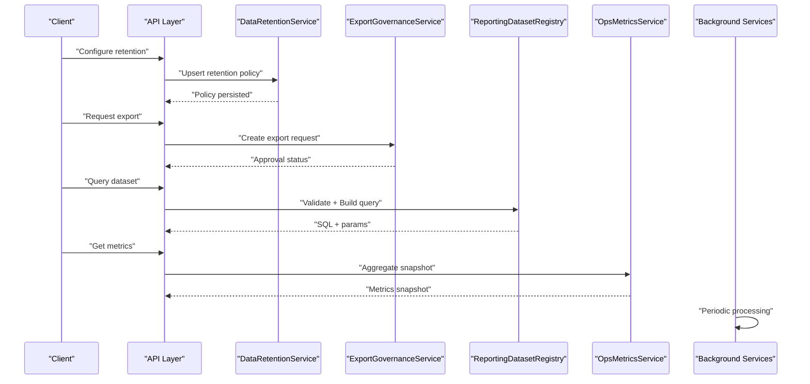

**Diagram sources**
- [DataRetentionService.cs:56-112](file://backend-dotnet/Services/DataRetentionService.cs#L56-L112)
- [ExportGovernanceService.cs:21-63](file://backend-dotnet/Services/ExportGovernanceService.cs#L21-L63)
- [ReportingDatasetRegistry.cs:582-793](file://backend-dotnet/Services/ReportingDatasetRegistry.cs#L582-L793)
- [OpsMetricsService.cs:15-42](file://backend-dotnet/Services/OpsMetricsService.cs#L15-L42)
- [TelemetryBackgroundService.cs:17-44](file://backend-dotnet/Services/TelemetryBackgroundService.cs#L17-L44)
- [TripBackgroundService.cs:39-82](file://backend-dotnet/Services/TripBackgroundService.cs#L39-L82)
- [SafetyBackgroundService.cs:31-59](file://backend-dotnet/Services/SafetyBackgroundService.cs#L31-L59)
- [MaintenanceBackgroundService.cs:18-39](file://backend-dotnet/Services/MaintenanceBackgroundService.cs#L18-L39)
- [ScheduledReportBackgroundService.cs:34-61](file://backend-dotnet/Services/ScheduledReportBackgroundService.cs#L34-L61)

## Detailed Component Analysis

### Data Retention Policies
- Purpose: Enforce tenant-level retention windows and legal holds.
- Defaults: Minimum safe values for audit logs, telemetry, notifications, reports, and security events.
- Legal hold: Immutable protection requiring explicit action; cannot be disabled via policy upsert.
- Enforcement: Policy storage only; physical deletion is delegated to a separate retention worker.

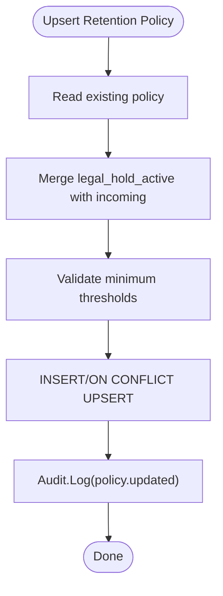

**Diagram sources**
- [DataRetentionService.cs:56-112](file://backend-dotnet/Services/DataRetentionService.cs#L56-L112)

**Section sources**
- [DataRetentionService.cs:16-113](file://backend-dotnet/Services/DataRetentionService.cs#L16-L113)

### Export Governance Workflow
- Purpose: Controlled export with optional approval and audit/logging.
- Flow: Request creation, optional approval/rejection, and security event logging.
- Approval gating: Determined by tenant configuration; otherwise auto-approved.

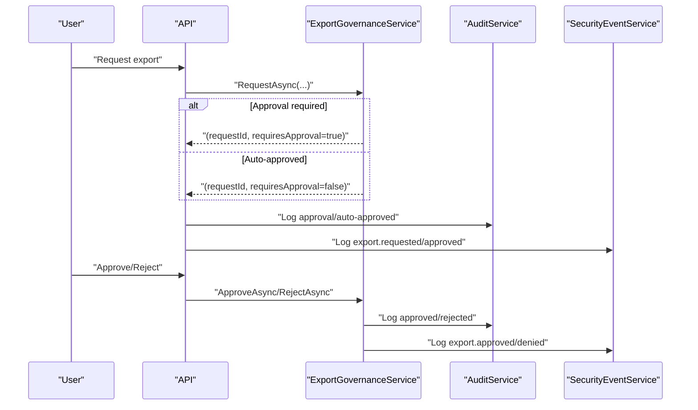

**Diagram sources**
- [ExportGovernanceService.cs:21-153](file://backend-dotnet/Services/ExportGovernanceService.cs#L21-L153)
- [AuditService.cs:23-46](file://backend-dotnet/Services/AuditService.cs#L23-L46)
- [SecurityEventService.cs:33-70](file://backend-dotnet/Services/SecurityEventService.cs#L33-L70)

**Section sources**
- [ExportGovernanceService.cs:19-155](file://backend-dotnet/Services/ExportGovernanceService.cs#L19-L155)
- [AuditService.cs:7-48](file://backend-dotnet/Services/AuditService.cs#L7-L48)
- [SecurityEventService.cs:31-152](file://backend-dotnet/Services/SecurityEventService.cs#L31-L152)

### Reporting Dataset Registry and Secure Query Builder
- Purpose: Define datasets and fields, enforce permissions, and build parameterized queries.
- Security model: Whitelist-only fields/operators, tenant alias scoping, sensitive-field gating, and strict limits.
- Query pipeline: Validate → Build SQL + params → Execute count/data → Limit page size.

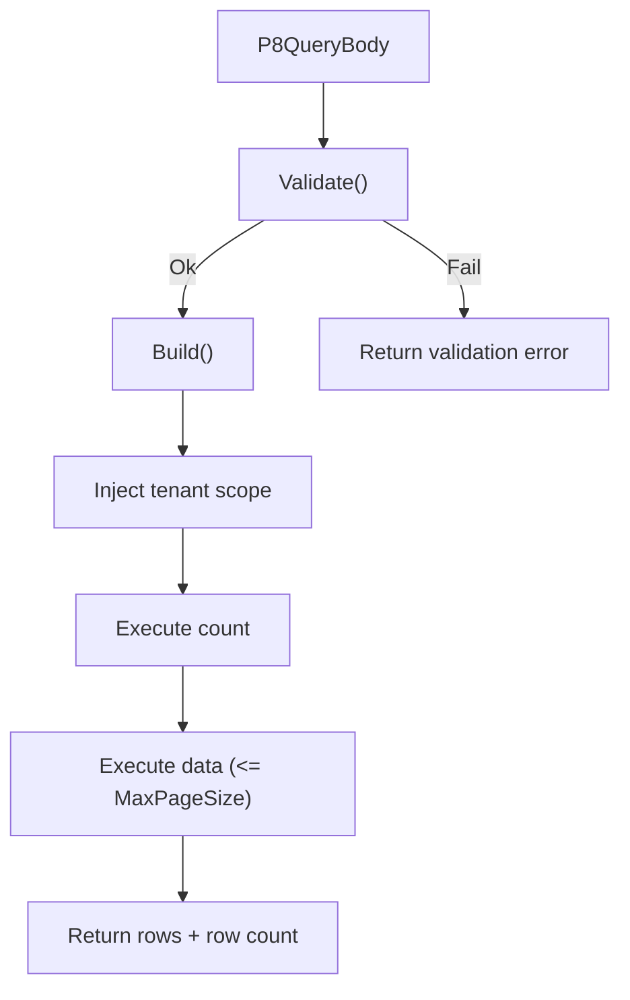

**Diagram sources**
- [ReportingDatasetRegistry.cs:582-793](file://backend-dotnet/Services/ReportingDatasetRegistry.cs#L582-L793)

**Section sources**
- [ReportingDatasetRegistry.cs:117-563](file://backend-dotnet/Services/ReportingDatasetRegistry.cs#L117-L563)
- [ReportingDatasetRegistry.cs:582-793](file://backend-dotnet/Services/ReportingDatasetRegistry.cs#L582-L793)

### Operational Metrics Collection
- Purpose: Aggregate platform-wide operational signals without exposing PII.
- Snapshot: Telemetry, alerts, safety, dispatch, notifications, reports, service heartbeats, incidents, and DB status.
- Parallelism: Metrics queries run concurrently and combined into a single snapshot.

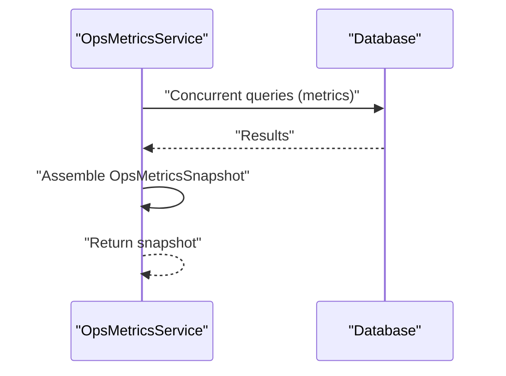

**Diagram sources**
- [OpsMetricsService.cs:15-42](file://backend-dotnet/Services/OpsMetricsService.cs#L15-L42)

**Section sources**
- [OpsMetricsService.cs:13-264](file://backend-dotnet/Services/OpsMetricsService.cs#L13-L264)

### Background Services: Telemetry Staleness and Nonce Cleanup
- Frequency: Every 5 minutes.
- Actions: Create stale-device alerts for vehicles exceeding thresholds and prune expired nonces.

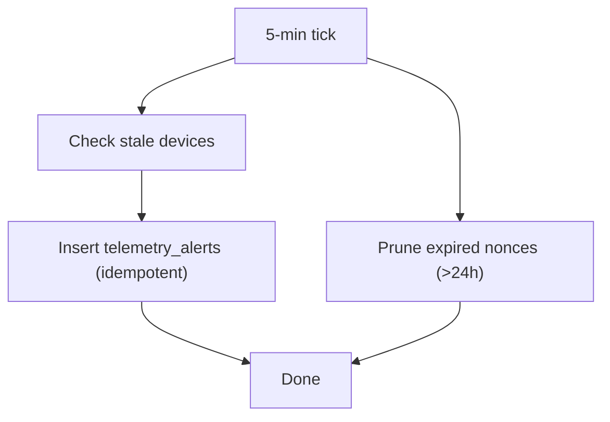

**Diagram sources**
- [TelemetryBackgroundService.cs:17-44](file://backend-dotnet/Services/TelemetryBackgroundService.cs#L17-L44)
- [TelemetryBackgroundService.cs:46-101](file://backend-dotnet/Services/TelemetryBackgroundService.cs#L46-L101)

**Section sources**
- [TelemetryBackgroundService.cs:9-103](file://backend-dotnet/Services/TelemetryBackgroundService.cs#L9-L103)

### Background Services: Trip Lifecycle Management
- Frequency: Every 5 minutes.
- Steps: Create trips from active routes, bind location events, detect stop completions, compute compliance, generate safety events, finalize trips.

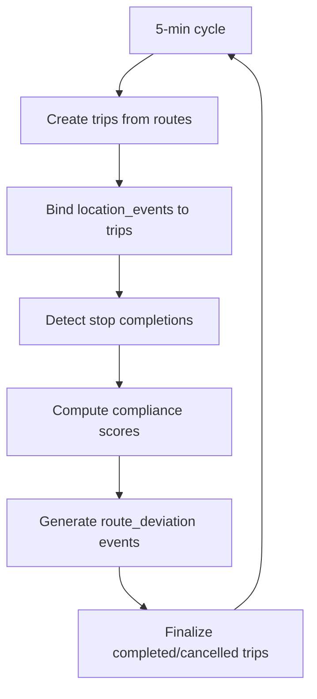

**Diagram sources**
- [TripBackgroundService.cs:63-82](file://backend-dotnet/Services/TripBackgroundService.cs#L63-L82)
- [TripBackgroundService.cs:85-173](file://backend-dotnet/Services/TripBackgroundService.cs#L85-L173)
- [TripBackgroundService.cs:176-214](file://backend-dotnet/Services/TripBackgroundService.cs#L176-L214)
- [TripBackgroundService.cs:217-272](file://backend-dotnet/Services/TripBackgroundService.cs#L217-L272)
- [TripBackgroundService.cs:275-402](file://backend-dotnet/Services/TripBackgroundService.cs#L275-L402)
- [TripBackgroundService.cs:405-502](file://backend-dotnet/Services/TripBackgroundService.cs#L405-L502)
- [TripBackgroundService.cs:505-540](file://backend-dotnet/Services/TripBackgroundService.cs#L505-L540)

**Section sources**
- [TripBackgroundService.cs:17-542](file://backend-dotnet/Services/TripBackgroundService.cs#L17-L542)

### Background Services: Safety Event Conversion and Driver Scores
- Frequency: Every 5 minutes.
- Actions: Convert telemetry alerts to safety events (idempotent), detect repeated speeding, and recompute driver safety scores.

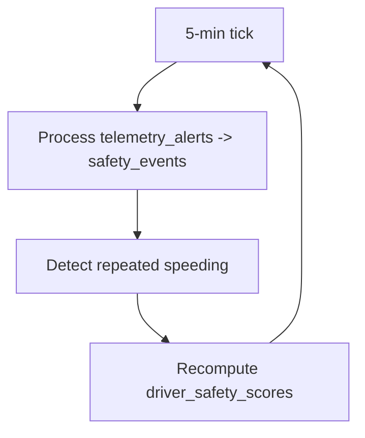

**Diagram sources**
- [SafetyBackgroundService.cs:63-145](file://backend-dotnet/Services/SafetyBackgroundService.cs#L63-L145)
- [SafetyBackgroundService.cs:149-203](file://backend-dotnet/Services/SafetyBackgroundService.cs#L149-L203)
- [SafetyBackgroundService.cs:206-253](file://backend-dotnet/Services/SafetyBackgroundService.cs#L206-L253)

**Section sources**
- [SafetyBackgroundService.cs:13-295](file://backend-dotnet/Services/SafetyBackgroundService.cs#L13-L295)

### Background Services: Maintenance PM Rules and Vehicle Availability
- Frequency: Every 15 minutes.
- Actions: Evaluate preventive maintenance rules, generate maintenance items, update vehicle availability, and handle dispatch holds.

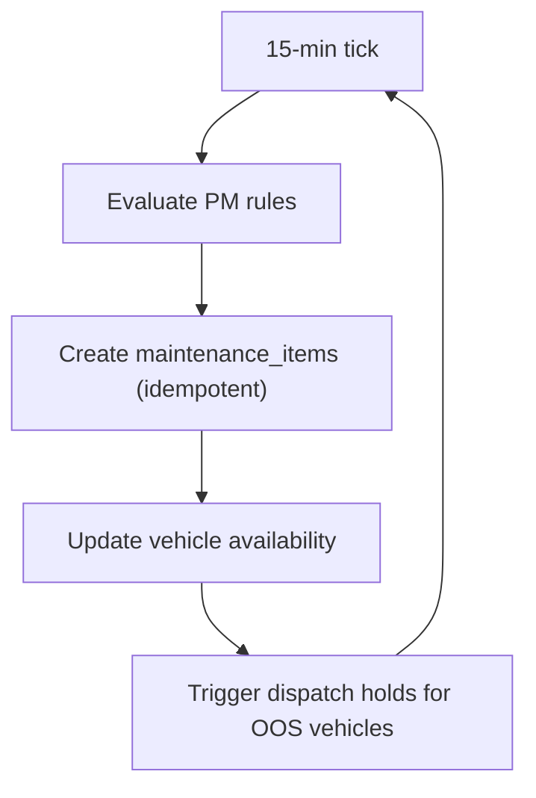

**Diagram sources**
- [MaintenanceBackgroundService.cs:51-177](file://backend-dotnet/Services/MaintenanceBackgroundService.cs#L51-L177)
- [MaintenanceBackgroundService.cs:185-301](file://backend-dotnet/Services/MaintenanceBackgroundService.cs#L185-L301)

**Section sources**
- [MaintenanceBackgroundService.cs:11-306](file://backend-dotnet/Services/MaintenanceBackgroundService.cs#L11-L306)

### Background Services: Scheduled Reports Execution
- Frequency: Every 5 minutes.
- Actions: Resolve due schedules, rebuild queries from saved reports, execute, log execution, and deliver in-app notifications.

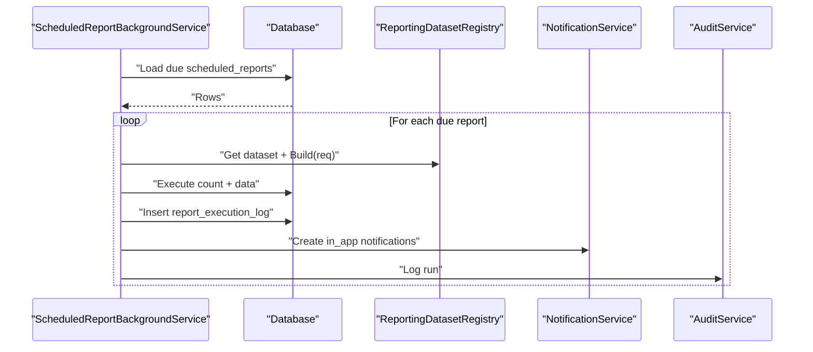

**Diagram sources**
- [ScheduledReportBackgroundService.cs:63-120](file://backend-dotnet/Services/ScheduledReportBackgroundService.cs#L63-L120)
- [ScheduledReportBackgroundService.cs:122-256](file://backend-dotnet/Services/ScheduledReportBackgroundService.cs#L122-L256)
- [ReportingDatasetRegistry.cs:582-793](file://backend-dotnet/Services/ReportingDatasetRegistry.cs#L582-L793)
- [NotificationService.cs:11-121](file://backend-dotnet/Services/NotificationService.cs#L11-L121)
- [AuditService.cs:9-21](file://backend-dotnet/Services/AuditService.cs#L9-L21)

**Section sources**
- [ScheduledReportBackgroundService.cs:26-364](file://backend-dotnet/Services/ScheduledReportBackgroundService.cs#L26-L364)
- [ReportingDatasetRegistry.cs:582-793](file://backend-dotnet/Services/ReportingDatasetRegistry.cs#L582-L793)
- [NotificationService.cs:5-184](file://backend-dotnet/Services/NotificationService.cs#L5-L184)
- [AuditService.cs:7-48](file://backend-dotnet/Services/AuditService.cs#L7-L48)

### Compliance Evidence Generation
- Purpose: Produce SOC2-readiness evidence by linking to real system data.
- Sources: Audit logs, security events, service runs, access reviews, backups, and incidents.
- Hashing: SHA-256 of structured evidence metadata.

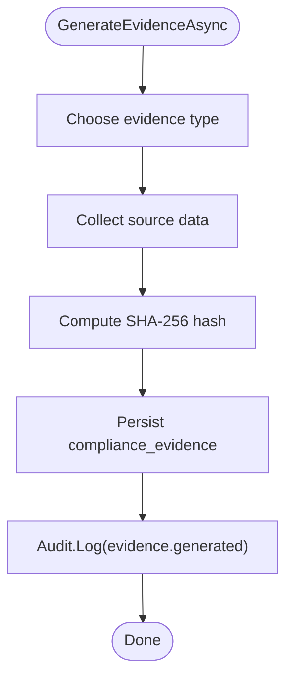

**Diagram sources**
- [ComplianceService.cs:80-131](file://backend-dotnet/Services/ComplianceService.cs#L80-L131)
- [ComplianceService.cs:135-232](file://backend-dotnet/Services/ComplianceService.cs#L135-L232)

**Section sources**
- [ComplianceService.cs:26-241](file://backend-dotnet/Services/ComplianceService.cs#L26-L241)

### Monitoring and Observability
- ServiceRunTracker: Tracks every background service run, heartbeats, sanitized errors, and auto-creates incidents after repeated failures.
- AuditService: Central audit log for policy changes, exports, and compliance actions.
- SecurityEventService: Sanitized security events with IP truncation and UA hashing.

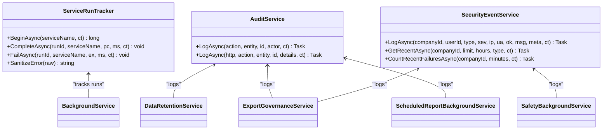

**Diagram sources**
- [ServiceRunTracker.cs:22-205](file://backend-dotnet/Services/ServiceRunTracker.cs#L22-L205)
- [AuditService.cs:7-48](file://backend-dotnet/Services/AuditService.cs#L7-L48)
- [SecurityEventService.cs:31-152](file://backend-dotnet/Services/SecurityEventService.cs#L31-L152)
- [DataRetentionService.cs:109-112](file://backend-dotnet/Services/DataRetentionService.cs#L109-L112)
- [ExportGovernanceService.cs:52-62](file://backend-dotnet/Services/ExportGovernanceService.cs#L52-L62)
- [ScheduledReportBackgroundService.cs:288-289](file://backend-dotnet/Services/ScheduledReportBackgroundService.cs#L288-L289)

**Section sources**
- [ServiceRunTracker.cs:22-205](file://backend-dotnet/Services/ServiceRunTracker.cs#L22-L205)
- [AuditService.cs:7-48](file://backend-dotnet/Services/AuditService.cs#L7-L48)
- [SecurityEventService.cs:31-152](file://backend-dotnet/Services/SecurityEventService.cs#L31-L152)

## Dependency Analysis
- Cohesion: Each service encapsulates a focused responsibility (retention, export, reporting, metrics, compliance).
- Coupling: Background services depend on Database and shared services (AuditService, SecurityEventService, NotificationService). ReportingDatasetRegistry is a pure validator/build utility.
- External dependencies: PostgreSQL tables, background scheduling, and JSON/parameter binding.

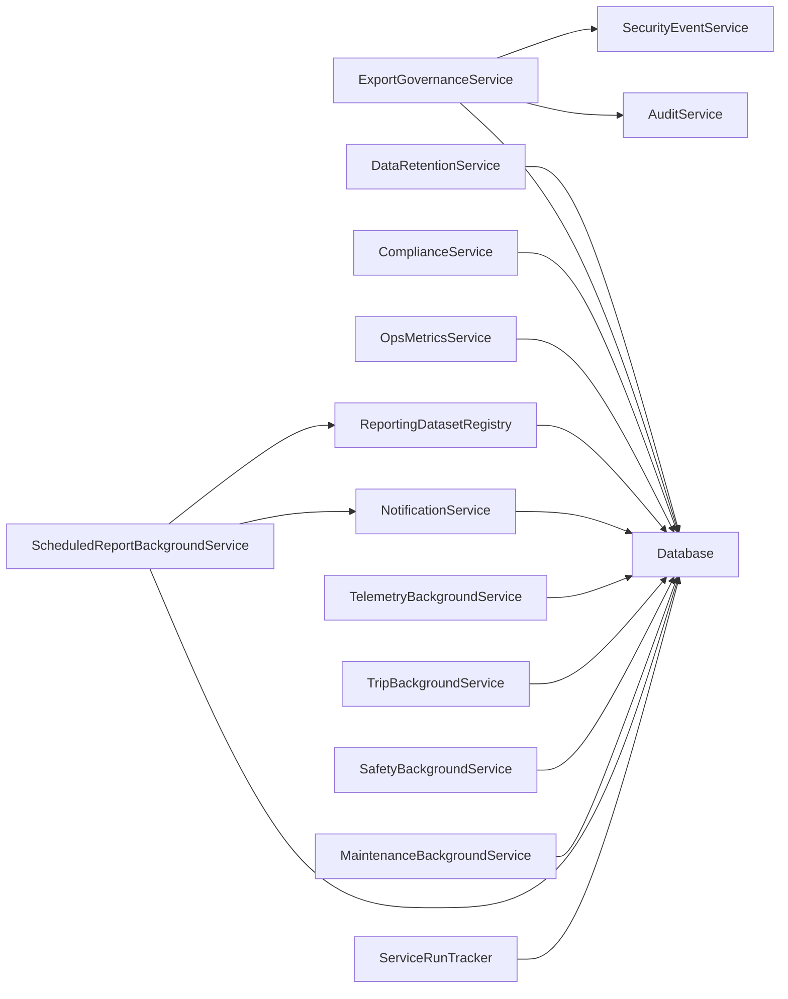

**Diagram sources**
- [DataRetentionService.cs:16-113](file://backend-dotnet/Services/DataRetentionService.cs#L16-L113)
- [ExportGovernanceService.cs:19-155](file://backend-dotnet/Services/ExportGovernanceService.cs#L19-L155)
- [ComplianceService.cs:26-241](file://backend-dotnet/Services/ComplianceService.cs#L26-L241)
- [OpsMetricsService.cs:13-264](file://backend-dotnet/Services/OpsMetricsService.cs#L13-L264)
- [ReportingDatasetRegistry.cs:117-563](file://backend-dotnet/Services/ReportingDatasetRegistry.cs#L117-L563)
- [NotificationService.cs:5-184](file://backend-dotnet/Services/NotificationService.cs#L5-L184)
- [TelemetryBackgroundService.cs:9-103](file://backend-dotnet/Services/TelemetryBackgroundService.cs#L9-L103)
- [TripBackgroundService.cs:17-542](file://backend-dotnet/Services/TripBackgroundService.cs#L17-L542)
- [SafetyBackgroundService.cs:13-295](file://backend-dotnet/Services/SafetyBackgroundService.cs#L13-L295)
- [MaintenanceBackgroundService.cs:11-306](file://backend-dotnet/Services/MaintenanceBackgroundService.cs#L11-L306)
- [ScheduledReportBackgroundService.cs:26-364](file://backend-dotnet/Services/ScheduledReportBackgroundService.cs#L26-L364)
- [ServiceRunTracker.cs:22-205](file://backend-dotnet/Services/ServiceRunTracker.cs#L22-L205)

**Section sources**
- [001_schema.sql:126-200](file://db/init/001_schema.sql#L126-L200)

## Performance Considerations
- Parallel metrics queries: OpsMetricsService executes multiple queries concurrently to reduce latency.
- Background intervals: Carefully tuned cadences balance freshness and load (5–15 minutes).
- Parameterized queries: ReportingDatasetRegistry and background services use parameterized commands to prevent injection and improve plan reuse.
- Limits: Strict caps on fields, filters, and page size in the reporting registry.
- Indexes: Location_events and similar tables include strategic indexes to support time-series queries.
- Deduplication: NotificationService prevents redundant deliveries.

[No sources needed since this section provides general guidance]

## Troubleshooting Guide
- Service failures: ServiceRunTracker sanitizes errors and increments consecutive failures, auto-creating incidents after thresholds.
- Export approvals: Verify export_requests status and audit/security logs for rejection reasons.
- Reporting query errors: Validate dataset keys, fields, and operators via ReportingDatasetRegistry.Validate.
- Metrics anomalies: Check OpsMetricsService snapshots and DB connectivity status.
- Compliance evidence: Confirm evidence generation timestamps and retention windows.

**Section sources**
- [ServiceRunTracker.cs:112-179](file://backend-dotnet/Services/ServiceRunTracker.cs#L112-L179)
- [ExportGovernanceService.cs:96-153](file://backend-dotnet/Services/ExportGovernanceService.cs#L96-L153)
- [ReportingDatasetRegistry.cs:582-656](file://backend-dotnet/Services/ReportingDatasetRegistry.cs#L582-L656)
- [OpsMetricsService.cs:199-212](file://backend-dotnet/Services/OpsMetricsService.cs#L199-L212)
- [ComplianceService.cs:80-131](file://backend-dotnet/Services/ComplianceService.cs#L80-L131)

## Conclusion
The data processing services provide a robust, tenant-scoped foundation for retention, governance, reporting, and observability. They emphasize security through whitelisting and parameterization, reliability via background services and run tracking, and compliance readiness through audit and evidence generation. Operators can configure retention, govern exports, query curated datasets, and monitor platform health with confidence.