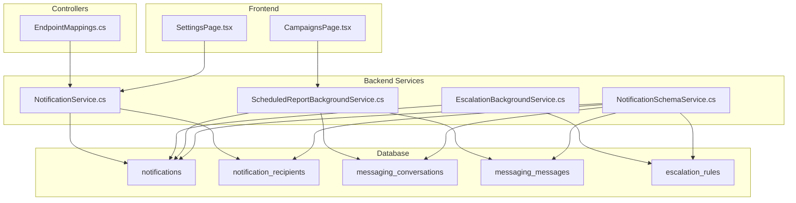
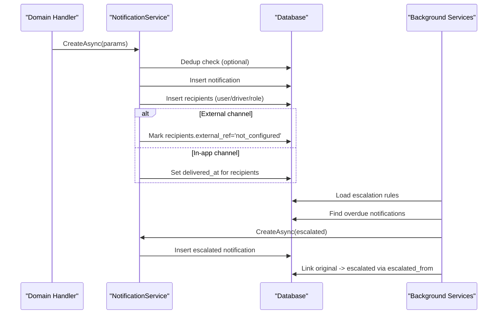
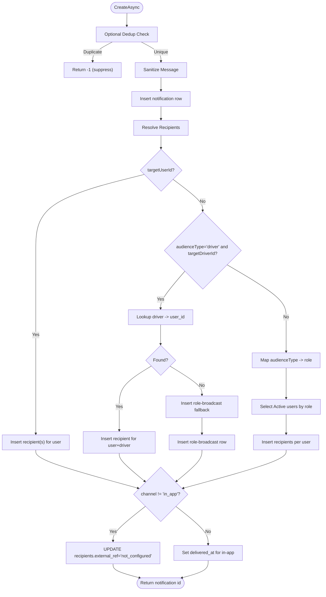
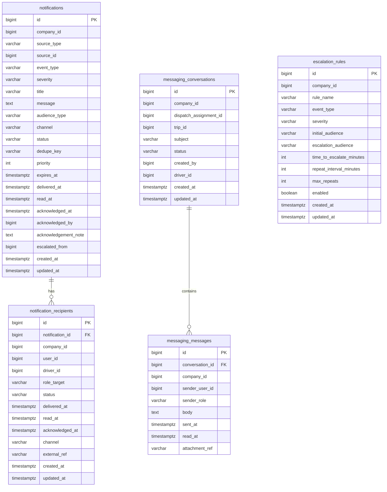
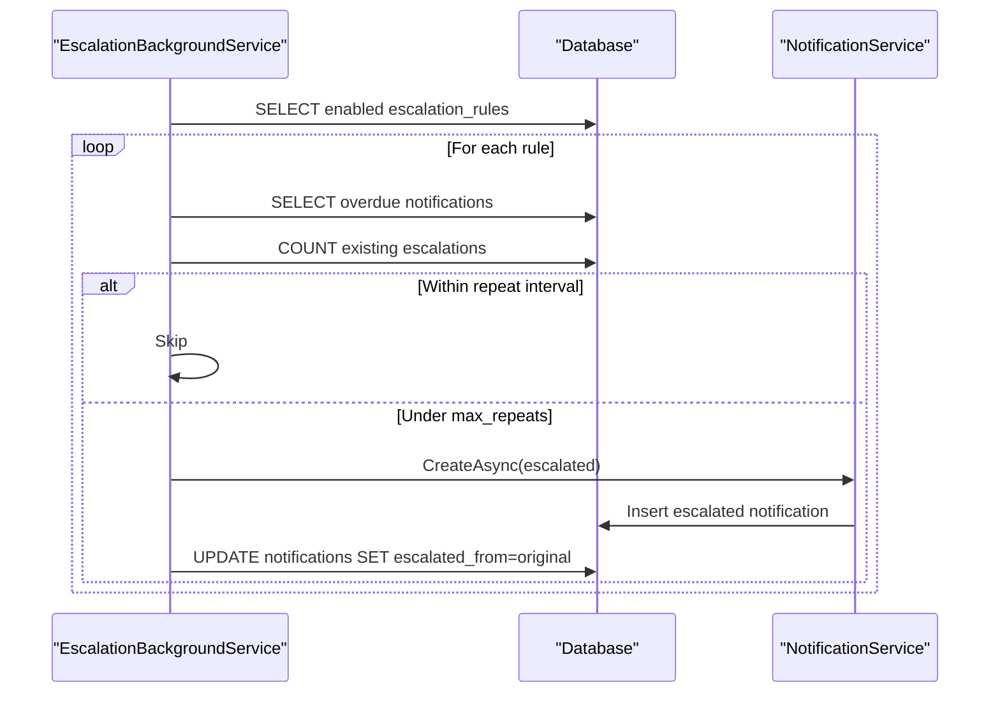
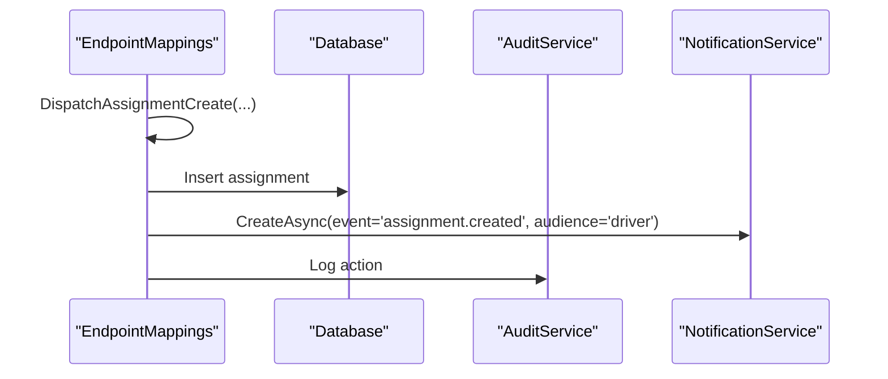
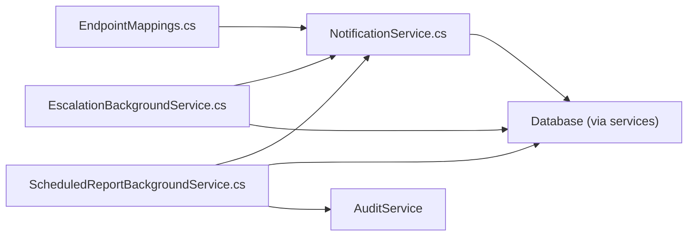

# Notification Services

<cite>
**Referenced Files in This Document**
- [NotificationService.cs](file://backend-dotnet/Services/NotificationService.cs)
- [NotificationSchemaService.cs](file://backend-dotnet/Services/NotificationSchemaService.cs)
- [EscalationBackgroundService.cs](file://backend-dotnet/Services/EscalationBackgroundService.cs)
- [ScheduledReportBackgroundService.cs](file://backend-dotnet/Services/ScheduledReportBackgroundService.cs)
- [EndpointMappings.cs](file://backend-dotnet/Controllers/EndpointMappings.cs)
- [NotificationTests.cs](file://backend-dotnet.Tests/NotificationTests.cs)
- [SettingsPage.tsx](file://frontend/src/pages/SettingsPage.tsx)
- [CampaignsPage.tsx](file://frontend/src/pages/CampaignsPage.tsx)
</cite>

## Table of Contents
1. [Introduction](#introduction)
2. [Project Structure](#project-structure)
3. [Core Components](#core-components)
4. [Architecture Overview](#architecture-overview)
5. [Detailed Component Analysis](#detailed-component-analysis)
6. [Dependency Analysis](#dependency-analysis)
7. [Performance Considerations](#performance-considerations)
8. [Troubleshooting Guide](#troubleshooting-guide)
9. [Conclusion](#conclusion)
10. [Appendices](#appendices)

## Introduction
This document describes the notification service layer, covering message queuing, delivery mechanisms, and multi-channel notification support. It explains notification templates, personalization, and segmentation strategies, and details integrations with email, SMS, push notification providers, and internal messaging systems. It also includes examples of notification workflows, retry mechanisms, delivery tracking, scheduling, batch processing, and performance optimization for high-volume scenarios.

## Project Structure
The notification system spans backend services, background schedulers, database schema, and frontend preferences. Key areas:
- Backend services: notification creation, escalation, scheduled reports
- Database schema: notifications, recipients, messaging, escalation rules
- Frontend: user preferences and campaign targeting
- Tests: permission, deduplication, escalation, and external channel contracts

**Diagram sources**
- [NotificationService.cs:1-184](file://backend-dotnet/Services/NotificationService.cs#L1-L184)
- [EscalationBackgroundService.cs:1-166](file://backend-dotnet/Services/EscalationBackgroundService.cs#L1-L166)
- [ScheduledReportBackgroundService.cs:1-364](file://backend-dotnet/Services/ScheduledReportBackgroundService.cs#L1-L364)
- [NotificationSchemaService.cs:1-138](file://backend-dotnet/Services/NotificationSchemaService.cs#L1-L138)
- [EndpointMappings.cs:1-800](file://backend-dotnet/Controllers/EndpointMappings.cs#L1-L800)
- [SettingsPage.tsx:1-45](file://frontend/src/pages/SettingsPage.tsx#L1-L45)
- [CampaignsPage.tsx:95-111](file://frontend/src/pages/CampaignsPage.tsx#L95-L111)

**Section sources**
- [NotificationService.cs:1-184](file://backend-dotnet/Services/NotificationService.cs#L1-L184)
- [NotificationSchemaService.cs:1-138](file://backend-dotnet/Services/NotificationSchemaService.cs#L1-L138)
- [EscalationBackgroundService.cs:1-166](file://backend-dotnet/Services/EscalationBackgroundService.cs#L1-L166)
- [ScheduledReportBackgroundService.cs:1-364](file://backend-dotnet/Services/ScheduledReportBackgroundService.cs#L1-L364)
- [EndpointMappings.cs:1-800](file://backend-dotnet/Controllers/EndpointMappings.cs#L1-L800)
- [SettingsPage.tsx:1-45](file://frontend/src/pages/SettingsPage.tsx#L1-L45)
- [CampaignsPage.tsx:95-111](file://frontend/src/pages/CampaignsPage.tsx#L95-L111)

## Core Components
- NotificationService: central creation and routing logic for notifications, including deduplication, sanitization, recipient resolution, and external channel markers.
- NotificationSchemaService: database schema provisioning and migrations for notifications, recipients, messaging, and escalation rules.
- EscalationBackgroundService: periodic background processing to escalate overdue notifications according to escalation rules.
- ScheduledReportBackgroundService: periodic execution of scheduled reports and delivery via in-app notifications; records non-configured external delivery attempts.
- EndpointMappings: controller wiring that invokes NotificationService during domain workflows (e.g., dispatch assignment creation).
- Frontend preference pages: define default channels and segmentation for campaigns.

Key capabilities:
- Multi-channel support: in-app, email, SMS, push (external channels marked as not configured)
- Deduplication and suppression windows
- Role-based and driver-based audience targeting
- Sanitization of internal operational data for customer/driver audiences
- Escalation rules with repeat intervals and max repeats
- Scheduled report delivery and non-configured provider logging

**Section sources**
- [NotificationService.cs:11-121](file://backend-dotnet/Services/NotificationService.cs#L11-L121)
- [NotificationSchemaService.cs:7-137](file://backend-dotnet/Services/NotificationSchemaService.cs#L7-L137)
- [EscalationBackgroundService.cs:45-163](file://backend-dotnet/Services/EscalationBackgroundService.cs#L45-L163)
- [ScheduledReportBackgroundService.cs:63-256](file://backend-dotnet/Services/ScheduledReportBackgroundService.cs#L63-L256)
- [EndpointMappings.cs:185-191](file://backend-dotnet/Controllers/EndpointMappings.cs#L185-L191)
- [SettingsPage.tsx:35-44](file://frontend/src/pages/SettingsPage.tsx#L35-L44)
- [CampaignsPage.tsx:95-111](file://frontend/src/pages/CampaignsPage.tsx#L95-L111)

## Architecture Overview
The notification architecture combines synchronous creation and asynchronous escalation and scheduled delivery. External channels are intentionally decoupled from actual transport to prevent accidental delivery.

**Diagram sources**
- [NotificationService.cs:11-121](file://backend-dotnet/Services/NotificationService.cs#L11-L121)
- [EscalationBackgroundService.cs:74-163](file://backend-dotnet/Services/EscalationBackgroundService.cs#L74-L163)
- [ScheduledReportBackgroundService.cs:208-239](file://backend-dotnet/Services/ScheduledReportBackgroundService.cs#L208-L239)

## Detailed Component Analysis

### NotificationService
Responsibilities:
- Create notifications with deduplication and suppression window
- Sanitize messages for customer/driver audiences
- Resolve recipients by user, driver, or role
- Insert recipient rows and mark external channels as not configured
- Support in-app delivery timestamps

**Diagram sources**
- [NotificationService.cs:11-121](file://backend-dotnet/Services/NotificationService.cs#L11-L121)

**Section sources**
- [NotificationService.cs:11-184](file://backend-dotnet/Services/NotificationService.cs#L11-L184)

### Notification Schema and Indices
Tables and indices enable efficient querying, filtering, and deduplication:
- notifications: event metadata, audience, channel, status, dedupe keys, priorities, timestamps
- notification_recipients: per-user/per-driver/per-role delivery rows with external_ref and channel
- messaging_conversations and messaging_messages: internal messaging
- escalation_rules: escalation policy definitions

**Diagram sources**
- [NotificationSchemaService.cs:37-118](file://backend-dotnet/Services/NotificationSchemaService.cs#L37-L118)

**Section sources**
- [NotificationSchemaService.cs:7-137](file://backend-dotnet/Services/NotificationSchemaService.cs#L7-L137)

### EscalationBackgroundService
Escalation logic:
- Loads enabled escalation rules
- Finds overdue notifications matching rule criteria
- Enforces max_repeats and repeat_interval
- Creates escalated notifications with highest priority
- Links escalated notifications to originals via escalated_from

**Diagram sources**
- [EscalationBackgroundService.cs:52-163](file://backend-dotnet/Services/EscalationBackgroundService.cs#L52-L163)

**Section sources**
- [EscalationBackgroundService.cs:45-166](file://backend-dotnet/Services/EscalationBackgroundService.cs#L45-L166)
- [NotificationTests.cs:461-562](file://backend-dotnet.Tests/NotificationTests.cs#L461-L562)

### ScheduledReportBackgroundService
Scheduled report execution:
- Loads due scheduled reports and validates tenant boundaries
- Builds and executes dataset queries
- Delivers in-app notifications to resolved recipients
- Logs non-configured external delivery attempts

```mermaid
sequenceDiagram
participant BG as "ScheduledReportBackgroundService"
participant DB as "Database"
participant NS as "NotificationService"
participant Audit as "AuditService"
BG->>DB : SELECT due scheduled_reports
loop For each report
BG->>DB : Build dataset query (tenant-scoped)
BG->>DB : Execute count/data
alt delivery_method == 'in_app'
BG->>DB : Resolve recipients (roles/users)
loop For each recipient
BG->>NS : CreateAsync(in_app)
end
else External
BG->>Audit : Log 'delivery_not_configured'
end
BG->>DB : UPDATE scheduled_reports next_run_at
end
```

**Diagram sources**
- [ScheduledReportBackgroundService.cs:72-256](file://backend-dotnet/Services/ScheduledReportBackgroundService.cs#L72-L256)

**Section sources**
- [ScheduledReportBackgroundService.cs:63-364](file://backend-dotnet/Services/ScheduledReportBackgroundService.cs#L63-L364)
- [NotificationTests.cs:564-603](file://backend-dotnet.Tests/NotificationTests.cs#L564-L603)

### Integration with Domain Handlers
Domain workflows trigger notifications via NotificationService:
- Dispatch assignment creation triggers driver notifications
- Driver acceptance triggers dispatcher notifications
- Exception reports notify dispatcher and fleet manager
- Critical DVIR triggers maintenance and fleet manager notifications

**Diagram sources**
- [EndpointMappings.cs:185-191](file://backend-dotnet/Controllers/EndpointMappings.cs#L185-L191)
- [NotificationTests.cs:607-696](file://backend-dotnet.Tests/NotificationTests.cs#L607-L696)

**Section sources**
- [EndpointMappings.cs:185-191](file://backend-dotnet/Controllers/EndpointMappings.cs#L185-L191)
- [NotificationTests.cs:607-696](file://backend-dotnet.Tests/NotificationTests.cs#L607-L696)

### Frontend Preferences and Segmentation
- SettingsPage defines default notification preferences per category and channel (Email, SMS, In-App)
- CampaignsPage supports targeting segments and selecting channels for marketing-style campaigns

**Section sources**
- [SettingsPage.tsx:35-44](file://frontend/src/pages/SettingsPage.tsx#L35-L44)
- [CampaignsPage.tsx:95-111](file://frontend/src/pages/CampaignsPage.tsx#L95-L111)

## Dependency Analysis
- NotificationService depends on Database for persistence and uses role mapping and sanitization helpers.
- EscalationBackgroundService depends on NotificationService and Database to load rules and insert escalations.
- ScheduledReportBackgroundService depends on NotificationService for in-app delivery and AuditService for logging.
- EndpointMappings wires domain actions to NotificationService invocations.
- Tests validate contracts around permissions, deduplication, escalation, and external channel behavior.

**Diagram sources**
- [EndpointMappings.cs:185-191](file://backend-dotnet/Controllers/EndpointMappings.cs#L185-L191)
- [NotificationService.cs:1-184](file://backend-dotnet/Services/NotificationService.cs#L1-L184)
- [EscalationBackgroundService.cs:1-166](file://backend-dotnet/Services/EscalationBackgroundService.cs#L1-L166)
- [ScheduledReportBackgroundService.cs:1-364](file://backend-dotnet/Services/ScheduledReportBackgroundService.cs#L1-L364)

**Section sources**
- [NotificationService.cs:1-184](file://backend-dotnet/Services/NotificationService.cs#L1-L184)
- [EscalationBackgroundService.cs:1-166](file://backend-dotnet/Services/EscalationBackgroundService.cs#L1-L166)
- [ScheduledReportBackgroundService.cs:1-364](file://backend-dotnet/Services/ScheduledReportBackgroundService.cs#L1-L364)
- [EndpointMappings.cs:185-191](file://backend-dotnet/Controllers/EndpointMappings.cs#L185-L191)

## Performance Considerations
- Deduplication: suppression window and dedupe_key reduce duplicate notifications per tenant.
- Indices: dedicated indexes on notifications and recipients improve query performance for status, event type, and tenant scoping.
- Batch processing: background services process cycles at fixed intervals to avoid spikes.
- In-app delivery: immediate delivered_at timestamps minimize latency for internal delivery.
- External channels: marking external_ref avoids unnecessary transport calls and reduces coupling.

[No sources needed since this section provides general guidance]

## Troubleshooting Guide
Common issues and resolutions:
- External channel delivery not occurring: confirm channel != 'in_app'; recipients.external_ref will be 'not_configured'. See external channel tests for expected behavior.
- Duplicate notifications suppressed: verify dedupe_key and suppression window; ensure deduplication logic is satisfied.
- Escalation not triggered: check escalation rules, time_to_escalate, repeat_interval, and max_repeats; ensure overdue notifications exist and are not already escalated.
- Scheduled report external delivery not attempted: delivery_method != 'in_app' logs non-configured status; configure provider to enable actual delivery.

**Section sources**
- [NotificationTests.cs:564-603](file://backend-dotnet.Tests/NotificationTests.cs#L564-L603)
- [NotificationTests.cs:461-562](file://backend-dotnet.Tests/NotificationTests.cs#L461-L562)
- [ScheduledReportBackgroundService.cs:232-239](file://backend-dotnet/Services/ScheduledReportBackgroundService.cs#L232-L239)

## Conclusion
The notification service layer provides a robust foundation for multi-channel notifications, strong tenant isolation, and scalable background processing. It separates concerns between creation, escalation, and scheduled delivery, while maintaining strict controls over external provider integration. The schema and indices support high-volume scenarios, and tests codify critical contracts for deduplication, escalation, and channel behavior.

## Appendices

### Notification Templates and Personalization
- Templates: notifications store title and message; sanitization ensures customer/driver audiences do not receive internal operational data.
- Personalization: recipient resolution supports user-specific, driver-specific, and role-based targeting; scheduled reports resolve recipients server-side from role names or usernames.

**Section sources**
- [NotificationService.cs:46-47](file://backend-dotnet/Services/NotificationService.cs#L46-L47)
- [NotificationService.cs:94-110](file://backend-dotnet/Services/NotificationService.cs#L94-L110)
- [ScheduledReportBackgroundService.cs:295-348](file://backend-dotnet/Services/ScheduledReportBackgroundService.cs#L295-L348)

### Retry Mechanisms and Delivery Tracking
- Escalation cycle: runs periodically; respects repeat_interval and max_repeats to avoid excessive retries.
- Delivery tracking: in-app recipients get delivered_at timestamps; external channels are marked with external_ref for auditability.

**Section sources**
- [EscalationBackgroundService.cs:13-41](file://backend-dotnet/Services/EscalationBackgroundService.cs#L13-L41)
- [EscalationBackgroundService.cs:115-133](file://backend-dotnet/Services/EscalationBackgroundService.cs#L115-L133)
- [NotificationService.cs:112-118](file://backend-dotnet/Services/NotificationService.cs#L112-L118)
- [NotificationService.cs:127-139](file://backend-dotnet/Services/NotificationService.cs#L127-L139)

### Scheduling and Batch Processing
- ScheduledReportBackgroundService: processes due reports at fixed intervals, builds dataset queries server-side, and delivers in-app notifications.
- Batch processing: recipient resolution and notification insertion occur per recipient to maintain auditability and tenant isolation.

**Section sources**
- [ScheduledReportBackgroundService.cs:31-61](file://backend-dotnet/Services/ScheduledReportBackgroundService.cs#L31-L61)
- [ScheduledReportBackgroundService.cs:208-239](file://backend-dotnet/Services/ScheduledReportBackgroundService.cs#L208-L239)
- [ScheduledReportBackgroundService.cs:295-348](file://backend-dotnet/Services/ScheduledReportBackgroundService.cs#L295-L348)