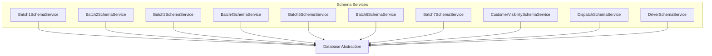
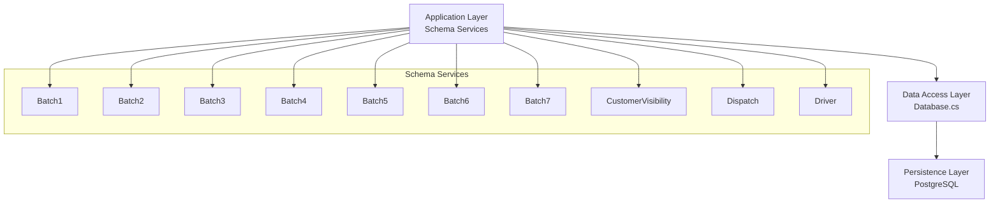
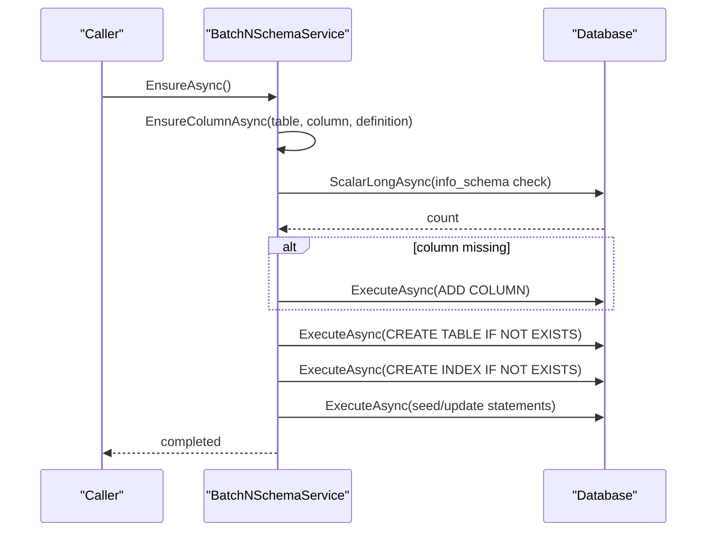
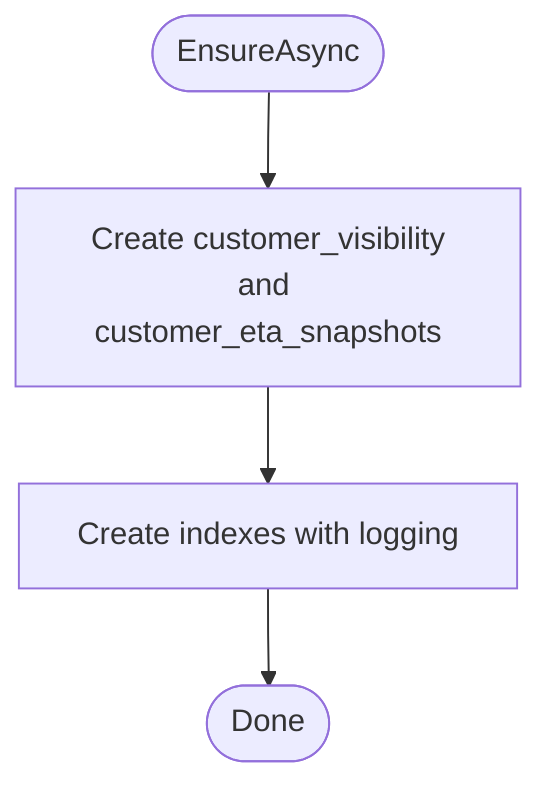
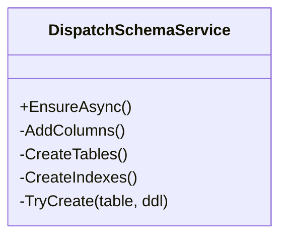
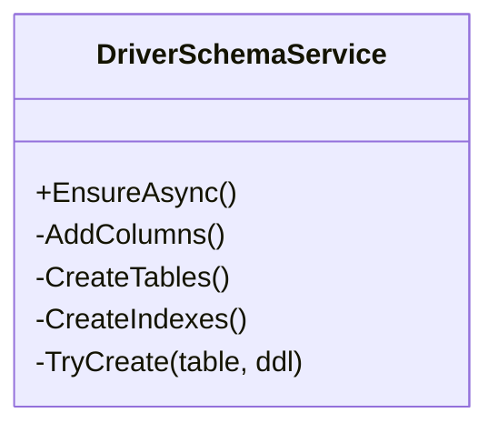
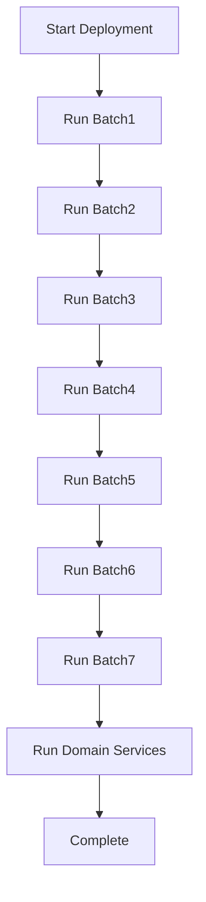
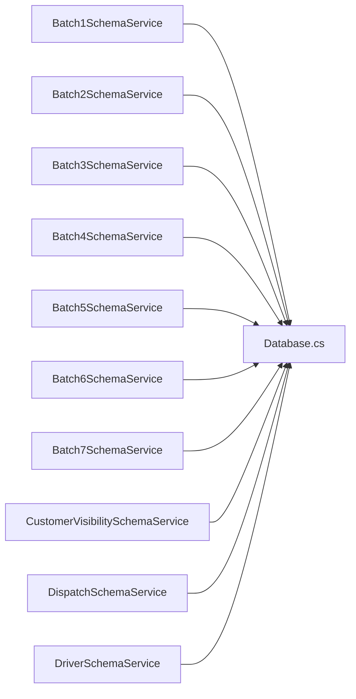

# Schema Services

<cite>
**Referenced Files in This Document**
- [Batch1SchemaService.cs](file://backend-dotnet/Services/Batch1SchemaService.cs)
- [Batch2SchemaService.cs](file://backend-dotnet/Services/Batch2SchemaService.cs)
- [Batch3SchemaService.cs](file://backend-dotnet/Services/Batch3SchemaService.cs)
- [Batch4SchemaService.cs](file://backend-dotnet/Services/Batch4SchemaService.cs)
- [Batch5SchemaService.cs](file://backend-dotnet/Services/Batch5SchemaService.cs)
- [Batch6SchemaService.cs](file://backend-dotnet/Services/Batch6SchemaService.cs)
- [Batch7SchemaService.cs](file://backend-dotnet/Services/Batch7SchemaService.cs)
- [CustomerVisibilitySchemaService.cs](file://backend-dotnet/Services/CustomerVisibilitySchemaService.cs)
- [DispatchSchemaService.cs](file://backend-dotnet/Services/DispatchSchemaService.cs)
- [DriverSchemaService.cs](file://backend-dotnet/Services/DriverSchemaService.cs)
- [Database.cs](file://backend-dotnet/Data/Database.cs)
</cite>

## Table of Contents
1. [Introduction](#introduction)
2. [Project Structure](#project-structure)
3. [Core Components](#core-components)
4. [Architecture Overview](#architecture-overview)
5. [Detailed Component Analysis](#detailed-component-analysis)
6. [Dependency Analysis](#dependency-analysis)
7. [Performance Considerations](#performance-considerations)
8. [Troubleshooting Guide](#troubleshooting-guide)
9. [Conclusion](#conclusion)

## Introduction
This document describes the schema services that manage database migrations and data structure evolution across the platform. It covers the progressive rollout of schema changes through batch services, specialized services for dispatch, driver, customer visibility, and the foundational database abstraction. The focus is on schema versioning, migration strategies, backward compatibility, service registration patterns, dependency ordering, rollback mechanisms, and performance considerations for large-scale schema changes and zero-downtime deployments.

## Project Structure
The schema services are implemented as discrete, idempotent bootstrap services grouped by product phase and domain. Each service encapsulates:
- Column additions via conditional ALTER TABLE statements
- Table creation via CREATE TABLE IF NOT EXISTS
- Index creation with defensive error handling
- Seeding/updating existing data to align with new schema

**Diagram sources**
- [Batch1SchemaService.cs:7-23](file://backend-dotnet/Services/Batch1SchemaService.cs#L7-L23)
- [Batch2SchemaService.cs:7-23](file://backend-dotnet/Services/Batch2SchemaService.cs#L7-L23)
- [Batch3SchemaService.cs:7-28](file://backend-dotnet/Services/Batch3SchemaService.cs#L7-L28)
- [Batch4SchemaService.cs:7-13](file://backend-dotnet/Services/Batch4SchemaService.cs#L7-L13)
- [Batch5SchemaService.cs:7-13](file://backend-dotnet/Services/Batch5SchemaService.cs#L7-L13)
- [Batch6SchemaService.cs:7-13](file://backend-dotnet/Services/Batch6SchemaService.cs#L7-L13)
- [Batch7SchemaService.cs:7-13](file://backend-dotnet/Services/Batch7SchemaService.cs#L7-L13)
- [CustomerVisibilitySchemaService.cs:12-16](file://backend-dotnet/Services/CustomerVisibilitySchemaService.cs#L12-L16)
- [DispatchSchemaService.cs:11-16](file://backend-dotnet/Services/DispatchSchemaService.cs#L11-L16)
- [DriverSchemaService.cs:13-18](file://backend-dotnet/Services/DriverSchemaService.cs#L13-L18)

**Section sources**
- [Batch1SchemaService.cs:1-272](file://backend-dotnet/Services/Batch1SchemaService.cs#L1-L272)
- [Batch2SchemaService.cs:1-277](file://backend-dotnet/Services/Batch2SchemaService.cs#L1-L277)
- [Batch3SchemaService.cs:1-390](file://backend-dotnet/Services/Batch3SchemaService.cs#L1-L390)
- [Batch4SchemaService.cs:1-312](file://backend-dotnet/Services/Batch4SchemaService.cs#L1-L312)
- [Batch5SchemaService.cs:1-598](file://backend-dotnet/Services/Batch5SchemaService.cs#L1-L598)
- [Batch6SchemaService.cs:1-468](file://backend-dotnet/Services/Batch6SchemaService.cs#L1-L468)
- [Batch7SchemaService.cs:1-588](file://backend-dotnet/Services/Batch7SchemaService.cs#L1-L588)
- [CustomerVisibilitySchemaService.cs:1-85](file://backend-dotnet/Services/CustomerVisibilitySchemaService.cs#L1-L85)
- [DispatchSchemaService.cs:1-139](file://backend-dotnet/Services/DispatchSchemaService.cs#L1-L139)
- [DriverSchemaService.cs:1-89](file://backend-dotnet/Services/DriverSchemaService.cs#L1-L89)

## Core Components
- Batch schema services (B1–B7): Progressive schema evolution across product phases, adding columns, creating tables, building indexes, and seeding/updating data.
- Domain-specific schema services: CustomerVisibilitySchemaService, DispatchSchemaService, DriverSchemaService handle targeted domain features with defensive DDL and indexing.
- Database abstraction: Centralized execution and scalar queries for schema checks and DDL execution.

Key characteristics:
- Idempotent DDL: Uses IF NOT EXISTS and defensive ALTER TABLE with exception handling.
- Conditional column checks: Queries information_schema before adding columns.
- Index creation guarded by try/catch blocks to tolerate partial failures.
- Seeding/updating aligned with new schema using UPDATE/INSERT statements.

**Section sources**
- [Batch1SchemaService.cs:25-40](file://backend-dotnet/Services/Batch1SchemaService.cs#L25-L40)
- [Batch2SchemaService.cs:25-40](file://backend-dotnet/Services/Batch2SchemaService.cs#L25-L40)
- [Batch3SchemaService.cs:30-45](file://backend-dotnet/Services/Batch3SchemaService.cs#L30-L45)
- [Batch4SchemaService.cs:15-21](file://backend-dotnet/Services/Batch4SchemaService.cs#L15-L21)
- [Batch5SchemaService.cs:15-21](file://backend-dotnet/Services/Batch5SchemaService.cs#L15-L21)
- [Batch6SchemaService.cs:15-21](file://backend-dotnet/Services/Batch6SchemaService.cs#L15-L21)
- [Batch7SchemaService.cs:15-21](file://backend-dotnet/Services/Batch7SchemaService.cs#L15-L21)
- [CustomerVisibilitySchemaService.cs:18-56](file://backend-dotnet/Services/CustomerVisibilitySchemaService.cs#L18-L56)
- [DispatchSchemaService.cs:18-49](file://backend-dotnet/Services/DispatchSchemaService.cs#L18-L49)
- [DriverSchemaService.cs:20-40](file://backend-dotnet/Services/DriverSchemaService.cs#L20-L40)

## Architecture Overview
The schema services follow a layered approach:
- Application layer: Services orchestrate schema evolution.
- Data access layer: Database abstraction executes DDL and DML safely.
- Persistence layer: PostgreSQL schema evolves progressively.

**Diagram sources**
- [Database.cs](file://backend-dotnet/Data/Database.cs)
- [Batch1SchemaService.cs:7-23](file://backend-dotnet/Services/Batch1SchemaService.cs#L7-L23)
- [Batch2SchemaService.cs:7-23](file://backend-dotnet/Services/Batch2SchemaService.cs#L7-L23)
- [Batch3SchemaService.cs:7-28](file://backend-dotnet/Services/Batch3SchemaService.cs#L7-L28)
- [Batch4SchemaService.cs:7-13](file://backend-dotnet/Services/Batch4SchemaService.cs#L7-L13)
- [Batch5SchemaService.cs:7-13](file://backend-dotnet/Services/Batch5SchemaService.cs#L7-L13)
- [Batch6SchemaService.cs:7-13](file://backend-dotnet/Services/Batch6SchemaService.cs#L7-L13)
- [Batch7SchemaService.cs:7-13](file://backend-dotnet/Services/Batch7SchemaService.cs#L7-L13)
- [CustomerVisibilitySchemaService.cs:12-16](file://backend-dotnet/Services/CustomerVisibilitySchemaService.cs#L12-L16)
- [DispatchSchemaService.cs:11-16](file://backend-dotnet/Services/DispatchSchemaService.cs#L11-L16)
- [DriverSchemaService.cs:13-18](file://backend-dotnet/Services/DriverSchemaService.cs#L13-L18)

## Detailed Component Analysis

### Batch Schema Services (Progressive Evolution)
Each batch service applies a consistent lifecycle:
- Ensure columns exist (conditional ALTER TABLE)
- Create tables (IF NOT EXISTS)
- Create indexes (with try/catch)
- Seed/update data to align with schema

**Diagram sources**
- [Batch1SchemaService.cs:7-23](file://backend-dotnet/Services/Batch1SchemaService.cs#L7-L23)
- [Batch1SchemaService.cs:25-40](file://backend-dotnet/Services/Batch1SchemaService.cs#L25-L40)
- [Batch2SchemaService.cs:7-23](file://backend-dotnet/Services/Batch2SchemaService.cs#L7-L23)
- [Batch3SchemaService.cs:7-28](file://backend-dotnet/Services/Batch3SchemaService.cs#L7-L28)
- [Batch4SchemaService.cs:7-13](file://backend-dotnet/Services/Batch4SchemaService.cs#L7-L13)
- [Batch5SchemaService.cs:7-13](file://backend-dotnet/Services/Batch5SchemaService.cs#L7-L13)
- [Batch6SchemaService.cs:7-13](file://backend-dotnet/Services/Batch6SchemaService.cs#L7-L13)
- [Batch7SchemaService.cs:7-13](file://backend-dotnet/Services/Batch7SchemaService.cs#L7-L13)

**Section sources**
- [Batch1SchemaService.cs:7-272](file://backend-dotnet/Services/Batch1SchemaService.cs#L7-L272)
- [Batch2SchemaService.cs:7-277](file://backend-dotnet/Services/Batch2SchemaService.cs#L7-L277)
- [Batch3SchemaService.cs:7-390](file://backend-dotnet/Services/Batch3SchemaService.cs#L7-L390)
- [Batch4SchemaService.cs:7-312](file://backend-dotnet/Services/Batch4SchemaService.cs#L7-L312)
- [Batch5SchemaService.cs:7-598](file://backend-dotnet/Services/Batch5SchemaService.cs#L7-L598)
- [Batch6SchemaService.cs:7-468](file://backend-dotnet/Services/Batch6SchemaService.cs#L7-L468)
- [Batch7SchemaService.cs:7-588](file://backend-dotnet/Services/Batch7SchemaService.cs#L7-L588)

### Domain-Specific Schema Services

#### Customer Visibility Schema Service
Focus: Public tracking tokens and ETA snapshots for customer visibility.

**Diagram sources**
- [CustomerVisibilitySchemaService.cs:12-16](file://backend-dotnet/Services/CustomerVisibilitySchemaService.cs#L12-L16)
- [CustomerVisibilitySchemaService.cs:18-56](file://backend-dotnet/Services/CustomerVisibilitySchemaService.cs#L18-L56)
- [CustomerVisibilitySchemaService.cs:58-77](file://backend-dotnet/Services/CustomerVisibilitySchemaService.cs#L58-L77)

**Section sources**
- [CustomerVisibilitySchemaService.cs:1-85](file://backend-dotnet/Services/CustomerVisibilitySchemaService.cs#L1-L85)

#### Dispatch Schema Service
Focus: Enhanced dispatch assignment tracking, exceptions, proofs, and eligibility configuration.

**Diagram sources**
- [DispatchSchemaService.cs:9-16](file://backend-dotnet/Services/DispatchSchemaService.cs#L9-L16)
- [DispatchSchemaService.cs:18-49](file://backend-dotnet/Services/DispatchSchemaService.cs#L18-L49)
- [DispatchSchemaService.cs:51-107](file://backend-dotnet/Services/DispatchSchemaService.cs#L51-L107)
- [DispatchSchemaService.cs:109-131](file://backend-dotnet/Services/DispatchSchemaService.cs#L109-L131)

**Section sources**
- [DispatchSchemaService.cs:1-139](file://backend-dotnet/Services/DispatchSchemaService.cs#L1-L139)

#### Driver Schema Service
Focus: Driver-user linkage, coaching acknowledgments, and offline action queue.

**Diagram sources**
- [DriverSchemaService.cs:11-18](file://backend-dotnet/Services/DriverSchemaService.cs#L11-L18)
- [DriverSchemaService.cs:20-40](file://backend-dotnet/Services/DriverSchemaService.cs#L20-L40)
- [DriverSchemaService.cs:42-62](file://backend-dotnet/Services/DriverSchemaService.cs#L42-L62)
- [DriverSchemaService.cs:64-81](file://backend-dotnet/Services/DriverSchemaService.cs#L64-L81)

**Section sources**
- [DriverSchemaService.cs:1-89](file://backend-dotnet/Services/DriverSchemaService.cs#L1-L89)

### Conceptual Overview
The schema services implement a progressive rollout model:
- Each batch adds capabilities incrementally
- Defensive DDL prevents failures from blocking deployment
- Index creation is resilient to partial success
- Seeding/updating ensures data alignment with schema changes

[No sources needed since this diagram shows conceptual workflow, not actual code structure]

## Dependency Analysis
- Internal dependencies: All batch services depend on the shared Database abstraction for DDL/DML execution.
- Ordering: Batches are ordered by product phase; domain services (CustomerVisibility, Dispatch, Driver) complement batch evolution.
- External dependencies: PostgreSQL dialect for DDL and information_schema queries.

**Diagram sources**
- [Database.cs](file://backend-dotnet/Data/Database.cs)
- [Batch1SchemaService.cs:5](file://backend-dotnet/Services/Batch1SchemaService.cs#L5)
- [Batch2SchemaService.cs:5](file://backend-dotnet/Services/Batch2SchemaService.cs#L5)
- [Batch3SchemaService.cs:5](file://backend-dotnet/Services/Batch3SchemaService.cs#L5)
- [Batch4SchemaService.cs:5](file://backend-dotnet/Services/Batch4SchemaService.cs#L5)
- [Batch5SchemaService.cs:5](file://backend-dotnet/Services/Batch5SchemaService.cs#L5)
- [Batch6SchemaService.cs:5](file://backend-dotnet/Services/Batch6SchemaService.cs#L5)
- [Batch7SchemaService.cs:5](file://backend-dotnet/Services/Batch7SchemaService.cs#L5)
- [CustomerVisibilitySchemaService.cs:10](file://backend-dotnet/Services/CustomerVisibilitySchemaService.cs#L10)
- [DispatchSchemaService.cs:9](file://backend-dotnet/Services/DispatchSchemaService.cs#L9)
- [DriverSchemaService.cs:10](file://backend-dotnet/Services/DriverSchemaService.cs#L10)

**Section sources**
- [Database.cs](file://backend-dotnet/Data/Database.cs)
- [Batch1SchemaService.cs:5](file://backend-dotnet/Services/Batch1SchemaService.cs#L5)
- [Batch2SchemaService.cs:5](file://backend-dotnet/Services/Batch2SchemaService.cs#L5)
- [Batch3SchemaService.cs:5](file://backend-dotnet/Services/Batch3SchemaService.cs#L5)
- [Batch4SchemaService.cs:5](file://backend-dotnet/Services/Batch4SchemaService.cs#L5)
- [Batch5SchemaService.cs:5](file://backend-dotnet/Services/Batch5SchemaService.cs#L5)
- [Batch6SchemaService.cs:5](file://backend-dotnet/Services/Batch6SchemaService.cs#L5)
- [Batch7SchemaService.cs:5](file://backend-dotnet/Services/Batch7SchemaService.cs#L5)
- [CustomerVisibilitySchemaService.cs:10](file://backend-dotnet/Services/CustomerVisibilitySchemaService.cs#L10)
- [DispatchSchemaService.cs:9](file://backend-dotnet/Services/DispatchSchemaService.cs#L9)
- [DriverSchemaService.cs:10](file://backend-dotnet/Services/DriverSchemaService.cs#L10)

## Performance Considerations
- Batched rollouts minimize long-running DDL by spreading changes across releases.
- Index creation uses IF NOT EXISTS and try/catch to avoid blocking on partial failures.
- Seeding/updating leverages targeted UPDATE/INSERT statements to align existing data with new schema.
- For very large tables, consider:
  - Partitioning strategies for historical data
  - Background jobs for heavy updates
  - Read replicas for reporting workloads
  - Monitoring long transactions and locks during batch runs

[No sources needed since this section provides general guidance]

## Troubleshooting Guide
Common issues and mitigations:
- Column already exists errors: Services catch specific SQL states for duplicate columns and continue.
- Partial index creation: Index creation is wrapped in try/catch; logs warnings and continues.
- Information_schema queries: Ensure proper schema selection and parameter binding.
- Rollback considerations: Since services are idempotent, re-running them is generally safe. For destructive changes, maintain manual steps and backups.

**Section sources**
- [DispatchSchemaService.cs:46-47](file://backend-dotnet/Services/DispatchSchemaService.cs#L46-L47)
- [CustomerVisibilitySchemaService.cs:71-76](file://backend-dotnet/Services/CustomerVisibilitySchemaService.cs#L71-L76)
- [Batch3SchemaService.cs:21](file://backend-dotnet/Services/Batch3SchemaService.cs#L21)
- [Batch4SchemaService.cs:11](file://backend-dotnet/Services/Batch4SchemaService.cs#L11)

## Conclusion
The schema services provide a robust, idempotent framework for progressive schema evolution. They enforce backward compatibility, guard against partial failures, and enable zero-downtime schema changes through careful sequencing and defensive DDL. By leveraging batch services and domain-specific enhancements, the platform supports scalable, maintainable data structure evolution across product phases.