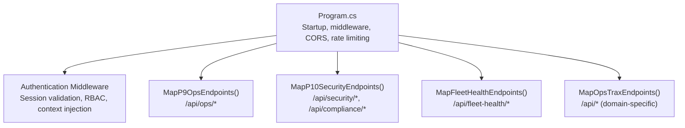
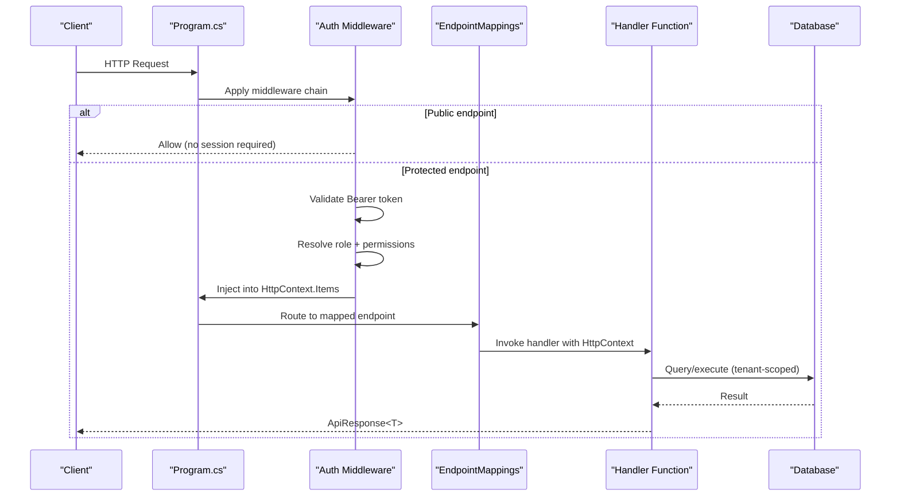
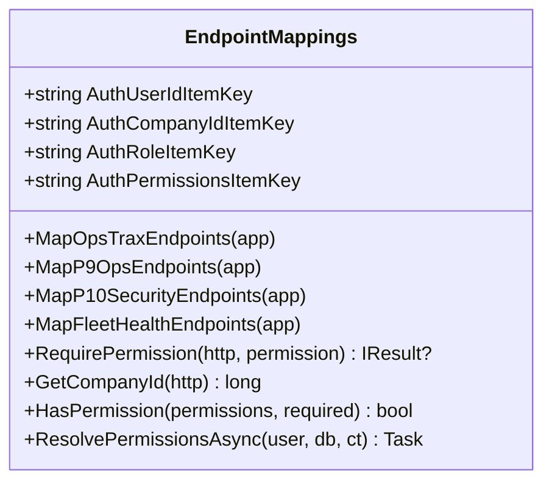
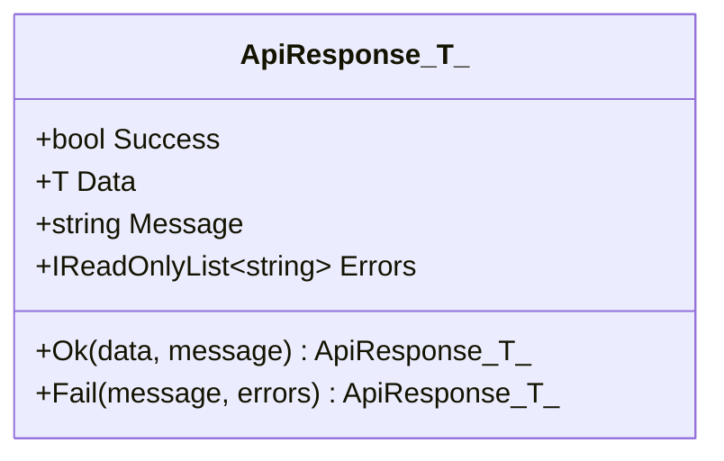
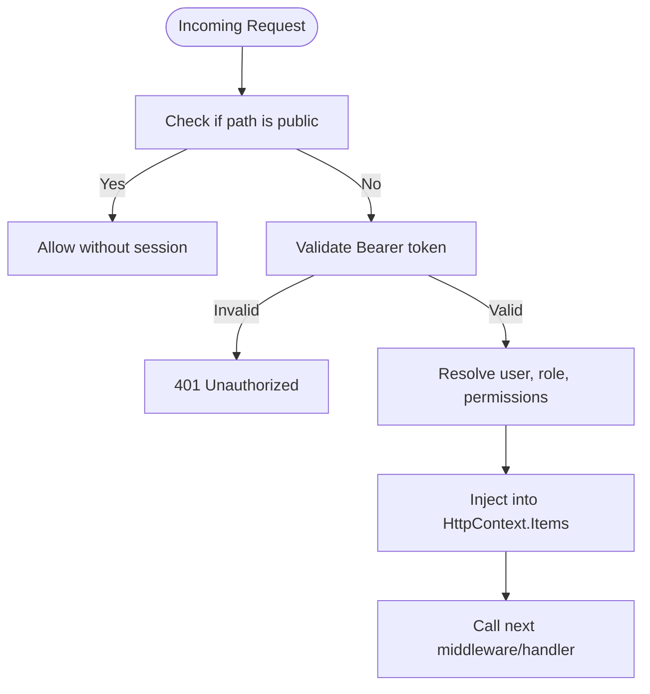
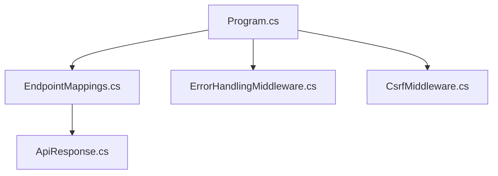

# Controller Layer & Endpoint Mapping

<cite>
**Referenced Files in This Document**
- [EndpointMappings.cs](file://backend-dotnet/Controllers/EndpointMappings.cs)
- [ApiResponse.cs](file://backend-dotnet/DTOs/ApiResponse.cs)
- [Program.cs](file://backend-dotnet/Program.cs)
- [ErrorHandlingMiddleware.cs](file://backend-dotnet/Middleware/ErrorHandlingMiddleware.cs)
- [CsrfMiddleware.cs](file://backend-dotnet/Middleware/CsrfMiddleware.cs)
- [API_ENDPOINTS.md](file://docs/API_ENDPOINTS.md)
</cite>

## Table of Contents
1. [Introduction](#introduction)
2. [Project Structure](#project-structure)
3. [Core Components](#core-components)
4. [Architecture Overview](#architecture-overview)
5. [Detailed Component Analysis](#detailed-component-analysis)
6. [Dependency Analysis](#dependency-analysis)
7. [Performance Considerations](#performance-considerations)
8. [Troubleshooting Guide](#troubleshooting-guide)
9. [Conclusion](#conclusion)

## Introduction
This document explains the controller architecture and endpoint mapping system used by the backend API. It focuses on the EndpointMappings class that organizes API endpoints by functional domains, the ApiResponse DTO pattern for consistent response formatting, authentication context injection, and the categorization of endpoints across operations management, safety and compliance, maintenance, financial operations, customer experience, platform operations (P9), security and compliance (P10), and fleet health. It also documents public endpoints for customer-facing features, telemetry ingestion, and health probes, along with endpoint naming conventions, HTTP method usage, and parameter validation patterns.

## Project Structure
The controller layer is implemented in a single static class that registers all endpoints and encapsulates shared authorization and context helpers. The Program.cs file orchestrates middleware, authentication, and endpoint registration across three major groups:
- P8 Operational domain endpoints (mapped via MapOpsTraxEndpoints)
- P9 Platform Operations endpoints (mapped via MapP9OpsEndpoints)
- P10 Security and Compliance endpoints (mapped via MapP10SecurityEndpoints)
- Fleet Health endpoints (mapped via MapFleetHealthEndpoints)

**Diagram sources**
- [Program.cs:379-382](file://backend-dotnet/Program.cs#L379-L382)
- [EndpointMappings.cs:12143-12151](file://backend-dotnet/Controllers/EndpointMappings.cs#L12143-L12151)
- [EndpointMappings.cs:12286-12330](file://backend-dotnet/Controllers/EndpointMappings.cs#L12286-L12330)
- [EndpointMappings.cs:12884-12892](file://backend-dotnet/Controllers/EndpointMappings.cs#L12884-L12892)
- [EndpointMappings.cs:19-1443](file://backend-dotnet/Controllers/EndpointMappings.cs#L19-L1443)

**Section sources**
- [Program.cs:379-382](file://backend-dotnet/Program.cs#L379-L382)
- [EndpointMappings.cs:19-1443](file://backend-dotnet/Controllers/EndpointMappings.cs#L19-L1443)

## Core Components
- EndpointMappings: Central registry for all API endpoints grouped by functional domains. Provides:
  - Authentication context keys for injecting user identity and permissions into HttpContext.Items
  - Domain-specific endpoint registrations (vehicles, drivers, jobs, dispatch, routes, safety, maintenance, compliance, finance, reporting, etc.)
  - Shared helpers for permission checks, tenant scoping, and response formatting
- ApiResponse DTO: A sealed record that standardizes all API responses with fields for success status, data payload, message, and errors.
- Authentication and Authorization:
  - Session-based Bearer token validation with role and permission resolution
  - Special handling for telemetry streaming via short-lived tickets
  - Public endpoints bypassing session auth for health, telemetry ingestion, and customer tracking
- Middleware:
  - ErrorHandlingMiddleware: global exception handling returning standardized error responses
  - CsrfMiddleware: CSRF protection for state-changing requests

**Section sources**
- [EndpointMappings.cs:12-18](file://backend-dotnet/Controllers/EndpointMappings.cs#L12-L18)
- [EndpointMappings.cs:1516-1535](file://backend-dotnet/Controllers/EndpointMappings.cs#L1516-L1535)
- [ApiResponse.cs:1-8](file://backend-dotnet/DTOs/ApiResponse.cs#L1-L8)
- [Program.cs:101-244](file://backend-dotnet/Program.cs#L101-L244)
- [ErrorHandlingMiddleware.cs:1-22](file://backend-dotnet/Middleware/ErrorHandlingMiddleware.cs#L1-L22)
- [CsrfMiddleware.cs:1-62](file://backend-dotnet/Middleware/CsrfMiddleware.cs#L1-L62)

## Architecture Overview
The runtime flow for incoming requests:
1. Pre-authentication filters allow health, telemetry ingestion, and public tracking endpoints to pass without session auth.
2. For protected endpoints, the authentication middleware validates Bearer tokens, resolves user roles and permissions, and injects them into HttpContext.Items.
3. EndpointMappings routes the request to the appropriate handler, which may enforce domain-specific RBAC and tenant scoping.
4. Handlers return data wrapped in ApiResponse<T> for consistent formatting.
5. Global error handling ensures unhandled exceptions are returned as standardized error responses.

**Diagram sources**
- [Program.cs:105-244](file://backend-dotnet/Program.cs#L105-L244)
- [EndpointMappings.cs:1516-1535](file://backend-dotnet/Controllers/EndpointMappings.cs#L1516-L1535)
- [ErrorHandlingMiddleware.cs:8-20](file://backend-dotnet/Middleware/ErrorHandlingMiddleware.cs#L8-L20)

## Detailed Component Analysis

### EndpointMappings Class
- Purpose: Single source of truth for endpoint routing and shared authorization helpers.
- Key responsibilities:
  - Define Auth* constants for injecting user identity and permissions into HttpContext.Items
  - Register endpoints grouped by functional domains (vehicles, drivers, jobs, dispatch, routes, safety, maintenance, compliance, finance, reporting, etc.)
  - Provide RequirePermission, GetCompanyId, and permission alias resolution
  - Implement domain-specific helpers (e.g., timeline, recommendations, soft delete wrappers)
  - Register P9, P10, and Fleet Health endpoint groups

**Diagram sources**
- [EndpointMappings.cs:12-18](file://backend-dotnet/Controllers/EndpointMappings.cs#L12-L18)
- [EndpointMappings.cs:19-1443](file://backend-dotnet/Controllers/EndpointMappings.cs#L19-L1443)
- [EndpointMappings.cs:12143-12151](file://backend-dotnet/Controllers/EndpointMappings.cs#L12143-L12151)
- [EndpointMappings.cs:12286-12330](file://backend-dotnet/Controllers/EndpointMappings.cs#L12286-L12330)
- [EndpointMappings.cs:12884-12892](file://backend-dotnet/Controllers/EndpointMappings.cs#L12884-L12892)

**Section sources**
- [EndpointMappings.cs:12-18](file://backend-dotnet/Controllers/EndpointMappings.cs#L12-L18)
- [EndpointMappings.cs:19-1443](file://backend-dotnet/Controllers/EndpointMappings.cs#L19-L1443)
- [EndpointMappings.cs:12143-12151](file://backend-dotnet/Controllers/EndpointMappings.cs#L12143-L12151)
- [EndpointMappings.cs:12286-12330](file://backend-dotnet/Controllers/EndpointMappings.cs#L12286-L12330)
- [EndpointMappings.cs:12884-12892](file://backend-dotnet/Controllers/EndpointMappings.cs#L12884-L12892)

### API Response Structure (ApiResponse DTO Pattern)
- ApiResponse<T> standardizes all responses with:
  - Success: boolean indicating success
  - Data: typed payload or null
  - Message: human-readable message
  - Errors: list of error strings
- Static helpers:
  - Ok(data, message?): returns successful response
  - Fail(message, params[]): returns failed response with optional errors

**Diagram sources**
- [ApiResponse.cs:3-7](file://backend-dotnet/DTOs/ApiResponse.cs#L3-L7)

**Section sources**
- [ApiResponse.cs:1-8](file://backend-dotnet/DTOs/ApiResponse.cs#L1-L8)

### Authentication Context Injection
- Keys injected into HttpContext.Items:
  - opstrax.auth.user_id
  - opstrax.auth.company_id
  - opstrax.auth.role
  - opstrax.auth.permissions
- Resolution pipeline:
  - Extract token from Authorization header
  - Validate session, user status, and role permissions
  - Merge user and role permissions, normalize via aliases
  - Inject into Items for downstream handlers
- Special-case for telemetry streaming:
  - Validates short-lived stream ticket (sst) and injects special role/permissions

**Diagram sources**
- [Program.cs:105-244](file://backend-dotnet/Program.cs#L105-L244)
- [EndpointMappings.cs:1516-1535](file://backend-dotnet/Controllers/EndpointMappings.cs#L1516-L1535)

**Section sources**
- [Program.cs:105-244](file://backend-dotnet/Program.cs#L105-L244)
- [EndpointMappings.cs:1516-1535](file://backend-dotnet/Controllers/EndpointMappings.cs#L1516-L1535)

### Endpoint Categories and Domains
- P8 Operations (MapOpsTraxEndpoints):
  - Vehicles, Drivers, Jobs, Dispatch, Routes, Trips, Alerts, Telemetry, Devices, Fuel/Idling, Expenses, Contracts, Carriers, Predictive Analytics, Workforce, Cost Margin, Cost Leakage, Compliance Center, HOS/ELD, Localization, Reporting & Analytics, KPI/SLA, Audit Logs, Admin/Governance, Executive Dashboard, Alert Rules, Driver Messaging, Notifications, Escalation, About/Platform, and generic module handlers.
- P9 Platform Operations (MapP9OpsEndpoints):
  - Metrics, service runs, incidents, configuration checks.
- P10 Security & Compliance (MapP10SecurityEndpoints):
  - Security settings, security events, SSO connections, access reviews, export governance, security insights, compliance controls/evidence, backup verifications, data retention.
- Fleet Health (MapFleetHealthEndpoints):
  - Fleet health summary, risk aggregation, vehicle and driver detail views.

**Section sources**
- [EndpointMappings.cs:19-1443](file://backend-dotnet/Controllers/EndpointMappings.cs#L19-L1443)
- [EndpointMappings.cs:12143-12151](file://backend-dotnet/Controllers/EndpointMappings.cs#L12143-L12151)
- [EndpointMappings.cs:12286-12330](file://backend-dotnet/Controllers/EndpointMappings.cs#L12286-L12330)
- [EndpointMappings.cs:12884-12892](file://backend-dotnet/Controllers/EndpointMappings.cs#L12884-L12892)

### Public Endpoints
- Unauthenticated paths:
  - /health, /health/live, /health/ready, /health/deep
  - /api/telemetry/ingest (device-authenticated via headers)
  - /api/customer-eta/track/{trackingCode} (GET)
  - /api/customer-visibility/tracking/{token}, /api/customer-visibility/tracking/{token}/events, /api/customer-visibility/tracking/{token}/proofs
- Notes:
  - Telemetry ingestion is device-authenticated; sessions are not required.
  - Customer tracking endpoints are token-scoped, revocable, and do not require user sessions.

**Section sources**
- [Program.cs:105-127](file://backend-dotnet/Program.cs#L105-L127)
- [Program.cs:257-294](file://backend-dotnet/Program.cs#L257-L294)

### Endpoint Naming Conventions and HTTP Methods
- Naming conventions:
  - Hierarchical resource paths: /api/{resource} and /api/{resource}/{id}
  - Action suffixes for state transitions: e.g., /{resource}/{id}/status, /{resource}/{id}/acknowledge, /{resource}/{id}/resolve
  - Feature-scoped endpoints: /api/{feature}/{...}
- HTTP methods:
  - GET: read-only summaries and lists
  - POST: create, submit, trigger actions
  - PUT: update resources
  - DELETE: soft-delete wrappers with audit logging
  - PATCH: partial updates (e.g., incident status)

**Section sources**
- [EndpointMappings.cs:19-1443](file://backend-dotnet/Controllers/EndpointMappings.cs#L19-L1443)

### Parameter Validation Patterns
- Path parameters:
  - Strongly typed with route constraints (e.g., {id:long})
- Query parameters:
  - Optional limits and filters (e.g., hours, limit, status)
- Request bodies:
  - JSON deserialization with explicit validation and error responses
- Permissions:
  - RequirePermission guards enforce RBAC before processing
- Tenant scoping:
  - GetCompanyId used to filter queries by tenant

**Section sources**
- [EndpointMappings.cs:1516-1535](file://backend-dotnet/Controllers/EndpointMappings.cs#L1516-L1535)
- [Program.cs:105-244](file://backend-dotnet/Program.cs#L105-L244)

## Dependency Analysis
- EndpointMappings depends on:
  - Program.cs for middleware registration and endpoint mapping orchestration
  - Database for tenant-scoped queries
  - AuditService for audit logging
  - NotificationService for messaging workflows
  - Security/Compliance services for P10 endpoints
- Program.cs depends on:
  - EndpointMappings for registering all endpoints
  - Middleware for error handling and CSRF protection
  - Services for background tasks and schema initialization

**Diagram sources**
- [Program.cs:1-452](file://backend-dotnet/Program.cs#L1-L452)
- [EndpointMappings.cs:1-13566](file://backend-dotnet/Controllers/EndpointMappings.cs#L1-L13566)
- [ApiResponse.cs:1-8](file://backend-dotnet/DTOs/ApiResponse.cs#L1-L8)
- [ErrorHandlingMiddleware.cs:1-22](file://backend-dotnet/Middleware/ErrorHandlingMiddleware.cs#L1-L22)
- [CsrfMiddleware.cs:1-62](file://backend-dotnet/Middleware/CsrfMiddleware.cs#L1-L62)

**Section sources**
- [Program.cs:1-452](file://backend-dotnet/Program.cs#L1-L452)
- [EndpointMappings.cs:1-13566](file://backend-dotnet/Controllers/EndpointMappings.cs#L1-L13566)

## Performance Considerations
- Rate limiting: A sliding window rate limiter caps requests per IP per minute for API endpoints.
- Streaming telemetry: Short-lived stream tickets reduce exposure of long-lived tokens in URLs.
- Tenant scoping: All queries use GetCompanyId to ensure isolation and prevent cross-tenant data leakage.
- Parallelism: Some handlers execute multiple database queries concurrently to reduce latency.

[No sources needed since this section provides general guidance]

## Troubleshooting Guide
- 401 Unauthorized:
  - Missing or invalid Bearer token; ensure Authorization header is present and valid.
- 403 Forbidden:
  - Insufficient permissions; verify the user’s role and permissions include the required scope.
- 429 Too Many Requests:
  - Exceeded rate limit; wait for the current window to reset.
- 500 Internal Server Error:
  - Unhandled exceptions are captured by ErrorHandlingMiddleware and returned as standardized error responses.

**Section sources**
- [Program.cs:131-143](file://backend-dotnet/Program.cs#L131-L143)
- [Program.cs:174-207](file://backend-dotnet/Program.cs#L174-L207)
- [EndpointMappings.cs:1516-1529](file://backend-dotnet/Controllers/EndpointMappings.cs#L1516-L1529)
- [ErrorHandlingMiddleware.cs:8-20](file://backend-dotnet/Middleware/ErrorHandlingMiddleware.cs#L8-L20)

## Conclusion
The controller architecture centers on EndpointMappings as the single registry for all API endpoints, enforcing consistent RBAC, tenant scoping, and response formatting via ApiResponse<T>. Program.cs orchestrates middleware, authentication, and endpoint registration across P8 operations, P9 platform operations, P10 security and compliance, and fleet health domains. Public endpoints for health, telemetry ingestion, and customer tracking are explicitly permitted without session auth, while protected endpoints rely on robust authentication and authorization mechanisms. The documented naming conventions, HTTP methods, and validation patterns enable predictable and maintainable API usage.