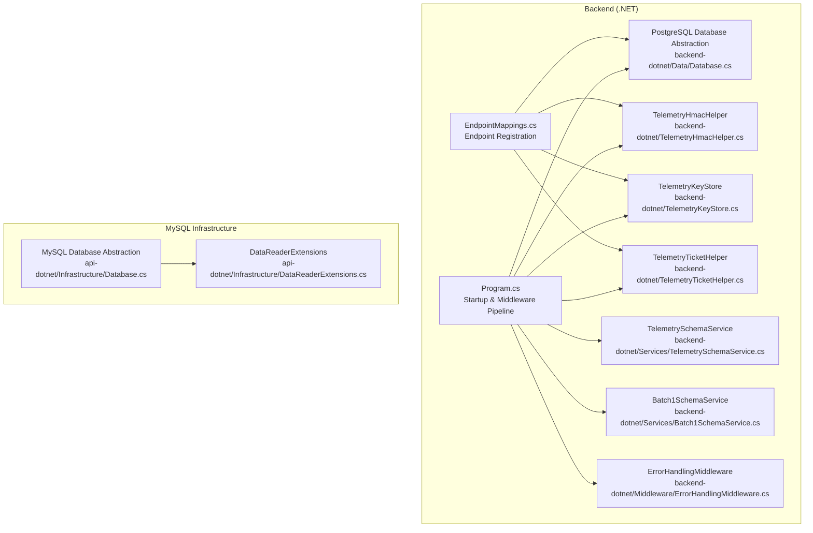
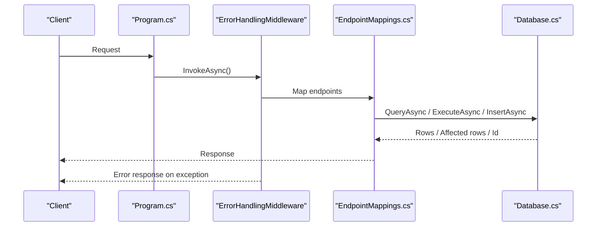
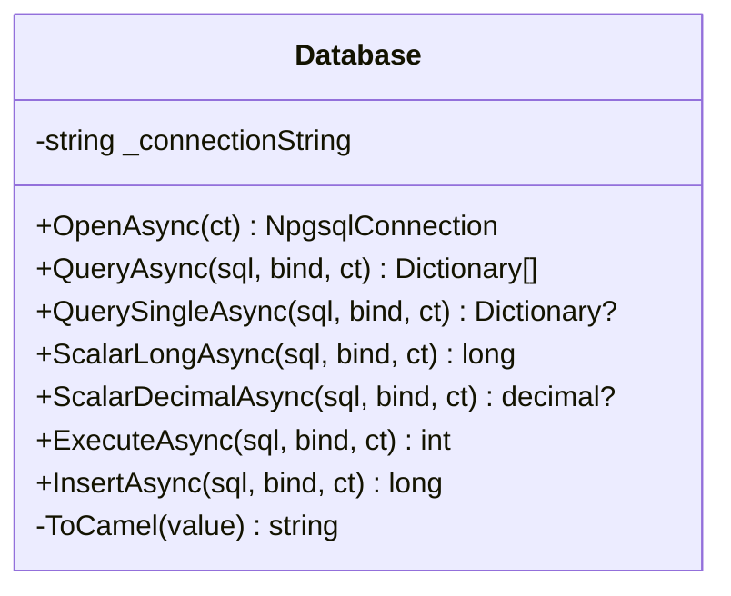
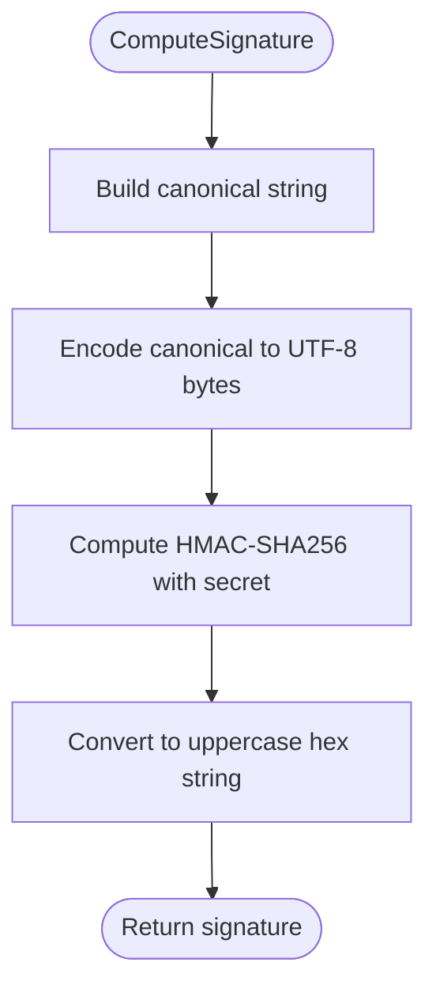
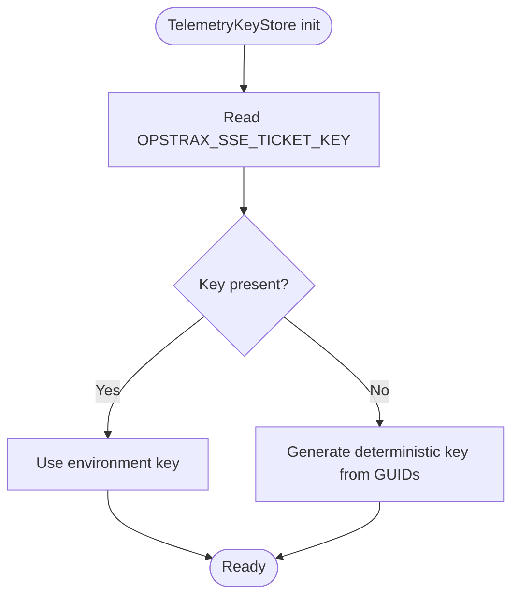
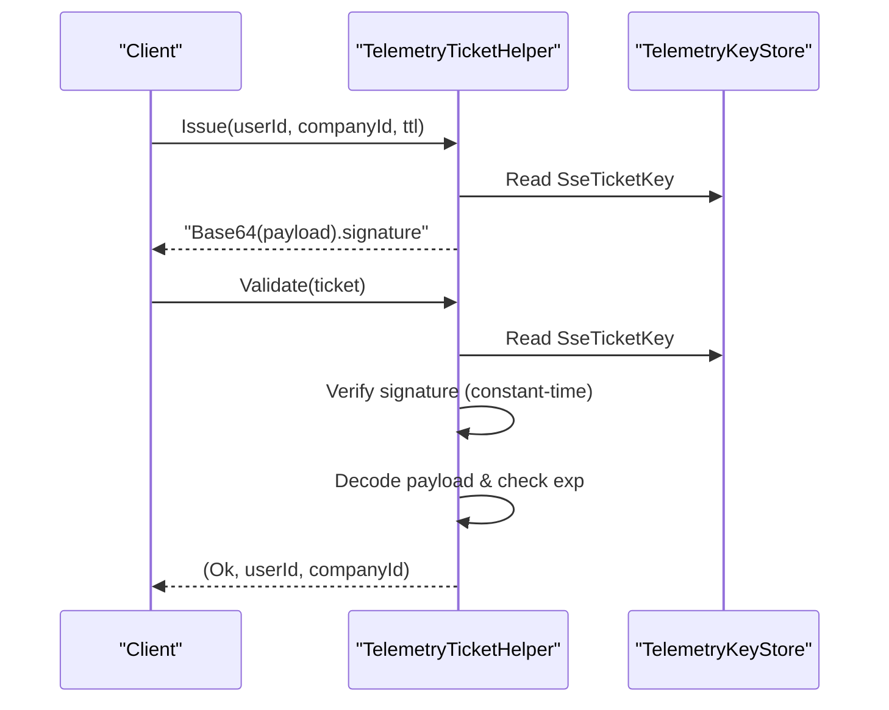
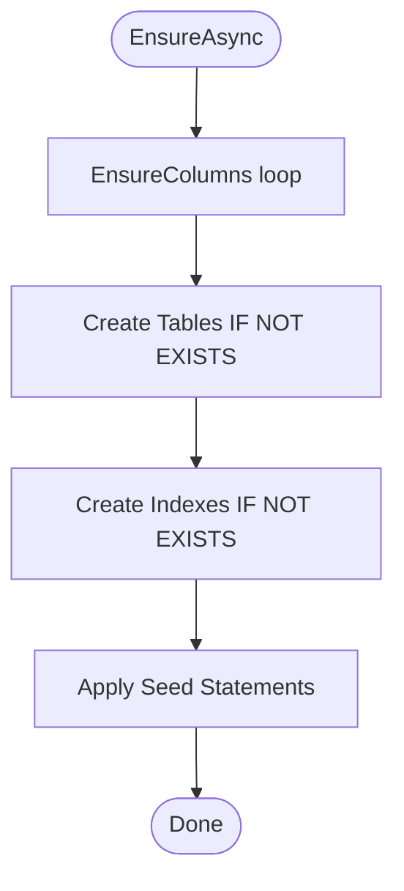
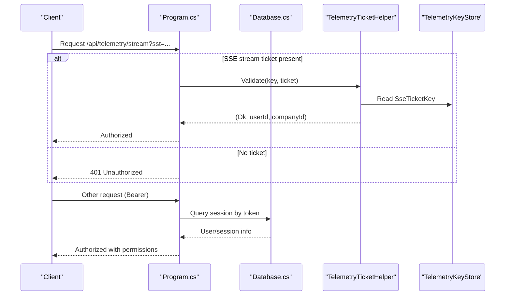
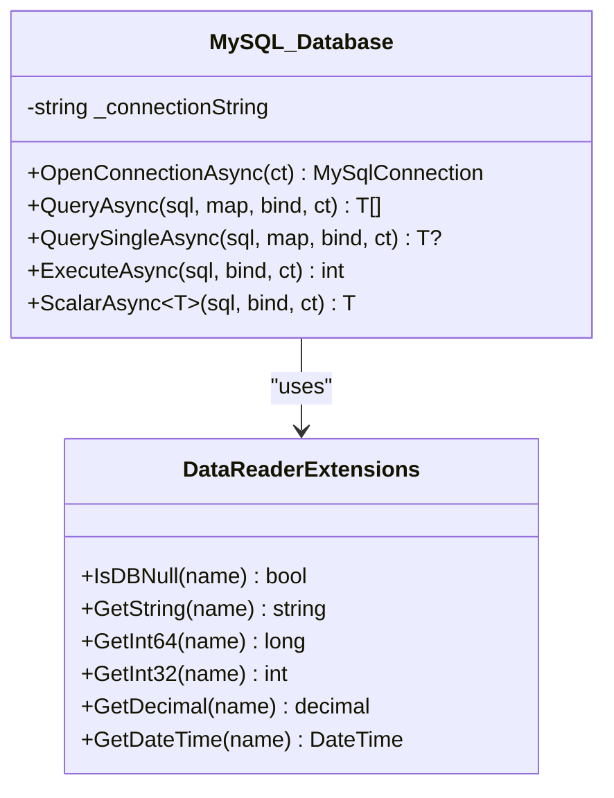
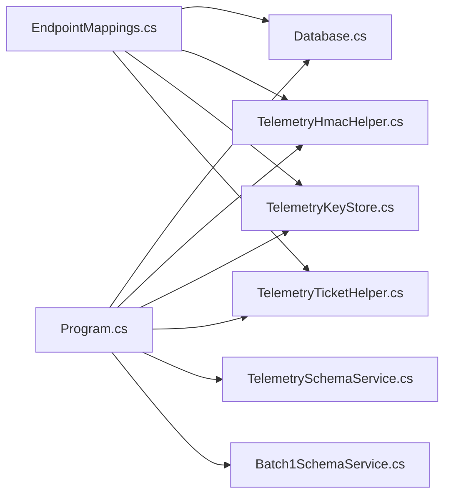

# Data Access & Database Layer

<cite>
**Referenced Files in This Document**
- [Database.cs](file://backend-dotnet/Data/Database.cs)
- [TelemetryHmacHelper.cs](file://backend-dotnet/TelemetryHmacHelper.cs)
- [TelemetryKeyStore.cs](file://backend-dotnet/TelemetryKeyStore.cs)
- [TelemetryTicketHelper.cs](file://backend-dotnet/TelemetryTicketHelper.cs)
- [Program.cs](file://backend-dotnet/Program.cs)
- [EndpointMappings.cs](file://backend-dotnet/Controllers/EndpointMappings.cs)
- [TelemetrySchemaService.cs](file://backend-dotnet/Services/TelemetrySchemaService.cs)
- [Batch1SchemaService.cs](file://backend-dotnet/Services/Batch1SchemaService.cs)
- [ErrorHandlingMiddleware.cs](file://backend-dotnet/Middleware/ErrorHandlingMiddleware.cs)
- [Database.cs](file://api-dotnet/Infrastructure/Database.cs)
- [DataReaderExtensions.cs](file://api-dotnet/Infrastructure/DataReaderExtensions.cs)
</cite>

## Table of Contents
1. [Introduction](#introduction)
2. [Project Structure](#project-structure)
3. [Core Components](#core-components)
4. [Architecture Overview](#architecture-overview)
5. [Detailed Component Analysis](#detailed-component-analysis)
6. [Dependency Analysis](#dependency-analysis)
7. [Performance Considerations](#performance-considerations)
8. [Troubleshooting Guide](#troubleshooting-guide)
9. [Conclusion](#conclusion)

## Introduction
This document describes the data access layer and database integration for the backend systems. It focuses on:
- The PostgreSQL abstraction for connection management and query execution
- Telemetry HMAC helper for secure device ingest validation
- Telemetry key store for managing SSE ticket signing keys
- Telemetry ticket helper for issuing and validating short-lived stream tickets (SST)
- Query patterns, parameter binding, transaction management, and error handling
- Schema service pattern for migrations and version management across multiple batches

## Project Structure
The data access layer is implemented in C# with two primary database targets:
- PostgreSQL-backed service layer with a dedicated Database abstraction
- MySQL-backed infrastructure layer for a companion service

**Diagram sources**
- [Database.cs:1-86](file://backend-dotnet/Data/Database.cs#L1-L86)
- [TelemetryHmacHelper.cs:1-33](file://backend-dotnet/TelemetryHmacHelper.cs#L1-L33)
- [TelemetryKeyStore.cs:1-12](file://backend-dotnet/TelemetryKeyStore.cs#L1-L12)
- [TelemetryTicketHelper.cs:1-51](file://backend-dotnet/TelemetryTicketHelper.cs#L1-L51)
- [TelemetrySchemaService.cs:1-145](file://backend-dotnet/Services/TelemetrySchemaService.cs#L1-L145)
- [Batch1SchemaService.cs:1-272](file://backend-dotnet/Services/Batch1SchemaService.cs#L1-L272)
- [ErrorHandlingMiddleware.cs:1-22](file://backend-dotnet/Middleware/ErrorHandlingMiddleware.cs#L1-L22)
- [Program.cs:1-452](file://backend-dotnet/Program.cs#L1-L452)
- [EndpointMappings.cs:1-800](file://backend-dotnet/Controllers/EndpointMappings.cs#L1-L800)
- [Database.cs:1-77](file://api-dotnet/Infrastructure/Database.cs#L1-L77)
- [DataReaderExtensions.cs:1-14](file://api-dotnet/Infrastructure/DataReaderExtensions.cs#L1-L14)

**Section sources**
- [Program.cs:14-90](file://backend-dotnet/Program.cs#L14-L90)
- [EndpointMappings.cs:19-78](file://backend-dotnet/Controllers/EndpointMappings.cs#L19-L78)

## Core Components
This section outlines the primary building blocks of the data access layer.

- PostgreSQL Database abstraction
  - Provides connection lifecycle, query execution, scalar retrieval, and insert-with-returning-id patterns
  - Uses parameterized queries and safe dictionary mapping for results
  - Implements resource-safe disposal of connections, commands, and readers

- Telemetry HMAC helper
  - Computes canonical request signatures for device ingest validation
  - Produces SHA-256 hashes and constant-time comparisons for signature verification

- Telemetry key store
  - Centralized storage for SSE ticket signing key
  - Reads from environment variable or generates a deterministic fallback

- Telemetry ticket helper
  - Issues short-lived tickets (default TTL 90 seconds) containing user/company identifiers and expiration
  - Validates tickets by verifying signature, decoding payload, and checking expiration

- Schema services
  - Ensures database schema evolution across batches (columns, tables, indexes, seeds)
  - Executes idempotent migrations and handles partial failures gracefully

**Section sources**
- [Database.cs:10-84](file://backend-dotnet/Data/Database.cs#L10-L84)
- [TelemetryHmacHelper.cs:8-31](file://backend-dotnet/TelemetryHmacHelper.cs#L8-L31)
- [TelemetryKeyStore.cs:5-11](file://backend-dotnet/TelemetryKeyStore.cs#L5-L11)
- [TelemetryTicketHelper.cs:5-49](file://backend-dotnet/TelemetryTicketHelper.cs#L5-L49)
- [TelemetrySchemaService.cs:7-21](file://backend-dotnet/Services/TelemetrySchemaService.cs#L7-L21)
- [Batch1SchemaService.cs:7-40](file://backend-dotnet/Services/Batch1SchemaService.cs#L7-L40)

## Architecture Overview
The runtime architecture integrates middleware, endpoint mapping, and schema bootstrapping with the PostgreSQL abstraction.

**Diagram sources**
- [Program.cs:101-102](file://backend-dotnet/Program.cs#L101-L102)
- [ErrorHandlingMiddleware.cs:8-20](file://backend-dotnet/Middleware/ErrorHandlingMiddleware.cs#L8-L20)
- [EndpointMappings.cs:21-22](file://backend-dotnet/Controllers/EndpointMappings.cs#L21-L22)
- [Database.cs:17-63](file://backend-dotnet/Data/Database.cs#L17-L63)

## Detailed Component Analysis

### PostgreSQL Database Abstraction
The Database class encapsulates PostgreSQL connectivity and query execution patterns:
- Connection management
  - Opens a new NpgsqlConnection per operation and ensures disposal
  - Throws if the default connection string is missing
- Query execution
  - QueryAsync maps rows to dictionaries with camelCase keys
  - QuerySingleAsync returns the first row or null
  - ScalarLongAsync and ScalarDecimalAsync handle numeric results safely
  - ExecuteAsync executes non-query statements
  - InsertAsync appends RETURNING id if absent and returns the generated identifier
- Parameter binding
  - Accepts an Action<NpgsqlCommand> to add parameters safely
- Resource safety
  - Uses async disposal patterns for connections, commands, and readers

**Diagram sources**
- [Database.cs:5-84](file://backend-dotnet/Data/Database.cs#L5-L84)

**Section sources**
- [Database.cs:10-84](file://backend-dotnet/Data/Database.cs#L10-L84)

### Telemetry HMAC Helper
The TelemetryHmacHelper provides secure signature computation and validation for device ingest requests:
- Canonical signature construction from method, path, timestamp, nonce, and body hash
- SHA-256 hashing of request bodies
- Constant-time comparison to prevent timing attacks

**Diagram sources**
- [TelemetryHmacHelper.cs:8-16](file://backend-dotnet/TelemetryHmacHelper.cs#L8-L16)

**Section sources**
- [TelemetryHmacHelper.cs:8-23](file://backend-dotnet/TelemetryHmacHelper.cs#L8-L23)

### Telemetry Key Store
The TelemetryKeyStore centralizes the SSE ticket signing key:
- Reads OPSTRAX_SSE_TICKET_KEY from environment
- Falls back to a deterministic key derived from two GUIDs if not present

**Diagram sources**
- [TelemetryKeyStore.cs:7-11](file://backend-dotnet/TelemetryKeyStore.cs#L7-L11)

**Section sources**
- [TelemetryKeyStore.cs:5-11](file://backend-dotnet/TelemetryKeyStore.cs#L5-L11)

### Telemetry Ticket Helper
The TelemetryTicketHelper manages short-lived stream tickets (SST):
- Issuance
  - Encodes payload {userId:companyId:exp} with HMAC-SHA256
  - Returns Base64(payload)."signature"
- Validation
  - Splits token into payload/signature
  - Recomputes signature and compares using constant-time equality
  - Parses payload, verifies field count and expiration
- Utility validations
  - Coordinate bounds and speed limits
  - Timestamp freshness window

**Diagram sources**
- [TelemetryTicketHelper.cs:5-36](file://backend-dotnet/TelemetryTicketHelper.cs#L5-L36)
- [TelemetryKeyStore.cs:7-11](file://backend-dotnet/TelemetryKeyStore.cs#L7-L11)

**Section sources**
- [TelemetryTicketHelper.cs:5-49](file://backend-dotnet/TelemetryTicketHelper.cs#L5-L49)

### Schema Service Pattern
Schema services implement a consistent migration pattern:
- EnsureAsync orchestrates column additions, table creation, index creation, and seeding
- Column existence checks use information_schema
- Tables and indexes are created conditionally
- Seeds populate defaults and backfill data

**Diagram sources**
- [TelemetrySchemaService.cs:7-13](file://backend-dotnet/Services/TelemetrySchemaService.cs#L7-L13)
- [Batch1SchemaService.cs:7-23](file://backend-dotnet/Services/Batch1SchemaService.cs#L7-L23)

**Section sources**
- [TelemetrySchemaService.cs:7-143](file://backend-dotnet/Services/TelemetrySchemaService.cs#L7-L143)
- [Batch1SchemaService.cs:7-271](file://backend-dotnet/Services/Batch1SchemaService.cs#L7-L271)

### Endpoint Authentication and Authorization Flow
The middleware pipeline authenticates requests and authorizes endpoints:
- Unauthenticated paths (health, telemetry ingest, public tracking) bypass session checks
- SSE stream path validates ?sst= using TelemetryTicketHelper and TelemetryKeyStore
- Session-based Bearer tokens validated against user_sessions and joined permissions
- Permission sets combined from user and role-level permissions

**Diagram sources**
- [Program.cs:145-172](file://backend-dotnet/Program.cs#L145-L172)
- [Program.cs:190-243](file://backend-dotnet/Program.cs#L190-L243)
- [TelemetryTicketHelper.cs:15-36](file://backend-dotnet/TelemetryTicketHelper.cs#L15-L36)
- [TelemetryKeyStore.cs:7-11](file://backend-dotnet/TelemetryKeyStore.cs#L7-L11)
- [Database.cs:17-37](file://backend-dotnet/Data/Database.cs#L17-L37)

**Section sources**
- [Program.cs:105-243](file://backend-dotnet/Program.cs#L105-L243)

### MySQL Infrastructure (Companion Service)
A separate MySQL abstraction exists for another service:
- Connection open/close lifecycle
- Generic query mapping via reader extensions
- Scalar retrieval with type conversion
- Extension methods for safe reader access

**Diagram sources**
- [Database.cs:5-76](file://api-dotnet/Infrastructure/Database.cs#L5-L76)
- [DataReaderExtensions.cs:5-13](file://api-dotnet/Infrastructure/DataReaderExtensions.cs#L5-L13)

**Section sources**
- [Database.cs:9-76](file://api-dotnet/Infrastructure/Database.cs#L9-L76)
- [DataReaderExtensions.cs:5-13](file://api-dotnet/Infrastructure/DataReaderExtensions.cs#L5-L13)

## Dependency Analysis
The data access layer exhibits clear separation of concerns:
- Program.cs registers the Database singleton and orchestrates schema bootstrapping
- EndpointMappings.cs depends on Database for all data operations
- Telemetry components are injected via Program.cs and accessed by middleware and endpoints
- Schema services depend on Database for idempotent migrations

**Diagram sources**
- [Program.cs:14-90](file://backend-dotnet/Program.cs#L14-L90)
- [EndpointMappings.cs:1-10](file://backend-dotnet/Controllers/EndpointMappings.cs#L1-L10)
- [Database.cs:1-86](file://backend-dotnet/Data/Database.cs#L1-L86)
- [TelemetryHmacHelper.cs:1-33](file://backend-dotnet/TelemetryHmacHelper.cs#L1-L33)
- [TelemetryKeyStore.cs:1-12](file://backend-dotnet/TelemetryKeyStore.cs#L1-L12)
- [TelemetryTicketHelper.cs:1-51](file://backend-dotnet/TelemetryTicketHelper.cs#L1-L51)
- [TelemetrySchemaService.cs:1-145](file://backend-dotnet/Services/TelemetrySchemaService.cs#L1-L145)
- [Batch1SchemaService.cs:1-272](file://backend-dotnet/Services/Batch1SchemaService.cs#L1-L272)

**Section sources**
- [Program.cs:14-90](file://backend-dotnet/Program.cs#L14-L90)
- [EndpointMappings.cs:1-10](file://backend-dotnet/Controllers/EndpointMappings.cs#L1-L10)

## Performance Considerations
- Connection lifecycle
  - Each operation opens a fresh connection; consider connection pooling at the Npgsql level for production deployments
- Query patterns
  - Prefer parameterized queries and avoid dynamic SQL concatenation
  - Use scalar retrieval for single-value queries to reduce overhead
- Indexing
  - Schema services create indexes for hotspots; maintain them as data volumes grow
- Middleware overhead
  - Keep middleware minimal; avoid heavy synchronous operations in the pipeline

## Troubleshooting Guide
- Connection errors
  - Verify the DefaultConnection string is configured; the Database constructor throws if missing
- Authentication failures
  - Ensure Bearer tokens are present and valid; confirm user_sessions and role permissions
  - For SSE streams, confirm ?sst= is present and not expired
- Telemetry ingest validation
  - Confirm canonical string composition and HMAC-SHA256 alignment between client and server
  - Use constant-time comparison to avoid timing-based leaks
- Schema migration issues
  - Review EnsureAsync logs; partial failures are caught and logged during startup
- General exceptions
  - ErrorHandlingMiddleware catches unhandled exceptions and returns standardized JSON responses

**Section sources**
- [Database.cs:7-8](file://backend-dotnet/Data/Database.cs#L7-L8)
- [Program.cs:174-207](file://backend-dotnet/Program.cs#L174-L207)
- [Program.cs:145-172](file://backend-dotnet/Program.cs#L145-L172)
- [TelemetryHmacHelper.cs:25-31](file://backend-dotnet/TelemetryHmacHelper.cs#L25-L31)
- [ErrorHandlingMiddleware.cs:14-18](file://backend-dotnet/Middleware/ErrorHandlingMiddleware.cs#L14-L18)

## Conclusion
The data access layer combines a robust PostgreSQL abstraction with secure telemetry mechanisms and a repeatable schema migration pattern. The modular design enables clear separation of concerns, predictable error handling, and scalable evolution across multiple batches. Adopting connection pooling, maintaining indexes, and following parameterized query practices will further strengthen reliability and performance.