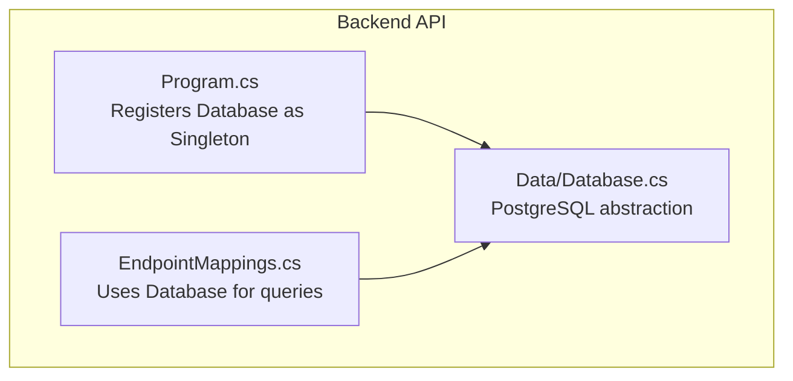
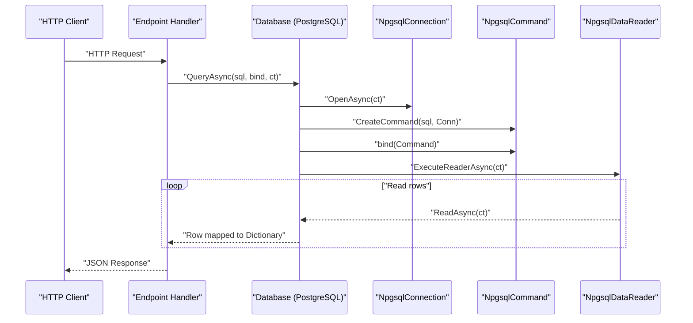
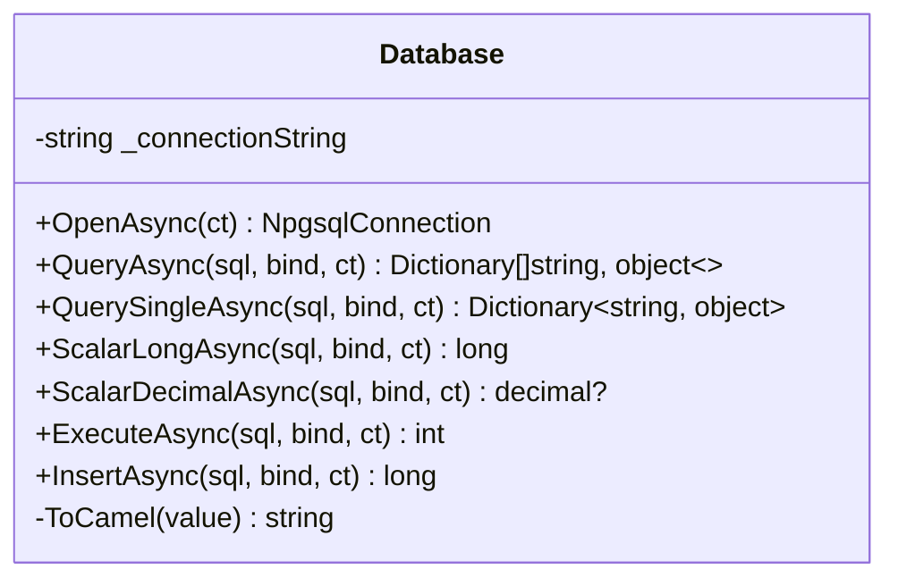
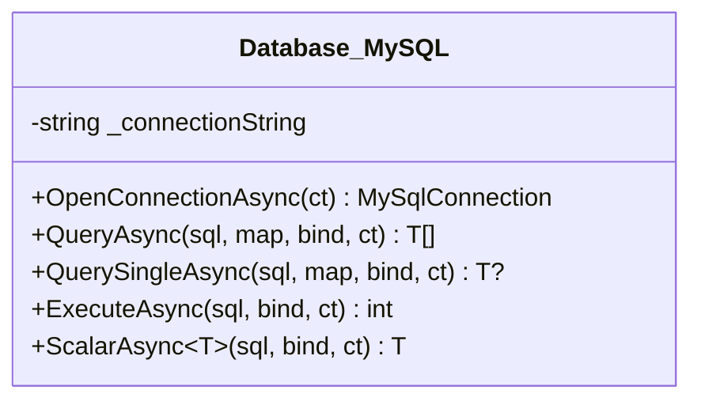
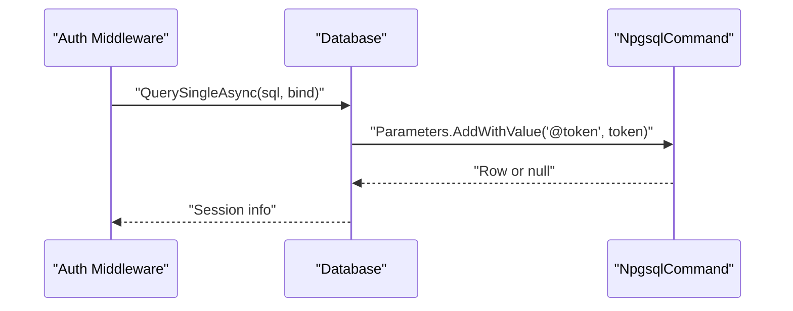
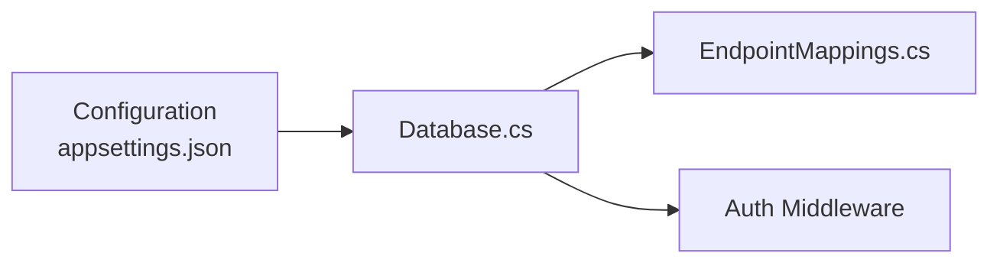

# Database Abstraction Layer

<cite>
**Referenced Files in This Document**
- [Database.cs](file://backend-dotnet/Data/Database.cs)
- [Program.cs](file://backend-dotnet/Program.cs)
- [EndpointMappings.cs](file://backend-dotnet/Controllers/EndpointMappings.cs)
- [Database.cs](file://api-dotnet/Infrastructure/Database.cs)
- [appsettings.json](file://api-dotnet/appsettings.json)
- [DataReaderExtensions.cs](file://api-dotnet/Infrastructure/DataReaderExtensions.cs)
</cite>

## Table of Contents
1. [Introduction](#introduction)
2. [Project Structure](#project-structure)
3. [Core Components](#core-components)
4. [Architecture Overview](#architecture-overview)
5. [Detailed Component Analysis](#detailed-component-analysis)
6. [Dependency Analysis](#dependency-analysis)
7. [Performance Considerations](#performance-considerations)
8. [Troubleshooting Guide](#troubleshooting-guide)
9. [Conclusion](#conclusion)

## Introduction
This document describes the PostgreSQL database abstraction layer implemented in the backend-dotnet project. It focuses on the Database class that encapsulates connection management, query execution, parameter binding, cancellation token support, and field name conversion to camelCase. It also covers usage patterns demonstrated across the application, including async execution, scalar retrieval, and insert operations with automatic ID returning.

## Project Structure
The database abstraction layer is implemented in a dedicated class under the Data namespace. It is registered as a singleton service and consumed by endpoint handlers and middleware. Configuration is provided via appsettings.json for connection strings.

**Diagram sources**
- [Program.cs](file://backend-dotnet/Program.cs)
- [EndpointMappings.cs](file://backend-dotnet/Controllers/EndpointMappings.cs)
- [Database.cs](file://backend-dotnet/Data/Database.cs)

**Section sources**
- [Program.cs](file://backend-dotnet/Program.cs)
- [Database.cs](file://backend-dotnet/Data/Database.cs)

## Core Components
- Database class (PostgreSQL): Provides connection lifecycle, query execution, scalar operations, and insert with automatic ID returning. It converts column names to camelCase for ergonomic consumption.
- Database class (MySQL): Separate abstraction for MySQL-based APIs, included for completeness of the repository’s database landscape.
- Configuration: Connection strings are loaded from configuration and validated during construction.
- Parameter binding: Uses delegate-based binding to set command parameters safely.
- Cancellation tokens: All async methods accept CancellationToken for cooperative cancellation.

**Section sources**
- [Database.cs](file://backend-dotnet/Data/Database.cs)
- [Database.cs](file://api-dotnet/Infrastructure/Database.cs)
- [appsettings.json](file://api-dotnet/appsettings.json)

## Architecture Overview
The Database abstraction sits between HTTP endpoints and the database. Endpoints resolve the Database service from DI and execute queries with parameter binding delegates. The abstraction manages connections and commands, ensuring proper disposal and async execution.

**Diagram sources**
- [Program.cs](file://backend-dotnet/Program.cs)
- [EndpointMappings.cs](file://backend-dotnet/Controllers/EndpointMappings.cs)
- [Database.cs](file://backend-dotnet/Data/Database.cs)

## Detailed Component Analysis

### PostgreSQL Database Abstraction
The PostgreSQL Database class encapsulates:
- Connection management: Opens a new connection per operation and ensures disposal.
- Query execution:
  - QueryAsync: Returns a list of dictionaries with camelCase keys.
  - QuerySingleAsync: Returns the first row or null.
- Scalar operations:
  - ScalarLongAsync: Executes a scalar query and returns a long.
  - ScalarDecimalAsync: Executes a scalar query and returns a decimal?.
- Non-query execution: ExecuteAsync returns the number of affected rows.
- Insert with automatic ID returning: InsertAsync appends RETURNING id if missing and returns the inserted ID.

Parameter binding pattern:
- bind delegates receive an NpgsqlCommand and add parameters using AddWithValue or typed setters.
- Cancellation tokens are passed through to all async operations.

Field name conversion:
- ToCamel converts snake_case or PascalCase column names to camelCase for ergonomic client consumption.

**Diagram sources**
- [Database.cs](file://backend-dotnet/Data/Database.cs)

**Section sources**
- [Database.cs](file://backend-dotnet/Data/Database.cs)

### MySQL Database Abstraction (Context)
The MySQL Database class provides similar patterns for MySQL:
- Connection management via MySqlConnection.
- QueryAsync with a mapping function to arbitrary types.
- QuerySingleAsync for single-row retrieval.
- ExecuteAsync for non-query statements.
- ScalarAsync generic over TResult for scalar retrieval.

Parameter binding uses MySqlCommand and Action<MySqlCommand> delegates. Cancellation tokens are supported.

**Diagram sources**
- [Database.cs](file://api-dotnet/Infrastructure/Database.cs)

**Section sources**
- [Database.cs](file://api-dotnet/Infrastructure/Database.cs)

### Parameter Binding Patterns and Cancellation Tokens
- Parameter binding: Delegates receive the command and add parameters using AddWithValue or typed setters. Examples appear across endpoint mappings where @-prefixed parameters are bound.
- Cancellation tokens: All async methods accept CancellationToken and pass it to OpenAsync, ExecuteReaderAsync, ExecuteNonQueryAsync, and ExecuteScalarAsync.

Practical examples of parameter binding in endpoint mappings:
- Vehicle creation binds @companyId, @name, @type, @lat, @lng, @radius.
- Update operations bind @id, @companyId, and other fields conditionally.
- Delete operations bind @id and @companyId.

**Section sources**
- [EndpointMappings.cs](file://backend-dotnet/Controllers/EndpointMappings.cs)
- [Database.cs](file://backend-dotnet/Data/Database.cs)

### CamelCase Field Name Conversion Utility
The ToCamel method transforms column names to camelCase:
- Split by underscore, lowercase first part, capitalize first letter of subsequent parts, and concatenate.
- Applied during QueryAsync to convert column names for ergonomic consumption.

**Section sources**
- [Database.cs](file://backend-dotnet/Data/Database.cs)

### Usage Examples Across the Application
- Authentication middleware resolves Database and executes a session lookup with parameter binding.
- Health endpoints test connectivity by opening a connection and executing a scalar query.
- Endpoint handlers use QueryAsync to fetch lists and OkRows helpers to return JSON responses.
- InsertAsync is used to persist entities and retrieve the generated ID.

**Diagram sources**
- [Program.cs](file://backend-dotnet/Program.cs)
- [Database.cs](file://backend-dotnet/Data/Database.cs)

**Section sources**
- [Program.cs](file://backend-dotnet/Program.cs)
- [EndpointMappings.cs](file://backend-dotnet/Controllers/EndpointMappings.cs)

## Dependency Analysis
- Service registration: Database is registered as a singleton in Program.cs, enabling shared configuration and minimal connection churn.
- Consumption: EndpointMappings.cs and middleware resolve Database from DI and execute queries.
- Configuration: Connection string is loaded from configuration and validated during construction.

**Diagram sources**
- [appsettings.json](file://api-dotnet/appsettings.json)
- [Database.cs](file://backend-dotnet/Data/Database.cs)
- [EndpointMappings.cs](file://backend-dotnet/Controllers/EndpointMappings.cs)
- [Program.cs](file://backend-dotnet/Program.cs)

**Section sources**
- [Program.cs](file://backend-dotnet/Program.cs)
- [Database.cs](file://backend-dotnet/Data/Database.cs)
- [appsettings.json](file://api-dotnet/appsettings.json)

## Performance Considerations
- Connection lifecycle: Each method opens a fresh connection and disposes it promptly. This avoids pooling overhead but keeps connections short-lived. For high-throughput scenarios, consider implementing a connection pool wrapper around NpgsqlConnection.
- Async execution: All operations are fully asynchronous with cancellation support, preventing thread blocking.
- Parameter binding: Using AddWithValue is convenient; for frequent operations, consider strongly-typed parameters and explicit types to reduce boxing and improve performance.
- Field conversion: ToCamel adds minimal overhead during row mapping; acceptable for typical loads but worth noting in hot paths.
- Scalar operations: Prefer ScalarLongAsync and ScalarDecimalAsync for count/aggregate queries to minimize payload.

[No sources needed since this section provides general guidance]

## Troubleshooting Guide
- Missing connection string: Construction throws an exception if the required connection string is absent. Verify configuration.
- Null or DBNull scalars: ScalarLongAsync returns 0 and ScalarDecimalAsync returns null for null values; ensure callers handle defaults appropriately.
- Parameter binding errors: Ensure bind delegates add required parameters and avoid SQL injection by using parameterized queries.
- Cancellation: Propagate cancellation tokens from callers to respect timeouts and shutdown signals.
- Middleware authentication failures: If session lookup fails, verify token validity and database connectivity.

**Section sources**
- [Database.cs](file://backend-dotnet/Data/Database.cs)
- [Program.cs](file://backend-dotnet/Program.cs)

## Conclusion
The PostgreSQL Database abstraction provides a concise, consistent interface for async database operations with parameter binding, cancellation support, and ergonomic camelCase field names. Its usage spans authentication, health checks, and endpoint handlers, demonstrating practical patterns for querying, inserting, and scalar retrieval. For production workloads, consider adding connection pooling and typed parameterization to further optimize performance.