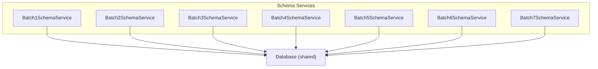
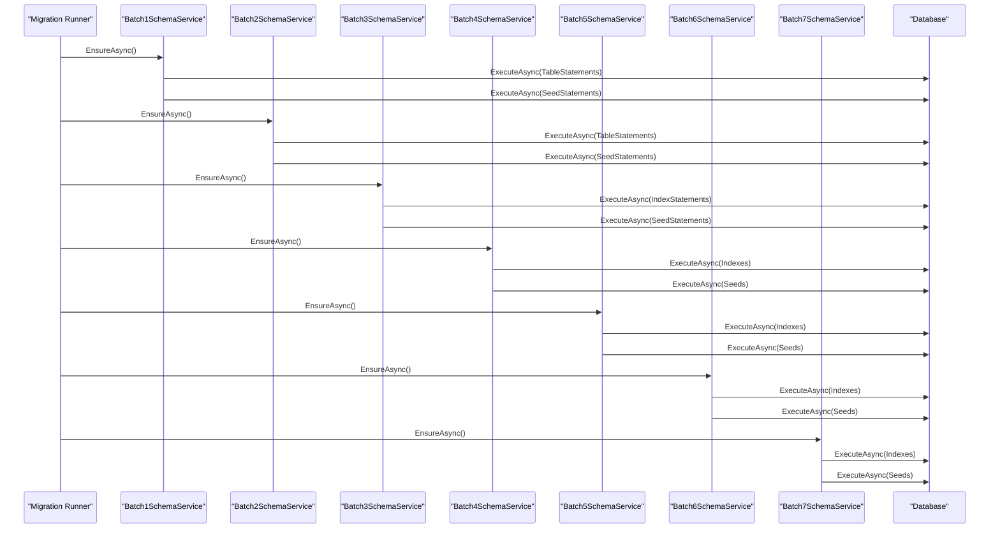
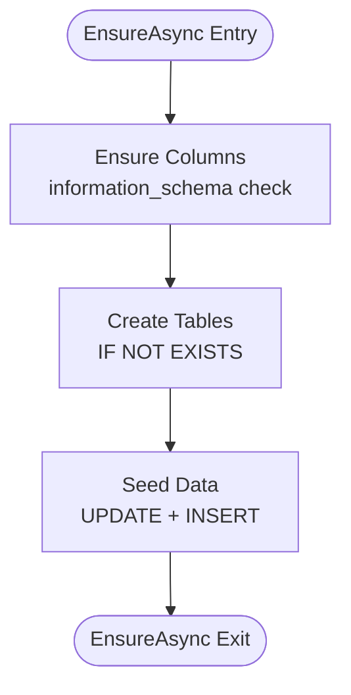
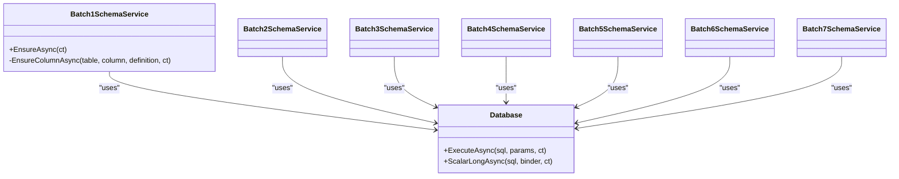

# Schema Management & Migrations

<cite>
**Referenced Files in This Document**
- [Batch1SchemaService.cs](file://backend-dotnet/Services/Batch1SchemaService.cs)
- [Batch2SchemaService.cs](file://backend-dotnet/Services/Batch2SchemaService.cs)
- [Batch3SchemaService.cs](file://backend-dotnet/Services/Batch3SchemaService.cs)
- [Batch4SchemaService.cs](file://backend-dotnet/Services/Batch4SchemaService.cs)
- [Batch5SchemaService.cs](file://backend-dotnet/Services/Batch5SchemaService.cs)
- [Batch6SchemaService.cs](file://backend-dotnet/Services/Batch6SchemaService.cs)
- [Batch7SchemaService.cs](file://backend-dotnet/Services/Batch7SchemaService.cs)
- [Database.cs](file://backend-dotnet/Data/Database.cs)
</cite>

## Table of Contents
1. [Introduction](#introduction)
2. [Project Structure](#project-structure)
3. [Core Components](#core-components)
4. [Architecture Overview](#architecture-overview)
5. [Detailed Component Analysis](#detailed-component-analysis)
6. [Dependency Analysis](#dependency-analysis)
7. [Performance Considerations](#performance-considerations)
8. [Troubleshooting Guide](#troubleshooting-guide)
9. [Conclusion](#conclusion)

## Introduction
This document describes the schema management system built around a batch-based migration approach spanning seven batches. Each batch encapsulates a focused set of schema changes, constraints, indexes, and data seeding tailored to distinct functional domains such as operations, safety, compliance, finance, and reporting. The system follows a consistent service pattern that ensures idempotent schema evolution, supports tenant-aware operations, and enables controlled rollouts and audits.

## Project Structure
The schema management resides in the backend-dotnet project under Services, with each batch represented by a dedicated service class. The services depend on a shared Database abstraction for executing SQL statements and checking column existence.

**Diagram sources**
- [Batch1SchemaService.cs:5-272](file://backend-dotnet/Services/Batch1SchemaService.cs#L5-L272)
- [Batch2SchemaService.cs:5-277](file://backend-dotnet/Services/Batch2SchemaService.cs#L5-L277)
- [Batch3SchemaService.cs:5-390](file://backend-dotnet/Services/Batch3SchemaService.cs#L5-L390)
- [Batch4SchemaService.cs:5-312](file://backend-dotnet/Services/Batch4SchemaService.cs#L5-L312)
- [Batch5SchemaService.cs:5-598](file://backend-dotnet/Services/Batch5SchemaService.cs#L5-L598)
- [Batch6SchemaService.cs:5-468](file://backend-dotnet/Services/Batch6SchemaService.cs#L5-L468)
- [Batch7SchemaService.cs:5-588](file://backend-dotnet/Services/Batch7SchemaService.cs#L5-L588)
- [Database.cs](file://backend-dotnet/Data/Database.cs)

**Section sources**
- [Batch1SchemaService.cs:1-272](file://backend-dotnet/Services/Batch1SchemaService.cs#L1-L272)
- [Batch2SchemaService.cs:1-277](file://backend-dotnet/Services/Batch2SchemaService.cs#L1-L277)
- [Batch3SchemaService.cs:1-390](file://backend-dotnet/Services/Batch3SchemaService.cs#L1-L390)
- [Batch4SchemaService.cs:1-312](file://backend-dotnet/Services/Batch4SchemaService.cs#L1-L312)
- [Batch5SchemaService.cs:1-598](file://backend-dotnet/Services/Batch5SchemaService.cs#L1-L598)
- [Batch6SchemaService.cs:1-468](file://backend-dotnet/Services/Batch6SchemaService.cs#L1-L468)
- [Batch7SchemaService.cs:1-588](file://backend-dotnet/Services/Batch7SchemaService.cs#L1-L588)
- [Database.cs](file://backend-dotnet/Data/Database.cs)

## Core Components
Each batch service implements a uniform EnsureAsync method that orchestrates:
- Column additions via EnsureColumnAsync (idempotent checks against information_schema)
- Table creation using CREATE TABLE IF NOT EXISTS
- Index creation with defensive try/catch blocks to handle duplicates
- Data seeding with INSERT statements and UPDATE corrections

The Database abstraction exposes:
- ExecuteAsync for DDL/DML
- ScalarLongAsync for existence checks
- Parameterized queries to prevent injection

Key patterns:
- ColumnDefinition records define incremental schema deltas
- TableStatements and SeedStatements arrays centralize SQL
- IndexStatements arrays enable selective index creation with error tolerance

**Section sources**
- [Batch1SchemaService.cs:7-23](file://backend-dotnet/Services/Batch1SchemaService.cs#L7-L23)
- [Batch2SchemaService.cs:7-23](file://backend-dotnet/Services/Batch2SchemaService.cs#L7-L23)
- [Batch3SchemaService.cs:7-28](file://backend-dotnet/Services/Batch3SchemaService.cs#L7-L28)
- [Batch4SchemaService.cs:7-13](file://backend-dotnet/Services/Batch4SchemaService.cs#L7-L13)
- [Batch5SchemaService.cs:7-13](file://backend-dotnet/Services/Batch5SchemaService.cs#L7-L13)
- [Batch6SchemaService.cs:7-13](file://backend-dotnet/Services/Batch6SchemaService.cs#L7-L13)
- [Batch7SchemaService.cs:7-13](file://backend-dotnet/Services/Batch7SchemaService.cs#L7-L13)
- [Database.cs](file://backend-dotnet/Data/Database.cs)

## Architecture Overview
The migration pipeline executes services in sequence, each responsible for a functional domain. The design emphasizes:
- Idempotency: CREATE IF NOT EXISTS and column existence checks
- Tenant awareness: Many tables include company_id or tenant_id fields
- Auditability: Extensive audit_logs and report catalogs
- Scalability: Indexes and partition-friendly designs

**Diagram sources**
- [Batch1SchemaService.cs:7-23](file://backend-dotnet/Services/Batch1SchemaService.cs#L7-L23)
- [Batch2SchemaService.cs:7-23](file://backend-dotnet/Services/Batch2SchemaService.cs#L7-L23)
- [Batch3SchemaService.cs:7-28](file://backend-dotnet/Services/Batch3SchemaService.cs#L7-L28)
- [Batch4SchemaService.cs:7-13](file://backend-dotnet/Services/Batch4SchemaService.cs#L7-L13)
- [Batch5SchemaService.cs:7-13](file://backend-dotnet/Services/Batch5SchemaService.cs#L7-L13)
- [Batch6SchemaService.cs:7-13](file://backend-dotnet/Services/Batch6SchemaService.cs#L7-L13)
- [Batch7SchemaService.cs:7-13](file://backend-dotnet/Services/Batch7SchemaService.cs#L7-L13)
- [Database.cs](file://backend-dotnet/Data/Database.cs)

## Detailed Component Analysis

### Batch 1: Foundation Tables and Base Columns
Responsibilities:
- Adds foundational columns to core entities (vehicles, drivers, customers, assets, users)
- Creates operational tables: documents, assignments, certifications, timeline events, location_events
- Seeds initial data and backfills historical evidence
- Establishes location_events indexing for time-series queries

Key implementation details:
- Column additions use EnsureColumnAsync with information_schema checks
- TableStatements leverage CREATE TABLE IF NOT EXISTS
- SeedStatements include targeted UPDATEs and INSERTs with conditional WHERE NOT EXISTS
- Indexes on location_events optimize vehicle/driver/time queries

**Diagram sources**
- [Batch1SchemaService.cs:7-23](file://backend-dotnet/Services/Batch1SchemaService.cs#L7-L23)

**Section sources**
- [Batch1SchemaService.cs:25-40](file://backend-dotnet/Services/Batch1SchemaService.cs#L25-L40)
- [Batch1SchemaService.cs:83-186](file://backend-dotnet/Services/Batch1SchemaService.cs#L83-L186)
- [Batch1SchemaService.cs:188-270](file://backend-dotnet/Services/Batch1SchemaService.cs#L188-L270)

### Batch 2: Dispatch, ETA, and Customer Communication
Responsibilities:
- Extends jobs and routes with scheduling, risk, and communication fields
- Introduces ETA updates, customer communications, and proof of delivery
- Seeds realistic dispatch assignments and ETA workflows
- Adds indexes for dispatch and ETA performance

Implementation highlights:
- ColumnDefinition array extends jobs, routes, route_stops, and dispatch entities
- New tables: job_status_events, route_paths, route_recommendations, customer_eta_links, customer_feedback
- SeedStatements populate jobs, routes, route_stops, dispatch_assignments, and ETA workflows

**Section sources**
- [Batch2SchemaService.cs:25-40](file://backend-dotnet/Services/Batch2SchemaService.cs#L25-L40)
- [Batch2SchemaService.cs:120-167](file://backend-dotnet/Services/Batch2SchemaService.cs#L120-L167)
- [Batch2SchemaService.cs:169-275](file://backend-dotnet/Services/Batch2SchemaService.cs#L169-L275)

### Batch 3: Maintenance, DVIR, and Document Lifecycle
Responsibilities:
- Adds maintenance scheduling and work order lifecycle
- Introduces DVIR templates, checklist items, and defect tracking
- Establishes document vault with timeline events
- Seeds maintenance schedules, work orders, DVIR reports, and document records

Implementation highlights:
- Indexes for maintenance, work orders, DVIR, and document expiry
- Comprehensive seed data for preventive maintenance and compliance workflows
- Risk scoring and recommended actions integrated across entities

**Section sources**
- [Batch3SchemaService.cs:49-104](file://backend-dotnet/Services/Batch3SchemaService.cs#L49-L104)
- [Batch3SchemaService.cs:106-226](file://backend-dotnet/Services/Batch3SchemaService.cs#L106-L226)
- [Batch3SchemaService.cs:228-238](file://backend-dotnet/Services/Batch3SchemaService.cs#L228-L238)
- [Batch3SchemaService.cs:240-388](file://backend-dotnet/Services/Batch3SchemaService.cs#L240-L388)

### Batch 4: Safety, Dashcam, and Evidence Management
Responsibilities:
- Introduces safety events, dashcam events, and evidence packages
- Creates coaching tasks and incident management workflows
- Adds driver/vehicle safety scorecards and safety trends
- Seeds safety events, dashcam clips, coaching tasks, and evidence packages

Implementation highlights:
- Indexes for safety, dashcam, and evidence package retrieval
- Rich seed data modeling real-world safety scenarios
- Integration with AI recommendations and notifications

**Section sources**
- [Batch4SchemaService.cs:25-110](file://backend-dotnet/Services/Batch4SchemaService.cs#L25-L110)
- [Batch4SchemaService.cs:112-168](file://backend-dotnet/Services/Batch4SchemaService.cs#L112-L168)
- [Batch4SchemaService.cs:170-178](file://backend-dotnet/Services/Batch4SchemaService.cs#L170-L178)
- [Batch4SchemaService.cs:180-310](file://backend-dotnet/Services/Batch4SchemaService.cs#L180-L310)

### Batch 5: Fuel, Expenses, Contracts, and Cost Margin
Responsibilities:
- Adds fuel transaction anomaly detection and idling cost tracking
- Introduces expense categories, contract rates, and carrier performance
- Implements cost margin records and predictive margin forecasting
- Seeds fuel transactions, idling events, expenses, contracts, and cost leakage items

Implementation highlights:
- Indexes for fuel, idling, expenses, contracts, and cost margin analytics
- Comprehensive seed data for financial workflows and cost leakage detection
- Integration with AI recommendations for cost optimization

**Section sources**
- [Batch5SchemaService.cs:25-115](file://backend-dotnet/Services/Batch5SchemaService.cs#L25-L115)
- [Batch5SchemaService.cs:117-215](file://backend-dotnet/Services/Batch5SchemaService.cs#L117-L215)
- [Batch5SchemaService.cs:217-231](file://backend-dotnet/Services/Batch5SchemaService.cs#L217-L231)
- [Batch5SchemaService.cs:233-596](file://backend-dotnet/Services/Batch5SchemaService.cs#L233-L596)

### Batch 6: Compliance, HOS, and International Standards
Responsibilities:
- Adds country/language profiles and tenant locale settings
- Introduces compliance profiles, rules, and violations
- Implements HOS logs, ELD devices, and driver/vehicle compliance status
- Seeds global compliance data for US, Canada, Saudi Arabia, UAE, and Pakistan

Implementation highlights:
- Country and language tables with locale defaults
- Compliance profiles aligned with FMCSA, Transport Canada, SASO, and RTA
- HOS clocks and ELD device tracking with status and warnings
- Audit packages for compliance reporting

**Section sources**
- [Batch6SchemaService.cs:25-71](file://backend-dotnet/Services/Batch6SchemaService.cs#L25-L71)
- [Batch6SchemaService.cs:73-284](file://backend-dotnet/Services/Batch6SchemaService.cs#L73-L284)
- [Batch6SchemaService.cs:286-297](file://backend-dotnet/Services/Batch6SchemaService.cs#L286-L297)
- [Batch6SchemaService.cs:299-467](file://backend-dotnet/Services/Batch6SchemaService.cs#L299-L467)

### Batch 7: Reporting, SLA/KPI, and Executive Insights
Responsibilities:
- Adds report catalog, report runs, scheduled reports, and exports
- Introduces KPI metrics and targets, SLA records and breaches
- Implements executive snapshots and workforce scheduling
- Seeds comprehensive reporting datasets and executive summaries

Implementation highlights:
- Report catalog with 28+ standard reports across domains
- KPI metrics and targets for operational and financial monitoring
- SLA records with risk scoring and recommended actions
- Audit export requests and enriched audit logs with severity/module context

**Section sources**
- [Batch7SchemaService.cs:25-48](file://backend-dotnet/Services/Batch7SchemaService.cs#L25-L48)
- [Batch7SchemaService.cs:50-224](file://backend-dotnet/Services/Batch7SchemaService.cs#L50-L224)
- [Batch7SchemaService.cs:226-244](file://backend-dotnet/Services/Batch7SchemaService.cs#L226-L244)
- [Batch7SchemaService.cs:246-586](file://backend-dotnet/Services/Batch7SchemaService.cs#L246-L586)

## Dependency Analysis
The batch services share a common Database dependency and rely on PostgreSQL-specific features:
- information_schema queries for idempotent column checks
- CREATE TABLE IF NOT EXISTS for schema idempotency
- JSONB fields for flexible data modeling
- Tenant/company scoping via company_id/tenant_id

**Diagram sources**
- [Batch1SchemaService.cs:5-272](file://backend-dotnet/Services/Batch1SchemaService.cs#L5-L272)
- [Batch2SchemaService.cs:5-277](file://backend-dotnet/Services/Batch2SchemaService.cs#L5-L277)
- [Batch3SchemaService.cs:5-390](file://backend-dotnet/Services/Batch3SchemaService.cs#L5-L390)
- [Batch4SchemaService.cs:5-312](file://backend-dotnet/Services/Batch4SchemaService.cs#L5-L312)
- [Batch5SchemaService.cs:5-598](file://backend-dotnet/Services/Batch5SchemaService.cs#L5-L598)
- [Batch6SchemaService.cs:5-468](file://backend-dotnet/Services/Batch6SchemaService.cs#L5-L468)
- [Batch7SchemaService.cs:5-588](file://backend-dotnet/Services/Batch7SchemaService.cs#L5-L588)
- [Database.cs](file://backend-dotnet/Data/Database.cs)

**Section sources**
- [Batch1SchemaService.cs:5-272](file://backend-dotnet/Services/Batch1SchemaService.cs#L5-L272)
- [Batch2SchemaService.cs:5-277](file://backend-dotnet/Services/Batch2SchemaService.cs#L5-L277)
- [Batch3SchemaService.cs:5-390](file://backend-dotnet/Services/Batch3SchemaService.cs#L5-L390)
- [Batch4SchemaService.cs:5-312](file://backend-dotnet/Services/Batch4SchemaService.cs#L5-L312)
- [Batch5SchemaService.cs:5-598](file://backend-dotnet/Services/Batch5SchemaService.cs#L5-L598)
- [Batch6SchemaService.cs:5-468](file://backend-dotnet/Services/Batch6SchemaService.cs#L5-L468)
- [Batch7SchemaService.cs:5-588](file://backend-dotnet/Services/Batch7SchemaService.cs#L5-L588)
- [Database.cs](file://backend-dotnet/Data/Database.cs)

## Performance Considerations
- Index placement: Strategic indexes on frequently queried columns (e.g., location_events, safety, compliance) improve query performance.
- Batch sequencing: Earlier batches establish core tables and indexes; later batches add reporting and analytics indexes.
- JSONB usage: Flexible storage for semi-structured data but requires careful indexing and query planning.
- Idempotency: CREATE IF NOT EXISTS and column existence checks prevent redundant operations and reduce downtime.
- Tenant isolation: Using company_id/tenant_id allows multi-tenancy without schema duplication.

## Troubleshooting Guide
Common issues and resolutions:
- Duplicate index errors: IndexStatements use try/catch to ignore duplicates; verify index names and uniqueness constraints.
- Column already exists: EnsureColumnAsync prevents errors by checking information_schema before ALTER TABLE.
- Seeding conflicts: WHERE NOT EXISTS clauses and ON CONFLICT DO NOTHING prevent duplicate inserts.
- Migration failures: ExecuteAsync wraps DDL/DML; wrap EnsureAsync calls with transaction boundaries for atomicity.
- Audit gaps: Batch 7 enriches audit_logs with severity and module_key; ensure proper seeding and indexing for performance.

**Section sources**
- [Batch3SchemaService.cs:21-21](file://backend-dotnet/Services/Batch3SchemaService.cs#L21-L21)
- [Batch4SchemaService.cs:11-11](file://backend-dotnet/Services/Batch4SchemaService.cs#L11-L11)
- [Batch5SchemaService.cs:217-231](file://backend-dotnet/Services/Batch5SchemaService.cs#L217-L231)
- [Batch7SchemaService.cs:226-244](file://backend-dotnet/Services/Batch7SchemaService.cs#L226-L244)

## Conclusion
The batch-based schema management system provides a robust, idempotent, and tenant-aware approach to evolving the database schema across seven functional domains. By following a consistent service pattern, leveraging PostgreSQL features, and incorporating comprehensive seeding and auditing, the system supports scalable operations, clear governance, and actionable insights across dispatch, safety, compliance, finance, and reporting.