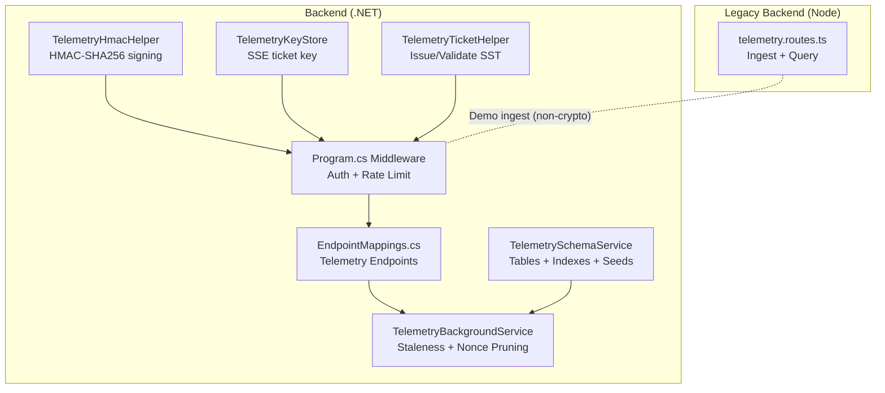
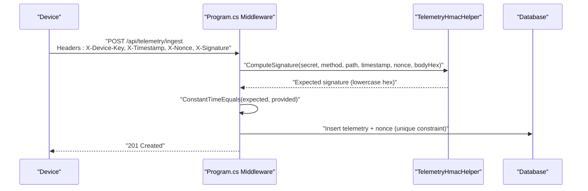
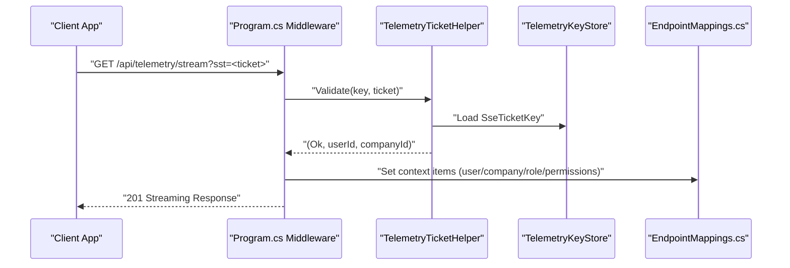
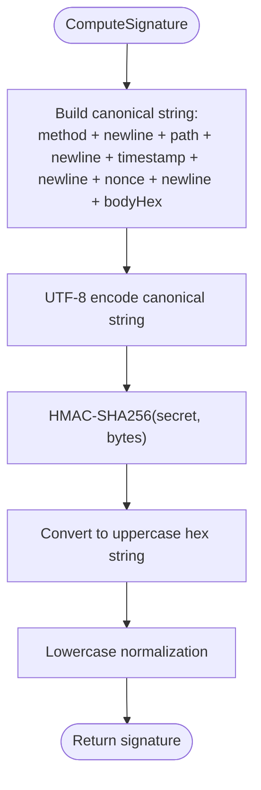
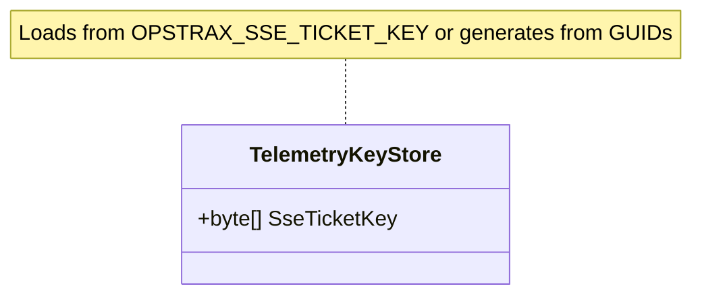
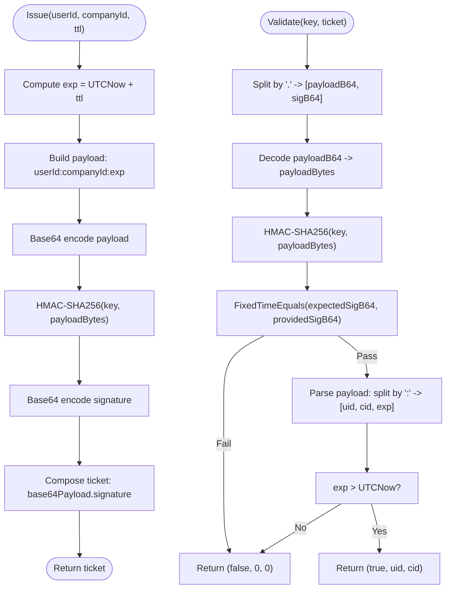
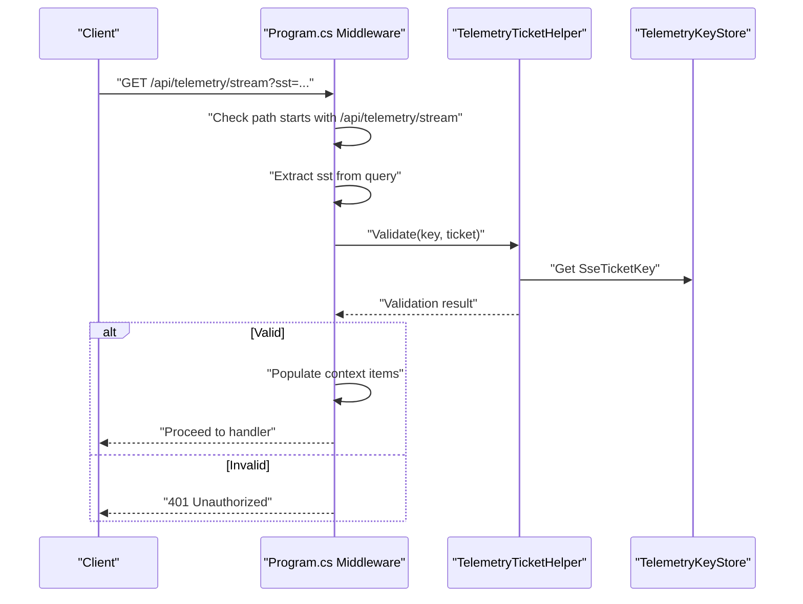
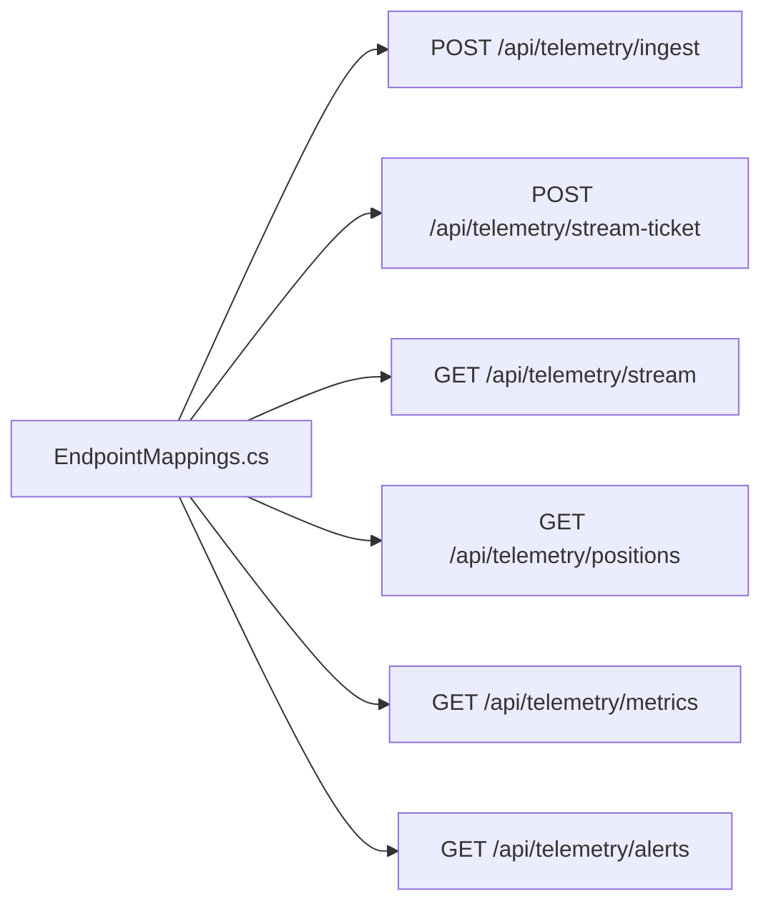
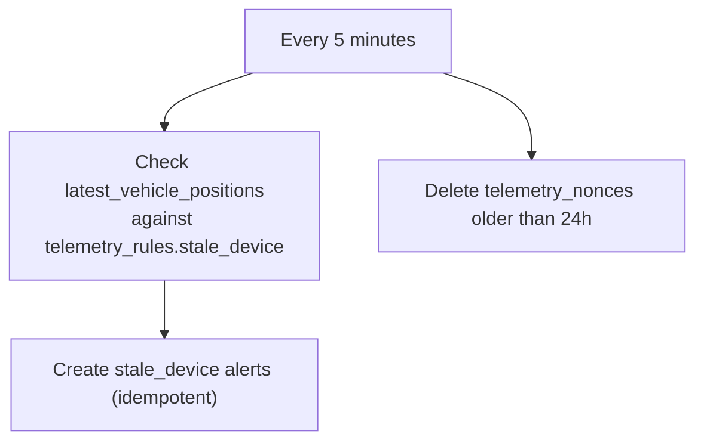
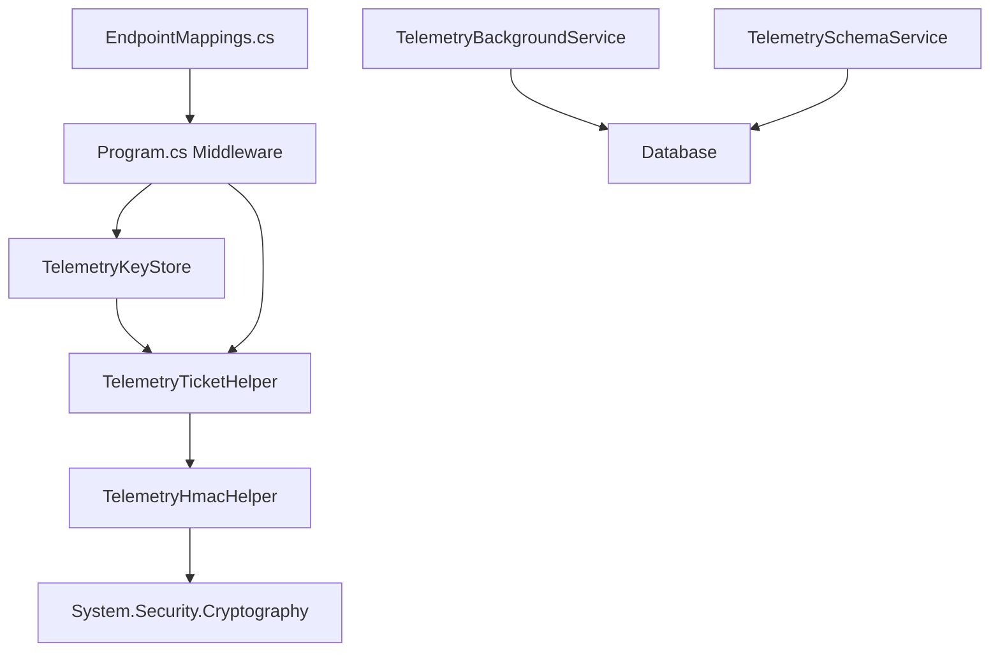

# Telemetry Security & Validation

<cite>
**Referenced Files in This Document**
- [TelemetryHmacHelper.cs](file://backend-dotnet/TelemetryHmacHelper.cs)
- [TelemetryKeyStore.cs](file://backend-dotnet/TelemetryKeyStore.cs)
- [TelemetryTicketHelper.cs](file://backend-dotnet/TelemetryTicketHelper.cs)
- [Program.cs](file://backend-dotnet/Program.cs)
- [EndpointMappings.cs](file://backend-dotnet/Controllers/EndpointMappings.cs)
- [TelemetryBackgroundService.cs](file://backend-dotnet/Services/TelemetryBackgroundService.cs)
- [TelemetrySchemaService.cs](file://backend-dotnet/Services/TelemetrySchemaService.cs)
- [telemetry.routes.ts](file://backend/src/modules/telemetry/telemetry.routes.ts)
</cite>

## Table of Contents
1. [Introduction](#introduction)
2. [Project Structure](#project-structure)
3. [Core Components](#core-components)
4. [Architecture Overview](#architecture-overview)
5. [Detailed Component Analysis](#detailed-component-analysis)
6. [Dependency Analysis](#dependency-analysis)
7. [Performance Considerations](#performance-considerations)
8. [Troubleshooting Guide](#troubleshooting-guide)
9. [Conclusion](#conclusion)

## Introduction
This document describes the telemetry security system responsible for:
- HMAC-based cryptographic signature verification for device telemetry ingestion
- Secure key storage and rotation for short-lived stream tickets (SST)
- Ticket-based authentication for real-time event streams
- Integrity checks and freshness validation for telemetry events
- Integration with the real-time event system and background monitoring

It focuses on the core building blocks: TelemetryHmacHelper for HMAC-SHA256 signing and verification, TelemetryKeyStore for secure key management, and TelemetryTicketHelper for issuing and validating short-lived tickets used to authenticate SSE streams.

## Project Structure
The telemetry security system spans several layers:
- Cryptographic helpers and ticket utilities in the .NET backend
- Middleware and endpoint mapping for authentication and authorization
- Background services for telemetry monitoring and nonce pruning
- Database schema for telemetry rules, positions, and nonces
- A lightweight telemetry ingestion route in the legacy backend (for demonstration)

**Diagram sources**
- [TelemetryHmacHelper.cs:1-33](file://backend-dotnet/TelemetryHmacHelper.cs#L1-L33)
- [TelemetryKeyStore.cs:1-12](file://backend-dotnet/TelemetryKeyStore.cs#L1-L12)
- [TelemetryTicketHelper.cs:1-51](file://backend-dotnet/TelemetryTicketHelper.cs#L1-L51)
- [Program.cs:101-245](file://backend-dotnet/Program.cs#L101-L245)
- [EndpointMappings.cs:52-78](file://backend-dotnet/Controllers/EndpointMappings.cs#L52-L78)
- [TelemetryBackgroundService.cs:1-103](file://backend-dotnet/Services/TelemetryBackgroundService.cs#L1-L103)
- [TelemetrySchemaService.cs:1-145](file://backend-dotnet/Services/TelemetrySchemaService.cs#L1-L145)
- [telemetry.routes.ts:1-59](file://backend/src/modules/telemetry/telemetry.routes.ts#L1-L59)

**Section sources**
- [TelemetryHmacHelper.cs:1-33](file://backend-dotnet/TelemetryHmacHelper.cs#L1-L33)
- [TelemetryKeyStore.cs:1-12](file://backend-dotnet/TelemetryKeyStore.cs#L1-L12)
- [TelemetryTicketHelper.cs:1-51](file://backend-dotnet/TelemetryTicketHelper.cs#L1-L51)
- [Program.cs:101-245](file://backend-dotnet/Program.cs#L101-L245)
- [EndpointMappings.cs:52-78](file://backend-dotnet/Controllers/EndpointMappings.cs#L52-L78)
- [TelemetryBackgroundService.cs:1-103](file://backend-dotnet/Services/TelemetryBackgroundService.cs#L1-L103)
- [TelemetrySchemaService.cs:1-145](file://backend-dotnet/Services/TelemetrySchemaService.cs#L1-L145)
- [telemetry.routes.ts:1-59](file://backend/src/modules/telemetry/telemetry.routes.ts#L1-L59)

## Core Components
- TelemetryHmacHelper: Computes HMAC-SHA256 signatures from canonical request components, performs constant-time comparisons, and hashes request bodies for integrity checks.
- TelemetryKeyStore: Centralized storage for the SSE ticket signing key, loaded from environment variables or generated at runtime.
- TelemetryTicketHelper: Issues short-lived tickets (SST) and validates them with HMAC-SHA256, expiration checks, and payload parsing.

These components underpin secure ingestion and streaming authentication.

**Section sources**
- [TelemetryHmacHelper.cs:5-32](file://backend-dotnet/TelemetryHmacHelper.cs#L5-L32)
- [TelemetryKeyStore.cs:5-11](file://backend-dotnet/TelemetryKeyStore.cs#L5-L11)
- [TelemetryTicketHelper.cs:3-36](file://backend-dotnet/TelemetryTicketHelper.cs#L3-L36)

## Architecture Overview
The telemetry security architecture integrates cryptographic verification and ticket-based authentication into the middleware pipeline and endpoint mappings.

**Diagram sources**
- [Program.cs:118-118](file://backend-dotnet/Program.cs#L118-L118)
- [TelemetryHmacHelper.cs:8-16](file://backend-dotnet/TelemetryHmacHelper.cs#L8-L16)
- [TelemetrySchemaService.cs:84-93](file://backend-dotnet/Services/TelemetrySchemaService.cs#L84-L93)

**Diagram sources**
- [Program.cs:149-172](file://backend-dotnet/Program.cs#L149-L172)
- [TelemetryTicketHelper.cs:15-36](file://backend-dotnet/TelemetryTicketHelper.cs#L15-L36)
- [TelemetryKeyStore.cs:7-10](file://backend-dotnet/TelemetryKeyStore.cs#L7-L10)
- [EndpointMappings.cs:52-58](file://backend-dotnet/Controllers/EndpointMappings.cs#L52-L58)

## Detailed Component Analysis

### TelemetryHmacHelper
Responsibilities:
- Build canonical string from HTTP method, path, timestamp, nonce, and body hash
- Compute HMAC-SHA256 signature and return lowercase hex string
- Hash request body using SHA-256 and return lowercase hex
- Perform constant-time string comparison to prevent timing attacks

Security considerations:
- Canonical string construction ensures deterministic signing across components
- Constant-time comparison prevents timing side-channel attacks
- Lowercase hex normalization reduces ambiguity

**Diagram sources**
- [TelemetryHmacHelper.cs:8-16](file://backend-dotnet/TelemetryHmacHelper.cs#L8-L16)

**Section sources**
- [TelemetryHmacHelper.cs:8-23](file://backend-dotnet/TelemetryHmacHelper.cs#L8-L23)
- [TelemetryHmacHelper.cs:25-31](file://backend-dotnet/TelemetryHmacHelper.cs#L25-L31)

### TelemetryKeyStore
Responsibilities:
- Provide a single, shared SSE ticket signing key
- Load from environment variable OPSTRAX_SSE_TICKET_KEY if present
- Otherwise generate a composite key from two GUIDs for local/dev environments

Security considerations:
- Centralized key access prevents circular dependencies
- Environment-driven key enables production-grade rotation
- Local fallback avoids hardcoding secrets

**Diagram sources**
- [TelemetryKeyStore.cs:5-11](file://backend-dotnet/TelemetryKeyStore.cs#L5-L11)

**Section sources**
- [TelemetryKeyStore.cs:7-10](file://backend-dotnet/TelemetryKeyStore.cs#L7-L10)

### TelemetryTicketHelper
Responsibilities:
- Issue short-lived tickets (SST) containing encoded payload and HMAC signature
- Validate tickets by recomputing HMAC, performing constant-time comparison, parsing payload, and checking expiration
- Provide auxiliary validators for coordinate ranges, speed limits, and timestamp freshness windows

Security considerations:
- Tickets are short-lived (default TTL) to minimize exposure
- Payload encoding and signature separation prevents tampering
- Constant-time signature comparison mitigates timing attacks
- Timestamp freshness prevents replay across extended periods

**Diagram sources**
- [TelemetryTicketHelper.cs:5-13](file://backend-dotnet/TelemetryTicketHelper.cs#L5-L13)
- [TelemetryTicketHelper.cs:15-36](file://backend-dotnet/TelemetryTicketHelper.cs#L15-L36)

**Section sources**
- [TelemetryTicketHelper.cs:5-13](file://backend-dotnet/TelemetryTicketHelper.cs#L5-L13)
- [TelemetryTicketHelper.cs:15-36](file://backend-dotnet/TelemetryTicketHelper.cs#L15-L36)
- [TelemetryTicketHelper.cs:38-49](file://backend-dotnet/TelemetryTicketHelper.cs#L38-L49)

### Middleware Authentication and Authorization
The middleware enforces:
- CORS, CSRF protection, and security headers
- Rate limiting per IP address
- Path exemptions for health and public tracking
- SSE ticket validation for /api/telemetry/stream
- Session-based auth for other endpoints

Integration highlights:
- SSE path checks for ?sst= query parameter
- Ticket validation populates context items for downstream authorization
- Unauthorized responses return structured JSON

**Diagram sources**
- [Program.cs:149-172](file://backend-dotnet/Program.cs#L149-L172)
- [TelemetryTicketHelper.cs:15-36](file://backend-dotnet/TelemetryTicketHelper.cs#L15-L36)
- [TelemetryKeyStore.cs:7-10](file://backend-dotnet/TelemetryKeyStore.cs#L7-L10)

**Section sources**
- [Program.cs:101-103](file://backend-dotnet/Program.cs#L101-L103)
- [Program.cs:105-127](file://backend-dotnet/Program.cs#L105-L127)
- [Program.cs:145-172](file://backend-dotnet/Program.cs#L145-L172)

### Endpoint Mappings and Real-Time Integration
Telemetry endpoints:
- POST /api/telemetry/ingest: Device-authenticated ingestion with HMAC validation
- POST /api/telemetry/stream-ticket: Issue short-lived tickets for SSE
- GET /api/telemetry/stream: SSE stream authenticated via ?sst=
- GET /api/telemetry/positions: Latest positions snapshot
- Additional telemetry and safety endpoints gated by RBAC

**Diagram sources**
- [EndpointMappings.cs:52-78](file://backend-dotnet/Controllers/EndpointMappings.cs#L52-L78)

**Section sources**
- [EndpointMappings.cs:52-78](file://backend-dotnet/Controllers/EndpointMappings.cs#L52-L78)

### Background Monitoring and Nonce Management
Background tasks:
- Periodic stale device detection based on latest telemetry timestamps
- Pruning of expired nonces to prevent replay beyond retention window

**Diagram sources**
- [TelemetryBackgroundService.cs:17-44](file://backend-dotnet/Services/TelemetryBackgroundService.cs#L17-L44)
- [TelemetryBackgroundService.cs:46-89](file://backend-dotnet/Services/TelemetryBackgroundService.cs#L46-L89)
- [TelemetryBackgroundService.cs:91-101](file://backend-dotnet/Services/TelemetryBackgroundService.cs#L91-L101)
- [TelemetrySchemaService.cs:84-93](file://backend-dotnet/Services/TelemetrySchemaService.cs#L84-L93)

**Section sources**
- [TelemetryBackgroundService.cs:17-44](file://backend-dotnet/Services/TelemetryBackgroundService.cs#L17-L44)
- [TelemetryBackgroundService.cs:46-89](file://backend-dotnet/Services/TelemetryBackgroundService.cs#L46-L89)
- [TelemetryBackgroundService.cs:91-101](file://backend-dotnet/Services/TelemetryBackgroundService.cs#L91-L101)
- [TelemetrySchemaService.cs:84-93](file://backend-dotnet/Services/TelemetrySchemaService.cs#L84-L93)

## Dependency Analysis
Key dependencies and relationships:
- TelemetryHmacHelper depends on System.Security.Cryptography for HMAC-SHA256 and SHA-256 hashing
- TelemetryTicketHelper depends on HMAC-SHA256 and Base64 encoding/decoding
- TelemetryKeyStore centralizes the SSE ticket key and is accessed by TelemetryTicketHelper during validation
- Program.cs middleware integrates TelemetryTicketHelper and TelemetryKeyStore for SSE authentication
- EndpointMappings.cs registers telemetry endpoints and relies on middleware for auth
- TelemetryBackgroundService and TelemetrySchemaService manage persistence and monitoring

**Diagram sources**
- [TelemetryHmacHelper.cs:14-15](file://backend-dotnet/TelemetryHmacHelper.cs#L14-L15)
- [TelemetryTicketHelper.cs:10-11](file://backend-dotnet/TelemetryTicketHelper.cs#L10-L11)
- [TelemetryKeyStore.cs:7-10](file://backend-dotnet/TelemetryKeyStore.cs#L7-L10)
- [Program.cs:149-154](file://backend-dotnet/Program.cs#L149-L154)
- [EndpointMappings.cs:52-58](file://backend-dotnet/Controllers/EndpointMappings.cs#L52-L58)
- [TelemetryBackgroundService.cs:48-49](file://backend-dotnet/Services/TelemetryBackgroundService.cs#L48-L49)
- [TelemetrySchemaService.cs:4-13](file://backend-dotnet/Services/TelemetrySchemaService.cs#L4-L13)

**Section sources**
- [TelemetryHmacHelper.cs:14-15](file://backend-dotnet/TelemetryHmacHelper.cs#L14-L15)
- [TelemetryTicketHelper.cs:10-11](file://backend-dotnet/TelemetryTicketHelper.cs#L10-L11)
- [TelemetryKeyStore.cs:7-10](file://backend-dotnet/TelemetryKeyStore.cs#L7-L10)
- [Program.cs:149-154](file://backend-dotnet/Program.cs#L149-L154)
- [EndpointMappings.cs:52-58](file://backend-dotnet/Controllers/EndpointMappings.cs#L52-L58)
- [TelemetryBackgroundService.cs:48-49](file://backend-dotnet/Services/TelemetryBackgroundService.cs#L48-L49)
- [TelemetrySchemaService.cs:4-13](file://backend-dotnet/Services/TelemetrySchemaService.cs#L4-L13)

## Performance Considerations
- HMAC and SHA-256 computations are lightweight compared to network I/O; ensure minimal allocations in hot paths
- Constant-time comparisons prevent timing leaks without significant overhead
- Database writes for nonces and telemetry should leverage indexes and unique constraints to maintain performance
- Background service intervals (5 minutes) balance responsiveness with resource usage

## Troubleshooting Guide
Common issues and resolutions:
- Unauthorized SSE stream: Verify ?sst= is present and valid; confirm TelemetryTicketHelper validation succeeds and context items are populated
- Invalid or expired ingestion signature: Confirm canonical string matches exactly and timestamp/nonce freshness; ensure constant-time comparison passes
- Nonce conflicts: Check for duplicate nonce/device combinations; prune expired nonces if necessary
- Stale device alerts: Investigate latest telemetry timestamps and adjust telemetry_rules thresholds per company

Operational checks:
- Confirm OPSTRAX_SSE_TICKET_KEY environment variable is set for production
- Review background service logs for nonce pruning and stale device alert creation
- Validate database indexes exist for telemetry tables to support queries and inserts

**Section sources**
- [Program.cs:149-172](file://backend-dotnet/Program.cs#L149-L172)
- [TelemetryTicketHelper.cs:15-36](file://backend-dotnet/TelemetryTicketHelper.cs#L15-L36)
- [TelemetryHmacHelper.cs:25-31](file://backend-dotnet/TelemetryHmacHelper.cs#L25-L31)
- [TelemetrySchemaService.cs:84-93](file://backend-dotnet/Services/TelemetrySchemaService.cs#L84-L93)
- [TelemetryBackgroundService.cs:91-101](file://backend-dotnet/Services/TelemetryBackgroundService.cs#L91-L101)

## Conclusion
The telemetry security system combines HMAC-based integrity checks for device ingestion, centralized key management for short-lived stream tickets, and robust middleware integration to authenticate real-time streams. Together with background monitoring and database schema enforcement, it provides a strong foundation for secure, integrity-preserving telemetry ingestion and streaming.