# Authentication & Authorization

<cite>
**Referenced Files in This Document**
- [rbacConfig.ts](file://frontend/src/auth/rbacConfig.ts)
- [accessScope.ts](file://frontend/src/auth/accessScope.ts)
- [authApi.ts](file://frontend/src/services/authApi.ts)
- [CsrfMiddleware.cs](file://backend-dotnet/Middleware/CsrfMiddleware.cs)
- [ErrorHandlingMiddleware.cs](file://backend-dotnet/Middleware/ErrorHandlingMiddleware.cs)
- [TelemetryTicketHelper.cs](file://backend-dotnet/TelemetryTicketHelper.cs)
- [TelemetryHmacHelper.cs](file://backend-dotnet/TelemetryHmacHelper.cs)
- [TelemetryKeyStore.cs](file://backend-dotnet/TelemetryKeyStore.cs)
- [Program.cs](file://backend-dotnet/Program.cs)
- [EndpointMappings.cs](file://backend-dotnet/Controllers/EndpointMappings.cs)
- [ConfigValidationService.cs](file://backend-dotnet/Services/ConfigValidationService.cs)
- [LOGIN_RBAC_CSRF.md](file://docs/LOGIN_RBAC_CSRF.md)
- [TelemetrySecurityTests.cs](file://backend-dotnet.Tests/TelemetrySecurityTests.cs)
</cite>

## Table of Contents
1. [Introduction](#introduction)
2. [Project Structure](#project-structure)
3. [Core Components](#core-components)
4. [Architecture Overview](#architecture-overview)
5. [Detailed Component Analysis](#detailed-component-analysis)
6. [Dependency Analysis](#dependency-analysis)
7. [Performance Considerations](#performance-considerations)
8. [Troubleshooting Guide](#troubleshooting-guide)
9. [Conclusion](#conclusion)

## Introduction
This document describes the authentication and authorization middleware stack across the frontend and backend-dotnet layers. It covers:
- JWT-like bearer token processing and session validation
- Role-based access control (RBAC) with permission checking
- Frontend session management and scoped data filtering
- Telemetry ticket helper for secure streaming authentication
- HMAC helpers for secure device ingestion signatures
- Integration between authentication middleware and authorization policies
- Examples of protected endpoints, role-based restrictions, and token refresh workflows

## Project Structure
The authentication and authorization functionality spans three primary areas:
- Frontend RBAC and session management
- Backend .NET middleware for CSRF protection and error handling
- Telemetry security helpers for tickets and HMAC signing

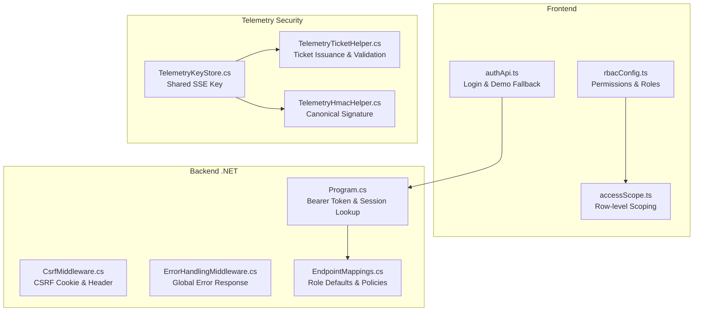

**Diagram sources**
- [rbacConfig.ts](file://frontend/src/auth/rbacConfig.ts)
- [accessScope.ts](file://frontend/src/auth/accessScope.ts)
- [authApi.ts](file://frontend/src/services/authApi.ts)
- [CsrfMiddleware.cs](file://backend-dotnet/Middleware/CsrfMiddleware.cs)
- [ErrorHandlingMiddleware.cs](file://backend-dotnet/Middleware/ErrorHandlingMiddleware.cs)
- [Program.cs](file://backend-dotnet/Program.cs)
- [EndpointMappings.cs](file://backend-dotnet/Controllers/EndpointMappings.cs)
- [TelemetryTicketHelper.cs](file://backend-dotnet/TelemetryTicketHelper.cs)
- [TelemetryHmacHelper.cs](file://backend-dotnet/TelemetryHmacHelper.cs)
- [TelemetryKeyStore.cs](file://backend-dotnet/TelemetryKeyStore.cs)

**Section sources**
- [rbacConfig.ts](file://frontend/src/auth/rbacConfig.ts)
- [accessScope.ts](file://frontend/src/auth/accessScope.ts)
- [authApi.ts](file://frontend/src/services/authApi.ts)
- [CsrfMiddleware.cs](file://backend-dotnet/Middleware/CsrfMiddleware.cs)
- [ErrorHandlingMiddleware.cs](file://backend-dotnet/Middleware/ErrorHandlingMiddleware.cs)
- [Program.cs](file://backend-dotnet/Program.cs)
- [EndpointMappings.cs](file://backend-dotnet/Controllers/EndpointMappings.cs)
- [TelemetryTicketHelper.cs](file://backend-dotnet/TelemetryTicketHelper.cs)
- [TelemetryHmacHelper.cs](file://backend-dotnet/TelemetryHmacHelper.cs)
- [TelemetryKeyStore.cs](file://backend-dotnet/TelemetryKeyStore.cs)

## Core Components
- Frontend RBAC and permissions:
  - Canonical permissions and role-to-permissions mapping
  - Permission normalization and alias expansion
  - Permission grant evaluation with wildcards
- Frontend session management:
  - Login flow with CSRF token propagation
  - Demo user fallback with deterministic tokens
  - Row-level scoping for driver/customer portals
- Backend .NET middleware:
  - CSRF cookie generation and validation for state-changing requests
  - Global error handling returning structured API responses
- Authentication pipeline:
  - Bearer token extraction and session lookup
  - Active user and session validation
- Telemetry security:
  - Stream ticket issuance with HMAC-SHA256 and expiry
  - Device ingestion signature computation via canonical string
  - Shared key store for SSE ticket signing

**Section sources**
- [rbacConfig.ts](file://frontend/src/auth/rbacConfig.ts)
- [accessScope.ts](file://frontend/src/auth/accessScope.ts)
- [authApi.ts](file://frontend/src/services/authApi.ts)
- [CsrfMiddleware.cs](file://backend-dotnet/Middleware/CsrfMiddleware.cs)
- [ErrorHandlingMiddleware.cs](file://backend-dotnet/Middleware/ErrorHandlingMiddleware.cs)
- [Program.cs](file://backend-dotnet/Program.cs)
- [TelemetryTicketHelper.cs](file://backend-dotnet/TelemetryTicketHelper.cs)
- [TelemetryHmacHelper.cs](file://backend-dotnet/TelemetryHmacHelper.cs)
- [TelemetryKeyStore.cs](file://backend-dotnet/TelemetryKeyStore.cs)

## Architecture Overview
The authentication and authorization architecture integrates frontend RBAC with backend middleware and telemetry security:

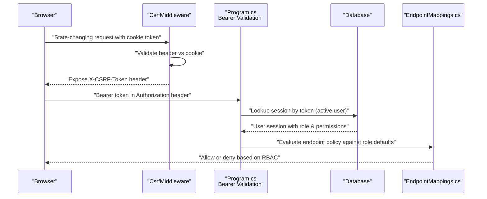

**Diagram sources**
- [CsrfMiddleware.cs](file://backend-dotnet/Middleware/CsrfMiddleware.cs)
- [Program.cs](file://backend-dotnet/Program.cs)
- [EndpointMappings.cs](file://backend-dotnet/Controllers/EndpointMappings.cs)

## Detailed Component Analysis

### Frontend RBAC and Permission Evaluation
- Permission constants and groups define canonical permissions and aliases.
- Role-to-permissions mapping supports wildcards and legacy role aliases.
- Permission grant evaluation normalizes and expands aliases, enabling flexible matching.

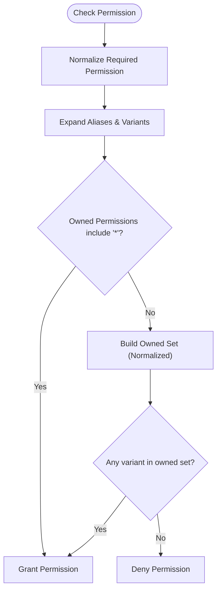

**Diagram sources**
- [rbacConfig.ts](file://frontend/src/auth/rbacConfig.ts)

**Section sources**
- [rbacConfig.ts](file://frontend/src/auth/rbacConfig.ts)

### Frontend Session Management and Scoped Data
- Login flow:
  - Attempts backend authentication.
  - On failure, falls back to demo users if enabled.
  - Sets global CSRF token upon successful login.
- Row-level scoping:
  - Driver and customer roles are filtered by identity fields derived from the session.
  - Identity resolution supports driver/customer portal roles and email/company mapping.

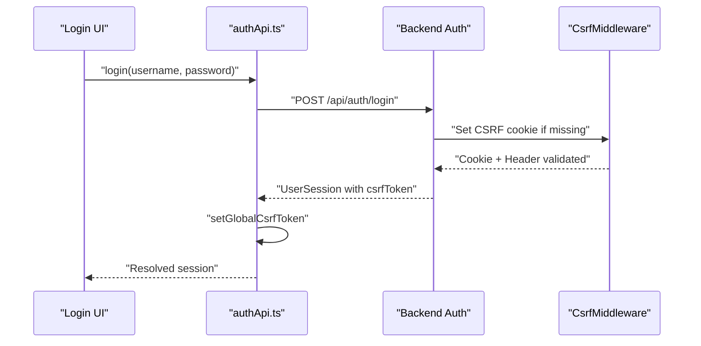

**Diagram sources**
- [authApi.ts](file://frontend/src/services/authApi.ts)
- [CsrfMiddleware.cs](file://backend-dotnet/Middleware/CsrfMiddleware.cs)

**Section sources**
- [authApi.ts](file://frontend/src/services/authApi.ts)
- [accessScope.ts](file://frontend/src/auth/accessScope.ts)
- [CsrfMiddleware.cs](file://backend-dotnet/Middleware/CsrfMiddleware.cs)

### Backend .NET CSRF Protection
- Generates a CSRF cookie for GET requests or when absent.
- Validates CSRF token for state-changing methods except login.
- Exposes the current token via response header for client consumption.

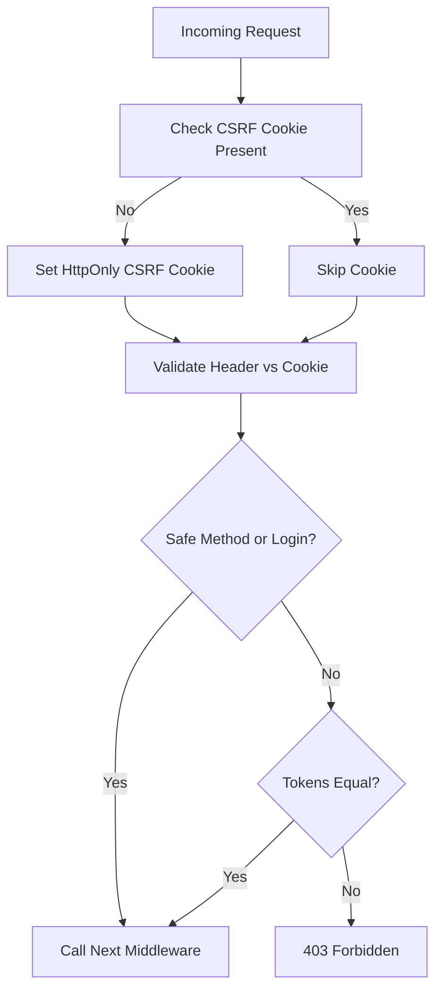

**Diagram sources**
- [CsrfMiddleware.cs](file://backend-dotnet/Middleware/CsrfMiddleware.cs)

**Section sources**
- [CsrfMiddleware.cs](file://backend-dotnet/Middleware/CsrfMiddleware.cs)

### Backend .NET Authentication Pipeline (Bearer Token and Session)
- Extracts Bearer token from Authorization header.
- Validates token presence and format.
- Looks up session in database with active user and role/permissions.
- Enforces active user and unexpired session.

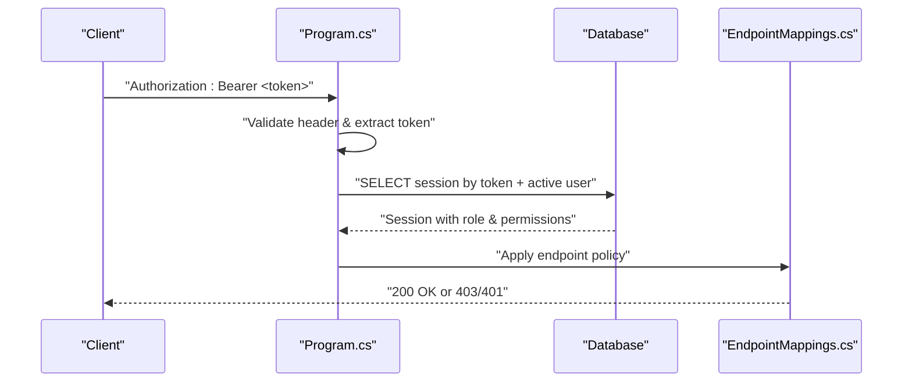

**Diagram sources**
- [Program.cs](file://backend-dotnet/Program.cs)
- [EndpointMappings.cs](file://backend-dotnet/Controllers/EndpointMappings.cs)

**Section sources**
- [Program.cs](file://backend-dotnet/Program.cs)
- [EndpointMappings.cs](file://backend-dotnet/Controllers/EndpointMappings.cs)

### Telemetry Ticket Helper (Secure Streaming Authentication)
- Issues tickets containing user ID, company ID, and expiry, signed with HMAC-SHA256.
- Validates tickets by verifying signature, parsing payload, and checking expiry.
- Includes sanity checks for coordinates, speed, and timestamp freshness.

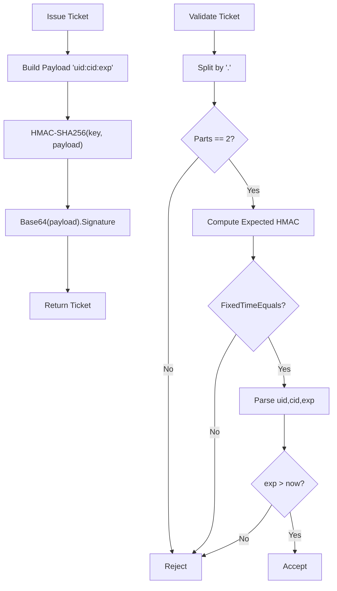

**Diagram sources**
- [TelemetryTicketHelper.cs](file://backend-dotnet/TelemetryTicketHelper.cs)

**Section sources**
- [TelemetryTicketHelper.cs](file://backend-dotnet/TelemetryTicketHelper.cs)

### Telemetry HMAC Helper (Device Ingestion Signing)
- Computes canonical signature from METHOD, PATH, X-Timestamp, X-Nonce, and body hash.
- Provides constant-time comparison for signature verification.
- Offers SHA-256 hex hashing for request bodies.

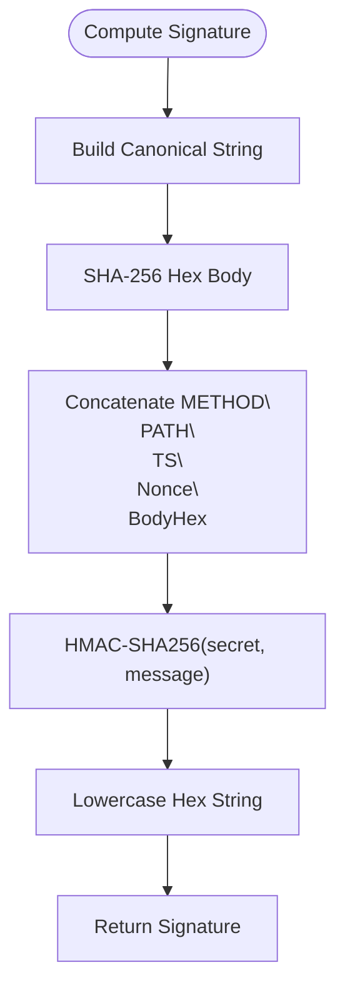

**Diagram sources**
- [TelemetryHmacHelper.cs](file://backend-dotnet/TelemetryHmacHelper.cs)

**Section sources**
- [TelemetryHmacHelper.cs](file://backend-dotnet/TelemetryHmacHelper.cs)

### Telemetry Key Store (Key Management)
- Stores a shared SSE ticket signing key loaded from environment or generated at runtime.
- Prevents circular dependencies by centralizing key access.

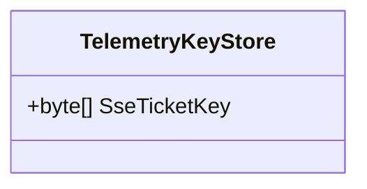

**Diagram sources**
- [TelemetryKeyStore.cs](file://backend-dotnet/TelemetryKeyStore.cs)

**Section sources**
- [TelemetryKeyStore.cs](file://backend-dotnet/TelemetryKeyStore.cs)

### Integration Between Authentication Middleware and Authorization Policies
- CSRF middleware ensures state-changing requests carry a valid token.
- Authentication middleware validates bearer tokens and enriches context with user/session data.
- EndpointMappings defines role defaults and required permissions for endpoints.
- RBAC configuration on the frontend mirrors backend roles and permissions for UI enforcement.

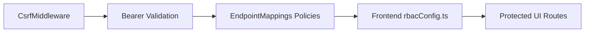

**Diagram sources**
- [CsrfMiddleware.cs](file://backend-dotnet/Middleware/CsrfMiddleware.cs)
- [Program.cs](file://backend-dotnet/Program.cs)
- [EndpointMappings.cs](file://backend-dotnet/Controllers/EndpointMappings.cs)
- [rbacConfig.ts](file://frontend/src/auth/rbacConfig.ts)

**Section sources**
- [CsrfMiddleware.cs](file://backend-dotnet/Middleware/CsrfMiddleware.cs)
- [Program.cs](file://backend-dotnet/Program.cs)
- [EndpointMappings.cs](file://backend-dotnet/Controllers/EndpointMappings.cs)
- [rbacConfig.ts](file://frontend/src/auth/rbacConfig.ts)

### Examples and Workflows

- Protected endpoints and role-based restrictions:
  - Reports view/export permissions are enforced by role defaults and endpoint mappings.
  - Tests assert that specific roles receive or are denied certain permissions.

- Token refresh workflow:
  - The frontend sets a CSRF token on successful login and uses it for subsequent state-changing requests.
  - Sessions persist server-side with an 8-hour expiry; re-login rotates tokens.

- Telemetry ticket issuance and validation:
  - Backend generates a time-limited ticket with HMAC signature for secure streaming access.
  - Clients validate tickets before establishing SSE connections.

**Section sources**
- [LOGIN_RBAC_CSRF.md](file://docs/LOGIN_RBAC_CSRF.md)
- [TelemetrySecurityTests.cs](file://backend-dotnet.Tests/TelemetrySecurityTests.cs)

## Dependency Analysis
- Frontend depends on rbacConfig.ts for permission evaluation and accessScope.ts for row-level filtering.
- Backend middleware depends on shared configuration and database for session validation.
- Telemetry helpers depend on a shared key store for consistent signing and verification.

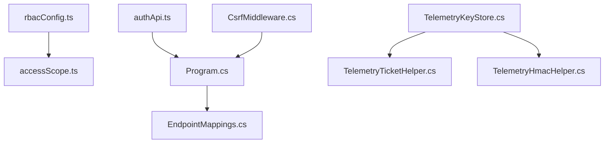

**Diagram sources**
- [rbacConfig.ts](file://frontend/src/auth/rbacConfig.ts)
- [accessScope.ts](file://frontend/src/auth/accessScope.ts)
- [authApi.ts](file://frontend/src/services/authApi.ts)
- [CsrfMiddleware.cs](file://backend-dotnet/Middleware/CsrfMiddleware.cs)
- [Program.cs](file://backend-dotnet/Program.cs)
- [EndpointMappings.cs](file://backend-dotnet/Controllers/EndpointMappings.cs)
- [TelemetryKeyStore.cs](file://backend-dotnet/TelemetryKeyStore.cs)
- [TelemetryTicketHelper.cs](file://backend-dotnet/TelemetryTicketHelper.cs)
- [TelemetryHmacHelper.cs](file://backend-dotnet/TelemetryHmacHelper.cs)

**Section sources**
- [rbacConfig.ts](file://frontend/src/auth/rbacConfig.ts)
- [accessScope.ts](file://frontend/src/auth/accessScope.ts)
- [authApi.ts](file://frontend/src/services/authApi.ts)
- [CsrfMiddleware.cs](file://backend-dotnet/Middleware/CsrfMiddleware.cs)
- [Program.cs](file://backend-dotnet/Program.cs)
- [EndpointMappings.cs](file://backend-dotnet/Controllers/EndpointMappings.cs)
- [TelemetryKeyStore.cs](file://backend-dotnet/TelemetryKeyStore.cs)
- [TelemetryTicketHelper.cs](file://backend-dotnet/TelemetryTicketHelper.cs)
- [TelemetryHmacHelper.cs](file://backend-dotnet/TelemetryHmacHelper.cs)

## Performance Considerations
- Permission checks operate in near O(1) via precomputed sets and normalized variants.
- Token validation is O(1) string comparisons and fixed-time HMAC verification.
- Session storage is client-side for UI convenience; server maintains active sessions with expiry checks.
- Wildcard matching is precompiled to minimize runtime overhead.

[No sources needed since this section provides general guidance]

## Troubleshooting Guide
- CSRF token validation failures:
  - Ensure the CSRF cookie is present and matches the header for state-changing requests.
  - Confirm the login route bypasses CSRF validation.
- Unauthorized or invalid bearer token:
  - Verify Authorization header format and non-empty token.
  - Confirm session exists, is active, and user status is valid.
- Permission denied:
  - Check role-to-permissions mapping and required permission string.
  - Validate wildcard patterns and permission alias variants.
- Telemetry ticket rejected:
  - Confirm ticket signature matches expected HMAC.
  - Verify payload fields and expiry time.
  - Ensure coordinate, speed, and timestamp constraints are met.

**Section sources**
- [CsrfMiddleware.cs](file://backend-dotnet/Middleware/CsrfMiddleware.cs)
- [Program.cs](file://backend-dotnet/Program.cs)
- [TelemetryTicketHelper.cs](file://backend-dotnet/TelemetryTicketHelper.cs)
- [TelemetryHmacHelper.cs](file://backend-dotnet/TelemetryHmacHelper.cs)
- [LOGIN_RBAC_CSRF.md](file://docs/LOGIN_RBAC_CSRF.md)

## Conclusion
The authentication and authorization stack combines frontend RBAC with backend middleware and telemetry security:
- Frontend manages sessions, CSRF tokens, and permission-driven UI behavior.
- Backend enforces CSRF protection and validates bearer tokens against active sessions.
- Telemetry helpers provide secure streaming and device ingestion signing with robust key management.
Together, these components deliver a layered, maintainable, and hardened security model suitable for production environments.