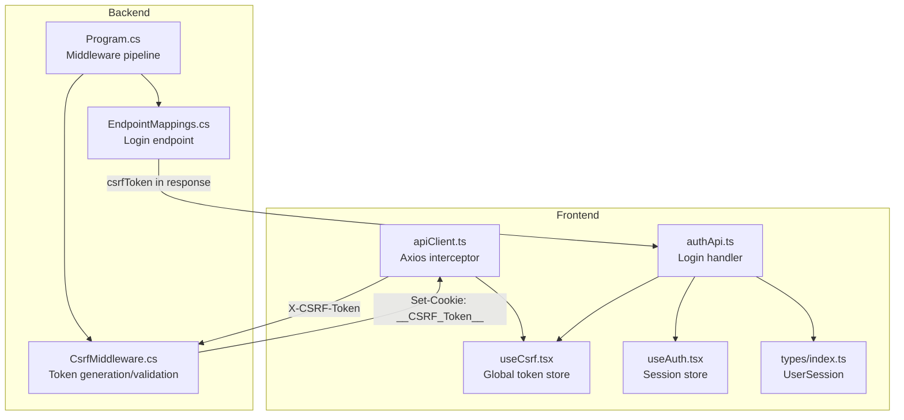
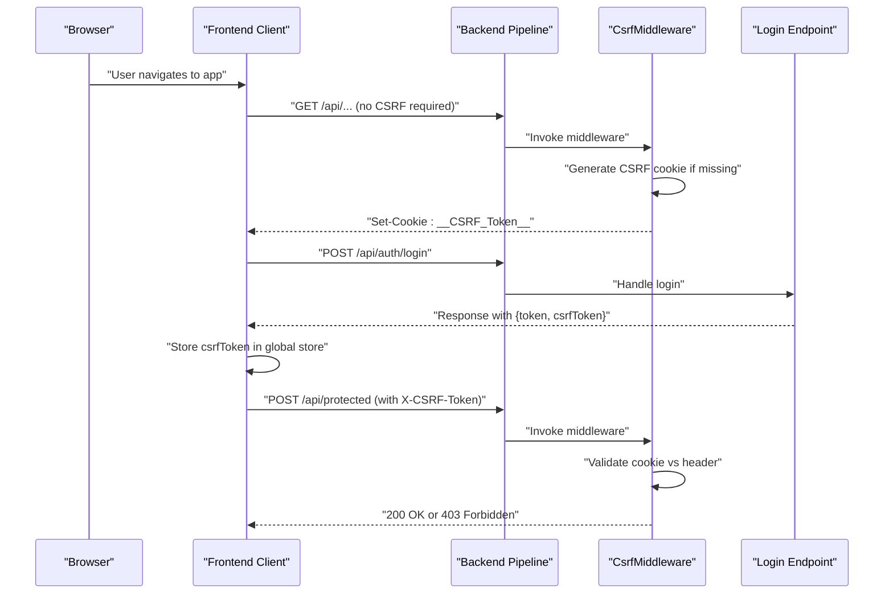
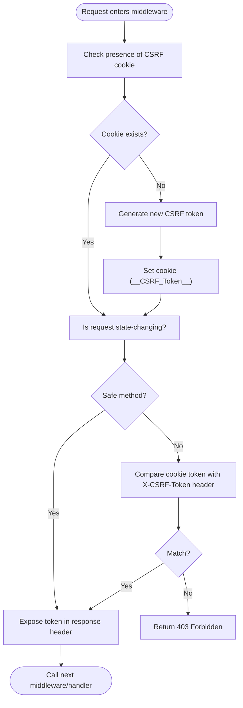
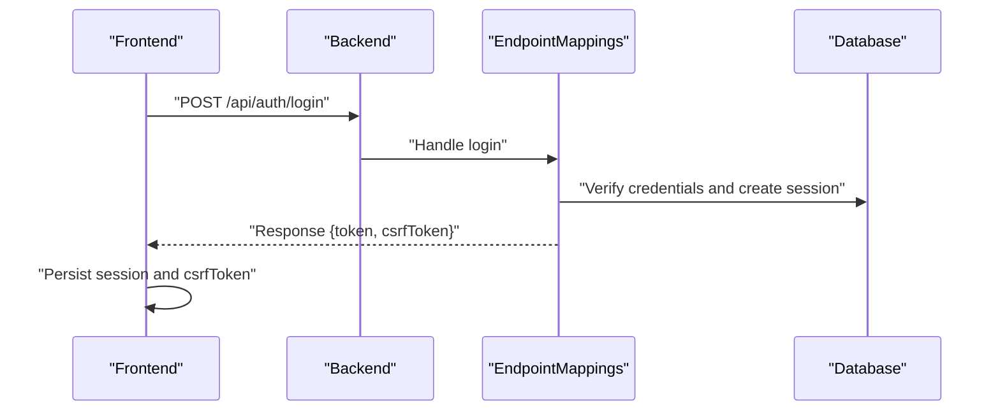
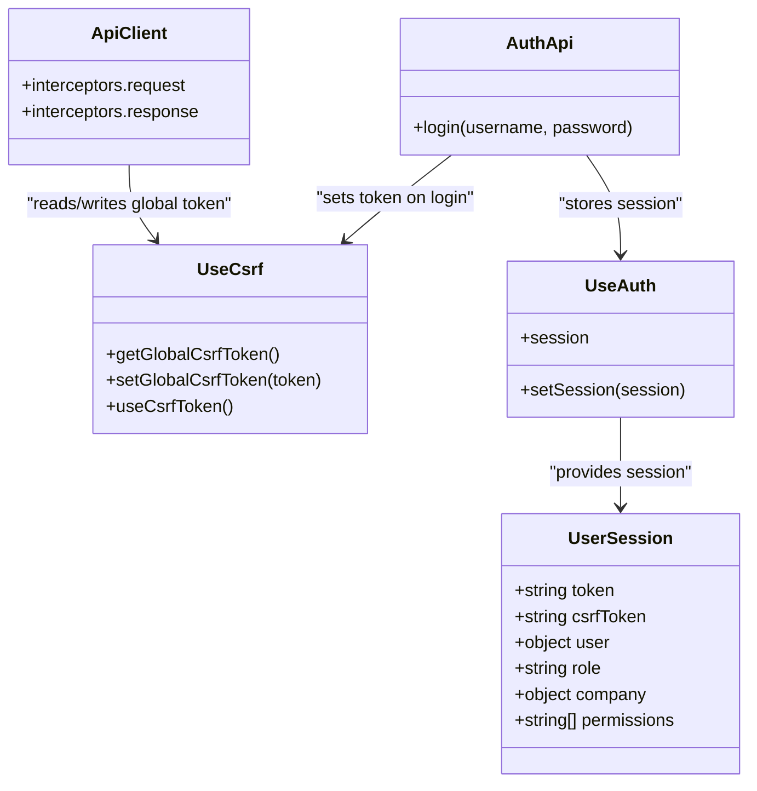
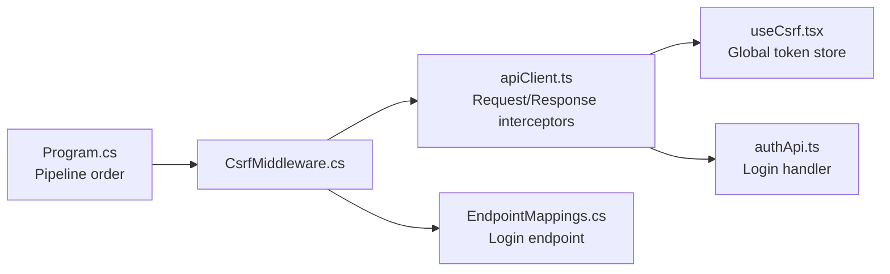

# CSRF Protection Middleware

<cite>
**Referenced Files in This Document**
- [CsrfMiddleware.cs](file://backend-dotnet/Middleware/CsrfMiddleware.cs)
- [Program.cs](file://backend-dotnet/Program.cs)
- [EndpointMappings.cs](file://backend-dotnet/Controllers/EndpointMappings.cs)
- [apiClient.ts](file://frontend/src/services/apiClient.ts)
- [authApi.ts](file://frontend/src/services/authApi.ts)
- [useCsrf.tsx](file://frontend/src/hooks/useCsrf.tsx)
- [useAuth.tsx](file://frontend/src/hooks/useAuth.tsx)
- [index.ts](file://frontend/src/types/index.ts)
- [LOGIN_RBAC_CSRF.md](file://docs/LOGIN_RBAC_CSRF.md)
</cite>

## Table of Contents
1. [Introduction](#introduction)
2. [Project Structure](#project-structure)
3. [Core Components](#core-components)
4. [Architecture Overview](#architecture-overview)
5. [Detailed Component Analysis](#detailed-component-analysis)
6. [Dependency Analysis](#dependency-analysis)
7. [Performance Considerations](#performance-considerations)
8. [Troubleshooting Guide](#troubleshooting-guide)
9. [Conclusion](#conclusion)

## Introduction
This document provides comprehensive documentation for the CSRF protection middleware implementation. It explains how the system prevents cross-site request forgery attacks by generating and validating anti-forgery tokens for state-changing requests. The documentation covers token generation, storage, and verification processes, along with integration points in the authentication flow and session management. It also includes examples of CSRF attack scenarios, configuration options, token refresh mechanisms, and troubleshooting guidance.

## Project Structure
The CSRF protection spans three layers:
- Backend middleware: generates and validates CSRF tokens for HTTP requests.
- Authentication flow: seeds CSRF tokens during login and persists sessions.
- Frontend client: captures and attaches CSRF tokens to outgoing requests and stores them for reuse.

**Diagram sources**
- [Program.cs:101-102](file://backend-dotnet/Program.cs#L101-L102)
- [CsrfMiddleware.cs:19-55](file://backend-dotnet/Middleware/CsrfMiddleware.cs#L19-L55)
- [EndpointMappings.cs:1654-1694](file://backend-dotnet/Controllers/EndpointMappings.cs#L1654-L1694)
- [apiClient.ts:21-47](file://frontend/src/services/apiClient.ts#L21-L47)
- [authApi.ts:35-56](file://frontend/src/services/authApi.ts#L35-L56)
- [useCsrf.tsx:12-37](file://frontend/src/hooks/useCsrf.tsx#L12-L37)
- [useAuth.tsx:33-53](file://frontend/src/hooks/useAuth.tsx#L33-L53)
- [index.ts:43-50](file://frontend/src/types/index.ts#L43-L50)

**Section sources**
- [Program.cs:101-102](file://backend-dotnet/Program.cs#L101-L102)
- [CsrfMiddleware.cs:19-55](file://backend-dotnet/Middleware/CsrfMiddleware.cs#L19-L55)
- [EndpointMappings.cs:1654-1694](file://backend-dotnet/Controllers/EndpointMappings.cs#L1654-L1694)
- [apiClient.ts:21-47](file://frontend/src/services/apiClient.ts#L21-L47)
- [authApi.ts:35-56](file://frontend/src/services/authApi.ts#L35-L56)
- [useCsrf.tsx:12-37](file://frontend/src/hooks/useCsrf.tsx#L12-L37)
- [useAuth.tsx:33-53](file://frontend/src/hooks/useAuth.tsx#L33-L53)
- [index.ts:43-50](file://frontend/src/types/index.ts#L43-L50)

## Core Components
- CSRF Middleware: Generates CSRF tokens for sessions, validates tokens on state-changing requests, and exposes tokens via response headers.
- Authentication Flow: On successful login, the backend returns a CSRF token alongside the session token and persists the session server-side.
- Frontend Client: Automatically captures CSRF tokens from responses and attaches them to subsequent state-changing requests.

Key responsibilities:
- Token generation: Cryptographically secure random token generation.
- Storage: Cookies for server-side validation and local storage for client-side reuse.
- Verification: Header-to-cookie token equality check for non-safe HTTP methods.
- Exposure: Response header carrying the current CSRF token for clients to refresh their store.

**Section sources**
- [CsrfMiddleware.cs:19-55](file://backend-dotnet/Middleware/CsrfMiddleware.cs#L19-L55)
- [EndpointMappings.cs:1654-1694](file://backend-dotnet/Controllers/EndpointMappings.cs#L1654-L1694)
- [apiClient.ts:21-47](file://frontend/src/services/apiClient.ts#L21-L47)

## Architecture Overview
The CSRF protection architecture ensures that all state-changing requests include a synchronized token derived from the user's session. The middleware enforces validation while the frontend transparently manages token lifecycle.

**Diagram sources**
- [Program.cs:101-102](file://backend-dotnet/Program.cs#L101-L102)
- [CsrfMiddleware.cs:19-55](file://backend-dotnet/Middleware/CsrfMiddleware.cs#L19-L55)
- [EndpointMappings.cs:1654-1694](file://backend-dotnet/Controllers/EndpointMappings.cs#L1654-L1694)
- [apiClient.ts:21-47](file://frontend/src/services/apiClient.ts#L21-L47)

## Detailed Component Analysis

### Backend CSRF Middleware
The middleware performs three primary tasks:
- Cookie issuance: Generates a CSRF token and sets it as a non-HttpOnly cookie with secure flags and SameSite configuration.
- Validation: For state-changing methods (non-safe), compares the cookie token with the request header token.
- Exposure: Sets the CSRF token in the response header for clients to refresh their store.

**Diagram sources**
- [CsrfMiddleware.cs:19-55](file://backend-dotnet/Middleware/CsrfMiddleware.cs#L19-L55)

**Section sources**
- [CsrfMiddleware.cs:19-55](file://backend-dotnet/Middleware/CsrfMiddleware.cs#L19-L55)

### Authentication Flow and Session Management
On successful login, the backend:
- Creates a session token and persists it server-side.
- Generates a CSRF token and returns it in the login response.
- The frontend stores both tokens and uses the CSRF token for subsequent protected requests.

**Diagram sources**
- [EndpointMappings.cs:1654-1694](file://backend-dotnet/Controllers/EndpointMappings.cs#L1654-L1694)
- [authApi.ts:35-56](file://frontend/src/services/authApi.ts#L35-L56)

**Section sources**
- [EndpointMappings.cs:1654-1694](file://backend-dotnet/Controllers/EndpointMappings.cs#L1654-L1694)
- [authApi.ts:35-56](file://frontend/src/services/authApi.ts#L35-L56)

### Frontend CSRF Token Management
The frontend client:
- Reads the session from local storage and initializes the global CSRF token store.
- Attaches the CSRF token to the X-CSRF-Token header for state-changing requests.
- Updates the global store from the response header to keep tokens fresh.

**Diagram sources**
- [apiClient.ts:21-47](file://frontend/src/services/apiClient.ts#L21-L47)
- [apiClient.ts:49-72](file://frontend/src/services/apiClient.ts#L49-L72)
- [authApi.ts:35-56](file://frontend/src/services/authApi.ts#L35-L56)
- [useCsrf.tsx:12-37](file://frontend/src/hooks/useCsrf.tsx#L12-L37)
- [useAuth.tsx:33-53](file://frontend/src/hooks/useAuth.tsx#L33-L53)
- [index.ts:43-50](file://frontend/src/types/index.ts#L43-L50)

**Section sources**
- [apiClient.ts:21-47](file://frontend/src/services/apiClient.ts#L21-L47)
- [apiClient.ts:49-72](file://frontend/src/services/apiClient.ts#L49-L72)
- [authApi.ts:35-56](file://frontend/src/services/authApi.ts#L35-L56)
- [useCsrf.tsx:12-37](file://frontend/src/hooks/useCsrf.tsx#L12-L37)
- [useAuth.tsx:33-53](file://frontend/src/hooks/useAuth.tsx#L33-L53)
- [index.ts:43-50](file://frontend/src/types/index.ts#L43-L50)

## Dependency Analysis
The CSRF protection relies on a tight integration between backend middleware and frontend client:
- Backend depends on the middleware pipeline order to enforce CSRF validation before authentication and endpoint handlers.
- Frontend depends on the middleware’s response header exposure and cookie issuance to maintain a synchronized token.

**Diagram sources**
- [Program.cs:101-102](file://backend-dotnet/Program.cs#L101-L102)
- [CsrfMiddleware.cs:19-55](file://backend-dotnet/Middleware/CsrfMiddleware.cs#L19-L55)
- [apiClient.ts:21-47](file://frontend/src/services/apiClient.ts#L21-L47)
- [apiClient.ts:49-72](file://frontend/src/services/apiClient.ts#L49-L72)
- [EndpointMappings.cs:1654-1694](file://backend-dotnet/Controllers/EndpointMappings.cs#L1654-L1694)
- [authApi.ts:35-56](file://frontend/src/services/authApi.ts#L35-L56)

**Section sources**
- [Program.cs:101-102](file://backend-dotnet/Program.cs#L101-L102)
- [CsrfMiddleware.cs:19-55](file://backend-dotnet/Middleware/CsrfMiddleware.cs#L19-L55)
- [apiClient.ts:21-47](file://frontend/src/services/apiClient.ts#L21-L47)
- [apiClient.ts:49-72](file://frontend/src/services/apiClient.ts#L49-L72)
- [EndpointMappings.cs:1654-1694](file://backend-dotnet/Controllers/EndpointMappings.cs#L1654-L1694)
- [authApi.ts:35-56](file://frontend/src/services/authApi.ts#L35-L56)

## Performance Considerations
- Token generation: Uses cryptographically secure random bytes, ensuring uniqueness and resistance to prediction.
- Validation: Constant-time string comparison for token equality.
- Storage: Non-HttpOnly cookie enables client-side JavaScript access for seamless integration; combined with SameSite and Secure flags mitigates exposure risks.
- Caching: Response header exposure allows clients to refresh tokens without additional round trips.

[No sources needed since this section provides general guidance]

## Troubleshooting Guide
Common CSRF-related issues and resolutions:
- CSRF token mismatch (403): Ensure the X-CSRF-Token header is present for state-changing requests and matches the cookie value. Confirm axios is configured with credentials and the global token store is populated.
- Missing CSRF token: Verify the initial request receives the CSRF token via the response header and that the frontend updates its global store accordingly.
- Login bypass: The login endpoint is excluded from CSRF validation to allow token acquisition; ensure the response includes csrfToken and the frontend stores it.

Configuration and operational tips:
- Cookie flags: HttpOnly=false, Secure=true, SameSite=None align with cross-origin usage; adjust SameSite to Strict/Lax if applicable to reduce risk.
- Token lifetime: Cookie max age is 8 hours; align frontend session TTL to prevent stale tokens.
- Pipeline order: Ensure the CSRF middleware is registered before authentication and endpoint handlers.

**Section sources**
- [CsrfMiddleware.cs:19-55](file://backend-dotnet/Middleware/CsrfMiddleware.cs#L19-L55)
- [Program.cs:101-102](file://backend-dotnet/Program.cs#L101-L102)
- [apiClient.ts:21-47](file://frontend/src/services/apiClient.ts#L21-L47)
- [apiClient.ts:49-72](file://frontend/src/services/apiClient.ts#L49-L72)
- [LOGIN_RBAC_CSRF.md:213-221](file://docs/LOGIN_RBAC_CSRF.md#L213-L221)

## Conclusion
The CSRF protection middleware provides robust defense against cross-site request forgery by synchronizing tokens between cookies and headers, enforcing validation for state-changing requests, and integrating seamlessly with the authentication and session management flows. The frontend client automates token handling, ensuring secure and consistent protection across all authenticated requests.