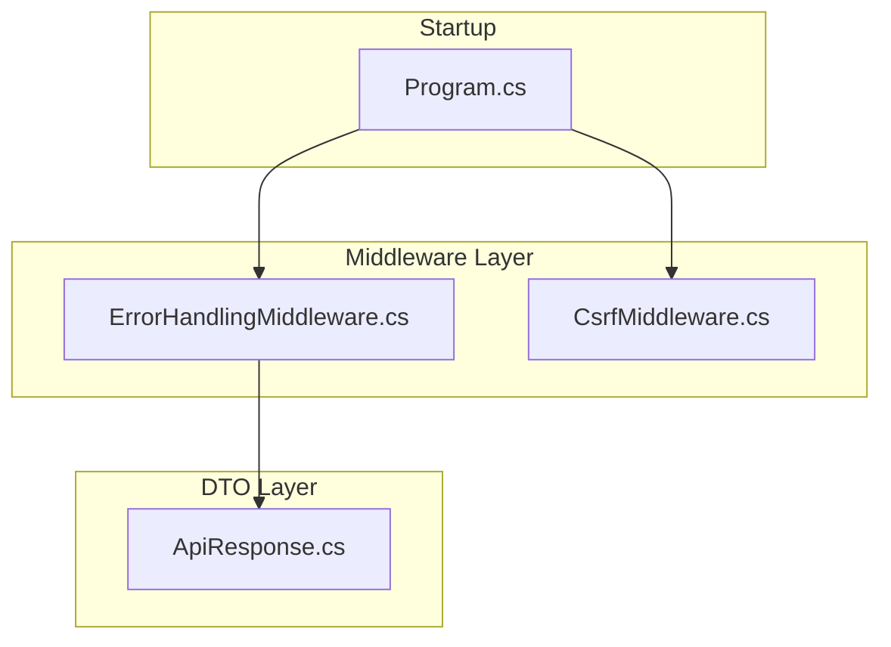
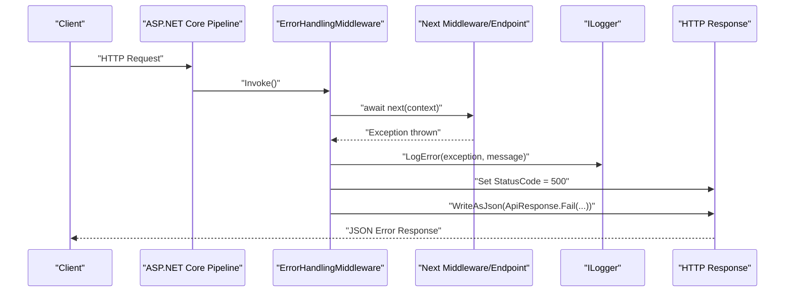
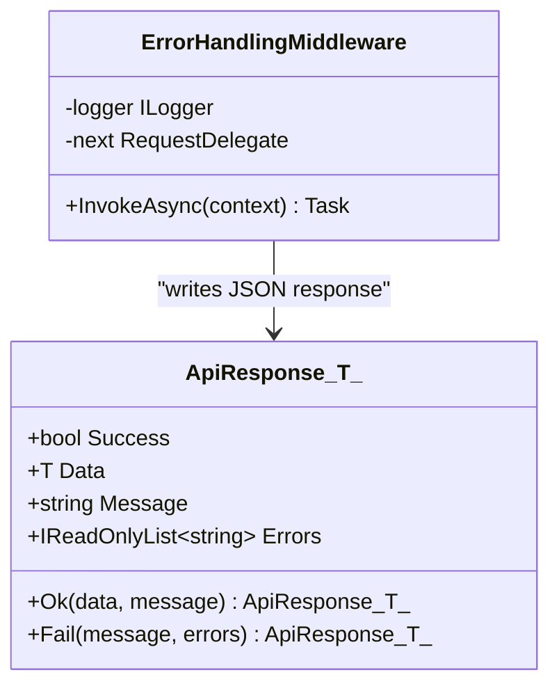
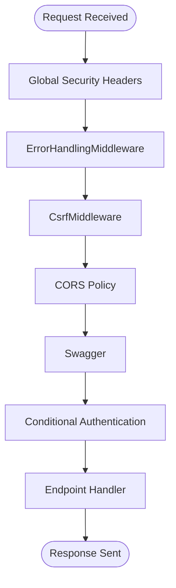
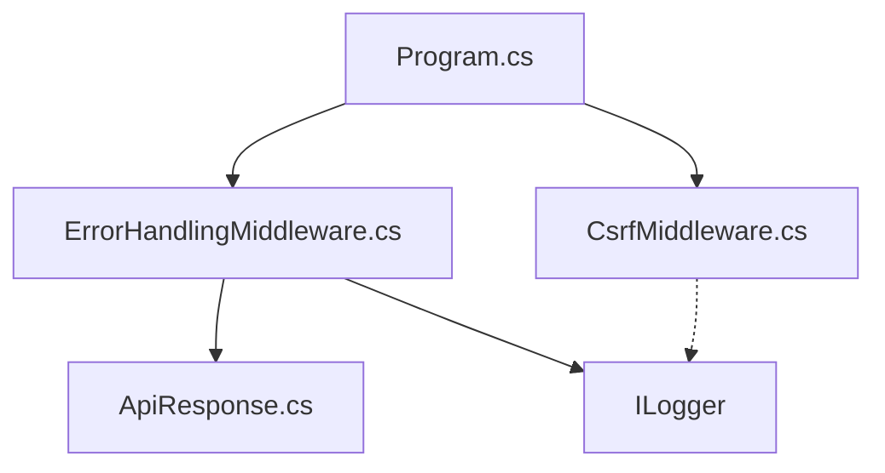

# Error Handling Middleware

<cite>
**Referenced Files in This Document**
- [ErrorHandlingMiddleware.cs](file://backend-dotnet/Middleware/ErrorHandlingMiddleware.cs)
- [ApiResponse.cs](file://backend-dotnet/DTOs/ApiResponse.cs)
- [Program.cs](file://backend-dotnet/Program.cs)
- [CsrfMiddleware.cs](file://backend-dotnet/Middleware/CsrfMiddleware.cs)
</cite>

## Table of Contents
1. [Introduction](#introduction)
2. [Project Structure](#project-structure)
3. [Core Components](#core-components)
4. [Architecture Overview](#architecture-overview)
5. [Detailed Component Analysis](#detailed-component-analysis)
6. [Dependency Analysis](#dependency-analysis)
7. [Performance Considerations](#performance-considerations)
8. [Troubleshooting Guide](#troubleshooting-guide)
9. [Conclusion](#conclusion)

## Introduction
This document provides comprehensive documentation for the ErrorHandlingMiddleware component in the backend-dotnet project. It explains how the middleware implements centralized exception handling using try-catch blocks around the request pipeline, details the structured error response format using the ApiResponse<T> DTO pattern, describes the logging mechanism with ILogger integration, and explains how unhandled exceptions are caught, logged with error context, and converted to standardized JSON responses. It also covers middleware registration in the ASP.NET Core pipeline and its position in the execution order.

## Project Structure
The ErrorHandlingMiddleware resides in the Middleware folder alongside other pipeline components. It integrates with the Program.cs startup configuration and works in conjunction with other middleware such as CSRF protection and authentication layers.

**Diagram sources**
- [ErrorHandlingMiddleware.cs:1-22](file://backend-dotnet/Middleware/ErrorHandlingMiddleware.cs#L1-L22)
- [Program.cs:100-102](file://backend-dotnet/Program.cs#L100-L102)
- [ApiResponse.cs:1-8](file://backend-dotnet/DTOs/ApiResponse.cs#L1-L8)
- [CsrfMiddleware.cs:1-62](file://backend-dotnet/Middleware/CsrfMiddleware.cs#L1-L62)

**Section sources**
- [ErrorHandlingMiddleware.cs:1-22](file://backend-dotnet/Middleware/ErrorHandlingMiddleware.cs#L1-L22)
- [Program.cs:100-102](file://backend-dotnet/Program.cs#L100-L102)
- [ApiResponse.cs:1-8](file://backend-dotnet/DTOs/ApiResponse.cs#L1-L8)
- [CsrfMiddleware.cs:1-62](file://backend-dotnet/Middleware/CsrfMiddleware.cs#L1-L62)

## Core Components
- ErrorHandlingMiddleware: Centralized exception handler that wraps the request pipeline with a try-catch block, logs unhandled exceptions, sets HTTP 500 status, and returns a standardized JSON error response using ApiResponse<T>.
- ApiResponse<T>: A sealed record DTO that standardizes success/failure responses with fields for Success flag, Data payload, Message, and Errors list. Provides static factory methods Ok and Fail for consistent response construction.
- Program.cs: Registers middleware in the ASP.NET Core pipeline, positioning ErrorHandlingMiddleware early to catch exceptions thrown by subsequent middleware and endpoint handlers.

Key characteristics:
- Exception scope: Catches all exceptions thrown during request processing.
- Logging: Uses ILogger to log exceptions with a fixed message template.
- Response format: Always returns ApiResponse<T>.Fail with a generic internal server error message and HTTP 500 status.
- Positioning: Registered before other middleware to ensure global coverage.

**Section sources**
- [ErrorHandlingMiddleware.cs:6-21](file://backend-dotnet/Middleware/ErrorHandlingMiddleware.cs#L6-L21)
- [ApiResponse.cs:3-7](file://backend-dotnet/DTOs/ApiResponse.cs#L3-L7)
- [Program.cs:100-102](file://backend-dotnet/Program.cs#L100-L102)

## Architecture Overview
The middleware participates in the ASP.NET Core pipeline as follows:
- Program.cs registers global middleware in a specific order.
- ErrorHandlingMiddleware is registered first to wrap the entire pipeline.
- Subsequent middleware (e.g., CSRF protection, CORS, authentication) runs inside the try block.
- If any middleware or endpoint throws an exception, it is caught by ErrorHandlingMiddleware.
- The middleware logs the exception, sets HTTP 500, and writes a standardized JSON error response.

**Diagram sources**
- [ErrorHandlingMiddleware.cs:8-19](file://backend-dotnet/Middleware/ErrorHandlingMiddleware.cs#L8-L19)
- [Program.cs:100-102](file://backend-dotnet/Program.cs#L100-L102)

**Section sources**
- [ErrorHandlingMiddleware.cs:8-19](file://backend-dotnet/Middleware/ErrorHandlingMiddleware.cs#L8-L19)
- [Program.cs:100-102](file://backend-dotnet/Program.cs#L100-L102)

## Detailed Component Analysis

### ErrorHandlingMiddleware Implementation
The middleware is implemented as a sealed class with constructor injection for RequestDelegate and ILogger. Its InvokeAsync method:
- Wraps downstream invocation in a try block.
- Catches any Exception thrown by subsequent middleware or endpoints.
- Logs the exception using ILogger.LogError with a fixed message template.
- Sets HTTP status code to 500 Internal Server Error.
- Writes a standardized JSON response using ApiResponse<object>.Fail with a generic error message and empty error list.

**Diagram sources**
- [ErrorHandlingMiddleware.cs:6-21](file://backend-dotnet/Middleware/ErrorHandlingMiddleware.cs#L6-L21)
- [ApiResponse.cs:3-7](file://backend-dotnet/DTOs/ApiResponse.cs#L3-L7)

**Section sources**
- [ErrorHandlingMiddleware.cs:6-21](file://backend-dotnet/Middleware/ErrorHandlingMiddleware.cs#L6-L21)
- [ApiResponse.cs:3-7](file://backend-dotnet/DTOs/ApiResponse.cs#L3-L7)

### ApiResponse<T> DTO Pattern
ApiResponse<T> is a sealed record with four fields:
- Success: Boolean indicating operation outcome.
- Data: Nullable payload of type T.
- Message: Human-readable message describing the result.
- Errors: Immutable list of error strings.

Static factory methods:
- Ok(data, message): Creates a successful response with empty error list.
- Fail(message, params errors): Creates a failed response with provided errors.

Usage patterns:
- Controllers and middleware consistently use ApiResponse<T>.Ok for success responses.
- ApiResponse<T>.Fail is used for error responses with appropriate HTTP status codes set by the caller.

**Section sources**
- [ApiResponse.cs:3-7](file://backend-dotnet/DTOs/ApiResponse.cs#L3-L7)

### Middleware Registration and Execution Order
In Program.cs, middleware is registered in the following order:
1. Global security headers middleware (sets various security headers).
2. ErrorHandlingMiddleware (registered via app.UseMiddleware<ErrorHandlingMiddleware>()).
3. CsrfMiddleware (registered via app.UseMiddleware<CsrfMiddleware>()).
4. CORS policy registration.
5. Swagger middleware.
6. Conditional authentication middleware for API endpoints.

Positioning rationale:
- ErrorHandlingMiddleware is registered immediately after global security headers to ensure all downstream exceptions are captured.
- CsrfMiddleware runs after ErrorHandlingMiddleware so CSRF failures are handled by the middleware chain rather than being swallowed by the global error handler.

**Diagram sources**
- [Program.cs:92-102](file://backend-dotnet/Program.cs#L92-L102)
- [Program.cs:100-102](file://backend-dotnet/Program.cs#L100-L102)

**Section sources**
- [Program.cs:92-102](file://backend-dotnet/Program.cs#L92-L102)
- [Program.cs:100-102](file://backend-dotnet/Program.cs#L100-L102)

### Exception Scenarios and HTTP Status Codes
The ErrorHandlingMiddleware catches all exceptions and responds with HTTP 500 and a standardized error payload. Specific HTTP status codes are set by other middleware and endpoints when appropriate:
- 401 Unauthorized: Authentication middleware sets this for missing or invalid bearer tokens.
- 403 Forbidden: CSRF middleware sets this when token validation fails.
- 404 Not Found: Controllers return this for resource-not-found scenarios.
- 400 Bad Request: Controllers return this for argument and invalid-request-body errors.
- 409 Conflict: Telemetry ingestion returns this for duplicate nonce detection.
- 422 Unprocessable Entity: Telemetry ingestion returns this for invalid coordinates/speed or timestamp window violations.
- 429 Too Many Requests: Global rate-limiting middleware sets this when request limits are exceeded.

Note: The ErrorHandlingMiddleware does not alter the status code; it preserves whatever status code was set by earlier middleware or endpoints.

**Section sources**
- [ErrorHandlingMiddleware.cs:16-18](file://backend-dotnet/Middleware/ErrorHandlingMiddleware.cs#L16-L18)
- [Program.cs:174-207](file://backend-dotnet/Program.cs#L174-L207)
- [CsrfMiddleware.cs:43-48](file://backend-dotnet/Middleware/CsrfMiddleware.cs#L43-L48)
- [EndpointMappings.cs:6866-6871](file://backend-dotnet/Controllers/EndpointMappings.cs#L6866-L6871)
- [EndpointMappings.cs:6873-6893](file://backend-dotnet/Controllers/EndpointMappings.cs#L6873-L6893)
- [Program.cs:138-143](file://backend-dotnet/Program.cs#L138-L143)

## Dependency Analysis
- ErrorHandlingMiddleware depends on:
  - RequestDelegate for invoking the next middleware in the pipeline.
  - ILogger for logging unhandled exceptions.
  - ApiResponse<T> for constructing standardized error responses.
- Program.cs orchestrates middleware registration and ensures ErrorHandlingMiddleware is positioned early in the pipeline.
- CsrfMiddleware operates independently and may set its own status codes for CSRF violations.

**Diagram sources**
- [Program.cs:100-102](file://backend-dotnet/Program.cs#L100-L102)
- [ErrorHandlingMiddleware.cs:2](file://backend-dotnet/Middleware/ErrorHandlingMiddleware.cs#L2)
- [ErrorHandlingMiddleware.cs:6](file://backend-dotnet/Middleware/ErrorHandlingMiddleware.cs#L6)
- [ApiResponse.cs:1](file://backend-dotnet/DTOs/ApiResponse.cs#L1)
- [CsrfMiddleware.cs:1](file://backend-dotnet/Middleware/CsrfMiddleware.cs#L1)

**Section sources**
- [Program.cs:100-102](file://backend-dotnet/Program.cs#L100-L102)
- [ErrorHandlingMiddleware.cs:2](file://backend-dotnet/Middleware/ErrorHandlingMiddleware.cs#L2)
- [ErrorHandlingMiddleware.cs:6](file://backend-dotnet/Middleware/ErrorHandlingMiddleware.cs#L6)
- [ApiResponse.cs:1](file://backend-dotnet/DTOs/ApiResponse.cs#L1)
- [CsrfMiddleware.cs:1](file://backend-dotnet/Middleware/CsrfMiddleware.cs#L1)

## Performance Considerations
- Logging overhead: ILogger.LogError is synchronous and may impact latency under high-error rates. Consider batching or sampling in production environments.
- Response serialization: WriteAsJsonAsync serializes ApiResponse<T>.Fail; keep error messages concise to minimize payload size.
- Middleware ordering: Early placement of ErrorHandlingMiddleware ensures minimal overhead for successful requests while guaranteeing error capture.

## Troubleshooting Guide
Common issues and resolutions:
- Unexpected 500 responses: Verify whether the exception originated in ErrorHandlingMiddleware or was thrown by earlier middleware/endpoints. Check logs for the "Unhandled API error" message and stack traces.
- CSRF-related 403 responses: Confirm presence and validity of CSRF cookies and headers. Ensure non-safe methods include the X-CSRF-Token header.
- Authentication-related 401 responses: Validate Authorization headers and token expiration. Ensure tokens are provided for protected endpoints.
- Rate limiting 429 responses: Adjust client-side retry policies and reduce request frequency within the rate window.

**Section sources**
- [ErrorHandlingMiddleware.cs:16](file://backend-dotnet/Middleware/ErrorHandlingMiddleware.cs#L16)
- [CsrfMiddleware.cs:43-48](file://backend-dotnet/Middleware/CsrfMiddleware.cs#L43-L48)
- [Program.cs:174-207](file://backend-dotnet/Program.cs#L174-L207)
- [Program.cs:138-143](file://backend-dotnet/Program.cs#L138-L143)

## Conclusion
ErrorHandlingMiddleware provides robust, centralized exception handling for the ASP.NET Core pipeline. By wrapping the entire request lifecycle in a try-catch block, it ensures that unhandled exceptions are logged and transformed into standardized JSON responses. Combined with the ApiResponse<T> DTO pattern and explicit status code handling in other middleware, it delivers a consistent and predictable error-handling experience across the API surface.