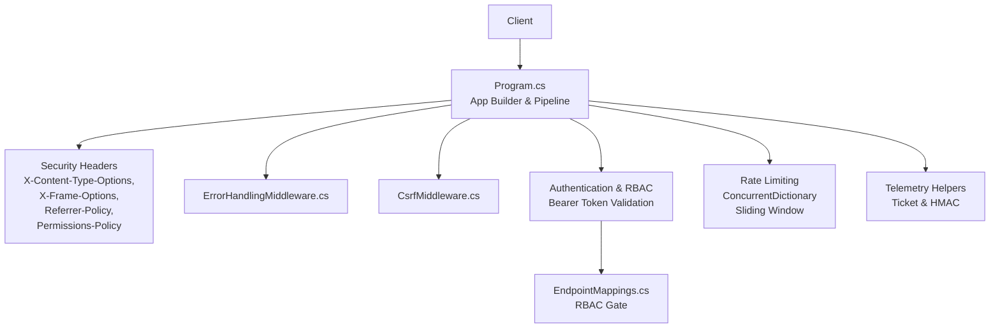
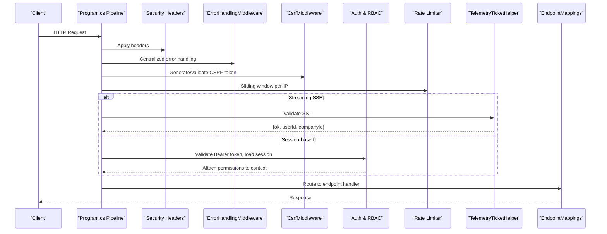
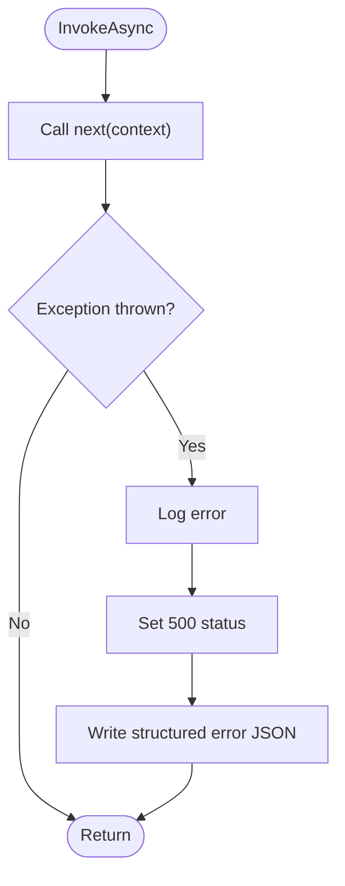
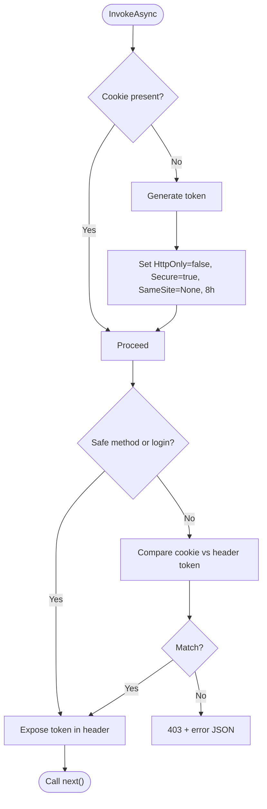
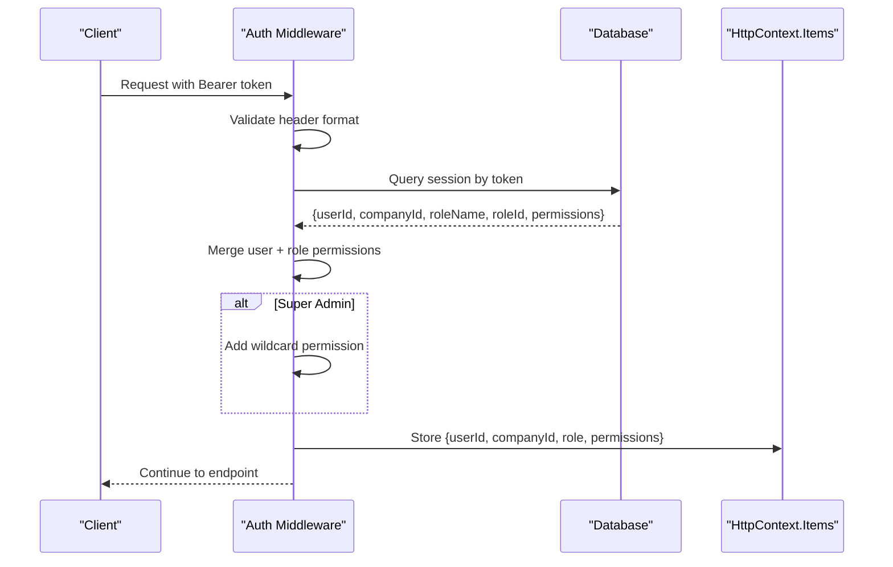
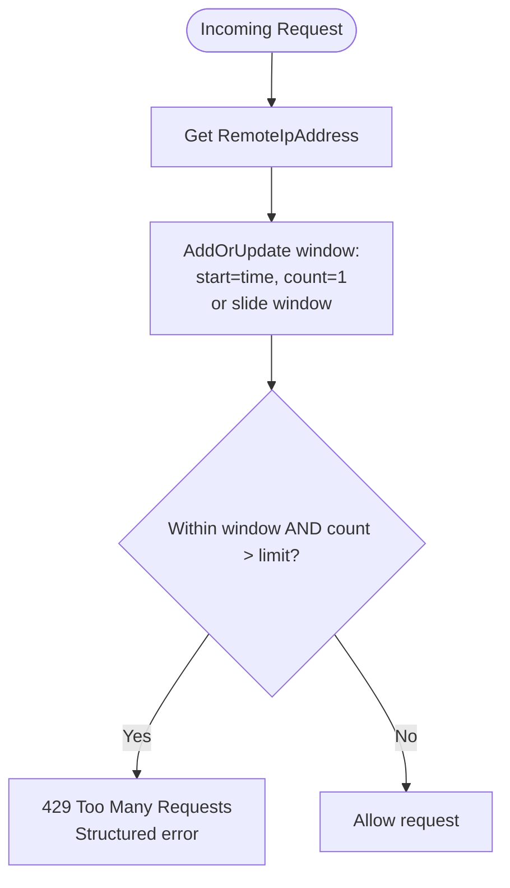
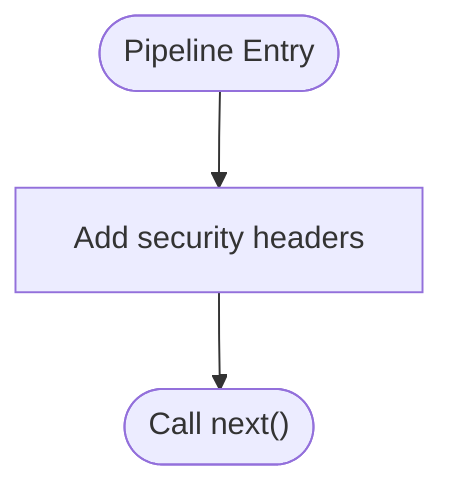
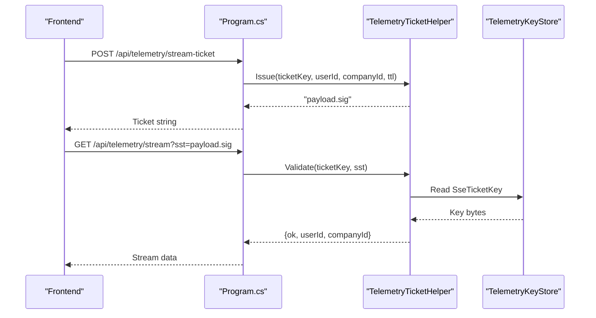
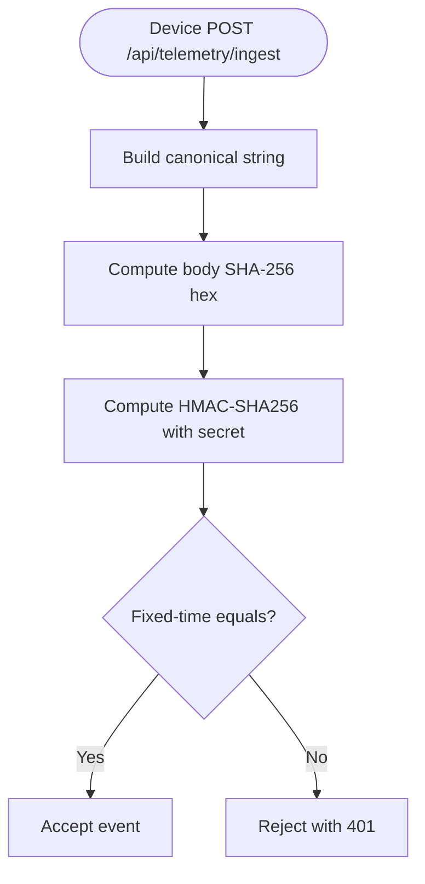
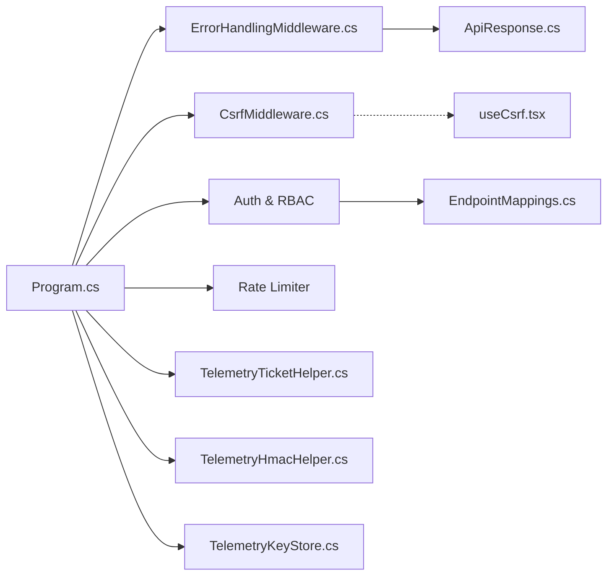

# Middleware Pipeline & Security

<cite>
**Referenced Files in This Document**
- [ErrorHandlingMiddleware.cs](file://backend-dotnet/Middleware/ErrorHandlingMiddleware.cs)
- [CsrfMiddleware.cs](file://backend-dotnet/Middleware/CsrfMiddleware.cs)
- [Program.cs](file://backend-dotnet/Program.cs)
- [TelemetryTicketHelper.cs](file://backend-dotnet/TelemetryTicketHelper.cs)
- [TelemetryHmacHelper.cs](file://backend-dotnet/TelemetryHmacHelper.cs)
- [TelemetryKeyStore.cs](file://backend-dotnet/TelemetryKeyStore.cs)
- [EndpointMappings.cs](file://backend-dotnet/Controllers/EndpointMappings.cs)
- [ApiResponse.cs](file://backend-dotnet/DTOs/ApiResponse.cs)
- [useCsrf.tsx](file://frontend/src/hooks/useCsrf.tsx)
</cite>

## Table of Contents
1. [Introduction](#introduction)
2. [Project Structure](#project-structure)
3. [Core Components](#core-components)
4. [Architecture Overview](#architecture-overview)
5. [Detailed Component Analysis](#detailed-component-analysis)
6. [Dependency Analysis](#dependency-analysis)
7. [Performance Considerations](#performance-considerations)
8. [Troubleshooting Guide](#troubleshooting-guide)
9. [Conclusion](#conclusion)

## Introduction
This document explains the middleware pipeline and security implementation of the backend API. It covers centralized exception handling, CSRF protection, authentication and session validation, role-based permissions, rate limiting, security headers, and secure streaming authentication using short-lived tickets. The goal is to provide a clear understanding of how requests are processed, validated, and secured across the system.

## Project Structure
The security and middleware logic is primarily implemented in the .NET backend within Program.cs and dedicated middleware classes, with supporting helpers for telemetry and DTOs. Frontend hooks integrate with CSRF mechanisms.

**Diagram sources**
- [Program.cs:92-245](file://backend-dotnet/Program.cs#L92-L245)
- [ErrorHandlingMiddleware.cs:6-21](file://backend-dotnet/Middleware/ErrorHandlingMiddleware.cs#L6-L21)
- [CsrfMiddleware.cs:6-61](file://backend-dotnet/Middleware/CsrfMiddleware.cs#L6-L61)
- [TelemetryTicketHelper.cs:3-50](file://backend-dotnet/TelemetryTicketHelper.cs#L3-L50)
- [TelemetryHmacHelper.cs:5-32](file://backend-dotnet/TelemetryHmacHelper.cs#L5-L32)
- [EndpointMappings.cs:12-17](file://backend-dotnet/Controllers/EndpointMappings.cs#L12-L17)

**Section sources**
- [Program.cs:92-245](file://backend-dotnet/Program.cs#L92-L245)

## Core Components
- Centralized error handling via ErrorHandlingMiddleware for unhandled exceptions and structured JSON responses.
- CSRF protection via CsrfMiddleware generating and validating tokens for state-changing requests.
- Authentication middleware validating Bearer tokens, loading user sessions, and attaching permissions to context items.
- Role-based permissions resolved from user and role data, with special handling for super admin.
- Rate limiting using a sliding window algorithm with a concurrent dictionary keyed by remote IP.
- Security headers applied globally for content-type sniffing, frame embedding, referrer policy, and permissions policy.
- Secure streaming authentication using short-lived tickets (SST) for server-sent events, avoiding long-lived tokens in URLs.

**Section sources**
- [ErrorHandlingMiddleware.cs:6-21](file://backend-dotnet/Middleware/ErrorHandlingMiddleware.cs#L6-L21)
- [CsrfMiddleware.cs:6-61](file://backend-dotnet/Middleware/CsrfMiddleware.cs#L6-L61)
- [Program.cs:92-245](file://backend-dotnet/Program.cs#L92-L245)
- [TelemetryTicketHelper.cs:3-50](file://backend-dotnet/TelemetryTicketHelper.cs#L3-L50)
- [TelemetryHmacHelper.cs:5-32](file://backend-dotnet/TelemetryHmacHelper.cs#L5-L32)
- [TelemetryKeyStore.cs:5-11](file://backend-dotnet/TelemetryKeyStore.cs#L5-L11)
- [EndpointMappings.cs:12-17](file://backend-dotnet/Controllers/EndpointMappings.cs#L12-L17)
- [ApiResponse.cs:3-7](file://backend-dotnet/DTOs/ApiResponse.cs#L3-L7)

## Architecture Overview
The middleware pipeline is configured early in the application builder. Requests pass through security headers, error handling, CSRF validation, CORS, and then a guarded authentication and RBAC layer. Specific paths bypass authentication for health checks, telemetry ingestion, and public tracking. Rate limiting applies per-IP windows. Streaming endpoints use short-lived tickets instead of bearer tokens.

**Diagram sources**
- [Program.cs:92-245](file://backend-dotnet/Program.cs#L92-L245)
- [ErrorHandlingMiddleware.cs:8-20](file://backend-dotnet/Middleware/ErrorHandlingMiddleware.cs#L8-L20)
- [CsrfMiddleware.cs:19-55](file://backend-dotnet/Middleware/CsrfMiddleware.cs#L19-L55)
- [TelemetryTicketHelper.cs:15-36](file://backend-dotnet/TelemetryTicketHelper.cs#L15-L36)
- [EndpointMappings.cs:12-17](file://backend-dotnet/Controllers/EndpointMappings.cs#L12-L17)

## Detailed Component Analysis

### Centralized Exception Handling (ErrorHandlingMiddleware)
- Purpose: Wrap downstream pipeline to catch unhandled exceptions and return a structured JSON error response.
- Behavior: Logs the exception, sets HTTP 500, writes a standardized failure response envelope.
- Output format: Uses ApiResponse<T>.Fail to produce consistent error payloads.

**Diagram sources**
- [ErrorHandlingMiddleware.cs:8-20](file://backend-dotnet/Middleware/ErrorHandlingMiddleware.cs#L8-L20)
- [ApiResponse.cs:6-7](file://backend-dotnet/DTOs/ApiResponse.cs#L6-L7)

**Section sources**
- [ErrorHandlingMiddleware.cs:6-21](file://backend-dotnet/Middleware/ErrorHandlingMiddleware.cs#L6-L21)
- [ApiResponse.cs:3-7](file://backend-dotnet/DTOs/ApiResponse.cs#L3-L7)

### CSRF Protection (CsrfMiddleware)
- Token generation: On GET or missing cookie, generates a random token and sets a secure cookie.
- Validation: For state-changing methods, compares cookie token with request header token; rejects if mismatch.
- Exposure: Returns the token in response header for clients to read.
- Bypass: Login endpoint is excluded from CSRF validation.

**Diagram sources**
- [CsrfMiddleware.cs:19-55](file://backend-dotnet/Middleware/CsrfMiddleware.cs#L19-L55)

**Section sources**
- [CsrfMiddleware.cs:6-61](file://backend-dotnet/Middleware/CsrfMiddleware.cs#L6-L61)
- [useCsrf.tsx:1-41](file://frontend/src/hooks/useCsrf.tsx#L1-L41)

### Authentication & Role-Based Permissions
- Scope: Applies to protected API paths under /api (with specific bypasses).
- Bearer token validation: Requires Authorization header with Bearer scheme; validates against stored session.
- Session lookup: Joins user_sessions with users and optional roles; ensures active user and unexpired session.
- Permission resolution: Aggregates user permissions and role permissions; super admin gets wildcard permission.
- Context propagation: Attaches user ID, company ID, role, and permissions to context items for downstream handlers.

**Diagram sources**
- [Program.cs:174-243](file://backend-dotnet/Program.cs#L174-L243)
- [EndpointMappings.cs:12-17](file://backend-dotnet/Controllers/EndpointMappings.cs#L12-L17)

**Section sources**
- [Program.cs:105-243](file://backend-dotnet/Program.cs#L105-L243)
- [EndpointMappings.cs:12-17](file://backend-dotnet/Controllers/EndpointMappings.cs#L12-L17)

### Rate Limiting (Sliding Window with ConcurrentDictionary)
- Mechanism: Per-IP window tracking using a concurrent dictionary keyed by RemoteIpAddress.
- Algorithm: Sliding window of fixed duration; increments count per request; rejects after exceeding threshold.
- Response: Returns 429 with structured error payload when limit exceeded.

**Diagram sources**
- [Program.cs:129-143](file://backend-dotnet/Program.cs#L129-L143)

**Section sources**
- [Program.cs:66-69](file://backend-dotnet/Program.cs#L66-L69)
- [Program.cs:129-143](file://backend-dotnet/Program.cs#L129-L143)

### Security Headers Middleware
- Applied globally to all responses: X-Content-Type-Options, X-Frame-Options, Referrer-Policy, Permissions-Policy.
- Purpose: Mitigates common browser-based attacks and controls feature access.

**Diagram sources**
- [Program.cs:92-99](file://backend-dotnet/Program.cs#L92-L99)

**Section sources**
- [Program.cs:92-99](file://backend-dotnet/Program.cs#L92-L99)

### Telemetry Streaming Authentication (Short-Lived Tickets)
- Purpose: Authenticate server-sent event streams without exposing long-lived bearer tokens in URLs.
- Issuance: POST /api/telemetry/stream-ticket returns a signed, time-bound ticket containing {userId:companyId:exp}.
- Validation: GET /api/telemetry/stream requires ?sst=; validated via HMAC-SHA256 and expiration check.
- Key storage: Shared key via TelemetryKeyStore; avoids circular dependencies.

**Diagram sources**
- [Program.cs:145-172](file://backend-dotnet/Program.cs#L145-L172)
- [TelemetryTicketHelper.cs:5-36](file://backend-dotnet/TelemetryTicketHelper.cs#L5-L36)
- [TelemetryKeyStore.cs:5-11](file://backend-dotnet/TelemetryKeyStore.cs#L5-L11)

**Section sources**
- [Program.cs:145-172](file://backend-dotnet/Program.cs#L145-L172)
- [TelemetryTicketHelper.cs:3-50](file://backend-dotnet/TelemetryTicketHelper.cs#L3-L50)
- [TelemetryKeyStore.cs:5-11](file://backend-dotnet/TelemetryKeyStore.cs#L5-L11)

### Device Authentication for Telemetry Ingest (HMAC-SHA256)
- Purpose: Authenticate device-originated telemetry ingestion without user sessions.
- Signature construction: Canonical string includes method, path, X-Timestamp, X-Nonce, and hex-encoded body SHA-256.
- Verification: Server recomputes signature and performs constant-time comparison.

**Diagram sources**
- [TelemetryHmacHelper.cs:8-31](file://backend-dotnet/TelemetryHmacHelper.cs#L8-L31)

**Section sources**
- [TelemetryHmacHelper.cs:5-32](file://backend-dotnet/TelemetryHmacHelper.cs#L5-L32)

## Dependency Analysis
- Program.cs orchestrates middleware order and defines shared state (rate windows, keys).
- ErrorHandlingMiddleware depends on ApiResponse for consistent error envelopes.
- CsrfMiddleware integrates with frontend hooks to manage token exposure and retrieval.
- Authentication middleware depends on Database for session validation and EndpointMappings constants for context item keys.
- TelemetryTicketHelper and TelemetryKeyStore are consumed by Program.cs for streaming auth.
- TelemetryHmacHelper is used by ingestion endpoints to validate device signatures.

**Diagram sources**
- [Program.cs:92-245](file://backend-dotnet/Program.cs#L92-L245)
- [ErrorHandlingMiddleware.cs:6-21](file://backend-dotnet/Middleware/ErrorHandlingMiddleware.cs#L6-L21)
- [CsrfMiddleware.cs:6-61](file://backend-dotnet/Middleware/CsrfMiddleware.cs#L6-L61)
- [TelemetryTicketHelper.cs:3-50](file://backend-dotnet/TelemetryTicketHelper.cs#L3-L50)
- [TelemetryHmacHelper.cs:5-32](file://backend-dotnet/TelemetryHmacHelper.cs#L5-L32)
- [TelemetryKeyStore.cs:5-11](file://backend-dotnet/TelemetryKeyStore.cs#L5-L11)
- [EndpointMappings.cs:12-17](file://backend-dotnet/Controllers/EndpointMappings.cs#L12-L17)
- [ApiResponse.cs:3-7](file://backend-dotnet/DTOs/ApiResponse.cs#L3-L7)
- [useCsrf.tsx:1-41](file://frontend/src/hooks/useCsrf.tsx#L1-L41)

**Section sources**
- [Program.cs:92-245](file://backend-dotnet/Program.cs#L92-L245)
- [EndpointMappings.cs:12-17](file://backend-dotnet/Controllers/EndpointMappings.cs#L12-L17)

## Performance Considerations
- Rate limiting uses a concurrent dictionary for O(1) updates and lookups; sliding window resets per IP.
- Authentication queries join sessions, users, and roles; ensure appropriate indexing on session_token, expires_at, and user status.
- HMAC computations are lightweight but should avoid repeated hashing for large bodies; consider streaming or pre-hashing at ingestion boundaries.
- Cookie token generation uses cryptographically secure randomness; keep token length reasonable for network overhead.

## Troubleshooting Guide
- Unauthorized responses:
  - Verify Authorization header format and presence of Bearer token.
  - Confirm session exists, is unexpired, and user is Active.
  - Check that permissions are granted for the requested endpoint.
- CSRF failures:
  - Ensure CSRF cookie is set and response header matches request header.
  - Confirm non-safe methods include the header and login path is excluded.
- Rate limit exceeded:
  - Reduce request frequency or adjust thresholds.
  - Observe per-IP window resets.
- Streaming authentication:
  - Ensure ?sst= is present and not expired.
  - Confirm ticket key matches server key store.
- Device ingestion:
  - Validate canonical signature computation and constant-time comparison.
  - Check X-Timestamp freshness window and body SHA-256 correctness.

**Section sources**
- [Program.cs:174-207](file://backend-dotnet/Program.cs#L174-L207)
- [Program.cs:145-172](file://backend-dotnet/Program.cs#L145-L172)
- [CsrfMiddleware.cs:36-49](file://backend-dotnet/Middleware/CsrfMiddleware.cs#L36-L49)
- [TelemetryTicketHelper.cs:15-36](file://backend-dotnet/TelemetryTicketHelper.cs#L15-L36)
- [TelemetryHmacHelper.cs:25-31](file://backend-dotnet/TelemetryHmacHelper.cs#L25-L31)

## Conclusion
The middleware pipeline establishes robust security controls: centralized error handling, CSRF protection, strict authentication with RBAC, sliding-window rate limiting, and comprehensive security headers. Streaming endpoints leverage short-lived tickets to avoid long-lived tokens in URLs, while device ingestion relies on HMAC-based signatures. Together, these components provide defense-in-depth for the API surface.