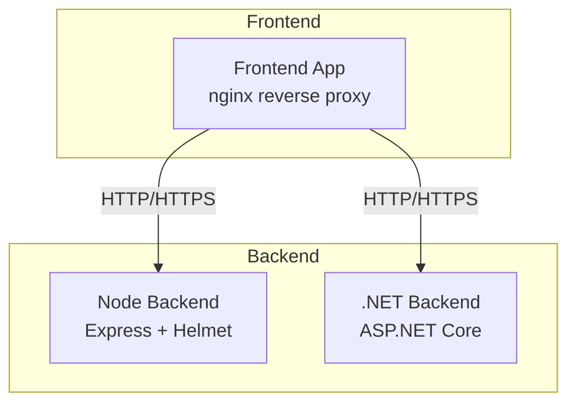
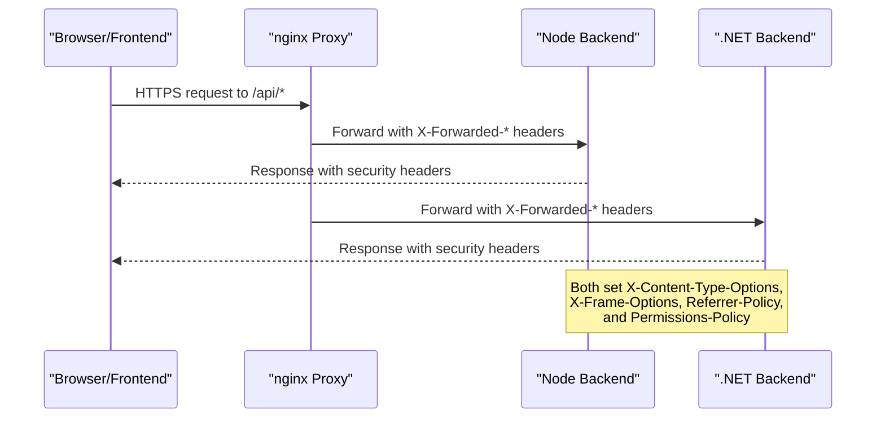
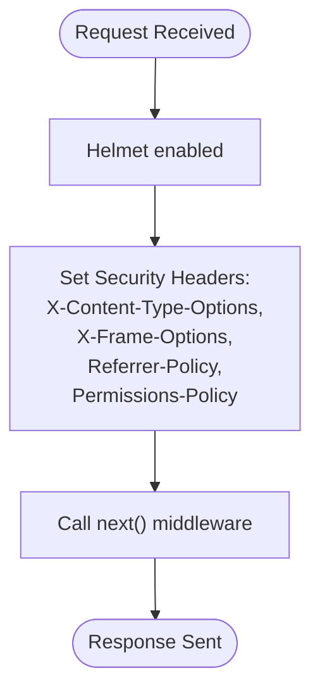
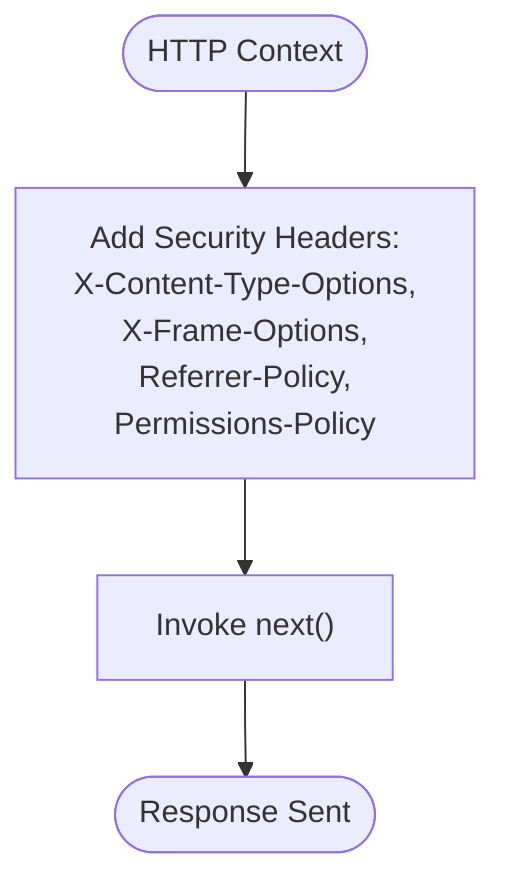
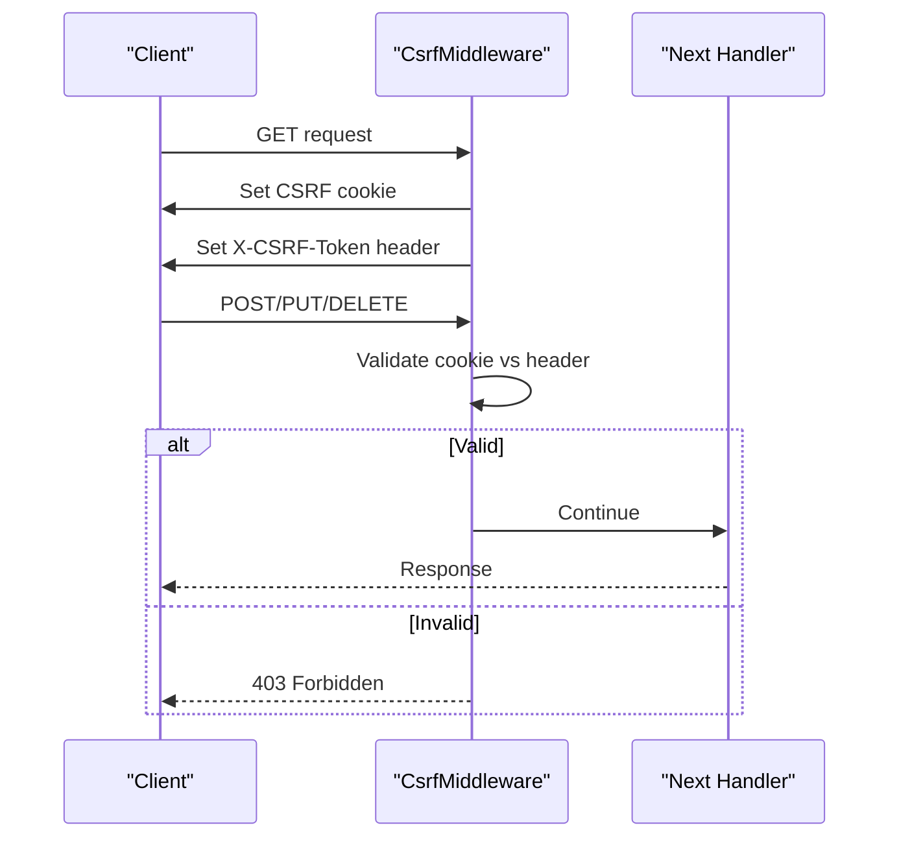
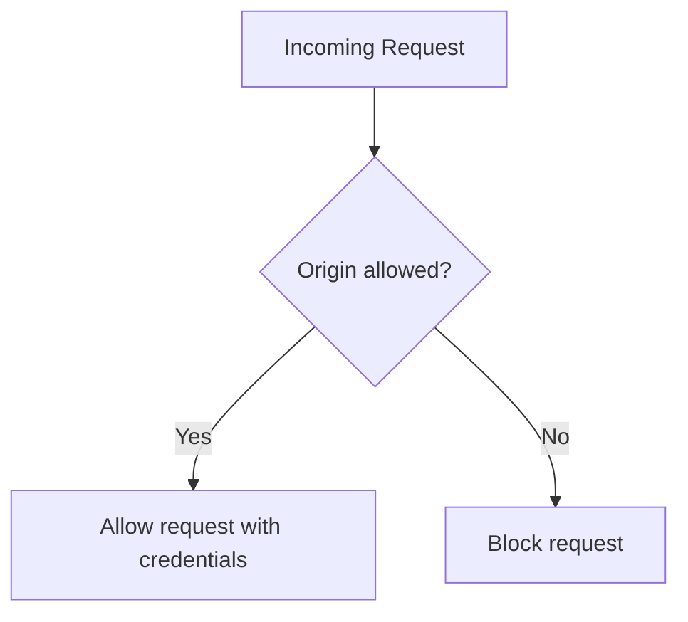
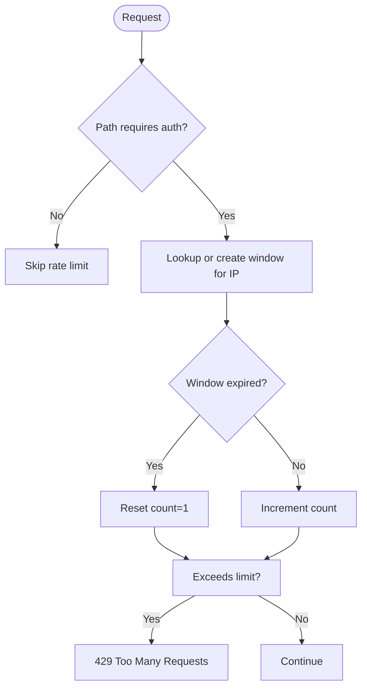
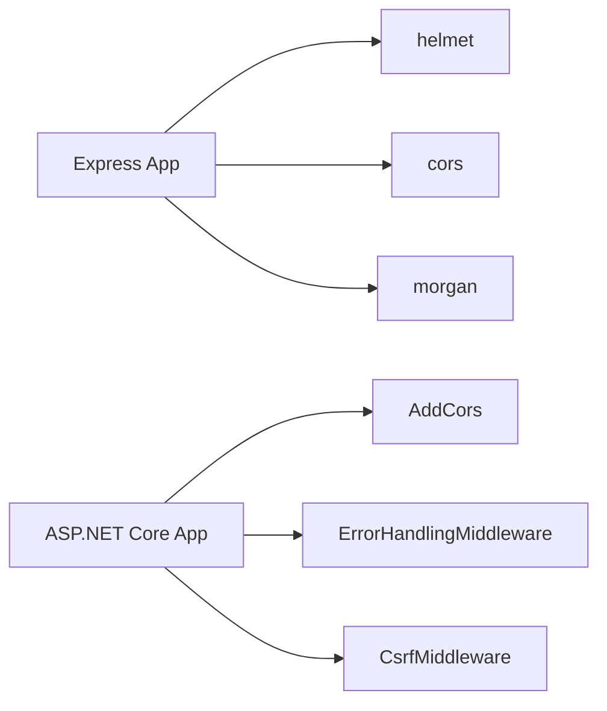

# Security Headers Middleware

<cite>
**Referenced Files in This Document**
- [app.ts](file://backend/src/app.ts)
- [Program.cs](file://backend-dotnet/Program.cs)
- [CsrfMiddleware.cs](file://backend-dotnet/Middleware/CsrfMiddleware.cs)
- [ErrorHandlingMiddleware.cs](file://backend-dotnet/Middleware/ErrorHandlingMiddleware.cs)
- [package.json](file://backend/package.json)
- [nginx.conf](file://frontend/nginx.conf)
- [useCsrf.tsx](file://frontend/src/hooks/useCsrf.tsx)
</cite>

## Table of Contents
1. [Introduction](#introduction)
2. [Project Structure](#project-structure)
3. [Core Components](#core-components)
4. [Architecture Overview](#architecture-overview)
5. [Detailed Component Analysis](#detailed-component-analysis)
6. [Dependency Analysis](#dependency-analysis)
7. [Performance Considerations](#performance-considerations)
8. [Troubleshooting Guide](#troubleshooting-guide)
9. [Conclusion](#conclusion)

## Introduction
This document explains the security headers implementation and HTTP security header configuration across the backend and backend-dotnet services. It details the enforcement of X-Content-Type-Options, X-Frame-Options, Referrer-Policy, and Permissions-Policy headers, and how these headers mitigate common web vulnerabilities such as clickjacking, MIME-type sniffing, and XSS risks. It also covers middleware configuration for security header enforcement, rate limiting, and CSRF protection, along with CORS considerations and environment-specific configurations.

## Project Structure
The security headers are enforced in two backend implementations:
- Node.js/Express backend: Express application with Helmet and manual header injection
- .NET backend: ASP.NET Core pipeline with middleware and header injection

**Diagram sources**
- [app.ts:25-40](file://backend/src/app.ts#L25-L40)
- [Program.cs:92-99](file://backend-dotnet/Program.cs#L92-L99)

**Section sources**
- [app.ts:16-40](file://backend/src/app.ts#L16-L40)
- [Program.cs:65-104](file://backend-dotnet/Program.cs#L65-L104)

## Core Components
- Security headers middleware (Node.js): Helmet-enabled Express app with explicit header injection for X-Content-Type-Options, X-Frame-Options, Referrer-Policy, and Permissions-Policy.
- Security headers middleware (.NET): Global middleware that sets the same four security headers for all responses.
- CSRF protection middleware (.NET): Generates and validates CSRF tokens for state-changing requests, with exceptions for specific endpoints.
- CORS configuration (.NET): Configured via AddCors with allowed origins and credentials support.
- Frontend nginx proxy: Proxies API requests and forwards essential headers for proper backend behavior.

**Section sources**
- [app.ts:25-40](file://backend/src/app.ts#L25-L40)
- [Program.cs:92-99](file://backend-dotnet/Program.cs#L92-L99)
- [CsrfMiddleware.cs:19-54](file://backend-dotnet/Middleware/CsrfMiddleware.cs#L19-L54)
- [Program.cs:55-63](file://backend-dotnet/Program.cs#L55-L63)
- [nginx.conf:12-19](file://frontend/nginx.conf#L12-L19)

## Architecture Overview
The security architecture ensures that:
- All responses include strict security headers
- Requests are rate-limited except for specific public endpoints
- CSRF protection is enforced for state-changing operations
- CORS is configured per environment with allowed origins and credentials
- Frontend communicates via HTTPS and proxies API traffic securely

**Diagram sources**
- [app.ts:34-40](file://backend/src/app.ts#L34-L40)
- [Program.cs:92-99](file://backend-dotnet/Program.cs#L92-L99)
- [nginx.conf:12-19](file://frontend/nginx.conf#L12-L19)

## Detailed Component Analysis

### Node.js Backend Security Headers
The Node backend uses Helmet for default hardening and adds explicit security headers at the application level. These headers provide:
- X-Content-Type-Options: nosniff prevents MIME-type sniffing
- X-Frame-Options: DENY prevents clickjacking
- Referrer-Policy: strict-origin-when-cross-origin minimizes leakage
- Permissions-Policy: restricts camera, microphone, and geolocation APIs

**Diagram sources**
- [app.ts:25-40](file://backend/src/app.ts#L25-L40)

**Section sources**
- [app.ts:25-40](file://backend/src/app.ts#L25-L40)
- [package.json:22-28](file://backend/package.json#L22-L28)

### .NET Backend Security Headers
The .NET backend applies security headers globally via middleware. The headers are added to every response, ensuring consistent protection across all endpoints.

**Diagram sources**
- [Program.cs:92-99](file://backend-dotnet/Program.cs#L92-L99)

**Section sources**
- [Program.cs:92-99](file://backend-dotnet/Program.cs#L92-L99)

### CSRF Protection Middleware
The CSRF middleware:
- Generates a CSRF token cookie for GET requests or when absent
- Validates the token for state-changing methods (POST, PUT, DELETE), excluding specific endpoints
- Exposes the CSRF token via response header for client consumption

**Diagram sources**
- [CsrfMiddleware.cs:19-54](file://backend-dotnet/Middleware/CsrfMiddleware.cs#L19-L54)

**Section sources**
- [CsrfMiddleware.cs:19-54](file://backend-dotnet/Middleware/CsrfMiddleware.cs#L19-L54)
- [useCsrf.tsx:20-40](file://frontend/src/hooks/useCsrf.tsx#L20-L40)

### CORS Configuration
The .NET backend configures CORS with:
- Allowed origins from configuration
- AllowAnyHeader and AllowAnyMethod
- Credentials support enabled

**Diagram sources**
- [Program.cs:55-63](file://backend-dotnet/Program.cs#L55-L63)

**Section sources**
- [Program.cs:55-63](file://backend-dotnet/Program.cs#L55-L63)

### Rate Limiting Middleware
Both backends implement rate limiting:
- Node backend: In-memory windowed counter with configurable window size and max requests
- .NET backend: Concurrent dictionary-based windowed counter with similar logic

**Diagram sources**
- [app.ts:42-72](file://backend/src/app.ts#L42-L72)
- [Program.cs:105-144](file://backend-dotnet/Program.cs#L105-L144)

**Section sources**
- [app.ts:42-72](file://backend/src/app.ts#L42-L72)
- [Program.cs:105-144](file://backend-dotnet/Program.cs#L105-L144)

### Content Security Policy (CSP)
There is no CSP header implementation in the analyzed code. To implement CSP, configure a CSP header in the security headers middleware of either backend or via reverse proxy configuration.

**Section sources**
- [app.ts:34-40](file://backend/src/app.ts#L34-L40)
- [Program.cs:92-99](file://backend-dotnet/Program.cs#L92-L99)

## Dependency Analysis
- Node backend depends on Express and Helmet for security header enforcement and logging.
- .NET backend uses ASP.NET Core middleware pipeline for headers, CORS, and request processing.
- Frontend nginx proxy forwards headers required for backend authentication and rate limiting.

**Diagram sources**
- [package.json:22-28](file://backend/package.json#L22-L28)
- [Program.cs:55-104](file://backend-dotnet/Program.cs#L55-L104)

**Section sources**
- [package.json:22-28](file://backend/package.json#L22-L28)
- [Program.cs:55-104](file://backend-dotnet/Program.cs#L55-L104)

## Performance Considerations
- Header injection occurs per request; overhead is minimal.
- Rate limiting uses in-memory storage; consider persistence for distributed deployments.
- CSRF token generation is lightweight but ensure cookie settings match deployment security posture.

## Troubleshooting Guide
Common issues and resolutions:
- Missing CSRF token: Ensure the CSRF cookie is present and the X-CSRF-Token header matches.
- CORS errors: Verify allowed origins and credentials configuration.
- Rate limit exceeded: Adjust window size and request limits or whitelist legitimate endpoints.
- Header not applied: Confirm middleware order and that headers are not overridden elsewhere.

**Section sources**
- [CsrfMiddleware.cs:36-54](file://backend-dotnet/Middleware/CsrfMiddleware.cs#L36-L54)
- [Program.cs:55-63](file://backend-dotnet/Program.cs#L55-L63)
- [app.ts:42-72](file://backend/src/app.ts#L42-L72)
- [Program.cs:105-144](file://backend-dotnet/Program.cs#L105-L144)

## Conclusion
The backend implementations enforce essential HTTP security headers consistently across both Node.js and .NET stacks. Combined with CSRF protection, CORS configuration, and rate limiting, the system mitigates common web vulnerabilities. CSP can be added to further strengthen content integrity and reduce XSS attack surface.