# API Design Patterns

<cite>
**Referenced Files in This Document**
- [app.ts](file://backend/src/app.ts)
- [errorHandler.ts](file://backend/src/middleware/errorHandler.ts)
- [Program.cs](file://backend-dotnet/Program.cs)
- [ErrorHandlingMiddleware.cs](file://backend-dotnet/Middleware/ErrorHandlingMiddleware.cs)
- [EndpointMappings.cs](file://backend-dotnet/Controllers/EndpointMappings.cs)
- [ApiResponse.cs](file://backend-dotnet/DTOs/ApiResponse.cs)
- [tenantConfig.routes.ts](file://backend/src/modules/tenant-config/tenantConfig.routes.ts)
- [compliance.routes.ts](file://backend/src/modules/compliance/compliance.routes.ts)
- [device.routes.ts](file://backend/src/modules/devices/device.routes.ts)
- [telemetry.routes.ts](file://backend/src/modules/telemetry/telemetry.routes.ts)
- [AuditService.cs](file://backend-dotnet/Services/AuditService.cs)
- [TelemetryHmacHelper.cs](file://backend-dotnet/TelemetryHmacHelper.cs)
- [TelemetryTicketHelper.cs](file://backend-dotnet/TelemetryTicketHelper.cs)
- [TelemetryKeyStore.cs](file://backend-dotnet/TelemetryKeyStore.cs)
- [ReportingDatasetRegistry.cs](file://backend-dotnet/Services/ReportingDatasetRegistry.cs)
- [P8ReportingTests.cs](file://backend-dotnet.Tests/P8ReportingTests.cs)
</cite>

## Table of Contents
1. [Introduction](#introduction)
2. [Project Structure](#project-structure)
3. [Core Components](#core-components)
4. [Architecture Overview](#architecture-overview)
5. [Detailed Component Analysis](#detailed-component-analysis)
6. [Dependency Analysis](#dependency-analysis)
7. [Performance Considerations](#performance-considerations)
8. [Troubleshooting Guide](#troubleshooting-guide)
9. [Conclusion](#conclusion)
10. [Appendices](#appendices)

## Introduction
This document describes the API design patterns implemented across the dual backend stacks: a Node.js/Express backend and a C# ASP.NET Core backend. It consolidates REST conventions, response formatting, validation, error handling, modular organization, tenant-awareness, authentication and authorization, rate limiting, pagination and filtering, and versioning strategies. The goal is to provide a consistent understanding of how endpoints behave, how data is structured, and how security and scalability are achieved.

## Project Structure
The API surface is organized into two complementary backend implementations:
- Node.js/Express backend: modular route groups under a single Express app with shared middleware for CORS, helmet, logging, and rate limiting.
- C# ASP.NET Core backend: centralized endpoint mapping via a static controller mapper that registers hundreds of endpoints grouped by functional modules, with robust middleware for CSRF protection, error handling, CORS, and authentication/authorization.

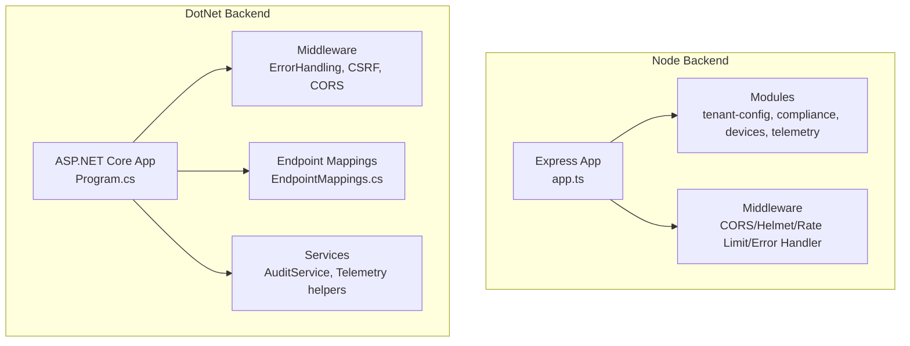

**Diagram sources**
- [app.ts:1-97](file://backend/src/app.ts#L1-L97)
- [Program.cs:1-452](file://backend-dotnet/Program.cs#L1-L452)
- [EndpointMappings.cs:19-1443](file://backend-dotnet/Controllers/EndpointMappings.cs#L19-L1443)

**Section sources**
- [app.ts:1-97](file://backend/src/app.ts#L1-L97)
- [Program.cs:1-452](file://backend-dotnet/Program.cs#L1-L452)

## Core Components
- Response envelope: Both backends standardize on a consistent envelope with success, data, message, and errors. The .NET backend uses a strongly typed record; the Node backend constructs JSON envelopes manually.
- Validation: The Node backend uses Zod for request validation; the .NET backend relies on explicit checks and DTOs.
- Error handling: Centralized error handlers convert exceptions to consistent JSON responses with appropriate HTTP status codes.
- Authentication and authorization: The .NET backend implements bearer token authentication, session validation, and RBAC with permission sets and aliases. The Node backend implements a lightweight rate limiter and passes-through to downstream services for auth.
- Rate limiting: Implemented in both stacks with per-IP windows and limits.
- Tenant awareness: The .NET backend injects tenant/company context into queries and permissions; the Node backend prefixes routes with tenant-specific segments.

**Section sources**
- [ApiResponse.cs:1-8](file://backend-dotnet/DTOs/ApiResponse.cs#L1-L8)
- [tenantConfig.routes.ts:38-55](file://backend/src/modules/tenant-config/tenantConfig.routes.ts#L38-L55)
- [ErrorHandlingMiddleware.cs:6-21](file://backend-dotnet/Middleware/ErrorHandlingMiddleware.cs#L6-L21)
- [errorHandler.ts:1-17](file://backend/src/middleware/errorHandler.ts#L1-L17)
- [Program.cs:101-144](file://backend-dotnet/Program.cs#L101-L144)
- [app.ts:42-72](file://backend/src/app.ts#L42-L72)

## Architecture Overview
The .NET backend’s endpoint mapping centralizes all routes and enforces tenant scoping and permissions. Middleware ensures security headers, CORS, CSRF protection, and global error handling. The Node backend composes modular route groups under a single Express app with shared middleware for security and rate limiting.

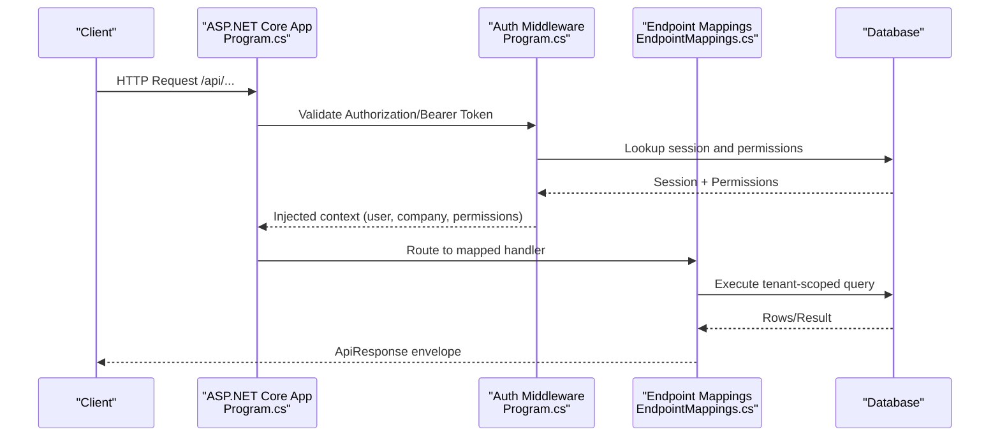

**Diagram sources**
- [Program.cs:101-244](file://backend-dotnet/Program.cs#L101-L244)
- [EndpointMappings.cs:19-1443](file://backend-dotnet/Controllers/EndpointMappings.cs#L19-L1443)

## Detailed Component Analysis

### Response Envelope and Formatting Standards
- The .NET backend defines a generic envelope with Ok/Fail factory methods. Handlers consistently wrap results in this envelope and return appropriate HTTP status codes.
- The Node backend returns similar envelopes for most endpoints, with manual construction in route handlers.

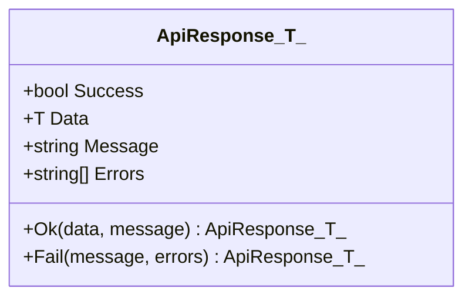

**Diagram sources**
- [ApiResponse.cs:1-8](file://backend-dotnet/DTOs/ApiResponse.cs#L1-L8)

**Section sources**
- [ApiResponse.cs:1-8](file://backend-dotnet/DTOs/ApiResponse.cs#L1-L8)
- [tenantConfig.routes.ts:38-55](file://backend/src/modules/tenant-config/tenantConfig.routes.ts#L38-L55)

### Validation Strategies
- Node backend: Zod schemas validate incoming requests; invalid payloads return 400 with flattened error details.
- DotNet backend: Explicit checks and DTOs; handlers validate presence and types, often delegating to services.

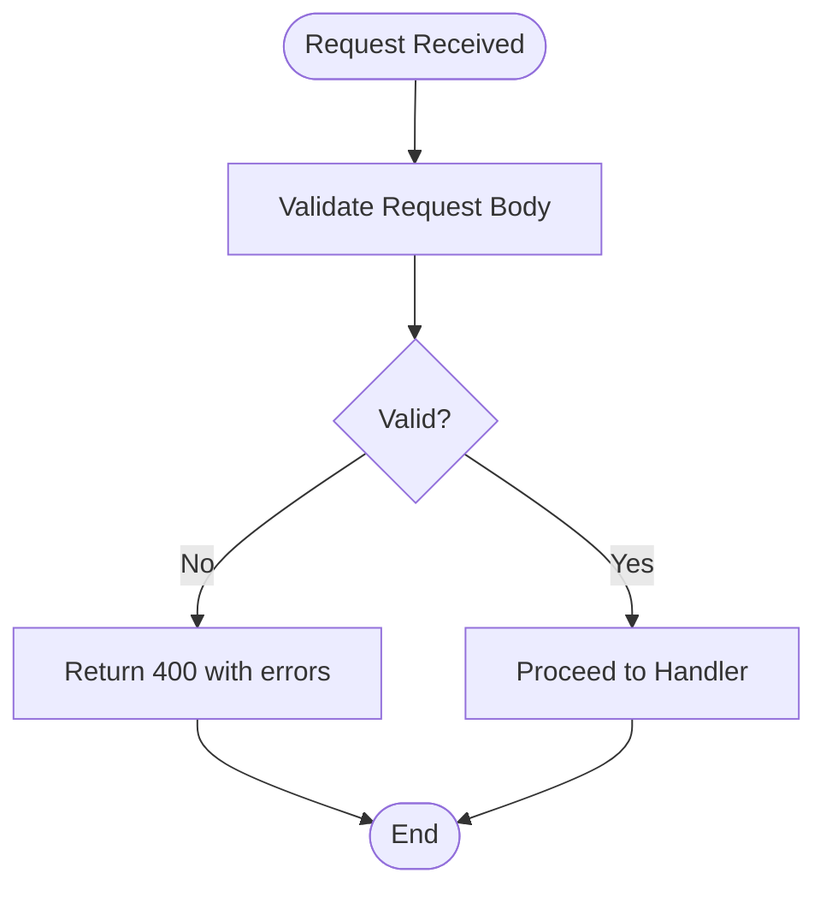

**Diagram sources**
- [tenantConfig.routes.ts:7-47](file://backend/src/modules/tenant-config/tenantConfig.routes.ts#L7-L47)

**Section sources**
- [tenantConfig.routes.ts:7-47](file://backend/src/modules/tenant-config/tenantConfig.routes.ts#L7-L47)

### Error Handling Approaches
- Global error handlers convert unhandled exceptions to consistent JSON with 500 status.
- Node backend: Single middleware catches errors and responds with a unified envelope.
- DotNet backend: Middleware logs and writes standardized error envelopes.

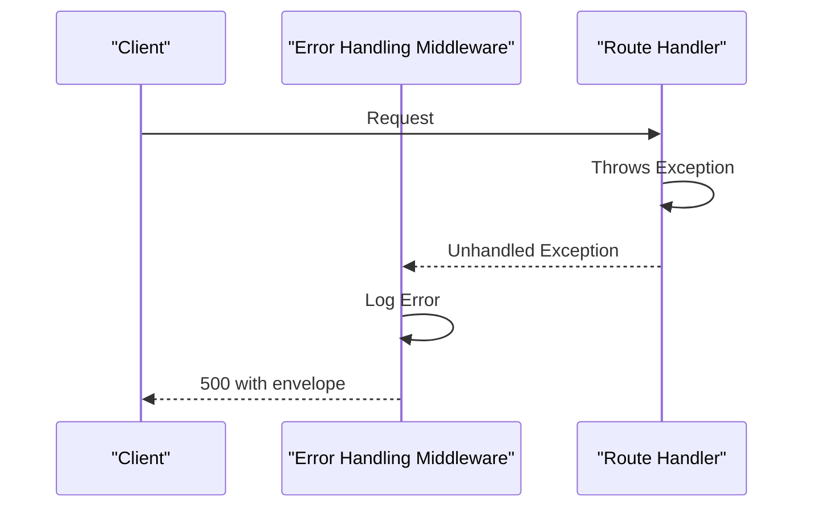

**Diagram sources**
- [ErrorHandlingMiddleware.cs:6-21](file://backend-dotnet/Middleware/ErrorHandlingMiddleware.cs#L6-L21)
- [errorHandler.ts:1-17](file://backend/src/middleware/errorHandler.ts#L1-L17)

**Section sources**
- [ErrorHandlingMiddleware.cs:6-21](file://backend-dotnet/Middleware/ErrorHandlingMiddleware.cs#L6-L21)
- [errorHandler.ts:1-17](file://backend/src/middleware/errorHandler.ts#L1-L17)

### Modular API Organization and Route Grouping
- Node backend: Routes are mounted under logical prefixes (/api/tenant, /api/compliance, /api/devices, /api/industry-modules, /api/telemetry).
- DotNet backend: A single mapper registers endpoints grouped by functional modules (vehicles, drivers, dispatch, safety, maintenance, reporting, etc.), with a generic module handler for extensibility.

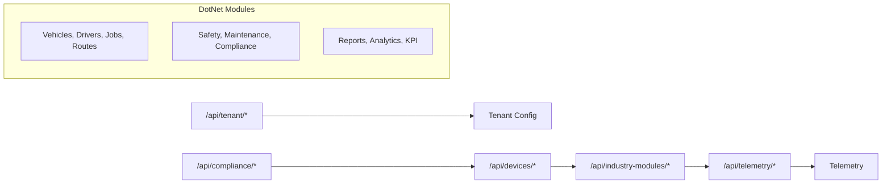

**Diagram sources**
- [app.ts:90-94](file://backend/src/app.ts#L90-L94)
- [EndpointMappings.cs:19-1443](file://backend-dotnet/Controllers/EndpointMappings.cs#L19-L1443)

**Section sources**
- [app.ts:90-94](file://backend/src/app.ts#L90-L94)
- [EndpointMappings.cs:19-1443](file://backend-dotnet/Controllers/EndpointMappings.cs#L19-L1443)

### Tenant-Aware API Patterns and Data Isolation
- DotNet backend enforces tenant scoping server-side in queries and permissions. The company ID is extracted from the authenticated context and injected into SQL.
- Node backend organizes routes under tenant-specific namespaces and uses per-tenant configuration endpoints.

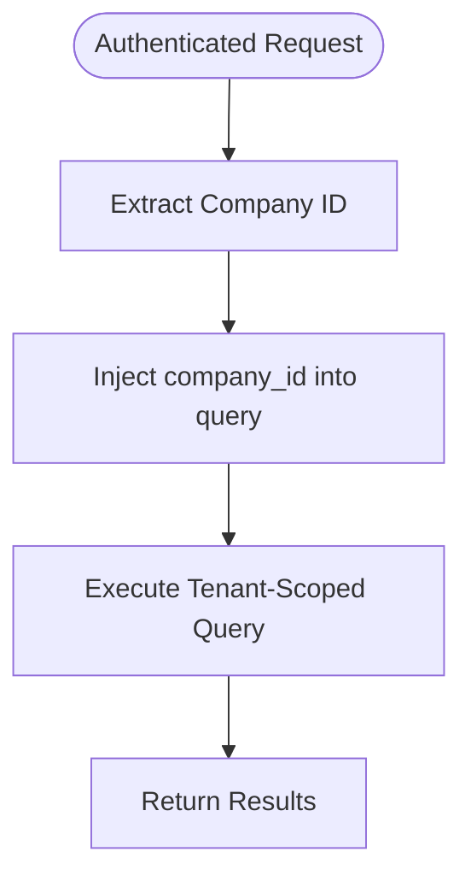

**Diagram sources**
- [EndpointMappings.cs:1531-1535](file://backend-dotnet/Controllers/EndpointMappings.cs#L1531-L1535)

**Section sources**
- [EndpointMappings.cs:1531-1535](file://backend-dotnet/Controllers/EndpointMappings.cs#L1531-L1535)
- [tenantConfig.routes.ts:38-55](file://backend/src/modules/tenant-config/tenantConfig.routes.ts#L38-L55)

### Authentication and Authorization Patterns
- DotNet backend:
  - Bearer token authentication with session lookup and permission resolution.
  - RBAC with permission sets and aliases; wildcard support for super-admin.
  - Dedicated helpers for telemetry stream tickets and HMAC signatures for device ingestion.
- Node backend:
  - Lightweight rate limiting middleware; public endpoints excluded from auth.

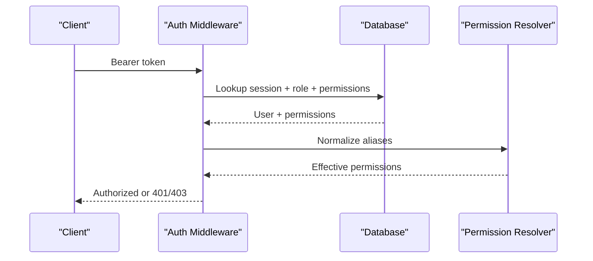

**Diagram sources**
- [Program.cs:190-242](file://backend-dotnet/Program.cs#L190-L242)
- [EndpointMappings.cs:1508-1529](file://backend-dotnet/Controllers/EndpointMappings.cs#L1508-L1529)

**Section sources**
- [Program.cs:190-242](file://backend-dotnet/Program.cs#L190-L242)
- [EndpointMappings.cs:1508-1529](file://backend-dotnet/Controllers/EndpointMappings.cs#L1508-L1529)

### Rate Limiting Patterns
- Both backends implement sliding-window rate limiting keyed by IP address.
- Requests exceeding limits receive a 429 with a standardized envelope.

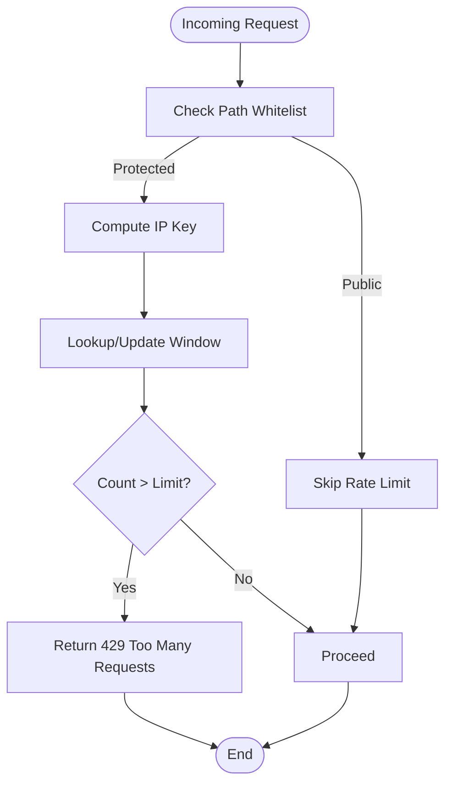

**Diagram sources**
- [app.ts:42-72](file://backend/src/app.ts#L42-L72)
- [Program.cs:105-144](file://backend-dotnet/Program.cs#L105-L144)

**Section sources**
- [app.ts:42-72](file://backend/src/app.ts#L42-L72)
- [Program.cs:105-144](file://backend-dotnet/Program.cs#L105-L144)

### Pagination, Filtering, and Search Patterns
- Reporting engine enforces strict caps on page size and field/filter counts, ensuring safe query construction.
- Filtering uses a whitelist and parameterized conditions to prevent injection.
- Search patterns vary by module; some endpoints accept free-text filters and status-based quick filters.

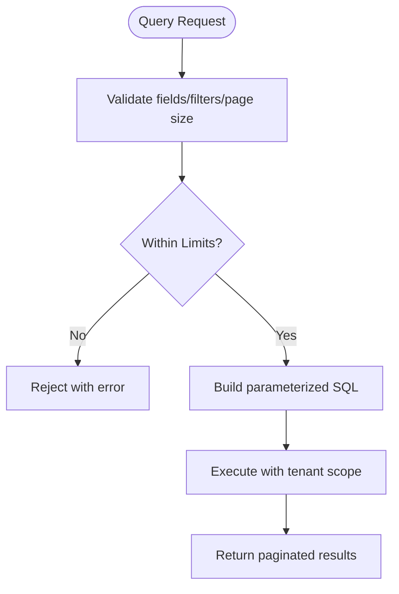

**Diagram sources**
- [ReportingDatasetRegistry.cs:669-730](file://backend-dotnet/Services/ReportingDatasetRegistry.cs#L669-L730)
- [P8ReportingTests.cs:496-566](file://backend-dotnet.Tests/P8ReportingTests.cs#L496-L566)

**Section sources**
- [ReportingDatasetRegistry.cs:669-730](file://backend-dotnet/Services/ReportingDatasetRegistry.cs#L669-L730)
- [P8ReportingTests.cs:496-566](file://backend-dotnet.Tests/P8ReportingTests.cs#L496-L566)

### API Versioning Strategies
- No explicit versioned base paths were observed in the analyzed files. The .NET backend registers endpoints directly under /api without a version segment.
- Recommendation: Introduce versioned base paths (e.g., /api/v1) to enable future breaking changes while maintaining backward compatibility.

[No sources needed since this section provides general guidance]

### Data Ingestion Security (Telemetry)
- Device ingestion uses HMAC-SHA256 signatures over a canonical request string; helpers compute expected signatures and validate bodies.
- SSE live streaming uses short-lived tickets validated via HMAC; tickets encode user/company/expiry and are rejected if missing or expired.

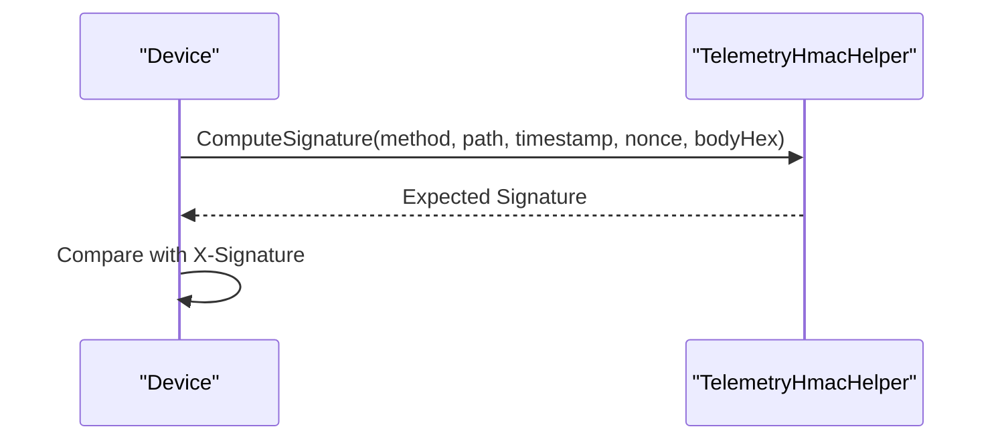

**Diagram sources**
- [TelemetryHmacHelper.cs:5-32](file://backend-dotnet/TelemetryHmacHelper.cs#L5-L32)

**Section sources**
- [TelemetryHmacHelper.cs:5-32](file://backend-dotnet/TelemetryHmacHelper.cs#L5-L32)
- [TelemetryTicketHelper.cs:5-36](file://backend-dotnet/TelemetryTicketHelper.cs#L5-L36)
- [TelemetryKeyStore.cs:5-11](file://backend-dotnet/TelemetryKeyStore.cs#L5-L11)

### Audit Logging
- Audit entries capture actor, action, entity, and optional details. The .NET backend supports both system actors and authenticated users.

**Section sources**
- [AuditService.cs:9-46](file://backend-dotnet/Services/AuditService.cs#L9-L46)

## Dependency Analysis
- Node backend: Express app aggregates modular route handlers and applies shared middleware for security and rate limiting.
- DotNet backend: Static endpoint mapper wires hundreds of endpoints, with middleware enforcing auth, permissions, and error handling.

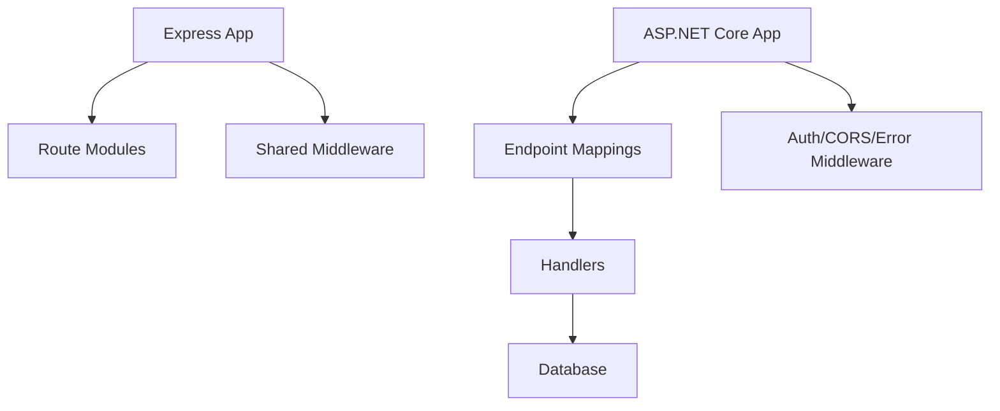

**Diagram sources**
- [app.ts:16-96](file://backend/src/app.ts#L16-L96)
- [Program.cs:101-102](file://backend-dotnet/Program.cs#L101-L102)
- [EndpointMappings.cs:19-1443](file://backend-dotnet/Controllers/EndpointMappings.cs#L19-L1443)

**Section sources**
- [app.ts:16-96](file://backend/src/app.ts#L16-L96)
- [Program.cs:101-102](file://backend-dotnet/Program.cs#L101-L102)
- [EndpointMappings.cs:19-1443](file://backend-dotnet/Controllers/EndpointMappings.cs#L19-L1443)

## Performance Considerations
- Prefer parameterized queries and tenant scoping to avoid N+1 and reduce risk.
- Apply pagination caps and enforce field/filter limits to protect the database.
- Use streaming for telemetry where applicable to minimize memory overhead.
- Centralize validation close to the edge to fail fast and reduce unnecessary processing.

[No sources needed since this section provides general guidance]

## Troubleshooting Guide
- 401 Unauthorized: Missing or invalid bearer token; verify token issuance and expiration.
- 403 Forbidden: Insufficient permissions; confirm role and permission aliases.
- 429 Too Many Requests: Rate limit exceeded; adjust client retry or increase window/limit.
- 500 Internal Server Error: Unhandled exception; check logs and error handler output.

**Section sources**
- [Program.cs:174-207](file://backend-dotnet/Program.cs#L174-L207)
- [EndpointMappings.cs:1516-1529](file://backend-dotnet/Controllers/EndpointMappings.cs#L1516-L1529)
- [app.ts:63-69](file://backend/src/app.ts#L63-L69)
- [ErrorHandlingMiddleware.cs:14-20](file://backend-dotnet/Middleware/ErrorHandlingMiddleware.cs#L14-L20)

## Conclusion
Both backend implementations adhere to consistent REST patterns, standardized response envelopes, and robust security controls. The .NET backend’s centralized endpoint mapping and strong RBAC provide a scalable foundation for modular APIs, while the Node backend offers a simpler, modular composition. Adopting versioned base paths and stricter pagination limits would further improve maintainability and resilience.

## Appendices
- Example endpoints:
  - GET /api/vehicles, GET /api/vehicles/{id}, POST /api/vehicles
  - GET /api/telemetry/ingest, GET /api/telemetry/stream
  - POST /api/auth/login
  - GET /api/reports/datasets, POST /api/reports/run

[No sources needed since this section provides general guidance]