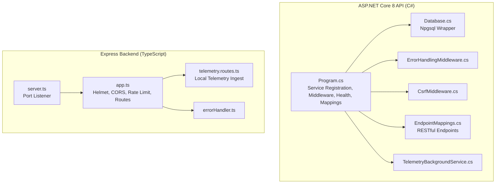
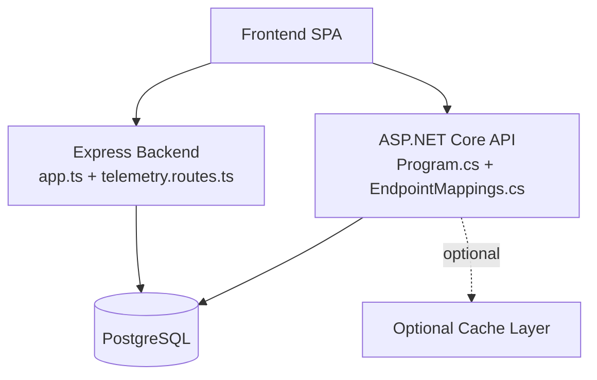
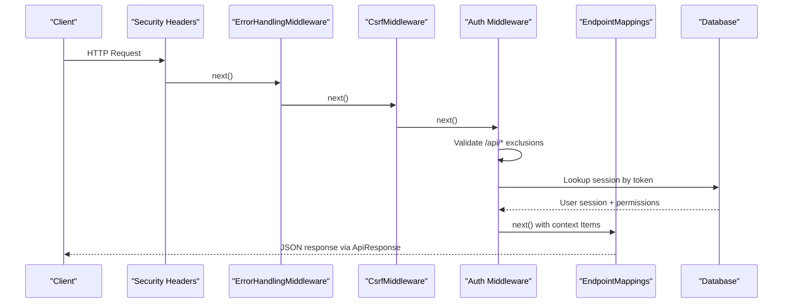
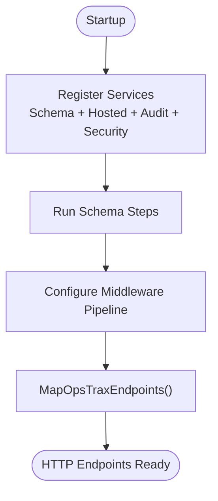
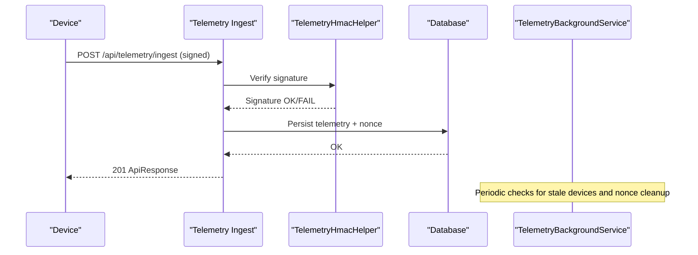
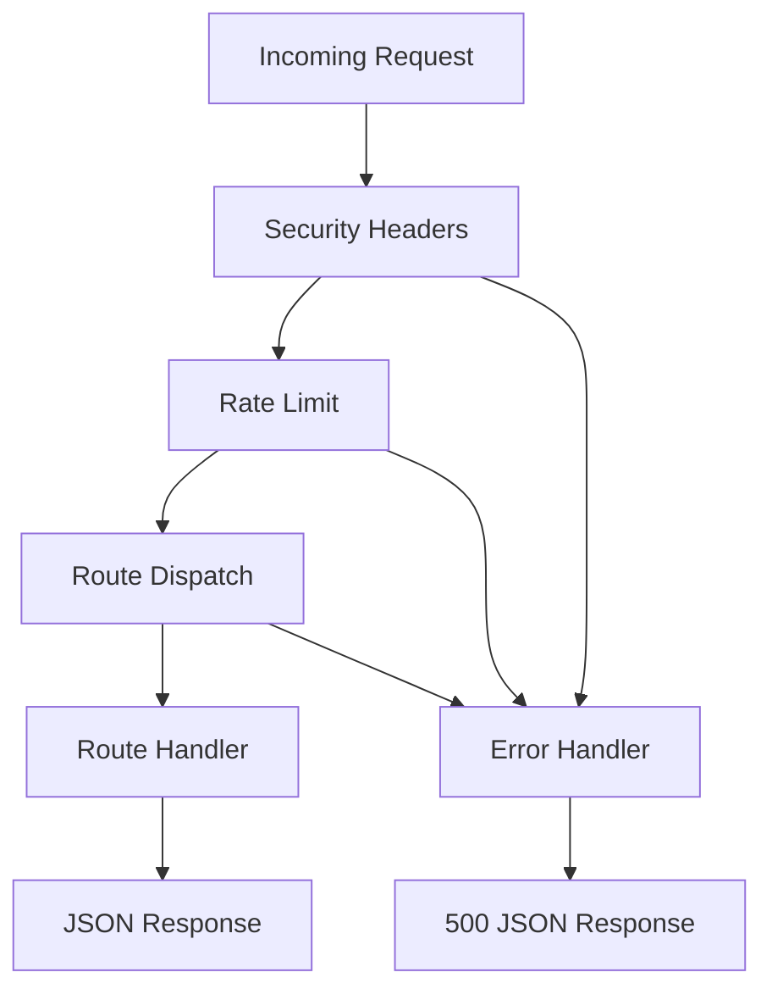
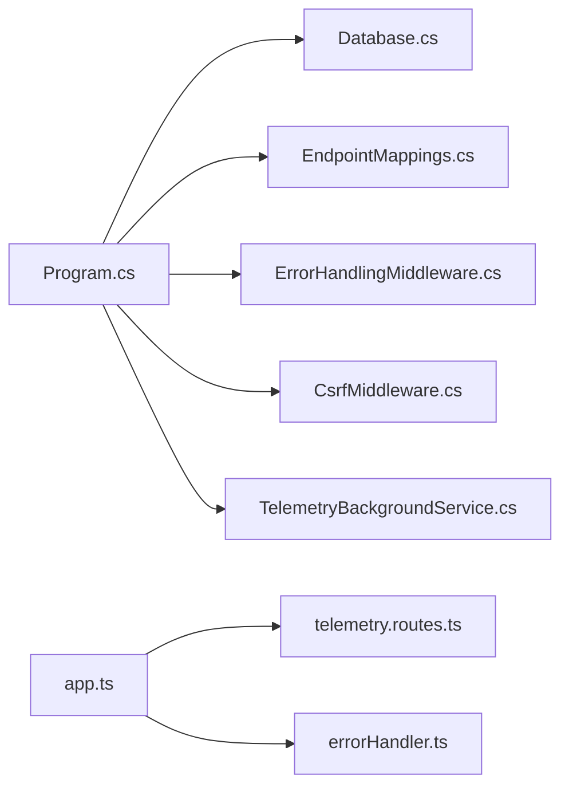

# Backend Architecture

<cite>
**Referenced Files in This Document**
- [Program.cs](file://api-dotnet/Program.cs)
- [Program.cs](file://backend-dotnet/Program.cs)
- [EndpointMappings.cs](file://backend-dotnet/Controllers/EndpointMappings.cs)
- [ErrorHandlingMiddleware.cs](file://backend-dotnet/Middleware/ErrorHandlingMiddleware.cs)
- [CsrfMiddleware.cs](file://backend-dotnet/Middleware/CsrfMiddleware.cs)
- [Database.cs](file://backend-dotnet/Data/Database.cs)
- [ApiResponse.cs](file://backend-dotnet/DTOs/ApiResponse.cs)
- [TelemetryBackgroundService.cs](file://backend-dotnet/Services/TelemetryBackgroundService.cs)
- [TelemetryHmacHelper.cs](file://backend-dotnet/TelemetryHmacHelper.cs)
- [TelemetryKeyStore.cs](file://backend-dotnet/TelemetryKeyStore.cs)
- [app.ts](file://backend/src/app.ts)
- [server.ts](file://backend/src/server.ts)
- [errorHandler.ts](file://backend/src/middleware/errorHandler.ts)
- [telemetry.routes.ts](file://backend/src/modules/telemetry/telemetry.routes.ts)
</cite>

## Table of Contents
1. [Introduction](#introduction)
2. [Project Structure](#project-structure)
3. [Core Components](#core-components)
4. [Architecture Overview](#architecture-overview)
5. [Detailed Component Analysis](#detailed-component-analysis)
6. [Dependency Analysis](#dependency-analysis)
7. [Performance Considerations](#performance-considerations)
8. [Troubleshooting Guide](#troubleshooting-guide)
9. [Conclusion](#conclusion)

## Introduction
This document describes the dual-backend architecture of OpsTrax, focusing on the ASP.NET Core 8 API and the Node.js Express backend. It explains dependency injection, middleware pipelines, service registration, modular service organization, controller patterns, business logic layering, authentication and authorization, error handling, real-time event streaming, and background services. It also covers API design principles, RESTful endpoint organization, request/response handling patterns, and cross-cutting concerns such as rate limiting, CORS, CSRF protection, and telemetry security.

## Project Structure
The repository implements a dual-backend system:
- ASP.NET Core 8 API (C#): Centralized endpoint mapping, middleware, authentication, authorization, and background services.
- Node.js Express backend (TypeScript): Lightweight telemetry ingestion and local telemetry routes; integrates with the broader platform via shared APIs and event streams.

**Diagram sources**
- [Program.cs:1-452](file://backend-dotnet/Program.cs#L1-L452)
- [Database.cs:1-86](file://backend-dotnet/Data/Database.cs#L1-L86)
- [ErrorHandlingMiddleware.cs:1-22](file://backend-dotnet/Middleware/ErrorHandlingMiddleware.cs#L1-L22)
- [CsrfMiddleware.cs:1-62](file://backend-dotnet/Middleware/CsrfMiddleware.cs#L1-L62)
- [EndpointMappings.cs:1-800](file://backend-dotnet/Controllers/EndpointMappings.cs#L1-L800)
- [TelemetryBackgroundService.cs:1-103](file://backend-dotnet/Services/TelemetryBackgroundService.cs#L1-L103)
- [app.ts:1-97](file://backend/src/app.ts#L1-L97)
- [server.ts:1-11](file://backend/src/server.ts#L1-L11)
- [telemetry.routes.ts:1-59](file://backend/src/modules/telemetry/telemetry.routes.ts#L1-L59)
- [errorHandler.ts:1-17](file://backend/src/middleware/errorHandler.ts#L1-L17)

**Section sources**
- [Program.cs:1-452](file://backend-dotnet/Program.cs#L1-L452)
- [app.ts:1-97](file://backend/src/app.ts#L1-L97)

## Core Components
- ASP.NET Core 8 API
  - Service registration for schema services, hosted services, audit, notification, and security services.
  - Centralized endpoint mapping via a single extension method that wires hundreds of REST endpoints.
  - Authentication middleware validating bearer tokens and populating context items with user identity and permissions.
  - CSRF protection middleware for state-changing requests.
  - Error handling middleware catching unhandled exceptions.
  - Health endpoints (/health, /ready, /health/deep) with deep diagnostics.
  - Real-time telemetry streaming with short-lived stream tickets and device-signed ingest.
- Node.js Express backend
  - Helmet, CORS, rate limiting, and logging middleware.
  - Local telemetry ingestion route and vehicle-specific retrieval.
  - Centralized error handler.

**Section sources**
- [Program.cs:10-90](file://backend-dotnet/Program.cs#L10-L90)
- [EndpointMappings.cs:19-800](file://backend-dotnet/Controllers/EndpointMappings.cs#L19-L800)
- [ErrorHandlingMiddleware.cs:1-22](file://backend-dotnet/Middleware/ErrorHandlingMiddleware.cs#L1-L22)
- [CsrfMiddleware.cs:1-62](file://backend-dotnet/Middleware/CsrfMiddleware.cs#L1-L62)
- [app.ts:16-97](file://backend/src/app.ts#L16-L97)
- [telemetry.routes.ts:1-59](file://backend/src/modules/telemetry/telemetry.routes.ts#L1-L59)

## Architecture Overview
The system separates concerns across two backends:
- C# API: Full-featured, production-grade API with robust middleware, RBAC, audit logs, background services, and comprehensive endpoint coverage.
- Node.js backend: Lightweight telemetry ingestion and local queries, suitable for rapid prototyping or isolated telemetry tasks.

**Diagram sources**
- [Program.cs:1-452](file://backend-dotnet/Program.cs#L1-L452)
- [EndpointMappings.cs:19-800](file://backend-dotnet/Controllers/EndpointMappings.cs#L19-L800)
- [app.ts:1-97](file://backend/src/app.ts#L1-L97)
- [telemetry.routes.ts:1-59](file://backend/src/modules/telemetry/telemetry.routes.ts#L1-L59)

## Detailed Component Analysis

### ASP.NET Core 8 API: Middleware Pipeline and Authentication
The middleware pipeline enforces security headers, error handling, CSRF protection, CORS, and per-request rate limiting. It authenticates session-bound requests via bearer tokens and populates context items with user identity and permissions. Special handling allows public endpoints and telemetry stream tickets.

**Diagram sources**
- [Program.cs:92-245](file://backend-dotnet/Program.cs#L92-L245)
- [ErrorHandlingMiddleware.cs:1-22](file://backend-dotnet/Middleware/ErrorHandlingMiddleware.cs#L1-L22)
- [CsrfMiddleware.cs:1-62](file://backend-dotnet/Middleware/CsrfMiddleware.cs#L1-L62)
- [EndpointMappings.cs:19-800](file://backend-dotnet/Controllers/EndpointMappings.cs#L19-L800)
- [Database.cs:1-86](file://backend-dotnet/Data/Database.cs#L1-L86)
- [ApiResponse.cs:1-8](file://backend-dotnet/DTOs/ApiResponse.cs#L1-L8)

**Section sources**
- [Program.cs:92-245](file://backend-dotnet/Program.cs#L92-L245)
- [ErrorHandlingMiddleware.cs:1-22](file://backend-dotnet/Middleware/ErrorHandlingMiddleware.cs#L1-L22)
- [CsrfMiddleware.cs:1-62](file://backend-dotnet/Middleware/CsrfMiddleware.cs#L1-L62)
- [Database.cs:1-86](file://backend-dotnet/Data/Database.cs#L1-L86)
- [ApiResponse.cs:1-8](file://backend-dotnet/DTOs/ApiResponse.cs#L1-L8)

### Endpoint Organization and Controller Patterns
Endpoints are mapped centrally via a single extension method that registers hundreds of routes across modules (vehicles, drivers, dispatch, telemetry, safety, maintenance, compliance, etc.). Many routes delegate to helper functions that enforce RBAC and permissions, ensuring tenant scoping and audit logging.

**Diagram sources**
- [Program.cs:10-90](file://backend-dotnet/Program.cs#L10-L90)
- [EndpointMappings.cs:19-800](file://backend-dotnet/Controllers/EndpointMappings.cs#L19-L800)

**Section sources**
- [Program.cs:10-90](file://backend-dotnet/Program.cs#L10-L90)
- [EndpointMappings.cs:19-800](file://backend-dotnet/Controllers/EndpointMappings.cs#L19-L800)

### Real-Time Telemetry Streaming and Device Authentication
The API supports:
- Device-authenticated telemetry ingest using HMAC-SHA256 signatures.
- Short-lived stream tickets for Server-Sent Events (SSE) to avoid exposing long-lived session tokens in URLs.
- Background service monitoring for stale devices and nonce pruning.

**Diagram sources**
- [Program.cs:118-172](file://backend-dotnet/Program.cs#L118-L172)
- [TelemetryHmacHelper.cs:1-33](file://backend-dotnet/TelemetryHmacHelper.cs#L1-L33)
- [TelemetryBackgroundService.cs:1-103](file://backend-dotnet/Services/TelemetryBackgroundService.cs#L1-L103)

**Section sources**
- [Program.cs:118-172](file://backend-dotnet/Program.cs#L118-L172)
- [TelemetryHmacHelper.cs:1-33](file://backend-dotnet/TelemetryHmacHelper.cs#L1-L33)
- [TelemetryBackgroundService.cs:1-103](file://backend-dotnet/Services/TelemetryBackgroundService.cs#L1-L103)

### Node.js Express Backend: Telemetry Ingestion and Routes
The Express backend provides lightweight telemetry ingestion and retrieval endpoints. It applies rate limiting, security headers, and centralized error handling.

**Diagram sources**
- [app.ts:25-72](file://backend/src/app.ts#L25-L72)
- [telemetry.routes.ts:1-59](file://backend/src/modules/telemetry/telemetry.routes.ts#L1-L59)
- [errorHandler.ts:1-17](file://backend/src/middleware/errorHandler.ts#L1-L17)

**Section sources**
- [app.ts:16-97](file://backend/src/app.ts#L16-L97)
- [telemetry.routes.ts:1-59](file://backend/src/modules/telemetry/telemetry.routes.ts#L1-L59)
- [errorHandler.ts:1-17](file://backend/src/middleware/errorHandler.ts#L1-L17)

### API Design Principles and Response Pattern
- Consistent JSON envelope via a typed response wrapper.
- Standardized HTTP status codes and error payloads.
- RBAC gating on sensitive endpoints; tenant scoping enforced in queries.
- Public endpoints for customer-facing tracking and health probes.

**Section sources**
- [ApiResponse.cs:1-8](file://backend-dotnet/DTOs/ApiResponse.cs#L1-L8)
- [EndpointMappings.cs:254-290](file://backend-dotnet/Controllers/EndpointMappings.cs#L254-L290)
- [Program.cs:257-294](file://backend-dotnet/Program.cs#L257-L294)

### Cross-Cutting Concerns
- Security headers applied globally.
- CSRF protection for state-changing requests.
- CORS policy configurable via environment.
- Rate limiting per IP for API routes.
- Health endpoints for Kubernetes probes.

**Section sources**
- [Program.cs:92-103](file://backend-dotnet/Program.cs#L92-L103)
- [CsrfMiddleware.cs:1-62](file://backend-dotnet/Middleware/CsrfMiddleware.cs#L1-L62)
- [app.ts:25-40](file://backend/src/app.ts#L25-L40)

## Dependency Analysis
The C# API composes a cohesive set of services and middleware. The Express backend depends on minimal middleware and local route handlers.

**Diagram sources**
- [Program.cs:1-452](file://backend-dotnet/Program.cs#L1-L452)
- [Database.cs:1-86](file://backend-dotnet/Data/Database.cs#L1-L86)
- [EndpointMappings.cs:19-800](file://backend-dotnet/Controllers/EndpointMappings.cs#L19-L800)
- [ErrorHandlingMiddleware.cs:1-22](file://backend-dotnet/Middleware/ErrorHandlingMiddleware.cs#L1-L22)
- [CsrfMiddleware.cs:1-62](file://backend-dotnet/Middleware/CsrfMiddleware.cs#L1-L62)
- [TelemetryBackgroundService.cs:1-103](file://backend-dotnet/Services/TelemetryBackgroundService.cs#L1-L103)
- [app.ts:1-97](file://backend/src/app.ts#L1-L97)
- [telemetry.routes.ts:1-59](file://backend/src/modules/telemetry/telemetry.routes.ts#L1-L59)
- [errorHandler.ts:1-17](file://backend/src/middleware/errorHandler.ts#L1-L17)

**Section sources**
- [Program.cs:1-452](file://backend-dotnet/Program.cs#L1-L452)
- [app.ts:1-97](file://backend/src/app.ts#L1-L97)

## Performance Considerations
- Connection pooling and scoped database access reduce overhead.
- Background services operate independently at fixed intervals to offload real-time processing.
- Rate limiting prevents abuse and stabilizes throughput.
- Consider adding read replicas for heavy read workloads and caching for frequently accessed metadata.
- Compress responses and enable gzip where appropriate.

[No sources needed since this section provides general guidance]

## Troubleshooting Guide
- Unhandled exceptions are caught by the error handling middleware and returned as standardized JSON.
- CSRF validation failures return 403 with a descriptive message.
- Session validation failures return 401; ensure bearer tokens are present and not expired.
- Health endpoints help diagnose database connectivity and service heartbeats.
- Express backend errors are logged and returned as 500 JSON.

**Section sources**
- [ErrorHandlingMiddleware.cs:1-22](file://backend-dotnet/Middleware/ErrorHandlingMiddleware.cs#L1-L22)
- [CsrfMiddleware.cs:1-62](file://backend-dotnet/Middleware/CsrfMiddleware.cs#L1-L62)
- [Program.cs:174-207](file://backend-dotnet/Program.cs#L174-L207)
- [Program.cs:257-294](file://backend-dotnet/Program.cs#L257-L294)
- [errorHandler.ts:1-17](file://backend/src/middleware/errorHandler.ts#L1-L17)

## Conclusion
OpsTrax employs a dual-backend strategy: a robust ASP.NET Core 8 API for enterprise-grade orchestration, security, and business logic, and a lightweight Node.js Express backend for telemetry ingestion and local routes. Together, they provide a scalable, maintainable, and secure foundation for the transport management platform, with strong middleware-driven cross-cutting concerns, comprehensive endpoint coverage, and real-time capabilities.