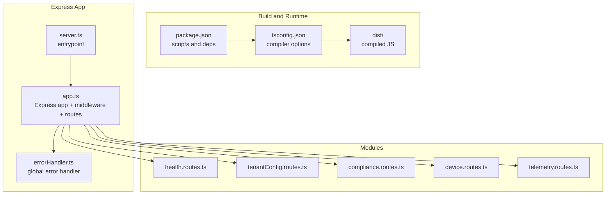
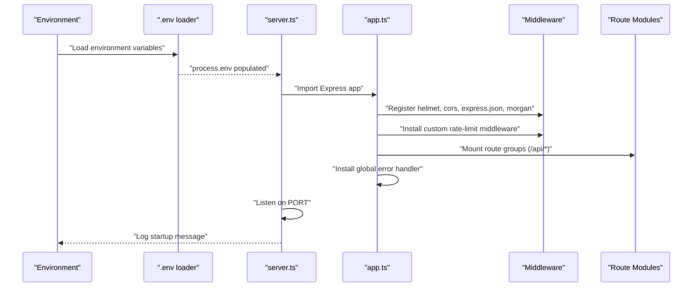
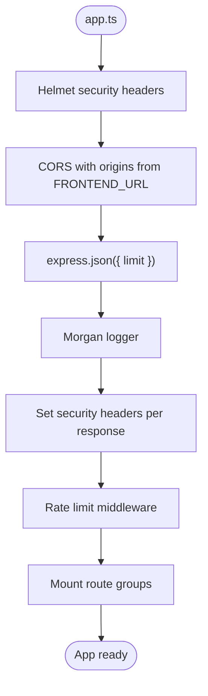
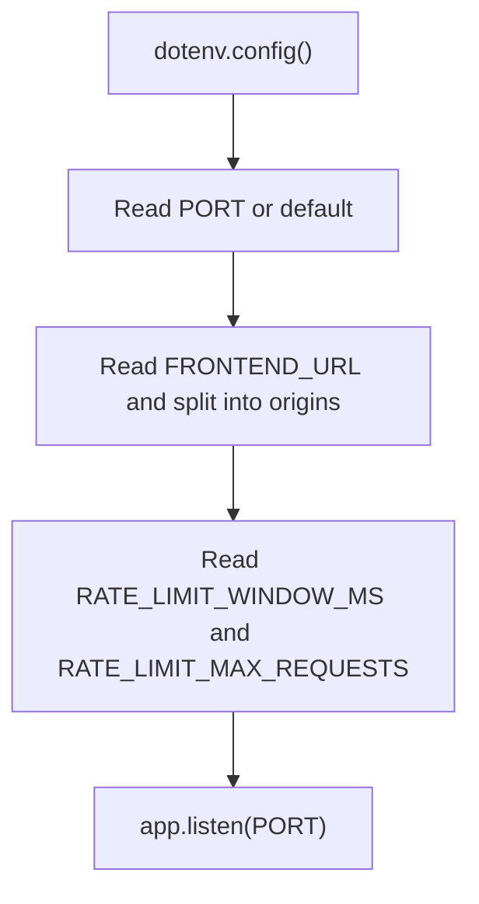
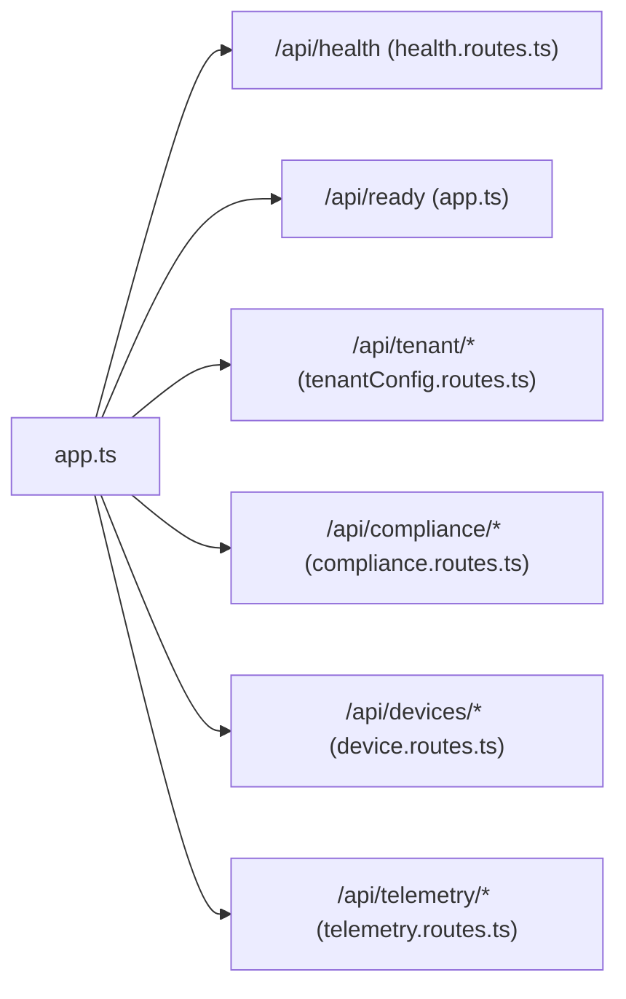
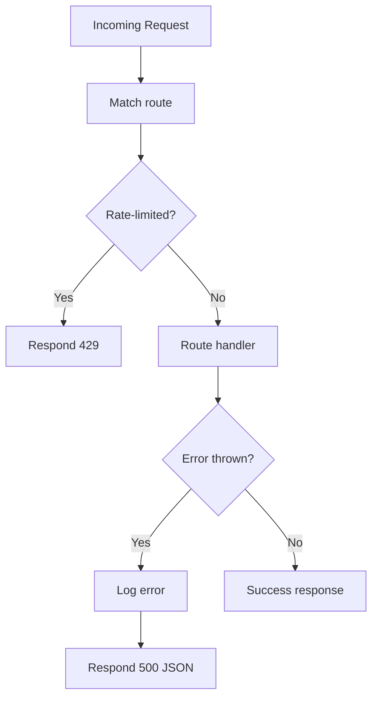
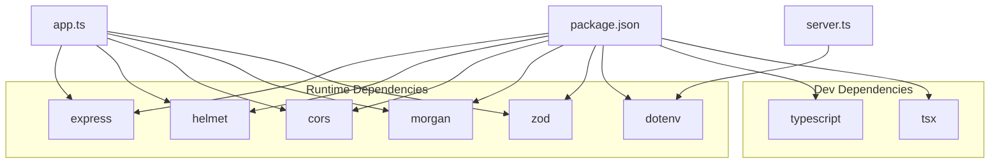

# Application Initialization

<cite>
**Referenced Files in This Document**
- [package.json](file://backend/package.json)
- [tsconfig.json](file://backend/tsconfig.json)
- [server.ts](file://backend/src/server.ts)
- [app.ts](file://backend/src/app.ts)
- [errorHandler.ts](file://backend/src/middleware/errorHandler.ts)
- [health.routes.ts](file://backend/src/modules/health/health.routes.ts)
- [tenantConfig.routes.ts](file://backend/src/modules/tenant-config/tenantConfig.routes.ts)
- [tenantConfig.service.ts](file://backend/src/modules/tenant-config/tenantConfig.service.ts)
- [compliance.routes.ts](file://backend/src/modules/compliance/compliance.routes.ts)
- [compliance.registry.ts](file://backend/src/modules/compliance/compliance.registry.ts)
- [device.routes.ts](file://backend/src/modules/devices/device.routes.ts)
- [telemetry.routes.ts](file://backend/src/modules/telemetry/telemetry.routes.ts)
</cite>

## Table of Contents
1. [Introduction](#introduction)
2. [Project Structure](#project-structure)
3. [Core Components](#core-components)
4. [Architecture Overview](#architecture-overview)
5. [Detailed Component Analysis](#detailed-component-analysis)
6. [Dependency Analysis](#dependency-analysis)
7. [Performance Considerations](#performance-considerations)
8. [Troubleshooting Guide](#troubleshooting-guide)
9. [Conclusion](#conclusion)
10. [Appendices](#appendices)

## Introduction
This document explains the Node.js Express application initialization process for the backend service. It covers the server startup sequence, application configuration, environment variable handling, Express app setup, middleware registration, routing, port configuration, TypeScript compilation and build process, development versus production configurations, application lifecycle, graceful shutdown procedures, error handling during initialization, configuration management, logging setup, and debugging capabilities.

## Project Structure
The backend is organized around a small but representative Express application with modular route groups and centralized middleware. The build pipeline compiles TypeScript to CommonJS, and the runtime is controlled via npm scripts.

**Diagram sources**
- [package.json:1-39](file://backend/package.json#L1-L39)
- [tsconfig.json:1-16](file://backend/tsconfig.json#L1-L16)
- [server.ts:1-11](file://backend/src/server.ts#L1-L11)
- [app.ts:1-97](file://backend/src/app.ts#L1-L97)
- [errorHandler.ts:1-17](file://backend/src/middleware/errorHandler.ts#L1-L17)
- [health.routes.ts:1-19](file://backend/src/modules/health/health.routes.ts#L1-L19)
- [tenantConfig.routes.ts:1-58](file://backend/src/modules/tenant-config/tenantConfig.routes.ts#L1-L58)
- [compliance.routes.ts:1-24](file://backend/src/modules/compliance/compliance.routes.ts#L1-L24)
- [device.routes.ts:1-46](file://backend/src/modules/devices/device.routes.ts#L1-L46)
- [telemetry.routes.ts:1-59](file://backend/src/modules/telemetry/telemetry.routes.ts#L1-L59)

**Section sources**
- [package.json:1-39](file://backend/package.json#L1-L39)
- [tsconfig.json:1-16](file://backend/tsconfig.json#L1-L16)

## Core Components
- Express application creation and configuration in app.ts
- Environment-driven middleware and route registration
- Centralized error handling
- Health endpoint and readiness probe
- Modular route groups for compliance, devices, telemetry, tenant configuration, and industry modules

Key responsibilities:
- app.ts initializes Express, registers middleware, defines rate limiting, mounts route groups, and installs the global error handler.
- server.ts loads environment variables and starts the HTTP server on the configured port.
- errorHandler.ts centralizes error logging and response formatting.
- Routes under modules define domain-specific endpoints.

**Section sources**
- [app.ts:1-97](file://backend/src/app.ts#L1-L97)
- [server.ts:1-11](file://backend/src/server.ts#L1-L11)
- [errorHandler.ts:1-17](file://backend/src/middleware/errorHandler.ts#L1-L17)

## Architecture Overview
The initialization flow begins with loading environment variables, constructing the Express app with middleware and routes, and listening on a configured port. The app exposes health and readiness endpoints and integrates domain modules via mounted routers.

**Diagram sources**
- [server.ts:1-11](file://backend/src/server.ts#L1-L11)
- [app.ts:1-97](file://backend/src/app.ts#L1-L97)

## Detailed Component Analysis

### Express App Setup and Middleware Registration
The Express app is created and configured with:
- Security headers via helmet
- CORS policy driven by FRONTEND_URL
- JSON body parsing with a 5 MB limit
- Morgan logging in development mode
- Custom security headers set per request
- A rate-limiting middleware for API paths with tunable window and max requests
- Mounted route groups for health, tenant configuration, compliance, devices, industry modules, and telemetry
- A global error handler

**Diagram sources**
- [app.ts:25-96](file://backend/src/app.ts#L25-L96)

**Section sources**
- [app.ts:1-97](file://backend/src/app.ts#L1-L97)

### Environment Variable Handling and Port Configuration
- Environment variables are loaded using dotenv before the server starts.
- PORT determines the listening port with a default fallback.
- FRONTEND_URL configures allowed CORS origins.
- RATE_LIMIT_WINDOW_MS and RATE_LIMIT_MAX_REQUESTS tune the rate limiter.

**Diagram sources**
- [server.ts:4-10](file://backend/src/server.ts#L4-L10)
- [app.ts:18-23](file://backend/src/app.ts#L18-L23)

**Section sources**
- [server.ts:1-11](file://backend/src/server.ts#L1-L11)
- [app.ts:18-23](file://backend/src/app.ts#L18-L23)

### Routing and Domain Modules
- Health: GET /api/health returns service health; GET /api/ready returns readiness status.
- Tenant configuration: POST /api/tenant/configure validates input with Zod and builds a runtime configuration.
- Compliance: GET /api/compliance/packs and GET /api/compliance/packs/:countryCode return compliance packs.
- Devices: GET /api/devices/types and POST /api/devices/register handle device metadata and registration.
- Telemetry: POST /api/telemetry/ingest ingests events and generates alerts; GET /api/telemetry/vehicle/:vehicleId lists events.

**Diagram sources**
- [app.ts:74-94](file://backend/src/app.ts#L74-L94)
- [health.routes.ts:1-19](file://backend/src/modules/health/health.routes.ts#L1-L19)
- [tenantConfig.routes.ts:1-58](file://backend/src/modules/tenant-config/tenantConfig.routes.ts#L1-L58)
- [compliance.routes.ts:1-24](file://backend/src/modules/compliance/compliance.routes.ts#L1-L24)
- [device.routes.ts:1-46](file://backend/src/modules/devices/device.routes.ts#L1-L46)
- [telemetry.routes.ts:1-59](file://backend/src/modules/telemetry/telemetry.routes.ts#L1-L59)

**Section sources**
- [app.ts:74-94](file://backend/src/app.ts#L74-L94)
- [health.routes.ts:1-19](file://backend/src/modules/health/health.routes.ts#L1-L19)
- [tenantConfig.routes.ts:1-58](file://backend/src/modules/tenant-config/tenantConfig.routes.ts#L1-L58)
- [compliance.routes.ts:1-24](file://backend/src/modules/compliance/compliance.routes.ts#L1-L24)
- [device.routes.ts:1-46](file://backend/src/modules/devices/device.routes.ts#L1-L46)
- [telemetry.routes.ts:1-59](file://backend/src/modules/telemetry/telemetry.routes.ts#L1-L59)

### Error Handling During Initialization
- A global error handler logs unexpected errors and responds with a standardized 500 JSON payload.
- The rate-limiting middleware returns 429 for excessive requests, preventing resource exhaustion.

**Diagram sources**
- [app.ts:42-72](file://backend/src/app.ts#L42-L72)
- [errorHandler.ts:3-16](file://backend/src/middleware/errorHandler.ts#L3-L16)

**Section sources**
- [app.ts:42-72](file://backend/src/app.ts#L42-L72)
- [errorHandler.ts:1-17](file://backend/src/middleware/errorHandler.ts#L1-L17)

### Configuration Management and Logging
- Configuration is environment-driven:
  - PORT for the server port
  - FRONTEND_URL for CORS origins
  - RATE_LIMIT_WINDOW_MS and RATE_LIMIT_MAX_REQUESTS for rate limiting
- Logging:
  - Morgan logs in development mode
  - Global error handler logs errors with request context

**Section sources**
- [server.ts:6](file://backend/src/server.ts#L6)
- [app.ts:18-23](file://backend/src/app.ts#L18-L23)
- [app.ts:32](file://backend/src/app.ts#L32)
- [errorHandler.ts:9](file://backend/src/middleware/errorHandler.ts#L9)

### Debugging Capabilities
- Development script runs the TypeScript entrypoint with automatic restarts.
- Type checking is available via a dedicated script.
- Logging provides request-level visibility for diagnostics.

**Section sources**
- [package.json:6-11](file://backend/package.json#L6-L11)
- [app.ts:32](file://backend/src/app.ts#L32)

## Dependency Analysis
The backend depends on Express, helmet, cors, morgan, zod, and dotenv. Development-time tooling includes TypeScript and tsx. The build compiles to CommonJS with strict checks.

**Diagram sources**
- [package.json:22-37](file://backend/package.json#L22-L37)
- [app.ts:1-14](file://backend/src/app.ts#L1-L14)
- [server.ts:1](file://backend/src/server.ts#L1)

**Section sources**
- [package.json:22-37](file://backend/package.json#L22-L37)

## Performance Considerations
- Rate limiting is applied to API paths excluding specific endpoints, controlling burst traffic.
- JSON body parsing has an upper bound to prevent oversized payloads.
- Security middleware reduces attack surface and enforces safe defaults.
- Consider externalizing rate limits to a shared store for multi-instance deployments.

[No sources needed since this section provides general guidance]

## Troubleshooting Guide
- If the server does not start, verify PORT availability and environment loading.
- If CORS fails, confirm FRONTEND_URL contains the correct origin(s).
- If rate limiting triggers unexpectedly, adjust RATE_LIMIT_WINDOW_MS and RATE_LIMIT_MAX_REQUESTS.
- For unhandled exceptions, inspect the global error handler logs and stack traces.

**Section sources**
- [server.ts:6](file://backend/src/server.ts#L6)
- [app.ts:18-23](file://backend/src/app.ts#L18-L23)
- [errorHandler.ts:9](file://backend/src/middleware/errorHandler.ts#L9)

## Conclusion
The backend initialization process is straightforward and environment-driven. It establishes a secure, logged, and rate-limited Express application, mounts domain-specific routes, and exposes health and readiness endpoints. The build and dev toolchain are standard for a TypeScript/Node.js project, enabling efficient development and reliable production deployment.

[No sources needed since this section summarizes without analyzing specific files]

## Appendices

### Build and Run Commands
- Development: watches TypeScript files and restarts on changes.
- Build: compiles TypeScript to CommonJS.
- Start: runs the compiled server.
- Typecheck: validates types without emitting JavaScript.

**Section sources**
- [package.json:6-11](file://backend/package.json#L6-L11)

### TypeScript Compilation Settings
- Target: ES2020
- Module: CommonJS
- Root and output directories: src and dist respectively
- Strictness and interop: enabled
- Library and resolution: skipped checks and Node resolution

**Section sources**
- [tsconfig.json:2-12](file://backend/tsconfig.json#L2-L12)

### Application Lifecycle and Shutdown
- Startup: load environment, create app, mount middleware and routes, listen on port.
- Shutdown: none implemented in current code; consider adding SIGTERM/SIGINT handlers for graceful termination.

**Section sources**
- [server.ts:4-10](file://backend/src/server.ts#L4-L10)
- [app.ts:16](file://backend/src/app.ts#L16)