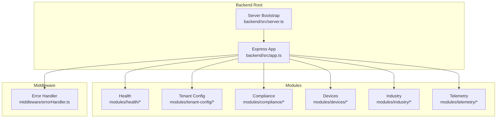
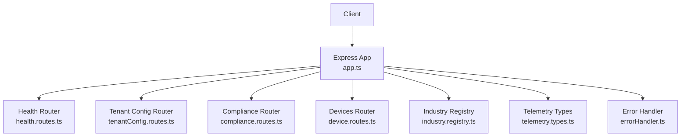
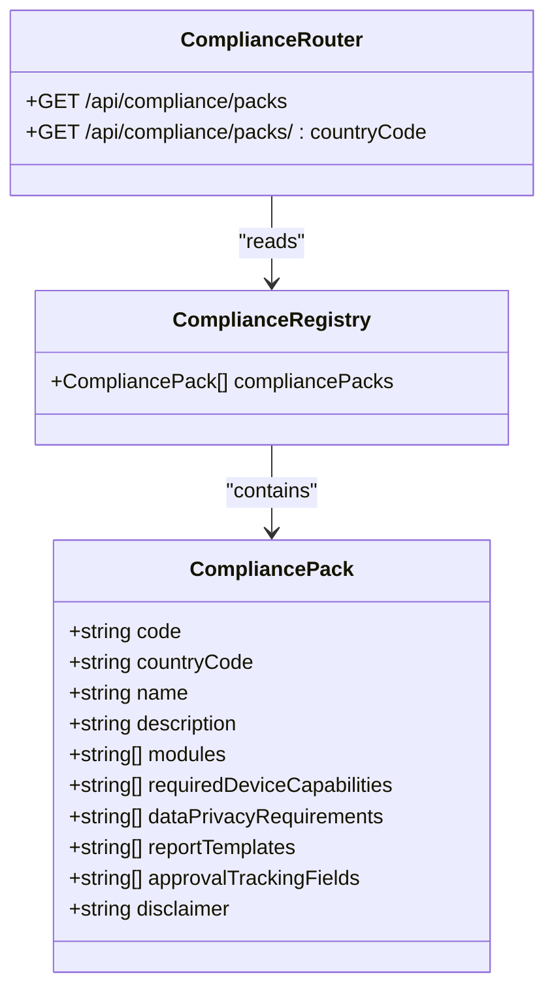
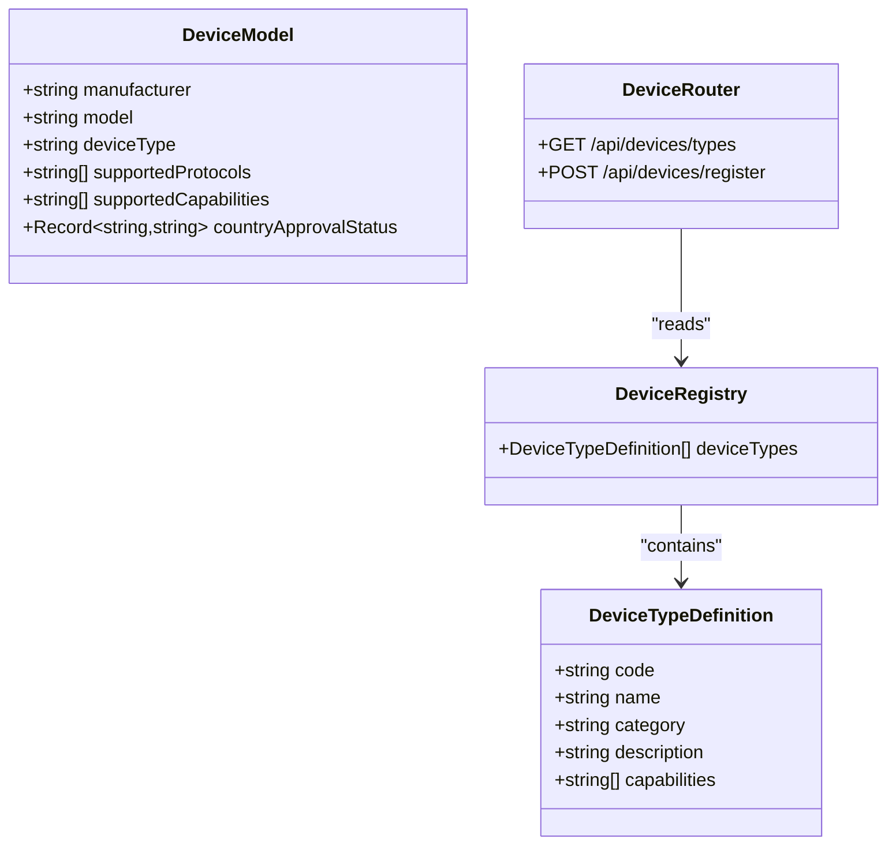
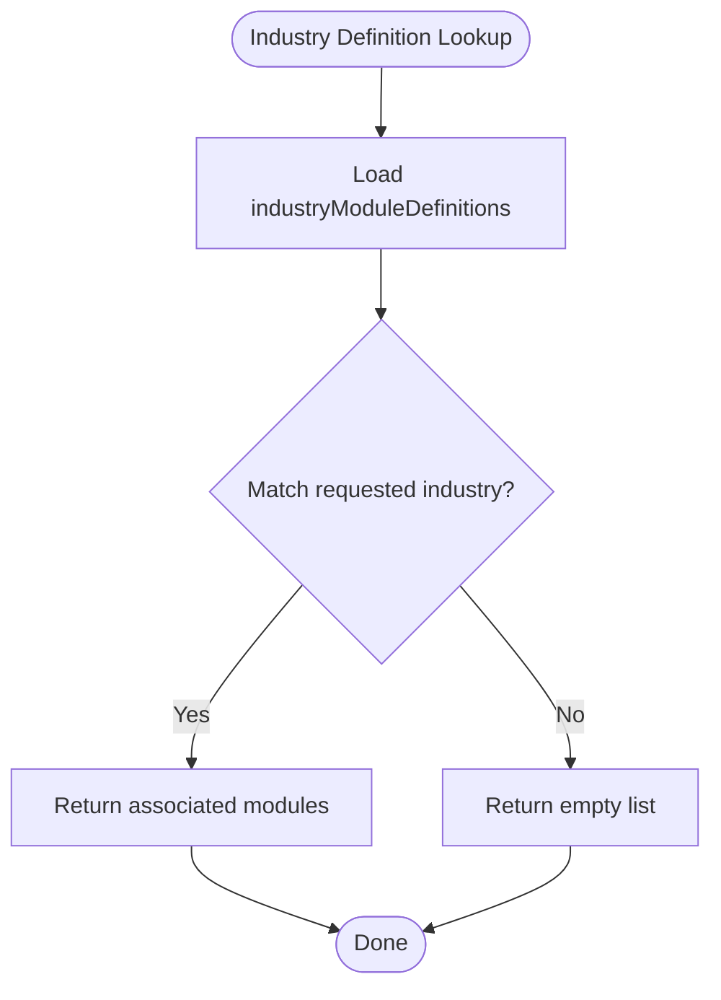
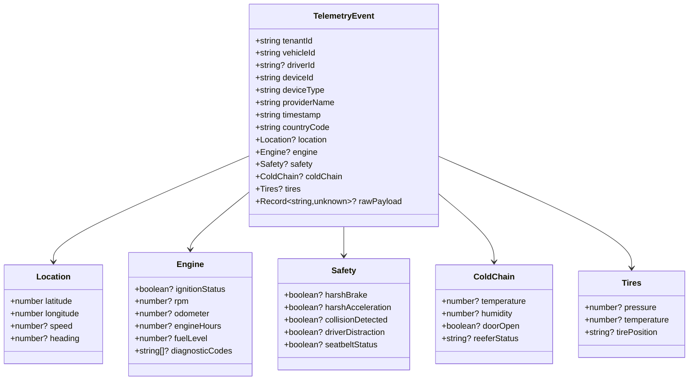
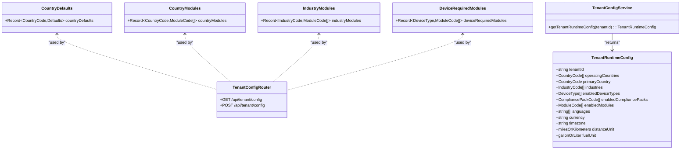
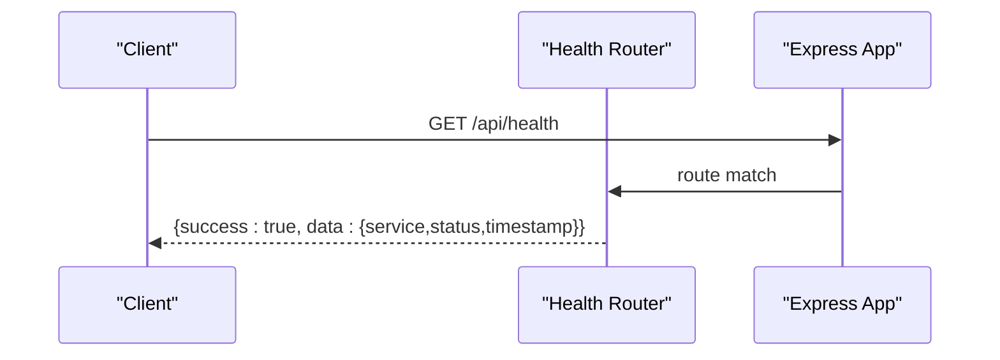
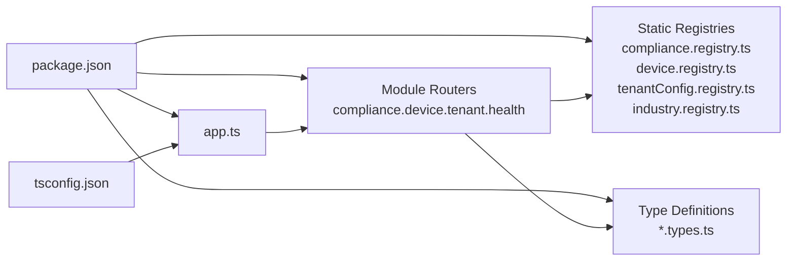

# Domain Modules

<cite>
**Referenced Files in This Document**
- [app.ts](file://backend/src/app.ts)
- [server.ts](file://backend/src/server.ts)
- [compliance.registry.ts](file://backend/src/modules/compliance/compliance.registry.ts)
- [compliance.routes.ts](file://backend/src/modules/compliance/compliance.routes.ts)
- [compliance.types.ts](file://backend/src/modules/compliance/compliance.types.ts)
- [device.registry.ts](file://backend/src/modules/devices/device.registry.ts)
- [device.routes.ts](file://backend/src/modules/devices/device.routes.ts)
- [device.types.ts](file://backend/src/modules/devices/device.types.ts)
- [industry.registry.ts](file://backend/src/modules/industry/industry.registry.ts)
- [telemetry.types.ts](file://backend/src/modules/telemetry/telemetry.types.ts)
- [tenantConfig.registry.ts](file://backend/src/modules/tenant-config/tenantConfig.registry.ts)
- [tenantConfig.routes.ts](file://backend/src/modules/tenant-config/tenantConfig.routes.ts)
- [tenantConfig.service.ts](file://backend/src/modules/tenant-config/tenantConfig.service.ts)
- [types.ts](file://backend/src/modules/tenant-config/types.ts)
- [health.routes.ts](file://backend/src/modules/health/health.routes.ts)
- [errorHandler.ts](file://backend/src/middleware/errorHandler.ts)
- [package.json](file://backend/package.json)
- [tsconfig.json](file://backend/tsconfig.json)
</cite>

## Table of Contents
1. [Introduction](#introduction)
2. [Project Structure](#project-structure)
3. [Core Components](#core-components)
4. [Architecture Overview](#architecture-overview)
5. [Detailed Component Analysis](#detailed-component-analysis)
6. [Dependency Analysis](#dependency-analysis)
7. [Performance Considerations](#performance-considerations)
8. [Troubleshooting Guide](#troubleshooting-guide)
9. [Conclusion](#conclusion)
10. [Appendices](#appendices)

## Introduction
This document explains the domain-specific modules in the Node.js backend, focusing on the modular architecture pattern used across compliance, devices, telemetry, industry verticals, tenant configuration, and health monitoring. It details the module registry pattern, type definitions, and service integration points. The separation of concerns, module boundaries, and inter-module communication are covered alongside the module lifecycle, dependency injection patterns, and configuration management. Practical examples, testing patterns, and extension points for adding new modules are included to guide maintainers and contributors.

## Project Structure
The backend is organized around a feature-based module layout under backend/src/modules. Each domain encapsulates its own routes, registry constants, and type definitions. The Express application mounts these modules under dedicated API prefixes and applies shared middleware for security, logging, CORS, rate limiting, and error handling.

**Diagram sources**
- [app.ts:1-97](file://backend/src/app.ts#L1-L97)
- [server.ts:1-11](file://backend/src/server.ts#L1-L11)
- [errorHandler.ts](file://backend/src/middleware/errorHandler.ts)

**Section sources**
- [app.ts:1-97](file://backend/src/app.ts#L1-L97)
- [server.ts:1-11](file://backend/src/server.ts#L1-L11)

## Core Components
- Express Application: Initializes middleware, rate limiting, and mounts domain routes under /api.
- Module Routes: Each domain exposes a router that defines endpoints for discovery and operations.
- Registry Constants: Static registries define domain catalogs (device types, compliance packs, industry modules, tenant defaults).
- Type Definitions: Strongly typed interfaces and enums define contracts for data exchange and runtime configuration.
- Health Endpoint: Provides a ready/healthy status for service checks.
- Error Handling: Centralized error handler ensures consistent error responses.

**Section sources**
- [app.ts:1-97](file://backend/src/app.ts#L1-L97)
- [health.routes.ts:1-19](file://backend/src/modules/health/health.routes.ts#L1-L19)
- [errorHandler.ts](file://backend/src/middleware/errorHandler.ts)

## Architecture Overview
The system follows a layered Express architecture with domain modules as feature boundaries. The application bootstraps via server.ts, configures environment variables via dotenv, and starts the HTTP server. Middleware applies security headers, CORS, request logging, and rate limiting. Domain routers expose endpoints that return structured JSON responses with success flags and data payloads.

**Diagram sources**
- [app.ts:1-97](file://backend/src/app.ts#L1-L97)
- [health.routes.ts:1-19](file://backend/src/modules/health/health.routes.ts#L1-L19)
- [tenantConfig.routes.ts](file://backend/src/modules/tenant-config/tenantConfig.routes.ts)
- [compliance.routes.ts:1-24](file://backend/src/modules/compliance/compliance.routes.ts#L1-L24)
- [device.routes.ts:1-46](file://backend/src/modules/devices/device.routes.ts#L1-L46)
- [industry.registry.ts:1-52](file://backend/src/modules/industry/industry.registry.ts#L1-L52)
- [telemetry.types.ts:1-50](file://backend/src/modules/telemetry/telemetry.types.ts#L1-L50)
- [errorHandler.ts](file://backend/src/middleware/errorHandler.ts)

## Detailed Component Analysis

### Compliance Module
The compliance module provides a registry of country-specific compliance packs and exposes endpoints to discover packs globally and filtered by country. The registry enumerates capabilities, required device features, privacy requirements, report templates, and approval tracking fields per pack.

**Diagram sources**
- [compliance.types.ts:1-13](file://backend/src/modules/compliance/compliance.types.ts#L1-L13)
- [compliance.registry.ts:1-142](file://backend/src/modules/compliance/compliance.registry.ts#L1-L142)
- [compliance.routes.ts:1-24](file://backend/src/modules/compliance/compliance.routes.ts#L1-L24)

**Section sources**
- [compliance.registry.ts:1-142](file://backend/src/modules/compliance/compliance.registry.ts#L1-L142)
- [compliance.routes.ts:1-24](file://backend/src/modules/compliance/compliance.routes.ts#L1-L24)
- [compliance.types.ts:1-13](file://backend/src/modules/compliance/compliance.types.ts#L1-L13)

### Devices Module
The devices module registers device types and exposes endpoints to list device types and register new devices. Device registrations include metadata such as manufacturer, model, IMEI/SIM, and initial approval status.

**Diagram sources**
- [device.types.ts:1-17](file://backend/src/modules/devices/device.types.ts#L1-L17)
- [device.registry.ts:1-61](file://backend/src/modules/devices/device.registry.ts#L1-L61)
- [device.routes.ts:1-46](file://backend/src/modules/devices/device.routes.ts#L1-L46)

**Section sources**
- [device.registry.ts:1-61](file://backend/src/modules/devices/device.registry.ts#L1-L61)
- [device.routes.ts:1-46](file://backend/src/modules/devices/device.routes.ts#L1-L46)
- [device.types.ts:1-17](file://backend/src/modules/devices/device.types.ts#L1-L17)

### Industry Module
The industry module defines industry verticals and their associated modules. These definitions enable tenant configuration to align enabled modules with industry-specific needs.

**Diagram sources**
- [industry.registry.ts:1-52](file://backend/src/modules/industry/industry.registry.ts#L1-L52)

**Section sources**
- [industry.registry.ts:1-52](file://backend/src/modules/industry/industry.registry.ts#L1-L52)

### Telemetry Module
The telemetry module defines a comprehensive event type capturing location, engine metrics, safety events, cold chain conditions, tire metrics, and optional raw payload. This type acts as a contract for ingesting and normalizing telemetry from diverse device providers.

**Diagram sources**
- [telemetry.types.ts:1-50](file://backend/src/modules/telemetry/telemetry.types.ts#L1-L50)

**Section sources**
- [telemetry.types.ts:1-50](file://backend/src/modules/telemetry/telemetry.types.ts#L1-L50)

### Tenant Configuration Module
The tenant configuration module centralizes country defaults, module mappings by country and industry, and required modules per device type. It also exposes a router for tenant configuration operations and a service for runtime configuration retrieval.

**Diagram sources**
- [tenantConfig.registry.ts:1-178](file://backend/src/modules/tenant-config/tenantConfig.registry.ts#L1-L178)
- [types.ts:1-68](file://backend/src/modules/tenant-config/types.ts#L1-L68)
- [tenantConfig.routes.ts](file://backend/src/modules/tenant-config/tenantConfig.routes.ts)
- [tenantConfig.service.ts](file://backend/src/modules/tenant-config/tenantConfig.service.ts)

**Section sources**
- [tenantConfig.registry.ts:1-178](file://backend/src/modules/tenant-config/tenantConfig.registry.ts#L1-L178)
- [types.ts:1-68](file://backend/src/modules/tenant-config/types.ts#L1-L68)
- [tenantConfig.routes.ts](file://backend/src/modules/tenant-config/tenantConfig.routes.ts)
- [tenantConfig.service.ts](file://backend/src/modules/tenant-config/tenantConfig.service.ts)

### Health Module
The health module provides a lightweight endpoint returning service status and timestamp, useful for readiness probes and monitoring.

**Diagram sources**
- [health.routes.ts:1-19](file://backend/src/modules/health/health.routes.ts#L1-L19)
- [app.ts:74-94](file://backend/src/app.ts#L74-L94)

**Section sources**
- [health.routes.ts:1-19](file://backend/src/modules/health/health.routes.ts#L1-L19)
- [app.ts:74-94](file://backend/src/app.ts#L74-L94)

## Dependency Analysis
The application depends on Express and middleware libraries for security, logging, and CORS. TypeScript compiles the source tree into CommonJS modules. The module registry pattern relies on static arrays and records to decouple configuration from runtime logic.

**Diagram sources**
- [package.json:1-39](file://backend/package.json#L1-L39)
- [tsconfig.json:1-16](file://backend/tsconfig.json#L1-L16)
- [app.ts:1-97](file://backend/src/app.ts#L1-L97)
- [compliance.registry.ts:1-142](file://backend/src/modules/compliance/compliance.registry.ts#L1-L142)
- [device.registry.ts:1-61](file://backend/src/modules/devices/device.registry.ts#L1-L61)
- [tenantConfig.registry.ts:1-178](file://backend/src/modules/tenant-config/tenantConfig.registry.ts#L1-L178)
- [industry.registry.ts:1-52](file://backend/src/modules/industry/industry.registry.ts#L1-L52)
- [compliance.types.ts:1-13](file://backend/src/modules/compliance/compliance.types.ts#L1-L13)
- [device.types.ts:1-17](file://backend/src/modules/devices/device.types.ts#L1-L17)
- [telemetry.types.ts:1-50](file://backend/src/modules/telemetry/telemetry.types.ts#L1-L50)
- [types.ts:1-68](file://backend/src/modules/tenant-config/types.ts#L1-L68)

**Section sources**
- [package.json:1-39](file://backend/package.json#L1-L39)
- [tsconfig.json:1-16](file://backend/tsconfig.json#L1-L16)

## Performance Considerations
- Rate Limiting: The application implements a sliding-window rate limiter for non-public endpoints to mitigate abuse. Tuning parameters are environment-driven.
- Logging: Morgan is configured for request logging; ensure log levels and retention policies are set appropriately in production.
- Payload Limits: JSON body parsing has an upper bound to prevent large payload attacks.
- Static Registries: Registry reads are O(n) over small arrays; keep registries compact and cacheable where necessary.
- Middleware Order: Security middleware precedes route handlers to minimize risk exposure.

[No sources needed since this section provides general guidance]

## Troubleshooting Guide
- Health Checks: Use the health endpoint to confirm service availability and status.
- Error Responses: The centralized error handler returns structured JSON with success flags and error arrays; inspect these for actionable diagnostics.
- CORS and Origins: Verify FRONTEND_URL and credentials settings if cross-origin requests fail.
- Rate Limit Exceeded: If clients receive 429 responses, review RATE_LIMIT_WINDOW_MS and RATE_LIMIT_MAX_REQUESTS.

**Section sources**
- [health.routes.ts:1-19](file://backend/src/modules/health/health.routes.ts#L1-L19)
- [errorHandler.ts](file://backend/src/middleware/errorHandler.ts)
- [app.ts:18-72](file://backend/src/app.ts#L18-L72)

## Conclusion
The backend employs a clean, feature-based modular architecture with explicit registries and type-safe contracts. Each domain encapsulates discovery and operational endpoints while sharing common middleware and error handling. The tenant configuration module ties together country defaults, industry verticals, and device requirements to produce a tenant runtime configuration. This design enables straightforward extension with new modules, registries, and routes while preserving separation of concerns and predictable inter-module communication.

[No sources needed since this section summarizes without analyzing specific files]

## Appendices

### Module Lifecycle and Boundaries
- Registration: Registries are static and loaded at startup; they define catalog data for discovery and validation.
- Routing: Each module exposes a router mounted under /api/<domain>.
- Validation: Use type definitions and enums to constrain inputs and outputs.
- Communication: Modules communicate via shared types and registries; avoid tight coupling by referencing only necessary contracts.

**Section sources**
- [compliance.registry.ts:1-142](file://backend/src/modules/compliance/compliance.registry.ts#L1-L142)
- [device.registry.ts:1-61](file://backend/src/modules/devices/device.registry.ts#L1-L61)
- [tenantConfig.registry.ts:1-178](file://backend/src/modules/tenant-config/tenantConfig.registry.ts#L1-L178)
- [industry.registry.ts:1-52](file://backend/src/modules/industry/industry.registry.ts#L1-L52)
- [compliance.types.ts:1-13](file://backend/src/modules/compliance/compliance.types.ts#L1-L13)
- [device.types.ts:1-17](file://backend/src/modules/devices/device.types.ts#L1-L17)
- [telemetry.types.ts:1-50](file://backend/src/modules/telemetry/telemetry.types.ts#L1-L50)
- [types.ts:1-68](file://backend/src/modules/tenant-config/types.ts#L1-L68)

### Dependency Injection Patterns
- Current Pattern: Registries and routers are imported directly; no container is used.
- Extension Point: To introduce DI, export factory functions or classes from each module and wire them in app.ts. This preserves module boundaries while enabling testable, injectable services.

**Section sources**
- [app.ts:1-97](file://backend/src/app.ts#L1-L97)

### Configuration Management
- Environment Variables: PORT, FRONTEND_URL, CORS credentials, rate-limit windows and thresholds.
- Runtime Config: TenantRuntimeConfig aggregates country, industry, device, and compliance selections for a tenant.

**Section sources**
- [server.ts:1-11](file://backend/src/server.ts#L1-L11)
- [app.ts:18-23](file://backend/src/app.ts#L18-L23)
- [types.ts:54-67](file://backend/src/modules/tenant-config/types.ts#L54-L67)

### Examples of Module Implementation
- Compliance Discovery: GET /api/compliance/packs and GET /api/compliance/packs/:countryCode.
- Device Registration: POST /api/devices/register with device metadata.
- Tenant Config: Define country defaults, industry modules, and device-required modules; retrieve runtime config via tenantConfig service/router.

**Section sources**
- [compliance.routes.ts:1-24](file://backend/src/modules/compliance/compliance.routes.ts#L1-L24)
- [device.routes.ts:1-46](file://backend/src/modules/devices/device.routes.ts#L1-L46)
- [tenantConfig.routes.ts](file://backend/src/modules/tenant-config/tenantConfig.routes.ts)
- [tenantConfig.service.ts](file://backend/src/modules/tenant-config/tenantConfig.service.ts)

### Testing Patterns
- Unit Tests: Validate registry contents and route responses with mock requests.
- Contract Tests: Ensure TelemetryEvent and type definitions remain consistent across modules.
- Integration Tests: Mount routers in isolated app instances to test middleware and error handling.

[No sources needed since this section provides general guidance]

### Extension Points for New Modules
- Add a new folder under modules/<domain> with:
  - types.ts for contracts and enums
  - registry.ts for static catalogs
  - routes.ts for endpoints
  - service.ts (optional) for business logic
- Import and mount the router in app.ts under /api/<domain>
- Update tenant configuration types and registries as needed

**Section sources**
- [app.ts:7-12](file://backend/src/app.ts#L7-L12)
- [app.ts:90-94](file://backend/src/app.ts#L90-L94)