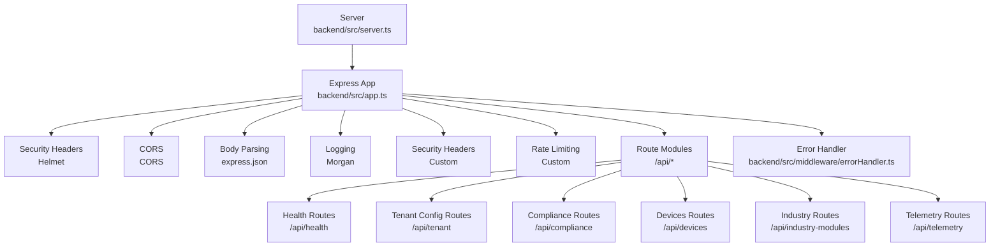
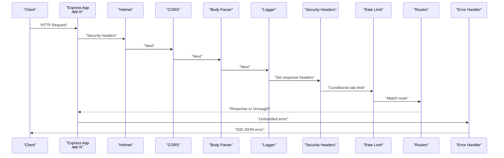
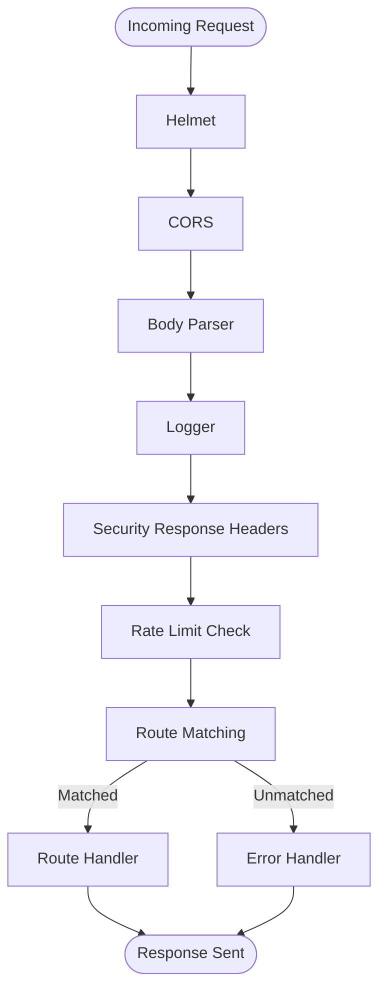
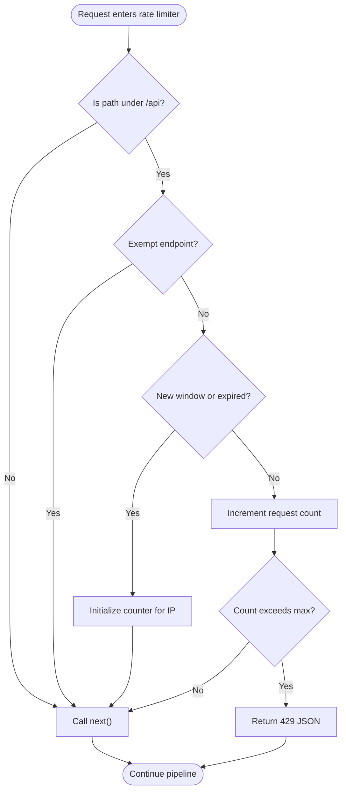
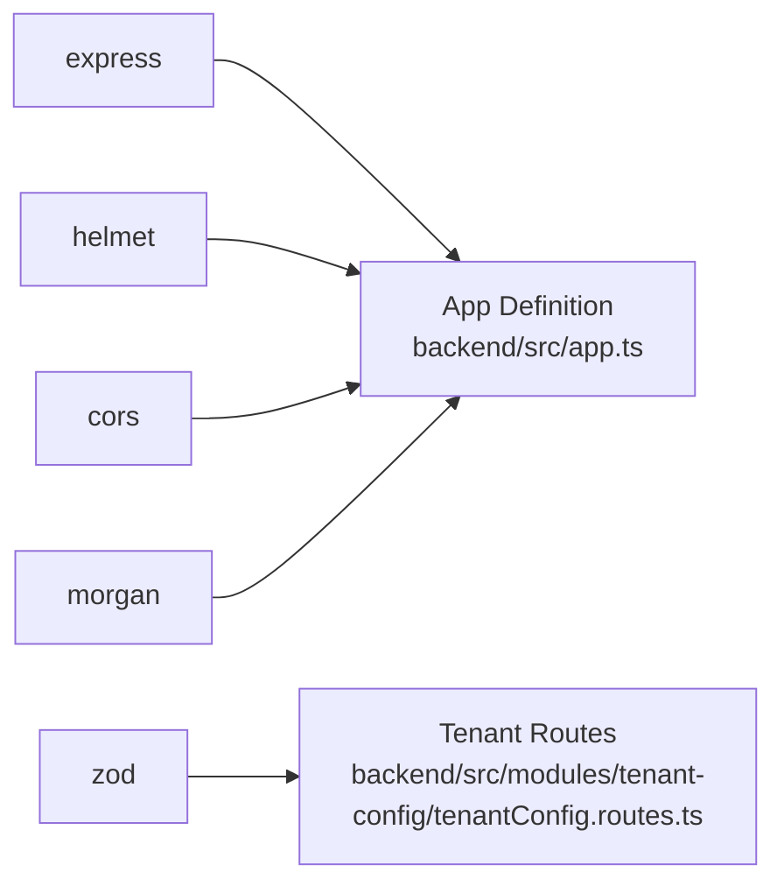

# Middleware Stack

<cite>
**Referenced Files in This Document**
- [app.ts](file://backend/src/app.ts)
- [errorHandler.ts](file://backend/src/middleware/errorHandler.ts)
- [server.ts](file://backend/src/server.ts)
- [health.routes.ts](file://backend/src/modules/health/health.routes.ts)
- [tenantConfig.routes.ts](file://backend/src/modules/tenant-config/tenantConfig.routes.ts)
- [compliance.routes.ts](file://backend/src/modules/compliance/compliance.routes.ts)
- [device.routes.ts](file://backend/src/modules/devices/device.routes.ts)
- [package.json](file://backend/package.json)
- [.env.example](file://backend/.env.example)
</cite>

## Table of Contents
1. [Introduction](#introduction)
2. [Project Structure](#project-structure)
3. [Core Components](#core-components)
4. [Architecture Overview](#architecture-overview)
5. [Detailed Component Analysis](#detailed-component-analysis)
6. [Dependency Analysis](#dependency-analysis)
7. [Performance Considerations](#performance-considerations)
8. [Troubleshooting Guide](#troubleshooting-guide)
9. [Conclusion](#conclusion)

## Introduction
This document explains the middleware stack of the Express application, focusing on execution order, request/response processing pipeline, and cross-cutting concerns. It covers security headers, CORS, body parsing, request logging, rate limiting, and centralized error handling. It also provides guidance on creating custom middleware, composing middleware, applying middleware conditionally, and understanding performance characteristics.

## Project Structure
The Express application is initialized in a single module and mounted with middleware and routes. The server bootstraps via a dedicated entry point.

**Diagram sources**
- [server.ts:1-11](file://backend/src/server.ts#L1-L11)
- [app.ts:1-97](file://backend/src/app.ts#L1-L97)
- [errorHandler.ts:1-17](file://backend/src/middleware/errorHandler.ts#L1-L17)
- [health.routes.ts:1-19](file://backend/src/modules/health/health.routes.ts#L1-L19)
- [tenantConfig.routes.ts:1-58](file://backend/src/modules/tenant-config/tenantConfig.routes.ts#L1-L58)
- [compliance.routes.ts:1-24](file://backend/src/modules/compliance/compliance.routes.ts#L1-L24)
- [device.routes.ts:1-46](file://backend/src/modules/devices/device.routes.ts#L1-L46)

**Section sources**
- [server.ts:1-11](file://backend/src/server.ts#L1-L11)
- [app.ts:1-97](file://backend/src/app.ts#L1-L97)

## Core Components
- Security middleware: Helmet sets strict security headers globally.
- CORS middleware: Allows configured origins and credentials.
- Body parsing: JSON body parsing with a 5 MB limit.
- Logging: Morgan logs requests in development format.
- Security response headers: Custom middleware sets additional headers.
- Rate limiting: Custom middleware enforces per-IP limits for protected paths.
- Route modules: Mounted under /api/* prefixes.
- Centralized error handler: Final middleware catching unhandled errors.

**Section sources**
- [app.ts:24-40](file://backend/src/app.ts#L24-L40)
- [app.ts:42-72](file://backend/src/app.ts#L42-L72)
- [app.ts:74-96](file://backend/src/app.ts#L74-L96)
- [errorHandler.ts:1-17](file://backend/src/middleware/errorHandler.ts#L1-L17)

## Architecture Overview
The middleware stack is registered at the application level and executed in a fixed order. Requests traverse middleware in sequence, then match against route handlers, and finally fall through to the error handler if uncaught.

**Diagram sources**
- [app.ts:24-96](file://backend/src/app.ts#L24-L96)
- [errorHandler.ts:1-17](file://backend/src/middleware/errorHandler.ts#L1-L17)

## Detailed Component Analysis

### Middleware Execution Order and Pipeline
- Registration order defines execution order.
- Each middleware receives Request, Response, and NextFunction.
- next() advances to the next middleware or route handler.
- Errors thrown or passed to next() are handled by the error handler.

**Diagram sources**
- [app.ts:24-96](file://backend/src/app.ts#L24-L96)

**Section sources**
- [app.ts:24-96](file://backend/src/app.ts#L24-L96)

### Security Middleware (Helmet)
- Helmet is applied globally to set secure defaults for headers such as XSS protection, content type options, referrer policy, and HSTS-related controls.

**Section sources**
- [app.ts:24-25](file://backend/src/app.ts#L24-L25)

### CORS Handling
- Enabled with allowed origins from environment configuration and credentials support.
- Origins are split from a comma-separated environment variable and trimmed.

**Section sources**
- [app.ts:26-31](file://backend/src/app.ts#L26-L31)
- [.env.example:3](file://backend/.env.example#L3)

### Body Parsing
- JSON bodies are parsed with a 5 MB limit to prevent large payload abuse.

**Section sources**
- [app.ts:32](file://backend/src/app.ts#L32)

### Request Logging
- Morgan logs requests in development-friendly format.

**Section sources**
- [app.ts:33](file://backend/src/app.ts#L33)

### Additional Security Response Headers
- Sets X-Content-Type-Options, X-Frame-Options, Referrer-Policy, and Permissions-Policy on all responses.

**Section sources**
- [app.ts:34-40](file://backend/src/app.ts#L34-L40)

### Conditional Rate Limiting
- Applied only to paths under /api.
- Exemptions include health endpoints, readiness endpoint, login endpoint, and a specific GET path pattern.
- Uses an in-memory map keyed by client IP to track request counts per time window.
- Returns a structured JSON error with 429 status when limit is exceeded.

**Diagram sources**
- [app.ts:42-72](file://backend/src/app.ts#L42-L72)

**Section sources**
- [app.ts:42-72](file://backend/src/app.ts#L42-L72)
- [.env.example:4-5](file://backend/.env.example#L4-L5)

### Route Modules and Mounting
- Health, tenant config, compliance, devices, industry, and telemetry routes are mounted under /api/* prefixes.
- The readiness endpoint is defined inline at /api/ready.

**Section sources**
- [app.ts:74-94](file://backend/src/app.ts#L74-L94)
- [health.routes.ts:1-19](file://backend/src/modules/health/health.routes.ts#L1-L19)
- [tenantConfig.routes.ts:1-58](file://backend/src/modules/tenant-config/tenantConfig.routes.ts#L1-L58)
- [compliance.routes.ts:1-24](file://backend/src/modules/compliance/compliance.routes.ts#L1-L24)
- [device.routes.ts:1-46](file://backend/src/modules/devices/device.routes.ts#L1-L46)

### Error Handling Middleware
- Centralized error handler logs the error and responds with a standardized 500 JSON payload.
- Must be registered last to catch unhandled errors and synchronous exceptions.

**Section sources**
- [errorHandler.ts:1-17](file://backend/src/middleware/errorHandler.ts#L1-L17)
- [app.ts:96](file://backend/src/app.ts#L96)

### Custom Middleware Creation Patterns
- Function signature: (req, res, next) => void.
- Call next() to continue the pipeline or res.status(...).json(...) to short-circuit.
- For conditional logic, branch based on req.path, req.method, or other criteria.
- For stateful middleware (like rate limiting), maintain in-memory state keyed by request attributes.

Example patterns observed:
- Setting response headers globally.
- Conditional application based on path prefixes.
- Structured JSON responses for errors.

**Section sources**
- [app.ts:34-40](file://backend/src/app.ts#L34-L40)
- [app.ts:42-72](file://backend/src/app.ts#L42-L72)

### Middleware Composition
- Compose middleware horizontally (multiple middlewares) and vertically (nested route handlers).
- Keep cross-cutting concerns (security, logging, rate limiting) at the top level.
- Place route-specific middleware close to route handlers when needed.

[No sources needed since this section provides general guidance]

## Dependency Analysis
External libraries and their roles:
- cors: Enables CORS with configurable origins and credentials.
- helmet: Applies secure headers.
- morgan: Logs HTTP requests.
- express: Web framework and JSON body parser.
- zod: Validation for request payloads (used in route handlers).

**Diagram sources**
- [package.json:22-28](file://backend/package.json#L22-L28)
- [app.ts:1-15](file://backend/src/app.ts#L1-L15)
- [tenantConfig.routes.ts:2](file://backend/src/modules/tenant-config/tenantConfig.routes.ts#L2)

**Section sources**
- [package.json:22-28](file://backend/package.json#L22-L28)
- [app.ts:1-15](file://backend/src/app.ts#L1-L15)
- [tenantConfig.routes.ts:2](file://backend/src/modules/tenant-config/tenantConfig.routes.ts#L2)

## Performance Considerations
- Rate limiting uses an in-memory Map; it resets on restart and does not shard across instances. Consider a distributed store for production scale.
- JSON body size limit prevents large payloads but may need tuning depending on upload patterns.
- Logging overhead depends on log level and transport; keep consistent in production environments.
- Helmet and CORS are lightweight; ensure origin lists are minimal to reduce preflight checks.

[No sources needed since this section provides general guidance]

## Troubleshooting Guide
- 429 Too Many Requests: Indicates the rate limiter is active. Verify exemptions and adjust window and max requests via environment variables.
- CORS errors: Confirm FRONTEND_URL includes the correct origin(s) and that credentials are supported when required.
- 500 Internal Server Error: The centralized error handler logs the error and returns a generic message; inspect server logs for stack traces.
- Unexpected 404: Ensure the route prefix (/api/...) and endpoint path are correct and that the route module is mounted.

**Section sources**
- [app.ts:42-72](file://backend/src/app.ts#L42-L72)
- [.env.example:3-5](file://backend/.env.example#L3-L5)
- [errorHandler.ts:1-17](file://backend/src/middleware/errorHandler.ts#L1-L17)

## Conclusion
The middleware stack establishes a clear, layered approach to security, logging, request parsing, and rate limiting. Its ordering ensures that cross-cutting concerns are applied consistently before route handling, while the centralized error handler provides predictable failure behavior. For production deployments, consider scaling rate limiting state and hardening logging and header policies.