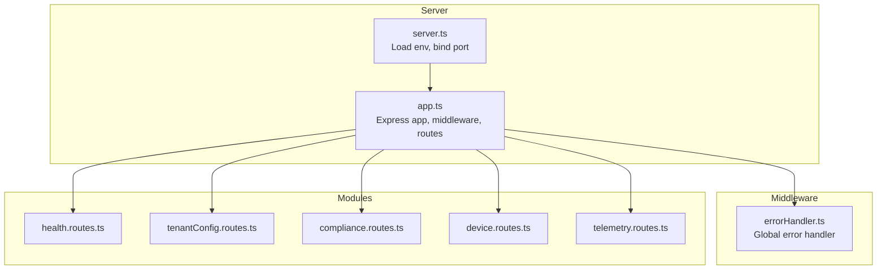
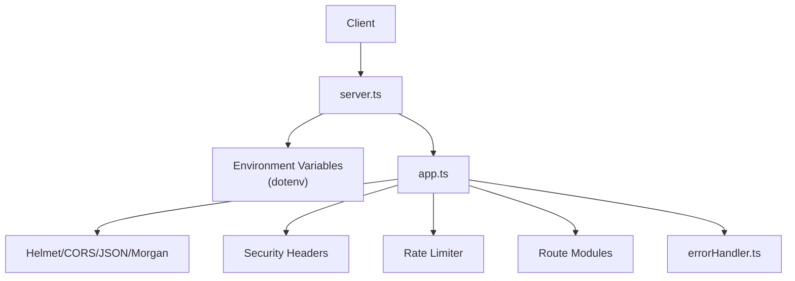
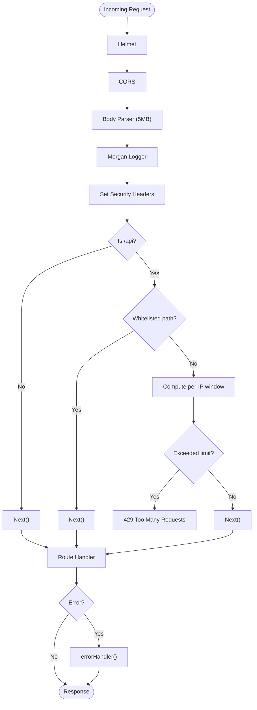
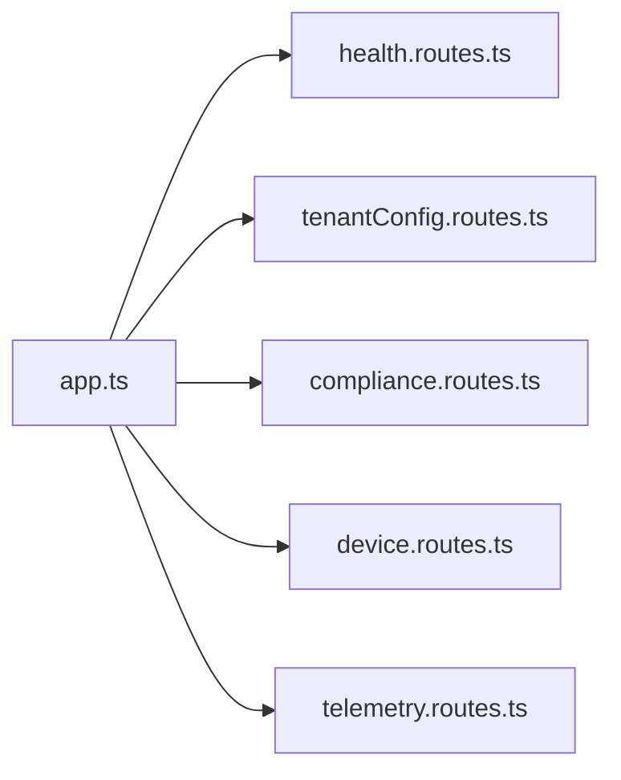
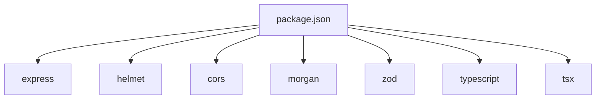

# Node.js Express Backend

<cite>
**Referenced Files in This Document**
- [server.ts](file://backend/src/server.ts)
- [app.ts](file://backend/src/app.ts)
- [errorHandler.ts](file://backend/src/middleware/errorHandler.ts)
- [health.routes.ts](file://backend/src/modules/health/health.routes.ts)
- [tenantConfig.routes.ts](file://backend/src/modules/tenant-config/tenantConfig.routes.ts)
- [compliance.routes.ts](file://backend/src/modules/compliance/compliance.routes.ts)
- [device.routes.ts](file://backend/src/modules/devices/device.routes.ts)
- [telemetry.routes.ts](file://backend/src/modules/telemetry/telemetry.routes.ts)
- [package.json](file://backend/package.json)
- [tsconfig.json](file://backend/tsconfig.json)
</cite>

## Table of Contents
1. [Introduction](#introduction)
2. [Project Structure](#project-structure)
3. [Core Components](#core-components)
4. [Architecture Overview](#architecture-overview)
5. [Detailed Component Analysis](#detailed-component-analysis)
6. [Dependency Analysis](#dependency-analysis)
7. [Performance Considerations](#performance-considerations)
8. [Troubleshooting Guide](#troubleshooting-guide)
9. [Conclusion](#conclusion)
10. [Appendices](#appendices)

## Introduction
This document describes the Node.js Express backend implementation for a global fleet management platform. It explains application initialization, server configuration, environment variable handling, middleware stack, modular routing architecture across compliance, devices, telemetry, and tenant configuration domains, and the current state of real-time capabilities. It also covers TypeScript configuration, build process, and deployment considerations, along with performance optimization and scalability patterns.

## Project Structure
The backend is organized around an Express application with a modular routing pattern. The application entrypoint initializes middleware, routes, and error handling, while each domain module exposes its own routes. Environment variables are loaded via dotenv and influence CORS origins, rate limiting windows, and port binding.

**Diagram sources**
- [server.ts:1-11](file://backend/src/server.ts#L1-L11)
- [app.ts:1-97](file://backend/src/app.ts#L1-L97)
- [errorHandler.ts:1-17](file://backend/src/middleware/errorHandler.ts#L1-L17)
- [health.routes.ts:1-19](file://backend/src/modules/health/health.routes.ts#L1-L19)
- [tenantConfig.routes.ts:1-58](file://backend/src/modules/tenant-config/tenantConfig.routes.ts#L1-L58)
- [compliance.routes.ts:1-24](file://backend/src/modules/compliance/compliance.routes.ts#L1-L24)
- [device.routes.ts:1-46](file://backend/src/modules/devices/device.routes.ts#L1-L46)
- [telemetry.routes.ts:1-59](file://backend/src/modules/telemetry/telemetry.routes.ts#L1-L59)

**Section sources**
- [server.ts:1-11](file://backend/src/server.ts#L1-L11)
- [app.ts:1-97](file://backend/src/app.ts#L1-L97)

## Core Components
- Application bootstrap: Loads environment variables, constructs the Express app, mounts middleware, registers routes, and starts the HTTP server.
- Middleware stack: Includes security headers, CORS, JSON body parsing, logging, request security headers, basic rate limiting, and a global error handler.
- Routing modules: Health, tenant configuration, compliance packs, device registration/types, and telemetry ingestion/query endpoints.
- TypeScript configuration: Targets ES2020, emits to dist, strict mode enabled, and uses CommonJS modules.
- Build and scripts: Development via tsx watch, production build via tsc, runtime via node dist/server.js, and type checking via tsc.

**Section sources**
- [server.ts:1-11](file://backend/src/server.ts#L1-L11)
- [app.ts:1-97](file://backend/src/app.ts#L1-L97)
- [errorHandler.ts:1-17](file://backend/src/middleware/errorHandler.ts#L1-L17)
- [package.json:1-39](file://backend/package.json#L1-L39)
- [tsconfig.json:1-16](file://backend/tsconfig.json#L1-L16)

## Architecture Overview
The backend follows a layered architecture:
- Entry layer: server.ts loads environment variables and binds to a configurable port.
- Web framework layer: app.ts configures middleware and routes.
- Domain modules: Each module encapsulates its routes and related logic.
- Cross-cutting concerns: Global error handling and middleware enforce security and observability.

**Diagram sources**
- [server.ts:1-11](file://backend/src/server.ts#L1-L11)
- [app.ts:1-97](file://backend/src/app.ts#L1-L97)
- [errorHandler.ts:1-17](file://backend/src/middleware/errorHandler.ts#L1-L17)

## Detailed Component Analysis

### Application Initialization and Server Configuration
- Environment loading: dotenv is invoked before constructing the app to populate process.env.
- Port binding: Uses process.env.PORT with a default fallback.
- Logging: Morgan logs requests in dev format.

**Section sources**
- [server.ts:1-11](file://backend/src/server.ts#L1-L11)

### Middleware Stack
- Security hardening: Helmet sets secure defaults.
- CORS: Origin controlled by FRONTEND_URL environment variable split into an array; credentials allowed.
- Body parsing: JSON payload up to 5 MB.
- Logging: Morgan in dev format.
- Request security headers: Sets X-Content-Type-Options, X-Frame-Options, Referrer-Policy, Permissions-Policy.
- Basic rate limiting: Per-IP sliding window with configurable window and max requests via environment variables.
- Global error handling: Centralized handler logs and responds with a generic 500.

**Diagram sources**
- [app.ts:25-72](file://backend/src/app.ts#L25-L72)
- [errorHandler.ts:1-17](file://backend/src/middleware/errorHandler.ts#L1-L17)

**Section sources**
- [app.ts:25-72](file://backend/src/app.ts#L25-L72)
- [errorHandler.ts:1-17](file://backend/src/middleware/errorHandler.ts#L1-L17)

### Modular Routing Architecture
- Health module: Provides a health endpoint returning service status.
- Tenant configuration module: Validates and processes tenant configuration requests, returning a runtime configuration object.
- Compliance module: Exposes compliance packs filtered by country code.
- Devices module: Returns device types and supports device registration with a mock response.
- Telemetry module: Accepts telemetry events, generates alerts based on thresholds, and retrieves events by vehicle ID.

**Diagram sources**
- [app.ts:7-12](file://backend/src/app.ts#L7-L12)
- [health.routes.ts:1-19](file://backend/src/modules/health/health.routes.ts#L1-L19)
- [tenantConfig.routes.ts:1-58](file://backend/src/modules/tenant-config/tenantConfig.routes.ts#L1-L58)
- [compliance.routes.ts:1-24](file://backend/src/modules/compliance/compliance.routes.ts#L1-L24)
- [device.routes.ts:1-46](file://backend/src/modules/devices/device.routes.ts#L1-L46)
- [telemetry.routes.ts:1-59](file://backend/src/modules/telemetry/telemetry.routes.ts#L1-L59)

**Section sources**
- [app.ts:7-12](file://backend/src/app.ts#L7-L12)
- [health.routes.ts:1-19](file://backend/src/modules/health/health.routes.ts#L1-L19)
- [tenantConfig.routes.ts:1-58](file://backend/src/modules/tenant-config/tenantConfig.routes.ts#L1-L58)
- [compliance.routes.ts:1-24](file://backend/src/modules/compliance/compliance.routes.ts#L1-L24)
- [device.routes.ts:1-46](file://backend/src/modules/devices/device.routes.ts#L1-L46)
- [telemetry.routes.ts:1-59](file://backend/src/modules/telemetry/telemetry.routes.ts#L1-L59)

### Real-Time Capabilities and Event Streaming
- Current state: The telemetry module accepts events and maintains an in-memory array of events. No WebSocket or SSE infrastructure is present in the referenced files.
- Potential extension points: The telemetry ingestion endpoint could be adapted to publish to a message bus or stream processor, and clients could subscribe via WebSocket or Server-Sent Events.

**Section sources**
- [telemetry.routes.ts:1-59](file://backend/src/modules/telemetry/telemetry.routes.ts#L1-L59)

### TypeScript Configuration and Build Process
- Compiler options target ES2020, emit to dist, enable strict checks, and use CommonJS modules.
- Scripts:
  - dev: watches and runs server.ts via tsx.
  - build: compiles TypeScript to dist.
  - start: runs the compiled server.
  - typecheck: validates types without emitting JS.

**Section sources**
- [tsconfig.json:1-16](file://backend/tsconfig.json#L1-L16)
- [package.json:6-11](file://backend/package.json#L6-L11)

### Deployment Considerations
- Environment variables:
  - PORT: HTTP server port.
  - FRONTEND_URL: Comma-separated list of allowed origins for CORS.
  - RATE_LIMIT_WINDOW_MS and RATE_LIMIT_MAX_REQUESTS: Rate limiter configuration.
- Containerization: The repository includes Dockerfiles and compose configurations at the project root; ensure the backend image exposes the bound port and mounts appropriate volumes for configuration.

**Section sources**
- [server.ts:6-10](file://backend/src/server.ts#L6-L10)
- [app.ts:18-23](file://backend/src/app.ts#L18-L23)
- [app.ts:54-71](file://backend/src/app.ts#L54-L71)

## Dependency Analysis
- Runtime dependencies include Express, Helmet, CORS, Morgan, and Zod for validation.
- Dev dependencies include TypeScript, tsx for development, and type packages for Express and Morgan.
- The app depends on route modules and the global error handler.

**Diagram sources**
- [package.json:22-37](file://backend/package.json#L22-L37)

**Section sources**
- [package.json:22-37](file://backend/package.json#L22-L37)

## Performance Considerations
- Rate limiting: Implemented with a sliding window per IP; tune RATE_LIMIT_WINDOW_MS and RATE_LIMIT_MAX_REQUESTS to balance protection and throughput.
- Memory footprint: Telemetry events are stored in-memory; consider offloading to a persistent store and implementing pagination for retrieval.
- Payload limits: JSON body parser limit set to 5 MB; adjust based on expected payload sizes.
- Static resources: Not configured; if serving static assets, mount a dedicated static middleware and enable compression.
- Concurrency: Increase Node.js worker threads and container replicas behind a load balancer for horizontal scaling.

[No sources needed since this section provides general guidance]

## Troubleshooting Guide
- Health checks: Use the health endpoint to confirm service availability.
- Readiness probe: A readiness endpoint returns service metadata; verify dependencies are reachable before marking ready.
- Error responses: The global error handler returns a generic 500 with a structured payload; inspect server logs for the full error stack.
- CORS issues: Verify FRONTEND_URL contains the client origin(s) and that credentials are supported if required.
- Rate limiting: If clients receive 429 responses, review window and request counts or whitelist specific endpoints.

**Section sources**
- [health.routes.ts:5-16](file://backend/src/modules/health/health.routes.ts#L5-L16)
- [app.ts:75-89](file://backend/src/app.ts#L75-L89)
- [errorHandler.ts:9-15](file://backend/src/middleware/errorHandler.ts#L9-L15)
- [app.ts:27-30](file://backend/src/app.ts#L27-L30)
- [app.ts:54-71](file://backend/src/app.ts#L54-L71)

## Conclusion
The backend provides a solid foundation with modular routing, essential middleware, and environment-driven configuration. The telemetry module demonstrates event ingestion and alert generation, while the tenant configuration module showcases schema validation. To enhance real-time capabilities, integrate WebSocket or SSE and consider persistence and streaming platforms. The TypeScript configuration and scripts support efficient development and production deployments.

[No sources needed since this section summarizes without analyzing specific files]

## Appendices

### API Surface Summary
- Health: GET /api/health
- Tenant configuration: POST /api/tenant/configure
- Compliance: GET /api/compliance/packs, GET /api/compliance/packs/:countryCode
- Devices: GET /api/devices/types, POST /api/devices/register
- Telemetry: POST /api/telemetry/ingest, GET /api/telemetry/vehicle/:vehicleId
- Readiness: GET /api/ready

**Section sources**
- [health.routes.ts:5-16](file://backend/src/modules/health/health.routes.ts#L5-L16)
- [tenantConfig.routes.ts:38-55](file://backend/src/modules/tenant-config/tenantConfig.routes.ts#L38-L55)
- [compliance.routes.ts:6-21](file://backend/src/modules/compliance/compliance.routes.ts#L6-L21)
- [device.routes.ts:6-43](file://backend/src/modules/devices/device.routes.ts#L6-L43)
- [telemetry.routes.ts:8-56](file://backend/src/modules/telemetry/telemetry.routes.ts#L8-L56)
- [app.ts:75-89](file://backend/src/app.ts#L75-L89)