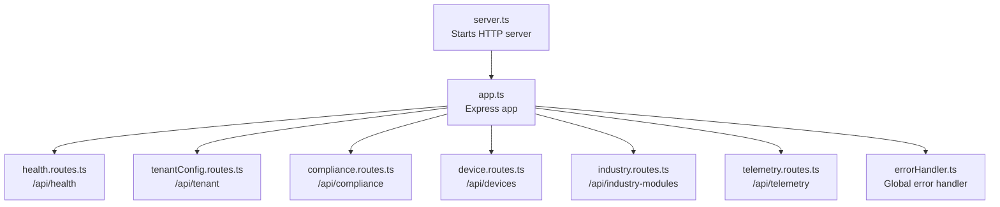
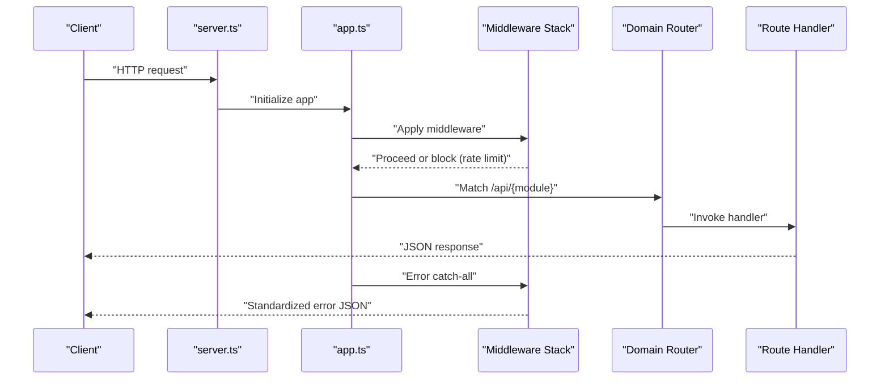
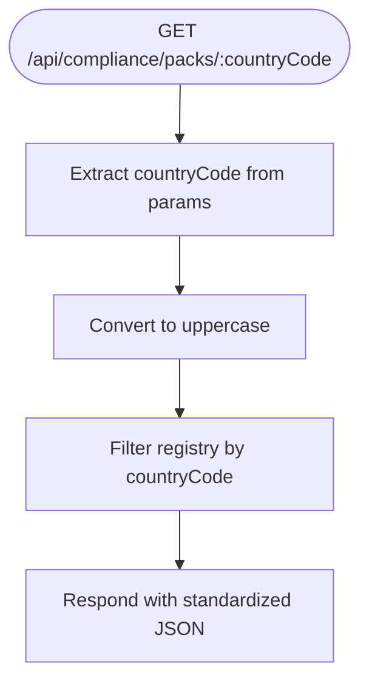
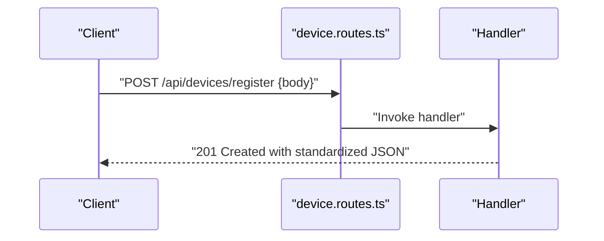
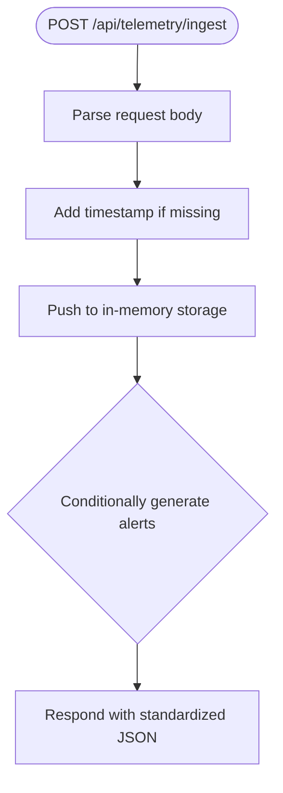
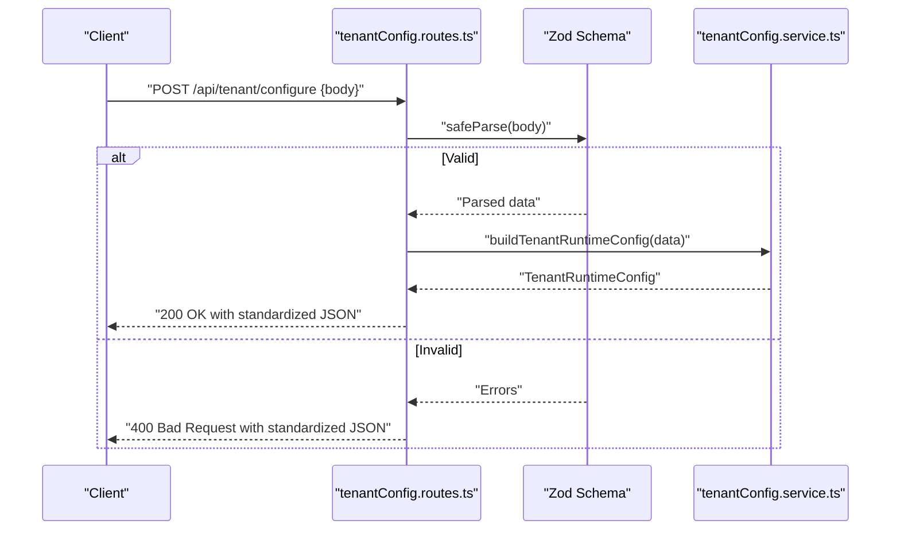
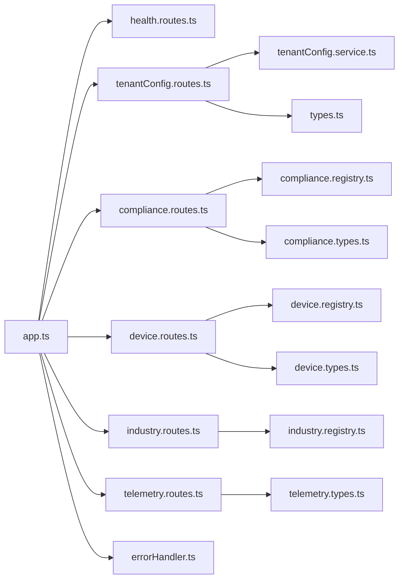

# Routing Architecture

<cite>
**Referenced Files in This Document**
- [app.ts](file://backend/src/app.ts)
- [server.ts](file://backend/src/server.ts)
- [errorHandler.ts](file://backend/src/middleware/errorHandler.ts)
- [compliance.routes.ts](file://backend/src/modules/compliance/compliance.routes.ts)
- [compliance.registry.ts](file://backend/src/modules/compliance/compliance.registry.ts)
- [compliance.types.ts](file://backend/src/modules/compliance/compliance.types.ts)
- [device.routes.ts](file://backend/src/modules/devices/device.routes.ts)
- [device.registry.ts](file://backend/src/modules/devices/device.registry.ts)
- [device.types.ts](file://backend/src/modules/devices/device.types.ts)
- [telemetry.routes.ts](file://backend/src/modules/telemetry/telemetry.routes.ts)
- [telemetry.types.ts](file://backend/src/modules/telemetry/telemetry.types.ts)
- [health.routes.ts](file://backend/src/modules/health/health.routes.ts)
- [industry.routes.ts](file://backend/src/modules/industry/industry.routes.ts)
- [industry.registry.ts](file://backend/src/modules/industry/industry.registry.ts)
- [tenantConfig.routes.ts](file://backend/src/modules/tenant-config/tenantConfig.routes.ts)
- [tenantConfig.service.ts](file://backend/src/modules/tenant-config/tenantConfig.service.ts)
- [types.ts](file://backend/src/modules/tenant-config/types.ts)
</cite>

## Table of Contents
1. [Introduction](#introduction)
2. [Project Structure](#project-structure)
3. [Core Components](#core-components)
4. [Architecture Overview](#architecture-overview)
5. [Detailed Component Analysis](#detailed-component-analysis)
6. [Dependency Analysis](#dependency-analysis)
7. [Performance Considerations](#performance-considerations)
8. [Troubleshooting Guide](#troubleshooting-guide)
9. [Conclusion](#conclusion)

## Introduction
This document describes the modular routing architecture of the Node.js backend. The system organizes routes by domain modules (compliance, devices, telemetry, health, industry, tenant-config) under a shared Express application. It explains route definition patterns, parameter handling, response formatting, middleware and rate limiting, authentication integration points, RESTful design principles, URL patterns, HTTP method usage, route composition, nested routing, dynamic route parameters, error handling, validation patterns, and response transformation.

## Project Structure
The backend exposes a single Express application that mounts routers for each domain module under standardized base paths. A global middleware stack applies security headers, CORS, logging, and a basic rate limiter. A dedicated error handler ensures consistent JSON responses for unhandled exceptions.

**Diagram sources**
- [server.ts:1-11](file://backend/src/server.ts#L1-L11)
- [app.ts:1-97](file://backend/src/app.ts#L1-L97)
- [health.routes.ts:1-19](file://backend/src/modules/health/health.routes.ts#L1-L19)
- [tenantConfig.routes.ts:1-58](file://backend/src/modules/tenant-config/tenantConfig.routes.ts#L1-L58)
- [compliance.routes.ts:1-24](file://backend/src/modules/compliance/compliance.routes.ts#L1-L24)
- [device.routes.ts:1-46](file://backend/src/modules/devices/device.routes.ts#L1-L46)
- [industry.routes.ts:1-14](file://backend/src/modules/industry/industry.routes.ts#L1-L14)
- [telemetry.routes.ts:1-59](file://backend/src/modules/telemetry/telemetry.routes.ts#L1-L59)
- [errorHandler.ts:1-17](file://backend/src/middleware/errorHandler.ts#L1-L17)

**Section sources**
- [app.ts:1-97](file://backend/src/app.ts#L1-L97)
- [server.ts:1-11](file://backend/src/server.ts#L1-L11)

## Core Components
- Express application initialization and middleware pipeline
- Global rate limiter middleware
- Router mounting per domain module
- Centralized error handling middleware

Key behaviors:
- Security headers and CSP via Helmet
- CORS configuration from environment
- JSON body parsing with size limits
- Morgan logging
- Basic rate limiter per client IP with configurable window and max requests
- Mounting of module routers under /api/{module}
- Dedicated GET /api/ready endpoint returning readiness payload
- Global error handler responding with standardized JSON

**Section sources**
- [app.ts:1-97](file://backend/src/app.ts#L1-L97)
- [errorHandler.ts:1-17](file://backend/src/middleware/errorHandler.ts#L1-L17)

## Architecture Overview
The routing architecture follows a layered pattern:
- Application bootstrap wires middleware and routes
- Domain routers define resource endpoints
- Shared middleware provides cross-cutting concerns (security, rate limiting, logging)
- Error handling is centralized

**Diagram sources**
- [server.ts:1-11](file://backend/src/server.ts#L1-L11)
- [app.ts:1-97](file://backend/src/app.ts#L1-L97)
- [errorHandler.ts:1-17](file://backend/src/middleware/errorHandler.ts#L1-L17)

## Detailed Component Analysis

### Health Module
- Base path: /api/health
- Routes:
  - GET /api/health/ → Returns service health status
- Response format: Standardized JSON with success flag, data, message, and empty errors array
- Notes: Health endpoint is mounted directly; no nested router is used here

**Section sources**
- [health.routes.ts:1-19](file://backend/src/modules/health/health.routes.ts#L1-L19)
- [app.ts:74-74](file://backend/src/app.ts#L74-L74)

### Compliance Module
- Base path: /api/compliance
- Routes:
  - GET /api/compliance/packs → Returns a static list of compliance packs
  - GET /api/compliance/packs/:countryCode → Filters packs by uppercase country code
- Data source: Static registry of compliance packs
- Parameter handling: Dynamic segment :countryCode normalized to uppercase
- Response format: Standardized JSON with success flag and data array

**Diagram sources**
- [compliance.routes.ts:13-21](file://backend/src/modules/compliance/compliance.routes.ts#L13-L21)
- [compliance.registry.ts:1-142](file://backend/src/modules/compliance/compliance.registry.ts#L1-L142)

**Section sources**
- [compliance.routes.ts:1-24](file://backend/src/modules/compliance/compliance.routes.ts#L1-L24)
- [compliance.registry.ts:1-142](file://backend/src/modules/compliance/compliance.registry.ts#L1-L142)
- [compliance.types.ts:1-13](file://backend/src/modules/compliance/compliance.types.ts#L1-L13)

### Devices Module
- Base path: /api/devices
- Routes:
  - GET /api/devices/types → Returns static device type catalog
  - POST /api/devices/register → Accepts JSON body with device registration fields, responds with created record
- Data source: Static registry of device types
- Body handling: Uses express.json() to parse request bodies
- Response format: Standardized JSON with success flag, optional message, and data object

**Diagram sources**
- [device.routes.ts:13-43](file://backend/src/modules/devices/device.routes.ts#L13-L43)
- [device.registry.ts:1-61](file://backend/src/modules/devices/device.registry.ts#L1-L61)

**Section sources**
- [device.routes.ts:1-46](file://backend/src/modules/devices/device.routes.ts#L1-L46)
- [device.registry.ts:1-61](file://backend/src/modules/devices/device.registry.ts#L1-L61)
- [device.types.ts:1-17](file://backend/src/modules/devices/device.types.ts#L1-L17)

### Telemetry Module
- Base path: /api/telemetry
- Routes:
  - POST /api/telemetry/ingest → Validates and stores telemetry events, optionally generates alerts
  - GET /api/telemetry/vehicle/:vehicleId → Returns stored events filtered by vehicleId
- Data model: Strongly typed telemetry event interface
- Parameter handling: Dynamic segment :vehicleId used for filtering
- Response format: Standardized JSON with success flag, optional message, and data object containing event and generated alerts

**Diagram sources**
- [telemetry.routes.ts:8-44](file://backend/src/modules/telemetry/telemetry.routes.ts#L8-L44)
- [telemetry.types.ts:1-50](file://backend/src/modules/telemetry/telemetry.types.ts#L1-L50)

**Section sources**
- [telemetry.routes.ts:1-59](file://backend/src/modules/telemetry/telemetry.routes.ts#L1-L59)
- [telemetry.types.ts:1-50](file://backend/src/modules/telemetry/telemetry.types.ts#L1-L50)

### Industry Module
- Base path: /api/industry-modules
- Routes:
  - GET /api/industry-modules/ → Returns static industry module definitions
- Data source: Static registry of industry definitions
- Response format: Standardized JSON with success flag and data array

**Section sources**
- [industry.routes.ts:1-14](file://backend/src/modules/industry/industry.routes.ts#L1-L14)
- [industry.registry.ts:1-52](file://backend/src/modules/industry/industry.registry.ts#L1-L52)

### Tenant Configuration Module
- Base path: /api/tenant
- Routes:
  - POST /api/tenant/configure → Validates request body against Zod schema, builds runtime config via service, responds with computed configuration
- Validation: Zod schema enforces required fields, enums, and arrays
- Response format: Standardized JSON with success flag and data object containing runtime configuration

**Diagram sources**
- [tenantConfig.routes.ts:38-55](file://backend/src/modules/tenant-config/tenantConfig.routes.ts#L38-L55)
- [tenantConfig.service.ts:25-64](file://backend/src/modules/tenant-config/tenantConfig.service.ts#L25-L64)
- [types.ts:1-68](file://backend/src/modules/tenant-config/types.ts#L1-L68)

**Section sources**
- [tenantConfig.routes.ts:1-58](file://backend/src/modules/tenant-config/tenantConfig.routes.ts#L1-L58)
- [tenantConfig.service.ts:1-65](file://backend/src/modules/tenant-config/tenantConfig.service.ts#L1-L65)
- [types.ts:1-68](file://backend/src/modules/tenant-config/types.ts#L1-L68)

## Dependency Analysis
- app.ts depends on:
  - Individual module routers for mounting
  - errorHandler for error propagation
- Module routers depend on:
  - Registry files for static catalogs
  - Service functions for computation (tenant-config)
  - Types for shape validation and documentation
- Cross-cutting dependencies:
  - express.json() for body parsing
  - Zod for validation in tenant-config
  - Helmet, CORS, Morgan for middleware

**Diagram sources**
- [app.ts:1-97](file://backend/src/app.ts#L1-L97)
- [health.routes.ts:1-19](file://backend/src/modules/health/health.routes.ts#L1-L19)
- [tenantConfig.routes.ts:1-58](file://backend/src/modules/tenant-config/tenantConfig.routes.ts#L1-L58)
- [tenantConfig.service.ts:1-65](file://backend/src/modules/tenant-config/tenantConfig.service.ts#L1-L65)
- [compliance.routes.ts:1-24](file://backend/src/modules/compliance/compliance.routes.ts#L1-L24)
- [compliance.registry.ts:1-142](file://backend/src/modules/compliance/compliance.registry.ts#L1-L142)
- [compliance.types.ts:1-13](file://backend/src/modules/compliance/compliance.types.ts#L1-L13)
- [device.routes.ts:1-46](file://backend/src/modules/devices/device.routes.ts#L1-L46)
- [device.registry.ts:1-61](file://backend/src/modules/devices/device.registry.ts#L1-L61)
- [device.types.ts:1-17](file://backend/src/modules/devices/device.types.ts#L1-L17)
- [industry.routes.ts:1-14](file://backend/src/modules/industry/industry.routes.ts#L1-L14)
- [industry.registry.ts:1-52](file://backend/src/modules/industry/industry.registry.ts#L1-L52)
- [telemetry.routes.ts:1-59](file://backend/src/modules/telemetry/telemetry.routes.ts#L1-L59)
- [telemetry.types.ts:1-50](file://backend/src/modules/telemetry/telemetry.types.ts#L1-L50)
- [errorHandler.ts:1-17](file://backend/src/middleware/errorHandler.ts#L1-L17)

**Section sources**
- [app.ts:1-97](file://backend/src/app.ts#L1-L97)

## Performance Considerations
- Rate limiting: Implemented per-IP with a sliding window and configurable thresholds. Requests outside the /api/health, /api/ready, /api/auth/login, and GET /api/customer-eta/track/ bypasses are subject to rate limiting.
- Body parsing: JSON body parser with a 5 MB limit applied globally.
- Logging: Morgan in dev mode; consider switching to a production logger for throughput.
- In-memory storage: Telemetry ingestion uses an in-memory array; consider persistence for production reliability.
- Static catalogs: Registry-driven endpoints avoid database overhead but rely on memory.

**Section sources**
- [app.ts:17-72](file://backend/src/app.ts#L17-L72)
- [telemetry.routes.ts:6-6](file://backend/src/modules/telemetry/telemetry.routes.ts#L6-L6)

## Troubleshooting Guide
- Standardized error responses: All unhandled errors are caught by the global error handler and returned as JSON with a 500 status.
- Validation failures: Tenant configuration endpoint returns structured validation errors when the request does not match the Zod schema.
- Health and readiness:
  - GET /api/health returns service health
  - GET /api/ready returns a readiness payload indicating service status and timestamp
- CORS and headers: Verify FRONTEND_URL environment variable and credentials setting for CORS; Helmet sets security headers globally.

**Section sources**
- [errorHandler.ts:1-17](file://backend/src/middleware/errorHandler.ts#L1-L17)
- [tenantConfig.routes.ts:41-47](file://backend/src/modules/tenant-config/tenantConfig.routes.ts#L41-L47)
- [app.ts:74-89](file://backend/src/app.ts#L74-L89)
- [health.routes.ts:5-16](file://backend/src/modules/health/health.routes.ts#L5-L16)

## Conclusion
The routing architecture cleanly separates concerns by domain modules while centralizing cross-cutting middleware and error handling. RESTful patterns are consistently applied with standardized JSON responses, dynamic route parameters, and validation where appropriate. The design supports easy extension with new modules and maintains predictable behavior for clients.