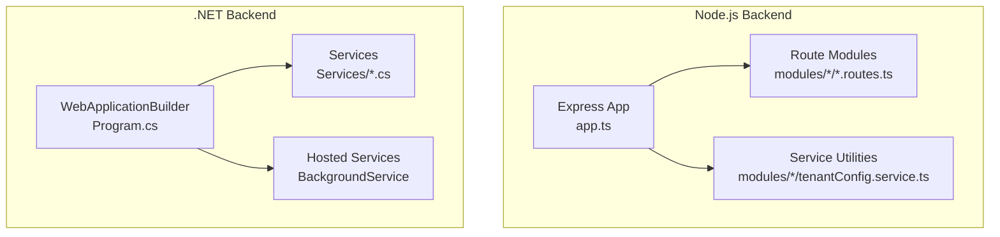
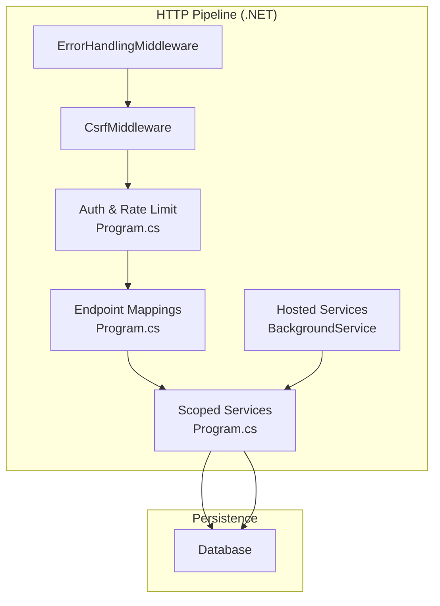
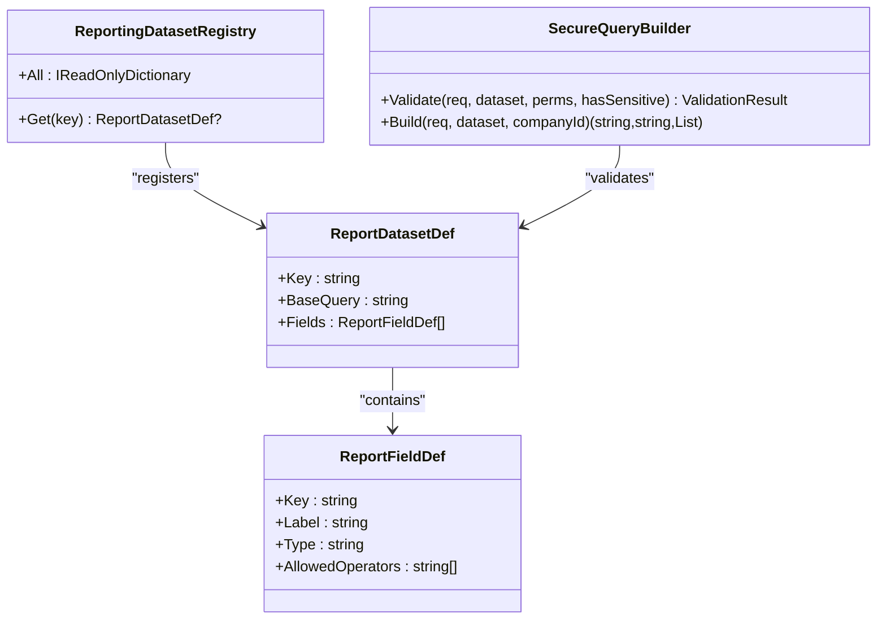
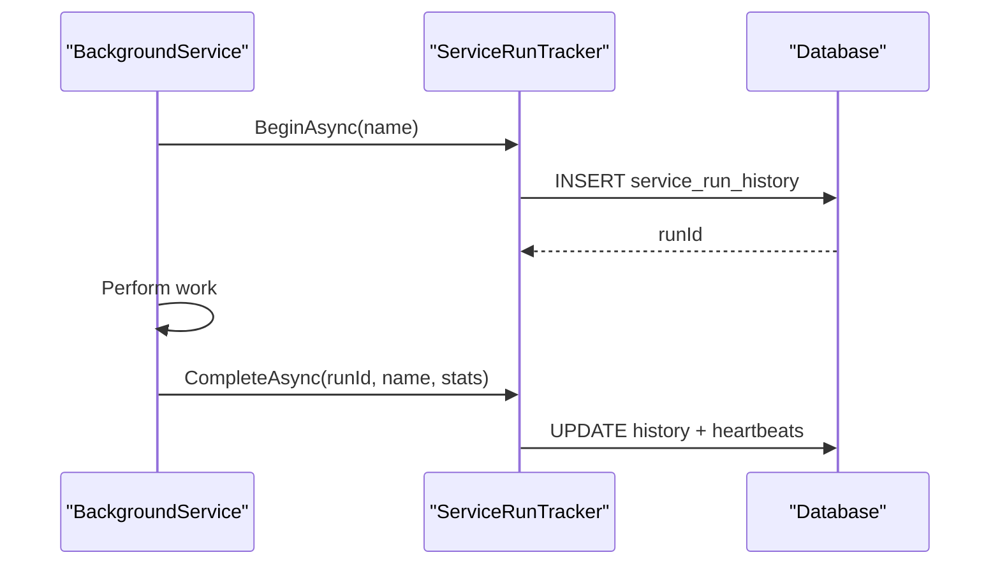
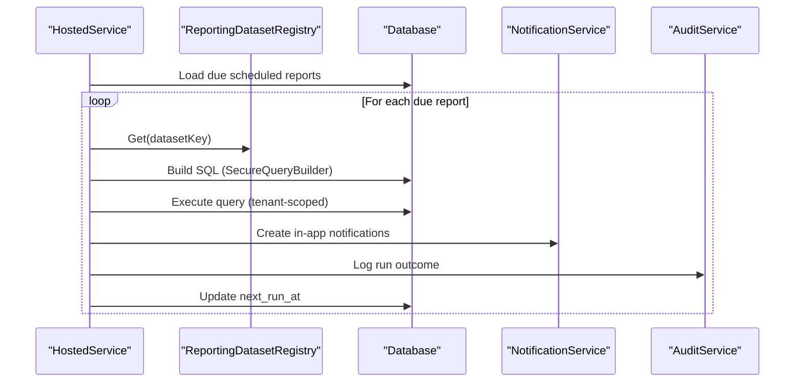
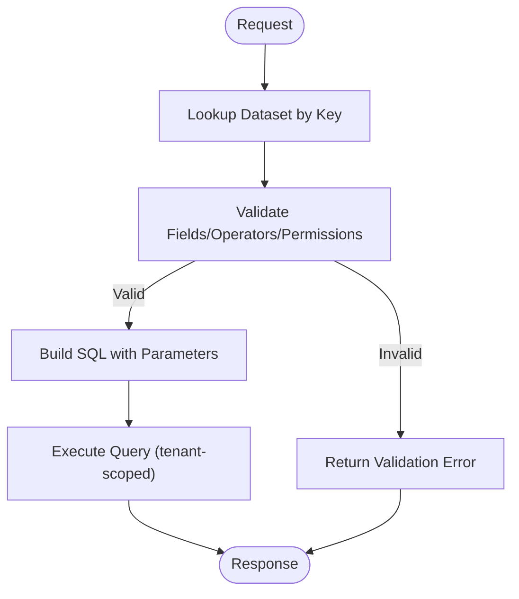
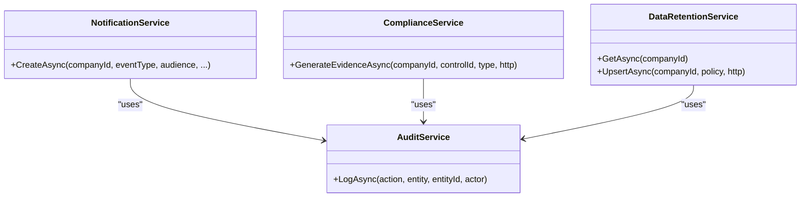
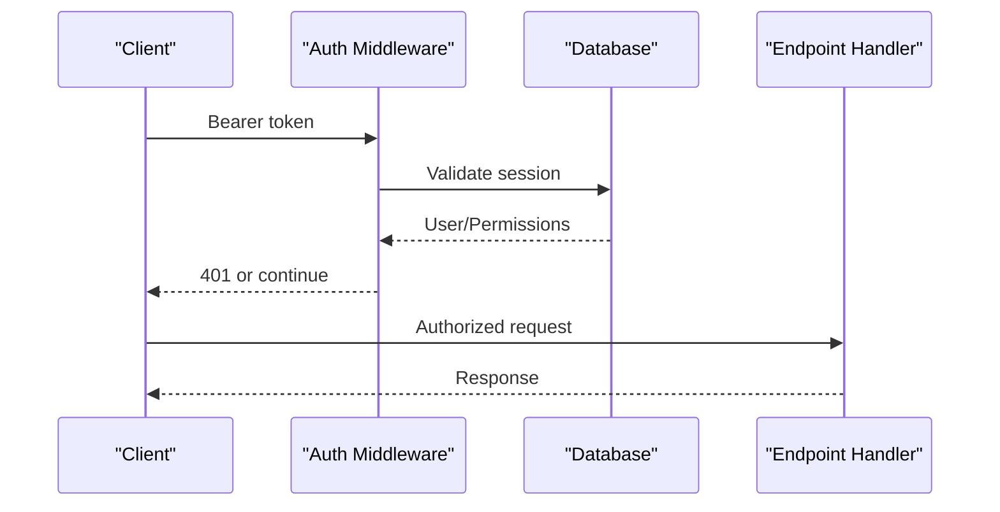
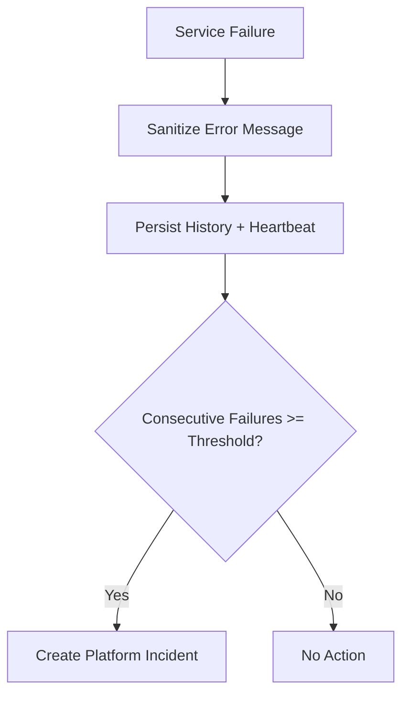
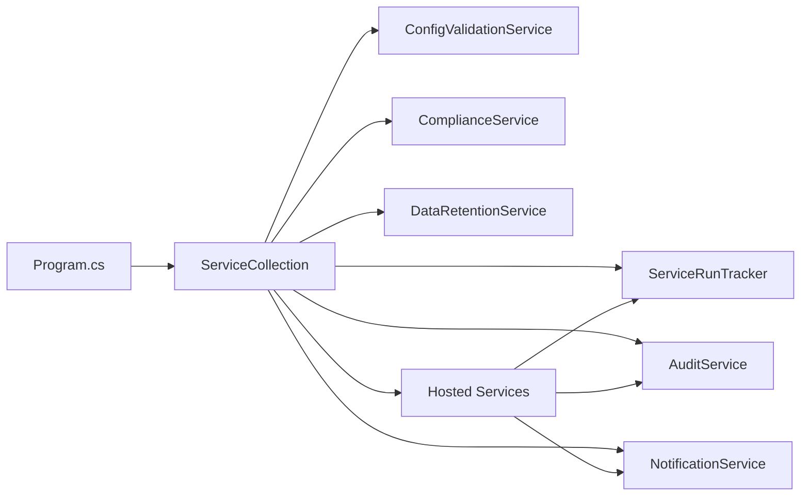

# Service Layer Architecture

<cite>
**Referenced Files in This Document**
- [Program.cs](file://backend-dotnet/Program.cs)
- [ServiceRunTracker.cs](file://backend-dotnet/Services/ServiceRunTracker.cs)
- [TelemetryBackgroundService.cs](file://backend-dotnet/Services/TelemetryBackgroundService.cs)
- [ScheduledReportBackgroundService.cs](file://backend-dotnet/Services/ScheduledReportBackgroundService.cs)
- [ReportingDatasetRegistry.cs](file://backend-dotnet/Services/ReportingDatasetRegistry.cs)
- [ConfigValidationService.cs](file://backend-dotnet/Services/ConfigValidationService.cs)
- [AuditService.cs](file://backend-dotnet/Services/AuditService.cs)
- [NotificationService.cs](file://backend-dotnet/Services/NotificationService.cs)
- [ComplianceService.cs](file://backend-dotnet/Services/ComplianceService.cs)
- [DataRetentionService.cs](file://backend-dotnet/Services/DataRetentionService.cs)
- [app.ts](file://backend/src/app.ts)
- [compliance.registry.ts](file://backend/src/modules/compliance/compliance.registry.ts)
- [compliance.types.ts](file://backend/src/modules/compliance/compliance.types.ts)
- [tenantConfig.service.ts](file://backend/src/modules/tenant-config/tenantConfig.service.ts)
- [ApiResponse.cs](file://backend-dotnet/DTOs/ApiResponse.cs)
</cite>

## Table of Contents
1. [Introduction](#introduction)
2. [Project Structure](#project-structure)
3. [Core Components](#core-components)
4. [Architecture Overview](#architecture-overview)
5. [Detailed Component Analysis](#detailed-component-analysis)
6. [Dependency Analysis](#dependency-analysis)
7. [Performance Considerations](#performance-considerations)
8. [Troubleshooting Guide](#troubleshooting-guide)
9. [Conclusion](#conclusion)

## Introduction
This document explains the service layer architecture across both backend implementations. It focuses on service abstractions, business logic encapsulation, dependency injection, background services and scheduled tasks, asynchronous processing, registry patterns, transformation/validation utilities, integration services, caching strategies, retry policies, error handling, service composition, cross-cutting concerns, and performance optimization techniques.

## Project Structure
The repository includes two backend implementations:
- Node.js backend under backend/src, using Express and route-driven modules.
- .NET backend under backend-dotnet, using ASP.NET Core with DI, hosted services, and strongly typed services.

**Diagram sources**
- [app.ts:16-97](file://backend/src/app.ts#L16-L97)
- [Program.cs:10-65](file://backend-dotnet/Program.cs#L10-L65)

**Section sources**
- [app.ts:16-97](file://backend/src/app.ts#L16-L97)
- [Program.cs:10-65](file://backend-dotnet/Program.cs#L10-L65)

## Core Components
- Service abstractions: Strongly typed services encapsulate domain logic (e.g., compliance, notifications, reporting).
- Business logic encapsulation: Services operate on domain entities and enforce tenant scoping and permissions.
- Dependency injection: .NET DI registers services with lifetimes; Node.js uses module-level singletons and route wiring.
- Background services: Hosted services perform periodic tasks (e.g., telemetry housekeeping, scheduled reports).
- Registry patterns: Central registries define datasets and compliance packs for configuration and validation.
- Transformation/validation: Secure query builder validates and builds parameterized SQL; tenant config builder composes runtime configuration.
- Integration services: Audit, notification, and compliance services integrate with persistence and cross-service concerns.
- Caching/retry: Not implemented in the examined services; potential for future enhancement.
- Error handling: Centralized middleware and service-run tracking with sanitized error persistence.

**Section sources**
- [Program.cs:14-54](file://backend-dotnet/Program.cs#L14-L54)
- [ServiceRunTracker.cs:22-50](file://backend-dotnet/Services/ServiceRunTracker.cs#L22-L50)
- [ReportingDatasetRegistry.cs:117-131](file://backend-dotnet/Services/ReportingDatasetRegistry.cs#L117-L131)
- [tenantConfig.service.ts:25-64](file://backend/src/modules/tenant-config/tenantConfig.service.ts#L25-L64)

## Architecture Overview
The .NET backend uses a layered architecture with DI, middleware, hosted services, and service abstractions. The Node.js backend uses Express with modular routes and lightweight service utilities.

**Diagram sources**
- [Program.cs:101-245](file://backend-dotnet/Program.cs#L101-L245)
- [Program.cs:49-54](file://backend-dotnet/Program.cs#L49-L54)

**Section sources**
- [Program.cs:101-245](file://backend-dotnet/Program.cs#L101-L245)
- [Program.cs:49-54](file://backend-dotnet/Program.cs#L49-L54)

## Detailed Component Analysis

### Service Abstraction Patterns and Business Logic Encapsulation
- Strong typing and immutability: Services expose pure methods with clearly defined inputs and outputs. Examples include reporting dataset definitions and query builders, compliance evidence collection, and retention policy models.
- Tenant scoping: Services inject tenant identifiers server-side to prevent unauthorized access.
- Permission-aware operations: Services validate caller permissions before exposing sensitive fields or performing privileged actions.

**Diagram sources**
- [ReportingDatasetRegistry.cs:117-131](file://backend-dotnet/Services/ReportingDatasetRegistry.cs#L117-L131)
- [ReportingDatasetRegistry.cs:46-65](file://backend-dotnet/Services/ReportingDatasetRegistry.cs#L46-L65)
- [ReportingDatasetRegistry.cs:27-42](file://backend-dotnet/Services/ReportingDatasetRegistry.cs#L27-L42)
- [ReportingDatasetRegistry.cs:567-793](file://backend-dotnet/Services/ReportingDatasetRegistry.cs#L567-L793)

**Section sources**
- [ReportingDatasetRegistry.cs:117-131](file://backend-dotnet/Services/ReportingDatasetRegistry.cs#L117-L131)
- [ReportingDatasetRegistry.cs:567-793](file://backend-dotnet/Services/ReportingDatasetRegistry.cs#L567-L793)

### Dependency Injection Usage
- .NET DI registrations:
  - Singletons: Schema services, trackers, validators.
  - Scoped: Services requiring HTTP context or tenant-scoped resources.
  - Hosted services: Background services registered via AddHostedService.
- ServiceRunTracker is injected into hosted services to record lifecycle metrics and errors.

**Diagram sources**
- [TelemetryBackgroundService.cs:17-44](file://backend-dotnet/Services/TelemetryBackgroundService.cs#L17-L44)
- [ServiceRunTracker.cs:33-109](file://backend-dotnet/Services/ServiceRunTracker.cs#L33-L109)

**Section sources**
- [Program.cs:14-54](file://backend-dotnet/Program.cs#L14-L54)
- [ServiceRunTracker.cs:22-50](file://backend-dotnet/Services/ServiceRunTracker.cs#L22-L50)

### Background Services and Scheduled Tasks
- TelemetryBackgroundService: Periodic checks for stale devices and nonce pruning.
- ScheduledReportBackgroundService: Executes scheduled reports, resolves recipients, and logs outcomes.
- Both services use ServiceRunTracker for lifecycle auditing and failure escalation.

**Diagram sources**
- [ScheduledReportBackgroundService.cs:63-120](file://backend-dotnet/Services/ScheduledReportBackgroundService.cs#L63-L120)
- [ScheduledReportBackgroundService.cs:122-256](file://backend-dotnet/Services/ScheduledReportBackgroundService.cs#L122-L256)
- [ReportingDatasetRegistry.cs:567-793](file://backend-dotnet/Services/ReportingDatasetRegistry.cs#L567-L793)

**Section sources**
- [TelemetryBackgroundService.cs:17-102](file://backend-dotnet/Services/TelemetryBackgroundService.cs#L17-L102)
- [ScheduledReportBackgroundService.cs:26-61](file://backend-dotnet/Services/ScheduledReportBackgroundService.cs#L26-L61)

### Registry Patterns
- ReportingDatasetRegistry: Central registry of datasets and fields with strict validation and secure SQL building.
- Compliance registry (Node.js): Defines compliance packs and capabilities for tenant configuration.

**Diagram sources**
- [ReportingDatasetRegistry.cs:582-656](file://backend-dotnet/Services/ReportingDatasetRegistry.cs#L582-L656)
- [ReportingDatasetRegistry.cs:660-793](file://backend-dotnet/Services/ReportingDatasetRegistry.cs#L660-L793)

**Section sources**
- [compliance.registry.ts:1-142](file://backend/src/modules/compliance/compliance.registry.ts#L1-L142)
- [compliance.types.ts:1-13](file://backend/src/modules/compliance/compliance.types.ts#L1-L13)

### Data Transformation, Validation, and Utility Services
- SecureQueryBuilder: Validates request bodies and constructs parameterized SQL to prevent injection.
- NotificationService: Deduplicates, sanitizes, and delivers notifications to targeted users or roles.
- AuditService: Logs auditable events with tenant and actor context.
- ComplianceService: Aggregates evidence from system tables and computes deterministic hashes.
- DataRetentionService: Manages tenant retention policies with legal hold safeguards.

**Diagram sources**
- [NotificationService.cs:11-121](file://backend-dotnet/Services/NotificationService.cs#L11-L121)
- [AuditService.cs:9-21](file://backend-dotnet/Services/AuditService.cs#L9-L21)
- [ComplianceService.cs:80-131](file://backend-dotnet/Services/ComplianceService.cs#L80-L131)
- [DataRetentionService.cs:30-112](file://backend-dotnet/Services/DataRetentionService.cs#L30-L112)

**Section sources**
- [NotificationService.cs:11-121](file://backend-dotnet/Services/NotificationService.cs#L11-L121)
- [AuditService.cs:9-21](file://backend-dotnet/Services/AuditService.cs#L9-L21)
- [ComplianceService.cs:80-131](file://backend-dotnet/Services/ComplianceService.cs#L80-L131)
- [DataRetentionService.cs:30-112](file://backend-dotnet/Services/DataRetentionService.cs#L30-L112)

### Integration Services and External Systems
- Authentication and authorization pipeline:
  - Session-based auth with bearer tokens for most endpoints.
  - Special handling for telemetry SSE via short-lived stream tickets.
- Configuration validation service integrates with runtime configuration to detect misconfigurations.
- Audit service centralizes audit logging for compliance and observability.

**Diagram sources**
- [Program.cs:174-243](file://backend-dotnet/Program.cs#L174-L243)

**Section sources**
- [Program.cs:174-243](file://backend-dotnet/Program.cs#L174-L243)
- [ConfigValidationService.cs:15-96](file://backend-dotnet/Services/ConfigValidationService.cs#L15-L96)

### Caching Strategies, Retry Policies, and Error Handling
- Caching: No cache layer observed in the examined services.
- Retry policies: No explicit retry logic observed in the examined services.
- Error handling:
  - Centralized middleware handles unhandled exceptions.
  - ServiceRunTracker records sanitized errors and escalates persistent failures into platform incidents.
  - API responses consistently use ApiResponse<T> for uniformity.

**Diagram sources**
- [ServiceRunTracker.cs:112-179](file://backend-dotnet/Services/ServiceRunTracker.cs#L112-L179)
- [ServiceRunTracker.cs:184-203](file://backend-dotnet/Services/ServiceRunTracker.cs#L184-L203)

**Section sources**
- [ServiceRunTracker.cs:112-179](file://backend-dotnet/Services/ServiceRunTracker.cs#L112-L179)
- [ApiResponse.cs:3-7](file://backend-dotnet/DTOs/ApiResponse.cs#L3-L7)

### Service Composition and Cross-Cutting Concerns
- Tenant isolation: All queries apply tenant scoping server-side; no client-provided overrides.
- Permission enforcement: Services validate caller permissions before exposing sensitive fields.
- Auditability: AuditService logs all auditable actions with actor and details JSON.
- Security: Input validation, parameterized queries, and sanitized error persistence.

**Section sources**
- [ReportingDatasetRegistry.cs:16-22](file://backend-dotnet/Services/ReportingDatasetRegistry.cs#L16-L22)
- [AuditService.cs:23-46](file://backend-dotnet/Services/AuditService.cs#L23-L46)
- [ServiceRunTracker.cs:17-19](file://backend-dotnet/Services/ServiceRunTracker.cs#L17-L19)

### Performance Considerations
- Parameterized queries and strict validation reduce CPU and memory overhead.
- Tenant scoping applied server-side prevents accidental cross-tenant scans.
- Background services throttle execution with fixed intervals to avoid contention.
- Max page sizes and field limits constrain resource usage in reporting.

**Section sources**
- [ReportingDatasetRegistry.cs:567-578](file://backend-dotnet/Services/ReportingDatasetRegistry.cs#L567-L578)
- [TelemetryBackgroundService.cs:14-15](file://backend-dotnet/Services/TelemetryBackgroundService.cs#L14-L15)

## Dependency Analysis
- .NET DI graph:
  - Program.cs registers services and hosted services.
  - Services depend on Database and each other via constructor injection.
  - Hosted services depend on ServiceRunTracker and scoped services via IServiceScopeFactory.

**Diagram sources**
- [Program.cs:14-54](file://backend-dotnet/Program.cs#L14-L54)
- [Program.cs:49-54](file://backend-dotnet/Program.cs#L49-L54)

**Section sources**
- [Program.cs:14-54](file://backend-dotnet/Program.cs#L14-L54)

## Performance Considerations
- Prefer parameterized queries and strict validation to minimize injection risk and improve plan reuse.
- Apply tenant scoping server-side to avoid expensive filtering in application code.
- Use background services for heavy tasks and schedule them with fixed intervals.
- Enforce max field/filter/page limits to cap query complexity.

## Troubleshooting Guide
- Health endpoints:
  - /health, /health/live, /health/ready, /health/deep provide status and diagnostics.
- Deep health checks include database connectivity, service heartbeats, and configuration validation results.
- ServiceRunTracker records sanitized error messages and escalates persistent failures.

**Section sources**
- [Program.cs:257-378](file://backend-dotnet/Program.cs#L257-L378)
- [ServiceRunTracker.cs:112-179](file://backend-dotnet/Services/ServiceRunTracker.cs#L112-L179)
- [ConfigValidationService.cs:15-96](file://backend-dotnet/Services/ConfigValidationService.cs#L15-L96)

## Conclusion
The service layer employs strong abstractions, centralized validation, and tenant-scoped operations to deliver robust, secure, and observable functionality. DI and hosted services enable scalable background processing, while registries and secure query builders enforce correctness and performance. Future enhancements can introduce caching and retry policies to further optimize throughput and resilience.