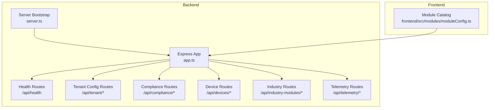
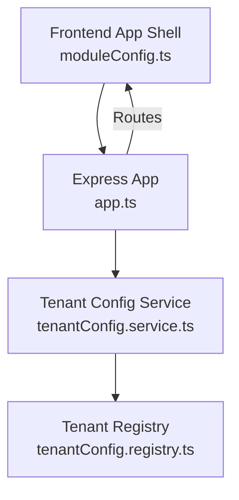
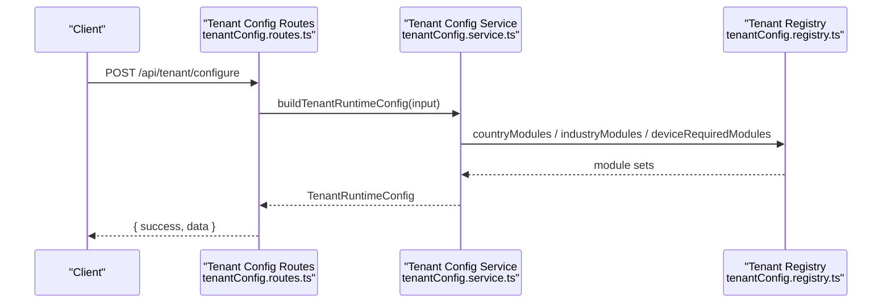
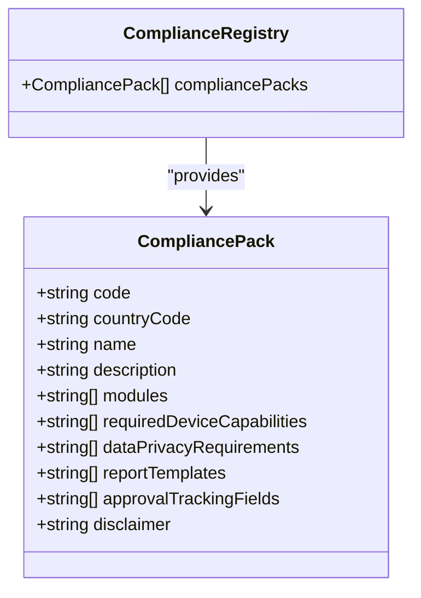
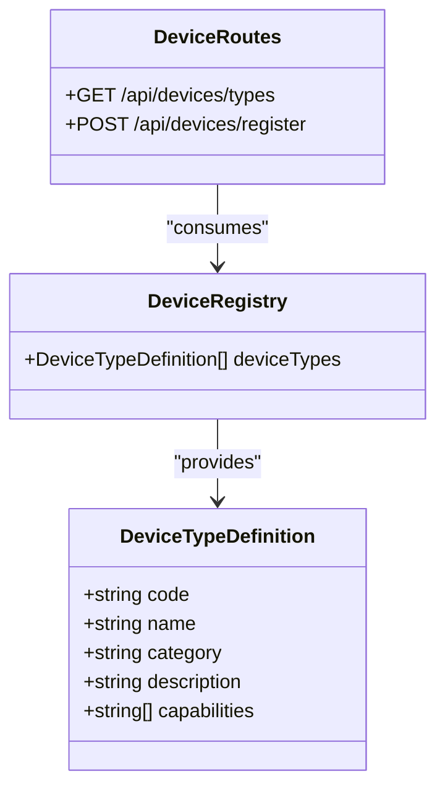
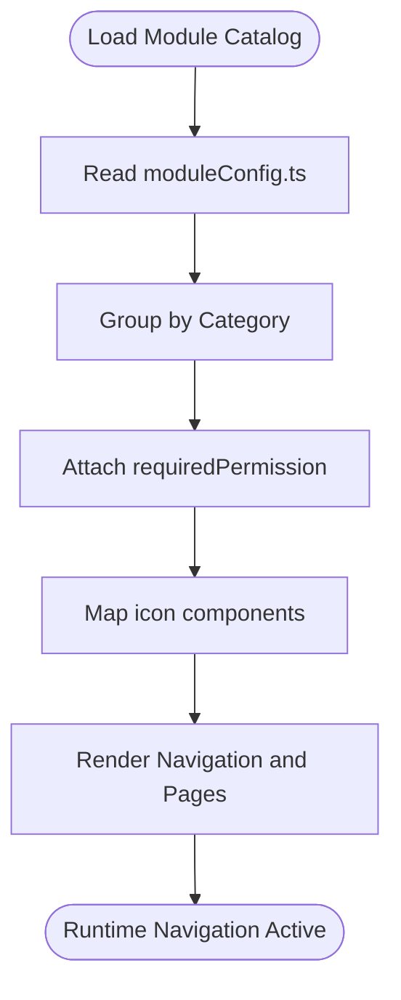
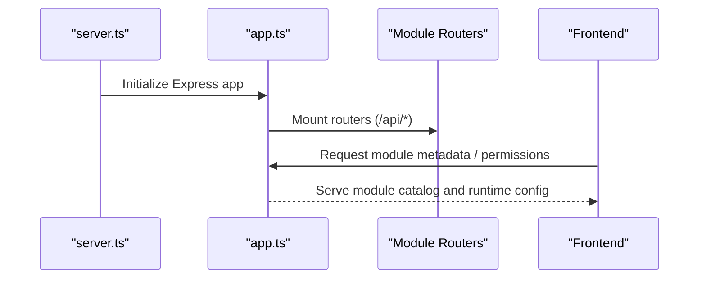
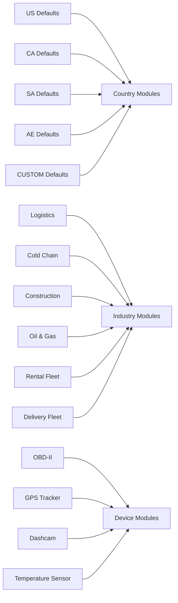
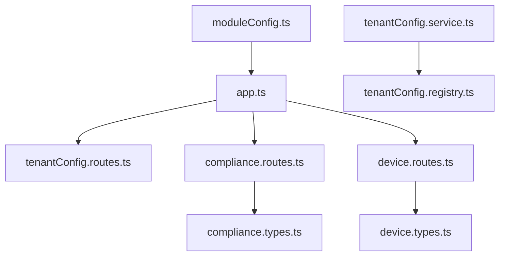

# Core Modules

<cite>
**Referenced Files in This Document**
- [MODULE_COVERAGE_MATRIX.md](file://docs/MODULE_COVERAGE_MATRIX.md)
- [PRODUCT_MODULES.md](file://docs/PRODUCT_MODULES.md)
- [moduleConfig.ts](file://frontend/src/modules/moduleConfig.ts)
- [app.ts](file://backend/src/app.ts)
- [server.ts](file://backend/src/server.ts)
- [tenantConfig.routes.ts](file://backend/src/modules/tenant-config/tenantConfig.routes.ts)
- [tenantConfig.service.ts](file://backend/src/modules/tenant-config/tenantConfig.service.ts)
- [tenantConfig.registry.ts](file://backend/src/modules/tenant-config/tenantConfig.registry.ts)
- [compliance.registry.ts](file://backend/src/modules/compliance/compliance.registry.ts)
- [compliance.routes.ts](file://backend/src/modules/compliance/compliance.routes.ts)
- [compliance.types.ts](file://backend/src/modules/compliance/compliance.types.ts)
- [device.registry.ts](file://backend/src/modules/devices/device.registry.ts)
- [device.routes.ts](file://backend/src/modules/devices/device.routes.ts)
- [device.types.ts](file://backend/src/modules/devices/device.types.ts)
- [tenantConfig.types.ts](file://backend/src/modules/tenant-config/types.ts)
</cite>

## Table of Contents
1. [Introduction](#introduction)
2. [Project Structure](#project-structure)
3. [Core Components](#core-components)
4. [Architecture Overview](#architecture-overview)
5. [Detailed Component Analysis](#detailed-component-analysis)
6. [Dependency Analysis](#dependency-analysis)
7. [Performance Considerations](#performance-considerations)
8. [Troubleshooting Guide](#troubleshooting-guide)
9. [Conclusion](#conclusion)
10. [Appendices](#appendices)

## Introduction
This document explains the OpsTrax core modules across the enterprise product, focusing on the module-based architecture, configuration management, and dynamic loading patterns. It synthesizes the module coverage matrix, categorization, tenant-specific availability, and module dependencies. It also documents the module lifecycle, initialization patterns, and integration points with the broader system, including configuration options, customization capabilities, and extension points.

## Project Structure
The repository organizes the backend around a modular Express application with explicit module routers and a central app bootstrap. The frontend defines a canonical module catalog with grouping, routing, icons, and permission requirements. Configuration management is implemented in the tenant-config module, which computes a runtime configuration from country defaults, industry profiles, and device capabilities.

**Diagram sources**
- [app.ts:16-97](file://backend/src/app.ts#L16-L97)
- [server.ts:1-11](file://backend/src/server.ts#L1-L11)
- [moduleConfig.ts:52-134](file://frontend/src/modules/moduleConfig.ts#L52-L134)

**Section sources**
- [app.ts:16-97](file://backend/src/app.ts#L16-L97)
- [server.ts:1-11](file://backend/src/server.ts#L1-L11)
- [moduleConfig.ts:52-134](file://frontend/src/modules/moduleConfig.ts#L52-L134)

## Core Components
- Backend module routers expose tenant configuration, compliance packs, device types, industry modules, and telemetry endpoints.
- Frontend module catalog defines module keys, routes, groups, descriptions, accents, and required permissions.
- Tenant configuration service computes a runtime configuration from country defaults, industries, and device types.

Key implementation references:
- Backend app wiring and middleware: [app.ts:16-97](file://backend/src/app.ts#L16-L97)
- Server bootstrap: [server.ts:1-11](file://backend/src/server.ts#L1-L11)
- Tenant configuration routes and schema: [tenantConfig.routes.ts:1-58](file://backend/src/modules/tenant-config/tenantConfig.routes.ts#L1-L58)
- Tenant configuration service: [tenantConfig.service.ts:25-64](file://backend/src/modules/tenant-config/tenantConfig.service.ts#L25-L64)
- Tenant configuration registry: [tenantConfig.registry.ts:9-178](file://backend/src/modules/tenant-config/tenantConfig.registry.ts#L9-L178)
- Compliance registry and routes: [compliance.registry.ts:1-142](file://backend/src/modules/compliance/compliance.registry.ts#L1-L142), [compliance.routes.ts:1-24](file://backend/src/modules/compliance/compliance.routes.ts#L1-L24)
- Device registry and routes: [device.registry.ts:1-61](file://backend/src/modules/devices/device.registry.ts#L1-L61), [device.routes.ts:1-46](file://backend/src/modules/devices/device.routes.ts#L1-L46)
- Frontend module catalog: [moduleConfig.ts:52-214](file://frontend/src/modules/moduleConfig.ts#L52-L214)

**Section sources**
- [app.ts:16-97](file://backend/src/app.ts#L16-L97)
- [server.ts:1-11](file://backend/src/server.ts#L1-L11)
- [tenantConfig.routes.ts:1-58](file://backend/src/modules/tenant-config/tenantConfig.routes.ts#L1-L58)
- [tenantConfig.service.ts:25-64](file://backend/src/modules/tenant-config/tenantConfig.service.ts#L25-L64)
- [tenantConfig.registry.ts:9-178](file://backend/src/modules/tenant-config/tenantConfig.registry.ts#L9-L178)
- [compliance.registry.ts:1-142](file://backend/src/modules/compliance/compliance.registry.ts#L1-L142)
- [compliance.routes.ts:1-24](file://backend/src/modules/compliance/compliance.routes.ts#L1-L24)
- [device.registry.ts:1-61](file://backend/src/modules/devices/device.registry.ts#L1-L61)
- [device.routes.ts:1-46](file://backend/src/modules/devices/device.routes.ts#L1-L46)
- [moduleConfig.ts:52-214](file://frontend/src/modules/moduleConfig.ts#L52-L214)

## Architecture Overview
OpsTrax employs a module-first backend architecture:
- Central app mounts module routers under /api/<module>.
- Tenant configuration is computed server-side from country defaults, industries, and device types.
- Frontend consumes module metadata and permissions to drive navigation, rendering, and access control.

**Diagram sources**
- [moduleConfig.ts:52-134](file://frontend/src/modules/moduleConfig.ts#L52-L134)
- [tenantConfig.service.ts:25-64](file://backend/src/modules/tenant-config/tenantConfig.service.ts#L25-L64)
- [tenantConfig.registry.ts:9-178](file://backend/src/modules/tenant-config/tenantConfig.registry.ts#L9-L178)
- [app.ts:90-94](file://backend/src/app.ts#L90-L94)

**Section sources**
- [app.ts:90-94](file://backend/src/app.ts#L90-L94)
- [tenantConfig.service.ts:25-64](file://backend/src/modules/tenant-config/tenantConfig.service.ts#L25-L64)
- [tenantConfig.registry.ts:9-178](file://backend/src/modules/tenant-config/tenantConfig.registry.ts#L9-L178)
- [moduleConfig.ts:52-134](file://frontend/src/modules/moduleConfig.ts#L52-L134)

## Detailed Component Analysis

### Module Categorization and Coverage
The product modules are categorized into Command, Dispatch, Fleet, Maintenance, Safety, Compliance, Finance, Intelligence, and Platform. The module coverage matrix documents feature availability across tenant configurations and highlights gaps.

**Diagram sources**
- [PRODUCT_MODULES.md:1-66](file://docs/PRODUCT_MODULES.md#L1-L66)
- [MODULE_COVERAGE_MATRIX.md:201-244](file://docs/MODULE_COVERAGE_MATRIX.md#L201-L244)

**Section sources**
- [PRODUCT_MODULES.md:1-66](file://docs/PRODUCT_MODULES.md#L1-L66)
- [MODULE_COVERAGE_MATRIX.md:201-244](file://docs/MODULE_COVERAGE_MATRIX.md#L201-L244)

### Tenant Configuration and Dynamic Loading
Tenant configuration is built from:
- Country defaults (currency, timezone, languages, compliance pack)
- Enabled industries (logistics, cold_chain, etc.)
- Enabled device types (OBD-II, GPS tracker, dashcam, etc.)

The service aggregates required modules and compliance packs, returning a runtime configuration consumed by the frontend and backend.

**Diagram sources**
- [tenantConfig.routes.ts:38-55](file://backend/src/modules/tenant-config/tenantConfig.routes.ts#L38-L55)
- [tenantConfig.service.ts:25-64](file://backend/src/modules/tenant-config/tenantConfig.service.ts#L25-L64)
- [tenantConfig.registry.ts:66-178](file://backend/src/modules/tenant-config/tenantConfig.registry.ts#L66-L178)

**Section sources**
- [tenantConfig.routes.ts:38-55](file://backend/src/modules/tenant-config/tenantConfig.routes.ts#L38-L55)
- [tenantConfig.service.ts:25-64](file://backend/src/modules/tenant-config/tenantConfig.service.ts#L25-L64)
- [tenantConfig.registry.ts:66-178](file://backend/src/modules/tenant-config/tenantConfig.registry.ts#L66-L178)

### Compliance Packs and Country-Specific Modules
Compliance packs define modules, device capabilities, privacy requirements, report templates, and approval tracking fields per country. The compliance routes expose pack catalogs and filtered lists by country.

**Diagram sources**
- [compliance.types.ts:1-13](file://backend/src/modules/compliance/compliance.types.ts#L1-L13)
- [compliance.registry.ts:3-141](file://backend/src/modules/compliance/compliance.registry.ts#L3-L141)

**Section sources**
- [compliance.registry.ts:3-141](file://backend/src/modules/compliance/compliance.registry.ts#L3-L141)
- [compliance.routes.ts:6-21](file://backend/src/modules/compliance/compliance.routes.ts#L6-L21)
- [compliance.types.ts:1-13](file://backend/src/modules/compliance/compliance.types.ts#L1-L13)

### Device Types and Required Modules
Device registries enumerate device categories and capabilities. The tenant configuration maps device types to required modules, enabling dynamic module activation based on installed hardware.

**Diagram sources**
- [device.types.ts:1-17](file://backend/src/modules/devices/device.types.ts#L1-L17)
- [device.registry.ts:3-60](file://backend/src/modules/devices/device.registry.ts#L3-L60)
- [device.routes.ts:6-43](file://backend/src/modules/devices/device.routes.ts#L6-L43)

**Section sources**
- [device.registry.ts:3-60](file://backend/src/modules/devices/device.registry.ts#L3-L60)
- [device.routes.ts:6-43](file://backend/src/modules/devices/device.routes.ts#L6-L43)
- [device.types.ts:1-17](file://backend/src/modules/devices/device.types.ts#L1-L17)

### Frontend Module Catalog and Permission Model
The frontend module catalog defines:
- Module keys and routes
- Grouping (Operations, Fleet, Safety & Compliance, Financials, Intelligence, Governance)
- Descriptions, accents, and required permissions
- Icon mapping for UI presentation

**Diagram sources**
- [moduleConfig.ts:52-214](file://frontend/src/modules/moduleConfig.ts#L52-L214)

**Section sources**
- [moduleConfig.ts:52-214](file://frontend/src/modules/moduleConfig.ts#L52-L214)

### Module Lifecycle and Initialization Patterns
- Backend initialization: server bootstraps the Express app, applies middleware, and mounts module routers.
- Tenant configuration: client sends a configuration request; backend validates and computes runtime config.
- Frontend: consumes module metadata to initialize navigation and enforce permission gates.

**Diagram sources**
- [server.ts:8-10](file://backend/src/server.ts#L8-L10)
- [app.ts:90-94](file://backend/src/app.ts#L90-L94)
- [moduleConfig.ts:52-134](file://frontend/src/modules/moduleConfig.ts#L52-L134)

**Section sources**
- [server.ts:8-10](file://backend/src/server.ts#L8-L10)
- [app.ts:90-94](file://backend/src/app.ts#L90-L94)
- [moduleConfig.ts:52-134](file://frontend/src/modules/moduleConfig.ts#L52-L134)

### Module Activation, Deactivation, and Tenant Availability
- Activation: Enabled modules are derived from country defaults, industry profiles, and device types.
- Deactivation: Not explicitly modeled in code; removal would require adjusting registry mappings.
- Tenant availability: The runtime configuration exposes enabled modules and compliance packs per tenant.

References:
- Country modules mapping: [tenantConfig.registry.ts:66-124](file://backend/src/modules/tenant-config/tenantConfig.registry.ts#L66-L124)
- Industry modules mapping: [tenantConfig.registry.ts:126-159](file://backend/src/modules/tenant-config/tenantConfig.registry.ts#L126-L159)
- Device-required modules mapping: [tenantConfig.registry.ts:161-177](file://backend/src/modules/tenant-config/tenantConfig.registry.ts#L161-L177)
- Runtime config composition: [tenantConfig.service.ts:34-63](file://backend/src/modules/tenant-config/tenantConfig.service.ts#L34-L63)

**Section sources**
- [tenantConfig.registry.ts:66-177](file://backend/src/modules/tenant-config/tenantConfig.registry.ts#L66-L177)
- [tenantConfig.service.ts:34-63](file://backend/src/modules/tenant-config/tenantConfig.service.ts#L34-L63)

### Permission Requirements and RBAC Integration
- Frontend permission keys are attached to modules in the catalog.
- Backend middleware applies rate limiting and allows specific unprotected paths; enforcement of route/action permissions is noted as shallow in the coverage matrix.

References:
- Frontend permissions: [moduleConfig.ts:53-134](file://frontend/src/modules/moduleConfig.ts#L53-L134)
- Backend middleware and allowed paths: [app.ts:42-72](file://backend/src/app.ts#L42-L72)
- Coverage note on RBAC enforcement: [MODULE_COVERAGE_MATRIX.md:36-39](file://docs/MODULE_COVERAGE_MATRIX.md#L36-L39)

**Section sources**
- [moduleConfig.ts:53-134](file://frontend/src/modules/moduleConfig.ts#L53-L134)
- [app.ts:42-72](file://backend/src/app.ts#L42-L72)
- [MODULE_COVERAGE_MATRIX.md:36-39](file://docs/MODULE_COVERAGE_MATRIX.md#L36-L39)

### Module Dependencies and Relationships
- Country → Modules: Each country maps to a baseline set of modules and a compliance pack.
- Industry → Modules: Industries add transport and commercial modules.
- Device Type → Modules: Certain devices imply telematics and maintenance modules.

**Diagram sources**
- [tenantConfig.registry.ts:66-177](file://backend/src/modules/tenant-config/tenantConfig.registry.ts#L66-L177)

**Section sources**
- [tenantConfig.registry.ts:66-177](file://backend/src/modules/tenant-config/tenantConfig.registry.ts#L66-L177)

## Dependency Analysis
The backend app depends on module routers and middleware. The tenant configuration service depends on the registry for country, industry, and device mappings. The frontend depends on the module catalog for navigation and permissions.

**Diagram sources**
- [app.ts:90-94](file://backend/src/app.ts#L90-L94)
- [tenantConfig.routes.ts:1-58](file://backend/src/modules/tenant-config/tenantConfig.routes.ts#L1-L58)
- [tenantConfig.service.ts:10-15](file://backend/src/modules/tenant-config/tenantConfig.service.ts#L10-L15)
- [tenantConfig.registry.ts:9-178](file://backend/src/modules/tenant-config/tenantConfig.registry.ts#L9-L178)
- [compliance.routes.ts:1-24](file://backend/src/modules/compliance/compliance.routes.ts#L1-L24)
- [compliance.types.ts:1-13](file://backend/src/modules/compliance/compliance.types.ts#L1-L13)
- [device.routes.ts:1-46](file://backend/src/modules/devices/device.routes.ts#L1-L46)
- [device.types.ts:1-17](file://backend/src/modules/devices/device.types.ts#L1-L17)
- [moduleConfig.ts:52-134](file://frontend/src/modules/moduleConfig.ts#L52-L134)

**Section sources**
- [app.ts:90-94](file://backend/src/app.ts#L90-L94)
- [tenantConfig.routes.ts:1-58](file://backend/src/modules/tenant-config/tenantConfig.routes.ts#L1-L58)
- [tenantConfig.service.ts:10-15](file://backend/src/modules/tenant-config/tenantConfig.service.ts#L10-L15)
- [tenantConfig.registry.ts:9-178](file://backend/src/modules/tenant-config/tenantConfig.registry.ts#L9-L178)
- [compliance.routes.ts:1-24](file://backend/src/modules/compliance/compliance.routes.ts#L1-L24)
- [compliance.types.ts:1-13](file://backend/src/modules/compliance/compliance.types.ts#L1-L13)
- [device.routes.ts:1-46](file://backend/src/modules/devices/device.routes.ts#L1-L46)
- [device.types.ts:1-17](file://backend/src/modules/devices/device.types.ts#L1-L17)
- [moduleConfig.ts:52-134](file://frontend/src/modules/moduleConfig.ts#L52-L134)

## Performance Considerations
- Frontend bundle size: The coverage matrix notes a large main JS chunk; code splitting is recommended for scalability.
- Backend rate limiting: Applied to protected API paths to prevent abuse.
- Database seeding: Extensive schema and seed backfills exist for operational completeness.

Recommendations:
- Implement lazy-loading for module routes in the frontend.
- Introduce pagination and server-side filtering for large datasets.
- Add caching for static module metadata and compliance packs.

**Section sources**
- [MODULE_COVERAGE_MATRIX.md:19-20](file://docs/MODULE_COVERAGE_MATRIX.md#L19-L20)
- [app.ts:42-72](file://backend/src/app.ts#L42-L72)
- [MODULE_COVERAGE_MATRIX.md:248-273](file://docs/MODULE_COVERAGE_MATRIX.md#L248-L273)

## Troubleshooting Guide
Common issues and resolutions:
- Tenant configuration validation failures: The tenant routes validate input using Zod; inspect error messages for missing or invalid fields.
- Compliance pack queries: Use the compliance routes to fetch packs by country or globally.
- Device registration: Verify payload fields and status transitions in the device routes.
- Frontend navigation: Confirm module keys and required permissions align with the catalog.

References:
- Tenant configuration schema and error handling: [tenantConfig.routes.ts:7-55](file://backend/src/modules/tenant-config/tenantConfig.routes.ts#L7-L55)
- Compliance routes: [compliance.routes.ts:6-21](file://backend/src/modules/compliance/compliance.routes.ts#L6-L21)
- Device registration route: [device.routes.ts:13-43](file://backend/src/modules/devices/device.routes.ts#L13-L43)
- Frontend module catalog: [moduleConfig.ts:52-134](file://frontend/src/modules/moduleConfig.ts#L52-L134)

**Section sources**
- [tenantConfig.routes.ts:7-55](file://backend/src/modules/tenant-config/tenantConfig.routes.ts#L7-L55)
- [compliance.routes.ts:6-21](file://backend/src/modules/compliance/compliance.routes.ts#L6-L21)
- [device.routes.ts:13-43](file://backend/src/modules/devices/device.routes.ts#L13-L43)
- [moduleConfig.ts:52-134](file://frontend/src/modules/moduleConfig.ts#L52-L134)

## Conclusion
OpsTrax implements a robust, module-centric architecture with strong configuration management at the tenant level. The backend exposes dedicated routers for compliance, devices, industry modules, and telemetry, while the frontend consumes a canonical module catalog to drive navigation and permissions. The tenant configuration service dynamically composes enabled modules and compliance packs from country defaults, industries, and device types. While many features are present and connected, the coverage matrix highlights areas for deeper RBAC enforcement, export/report automation, and real integrations.

## Appendices

### Module Coverage Matrix Highlights
- Strongest connected modules: Command Center, Control Tower, Dispatch, Vehicles, Drivers, Jobs, and OpsTrax AI Copilot.
- Remaining gaps: RBAC enforcement, export/report automation, ELD/HOS telemetry integration, and real integrations for fuel cards, receipts, and AI engines.

**Section sources**
- [MODULE_COVERAGE_MATRIX.md:26-40](file://docs/MODULE_COVERAGE_MATRIX.md#L26-L40)
- [MODULE_COVERAGE_MATRIX.md:182-191](file://docs/MODULE_COVERAGE_MATRIX.md#L182-L191)