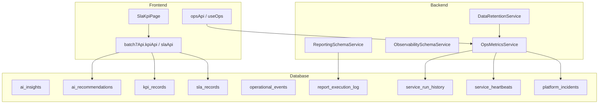
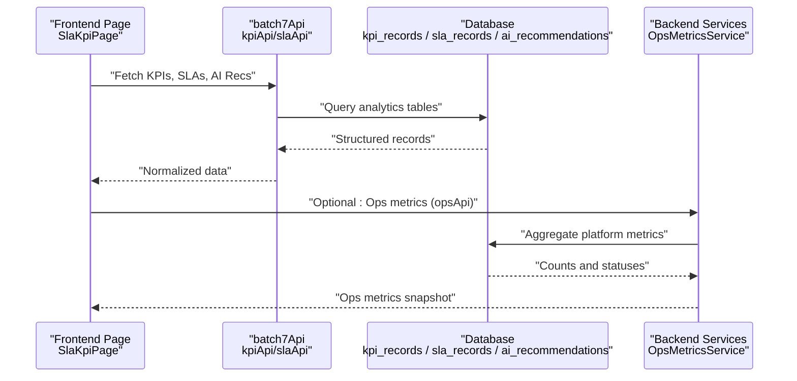
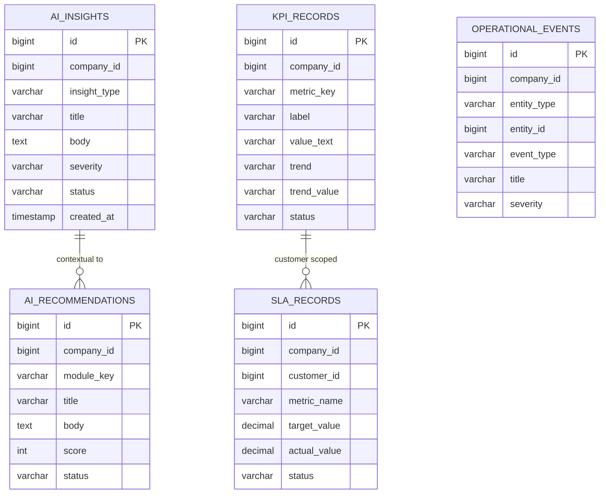
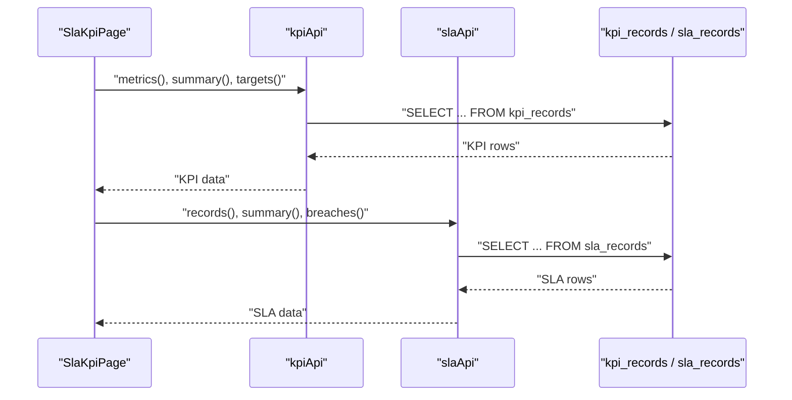
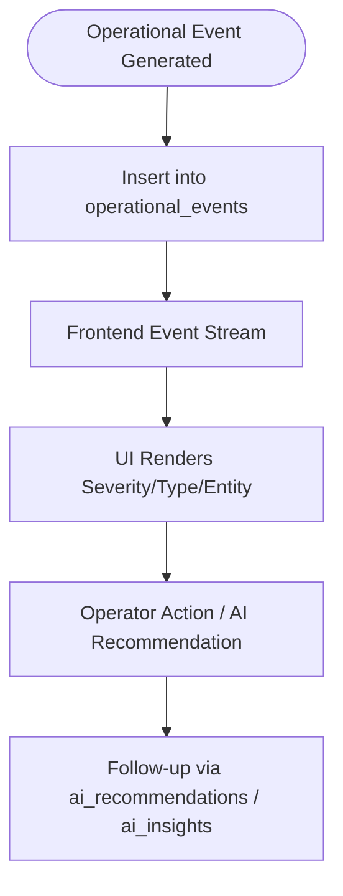
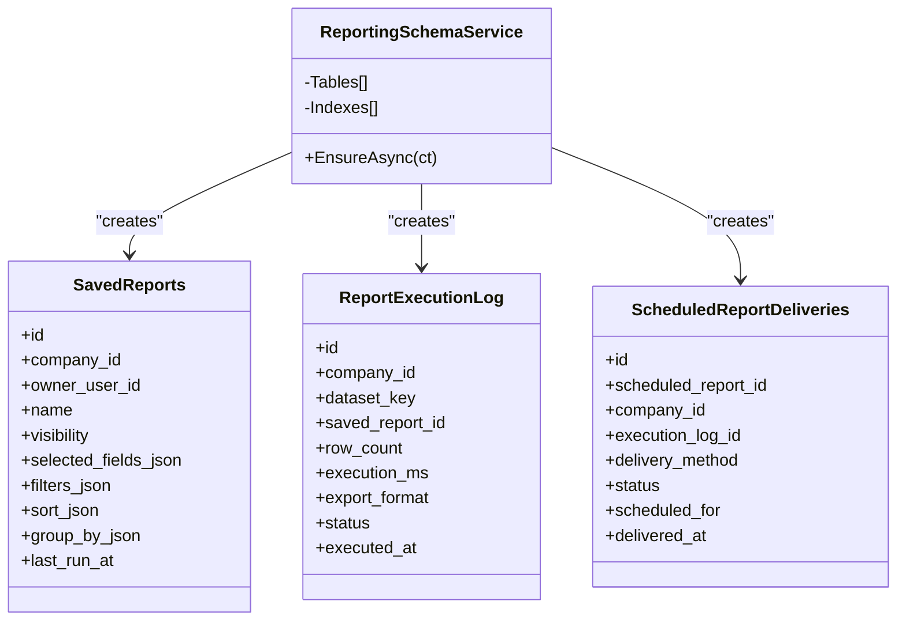
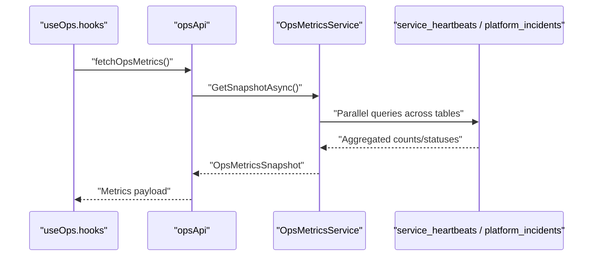
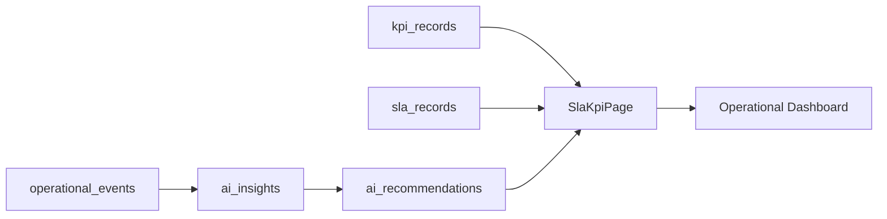
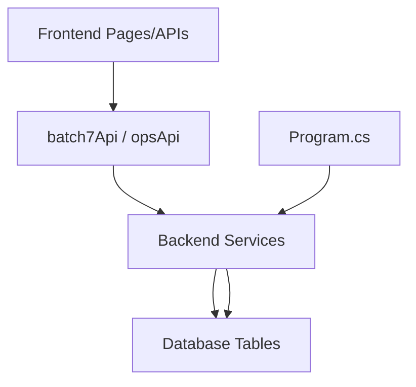

# Analytics & Intelligence Tables

<cite>
**Referenced Files in This Document**
- [001_schema.sql](file://db/init/001_schema.sql)
- [002_seed.sql](file://db/init/002_seed.sql)
- [batch7Api.ts](file://frontend/src/services/batch7Api.ts)
- [SlaKpiPage.tsx](file://frontend/src/pages/SlaKpiPage.tsx)
- [ReportingSchemaService.cs](file://backend-dotnet/Services/ReportingSchemaService.cs)
- [ObservabilitySchemaService.cs](file://backend-dotnet/Services/ObservabilitySchemaService.cs)
- [OpsMetricsService.cs](file://backend-dotnet/Services/OpsMetricsService.cs)
- [DataRetentionService.cs](file://backend-dotnet/Services/DataRetentionService.cs)
- [Program.cs](file://backend-dotnet/Program.cs)
- [opsApi.ts](file://frontend/src/services/opsApi.ts)
- [useOps.ts](file://frontend/src/hooks/useOps.ts)
</cite>

## Table of Contents
1. [Introduction](#introduction)
2. [Project Structure](#project-structure)
3. [Core Components](#core-components)
4. [Architecture Overview](#architecture-overview)
5. [Detailed Component Analysis](#detailed-component-analysis)
6. [Dependency Analysis](#dependency-analysis)
7. [Performance Considerations](#performance-considerations)
8. [Troubleshooting Guide](#troubleshooting-guide)
9. [Conclusion](#conclusion)

## Introduction
This document explains the analytics and AI-powered tables and systems in the platform, focusing on:
- AI insights and recommendations
- KPI and SLA monitoring
- Operational event logging
- Real-time and historical analytics
- Reporting datasets and schema extensions
- Performance optimization and data retention strategies

It synthesizes the schema definitions, frontend APIs, backend services, and operational observability to help both technical and non-technical readers understand how operational data is transformed into actionable intelligence.

## Project Structure
The analytics and intelligence features span three layers:
- Database schema with dedicated tables for AI insights, recommendations, KPIs, SLAs, and operational events
- Backend services that aggregate metrics, maintain observability, and enforce data retention
- Frontend APIs and pages that surface KPIs, SLAs, and AI recommendations for operators and analysts

**Diagram sources**
- [001_schema.sql:228-262](file://db/init/001_schema.sql#L228-L262)
- [002_seed.sql:290-344](file://db/init/002_seed.sql#L290-L344)
- [ReportingSchemaService.cs:46-114](file://backend-dotnet/Services/ReportingSchemaService.cs#L46-L114)
- [ObservabilitySchemaService.cs:16-90](file://backend-dotnet/Services/ObservabilitySchemaService.cs#L16-L90)
- [OpsMetricsService.cs:13-42](file://backend-dotnet/Services/OpsMetricsService.cs#L13-L42)
- [batch7Api.ts:51-76](file://frontend/src/services/batch7Api.ts#L51-L76)
- [SlaKpiPage.tsx:136-150](file://frontend/src/pages/SlaKpiPage.tsx#L136-L150)
- [opsApi.ts:161-188](file://frontend/src/services/opsApi.ts#L161-L188)
- [useOps.ts:25-38](file://frontend/src/hooks/useOps.ts#L25-L38)

**Section sources**
- [001_schema.sql:228-262](file://db/init/001_schema.sql#L228-L262)
- [002_seed.sql:290-344](file://db/init/002_seed.sql#L290-L344)
- [ReportingSchemaService.cs:46-114](file://backend-dotnet/Services/ReportingSchemaService.cs#L46-L114)
- [ObservabilitySchemaService.cs:16-90](file://backend-dotnet/Services/ObservabilitySchemaService.cs#L16-L90)
- [OpsMetricsService.cs:13-42](file://backend-dotnet/Services/OpsMetricsService.cs#L13-L42)
- [batch7Api.ts:51-76](file://frontend/src/services/batch7Api.ts#L51-L76)
- [SlaKpiPage.tsx:136-150](file://frontend/src/pages/SlaKpiPage.tsx#L136-L150)
- [opsApi.ts:161-188](file://frontend/src/services/opsApi.ts#L161-L188)
- [useOps.ts:25-38](file://frontend/src/hooks/useOps.ts#L25-L38)

## Core Components
- AI Insights and Recommendations
  - ai_insights: AI-generated intelligence items with severity and status
  - ai_recommendations: Actionable recommendations with scores and module keys
- KPI and SLA Monitoring
  - kpi_records: Organization-wide KPI snapshots with trends and status
  - sla_records: Customer SLA metrics with targets and actuals
- Operational Event Logging
  - operational_events: Live operational signals across entities
- Reporting and Observability
  - report_execution_log: Immutable audit trail of report runs
  - service_run_history and service_heartbeats: Background service execution logs
  - platform_incidents: Auto-created incidents for platform reliability
- Data Retention
  - DataRetentionService manages retention windows and legal hold policies

**Section sources**
- [001_schema.sql:228-262](file://db/init/001_schema.sql#L228-L262)
- [002_seed.sql:290-344](file://db/init/002_seed.sql#L290-L344)
- [ReportingSchemaService.cs:46-114](file://backend-dotnet/Services/ReportingSchemaService.cs#L46-L114)
- [ObservabilitySchemaService.cs:16-90](file://backend-dotnet/Services/ObservabilitySchemaService.cs#L16-L90)
- [DataRetentionService.cs:16-54](file://backend-dotnet/Services/DataRetentionService.cs#L16-L54)

## Architecture Overview
The analytics and intelligence architecture integrates real-time operational data with AI-driven insights and recommendations, exposing them through typed APIs and dashboards.

**Diagram sources**
- [SlaKpiPage.tsx:139-150](file://frontend/src/pages/SlaKpiPage.tsx#L139-L150)
- [batch7Api.ts:51-76](file://frontend/src/services/batch7Api.ts#L51-L76)
- [001_schema.sql:228-262](file://db/init/001_schema.sql#L228-L262)
- [OpsMetricsService.cs:13-42](file://backend-dotnet/Services/OpsMetricsService.cs#L13-L42)

## Detailed Component Analysis

### AI Insights and Recommendations
- ai_insights
  - Purpose: Store AI-generated insights with severity and status for triage and follow-up
  - Typical fields: insight_type, title, body, severity, status
- ai_recommendations
  - Purpose: Provide prioritized actions with scores and module associations
  - Typical fields: module_key, title, body, score, status
- Frontend integration
  - batch7Api exposes endpoints for KPI AI recommendations and SLA records
  - SlaKpiPage consumes these endpoints and renders KPIs with optional recommendations

**Diagram sources**
- [001_schema.sql:228-262](file://db/init/001_schema.sql#L228-L262)
- [002_seed.sql:290-344](file://db/init/002_seed.sql#L290-L344)

**Section sources**
- [001_schema.sql:228-262](file://db/init/001_schema.sql#L228-L262)
- [002_seed.sql:320-327](file://db/init/002_seed.sql#L320-L327)
- [batch7Api.ts:51-76](file://frontend/src/services/batch7Api.ts#L51-L76)
- [SlaKpiPage.tsx:126-153](file://frontend/src/pages/SlaKpiPage.tsx#L126-L153)

### KPI and SLA Monitoring
- kpi_records
  - Purpose: Capture organization KPIs with trend indicators and status
  - Typical fields: metric_key, label, value_text, trend, trend_value, status
- sla_records
  - Purpose: Track customer SLA performance against targets
  - Typical fields: customer_id, metric_name, target_value, actual_value, status
- Frontend consumption
  - SlaKpiPage aggregates KPI metrics, summaries, targets, and AI recommendations
  - batch7Api provides endpoints for KPI and SLA data

**Diagram sources**
- [SlaKpiPage.tsx:139-150](file://frontend/src/pages/SlaKpiPage.tsx#L139-L150)
- [batch7Api.ts:51-76](file://frontend/src/services/batch7Api.ts#L51-L76)
- [002_seed.sql:290-308](file://db/init/002_seed.sql#L290-L308)

**Section sources**
- [002_seed.sql:290-308](file://db/init/002_seed.sql#L290-L308)
- [batch7Api.ts:51-76](file://frontend/src/services/batch7Api.ts#L51-L76)
- [SlaKpiPage.tsx:139-150](file://frontend/src/pages/SlaKpiPage.tsx#L139-L150)

### Operational Event Logging and Real-Time Analytics
- operational_events
  - Purpose: Log live operational signals across vehicles, drivers, jobs, routes, and customers
  - Typical fields: entity_type, entity_id, event_type, title, severity
- Real-time ingestion
  - Frontend pages consume event streams and display live updates
  - Backend services maintain heartbeats and incident records for platform observability

**Diagram sources**
- [002_seed.sql:338-344](file://db/init/002_seed.sql#L338-L344)
- [001_schema.sql:228-262](file://db/init/001_schema.sql#L228-L262)

**Section sources**
- [002_seed.sql:338-344](file://db/init/002_seed.sql#L338-L344)
- [001_schema.sql:228-262](file://db/init/001_schema.sql#L228-L262)

### Reporting Dataset Structures and Schema Extensions
- ReportingSchemaService adds:
  - saved_reports: persisted report builder definitions with visibility controls
  - report_execution_log: immutable audit trail of report runs and exports
  - scheduled_report_deliveries: per-delivery records for scheduled runs
- Indexes support efficient filtering by company, dataset, and timestamps

**Diagram sources**
- [ReportingSchemaService.cs:10-114](file://backend-dotnet/Services/ReportingSchemaService.cs#L10-L114)

**Section sources**
- [ReportingSchemaService.cs:10-114](file://backend-dotnet/Services/ReportingSchemaService.cs#L10-L114)

### Observability and Platform Metrics
- ObservabilitySchemaService defines:
  - service_run_history: append-only per-cycle execution logs
  - service_heartbeats: periodic heartbeats and failure counters
  - platform_incidents: auto-created incidents for reliability
- OpsMetricsService aggregates platform-wide metrics from multiple domains (telemetry, alerts, safety, dispatch, notifications, reports, services, incidents, database)

**Diagram sources**
- [useOps.ts:25-38](file://frontend/src/hooks/useOps.ts#L25-L38)
- [opsApi.ts:161-164](file://frontend/src/services/opsApi.ts#L161-L164)
- [OpsMetricsService.cs:13-42](file://backend-dotnet/Services/OpsMetricsService.cs#L13-L42)
- [ObservabilitySchemaService.cs:16-90](file://backend-dotnet/Services/ObservabilitySchemaService.cs#L16-L90)

**Section sources**
- [ObservabilitySchemaService.cs:16-90](file://backend-dotnet/Services/ObservabilitySchemaService.cs#L16-L90)
- [OpsMetricsService.cs:13-42](file://backend-dotnet/Services/OpsMetricsService.cs#L13-L42)
- [opsApi.ts:161-188](file://frontend/src/services/opsApi.ts#L161-L188)
- [useOps.ts:25-38](file://frontend/src/hooks/useOps.ts#L25-L38)

### Data Aggregation Patterns and Historical Trend Analysis
- Aggregation patterns
  - Count-based summaries with time windows (e.g., last 24 hours)
  - Status-based rollups (open, critical, active)
  - Parallel execution of independent metrics queries
- Historical trend analysis
  - KPI trend fields (direction and delta) enable trend visualization
  - Report execution logs provide historical run statistics for scheduling and performance analysis

**Section sources**
- [OpsMetricsService.cs:46-83](file://backend-dotnet/Services/OpsMetricsService.cs#L46-L83)
- [OpsMetricsService.cs:140-160](file://backend-dotnet/Services/OpsMetricsService.cs#L140-L160)
- [002_seed.sql:298-308](file://db/init/002_seed.sql#L298-L308)
- [ReportingSchemaService.cs:72-87](file://backend-dotnet/Services/ReportingSchemaService.cs#L72-L87)

### Integration Between Operational Data and Analytical Insights
- operational_events feed real-time signals
- ai_recommendations and ai_insights provide AI-driven triage and actions
- KPI and SLA records contextualize performance against targets
- Frontend pages orchestrate these data sources into operator dashboards

**Diagram sources**
- [002_seed.sql:338-344](file://db/init/002_seed.sql#L338-L344)
- [002_seed.sql:310-327](file://db/init/002_seed.sql#L310-L327)
- [002_seed.sql:290-308](file://db/init/002_seed.sql#L290-L308)
- [SlaKpiPage.tsx:139-150](file://frontend/src/pages/SlaKpiPage.tsx#L139-L150)

**Section sources**
- [002_seed.sql:310-344](file://db/init/002_seed.sql#L310-L344)
- [SlaKpiPage.tsx:139-150](file://frontend/src/pages/SlaKpiPage.tsx#L139-L150)

## Dependency Analysis
- Frontend depends on typed APIs for KPIs, SLAs, and AI recommendations
- Backend services depend on database tables for metrics and observability
- Services are registered in Program.cs and orchestrated by DI

**Diagram sources**
- [Program.cs:31-58](file://backend-dotnet/Program.cs#L31-L58)
- [batch7Api.ts:51-76](file://frontend/src/services/batch7Api.ts#L51-L76)
- [opsApi.ts:161-188](file://frontend/src/services/opsApi.ts#L161-L188)

**Section sources**
- [Program.cs:31-58](file://backend-dotnet/Program.cs#L31-L58)
- [batch7Api.ts:51-76](file://frontend/src/services/batch7Api.ts#L51-L76)
- [opsApi.ts:161-188](file://frontend/src/services/opsApi.ts#L161-L188)

## Performance Considerations
- Parallel metric queries
  - OpsMetricsService executes independent queries concurrently to reduce latency
- Lightweight metrics
  - All platform metrics are counts and statuses; no PII or raw records
- Indexing and partitioning
  - Use appropriate indexes on time-series and foreign-key columns (e.g., event_time, tenant_id)
- Query windowing
  - Time-bound aggregations (e.g., last 24 hours) limit scan sizes
- Caching and polling intervals
  - Frontend uses controlled refetch intervals for live metrics

**Section sources**
- [OpsMetricsService.cs:15-42](file://backend-dotnet/Services/OpsMetricsService.cs#L15-L42)
- [useOps.ts:25-38](file://frontend/src/hooks/useOps.ts#L25-L38)

## Troubleshooting Guide
- Observability tables
  - service_heartbeats and platform_incidents help diagnose service health and reliability
- Metrics snapshot
  - OpsMetricsSnapshot includes database connectivity and latency for quick checks
- Data retention
  - DataRetentionService enforces policy boundaries and legal holds

**Section sources**
- [ObservabilitySchemaService.cs:16-90](file://backend-dotnet/Services/ObservabilitySchemaService.cs#L16-L90)
- [OpsMetricsService.cs:197-212](file://backend-dotnet/Services/OpsMetricsService.cs#L197-L212)
- [DataRetentionService.cs:16-54](file://backend-dotnet/Services/DataRetentionService.cs#L16-L54)

## Conclusion
The analytics and intelligence subsystem integrates operational events, AI insights and recommendations, KPI and SLA monitoring, and robust observability. It provides:
- Real-time dashboards and recommendations
- Historical trend analysis via structured records and execution logs
- Safe, policy-aware data retention
- Scalable, parallelized metrics aggregation

This foundation supports both day-to-day operations and strategic decision-making across fleets and customers.